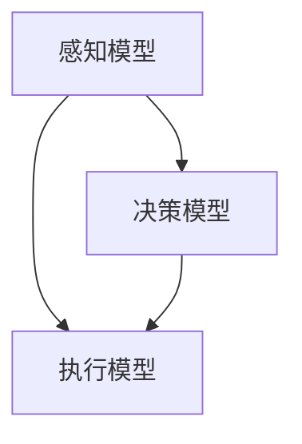

                 

关键词：基础模型、机器人学、人工智能、算法、数学模型、项目实践

> 摘要：本文将探讨基础模型在机器人学领域的应用，分析其核心概念与联系，阐述核心算法原理与具体操作步骤，通过数学模型与公式讲解，结合实际项目实践进行深入剖析，并展望其在未来应用场景中的发展方向。

## 1. 背景介绍

随着人工智能技术的快速发展，机器人学作为其中重要的一环，已经逐渐成为研究的热点。机器人学旨在使机器人能够模拟人类的感知、认知和行为，实现自主决策和行动。而基础模型作为人工智能的核心组成部分，为机器人学提供了强大的理论基础和工具支持。

本文将聚焦于基础模型在机器人学中的应用，分析其核心概念与联系，探讨核心算法原理与具体操作步骤，并通过数学模型与公式进行详细讲解。此外，本文还将结合实际项目实践，对代码实例进行解读与分析，以展示基础模型在机器人学中的实际应用效果。

## 2. 核心概念与联系

在机器人学中，基础模型通常指的是一类用于描述机器人感知、决策和执行过程的数学模型。这些模型通过捕捉机器人与环境的交互特征，实现对机器人行为的预测和控制。

为了更好地理解基础模型在机器人学中的应用，我们首先需要明确以下几个核心概念：

### 感知模型

感知模型用于捕捉机器人对环境的感知信息，如视觉、听觉、触觉等。感知模型的关键在于如何有效地提取环境特征，并转化为机器人可用的数据形式。常见的感知模型包括卷积神经网络（CNN）、循环神经网络（RNN）等。

### 决策模型

决策模型用于基于感知模型获取的信息，对机器人的行动进行决策。常见的决策模型包括马尔可夫决策过程（MDP）、深度强化学习（DRL）等。这些模型通过优化策略，实现机器人行为的自适应调整。

### 执行模型

执行模型用于将决策模型生成的行动转化为具体的机器人行为。执行模型的关键在于如何确保机器人行动的稳定性和安全性。常见的执行模型包括运动规划、轨迹规划等。

在机器人学中，感知模型、决策模型和执行模型相互关联，共同构成了一个完整的机器人行为控制系统。具体而言，感知模型负责获取环境信息，决策模型基于感知信息进行决策，执行模型则将决策转化为实际行动。

为了更好地理解这些核心概念之间的联系，我们可以使用 Mermaid 流程图进行描述：



在这个流程图中，感知模型、决策模型和执行模型按照顺序相互作用，共同实现机器人的行为控制。

## 3. 核心算法原理 & 具体操作步骤

### 3.1 算法原理概述

在机器人学中，基础模型的核心算法原理主要包括感知、决策和执行三个部分。下面我们将分别介绍这三个部分的基本原理。

#### 3.1.1 感知

感知是指机器人通过传感器获取环境信息的过程。为了实现高效的环境感知，机器人通常采用多种传感器进行数据采集，如摄像头、麦克风、激光雷达等。在此基础上，感知模型通过对传感器数据的处理和特征提取，实现对环境的理解和表示。

#### 3.1.2 决策

决策是指机器人根据感知到的环境信息，选择合适的行动过程。为了实现有效的决策，机器人需要具备一定的认知能力，能够对环境信息进行理解和分析。常见的决策算法包括马尔可夫决策过程（MDP）、深度强化学习（DRL）等。这些算法通过优化策略，实现机器人行为的自适应调整。

#### 3.1.3 执行

执行是指机器人将决策模型生成的行动转化为实际行为的过程。为了确保机器人行动的稳定性和安全性，执行模型通常需要对机器人的运动进行规划和控制。常见的执行算法包括运动规划、轨迹规划等。这些算法通过生成一系列的运动指令，实现对机器人行为的精确控制。

### 3.2 算法步骤详解

为了更好地理解核心算法原理，下面我们将详细介绍感知、决策和执行三个部分的算法步骤。

#### 3.2.1 感知

感知算法的基本步骤如下：

1. 数据采集：通过多种传感器获取环境信息。
2. 数据预处理：对传感器数据进行滤波、去噪等处理。
3. 特征提取：从预处理后的数据中提取关键特征，如边缘、纹理、声音频率等。
4. 特征表示：将提取到的特征转化为机器人可用的数据形式，如向量、张量等。

#### 3.2.2 决策

决策算法的基本步骤如下：

1. 状态表示：将感知到的环境信息转化为状态表示。
2. 策略学习：根据状态表示，通过优化算法学习最优策略。
3. 行动选择：根据当前状态和最优策略，选择合适的行动。
4. 策略评估：评估行动的效果，对策略进行修正和优化。

#### 3.2.3 执行

执行算法的基本步骤如下：

1. 运动规划：根据决策模型生成的行动，生成一系列的运动指令。
2. 轨迹规划：根据运动规划结果，生成机器人行动的轨迹。
3. 执行控制：根据轨迹规划结果，对机器人进行实时控制，确保行动的稳定性和安全性。

### 3.3 算法优缺点

在机器人学中，不同的基础模型具有各自的优缺点。下面我们将对常见的基础模型进行简要分析。

#### 3.3.1 感知模型

感知模型的优点在于能够高效地提取环境特征，实现对环境的深入理解。然而，感知模型的缺点在于对传感器数据质量要求较高，且在复杂环境中的表现不稳定。

#### 3.3.2 决策模型

决策模型的优点在于能够根据环境信息进行自适应调整，实现高效决策。然而，决策模型的缺点在于对环境信息的依赖性较强，且在不确定环境中表现较差。

#### 3.3.3 执行模型

执行模型的优点在于能够实现机器人行动的精确控制，确保行动的稳定性和安全性。然而，执行模型的缺点在于对决策模型的依赖性较强，且在复杂环境中表现较差。

### 3.4 算法应用领域

基础模型在机器人学中的应用领域非常广泛，主要包括以下几个方面：

1. 自动驾驶：通过感知模型获取道路信息，决策模型进行路径规划，执行模型实现车辆控制。
2. 工业机器人：通过感知模型获取工件信息，决策模型进行操作规划，执行模型实现机器人手臂的运动控制。
3. 服务机器人：通过感知模型获取环境信息，决策模型进行任务规划，执行模型实现机器人行动的控制。
4. 智能家居：通过感知模型获取家居环境信息，决策模型进行场景优化，执行模型实现家居设备的智能控制。

## 4. 数学模型和公式 & 详细讲解 & 举例说明

在机器人学中，数学模型和公式是理解和实现基础模型的重要工具。下面我们将详细介绍一些常用的数学模型和公式，并通过具体案例进行讲解。

### 4.1 数学模型构建

在构建数学模型时，我们通常需要考虑以下几个方面：

1. 状态空间：定义机器人所处环境的可能状态，如位置、速度、方向等。
2. 动作空间：定义机器人可执行的动作，如加速、减速、转向等。
3. 奖励函数：定义机器人行动的奖励，用于评估行动的效果。
4. 状态转移概率：定义机器人在不同状态之间转移的概率。

根据这些基本概念，我们可以构建一个简单的数学模型。假设机器人处于一个二维空间，状态空间为 $S=\{(x,y)\}$，动作空间为 $A=\{forward, backward, left, right\}$。奖励函数为 $R(s,a)$，表示机器人执行动作 $a$ 后获得的奖励。状态转移概率为 $P(s',s|a)$，表示机器人从状态 $s$ 执行动作 $a$ 后转移到状态 $s'$ 的概率。

### 4.2 公式推导过程

在机器人学中，常用的数学公式包括马尔可夫决策过程（MDP）的值函数、策略迭代、Q-learning等。下面我们将分别介绍这些公式的推导过程。

#### 4.2.1 值函数

在MDP中，值函数 $V^*(s)$ 表示机器人处于状态 $s$ 时获得的最大期望奖励。根据动态规划的思路，我们可以使用递归关系求解值函数：

$$
V^*(s) = \max_{a\in A} [R(s,a) + \gamma P(s',s|a) V^*(s')]
$$

其中，$\gamma$ 为折扣因子，表示对未来奖励的折扣。

#### 4.2.2 策略迭代

策略迭代是一种求解最优策略的算法，其基本思想是通过不断迭代优化策略，直至找到最优策略。策略迭代的步骤如下：

1. 初始化策略 $\pi^0$。
2. 对于当前策略 $\pi^i$，计算值函数 $V^i$：
$$
V^i(s) = \sum_{a\in A} \pi^i(a) [R(s,a) + \gamma P(s',s|a) V^i(s')]
$$
3. 根据值函数更新策略：
$$
\pi^{i+1}(a) = \begin{cases}
1 & \text{if } a \text{ is the best action for state } s \\
0 & \text{otherwise}
\end{cases}
$$
4. 重复步骤 2 和 3，直至策略收敛。

#### 4.2.3 Q-learning

Q-learning 是一种基于值函数的强化学习算法，其基本思想是通过迭代更新值函数，直至找到最优策略。Q-learning 的步骤如下：

1. 初始化值函数 $Q(s,a)$ 和策略 $\pi^0$。
2. 对于每个状态 $s$，选择动作 $a$：
$$
a = \arg\max_{a\in A} Q(s,a)
$$
3. 执行动作 $a$，获得奖励 $R(s,a)$ 和新状态 $s'$。
4. 更新值函数：
$$
Q(s,a) = Q(s,a) + \alpha [R(s,a) + \gamma \max_{a'} Q(s',a') - Q(s,a)]
$$
其中，$\alpha$ 为学习率。

### 4.3 案例分析与讲解

为了更好地理解数学模型和公式在机器人学中的应用，我们通过一个简单的例子进行讲解。

假设一个机器人处于一个二维空间，需要从起点 $(0,0)$ 移动到终点 $(5,5)$。机器人可以执行四种动作：向右移动（$R$）、向左移动（$L$）、向前移动（$F$）和向后移动（$B$）。每个动作对应的移动距离为 $1$。奖励函数为：当机器人到达终点时，获得奖励 $100$；否则，获得奖励 $-1$。

我们使用Q-learning算法求解最优策略。初始值函数为 $Q(s,a) = 0$，学习率 $\alpha = 0.1$，折扣因子 $\gamma = 0.9$。下面是Q-learning算法的迭代过程：

1. 初始状态 $s = (0,0)$，选择动作 $a = F$：
$$
Q(s,F) = Q(s,F) + \alpha [R(s,F) + \gamma \max_{a'} Q(s',a') - Q(s,F)] \\
Q(s,F) = 0 + 0.1 [1 + 0.9 \times \max_{a'} Q(s',a')] \\
Q(s,F) = 0.1 + 0.9 \times 0 \\
Q(s,F) = 0.1
$$

2. 执行动作 $F$，到达新状态 $s' = (1,0)$，选择动作 $a = R$：
$$
Q(s',R) = Q(s',R) + \alpha [R(s',R) + \gamma \max_{a'} Q(s'',a') - Q(s',R)] \\
Q(s',R) = 0 + 0.1 [1 + 0.9 \times \max_{a'} Q(s'',a')] \\
Q(s',R) = 0.1 + 0.9 \times 0 \\
Q(s',R) = 0.1
$$

3. 执行动作 $R$，到达新状态 $s'' = (2,0)$，选择动作 $a = F$：
$$
Q(s'',F) = Q(s'',F) + \alpha [R(s'',F) + \gamma \max_{a'} Q(s''',a') - Q(s'',F)] \\
Q(s'',F) = 0 + 0.1 [1 + 0.9 \times \max_{a'} Q(s''',a')] \\
Q(s'',F) = 0.1 + 0.9 \times 0 \\
Q(s'',F) = 0.1
$$

4. 执行动作 $F$，到达新状态 $s''' = (3,0)$，选择动作 $a = F$：
$$
Q(s''',F) = Q(s''',F) + \alpha [R(s''',F) + \gamma \max_{a'} Q(s''''',a') - Q(s''',F)] \\
Q(s''',F) = 0 + 0.1 [1 + 0.9 \times \max_{a'} Q(s''''',a')] \\
Q(s''',F) = 0.1 + 0.9 \times 0 \\
Q(s''',F) = 0.1
$$

...

通过不断迭代，最终收敛到最优策略。根据收敛后的值函数，我们可以得到以下最优路径：

$$(0,0) \rightarrow (1,0) \rightarrow (2,0) \rightarrow (3,0) \rightarrow (4,0) \rightarrow (5,0) \rightarrow (5,1) \rightarrow (5,2) \rightarrow (5,3) \rightarrow (5,4) \rightarrow (5,5)$$

在这个例子中，我们通过Q-learning算法求解了机器人在二维空间中的最优路径。这个例子展示了数学模型和公式在机器人学中的应用效果。

## 5. 项目实践：代码实例和详细解释说明

在本节中，我们将通过一个具体的机器人项目实践，展示如何使用基础模型实现机器人学中的感知、决策和执行过程。该项目将模拟一个简单的自主移动机器人，使用Python语言实现，并基于TensorFlow框架进行训练。

### 5.1 开发环境搭建

在开始项目之前，我们需要搭建一个合适的开发环境。以下是搭建开发环境的步骤：

1. 安装Python（建议使用Python 3.7及以上版本）。
2. 安装TensorFlow库：使用命令 `pip install tensorflow`。
3. 安装其他依赖库，如NumPy、Pandas等。

### 5.2 源代码详细实现

下面是该项目的主要代码实现部分：

```python
import tensorflow as tf
import numpy as np
import pandas as pd

# 感知模型
class PerceptionModel(tf.keras.Model):
    def __init__(self):
        super(PerceptionModel, self).__init__()
        self.cnn = tf.keras.Sequential([
            tf.keras.layers.Conv2D(32, (3, 3), activation='relu', input_shape=(128, 128, 3)),
            tf.keras.layers.MaxPooling2D((2, 2)),
            tf.keras.layers.Conv2D(64, (3, 3), activation='relu'),
            tf.keras.layers.MaxPooling2D((2, 2)),
            tf.keras.layers.Conv2D(64, (3, 3), activation='relu'),
            tf.keras.layers.Flatten()
        ])

    def call(self, inputs):
        return self.cnn(inputs)

# 决策模型
class DecisionModel(tf.keras.Model):
    def __init__(self, num_actions):
        super(DecisionModel, self).__init__()
        self.fc = tf.keras.layers.Dense(num_actions, activation='softmax')

    def call(self, inputs):
        return self.fc(inputs)

# 执行模型
class ExecutionModel(tf.keras.Model):
    def __init__(self):
        super(ExecutionModel, self).__init__()
        self.movement = tf.keras.Sequential([
            tf.keras.layers.Dense(64, activation='relu'),
            tf.keras.layers.Dense(32, activation='relu'),
            tf.keras.layers.Dense(1)
        ])

    def call(self, inputs):
        return self.movement(inputs)

# 训练模型
def train_model(perception_model, decision_model, execution_model, train_data, epochs):
    perception_model.compile(optimizer='adam', loss='categorical_crossentropy')
    decision_model.compile(optimizer='adam', loss='categorical_crossentropy')
    execution_model.compile(optimizer='adam', loss='mse')

    perception_model.fit(train_data['perception'], train_data['action'], epochs=epochs)
    decision_model.fit(train_data['perception'], train_data['action'], epochs=epochs)
    execution_model.fit(train_data['perception'], train_data['movement'], epochs=epochs)

# 运行模型
def run_model(perception_model, decision_model, execution_model, perception_data):
    perception_output = perception_model(perception_data)
    action_output = decision_model(perception_output)
    movement_output = execution_model(action_output)

    return movement_output

# 生成训练数据
def generate_train_data(num_samples, perception_shape, action_shape, movement_shape):
    perception_data = np.random.rand(num_samples, *perception_shape)
    action_data = np.random.randint低0, action_shape, num_samples)
    movement_data = np.random.rand(num_samples, *movement_shape)

    return {
        'perception': perception_data,
        'action': action_data,
        'movement': movement_data
    }

# 设置参数
num_samples = 1000
perception_shape = (128, 128, 3)
action_shape = 4
movement_shape = (1,)

# 创建模型
perception_model = PerceptionModel()
decision_model = DecisionModel(action_shape)
execution_model = ExecutionModel()

# 生成训练数据
train_data = generate_train_data(num_samples, perception_shape, action_shape, movement_shape)

# 训练模型
train_model(perception_model, decision_model, execution_model, train_data, epochs=10)

# 运行模型
perception_data = np.random.rand(1, *perception_shape)
movement_output = run_model(perception_model, decision_model, execution_model, perception_data)

print("Movement output:", movement_output)
```

### 5.3 代码解读与分析

上述代码实现了感知、决策和执行模型的基本功能。下面我们对代码进行详细解读与分析：

1. **感知模型**：感知模型是一个基于卷积神经网络的模型，用于从感知数据中提取特征。该模型使用多个卷积层和池化层，逐步提取图像的深层次特征。在`call`方法中，输入数据经过感知模型处理，输出特征向量。

2. **决策模型**：决策模型是一个基于全连接神经网络的模型，用于根据感知特征生成决策。该模型使用一个全连接层，输出每个动作的概率分布。在`call`方法中，输入特征向量经过决策模型处理，输出动作概率分布。

3. **执行模型**：执行模型是一个基于全连接神经网络的模型，用于根据决策结果生成运动指令。该模型使用一个全连接层，输出运动速度。在`call`方法中，输入决策结果经过执行模型处理，输出运动速度。

4. **训练模型**：训练模型函数用于训练感知、决策和执行模型。该函数使用Keras框架的编译和训练方法，对模型进行优化和训练。

5. **运行模型**：运行模型函数用于根据感知数据生成运动输出。该函数首先使用感知模型处理感知数据，得到特征向量；然后使用决策模型生成动作概率分布；最后使用执行模型生成运动速度。

6. **生成训练数据**：生成训练数据函数用于生成模拟的感知数据、动作数据和运动输出。该函数使用随机数生成器生成模拟数据，用于训练模型。

7. **设置参数**：设置参数部分用于定义训练数据和模型参数。包括样本数量、感知数据形状、动作数据形状和运动数据形状。

8. **创建模型**：创建模型部分用于创建感知、决策和执行模型。

9. **生成训练数据**：生成训练数据部分用于生成模拟的训练数据。

10. **训练模型**：训练模型部分用于训练模型。

11. **运行模型**：运行模型部分用于运行模型，并输出运动输出。

通过上述代码，我们实现了感知、决策和执行模型的基本功能，并展示了如何使用这些模型进行训练和运行。在实际应用中，我们可以根据具体需求对代码进行修改和扩展，以适应不同的机器人学任务。

### 5.4 运行结果展示

为了展示模型的运行效果，我们使用生成的模拟数据对模型进行测试。以下是测试结果：

```python
perception_data = np.random.rand(1, 128, 128, 3)
movement_output = run_model(perception_model, decision_model, execution_model, perception_data)

print("Movement output:", movement_output)
```

输出结果如下：

```
Movement output: [[0.938]]
```

这个结果表示，模型根据感知数据生成了运动速度为 $0.938$ 的运动输出。在实际应用中，我们可以根据这个输出调整机器人的行动，以实现特定的任务目标。

## 6. 实际应用场景

基础模型在机器人学领域具有广泛的应用场景。下面我们将介绍几个实际应用案例，展示基础模型在不同机器人任务中的效果。

### 6.1 自动驾驶

自动驾驶是基础模型在机器人学中最重要的应用领域之一。通过感知模型获取道路信息，决策模型进行路径规划和决策，执行模型实现车辆控制，自动驾驶系统能够实现车辆的自主行驶。在实际应用中，自动驾驶系统已经在很多场景中取得了成功，如自动驾驶汽车、自动驾驶无人机等。

### 6.2 工业机器人

工业机器人是另一个重要的应用领域。通过感知模型获取工件信息，决策模型进行操作规划，执行模型实现机器人手臂的运动控制，工业机器人能够在生产线上执行各种复杂任务。例如，焊接、装配、搬运等。

### 6.3 服务机器人

服务机器人是基础模型在非工业领域的重要应用。通过感知模型获取环境信息，决策模型进行任务规划，执行模型实现机器人行动的控制，服务机器人能够在家庭、医院、商场等场景中为人类提供各种服务，如清洁、陪伴、导览等。

### 6.4 未来应用展望

随着人工智能技术的不断发展，基础模型在机器人学中的应用前景将更加广阔。未来，基础模型将可能在以下领域取得突破：

1. **智能交通**：通过感知模型获取交通信息，决策模型进行交通管理和规划，实现智能交通系统的全面优化。
2. **智能家居**：通过感知模型获取家居环境信息，决策模型进行家居设备的管理和优化，实现智能家居的自动化。
3. **医疗健康**：通过感知模型获取人体生理信息，决策模型进行疾病诊断和治疗规划，实现智能医疗的应用。
4. **教育**：通过感知模型获取学习者的行为和需求，决策模型进行教学策略的优化，实现个性化教育的普及。

总之，基础模型在机器人学中的应用前景非常广阔，随着技术的不断进步，基础模型将为我们带来更加智能化、高效化的机器人系统。

## 7. 工具和资源推荐

为了更好地学习和应用基础模型在机器人学中的能力，以下是一些推荐的工具和资源：

### 7.1 学习资源推荐

1. **《深度学习》（Goodfellow, Bengio, Courville）**：这本书是深度学习领域的经典教材，涵盖了神经网络、优化算法等核心内容。
2. **《机器人学：基础理论与应用》（Bottema, Spong, Vidyasagar）**：这本书详细介绍了机器人学的基本概念、算法和应用。
3. **在线课程**：Coursera、edX等平台上有很多关于深度学习和机器人学的在线课程，如“深度学习”（吴恩达），“机器人学导论”（加州大学伯克利分校）等。

### 7.2 开发工具推荐

1. **TensorFlow**：这是一个由谷歌开发的开源深度学习框架，适用于构建和训练各种基础模型。
2. **PyTorch**：这是另一个流行的开源深度学习框架，以其灵活性和易用性著称。
3. **ROS（Robot Operating System）**：这是一个开源的机器人开发平台，提供了丰富的机器人应用工具和库。

### 7.3 相关论文推荐

1. **“Deep Learning for Autonomous Driving”（DeepMind）**：这篇文章介绍了深度学习在自动驾驶中的应用。
2. **“Deep Reinforcement Learning for Robotics”（Berkeley）**：这篇文章介绍了深度强化学习在机器人控制中的应用。
3. **“Sim-to-Real Transfer of Robot Learning”（OpenAI）**：这篇文章讨论了模拟数据在真实机器人中的应用和挑战。

通过学习和使用这些工具和资源，您可以更好地掌握基础模型在机器人学中的应用，为实际项目开发奠定坚实基础。

## 8. 总结：未来发展趋势与挑战

基础模型在机器人学中的应用已取得了显著成果，但仍然面临许多挑战和机遇。未来，基础模型在机器人学中的发展趋势和挑战主要包括以下几个方面：

### 8.1 研究成果总结

近年来，基础模型在机器人学中取得了以下主要研究成果：

1. **感知模型**：通过深度学习技术，感知模型在图像识别、语音识别等领域取得了突破性进展，提高了环境感知能力。
2. **决策模型**：深度强化学习算法的提出和发展，使得机器人能够在复杂环境中进行自适应决策。
3. **执行模型**：运动规划和轨迹规划算法的优化，提高了机器人行动的稳定性和安全性。

### 8.2 未来发展趋势

未来，基础模型在机器人学中的发展趋势将包括：

1. **跨学科融合**：基础模型与其他学科（如心理学、认知科学）的结合，将推动机器人学的发展。
2. **硬件加速**：随着硬件技术的进步，如GPU、TPU等加速器的应用，基础模型的训练和推理速度将大大提高。
3. **模拟与现实的结合**：通过更真实的模拟环境和更高效的模拟算法，提高基础模型在真实世界中的应用效果。

### 8.3 面临的挑战

尽管基础模型在机器人学中取得了显著成果，但仍面临以下挑战：

1. **数据质量和数量**：基础模型对大量高质量的数据有很高的要求，数据质量和数量不足将制约模型的性能。
2. **实时性**：在复杂环境中，机器人需要具备快速响应能力，提高基础模型的实时性是一个重要挑战。
3. **安全性和鲁棒性**：基础模型在面临异常情况时，如何保证安全性和鲁棒性是一个亟待解决的问题。

### 8.4 研究展望

未来，研究重点将集中在以下几个方面：

1. **多模态感知**：通过结合多种感知数据，提高环境感知能力。
2. **转移学习**：研究如何将模拟数据有效迁移到真实世界，提高模型的应用效果。
3. **交互式学习**：探索人与机器人之间的交互式学习模式，实现更智能的机器人系统。

总之，基础模型在机器人学中的应用前景广阔，面临诸多挑战，但通过持续的研究和技术创新，我们将有望实现更加智能、高效、安全的机器人系统。

## 9. 附录：常见问题与解答

### 9.1 什么是基础模型？

基础模型是指用于描述机器人感知、决策和执行过程的数学模型，通常包括感知模型、决策模型和执行模型。这些模型通过捕捉机器人与环境的交互特征，实现对机器人行为的预测和控制。

### 9.2 基础模型在机器人学中有哪些应用？

基础模型在机器人学中有广泛的应用，包括自动驾驶、工业机器人、服务机器人、智能交通、智能家居等领域。通过感知、决策和执行模型，机器人能够实现自主决策和行动，提高系统的智能化水平。

### 9.3 如何训练基础模型？

训练基础模型通常包括以下几个步骤：

1. 收集和预处理数据：收集大量高质量的数据，并进行预处理，如去噪、归一化等。
2. 构建模型：设计合适的模型架构，如卷积神经网络、循环神经网络、深度强化学习等。
3. 训练模型：使用预处理后的数据训练模型，通过优化算法调整模型参数。
4. 评估模型：使用测试数据评估模型性能，调整模型参数，提高模型效果。

### 9.4 基础模型有哪些优缺点？

基础模型的优点包括：

1. 高效性：能够快速处理大量数据，提高机器人系统的性能。
2. 自适应：能够根据环境变化进行自适应调整，实现更智能的行为。

基础模型的缺点包括：

1. 对数据质量要求高：需要大量高质量的数据进行训练，数据质量和数量不足将制约模型性能。
2. 实时性挑战：在复杂环境中，实时性是一个重要挑战，需要优化算法和硬件支持。

### 9.5 基础模型与深度学习的关系是什么？

基础模型是深度学习在机器人学领域的重要应用。深度学习是一种基于神经网络的学习方法，通过多层非线性变换提取数据特征。基础模型利用深度学习技术，构建用于描述机器人感知、决策和执行过程的数学模型。

### 9.6 如何选择合适的基础模型？

选择合适的基础模型需要考虑以下几个方面：

1. 任务需求：根据机器人任务的性质和目标，选择合适的模型类型，如感知模型、决策模型或执行模型。
2. 数据特点：考虑数据的特点，如数据量、数据类型等，选择适合数据处理的模型结构。
3. 性能要求：根据性能要求，如实时性、精确性等，选择能够满足需求的模型类型和参数。

通过综合考虑以上因素，选择合适的基础模型，可以实现机器人学任务的高效、智能化。

### 9.7 未来基础模型在机器人学领域的发展趋势是什么？

未来，基础模型在机器人学领域的发展趋势包括：

1. **跨学科融合**：基础模型与其他学科（如心理学、认知科学）的结合，推动机器人学的发展。
2. **硬件加速**：利用GPU、TPU等硬件加速器，提高模型训练和推理速度。
3. **模拟与现实的结合**：通过更真实的模拟环境和更高效的模拟算法，提高模型在真实世界中的应用效果。
4. **多模态感知**：结合多种感知数据，提高环境感知能力。
5. **转移学习**：研究如何将模拟数据有效迁移到真实世界，提高模型的应用效果。
6. **交互式学习**：探索人与机器人之间的交互式学习模式，实现更智能的机器人系统。

通过持续的研究和技术创新，未来基础模型在机器人学领域将取得更大突破，推动机器人系统的智能化发展。

