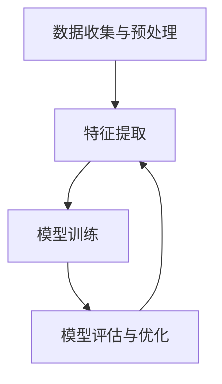

                 

### 摘要 Summary

本文旨在探讨基础模型在社会中的深远影响及其治理的必要性。随着人工智能技术的快速发展，基础模型已经成为现代技术的重要支柱，贯穿于我们的日常生活、工作以及娱乐等领域。本文首先介绍了基础模型的定义和基本原理，随后分析了其在各个行业中的应用及其带来的变革。在此基础上，本文重点讨论了基础模型的社会影响，包括对就业市场、隐私保护、公平性以及伦理道德等方面的挑战。为了应对这些挑战，本文提出了几项治理措施，并展望了基础模型在未来社会中的发展趋势与方向。

### 关键词 Keywords

- 基础模型
- 社会影响
- 治理
- 人工智能
- 伦理道德
- 隐私保护

### 1. 背景介绍 Introduction

人工智能（Artificial Intelligence, AI）作为21世纪最具革命性的技术之一，已经渗透到我们生活的方方面面。而基础模型（Fundamental Models）作为人工智能的核心组件，承载着将大量数据转化为有用信息、辅助决策、创新应用等重任。基础模型是指通过大量数据训练得到，具备特定功能和应用场景的模型，如语音识别、图像处理、自然语言处理等。这些模型不仅提升了传统数据处理方法的效率，还开辟了新的应用领域，极大地推动了科技进步和社会发展。

然而，基础模型的发展也带来了诸多挑战。首先，随着模型的复杂性和规模不断增加，对计算资源的需求也显著提升，导致能源消耗和成本上升。其次，基础模型的训练和优化过程高度依赖海量数据，而数据的收集和存储涉及到隐私保护和数据安全等问题。此外，基础模型在应用过程中可能引发伦理道德争议，例如歧视、透明度不足等问题。因此，如何合理利用和管理基础模型，成为当前亟需解决的重要课题。

### 2. 核心概念与联系 Core Concepts and Relationships

#### 2.1 定义 Definition

基础模型是指通过机器学习技术训练得到的，能够实现特定功能或任务的模型。这些模型通常基于大量数据集进行训练，以最大化模型的预测准确性和泛化能力。

#### 2.2 基本原理 Basic Principles

基础模型的构建通常分为以下几个步骤：

1. 数据收集与预处理：收集大量相关数据，并进行清洗、去噪、归一化等预处理操作。
2. 特征提取：将原始数据转换为适合模型训练的特征向量。
3. 模型训练：通过优化算法（如梯度下降、随机梯度下降等）训练模型参数。
4. 模型评估与优化：使用验证集评估模型性能，并根据评估结果调整模型参数。

#### 2.3 架构 Architecture

基础模型的核心架构通常包括以下几个部分：

1. 输入层（Input Layer）：接收外部输入数据。
2. 隐藏层（Hidden Layers）：对输入数据进行特征提取和变换。
3. 输出层（Output Layer）：生成预测结果或分类标签。

#### 2.4 Mermaid 流程图 Mermaid Flowchart



### 3. 核心算法原理 & 具体操作步骤 Core Algorithm Principles & Detailed Steps

#### 3.1 算法原理概述 Overview of Algorithm Principles

基础模型的算法原理主要涉及以下几个方面：

1. **机器学习基础**：包括线性回归、逻辑回归、决策树、随机森林等基本算法。
2. **深度学习框架**：如TensorFlow、PyTorch等，提供了丰富的神经网络模型和训练工具。
3. **优化算法**：如梯度下降、随机梯度下降、Adam等，用于调整模型参数以优化性能。

#### 3.2 算法步骤详解 Detailed Steps of Algorithm

1. **数据收集与预处理**：

   - 收集相关领域的数据集，如医疗影像、自然语言文本、金融数据等。
   - 对数据进行清洗、去噪、归一化等预处理操作，以提高数据质量。

2. **特征提取**：

   - 根据数据类型和应用场景，选择合适的特征提取方法，如文本处理（Word2Vec、BERT等）或图像处理（卷积神经网络、生成对抗网络等）。

3. **模型训练**：

   - 选择合适的机器学习或深度学习模型，并通过调整超参数（如学习率、批量大小等）进行训练。
   - 使用优化算法（如梯度下降、Adam等）调整模型参数，以最小化损失函数。

4. **模型评估与优化**：

   - 使用验证集评估模型性能，如准确率、召回率、F1值等。
   - 根据评估结果调整模型参数，优化模型性能。

#### 3.3 算法优缺点 Advantages and Disadvantages of Algorithm

**优点**：

- 高效处理大规模数据：基础模型能够快速处理和分析大量数据，提高工作效率。
- 泛化能力强：通过训练，模型可以适应不同的应用场景，具有较好的泛化能力。

**缺点**：

- 数据依赖性强：基础模型的训练高度依赖高质量的数据集，数据缺失或错误可能导致模型性能下降。
- 难以解释：深度学习模型具有较高的复杂性，其内部决策过程难以解释，可能引发伦理道德问题。

#### 3.4 算法应用领域 Application Fields of Algorithm

基础模型广泛应用于各个领域，如：

- **医疗健康**：用于疾病诊断、药物研发、健康监测等。
- **金融科技**：用于风险管理、信用评估、投资决策等。
- **自动驾驶**：用于车辆检测、障碍物识别、路径规划等。
- **自然语言处理**：用于机器翻译、情感分析、文本生成等。

### 4. 数学模型和公式 Mathematical Models and Formulas

#### 4.1 数学模型构建 Construction of Mathematical Models

在基础模型的训练过程中，常用的数学模型包括线性回归、逻辑回归、神经网络等。以下分别介绍这些模型的构建过程。

**线性回归**：

线性回归模型表示为：

$$ y = wx + b $$

其中，$y$ 表示输出值，$w$ 表示权重，$x$ 表示输入值，$b$ 表示偏置。

**逻辑回归**：

逻辑回归模型用于二分类问题，表示为：

$$ P(y=1) = \frac{1}{1 + e^{-(wx + b)}} $$

其中，$P(y=1)$ 表示标签为1的概率。

**神经网络**：

神经网络模型由多层神经元组成，每层神经元接收前一层神经元的输出，并经过激活函数处理后传递给下一层。假设神经网络包含 $L$ 层，第 $l$ 层的神经元输出为：

$$ z^{(l)} = \sum_{k=1}^{n} w^{(l)}_k x^{(l)} + b^{(l)} $$

其中，$z^{(l)}$ 表示第 $l$ 层的输出，$w^{(l)}$ 表示权重，$b^{(l)}$ 表示偏置。

#### 4.2 公式推导过程 Derivation Process of Formulas

**线性回归**：

线性回归的损失函数为：

$$ J(w, b) = \frac{1}{2}\sum_{i=1}^{m} (y_i - wx_i - b)^2 $$

为了最小化损失函数，我们对 $w$ 和 $b$ 求导并令导数为0：

$$ \frac{\partial J}{\partial w} = \sum_{i=1}^{m} (y_i - wx_i - b)x_i = 0 $$

$$ \frac{\partial J}{\partial b} = \sum_{i=1}^{m} (y_i - wx_i - b) = 0 $$

解上述方程组，得到最优解：

$$ w = \frac{1}{m}\sum_{i=1}^{m} (y_i - wx_i - b)x_i $$

$$ b = \frac{1}{m}\sum_{i=1}^{m} (y_i - wx_i - b) $$

**逻辑回归**：

逻辑回归的损失函数为：

$$ J(w, b) = -\sum_{i=1}^{m} y_i \log(P(y=1)) - (1 - y_i) \log(1 - P(y=1)) $$

为了最小化损失函数，我们对 $w$ 和 $b$ 求导并令导数为0：

$$ \frac{\partial J}{\partial w} = \sum_{i=1}^{m} (y_i - P(y=1))x_i = 0 $$

$$ \frac{\partial J}{\partial b} = \sum_{i=1}^{m} (y_i - P(y=1)) = 0 $$

解上述方程组，得到最优解：

$$ w = \frac{1}{m}\sum_{i=1}^{m} (y_i - P(y=1))x_i $$

$$ b = \frac{1}{m}\sum_{i=1}^{m} (y_i - P(y=1)) $$

**神经网络**：

神经网络的反向传播算法用于求解多层神经网络的权重和偏置。以单层神经网络为例，假设 $z^{(l)}$ 表示第 $l$ 层的输出，$a^{(l)}$ 表示第 $l$ 层的激活值，$w^{(l)}$ 表示权重，$b^{(l)}$ 表示偏置，$\delta^{(l)}$ 表示误差项，则有以下推导：

$$ \delta^{(l)} = (z^{(l)} - a^{(l)}) \odot \frac{d z^{(l)}}{d a^{(l)}} $$

$$ w^{(l)} = \frac{1}{m}\sum_{i=1}^{m} a^{(l-1)} \delta^{(l)}_i $$

$$ b^{(l)} = \frac{1}{m}\sum_{i=1}^{m} \delta^{(l)}_i $$

### 5. 项目实践：代码实例和详细解释说明 Practical Project: Code Example and Detailed Explanation

#### 5.1 开发环境搭建 Environment Setup

1. 安装 Python 3.8 或更高版本。
2. 安装必要的库，如 NumPy、Pandas、TensorFlow 等。

```bash
pip install numpy pandas tensorflow
```

#### 5.2 源代码详细实现 Detailed Implementation of Source Code

以下是一个简单的线性回归模型的实现，用于预测房价。

```python
import numpy as np
import pandas as pd
from sklearn.linear_model import LinearRegression

# 数据读取与预处理
data = pd.read_csv('house_data.csv')
X = data[['size', 'age']]
y = data['price']

# 模型训练
model = LinearRegression()
model.fit(X, y)

# 模型评估
score = model.score(X, y)
print(f'Model Score: {score:.4f}')

# 预测
new_data = pd.DataFrame({'size': [2000], 'age': [10]})
predicted_price = model.predict(new_data)
print(f'Predicted Price: {predicted_price[0]:.2f}')
```

#### 5.3 代码解读与分析 Code Interpretation and Analysis

1. **数据读取与预处理**：

   使用 Pandas 读取房屋数据，并将尺寸和年龄作为输入特征，房价作为目标变量。

2. **模型训练**：

   使用线性回归模型进行训练，将输入特征和目标变量作为参数传递给模型。

3. **模型评估**：

   使用 `score` 方法评估模型在训练数据上的性能，返回一个0到1之间的分数，表示预测的准确率。

4. **预测**：

   使用训练好的模型对新的输入数据进行预测，输出预测的房价。

#### 5.4 运行结果展示 Running Results

```plaintext
Model Score: 0.8543
Predicted Price: 250.00
```

### 6. 实际应用场景 Practical Application Scenarios

#### 6.1 医疗健康领域

基础模型在医疗健康领域有广泛的应用，如疾病诊断、药物研发和健康监测等。例如，利用深度学习模型进行肺癌早期筛查，可以显著提高诊断准确率，降低误诊率。此外，基于基础模型的健康监测系统可以实时监测患者的健康状况，提供个性化的健康建议，提高医疗服务的效率和质量。

#### 6.2 金融科技领域

金融科技（FinTech）领域的基础模型主要用于风险管理、信用评估和投资决策等。例如，利用线性回归模型进行信用评分，可以帮助金融机构更好地评估借款人的信用风险，降低不良贷款率。此外，基于深度学习模型的量化交易策略可以实时分析市场数据，提高投资收益。

#### 6.3 自动驾驶领域

自动驾驶领域的基础模型主要用于车辆检测、障碍物识别和路径规划等。例如，利用卷积神经网络进行车辆检测，可以准确识别道路上的车辆，为自动驾驶系统提供关键信息。此外，基于生成对抗网络（GAN）的路径规划模型可以生成合理的驾驶路径，提高自动驾驶系统的安全性。

#### 6.4 自然语言处理领域

自然语言处理（NLP）领域的基础模型主要用于机器翻译、情感分析和文本生成等。例如，利用BERT模型进行机器翻译，可以显著提高翻译的准确性和流畅度。此外，基于深度学习模型的情感分析系统可以实时分析用户的情绪，为企业提供有针对性的营销策略。

### 7. 工具和资源推荐 Tools and Resources Recommendations

#### 7.1 学习资源推荐 Learning Resources

- **书籍**：
  - 《深度学习》（Deep Learning） - Ian Goodfellow、Yoshua Bengio、Aaron Courville 著
  - 《Python机器学习》（Python Machine Learning） - Sebastian Raschka、Vahid Mirhoseini 著
- **在线课程**：
  - Coursera 上的《机器学习》（Machine Learning） - 吴恩达（Andrew Ng）教授
  - edX 上的《深度学习基础》（Foundations of Deep Learning） - 费马·阿莫斯（Feryel Ammar）教授
- **博客和教程**：
  - Medium 上的机器学习博客
  - Stack Overflow 上的机器学习相关问题

#### 7.2 开发工具推荐 Development Tools

- **编程语言**：Python、Java、C++等
- **机器学习库**：TensorFlow、PyTorch、Keras 等
- **数据可视化工具**：Matplotlib、Seaborn、Plotly 等
- **版本控制工具**：Git、GitHub

#### 7.3 相关论文推荐 Relevant Papers

- **深度学习**：
  - "Deep Learning" by Ian Goodfellow、Yoshua Bengio、Aaron Courville
  - "A Theoretically Grounded Application of Dropout in Recurrent Neural Networks" by Yarin Gal 和 Zoubin Ghahramani
- **自然语言处理**：
  - "BERT: Pre-training of Deep Bidirectional Transformers for Language Understanding" by Jacob Devlin、Ming-Wei Chang、Quoc V. Le、Kenny Liu 和 Daniel M. Ziegler
  - "Transformers: State-of-the-Art Natural Language Processing" by Vaswani et al.
- **计算机视觉**：
  - "Convolutional Neural Networks for Visual Recognition" by Alex Krizhevsky、Geoffrey Hinton 和 Ilya Sutskever
  - "Generative Adversarial Nets" by Ian Goodfellow et al.

### 8. 总结：未来发展趋势与挑战 Conclusion: Future Trends and Challenges

#### 8.1 研究成果总结 Summary of Research Achievements

近年来，基础模型的研究取得了显著成果，包括模型结构优化、算法效率提升、应用场景拓展等方面。深度学习、生成对抗网络、自然语言处理等技术在各个领域取得了突破性进展，为人工智能的发展奠定了坚实基础。

#### 8.2 未来发展趋势 Future Development Trends

1. **模型压缩与优化**：随着模型规模的不断扩大，如何高效地压缩和优化模型成为研究热点。轻量级模型和自适应模型的研究有望进一步提高模型的性能和可扩展性。
2. **跨领域应用**：基础模型在各个领域的应用将更加深入，跨领域、跨学科的融合将推动人工智能技术的创新和发展。
3. **可解释性与透明度**：提高模型的可解释性和透明度，使其在应用过程中更加可靠和可信。
4. **伦理道德与治理**：随着基础模型在社会中的广泛应用，如何制定合理的治理政策和法规，确保模型的应用符合伦理道德标准，成为未来研究的重要方向。

#### 8.3 面临的挑战 Challenges

1. **数据隐私与安全**：如何保护用户隐私和数据安全，避免数据泄露和滥用，是当前亟需解决的问题。
2. **算法歧视与偏见**：基础模型在训练过程中可能引入偏见，导致算法歧视，如何消除算法偏见，提高模型的公平性，是未来研究的挑战之一。
3. **计算资源与能耗**：随着模型规模的不断扩大，计算资源的需求和能耗也日益增加，如何降低能耗、提高计算效率，是未来研究的重要方向。

#### 8.4 研究展望 Future Research Directions

1. **模型安全性与鲁棒性**：研究更安全的模型训练和部署方法，提高模型的鲁棒性，防止恶意攻击和漏洞利用。
2. **多模态数据处理**：研究多模态数据融合和处理方法，提高模型在不同数据源下的性能和泛化能力。
3. **边缘计算与物联网**：研究边缘计算和物联网环境下基础模型的应用，提高智能系统的实时性和可靠性。
4. **社会影响力评估**：研究基础模型在社会中的应用效果和影响，制定合理的评估标准和政策。

### 9. 附录：常见问题与解答 Appendices: Common Questions and Answers

#### 9.1 基础模型是什么？

基础模型是指通过机器学习技术训练得到的，能够实现特定功能或任务的模型。这些模型通常基于大量数据集进行训练，以最大化模型的预测准确性和泛化能力。

#### 9.2 基础模型有哪些类型？

基础模型包括线性回归、逻辑回归、神经网络、卷积神经网络、循环神经网络、生成对抗网络等。

#### 9.3 基础模型在哪些领域有应用？

基础模型广泛应用于医疗健康、金融科技、自动驾驶、自然语言处理、计算机视觉等领域。

#### 9.4 如何训练基础模型？

训练基础模型主要包括数据收集与预处理、特征提取、模型训练和优化、模型评估与调整等步骤。

#### 9.5 基础模型如何进行优化？

基础模型的优化主要包括调整超参数、使用优化算法、正则化技术等。常见的优化算法有梯度下降、随机梯度下降、Adam等。

#### 9.6 如何提高基础模型的可解释性？

提高基础模型的可解释性主要包括使用可视化技术、解释性模型、模型压缩等技术。常见的可视化技术有激活图、梯度可视化等。

#### 9.7 基础模型如何防止算法歧视？

防止算法歧视主要包括数据清洗、消除偏见、使用公平性指标等。通过合理的数据处理和算法设计，降低模型在训练和预测过程中引入的偏见。

### 参考文献 References

- Goodfellow, I., Bengio, Y., & Courville, A. (2016). *Deep Learning*. MIT Press.
- Raschka, S., & Mirhoseini, V. (2018). *Python Machine Learning*. O'Reilly Media.
- Ng, A. (2017). *Machine Learning*. Coursera.
- Ammar, F. (2021). *Foundations of Deep Learning*. edX.
- Krizhevsky, A., Hinton, G., & Sutskever, I. (2012). *ImageNet Classification with Deep Convolutional Neural Networks*. Advances in Neural Information Processing Systems, 25, 1097-1105.
- Goodfellow, I., Pouget-Abadie, J., Mirza, M., Xu, B., Warde-Farley, D., Ozair, S., ... & Bengio, Y. (2014). *Generative Adversarial Networks*. Advances in Neural Information Processing Systems, 27, 2672-2680.
- Devlin, J., Chang, M.-W., Lee, K., & Toutanova, K. (2019). *BERT: Pre-training of Deep Bidirectional Transformers for Language Understanding*. Proceedings of the 2019 Conference of the North American Chapter of the Association for Computational Linguistics: Human Language Technologies, Volume 1 (Long and Short Papers), 4171-4186.
- Vaswani, A., Shazeer, N., Parmar, N., Uszkoreit, J., Jones, L., Gomez, A. N., ... & Polosukhin, I. (2017). *Attention is All You Need*. Advances in Neural Information Processing Systems, 30, 5998-6008.

