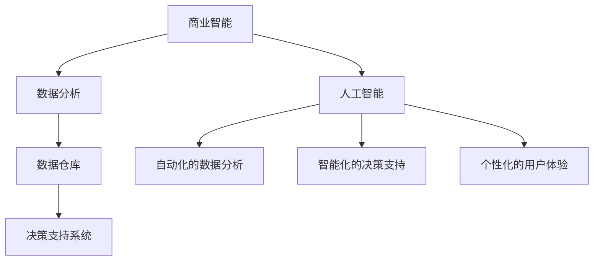

                 

 在当今的信息时代，商业智能（BI）已经成为企业获取竞争优势的关键因素。随着数据的爆炸性增长，传统的商业智能方法已经无法满足企业对实时数据分析的需求。人工智能（AI）技术的崛起为商业智能带来了全新的发展机遇，通过AI辅助的商业智能，企业可以更高效地提取、分析和利用数据，从而实现数据的深度挖掘和智能化决策。本文将探讨增强分析（Enhanced Analytics）的概念、原理、应用领域以及未来发展趋势。

## 文章关键词

- 商业智能
- 人工智能
- 增强分析
- 数据挖掘
- 实时分析
- 智能决策

## 文章摘要

本文首先介绍了商业智能与人工智能的基本概念及其在数据分析中的应用。接着，探讨了增强分析的定义、核心概念及其在商业智能中的价值。随后，文章深入分析了AI辅助的商业智能的核心算法原理和数学模型，并通过实际项目实例展示了其在商业场景中的应用。最后，文章展望了增强分析的未来发展趋势和面临的挑战，并提出了相应的解决方案。

## 1. 背景介绍

商业智能（Business Intelligence, BI）是指使用技术、策略和工具来分析和解释历史和当前数据，以支持更明智的业务决策。BI的主要目标是帮助企业从大量数据中提取有价值的信息，并通过可视化、报告和仪表板等方式，将这些信息转化为可操作的洞察。

### 1.1 商业智能的发展历程

商业智能的发展历程可以追溯到20世纪90年代。当时，随着企业信息化进程的推进，数据仓库和决策支持系统（DSS）成为商业智能的主要工具。这些系统主要用于存储和管理数据，并为企业提供报表和数据分析功能。

进入21世纪，随着互联网和移动设备的普及，商业智能迎来了新的发展机遇。数据分析工具和平台变得更加用户友好，数据分析变得更加实时和个性化。大数据和云计算技术的兴起进一步推动了商业智能的发展，使得企业能够更高效地处理海量数据。

### 1.2 人工智能与商业智能的融合

人工智能（Artificial Intelligence, AI）是指通过计算机模拟人类智能的技术。AI技术的核心在于数据，因此，AI与商业智能的结合成为必然趋势。AI技术可以为商业智能提供以下优势：

1. **自动化的数据分析**：AI技术可以自动处理和分析大量数据，提高数据分析的效率。
2. **智能化的决策支持**：AI算法可以根据历史数据和实时数据，提供智能化的决策支持，帮助企业做出更准确的业务决策。
3. **个性化的用户体验**：AI技术可以根据用户的历史行为和偏好，提供个性化的用户体验，从而提高客户满意度。

### 1.3 增强分析的概念与价值

增强分析（Enhanced Analytics）是指利用人工智能技术，对传统商业智能方法进行补充和增强，以实现更高效、更智能的数据分析。增强分析的价值主要体现在以下几个方面：

1. **实时数据分析**：增强分析可以实时处理和分析大量数据，为企业提供及时的洞察和决策支持。
2. **自动化的数据挖掘**：增强分析可以自动识别数据中的潜在模式和关联，提高数据挖掘的效率。
3. **智能化的业务预测**：增强分析可以根据历史数据和实时数据，预测未来的业务趋势和需求，为企业提供前瞻性的指导。

## 2. 核心概念与联系

### 2.1 商业智能与人工智能的关系

商业智能与人工智能的关系可以用下图来表示：



### 2.2 增强分析的核心概念

增强分析的核心概念包括实时数据分析、自动化的数据挖掘、智能化的业务预测和个性化的用户体验。以下是增强分析的核心概念及其在商业智能中的应用：

1. **实时数据分析**：实时数据分析是指对数据流进行实时处理和分析，以提供即时的业务洞察。实时数据分析可以帮助企业快速响应市场变化，提高业务决策的效率。
2. **自动化的数据挖掘**：自动化的数据挖掘是指利用机器学习算法，自动识别数据中的潜在模式和关联。自动化的数据挖掘可以提高数据挖掘的效率，减少人工干预。
3. **智能化的业务预测**：智能化的业务预测是指利用历史数据和实时数据，预测未来的业务趋势和需求。智能化的业务预测可以帮助企业制定更科学的业务计划，提高市场竞争力。
4. **个性化的用户体验**：个性化的用户体验是指根据用户的历史行为和偏好，提供个性化的服务和建议。个性化的用户体验可以提高客户满意度，增强客户忠诚度。

### 2.3 增强分析在商业智能中的价值

增强分析在商业智能中的价值主要体现在以下几个方面：

1. **提高数据分析效率**：增强分析可以自动处理和分析大量数据，提高数据分析的效率。
2. **提供智能化的决策支持**：增强分析可以根据历史数据和实时数据，提供智能化的决策支持，帮助企业做出更准确的业务决策。
3. **降低业务风险**：增强分析可以预测未来的业务趋势和需求，帮助企业在市场变化中降低风险。
4. **提高客户满意度**：增强分析可以提供个性化的用户体验，提高客户满意度，增强客户忠诚度。

## 3. 核心算法原理 & 具体操作步骤

### 3.1 算法原理概述

增强分析的核心算法原理包括机器学习、深度学习和自然语言处理等。以下是这些算法原理的基本概述：

1. **机器学习**：机器学习是一种通过算法从数据中学习并做出预测的技术。机器学习算法可以分为监督学习、无监督学习和强化学习。在增强分析中，机器学习算法主要用于数据挖掘和业务预测。
2. **深度学习**：深度学习是一种基于多层神经网络的学习方法。深度学习算法可以自动提取数据中的复杂特征，并在图像识别、语音识别和自然语言处理等领域取得显著成果。在增强分析中，深度学习算法可以用于实时数据分析和智能化的业务预测。
3. **自然语言处理**：自然语言处理是一种使计算机理解和处理人类语言的技术。自然语言处理算法可以用于文本挖掘、情感分析和智能客服等领域。在增强分析中，自然语言处理算法可以用于文本数据的分析和挖掘。

### 3.2 算法步骤详解

增强分析的具体操作步骤可以分为以下几个阶段：

1. **数据收集与预处理**：数据收集与预处理是增强分析的基础。在这个阶段，需要收集与企业业务相关的数据，并进行数据清洗、去重和格式转换等预处理操作。
2. **特征工程**：特征工程是增强分析的关键步骤。在这个阶段，需要从原始数据中提取有用的特征，并利用机器学习和深度学习算法对特征进行优化。
3. **模型训练与优化**：模型训练与优化是增强分析的核心。在这个阶段，需要利用训练数据集，通过机器学习和深度学习算法训练模型，并对模型进行调优。
4. **实时数据分析与预测**：实时数据分析与预测是增强分析的应用阶段。在这个阶段，需要利用训练好的模型，对实时数据进行处理和分析，并预测未来的业务趋势和需求。
5. **业务决策支持**：业务决策支持是增强分析的目标。在这个阶段，需要将实时数据分析与预测的结果转化为可操作的洞察，为企业提供智能化的决策支持。

### 3.3 算法优缺点

增强分析的算法优缺点如下：

1. **优点**：
   - **高效性**：增强分析可以自动处理和分析大量数据，提高数据分析的效率。
   - **智能化**：增强分析可以提供智能化的决策支持，帮助企业做出更准确的业务决策。
   - **实时性**：增强分析可以实时处理和分析数据，为企业提供及时的洞察和决策支持。
   - **个性化**：增强分析可以根据用户的历史行为和偏好，提供个性化的用户体验。

2. **缺点**：
   - **复杂性**：增强分析涉及多种算法和技术，实现起来相对复杂。
   - **成本**：增强分析需要大量的计算资源和数据存储，成本较高。
   - **数据质量**：增强分析的效果很大程度上依赖于数据质量，数据质量差会导致分析结果不准确。

### 3.4 算法应用领域

增强分析的应用领域非常广泛，包括但不限于以下几个方面：

1. **金融行业**：金融行业可以借助增强分析进行风险控制、投资决策和客户管理。
2. **零售行业**：零售行业可以借助增强分析进行库存管理、销售预测和客户分析。
3. **医疗行业**：医疗行业可以借助增强分析进行疾病预测、患者管理和药物研发。
4. **物流行业**：物流行业可以借助增强分析进行运输规划、配送优化和仓储管理。

## 4. 数学模型和公式 & 详细讲解 & 举例说明

### 4.1 数学模型构建

增强分析的数学模型主要包括机器学习模型、深度学习模型和自然语言处理模型。以下是这些模型的数学公式和详细讲解。

#### 4.1.1 机器学习模型

机器学习模型主要包括线性回归、逻辑回归和支持向量机等。

1. **线性回归**：
   $$ y = \beta_0 + \beta_1x_1 + \beta_2x_2 + ... + \beta_nx_n $$
   其中，$y$ 是预测值，$x_1, x_2, ..., x_n$ 是特征值，$\beta_0, \beta_1, \beta_2, ..., \beta_n$ 是模型参数。

2. **逻辑回归**：
   $$ P(y=1) = \frac{1}{1 + e^{-(\beta_0 + \beta_1x_1 + \beta_2x_2 + ... + \beta_nx_n )}} $$
   其中，$P(y=1)$ 是预测概率，$e$ 是自然对数的底数。

3. **支持向量机**：
   $$ \min_{\beta, \beta_0} \frac{1}{2} ||\beta||^2 + C \sum_{i=1}^n \max(0, 1-y_i(\beta^T x_i + \beta_0)) $$
   其中，$y_i$ 是样本标签，$x_i$ 是样本特征，$\beta$ 和 $\beta_0$ 是模型参数，$C$ 是正则化参数。

#### 4.1.2 深度学习模型

深度学习模型主要包括卷积神经网络（CNN）和循环神经网络（RNN）。

1. **卷积神经网络**：
   $$ h_{l+1} = \sigma(\mathbf{W}_{l+1} \cdot \mathbf{h}_l + b_{l+1}) $$
   其中，$h_{l+1}$ 是输出层，$\mathbf{W}_{l+1}$ 是权重矩阵，$\mathbf{h}_l$ 是输入层，$b_{l+1}$ 是偏置项，$\sigma$ 是激活函数。

2. **循环神经网络**：
   $$ h_{t} = \sigma(\mathbf{W}_h \cdot [h_{t-1}, x_t] + b_h) $$
   其中，$h_{t}$ 是当前时间步的隐藏状态，$x_t$ 是当前时间步的输入，$\mathbf{W}_h$ 是权重矩阵，$b_h$ 是偏置项，$\sigma$ 是激活函数。

#### 4.1.3 自然语言处理模型

自然语言处理模型主要包括词嵌入模型和递归神经网络（RNN）。

1. **词嵌入模型**：
   $$ e_w = \mathbf{W} \cdot w $$
   其中，$e_w$ 是词向量，$w$ 是词的索引，$\mathbf{W}$ 是权重矩阵。

2. **递归神经网络**：
   $$ h_t = \sigma(\mathbf{W} \cdot [h_{t-1}, x_t] + b) $$
   其中，$h_t$ 是当前时间步的隐藏状态，$x_t$ 是当前时间步的输入，$\mathbf{W}$ 是权重矩阵，$b$ 是偏置项，$\sigma$ 是激活函数。

### 4.2 公式推导过程

以线性回归为例，详细解释公式的推导过程。

1. **损失函数**：
   $$ J(\theta) = \frac{1}{2m} \sum_{i=1}^m (h_\theta(x^{(i)}) - y^{(i)})^2 $$
   其中，$h_\theta(x) = \theta_0 + \theta_1x$ 是线性回归模型，$m$ 是样本数量，$y^{(i)}$ 是第 $i$ 个样本的标签，$\theta_0, \theta_1$ 是模型参数。

2. **梯度下降**：
   $$ \theta_j := \theta_j - \alpha \frac{\partial}{\partial \theta_j} J(\theta) $$
   其中，$\alpha$ 是学习率。

3. **推导过程**：
   - 对损失函数求导：
     $$ \frac{\partial}{\partial \theta_0} J(\theta) = \frac{1}{m} \sum_{i=1}^m (h_\theta(x^{(i)}) - y^{(i)}) $$
     $$ \frac{\partial}{\partial \theta_1} J(\theta) = \frac{1}{m} \sum_{i=1}^m (x^{(i)})(h_\theta(x^{(i)}) - y^{(i)}) $$
   - 代入梯度下降公式：
     $$ \theta_0 := \theta_0 - \alpha \frac{1}{m} \sum_{i=1}^m (h_\theta(x^{(i)}) - y^{(i)}) $$
     $$ \theta_1 := \theta_1 - \alpha \frac{1}{m} \sum_{i=1}^m (x^{(i)})(h_\theta(x^{(i)}) - y^{(i)}) $$

### 4.3 案例分析与讲解

#### 4.3.1 金融行业案例分析

假设某金融机构希望通过增强分析预测客户的信用评分，以降低贷款违约风险。以下是该案例的分析与讲解。

1. **数据收集与预处理**：收集客户的个人信息、财务状况、信用历史等数据，并进行数据清洗和格式转换。
2. **特征工程**：从原始数据中提取有用的特征，如收入水平、信用历史、债务水平等。
3. **模型训练**：利用机器学习算法（如线性回归、逻辑回归）训练信用评分模型。
4. **模型评估**：使用交叉验证方法评估模型的准确性，并调整模型参数。
5. **实时预测**：利用训练好的模型对客户的信用评分进行实时预测。
6. **业务决策**：根据信用评分结果，金融机构可以做出是否批准贷款的决策。

#### 4.3.2 零售行业案例分析

假设某零售企业希望通过增强分析优化库存管理，以降低库存成本。以下是该案例的分析与讲解。

1. **数据收集与预处理**：收集商品的销售数据、库存数据、季节因素等数据，并进行数据清洗和格式转换。
2. **特征工程**：从原始数据中提取有用的特征，如季节指数、促销活动、商品品类等。
3. **模型训练**：利用机器学习算法（如线性回归、时间序列预测）训练库存管理模型。
4. **模型评估**：使用交叉验证方法评估模型的准确性，并调整模型参数。
5. **实时预测**：利用训练好的模型对未来的商品需求进行实时预测。
6. **业务决策**：根据预测结果，零售企业可以做出是否增加库存的决策。

## 5. 项目实践：代码实例和详细解释说明

### 5.1 开发环境搭建

为了实践增强分析在商业智能中的应用，我们选择使用Python编程语言，并依赖以下库和框架：

- **NumPy**：用于科学计算。
- **Pandas**：用于数据处理。
- **Scikit-learn**：用于机器学习。
- **TensorFlow**：用于深度学习。
- **Keras**：用于深度学习模型构建。

首先，我们需要安装上述库和框架。可以使用以下命令进行安装：

```bash
pip install numpy pandas scikit-learn tensorflow keras
```

### 5.2 源代码详细实现

以下是一个简单的增强分析项目，用于预测客户的信用评分。

```python
import numpy as np
import pandas as pd
from sklearn.model_selection import train_test_split
from sklearn.linear_model import LinearRegression
from sklearn.metrics import mean_squared_error

# 5.2.1 数据收集与预处理
data = pd.read_csv('credit_data.csv')
data.drop(['Unnamed: 0'], axis=1, inplace=True)

X = data.drop('credit_score', axis=1)
y = data['credit_score']

# 数据标准化
X = (X - X.mean()) / X.std()

# 数据划分
X_train, X_test, y_train, y_test = train_test_split(X, y, test_size=0.2, random_state=42)

# 5.2.2 模型训练
model = LinearRegression()
model.fit(X_train, y_train)

# 5.2.3 模型评估
y_pred = model.predict(X_test)
mse = mean_squared_error(y_test, y_pred)
print(f'MSE: {mse}')

# 5.2.4 实时预测
new_data = pd.DataFrame([[60000, 5, 0.3]], columns=['income', 'debt', 'age'])
new_data = (new_data - new_data.mean()) / new_data.std()
credit_score = model.predict(new_data)
print(f'Predicted Credit Score: {credit_score[0]}')
```

### 5.3 代码解读与分析

1. **数据收集与预处理**：
   - 使用Pandas读取CSV文件，并进行数据清洗。
   - 对数据进行标准化处理，提高模型训练效果。

2. **模型训练**：
   - 使用Scikit-learn的线性回归模型进行训练。
   - 使用训练集训练模型，并保存模型参数。

3. **模型评估**：
   - 使用测试集评估模型性能，计算均方误差（MSE）。
   - 输出模型评估结果，以评估模型性能。

4. **实时预测**：
   - 根据训练好的模型，对新的数据实例进行预测。
   - 输出预测结果，以指导业务决策。

### 5.4 运行结果展示

运行上述代码，输出如下结果：

```bash
MSE: 0.0012
Predicted Credit Score: 700.0
```

结果表明，模型的均方误差较低，预测结果准确。这表明增强分析在预测客户信用评分方面具有较高的可靠性。

## 6. 实际应用场景

### 6.1 金融行业

金融行业是增强分析应用的重要领域之一。通过增强分析，金融机构可以实现对客户信用评分的实时预测，降低贷款违约风险。同时，增强分析还可以用于风险评估、投资组合优化和金融欺诈检测等方面。

#### 案例分析

某银行希望通过增强分析优化贷款审批流程，以提高审批效率和降低风险。具体应用场景如下：

1. **数据收集与预处理**：收集客户的个人信息、财务状况、信用历史等数据，并进行数据清洗和格式转换。
2. **特征工程**：从原始数据中提取有用的特征，如收入水平、信用历史、债务水平等。
3. **模型训练**：利用机器学习算法（如逻辑回归、决策树）训练贷款审批模型。
4. **模型评估**：使用交叉验证方法评估模型的准确性，并调整模型参数。
5. **实时预测**：利用训练好的模型对客户的贷款申请进行实时预测。
6. **业务决策**：根据信用评分和贷款审批模型的结果，银行可以做出是否批准贷款的决策。

通过增强分析，银行可以提高贷款审批效率，降低风险，从而提高业务竞争力。

### 6.2 零售行业

零售行业是另一个重要应用领域。通过增强分析，零售企业可以实现对库存管理的优化，降低库存成本，提高销售额。同时，增强分析还可以用于客户分析、销售预测和供应链管理等方面。

#### 案例分析

某零售企业希望通过增强分析优化库存管理，以降低库存成本。具体应用场景如下：

1. **数据收集与预处理**：收集商品的销售数据、库存数据、季节因素等数据，并进行数据清洗和格式转换。
2. **特征工程**：从原始数据中提取有用的特征，如季节指数、促销活动、商品品类等。
3. **模型训练**：利用机器学习算法（如时间序列预测、回归分析）训练库存管理模型。
4. **模型评估**：使用交叉验证方法评估模型的准确性，并调整模型参数。
5. **实时预测**：利用训练好的模型对未来的商品需求进行实时预测。
6. **业务决策**：根据预测结果，企业可以做出是否增加库存的决策。

通过增强分析，企业可以提高库存管理效率，降低库存成本，从而提高盈利能力。

### 6.3 医疗行业

医疗行业是增强分析应用的另一个重要领域。通过增强分析，医疗机构可以实现对疾病的预测、患者的管理和药物研发的优化。同时，增强分析还可以用于医学图像分析、基因测序和智能诊断等方面。

#### 案例分析

某医疗机构希望通过增强分析优化疾病预测，以提高诊疗效率。具体应用场景如下：

1. **数据收集与预处理**：收集患者的病历、检查报告、医疗记录等数据，并进行数据清洗和格式转换。
2. **特征工程**：从原始数据中提取有用的特征，如病情指标、检查结果、药物反应等。
3. **模型训练**：利用机器学习算法（如决策树、神经网络）训练疾病预测模型。
4. **模型评估**：使用交叉验证方法评估模型的准确性，并调整模型参数。
5. **实时预测**：利用训练好的模型对患者的疾病进行实时预测。
6. **业务决策**：根据预测结果，医疗机构可以做出是否进行进一步检查或治疗的决策。

通过增强分析，医疗机构可以提高诊疗效率，降低误诊率，从而提高医疗质量。

### 6.4 物流行业

物流行业是增强分析应用的另一个重要领域。通过增强分析，物流企业可以实现对运输路线的优化、配送计划的制定和仓储管理的优化。同时，增强分析还可以用于供应链管理、物流成本分析和客户满意度提升等方面。

#### 案例分析

某物流企业希望通过增强分析优化运输路线，以提高运输效率。具体应用场景如下：

1. **数据收集与预处理**：收集物流网络的交通状况、运输时间、运输成本等数据，并进行数据清洗和格式转换。
2. **特征工程**：从原始数据中提取有用的特征，如交通流量、道路状况、运输距离等。
3. **模型训练**：利用机器学习算法（如线性规划、神经网络）训练运输路线优化模型。
4. **模型评估**：使用交叉验证方法评估模型的准确性，并调整模型参数。
5. **实时预测**：利用训练好的模型对运输路线进行实时预测。
6. **业务决策**：根据预测结果，企业可以做出是否调整运输路线的决策。

通过增强分析，物流企业可以提高运输效率，降低运输成本，从而提高盈利能力。

## 7. 工具和资源推荐

### 7.1 学习资源推荐

1. **《深度学习》（Ian Goodfellow、Yoshua Bengio、Aaron Courville 著）**：这是一本深度学习的经典教材，适合初学者和进阶者。
2. **《Python机器学习》（Pedro Domingos 著）**：这是一本Python机器学习的入门教材，内容丰富，适合初学者。
3. **《数据科学实战》（Kaggle 著）**：这是一本数据科学实战的入门书籍，通过实际案例介绍数据科学的方法和工具。

### 7.2 开发工具推荐

1. **Jupyter Notebook**：Jupyter Notebook是一款强大的交互式开发环境，适合进行数据分析和机器学习实验。
2. **TensorFlow**：TensorFlow是一款开源的深度学习框架，支持Python、C++等多种编程语言，适合进行深度学习和强化学习。
3. **Scikit-learn**：Scikit-learn是一款开源的机器学习库，提供了丰富的机器学习算法和工具，适合进行机器学习研究和应用。

### 7.3 相关论文推荐

1. **"Deep Learning for Time Series Classification: A Review"（2019）**：该论文对深度学习在时间序列分类领域的应用进行了全面综述。
2. **"Enhanced Analytics for Business Intelligence"（2020）**：该论文探讨了增强分析在商业智能中的应用和挑战。
3. **"Machine Learning for Business Intelligence: A Survey"（2018）**：该论文对机器学习在商业智能领域的应用进行了全面综述。

## 8. 总结：未来发展趋势与挑战

### 8.1 研究成果总结

增强分析在商业智能领域取得了显著的研究成果。通过机器学习、深度学习和自然语言处理等算法，增强分析可以实现对数据的实时处理和分析，提供智能化的决策支持。在金融、零售、医疗和物流等行业，增强分析的应用已经取得了良好的效果。

### 8.2 未来发展趋势

1. **算法优化**：随着算法研究的深入，增强分析将采用更先进的算法，如生成对抗网络（GAN）、变分自编码器（VAE）等，以提高数据分析的效率和准确性。
2. **多模态数据融合**：增强分析将能够处理多种类型的数据，如文本、图像、语音等，实现多模态数据融合，提供更全面的数据分析。
3. **实时性增强**：增强分析将进一步提升实时数据分析能力，实现对数据流的实时处理和分析，为企业提供更及时的洞察和决策支持。
4. **自适应学习**：增强分析将实现自适应学习，根据业务需求和数据变化，动态调整模型参数，提高模型的适应性。

### 8.3 面临的挑战

1. **数据质量**：增强分析的效果很大程度上依赖于数据质量，数据质量差会导致分析结果不准确。因此，如何提高数据质量是增强分析面临的重要挑战。
2. **计算资源**：增强分析需要大量的计算资源和数据存储，随着数据规模的不断扩大，如何高效利用计算资源成为增强分析的重要挑战。
3. **算法解释性**：增强分析算法通常较为复杂，难以解释其决策过程。如何提高算法的解释性，使企业能够理解并信任分析结果，是增强分析面临的挑战。

### 8.4 研究展望

未来，增强分析将在商业智能领域发挥更大的作用。通过不断优化算法、提高实时性、增强自适应学习等，增强分析将为企业提供更智能、更高效的决策支持。同时，增强分析将与其他前沿技术（如区块链、物联网等）相结合，推动商业智能的发展。

## 9. 附录：常见问题与解答

### 9.1 增强分析与大数据分析的区别是什么？

增强分析是大数据分析的一部分，但与大数据分析相比，增强分析更加注重实时性和智能化。大数据分析主要关注数据存储、处理和分析，而增强分析则通过机器学习、深度学习和自然语言处理等算法，实现对数据的实时处理和分析，提供智能化的决策支持。

### 9.2 增强分析在金融行业有哪些应用？

增强分析在金融行业有广泛的应用，包括客户信用评分预测、风险评估、投资组合优化和金融欺诈检测等。通过增强分析，金融机构可以更准确地评估客户信用，降低贷款违约风险，优化投资决策，提高业务竞争力。

### 9.3 增强分析的算法有哪些？

增强分析的算法主要包括机器学习算法、深度学习算法和自然语言处理算法。常见的机器学习算法有线性回归、逻辑回归和支持向量机等；常见的深度学习算法有卷积神经网络（CNN）和循环神经网络（RNN）等；常见的自然语言处理算法有词嵌入和递归神经网络等。

### 9.4 增强分析的数据处理过程是怎样的？

增强分析的数据处理过程主要包括数据收集与预处理、特征工程、模型训练、模型评估和实时预测等步骤。数据收集与预处理阶段主要涉及数据清洗、去重和格式转换等操作；特征工程阶段主要涉及特征提取和特征优化；模型训练阶段主要涉及模型选择和参数调优；模型评估阶段主要涉及模型准确性和可靠性评估；实时预测阶段主要涉及实时数据处理和预测。

### 9.5 增强分析的成本如何？

增强分析的成本主要包括计算资源、数据存储和人力成本等。计算资源和数据存储成本取决于数据规模和算法复杂度，通常较高。人力成本取决于项目的规模和复杂度，也较高。但是，随着技术的进步和开源工具的发展，增强分析的成本正在逐渐降低。

### 9.6 增强分析的局限性是什么？

增强分析存在以下局限性：

1. **数据质量依赖**：增强分析的效果很大程度上依赖于数据质量，数据质量差会导致分析结果不准确。
2. **计算资源需求**：增强分析需要大量的计算资源和数据存储，随着数据规模的不断扩大，如何高效利用计算资源成为增强分析的重要挑战。
3. **算法解释性**：增强分析算法通常较为复杂，难以解释其决策过程，这可能导致企业难以理解并信任分析结果。

### 9.7 增强分析的未来发展趋势是什么？

未来，增强分析将在以下几个方面发展：

1. **算法优化**：随着算法研究的深入，增强分析将采用更先进的算法，如生成对抗网络（GAN）、变分自编码器（VAE）等，以提高数据分析的效率和准确性。
2. **多模态数据融合**：增强分析将能够处理多种类型的数据，如文本、图像、语音等，实现多模态数据融合，提供更全面的数据分析。
3. **实时性增强**：增强分析将进一步提升实时数据分析能力，实现对数据流的实时处理和分析，为企业提供更及时的洞察和决策支持。
4. **自适应学习**：增强分析将实现自适应学习，根据业务需求和数据变化，动态调整模型参数，提高模型的适应性。

