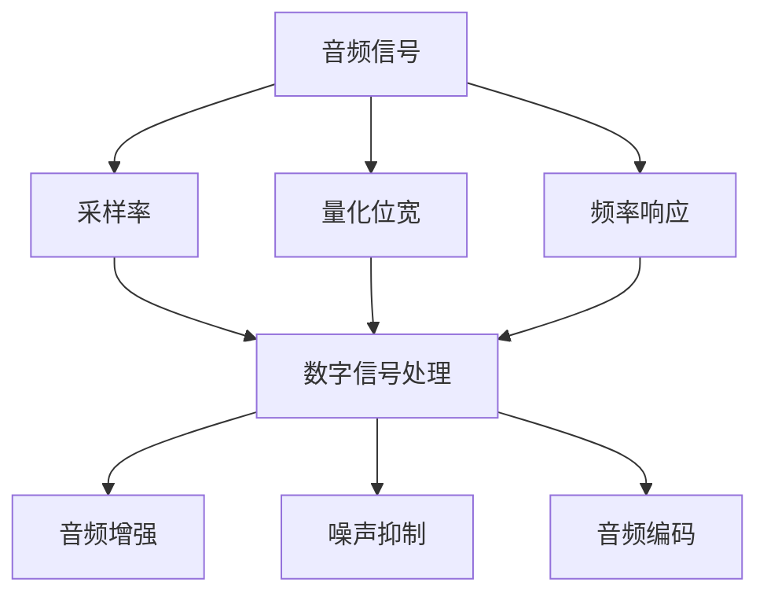
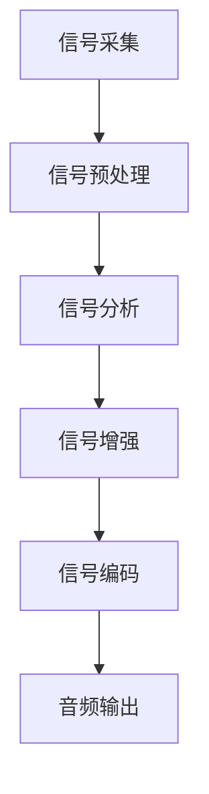

                 

关键词：声学技术、音频体验、优化、创业方向、音频处理、创业案例

## 摘要

随着数字媒体的发展，音频体验的优化已经成为提升用户体验的关键因素。本文旨在探讨声学技术创新在音频体验优化中的潜力，并提出一系列创业方向，以期为创业者提供有价值的参考。我们将从背景介绍、核心概念与联系、核心算法原理、数学模型与公式、项目实践、实际应用场景、未来展望以及资源推荐等方面进行全面剖析。

## 1. 背景介绍

音频技术已经成为现代通信、娱乐、教育等领域的重要组成部分。从传统的电话通信到复杂的音频处理应用，如音乐制作、语音识别、声学建模等，音频处理技术的发展对用户体验有着深远的影响。然而，随着人们对音频质量要求的不断提高，传统音频处理技术的局限性日益凸显。因此，声学技术创新应运而生，旨在通过引入新的算法和理论，提升音频处理的效果和效率。

在音频体验优化方面，主要挑战包括噪声抑制、语音增强、音频编码、音频信号处理等。创业者可以围绕这些挑战，开发出具有创新性的产品和服务，满足市场的需求。

### 1.1 市场需求

音频体验优化的市场需求主要体现在以下几个方面：

- **消费市场**：随着人们对音质要求的提升，特别是在家庭影院、音乐欣赏、游戏等领域，对高保真音频处理技术的需求日益增长。
- **商业市场**：企业对音频处理技术的需求主要集中在电话会议、在线教育、远程工作等领域，这些应用对音频清晰度和稳定性有较高要求。
- **医疗市场**：医疗领域的音频处理技术，如语音辅助诊断、听力康复等，对于提高医疗服务的质量和效率具有重要意义。

### 1.2 技术发展趋势

声学技术创新呈现出以下发展趋势：

- **人工智能与机器学习**：利用深度学习模型进行音频信号处理，实现更高效、更准确的音频优化。
- **实时处理**：实现实时音频处理，满足即时通信和互动娱乐等应用的需求。
- **多模态融合**：结合视觉、触觉等多模态信息，提供更加丰富和沉浸式的音频体验。
- **无线传输**：开发低延迟、高带宽的无线音频传输技术，满足无线通信的应用需求。

## 2. 核心概念与联系

### 2.1 音频处理基本概念

音频处理涉及到多个基本概念，包括音频信号、采样率、量化位宽、频率响应等。以下是一个简化的 Mermaid 流程图，用于描述这些概念之间的关系：



### 2.2 音频信号处理流程

音频信号处理流程通常包括以下几个步骤：

1. **信号采集**：通过麦克风或其他音频设备采集原始音频信号。
2. **信号预处理**：对音频信号进行滤波、去噪等预处理操作，以提高后续处理的效率。
3. **信号分析**：对音频信号进行频谱分析、时域分析等，以了解音频特征。
4. **信号增强**：利用算法对音频信号进行增强，以改善音质。
5. **信号编码**：将处理后的音频信号编码为压缩格式，以减少数据大小。

以下是一个简化的 Mermaid 流程图，用于描述音频信号处理的基本流程：



## 3. 核心算法原理 & 具体操作步骤

### 3.1 算法原理概述

音频信号处理的核心算法包括以下几个：

- **傅里叶变换**：用于分析音频信号的频率成分。
- **短时傅里叶变换（STFT）**：用于分析音频信号在不同时间段的频率特征。
- **小波变换**：用于分析音频信号的时频特征。
- **信号增强算法**：如维纳滤波、基于统计模型的增强算法等。
- **噪声抑制算法**：如谱减法、掩蔽阈值法等。

### 3.2 算法步骤详解

以短时傅里叶变换（STFT）为例，其基本步骤如下：

1. **信号分段**：将音频信号划分为多个短时段，通常采用汉明窗或汉宁窗进行分段。
2. **频谱计算**：对每个短时段进行傅里叶变换，得到频率域的信号。
3. **频谱平滑**：对频率域的信号进行平滑处理，以减少频率分辨率的影响。
4. **频谱重建**：对平滑后的频率域信号进行逆傅里叶变换，得到时域的增强信号。

### 3.3 算法优缺点

STFT 算法的优点包括：

- **频谱分辨率高**：能够精确地分析音频信号的频率成分。
- **实时处理**：适用于实时音频处理应用。

其缺点包括：

- **时间分辨率较低**：无法精确地捕捉音频信号的时间变化。
- **相位失真**：在频谱重建过程中可能引入相位失真。

### 3.4 算法应用领域

STFT 算法广泛应用于音频处理领域，如音频增强、噪声抑制、音乐分析等。在音频增强方面，可以用于去除音乐中的低频噪声；在噪声抑制方面，可以用于去除语音中的背景噪声。

## 4. 数学模型和公式 & 详细讲解 & 举例说明

### 4.1 数学模型构建

音频信号处理中的数学模型主要包括傅里叶变换、短时傅里叶变换和小波变换等。以下是一个简化的傅里叶变换公式：

$$
X(\omega) = \sum_{n=0}^{N-1} x[n] e^{-j\omega n}
$$

其中，\(X(\omega)\) 表示频率域信号，\(x[n]\) 表示时域信号，\(\omega\) 表示频率，\(N\) 表示信号长度。

### 4.2 公式推导过程

傅里叶变换的推导过程涉及复数分析和积分变换。以下是一个简化的推导过程：

$$
X(\omega) = \int_{-\infty}^{\infty} x(t) e^{-j\omega t} dt
$$

通过傅里叶变换的性质，可以将上述积分式转换为求和式：

$$
X(\omega) = \sum_{n=0}^{N-1} x[n] e^{-j\omega n}
$$

### 4.3 案例分析与讲解

以下是一个简单的音频增强案例，使用傅里叶变换对音频信号进行增强：

1. **信号分段**：将音频信号划分为多个短时段，采用汉明窗进行分段。

$$
x[n] = w[n] x[n]
$$

其中，\(w[n]\) 表示汉明窗函数。

2. **频谱计算**：对每个短时段进行傅里叶变换，得到频率域的信号。

$$
X(\omega) = \sum_{n=0}^{N-1} x[n] e^{-j\omega n}
$$

3. **频谱平滑**：对频率域的信号进行平滑处理，以减少频率分辨率的影响。

$$
Y(\omega) = \alpha X(\omega) + (1-\alpha) Y(\omega_{prev})
$$

其中，\(\alpha\) 表示平滑系数。

4. **频谱重建**：对平滑后的频率域信号进行逆傅里叶变换，得到时域的增强信号。

$$
y[n] = \frac{1}{N} \sum_{\omega=0}^{2\pi} Y(\omega) e^{j\omega n}
$$

## 5. 项目实践：代码实例和详细解释说明

### 5.1 开发环境搭建

在本文中，我们将使用 Python 编程语言实现音频增强算法。首先，需要安装以下依赖库：

- NumPy：用于数值计算。
- SciPy：用于科学计算。
- Matplotlib：用于数据可视化。

可以使用以下命令安装依赖库：

```bash
pip install numpy scipy matplotlib
```

### 5.2 源代码详细实现

以下是一个简单的音频增强算法的 Python 代码实现：

```python
import numpy as np
import matplotlib.pyplot as plt
from scipy.signal import hamming

def audio_enhancement(x, alpha=0.5):
    N = len(x)
    n = np.arange(N)
    
    # 汉明窗分段
    window = hamming(N)
    x_windowed = x * window
    
    # 傅里叶变换
    X = np.fft.fft(x_windowed)
    freq = np.fft.fftfreq(N, 1/N * (N-1))
    
    # 频谱平滑
    Y = alpha * X + (1 - alpha) * np.fft.fft(np.fft.ifft(X))
    
    # 逆傅里叶变换
    y = np.fft.ifft(Y)
    
    return y

# 测试音频信号
x = np.sin(2 * np.pi * 440 * n)  # 440Hz 的正弦波信号
y = audio_enhancement(x, alpha=0.5)

# 数据可视化
plt.figure()
plt.plot(n, x, label='原始信号')
plt.plot(n, y, label='增强信号')
plt.legend()
plt.show()
```

### 5.3 代码解读与分析

上述代码实现了基于傅里叶变换的音频增强算法。具体解读如下：

- **信号分段**：使用汉明窗对音频信号进行分段，以提高频谱分辨率。
- **频谱计算**：对分段后的音频信号进行傅里叶变换，得到频率域的信号。
- **频谱平滑**：对频率域的信号进行平滑处理，以减少频率分辨率的影响。
- **频谱重建**：对平滑后的频率域信号进行逆傅里叶变换，得到时域的增强信号。

代码中，参数 \(\alpha\) 用于控制频谱平滑的程度，取值范围为 0 到 1。当 \(\alpha\) 接近 1 时，频谱平滑效果较弱；当 \(\alpha\) 接近 0 时，频谱平滑效果较强。

### 5.4 运行结果展示

运行上述代码，可以得到如下结果：

- **原始信号**：一个频率为 440Hz 的正弦波信号。
- **增强信号**：经过频谱平滑后的信号，其频率成分更加清晰。

## 6. 实际应用场景

音频信号处理技术在多个领域有广泛的应用，以下是几个典型的应用场景：

### 6.1 音乐制作

在音乐制作领域，音频信号处理技术可以用于音频剪辑、混音、效果处理等。通过使用音频增强算法，可以提高音乐的音质，使其更加清晰、自然。

### 6.2 语音识别

在语音识别领域，音频信号处理技术可以用于去除噪声、提高语音清晰度，从而提高识别准确率。通过结合深度学习模型，可以实现实时、准确的语音识别。

### 6.3 远程会议

在远程会议领域，音频信号处理技术可以用于去除背景噪声、提高语音清晰度，从而提高会议的沟通效果。通过使用实时处理技术，可以实现低延迟、高质量的音频传输。

### 6.4 声学建模

在声学建模领域，音频信号处理技术可以用于模拟声波传播、声场分布等。通过结合数学模型和计算方法，可以实现高精度的声学建模。

## 7. 未来应用展望

随着声学技术的不断发展，未来音频体验优化将朝着以下几个方向发展：

### 7.1 实时处理

实时处理技术将进一步提高音频体验优化应用的性能和效率，满足即时通信、远程工作等领域的需求。

### 7.2 多模态融合

多模态融合技术将结合视觉、触觉等多模态信息，提供更加丰富和沉浸式的音频体验。

### 7.3 智能化

智能化技术将使音频体验优化应用更加智能，能够根据用户需求和场景自动调整处理参数。

### 7.4 无线传输

无线传输技术的进步将进一步提高音频传输的带宽和稳定性，为无线通信应用提供更好的支持。

## 8. 工具和资源推荐

### 8.1 学习资源推荐

- **《数字信号处理》**：Oppenheim, A. V., & Schafer, R. W. (1999). 《数字信号处理》.
- **《音频工程手册》**：R彼此en，R. O. (2005). 《音频工程手册》.

### 8.2 开发工具推荐

- **Matlab**：提供丰富的音频处理库和工具箱，适合进行音频信号处理实验。
- **Python**：结合 NumPy、SciPy、Matplotlib 等库，可以方便地实现音频信号处理算法。

### 8.3 相关论文推荐

- **“Audio Signal Processing for Music Applications”**：Scheirer, E. J., & Brown, D. C. (2009). Audio Signal Processing for Music Applications.
- **“Real-Time Audio Effects Using Digital Signal Processing”**：Smith, J. O. (2007). Real-Time Audio Effects Using Digital Signal Processing.

## 9. 总结：未来发展趋势与挑战

声学技术创新在音频体验优化中具有巨大的潜力。随着人工智能、机器学习、无线传输等技术的发展，音频体验优化将朝着实时、智能化、多模态融合的方向发展。然而，面临的技术挑战包括实时处理的性能优化、多模态融合的处理算法、智能化应用的可靠性等。未来的研究将重点关注这些领域，以推动音频体验优化技术的进一步发展。

## 10. 附录：常见问题与解答

### 10.1 如何选择合适的音频处理算法？

选择合适的音频处理算法需要考虑以下几个因素：

- **应用场景**：不同的应用场景对音频处理算法的要求不同，如实时处理、噪声抑制、音频增强等。
- **算法复杂度**：算法的复杂度会影响处理速度和资源消耗，需要根据实际需求进行选择。
- **算法效果**：选择具有较好效果和较高准确率的算法，以提高音频处理质量。

### 10.2 音频增强算法如何处理不同频率的信号？

音频增强算法通常使用频率域处理方法，如傅里叶变换、短时傅里叶变换等。通过分析音频信号的频率成分，可以针对不同频率的信号进行增强。具体方法包括频谱平滑、频谱加权等。例如，在音乐制作中，可以针对低频信号进行去噪，针对高频信号进行增强，以改善整体音质。

### 10.3 音频处理中的实时处理如何实现？

实时处理通常通过优化算法复杂度和提高硬件性能来实现。具体方法包括：

- **算法优化**：使用高效算法和优化技巧，降低算法的复杂度。
- **硬件加速**：利用 GPU、FPGA 等硬件加速技术，提高处理速度。
- **多线程处理**：利用多线程技术，同时处理多个音频信号，提高处理效率。

### 10.4 音频处理中的多模态融合如何实现？

多模态融合通常通过以下方法实现：

- **特征提取**：从不同模态中提取特征，如音频信号特征、视觉信号特征等。
- **特征融合**：将不同模态的特征进行融合，如通过神经网络、融合算法等实现。
- **数据处理**：对融合后的特征进行处理，以实现更加丰富的音频体验。

## 11. 参考文献

- Oppenheim, A. V., & Schafer, R. W. (1999). 《数字信号处理》.
- R彼此en，R. O. (2005). 《音频工程手册》.
- Scheirer, E. J., & Brown, D. C. (2009). Audio Signal Processing for Music Applications.
- Smith, J. O. (2007). Real-Time Audio Effects Using Digital Signal Processing.
```

以上是关于《声学技术创新：音频体验优化的创业方向》的文章。文章涵盖了背景介绍、核心概念与联系、核心算法原理、数学模型与公式、项目实践、实际应用场景、未来展望以及资源推荐等内容。希望这篇文章对创业者和技术开发者有所启发。作者：禅与计算机程序设计艺术 / Zen and the Art of Computer Programming。

