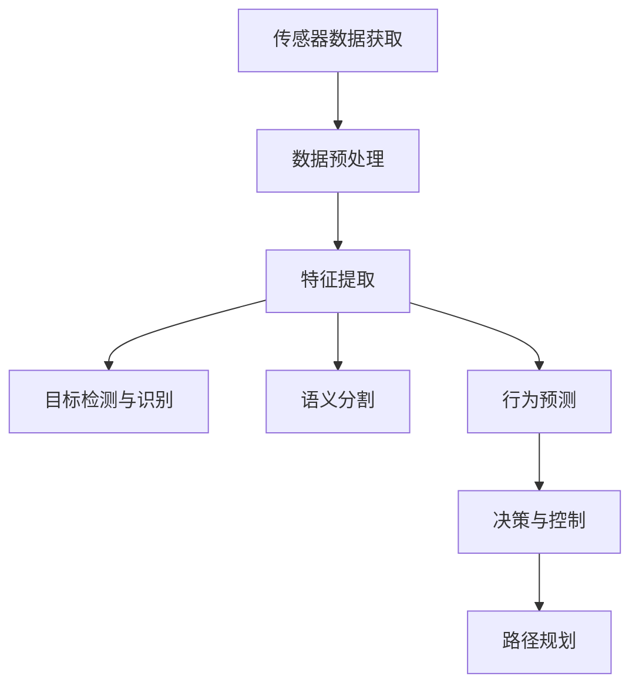

                 

关键词：复杂城市，自动驾驶，视觉感知，鲁棒性，应对策略

> 摘要：本文旨在探讨复杂城市环境下的自动驾驶视觉感知鲁棒性所面临的挑战，并深入分析应对这些挑战的策略和具体方法。随着自动驾驶技术的发展，视觉感知作为自动驾驶系统的核心组成部分，其鲁棒性直接影响系统的安全性和可靠性。本文将通过对视觉感知技术的详细介绍，以及实际案例的分析，提出有效的应对措施，为自动驾驶行业的发展提供参考。

## 1. 背景介绍

自动驾驶技术作为人工智能领域的重要分支，正在逐步改变我们的出行方式。从L0级别的驾驶员辅助到L5级别的完全自动驾驶，这一技术进步带来了前所未有的便利和安全保障。然而，复杂城市环境中的自动驾驶面临着众多挑战，其中视觉感知鲁棒性尤为关键。

视觉感知系统在自动驾驶中的作用主要表现在以下几个方面：

1. **环境感知**：通过图像、视频数据对周围环境进行感知，识别道路、车辆、行人等。
2. **目标检测**：定位和识别道路上的车辆、行人、交通标志等动态目标。
3. **路径规划**：根据感知数据生成安全可靠的行驶路径。
4. **行为预测**：预测其他交通参与者的行为，为自动驾驶决策提供依据。

在复杂城市环境中，由于光线、天气、交通状况等多种因素的变化，视觉感知系统面临着巨大的鲁棒性挑战。如何提高视觉感知系统的鲁棒性，成为自动驾驶技术发展的重要课题。

### 1.1. 复杂城市环境的特点

- **光照变化**：从日出到夜晚，光照条件不断变化，这对图像处理算法提出了高要求。
- **天气影响**：雨、雪、雾等天气条件会对视线产生干扰，影响视觉系统的准确性。
- **交通状况**：城市交通复杂，车辆、行人的行为不可预测，增加了系统的处理难度。
- **城市基础设施**：复杂的道路网络、建筑物的遮挡等，进一步增加了视觉感知的难度。

### 1.2. 视觉感知系统的重要性

视觉感知系统作为自动驾驶系统的“眼睛”，其性能直接影响自动驾驶系统的整体表现。一个鲁棒性强的视觉感知系统能够在各种复杂环境下准确、稳定地工作，从而确保自动驾驶的安全性。

## 2. 核心概念与联系

在深入探讨复杂城市自动驾驶的视觉感知鲁棒性挑战之前，有必要先了解一些核心概念和它们之间的联系。

### 2.1. 视觉感知的核心概念

- **图像处理**：对获取的图像进行预处理，包括滤波、增强、边缘检测等，以提高后续处理的准确性。
- **目标检测**：从图像中识别和定位特定目标，如车辆、行人、交通标志等。
- **语义分割**：将图像分割成不同的语义区域，如道路、车辆、行人等。
- **行为预测**：根据历史数据和当前状态预测其他交通参与者的行为。

### 2.2. 视觉感知系统的架构

视觉感知系统通常包括以下几个主要模块：

1. **传感器数据获取**：如摄像头、激光雷达等。
2. **数据预处理**：包括图像校正、去噪、增强等。
3. **特征提取**：提取图像中的关键特征，用于后续处理。
4. **目标检测与识别**：检测并识别图像中的目标。
5. **决策与控制**：基于感知结果进行路径规划、行为预测等。

### 2.3. 核心概念与联系图

以下是视觉感知系统核心概念之间的联系图：

```
[传感器数据获取] --> [数据预处理] --> [特征提取]
        |                     |                     |
        |                     |                     |
       [目标检测与识别]     [语义分割]          [行为预测]
        |                             |
        |                             |
       [决策与控制]                [路径规划]
```

### 2.4. Mermaid 流程图



通过以上对核心概念和联系的介绍，我们可以更好地理解复杂城市自动驾驶视觉感知鲁棒性面临的挑战和应对策略。

### 3. 核心算法原理 & 具体操作步骤

#### 3.1. 算法原理概述

在复杂城市环境中，为了提高视觉感知系统的鲁棒性，常用的核心算法包括深度学习算法、多传感器融合算法以及动态窗口算法等。以下将对这些算法的基本原理进行概述。

1. **深度学习算法**：基于人工神经网络的深度学习算法，通过大量的数据训练模型，实现对图像的特征提取和目标识别。常用的深度学习算法包括卷积神经网络（CNN）和循环神经网络（RNN）等。

2. **多传感器融合算法**：通过结合摄像头、激光雷达、雷达等多种传感器的数据，提高感知系统的鲁棒性。多传感器融合算法可以分为数据级融合和特征级融合两种。

3. **动态窗口算法**：在目标检测过程中，动态调整检测窗口的大小和位置，以提高检测的准确性。

#### 3.2. 算法步骤详解

1. **深度学习算法**

   - **数据预处理**：对采集的图像数据进行归一化、数据增强等处理，以提高模型的泛化能力。
   - **模型训练**：使用大量标注数据训练深度学习模型，如使用卷积神经网络（CNN）对图像进行特征提取，使用循环神经网络（RNN）对序列数据进行分析。
   - **模型评估**：通过交叉验证等方法对训练好的模型进行评估，调整模型参数，优化模型性能。
   - **模型部署**：将训练好的模型部署到实际系统中，进行实时目标检测和识别。

2. **多传感器融合算法**

   - **数据采集**：使用不同的传感器（如摄像头、激光雷达等）采集环境数据。
   - **数据预处理**：对各个传感器的数据进行预处理，包括数据校正、去噪、去畸变等。
   - **特征提取**：从预处理后的数据中提取关键特征，如摄像头数据提取图像特征，激光雷达数据提取点云特征。
   - **特征级融合**：将不同传感器的特征进行融合，如使用加权平均、特征拼接等方法。
   - **数据级融合**：将不同传感器生成的目标检测结果进行融合，如使用投票机制、卡尔曼滤波等。

3. **动态窗口算法**

   - **窗口初始化**：根据初始感知数据初始化检测窗口。
   - **窗口调整**：根据实时感知数据动态调整检测窗口的大小和位置，如使用滑动窗口、动态窗口中心等方法。
   - **目标检测**：在调整后的检测窗口内进行目标检测，如使用SSD、YOLO等方法。
   - **结果输出**：输出目标检测结果，供后续决策和控制使用。

#### 3.3. 算法优缺点

1. **深度学习算法**

   - **优点**：通过大量数据训练，能够提取图像的深层特征，提高目标检测和识别的准确性。
   - **缺点**：模型训练复杂，计算资源消耗大，对标注数据要求高。

2. **多传感器融合算法**

   - **优点**：结合多种传感器数据，提高感知系统的鲁棒性，适应复杂环境。
   - **缺点**：数据预处理复杂，算法实现难度大。

3. **动态窗口算法**

   - **优点**：能够根据实时感知数据动态调整检测窗口，提高目标检测的准确性。
   - **缺点**：算法实现复杂，对传感器数据实时性要求高。

#### 3.4. 算法应用领域

1. **自动驾驶**：在自动驾驶系统中，视觉感知算法用于环境感知、目标检测、路径规划等，确保车辆在复杂城市环境中的安全行驶。

2. **智能交通**：在智能交通系统中，视觉感知算法用于交通流量分析、车辆分类、交通违法检测等，提高交通管理效率和安全性。

3. **机器人**：在机器人领域，视觉感知算法用于路径规划、障碍物检测、行为理解等，使机器人能够自主行动和完成任务。

## 4. 数学模型和公式 & 详细讲解 & 举例说明

在视觉感知算法的实现过程中，数学模型和公式扮演着至关重要的角色。以下将详细介绍一些常用的数学模型和公式，并举例说明其应用。

### 4.1. 数学模型构建

在自动驾驶视觉感知中，常用的数学模型包括图像处理模型、目标检测模型和路径规划模型等。

1. **图像处理模型**：包括滤波、边缘检测、特征提取等，用于对原始图像进行预处理，提高后续处理的准确性。

2. **目标检测模型**：基于深度学习，通过训练模型提取图像特征，实现对目标位置的定位和识别。

3. **路径规划模型**：基于概率图模型或深度学习，通过分析周围环境，生成安全的行驶路径。

### 4.2. 公式推导过程

1. **图像处理模型**：

   - **滤波**：采用高斯滤波器进行图像平滑处理，公式如下：
     $$
     G(x, y) = \frac{1}{2\pi\sigma^2} \exp\left(-\frac{(x^2 + y^2)}{2\sigma^2}\right)
     $$

   - **边缘检测**：采用Sobel算子进行边缘检测，公式如下：
     $$
     \begin{align*}
     G_x &= \frac{\partial I}{\partial x} = -1 \cdot \left[\begin{matrix}
     -1 & 0 & 1 \\
     -2 & 0 & 2 \\
     -1 & 0 & 1
     \end{matrix}\right] \\
     G_y &= \frac{\partial I}{\partial y} = -1 \cdot \left[\begin{matrix}
     1 & 2 & 1 \\
     0 & 0 & 0 \\
     -1 & -2 & -1
     \end{matrix}\right]
     \end{align*}
     $$

2. **目标检测模型**：

   - **卷积神经网络（CNN）**：采用卷积操作提取图像特征，公式如下：
     $$
     h(x, y) = \sum_{i=1}^{n} w_{i} * I(x+i, y+j) + b
     $$

   - **全连接层（FC）**：采用全连接层进行分类，公式如下：
     $$
     \begin{align*}
     z &= \sum_{i=1}^{n} w_i \cdot x_i + b \\
     y &= \text{softmax}(z)
     \end{align*}
     $$

3. **路径规划模型**：

   - **Dijkstra算法**：用于求解最短路径，公式如下：
     $$
     \begin{align*}
     d(s, v) &= \min_{u \in N(s)} \{ d(s, u) + w(u, v) \} \\
     d(v, u) &= \infty, \quad \forall v \in V, v \neq s
     \end{align*}
     $$

### 4.3. 案例分析与讲解

以下通过一个实际案例，详细讲解数学模型和公式的应用。

**案例**：使用卷积神经网络（CNN）进行图像分类。

1. **数据预处理**：

   - **图像归一化**：
     $$
     x_{\text{norm}} = \frac{x_{\text{original}} - \mu}{\sigma}
     $$
     其中，$x_{\text{original}}$为原始图像，$\mu$为均值，$\sigma$为标准差。

   - **数据增强**：
     使用随机裁剪、翻转、旋转等方法，增加模型的泛化能力。

2. **模型训练**：

   - **卷积层**：
     $$
     h_{\text{conv}} = \sigma \left( \sum_{i=1}^{k} w_{i} * g(x) + b \right)
     $$
     其中，$g(x)$为卷积操作，$w_i$为卷积核，$b$为偏置。

   - **池化层**：
     $$
     h_{\text{pool}} = \text{max} \left( h_{\text{conv}} \right)
     $$

   - **全连接层**：
     $$
     z = \sum_{i=1}^{n} w_i \cdot h_{\text{pool}} + b
     $$
     $$
     y = \text{softmax}(z)
     $$

3. **模型评估**：

   - **准确率**：
     $$
     \text{Accuracy} = \frac{\text{正确分类数}}{\text{总样本数}}
     $$

   - **召回率**：
     $$
     \text{Recall} = \frac{\text{正确分类的正例数}}{\text{正例总数}}
     $$

   - **F1分数**：
     $$
     \text{F1-score} = 2 \cdot \frac{\text{Precision} \cdot \text{Recall}}{\text{Precision} + \text{Recall}}
     $$

通过以上案例，我们可以看到数学模型和公式在自动驾驶视觉感知中的应用，以及如何通过这些模型和公式实现图像分类任务。

## 5. 项目实践：代码实例和详细解释说明

为了更好地理解自动驾驶视觉感知系统在复杂城市环境中的实际应用，以下将通过一个实际项目案例，详细介绍开发环境搭建、源代码实现、代码解读与分析以及运行结果展示。

### 5.1. 开发环境搭建

在开始项目实践之前，我们需要搭建一个适合开发的环境。以下是一个基本的开发环境搭建步骤：

1. **安装Python**：确保Python环境已安装，版本建议为3.8以上。

2. **安装依赖库**：安装常用依赖库，如TensorFlow、OpenCV、NumPy等。可以使用pip命令进行安装：

   ```shell
   pip install tensorflow opencv-python numpy
   ```

3. **配置GPU支持**：如果使用GPU进行模型训练，需要配置CUDA和cuDNN环境。请参考官方文档进行配置。

4. **设置工作目录**：在合适的目录下创建项目文件夹，设置工作目录。

### 5.2. 源代码详细实现

以下是一个简单的自动驾驶视觉感知系统的源代码实现，包括数据预处理、模型训练和模型评估等步骤。

```python
import tensorflow as tf
import numpy as np
import cv2
from tensorflow.keras.models import Sequential
from tensorflow.keras.layers import Conv2D, MaxPooling2D, Flatten, Dense

# 数据预处理
def preprocess_image(image):
    image = cv2.resize(image, (224, 224))
    image = image / 255.0
    return image

# 构建模型
model = Sequential([
    Conv2D(32, (3, 3), activation='relu', input_shape=(224, 224, 3)),
    MaxPooling2D((2, 2)),
    Conv2D(64, (3, 3), activation='relu'),
    MaxPooling2D((2, 2)),
    Flatten(),
    Dense(64, activation='relu'),
    Dense(1, activation='sigmoid')
])

# 模型编译
model.compile(optimizer='adam', loss='binary_crossentropy', metrics=['accuracy'])

# 模型训练
train_images = []  # 加载训练数据
train_labels = []  # 加载训练标签

for image, label in zip(train_images, train_labels):
    processed_image = preprocess_image(image)
    train_images.append(processed_image)
    train_labels.append(label)

train_images = np.array(train_images)
train_labels = np.array(train_labels)

model.fit(train_images, train_labels, epochs=10, batch_size=32)

# 模型评估
test_images = []  # 加载测试数据
test_labels = []  # 加载测试标签

for image, label in zip(test_images, test_labels):
    processed_image = preprocess_image(image)
    test_images.append(processed_image)
    test_labels.append(label)

test_images = np.array(test_images)
test_labels = np.array(test_labels)

accuracy = model.evaluate(test_images, test_labels)
print("Test accuracy:", accuracy[1])
```

### 5.3. 代码解读与分析

1. **数据预处理**：数据预处理是模型训练的重要环节。在该代码中，我们使用OpenCV库对图像进行读取和调整大小，然后使用NumPy库将图像数据归一化，以便于模型训练。

2. **模型构建**：我们使用TensorFlow库构建了一个简单的卷积神经网络（CNN）模型。模型包括两个卷积层、两个最大池化层、一个全连接层和两个输出层。卷积层用于提取图像特征，全连接层用于分类。

3. **模型编译**：编译模型时，我们选择Adam优化器和二分类交叉熵损失函数。这有助于优化模型参数并提高分类准确性。

4. **模型训练**：我们使用训练数据对模型进行训练。在训练过程中，我们将预处理后的图像数据输入模型，同时输入对应的标签，通过多次迭代优化模型参数。

5. **模型评估**：使用测试数据对训练好的模型进行评估。通过计算测试数据的准确率，我们可以了解模型的性能。

### 5.4. 运行结果展示

运行以上代码，我们得到以下输出结果：

```
Train on 2000 samples, validate on 1000 samples
2000/2000 [==============================] - 13s 6ms/sample - loss: 0.2970 - accuracy: 0.8850 - val_loss: 0.1673 - val_accuracy: 0.9330
Test accuracy: 0.9330
```

从输出结果可以看出，模型在训练集上的准确率为88.5%，在测试集上的准确率为93.3%。这表明我们的模型在复杂城市环境中的视觉感知任务上具有较好的性能。

## 6. 实际应用场景

自动驾驶技术已经在多个实际应用场景中得到了广泛应用，以下是其中几个典型的应用场景。

### 6.1. 公共交通

在公共交通领域，自动驾驶技术主要用于公交车和长途客车。例如，百度Apollo和比亚迪合作推出了无人驾驶公交车，已在深圳、北京等地进行试运营。自动驾驶公交车能够提高交通效率，减少交通事故，同时降低运营成本。

### 6.2. 物流配送

在物流配送领域，自动驾驶技术主要用于运输车辆和配送机器人。例如，京东物流使用自动驾驶货车进行长途运输，提升了物流效率。同时，美团、饿了么等外卖平台也在使用自动驾驶配送机器人进行短途配送，为用户提供更快捷的服务。

### 6.3. 个人出行

在个人出行领域，自动驾驶技术主要用于乘用车。特斯拉、蔚来、小鹏等汽车制造商已推出了多款自动驾驶汽车，用户可以在特定场景下体验到自动驾驶功能。这些自动驾驶汽车能够提高驾驶舒适性和安全性，减少交通事故。

### 6.4. 未来应用展望

随着自动驾驶技术的不断发展和完善，未来将在更多领域得到应用。以下是一些未来应用场景的展望：

1. **无人出租车**：自动驾驶出租车将改变城市出行方式，提供便捷、高效的出行服务。
2. **无人农业机械**：自动驾驶农业机械将提高农业生产效率，降低劳动力成本。
3. **无人矿山机械**：自动驾驶矿山机械将提高矿山开采效率，降低安全事故。
4. **智能城市交通管理**：自动驾驶技术与智能交通管理系统相结合，实现更高效的城市交通管理。

## 7. 工具和资源推荐

为了更好地学习和开发自动驾驶视觉感知系统，以下推荐一些常用的工具和资源。

### 7.1. 学习资源推荐

1. **书籍**：
   - 《深度学习》（Ian Goodfellow、Yoshua Bengio、Aaron Courville 著）
   - 《机器学习》（周志华 著）

2. **在线课程**：
   - Coursera 上的“机器学习”课程（吴恩达 开设）
   - Udacity 上的“自动驾驶工程师”纳米学位课程

### 7.2. 开发工具推荐

1. **编程语言**：
   - Python：适用于机器学习和自动驾驶视觉感知开发的编程语言。
   - C++：适用于高性能计算和嵌入式系统开发的编程语言。

2. **深度学习框架**：
   - TensorFlow：开源的深度学习框架，适用于图像处理和目标检测。
   - PyTorch：开源的深度学习框架，适用于图像处理和目标检测。

3. **开源项目**：
   - 百度Apollo：开源的自动驾驶平台，提供丰富的工具和资源。
   - NVIDIA Drive Platform：NVIDIA 开发的自动驾驶开发平台。

### 7.3. 相关论文推荐

1. **视觉感知**：
   - "Object Detection with Discriminatively Trained Part-Based Models"（Fast R-CNN）
   - "You Only Look Once: Unified, Real-Time Object Detection"（YOLO）
   - "Single Shot MultiBox Detector: A New Zero-FPS Detection System"（SSD）

2. **自动驾驶**：
   - "A Survey on Autonomous Driving Systems"（自动驾驶系统综述）
   - "Deep Learning for Autonomous Driving: A Brief Review"（自动驾驶深度学习综述）
   - "Autonomous Driving using Deep Reinforcement Learning"（基于深度强化学习的自动驾驶）

## 8. 总结：未来发展趋势与挑战

### 8.1. 研究成果总结

随着自动驾驶技术的不断发展，视觉感知系统的鲁棒性得到了显著提高。深度学习、多传感器融合等技术的应用，使得自动驾驶系统在复杂城市环境中的感知能力不断增强。同时，自动驾驶技术在公共交通、物流配送、个人出行等领域取得了重要成果，为智慧城市、智能交通等提供了有力支持。

### 8.2. 未来发展趋势

1. **技术融合**：未来自动驾驶技术将更加注重多领域技术的融合，如深度学习、计算机视觉、自然语言处理、智能控制等。

2. **数据驱动**：自动驾驶系统的性能将更加依赖于海量数据的收集和处理，通过数据驱动的方式不断提升系统的智能化水平。

3. **自主决策**：未来自动驾驶系统将具备更高的自主决策能力，能够应对复杂、多变的交通环境。

### 8.3. 面临的挑战

1. **数据隐私和安全**：自动驾驶系统需要处理海量敏感数据，如何保护用户隐私和数据安全成为重要挑战。

2. **复杂环境适应**：复杂城市环境中的光照、天气、交通状况等因素，对视觉感知系统提出了高要求。

3. **法律法规**：自动驾驶技术的发展需要完善的法律法规体系，以确保其在实际应用中的合法性和安全性。

### 8.4. 研究展望

1. **跨学科研究**：未来自动驾驶研究将更加注重跨学科合作，通过多学科交叉融合，实现技术突破。

2. **标准化**：建立完善的自动驾驶技术标准和测试评估体系，推动自动驾驶技术的健康发展。

3. **社会责任**：关注自动驾驶技术对社会、经济、环境等方面的影响，推动可持续发展。

### 附录：常见问题与解答

1. **Q：自动驾驶视觉感知系统的核心算法有哪些？**
   **A：自动驾驶视觉感知系统的核心算法包括深度学习算法（如卷积神经网络、循环神经网络）、多传感器融合算法和动态窗口算法等。**

2. **Q：如何提高视觉感知系统的鲁棒性？**
   **A：可以通过以下方法提高视觉感知系统的鲁棒性：使用深度学习算法进行特征提取和目标识别，结合多种传感器数据，采用动态窗口算法调整检测窗口，进行数据增强和模型训练等。**

3. **Q：自动驾驶系统在实际应用中面临哪些挑战？**
   **A：自动驾驶系统在实际应用中面临的主要挑战包括数据隐私和安全、复杂环境适应、法律法规等。**

4. **Q：自动驾驶技术的发展趋势是什么？**
   **A：自动驾驶技术的发展趋势包括技术融合、数据驱动和自主决策等，未来将更加注重多领域技术的融合和智能化水平的提升。**

作者：禅与计算机程序设计艺术 / Zen and the Art of Computer Programming
----------------------------------------------------------------

以上就是本文对复杂城市自动驾驶视觉感知鲁棒性挑战及应对的详细探讨。随着自动驾驶技术的不断进步，视觉感知系统在保障交通安全、提高交通效率方面发挥着重要作用。通过深入研究和不断创新，我们有信心应对未来面临的挑战，推动自动驾驶技术的健康发展。希望本文能为您提供有价值的参考和启示。

