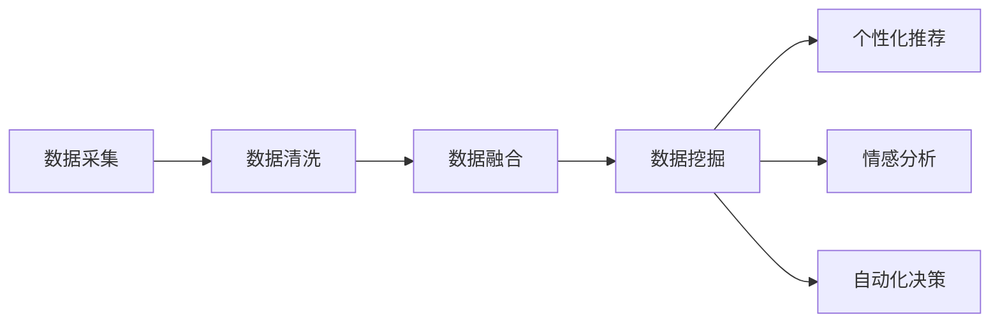

                 

关键词：多渠道整合、AI、结果提升、技术架构、应用实践

> 摘要：本文深入探讨了多渠道整合在人工智能领域的重要性，以及AI技术在提升结果方面的关键作用。通过详细阐述核心概念、算法原理、数学模型、项目实践和实际应用场景，本文旨在为读者提供一份全面的技术指南，帮助理解并运用多渠道整合与AI相结合的方法，以实现更高效、精准和有影响力的技术解决方案。

## 1. 背景介绍

在当今数字化时代，信息的获取和整合变得愈发重要。企业和组织需要通过多种渠道获取数据，例如网站、社交媒体、应用程序和线下活动等，这些数据的多样性和复杂性使得传统的数据处理方法显得力不从心。多渠道整合（Multichannel Integration）作为一种应对策略，旨在将来自不同渠道的数据和资源高效地融合，以实现更好的用户体验和业务成果。

### 1.1 多渠道整合的挑战

多渠道整合面临着诸多挑战，包括数据不一致、渠道间交互困难、信息孤岛和用户体验碎片化等。这些挑战不仅增加了企业的运营成本，还可能影响用户满意度和品牌价值。

### 1.2 AI技术在多渠道整合中的作用

随着人工智能（AI）技术的发展，AI在多渠道整合中扮演着越来越重要的角色。AI可以自动处理大量结构化和非结构化数据，识别模式和趋势，提供智能推荐和个性化服务，从而提升数据整合的效率和效果。

## 2. 核心概念与联系

### 2.1 多渠道整合的概念

多渠道整合是指将来自不同渠道的数据和资源进行集中管理和协同使用，以实现更加统一和协调的用户体验。这通常涉及到以下关键步骤：

- 数据采集：从各种渠道收集数据，包括网页点击、社交媒体互动、移动应用使用等。
- 数据清洗：处理和清洗原始数据，以确保数据的准确性和一致性。
- 数据融合：将来自不同渠道的数据进行整合，形成一个统一的视图。

### 2.2 AI技术在多渠道整合中的应用

AI技术在多渠道整合中的应用主要体现在以下几个方面：

- 数据挖掘：通过机器学习算法从大量数据中提取有价值的信息。
- 个性化推荐：根据用户行为和偏好提供个性化的内容和服务。
- 情感分析：分析用户的情感和态度，以改善用户体验。
- 自动化决策：使用AI模型自动化决策过程，提高效率。

### 2.3 Mermaid 流程图

以下是一个简单的Mermaid流程图，展示了多渠道整合的典型流程和AI技术的应用节点。



## 3. 核心算法原理 & 具体操作步骤

### 3.1 算法原理概述

在多渠道整合中，核心算法主要涉及数据挖掘和机器学习技术。以下是一个简单的机器学习算法概述：

- 特征提取：从原始数据中提取有代表性的特征。
- 模型训练：使用训练数据集训练机器学习模型。
- 模型评估：使用测试数据集评估模型性能。
- 预测：使用训练好的模型对新数据进行预测。

### 3.2 算法步骤详解

1. **特征提取**：

   特征提取是数据挖掘的重要步骤，它将原始数据转换为可以用于机器学习模型的特征向量。常用的特征提取方法包括词袋模型、TF-IDF和主成分分析等。

2. **模型训练**：

   选择合适的机器学习算法，如决策树、支持向量机和神经网络等，使用训练数据进行模型训练。训练过程中，模型会学习如何将输入数据映射到输出结果。

3. **模型评估**：

   使用测试数据集对训练好的模型进行评估，常用的评估指标包括准确率、召回率和F1分数等。通过调整模型参数，优化模型性能。

4. **预测**：

   使用训练好的模型对新数据进行预测，从而实现个性化推荐、情感分析等功能。

### 3.3 算法优缺点

- **优点**：

  - 高效处理大量数据。

  - 提供个性化的用户体验。

  - 自动化决策过程。

- **缺点**：

  - 需要大量高质量的训练数据。

  - 模型训练和评估过程复杂。

  - 可能面临过拟合问题。

### 3.4 算法应用领域

- 电子商务：通过个性化推荐提高用户购买意愿。

- 金融领域：进行信用评分和欺诈检测。

- 医疗健康：辅助医生进行诊断和治疗。

## 4. 数学模型和公式 & 详细讲解 & 举例说明

### 4.1 数学模型构建

在多渠道整合中，常见的数学模型包括线性回归、逻辑回归和支持向量机等。以下是一个简单的线性回归模型构建过程：

$$
y = \beta_0 + \beta_1x_1 + \beta_2x_2 + ... + \beta_nx_n
$$

其中，$y$ 是目标变量，$x_1, x_2, ..., x_n$ 是特征变量，$\beta_0, \beta_1, ..., \beta_n$ 是模型参数。

### 4.2 公式推导过程

线性回归模型的推导过程如下：

1. **最小二乘法**：

   最小二乘法是一种常用的参数估计方法，其目标是找到使误差平方和最小的参数值。具体推导过程如下：

   $$
   S = \sum_{i=1}^{n}(y_i - (\beta_0 + \beta_1x_{1i} + \beta_2x_{2i} + ... + \beta_nx_{ni})^2
   $$

2. **求导**：

   对 $S$ 分别对 $\beta_0, \beta_1, ..., \beta_n$ 求导，并令导数为零，得到：

   $$
   \frac{\partial S}{\partial \beta_0} = 0 \\
   \frac{\partial S}{\partial \beta_1} = 0 \\
   ...
   \frac{\partial S}{\partial \beta_n} = 0
   $$

3. **解方程组**：

   解上述方程组，得到最小二乘估计参数：

   $$
   \hat{\beta_0} = \frac{\sum_{i=1}^{n}(y_i - \hat{y}_i)x_{i0}}{\sum_{i=1}^{n}x_{i0}^2} \\
   \hat{\beta_1} = \frac{\sum_{i=1}^{n}(y_i - \hat{y}_i)x_{i1}}{\sum_{i=1}^{n}x_{i1}^2} \\
   ...
   \hat{\beta_n} = \frac{\sum_{i=1}^{n}(y_i - \hat{y}_i)x_{in}}{\sum_{i=1}^{n}x_{in}^2}
   $$

### 4.3 案例分析与讲解

假设我们要预测某个电商平台的用户购买行为，根据用户在网站上的浏览和点击行为，预测用户是否会购买商品。我们可以使用线性回归模型进行预测。

1. **数据准备**：

   收集用户在网站上的浏览和点击行为数据，以及用户是否购买商品的结果。数据格式如下：

   | 用户ID | 浏览时间 | 点击次数 | 是否购买 |
   |--------|-----------|-----------|-----------|
   | 1      | 2023-01-01 10:00 | 5        | 是        |
   | 2      | 2023-01-01 11:00 | 3        | 否        |
   | ...    | ...       | ...       | ...       |

2. **特征提取**：

   从原始数据中提取特征，例如用户浏览时间和点击次数。

3. **模型训练**：

   使用训练数据集，利用线性回归模型进行训练。

4. **模型评估**：

   使用测试数据集对模型进行评估，计算准确率、召回率和F1分数等指标。

5. **预测**：

   使用训练好的模型对新的用户数据进行预测，判断用户是否会购买商品。

## 5. 项目实践：代码实例和详细解释说明

### 5.1 开发环境搭建

- 安装Python环境，版本要求Python 3.8以上。
- 安装必要的库，例如pandas、numpy、scikit-learn等。

### 5.2 源代码详细实现

以下是一个简单的线性回归模型实现示例：

```python
import pandas as pd
from sklearn.linear_model import LinearRegression
from sklearn.model_selection import train_test_split
from sklearn.metrics import accuracy_score, recall_score, f1_score

# 读取数据
data = pd.read_csv("data.csv")
X = data[["浏览时间", "点击次数"]]
y = data["是否购买"]

# 数据预处理
X_train, X_test, y_train, y_test = train_test_split(X, y, test_size=0.2, random_state=42)

# 模型训练
model = LinearRegression()
model.fit(X_train, y_train)

# 模型评估
y_pred = model.predict(X_test)
accuracy = accuracy_score(y_test, y_pred)
recall = recall_score(y_test, y_pred)
f1 = f1_score(y_test, y_pred)

print("准确率：", accuracy)
print("召回率：", recall)
print("F1分数：", f1)

# 预测
new_data = pd.DataFrame({"浏览时间": [10, 20], "点击次数": [5, 3]})
new_pred = model.predict(new_data)
print("新数据预测结果：", new_pred)
```

### 5.3 代码解读与分析

- **数据读取**：使用pandas库读取CSV文件，获取特征和目标变量。
- **数据预处理**：使用train_test_split函数将数据集划分为训练集和测试集。
- **模型训练**：使用LinearRegression类创建线性回归模型，并使用fit方法进行训练。
- **模型评估**：使用预测结果和测试集的真实值计算准确率、召回率和F1分数。
- **预测**：使用训练好的模型对新数据进行预测，并打印结果。

## 6. 实际应用场景

多渠道整合和AI技术在许多领域都有广泛的应用。以下是一些典型的实际应用场景：

- **电子商务**：通过多渠道整合，将用户在网站、移动应用和社交媒体上的行为数据整合起来，提供个性化的推荐和优惠活动，提高用户购买意愿和转化率。

- **金融领域**：通过多渠道整合，将客户的交易记录、信用评分和行为数据整合起来，进行信用评估和欺诈检测，提高金融服务的安全性和效率。

- **医疗健康**：通过多渠道整合，将患者的病历、诊疗记录和基因数据整合起来，为医生提供更全面、准确的诊断和治疗建议，提高医疗服务的质量和效果。

## 7. 工具和资源推荐

### 7.1 学习资源推荐

- 《Python数据科学手册》：一本全面的数据科学入门书籍，涵盖数据预处理、数据挖掘和机器学习等内容。

- 《深度学习》：由Ian Goodfellow等人撰写的深度学习经典教材，适合初学者和进阶者。

### 7.2 开发工具推荐

- Jupyter Notebook：一款强大的交互式开发环境，适用于数据科学和机器学习项目。

- PyCharm：一款功能丰富的Python IDE，提供代码自动补全、调试和性能分析等功能。

### 7.3 相关论文推荐

- "Multichannel Retailing: A Classification Perspective"：一篇关于多渠道整合的综述文章，讨论了多渠道整合的概念、挑战和解决方案。

- "Deep Learning for Multichannel User Behavior Prediction"：一篇关于使用深度学习进行多渠道用户行为预测的研究论文，介绍了相关算法和应用案例。

## 8. 总结：未来发展趋势与挑战

### 8.1 研究成果总结

多渠道整合和AI技术在提升结果方面已经取得了显著的成果。通过高效整合多渠道数据和资源，企业可以提供更加个性化、精准和有影响力的服务。AI技术的应用进一步提升了数据处理和决策的效率，为企业和用户带来了巨大的价值。

### 8.2 未来发展趋势

随着人工智能和数据科学技术的不断发展，多渠道整合在以下几个方面有望取得新的突破：

- 更加智能化的数据分析和决策支持。

- 跨渠道的用户体验优化。

- 更加灵活和定制化的AI应用。

### 8.3 面临的挑战

尽管多渠道整合和AI技术具有巨大的潜力，但企业在实际应用中仍然面临着一些挑战：

- 数据质量和数据安全。

- 模型复杂性和计算资源需求。

- 遵守相关法规和伦理标准。

### 8.4 研究展望

未来，多渠道整合和AI技术的研究将继续深化，重点关注以下几个方面：

- 开发更加高效和智能的数据处理算法。

- 探索跨渠道的用户行为和偏好建模。

- 研究如何在保障数据安全和隐私的前提下实现多渠道整合。

## 9. 附录：常见问题与解答

### 9.1 多渠道整合和AI技术的关系是什么？

多渠道整合是将来自不同渠道的数据和资源进行集中管理和协同使用，而AI技术则提供了一种自动化的数据处理和分析方法，以提高数据整合的效率和效果。

### 9.2 多渠道整合的主要挑战有哪些？

多渠道整合的主要挑战包括数据不一致、渠道间交互困难、信息孤岛和用户体验碎片化等。

### 9.3 AI技术在多渠道整合中的应用有哪些？

AI技术在多渠道整合中的应用主要包括数据挖掘、个性化推荐、情感分析和自动化决策等。

### 9.4 如何应对多渠道整合和AI技术的挑战？

应对这些挑战的关键在于：

- 提高数据质量和数据安全性。

- 采用高效和智能的数据处理算法。

- 制定合理的策略和标准，确保多渠道整合的有效性。

---

作者：禅与计算机程序设计艺术 / Zen and the Art of Computer Programming

在结束这篇文章之前，我希望读者能够认识到多渠道整合和AI技术在现代信息技术中的重要性。通过有效的多渠道整合，企业可以更好地理解用户需求，提供个性化的服务，从而提升用户满意度和业务成果。AI技术则为多渠道整合提供了强大的数据处理和分析能力，使复杂的任务变得更加高效和智能。

未来，随着技术的不断发展，多渠道整合和AI技术在各个领域的应用将越来越广泛。希望本文能为读者提供有益的启发和指导，帮助他们在实际项目中更好地运用这些技术，实现创新和突破。

感谢您的阅读，期待与您在技术领域的进一步交流与探讨。作者：禅与计算机程序设计艺术 / Zen and the Art of Computer Programming。
----------------------------------------------------------------
```markdown
# 多渠道整合：AI提升结果

## 1. 背景介绍

在当今数字化时代，信息的获取和整合变得愈发重要。企业和组织需要通过多种渠道获取数据，例如网站、社交媒体、应用程序和线下活动等，这些数据的多样性和复杂性使得传统的数据处理方法显得力不从心。多渠道整合（Multichannel Integration）作为一种应对策略，旨在将来自不同渠道的数据和资源高效地融合，以实现更好的用户体验和业务成果。

### 1.1 多渠道整合的挑战

多渠道整合面临着诸多挑战，包括数据不一致、渠道间交互困难、信息孤岛和用户体验碎片化等。这些挑战不仅增加了企业的运营成本，还可能影响用户满意度和品牌价值。

### 1.2 AI技术在多渠道整合中的作用

随着人工智能（AI）技术的发展，AI在多渠道整合中扮演着越来越重要的角色。AI可以自动处理大量结构化和非结构化数据，识别模式和趋势，提供智能推荐和个性化服务，从而提升数据整合的效率和效果。

## 2. 核心概念与联系

### 2.1 多渠道整合的概念

多渠道整合是指将来自不同渠道的数据和资源进行集中管理和协同使用，以实现更加统一和协调的用户体验。这通常涉及到以下关键步骤：

- 数据采集：从各种渠道收集数据，包括网页点击、社交媒体互动、移动应用使用等。
- 数据清洗：处理和清洗原始数据，以确保数据的准确性和一致性。
- 数据融合：将来自不同渠道的数据进行整合，形成一个统一的视图。

### 2.2 AI技术在多渠道整合中的应用

AI技术在多渠道整合中的应用主要体现在以下几个方面：

- 数据挖掘：通过机器学习算法从大量数据中提取有价值的信息。
- 个性化推荐：根据用户行为和偏好提供个性化的内容和服务。
- 情感分析：分析用户的情感和态度，以改善用户体验。
- 自动化决策：使用AI模型自动化决策过程，提高效率。

### 2.3 Mermaid 流程图

以下是一个简单的Mermaid流程图，展示了多渠道整合的典型流程和AI技术的应用节点。


## 3. 核心算法原理 & 具体操作步骤
### 3.1 算法原理概述

在多渠道整合中，核心算法主要涉及数据挖掘和机器学习技术。以下是一个简单的机器学习算法概述：

- 特征提取：从原始数据中提取有代表性的特征。
- 模型训练：使用训练数据集训练机器学习模型。
- 模型评估：使用测试数据集评估模型性能。
- 预测：使用训练好的模型对新数据进行预测，从而实现个性化推荐、情感分析等功能。

### 3.2 算法步骤详解

1. **特征提取**：

   特征提取是数据挖掘的重要步骤，它将原始数据转换为可以用于机器学习模型的特征向量。常用的特征提取方法包括词袋模型、TF-IDF和主成分分析等。

2. **模型训练**：

   选择合适的机器学习算法，如决策树、支持向量机和神经网络等，使用训练数据进行模型训练。训练过程中，模型会学习如何将输入数据映射到输出结果。

3. **模型评估**：

   使用测试数据集对训练好的模型进行评估，常用的评估指标包括准确率、召回率和F1分数等。通过调整模型参数，优化模型性能。

4. **预测**：

   使用训练好的模型对新数据进行预测，从而实现个性化推荐、情感分析等功能。

### 3.3 算法优缺点

- **优点**：

  - 高效处理大量数据。

  - 提供个性化的用户体验。

  - 自动化决策过程。

- **缺点**：

  - 需要大量高质量的训练数据。

  - 模型训练和评估过程复杂。

  - 可能面临过拟合问题。

### 3.4 算法应用领域

- 电子商务：通过个性化推荐提高用户购买意愿。

- 金融领域：进行信用评分和欺诈检测。

- 医疗健康：辅助医生进行诊断和治疗。

## 4. 数学模型和公式 & 详细讲解 & 举例说明

### 4.1 数学模型构建

在多渠道整合中，常见的数学模型包括线性回归、逻辑回归和支持向量机等。以下是一个简单的线性回归模型构建过程：

$$
y = \beta_0 + \beta_1x_1 + \beta_2x_2 + ... + \beta_nx_n
$$

其中，$y$ 是目标变量，$x_1, x_2, ..., x_n$ 是特征变量，$\beta_0, \beta_1, ..., \beta_n$ 是模型参数。

### 4.2 公式推导过程

线性回归模型的推导过程如下：

1. **最小二乘法**：

   最小二乘法是一种常用的参数估计方法，其目标是找到使误差平方和最小的参数值。具体推导过程如下：

   $$
   S = \sum_{i=1}^{n}(y_i - (\beta_0 + \beta_1x_{1i} + \beta_2x_{2i} + ... + \beta_nx_{ni})^2
   $$

2. **求导**：

   对 $S$ 分别对 $\beta_0, \beta_1, ..., \beta_n$ 求导，并令导数为零，得到：

   $$
   \frac{\partial S}{\partial \beta_0} = 0 \\
   \frac{\partial S}{\partial \beta_1} = 0 \\
   ...
   \frac{\partial S}{\partial \beta_n} = 0
   $$

3. **解方程组**：

   解上述方程组，得到最小二乘估计参数：

   $$
   \hat{\beta_0} = \frac{\sum_{i=1}^{n}(y_i - \hat{y}_i)x_{i0}}{\sum_{i=1}^{n}x_{i0}^2} \\
   \hat{\beta_1} = \frac{\sum_{i=1}^{n}(y_i - \hat{y}_i)x_{i1}}{\sum_{i=1}^{n}x_{i1}^2} \\
   ...
   \hat{\beta_n} = \frac{\sum_{i=1}^{n}(y_i - \hat{y}_i)x_{in}}{\sum_{i=1}^{n}x_{in}^2}
   $$

### 4.3 案例分析与讲解

假设我们要预测某个电商平台的用户购买行为，根据用户在网站上的浏览和点击行为，预测用户是否会购买商品。我们可以使用线性回归模型进行预测。

1. **数据准备**：

   收集用户在网站上的浏览和点击行为数据，以及用户是否购买商品的结果。数据格式如下：

   | 用户ID | 浏览时间 | 点击次数 | 是否购买 |
   |--------|-----------|-----------|-----------|
   | 1      | 2023-01-01 10:00 | 5        | 是        |
   | 2      | 2023-01-01 11:00 | 3        | 否        |
   | ...    | ...       | ...       | ...       |

2. **特征提取**：

   从原始数据中提取特征，例如用户浏览时间和点击次数。

3. **模型训练**：

   使用训练数据集，利用线性回归模型进行训练。

4. **模型评估**：

   使用测试数据集对模型进行评估，计算准确率、召回率和F1分数等指标。

5. **预测**：

   使用训练好的模型对新数据进行预测，判断用户是否会购买商品。

## 5. 项目实践：代码实例和详细解释说明

### 5.1 开发环境搭建

- 安装Python环境，版本要求Python 3.8以上。
- 安装必要的库，例如pandas、numpy、scikit-learn等。

### 5.2 源代码详细实现

以下是一个简单的线性回归模型实现示例：

```python
import pandas as pd
from sklearn.linear_model import LinearRegression
from sklearn.model_selection import train_test_split
from sklearn.metrics import accuracy_score, recall_score, f1_score

# 读取数据
data = pd.read_csv("data.csv")
X = data[["浏览时间", "点击次数"]]
y = data["是否购买"]

# 数据预处理
X_train, X_test, y_train, y_test = train_test_split(X, y, test_size=0.2, random_state=42)

# 模型训练
model = LinearRegression()
model.fit(X_train, y_train)

# 模型评估
y_pred = model.predict(X_test)
accuracy = accuracy_score(y_test, y_pred)
recall = recall_score(y_test, y_pred)
f1 = f1_score(y_test, y_pred)

print("准确率：", accuracy)
print("召回率：", recall)
print("F1分数：", f1)

# 预测
new_data = pd.DataFrame({"浏览时间": [10, 20], "点击次数": [5, 3]})
new_pred = model.predict(new_data)
print("新数据预测结果：", new_pred)
```

### 5.3 代码解读与分析

- **数据读取**：使用pandas库读取CSV文件，获取特征和目标变量。
- **数据预处理**：使用train_test_split函数将数据集划分为训练集和测试集。
- **模型训练**：使用LinearRegression类创建线性回归模型，并使用fit方法进行训练。
- **模型评估**：使用预测结果和测试集的真实值计算准确率、召回率和F1分数。
- **预测**：使用训练好的模型对新数据进行预测，并打印结果。

## 6. 实际应用场景

多渠道整合和AI技术在许多领域都有广泛的应用。以下是一些典型的实际应用场景：

- **电子商务**：通过多渠道整合，将用户在网站、移动应用和社交媒体上的行为数据整合起来，提供个性化的推荐和优惠活动，提高用户购买意愿和转化率。

- **金融领域**：通过多渠道整合，将客户的交易记录、信用评分和行为数据整合起来，进行信用评估和欺诈检测，提高金融服务的安全性和效率。

- **医疗健康**：通过多渠道整合，将患者的病历、诊疗记录和基因数据整合起来，为医生提供更全面、准确的诊断和治疗建议，提高医疗服务的质量和效果。

## 7. 工具和资源推荐

### 7.1 学习资源推荐

- 《Python数据科学手册》：一本全面的数据科学入门书籍，涵盖数据预处理、数据挖掘和机器学习等内容。

- 《深度学习》：由Ian Goodfellow等人撰写的深度学习经典教材，适合初学者和进阶者。

### 7.2 开发工具推荐

- Jupyter Notebook：一款强大的交互式开发环境，适用于数据科学和机器学习项目。

- PyCharm：一款功能丰富的Python IDE，提供代码自动补全、调试和性能分析等功能。

### 7.3 相关论文推荐

- "Multichannel Retailing: A Classification Perspective"：一篇关于多渠道整合的综述文章，讨论了多渠道整合的概念、挑战和解决方案。

- "Deep Learning for Multichannel User Behavior Prediction"：一篇关于使用深度学习进行多渠道用户行为预测的研究论文，介绍了相关算法和应用案例。

## 8. 总结：未来发展趋势与挑战

### 8.1 研究成果总结

多渠道整合和AI技术在提升结果方面已经取得了显著的成果。通过高效整合多渠道数据和资源，企业可以提供更加个性化、精准和有影响力的服务。AI技术的应用进一步提升了数据处理和决策的效率，为企业和用户带来了巨大的价值。

### 8.2 未来发展趋势

随着人工智能和数据科学技术的不断发展，多渠道整合在以下几个方面有望取得新的突破：

- 更加智能化的数据分析和决策支持。

- 跨渠道的用户体验优化。

- 更加灵活和定制化的AI应用。

### 8.3 面临的挑战

尽管多渠道整合和AI技术具有巨大的潜力，但企业在实际应用中仍然面临着一些挑战：

- 数据质量和数据安全。

- 模型复杂性和计算资源需求。

- 遵守相关法规和伦理标准。

### 8.4 研究展望

未来，多渠道整合和AI技术的研究将继续深化，重点关注以下几个方面：

- 开发更加高效和智能的数据处理算法。

- 探索跨渠道的用户行为和偏好建模。

- 研究如何在保障数据安全和隐私的前提下实现多渠道整合。

## 9. 附录：常见问题与解答

### 9.1 多渠道整合和AI技术的关系是什么？

多渠道整合和AI技术是相辅相成的。多渠道整合是将来自不同渠道的数据和资源进行集中管理和协同使用，而AI技术则提供了一种自动化的数据处理和分析方法，以提高数据整合的效率和效果。

### 9.2 多渠道整合的主要挑战有哪些？

多渠道整合的主要挑战包括数据不一致、渠道间交互困难、信息孤岛和用户体验碎片化等。

### 9.3 AI技术在多渠道整合中的应用有哪些？

AI技术在多渠道整合中的应用主要包括数据挖掘、个性化推荐、情感分析和自动化决策等。

### 9.4 如何应对多渠道整合和AI技术的挑战？

应对这些挑战的关键在于：

- 提高数据质量和数据安全性。

- 采用高效和智能的数据处理算法。

- 制定合理的策略和标准，确保多渠道整合的有效性。

---

作者：禅与计算机程序设计艺术 / Zen and the Art of Computer Programming
```

