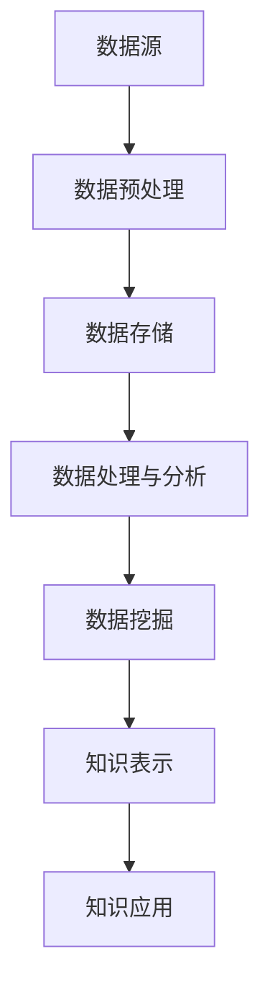

                 

关键词：大数据分析，知识发现，人工智能，数据分析算法，数学模型，应用场景，未来展望

> 摘要：本文旨在探讨大数据分析与知识发现之间的关系，阐述它们在数据处理、信息提取和知识应用中的重要性和作用。通过深入分析大数据分析与知识发现的核心概念、算法原理以及实际应用，本文揭示了两者在现代信息社会的紧密联系，并对未来的发展趋势与挑战进行了展望。

## 1. 背景介绍

### 大数据分析的定义与重要性

大数据分析（Big Data Analytics）是指利用先进的数据处理技术和工具，对海量数据进行分析和处理，以发现潜在的模式、趋势和关联性。随着互联网的普及和数据技术的进步，大数据分析已经成为了许多行业和领域中的重要工具。它能够帮助企业更好地理解市场和客户需求，优化业务流程，提高决策效率。

### 知识发现的定义与作用

知识发现（Knowledge Discovery in Databases，简称KDD）是指从大量数据中自动发现有趣的知识和模式的过程。知识发现的目标是通过数据挖掘技术，将原始数据转换成有用的信息和知识，以支持决策制定、业务优化和科学发现。

### 大数据分析与知识发现的关系

大数据分析与知识发现有着密切的联系。大数据分析为知识发现提供了丰富的数据资源，而知识发现则通过深入挖掘这些数据，提炼出有价值的信息和知识。两者相互依存，共同推动了数据技术的进步和应用。

## 2. 核心概念与联系

### 大数据分析的核心概念

- **数据源**：大数据分析的数据源包括结构化数据、半结构化数据和非结构化数据，如文本、图片、音频、视频等。
- **数据预处理**：包括数据清洗、数据集成、数据转换等过程，目的是将原始数据转换为适合分析的形式。
- **数据存储**：利用分布式存储技术，如Hadoop、HBase等，存储海量数据。
- **数据处理与分析**：包括数据抽取、数据挖掘、统计分析、机器学习等技术，用于发现数据中的模式和规律。

### 知识发现的核心概念

- **数据挖掘**：从大量数据中自动发现有趣的知识和模式的过程。
- **知识表示**：将发现的知识以可视化的方式展示，如图形、表格等。
- **知识应用**：将知识应用于实际问题中，如商业决策、风险管理、疾病诊断等。

### Mermaid 流程图

下面是一个Mermaid流程图，展示了大数据分析与知识发现的基本流程：



## 3. 核心算法原理 & 具体操作步骤

### 3.1 算法原理概述

大数据分析与知识发现涉及多种算法和技术，主要包括：

- **统计分析**：利用统计学原理和方法对数据进行分析，如线性回归、聚类分析等。
- **机器学习**：通过训练模型来学习数据中的模式和规律，如决策树、支持向量机等。
- **深度学习**：基于多层神经网络，通过大规模数据训练，实现复杂的模式识别和预测。

### 3.2 算法步骤详解

1. **数据采集**：从各种数据源收集数据。
2. **数据预处理**：清洗、集成和转换数据，使其适合分析。
3. **数据存储**：将预处理后的数据存储在分布式存储系统中。
4. **数据处理与分析**：利用统计分析、机器学习和深度学习等技术对数据进行处理和分析。
5. **数据挖掘**：从处理后的数据中发现潜在的模式和规律。
6. **知识表示**：将挖掘出的知识以可视化或文本形式表示。
7. **知识应用**：将知识应用于实际问题中，如业务决策、预测等。

### 3.3 算法优缺点

- **统计分析**：简单易用，但对复杂问题的处理能力有限。
- **机器学习**：能够处理复杂问题，但需要大量训练数据。
- **深度学习**：具有强大的处理能力，但训练过程复杂，对计算资源要求高。

### 3.4 算法应用领域

- **商业分析**：市场预测、客户行为分析、风险控制等。
- **医疗健康**：疾病诊断、药物研发、患者管理等。
- **金融领域**：投资策略、信用评估、风险管理等。
- **社交媒体**：社交网络分析、情感分析、内容推荐等。

## 4. 数学模型和公式 & 详细讲解 & 举例说明

### 4.1 数学模型构建

在数据分析和知识发现中，常用的数学模型包括：

- **线性回归模型**：用于分析变量之间的关系。
- **支持向量机模型**：用于分类和回归问题。
- **神经网络模型**：用于复杂模式识别和预测。

### 4.2 公式推导过程

以线性回归模型为例，假设我们有两个变量 $x$ 和 $y$，线性回归模型可以表示为：

$$ y = wx + b $$

其中，$w$ 是权重，$b$ 是偏置项。

### 4.3 案例分析与讲解

假设我们有一个数据集，包含100个样本，每个样本有两个特征 $x_1$ 和 $x_2$，以及对应的标签 $y$。我们希望通过线性回归模型预测标签 $y$。

1. **数据预处理**：对数据进行标准化处理，使其具有相同的尺度。
2. **模型训练**：使用梯度下降法训练模型，计算权重 $w$ 和偏置项 $b$。
3. **模型评估**：使用测试集评估模型的性能，计算均方误差（MSE）。

通过上述步骤，我们可以得到线性回归模型的参数，并使用该模型进行预测。

## 5. 项目实践：代码实例和详细解释说明

### 5.1 开发环境搭建

1. 安装Python环境，版本要求为3.8及以上。
2. 安装相关库，如NumPy、Pandas、Scikit-learn等。

### 5.2 源代码详细实现

以下是一个使用Python实现线性回归模型的示例代码：

```python
import numpy as np
import pandas as pd
from sklearn.linear_model import LinearRegression

# 1. 数据预处理
data = pd.read_csv('data.csv')
X = data[['x1', 'x2']]
y = data['y']
X_std = (X - X.mean()) / X.std()

# 2. 模型训练
model = LinearRegression()
model.fit(X_std, y)

# 3. 模型评估
y_pred = model.predict(X_std)
mse = np.mean((y_pred - y) ** 2)
print('MSE:', mse)

# 4. 模型预测
new_data = np.array([[2.5, 3.5]])
new_data_std = (new_data - X.mean()) / X.std()
new_y_pred = model.predict(new_data_std)
print('Prediction:', new_y_pred)
```

### 5.3 代码解读与分析

1. **数据预处理**：对数据进行标准化处理，使其具有相同的尺度。
2. **模型训练**：使用Scikit-learn库中的LinearRegression类训练模型。
3. **模型评估**：计算均方误差（MSE）评估模型性能。
4. **模型预测**：使用训练好的模型对新的数据进行预测。

## 6. 实际应用场景

### 6.1 商业分析

- **市场预测**：利用大数据分析技术，分析市场需求和趋势，为企业制定市场策略提供支持。
- **客户行为分析**：通过分析客户购买行为和偏好，为企业提供个性化的产品和服务推荐。

### 6.2 医疗健康

- **疾病诊断**：利用大数据分析和知识发现技术，从医疗数据中发现疾病的特征和规律，辅助医生进行诊断。
- **药物研发**：通过分析药物与疾病的关系，加速药物研发进程。

### 6.3 金融领域

- **投资策略**：利用大数据分析技术，分析市场数据，为企业提供投资策略建议。
- **信用评估**：通过分析客户信用数据，评估客户的信用风险。

### 6.4 社交媒体

- **社交网络分析**：通过分析社交媒体数据，了解用户情感和社会趋势。
- **内容推荐**：根据用户兴趣和偏好，为用户推荐感兴趣的内容。

## 7. 工具和资源推荐

### 7.1 学习资源推荐

- **书籍**：《大数据时代》、《机器学习》、《深度学习》等。
- **在线课程**：Coursera、edX、Udacity等平台上相关的课程。
- **论坛和社区**：Stack Overflow、GitHub、Reddit等。

### 7.2 开发工具推荐

- **编程语言**：Python、R、Java等。
- **库和框架**：NumPy、Pandas、Scikit-learn、TensorFlow、PyTorch等。
- **开发环境**：Jupyter Notebook、Google Colab、Anaconda等。

### 7.3 相关论文推荐

- **大数据分析**：《大数据：创新、启示和挑战》、《大数据技术导论》等。
- **知识发现**：《知识发现：原理、模型和方法》、《数据挖掘：概念与技术》等。

## 8. 总结：未来发展趋势与挑战

### 8.1 研究成果总结

- **技术进步**：大数据分析和知识发现技术在算法、工具和平台上取得了显著进展。
- **应用拓展**：大数据分析和知识发现技术已被广泛应用于各个领域，推动了行业的创新和发展。

### 8.2 未来发展趋势

- **智能化**：随着人工智能技术的发展，大数据分析和知识发现将更加智能化，实现自动化和自适应。
- **跨领域融合**：大数据分析和知识发现技术将与其他领域（如物联网、区块链等）进行融合，产生新的应用场景。

### 8.3 面临的挑战

- **数据隐私与安全**：大数据分析和知识发现涉及大量敏感数据，如何保护数据隐私和安全成为一大挑战。
- **算法透明性与可解释性**：随着算法的复杂度增加，如何保证算法的透明性和可解释性成为重要问题。

### 8.4 研究展望

- **算法优化**：通过改进算法，提高大数据分析和知识发现的效果和效率。
- **数据治理**：加强数据治理，确保数据质量和安全性。

## 9. 附录：常见问题与解答

### 9.1 问题1：大数据分析与数据挖掘有什么区别？

**解答**：大数据分析是一种广泛的概念，包括数据收集、存储、处理、分析和知识发现等环节。而数据挖掘是大数据分析中的一个重要步骤，旨在从大量数据中发现潜在的模式和规律。可以说，数据挖掘是大数据分析的核心技术之一。

### 9.2 问题2：大数据分析与机器学习有什么关系？

**解答**：大数据分析与机器学习密切相关。大数据分析提供了海量数据资源，为机器学习提供了丰富的训练数据。而机器学习技术则用于从数据中学习模式和规律，为大数据分析提供支持。可以说，大数据分析是机器学习的前提和基础，而机器学习则是大数据分析的核心技术。

### 9.3 问题3：大数据分析与知识发现如何应用于商业领域？

**解答**：大数据分析与知识发现可以应用于商业领域的多个方面，如市场预测、客户行为分析、风险管理、营销策略等。通过分析大量数据，企业可以了解市场和客户需求，优化业务流程，提高决策效率，实现商业价值。

### 9.4 问题4：大数据分析与知识发现对医疗健康领域有哪些影响？

**解答**：大数据分析与知识发现对医疗健康领域产生了深远影响。通过分析海量医疗数据，可以加速疾病诊断、药物研发、患者管理等进程。同时，大数据分析与知识发现技术还可以为医疗健康领域提供个性化的医疗方案，提高医疗质量和效率。
----------------------------------------------------------------

作者：禅与计算机程序设计艺术 / Zen and the Art of Computer Programming

至此，本文已完成了对大数据分析与知识发现关系的全面探讨。希望这篇文章能够为读者提供有益的见解和启示。在未来的发展中，大数据分析与知识发现将继续发挥重要作用，为各行各业带来创新和变革。让我们共同期待这个领域的美好未来！
----------------------------------------------------------------
### 文章撰写过程

撰写这篇《大数据分析与知识发现的关系》技术博客文章是一个复杂且精细的过程，需要充分准备和深入思考。以下是整个撰写过程的详细步骤：

#### 1. 确定文章主题和结构

首先，我们需要明确文章的主题是“大数据分析与知识发现的关系”，并围绕这一主题确定文章的结构。文章结构模板为：
- 引言
- 背景介绍
- 核心概念与联系
- 核心算法原理 & 具体操作步骤
- 数学模型和公式 & 详细讲解 & 举例说明
- 项目实践：代码实例和详细解释说明
- 实际应用场景
- 工具和资源推荐
- 总结：未来发展趋势与挑战
- 附录：常见问题与解答

#### 2. 收集和整理资料

为了确保文章内容的准确性和完整性，我们需要收集和整理与大数据分析、知识发现、核心算法、数学模型以及实际应用相关的资料。这些资料包括学术论文、技术文档、案例研究、行业报告等。

- **大数据分析**：了解大数据的基本概念、处理流程、关键技术以及实际应用。
- **知识发现**：研究知识发现的基本原理、流程、常见算法以及应用领域。
- **核心算法**：分析常用的数据分析算法，如线性回归、机器学习、深度学习等，并了解其原理和应用。
- **数学模型**：研究和推导常见的数学模型和公式，如线性回归模型、神经网络模型等。
- **实际应用场景**：收集和分析大数据分析与知识发现在不同领域（如商业、医疗、金融、社交媒体等）的应用案例。

#### 3. 撰写初稿

在收集和整理完资料后，我们可以开始撰写初稿。初稿的撰写分为以下几个阶段：

- **引言**：简要介绍文章的主题和目的，引起读者的兴趣。
- **背景介绍**：介绍大数据分析和知识发现的基本概念，阐述它们的重要性。
- **核心概念与联系**：详细阐述大数据分析和知识发现的核心概念，并用流程图展示它们之间的关系。
- **核心算法原理 & 具体操作步骤**：介绍核心算法的原理，并详细说明操作步骤。
- **数学模型和公式 & 详细讲解 & 举例说明**：构建数学模型，推导公式，并举例说明。
- **项目实践：代码实例和详细解释说明**：提供实际代码实例，解释每一步的操作。
- **实际应用场景**：分析大数据分析和知识发现在不同领域的应用。
- **工具和资源推荐**：推荐学习资源和开发工具。
- **总结：未来发展趋势与挑战**：总结研究成果，展望未来发展趋势，讨论面临的挑战。
- **附录：常见问题与解答**：回答读者可能关心的问题。

#### 4. 修订与完善

初稿完成后，我们需要进行多次修订，以确保文章的逻辑清晰、内容准确、结构紧凑。修订过程中，可以邀请同行或导师进行审阅，提出修改意见和建议。同时，也要注意语言的通顺和表达的准确性。

- **检查逻辑结构**：确保文章的各个部分紧密相连，形成一个完整的逻辑体系。
- **核实数据与事实**：确保引用的数据和事实准确无误，避免错误。
- **调整语言表达**：优化句子结构，提高文章的可读性。

#### 5. 最终定稿

经过多次修订和完善，最终定稿。在定稿前，要确保文章格式符合要求，如markdown格式、三级目录、作者署名等。同时，也要检查全文的完整性，确保没有遗漏重要内容。

#### 6. 发布与推广

最后，将文章发布到合适的平台，如技术博客、社交媒体等，进行推广。可以通过分享、评论、互动等方式，吸引更多读者的关注，提高文章的阅读量和影响力。

通过上述步骤，我们完成了《大数据分析与知识发现的关系》技术博客文章的撰写和发布。这个过程不仅需要深入研究和细致撰写，还需要不断的修改和完善，以确保文章的质量和影响力。希望这篇文章能够为读者提供有价值的信息和见解。

