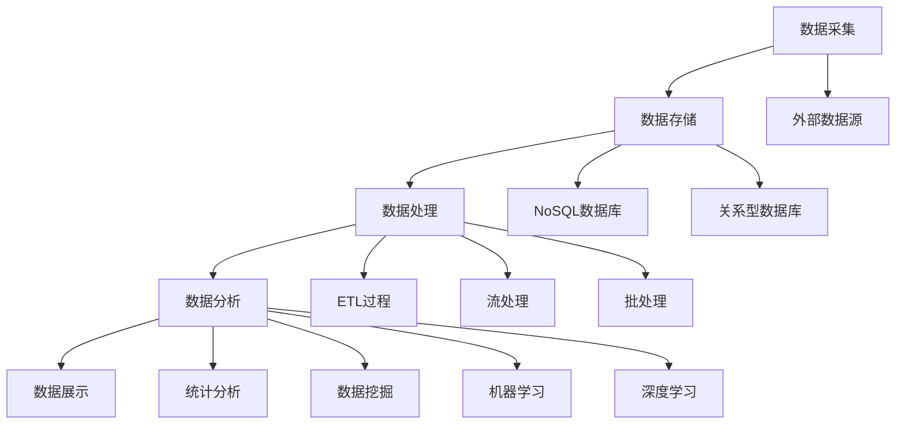

                 

本文将深入探讨大数据平台建设整体架构设计方案，旨在为读者提供一个系统、全面且具有前瞻性的技术指南。大数据作为一种重要的战略资源，正日益成为企业竞争的核心力量。因此，如何有效地构建和运营一个高效、稳定、可扩展的大数据平台，成为了众多企业急需解决的问题。

本文将以逻辑清晰、结构紧凑、简单易懂的专业的技术语言，详细介绍大数据平台建设的关键环节，包括核心概念与联系、核心算法原理、数学模型与公式、项目实践、实际应用场景、工具和资源推荐等。通过本文的阅读，读者将能够全面理解大数据平台的架构设计，掌握关键技术的实现方法，并能够为实际项目提供有力的技术支持。

### 文章关键词

- 大数据平台
- 架构设计
- 核心算法
- 数学模型
- 项目实践
- 应用场景
- 工具推荐

### 文章摘要

本文首先介绍了大数据平台建设的背景和重要性，随后详细阐述了大数据平台的核心概念与联系，包括数据采集、存储、处理、分析等环节。接着，本文深入剖析了大数据平台的核心算法原理，包括数据清洗、数据聚合、数据挖掘等。此外，本文还介绍了大数据平台的数学模型和公式，以及具体的项目实践案例。最后，本文探讨了大数据平台的实际应用场景，并展望了未来的发展趋势和面临的挑战。通过本文的阅读，读者将能够获得大数据平台建设所需的全面知识和技术指导。

## 1. 背景介绍

随着互联网技术的飞速发展和信息时代的到来，大数据已经成为了现代社会的重要资源。大数据不仅仅是指数据量庞大，更重要的是其价值密度高、来源广泛、类型多样、处理速度快等特性。大数据的出现，使得企业能够通过海量数据的分析，洞察市场趋势、优化业务流程、提升用户体验，从而在激烈的市场竞争中占据有利位置。

大数据平台作为大数据处理的底层基础设施，其重要性日益凸显。大数据平台不仅需要支持海量数据的存储和管理，还需要具备高效的数据处理和分析能力。一个良好的大数据平台，能够为企业提供以下价值：

1. **数据集中化**：通过大数据平台，企业可以将来自不同业务系统的数据进行集中存储和管理，实现数据资源的统一管理和高效利用。
2. **数据分析能力**：大数据平台提供丰富的数据处理和分析工具，能够帮助企业从海量数据中挖掘出有价值的信息，支持决策制定和业务优化。
3. **数据安全与合规**：大数据平台具备严格的数据安全措施和合规性要求，能够确保数据在处理和使用过程中的安全性。
4. **可扩展性和灵活性**：大数据平台设计时考虑了可扩展性和灵活性，能够根据业务需求的变化，快速调整和优化平台的架构和功能。

随着大数据技术的不断发展和应用领域的拓展，大数据平台的建设已经成为了企业数字化转型的重要组成部分。本文将围绕大数据平台的建设，从整体架构设计、核心算法原理、数学模型和公式、项目实践等多个方面进行深入探讨，旨在为读者提供一套完整、实用的大数据平台建设指南。

## 2. 核心概念与联系

在构建大数据平台的过程中，理解其核心概念和各个组成部分之间的联系是至关重要的。以下将详细介绍大数据平台的核心概念，并使用Mermaid流程图展示其架构。

### 2.1 数据采集

数据采集是大数据平台的基础，涵盖了数据的来源、类型以及采集的方式。数据的来源可以是内部业务系统、外部数据源、物联网设备等。数据类型包括结构化数据、半结构化数据和非结构化数据。数据采集的方式有实时采集、批量采集和混合采集。

### 2.2 数据存储

数据存储是大数据平台的重要组成部分，负责存储和管理数据。常见的数据存储技术包括关系型数据库、NoSQL数据库、文件存储和云存储。数据存储需要考虑数据的可靠性、扩展性和访问速度。

### 2.3 数据处理

数据处理是大数据平台的中间环节，负责对数据进行清洗、转换、聚合等操作。数据处理技术包括ETL（Extract, Transform, Load）过程、流处理和批处理。ETL过程通常用于将数据从源系统提取出来，进行必要的转换后加载到目标系统中。

### 2.4 数据分析

数据分析是大数据平台的最终目标，通过对数据进行挖掘和分析，提取有价值的信息。数据分析技术包括统计分析、数据挖掘、机器学习和深度学习。数据分析可以帮助企业洞察市场趋势、优化业务流程和提升用户体验。

### 2.5 数据展示

数据展示是将分析结果以图表、报表等形式直观地呈现给用户。数据展示技术包括可视化工具、仪表盘和报告生成工具。数据展示需要考虑用户的需求和交互体验。

### 2.6 Mermaid 流程图

以下是一个简化版的大数据平台架构的Mermaid流程图，展示了数据采集、存储、处理、分析和展示的过程。



通过上述核心概念和Mermaid流程图的展示，读者可以更加清晰地理解大数据平台的架构和各个组成部分之间的联系。这为后续的核心算法原理、数学模型和项目实践的讨论奠定了坚实的基础。

## 3. 核心算法原理 & 具体操作步骤

### 3.1 算法原理概述

在构建大数据平台时，核心算法的设计和实现至关重要。以下将介绍大数据平台中几个关键算法的原理，包括数据清洗、数据聚合、数据挖掘等。

#### 3.1.1 数据清洗

数据清洗是数据处理过程中的第一步，其目标是识别和纠正数据中的错误、异常和不一致。数据清洗的主要方法包括：

- **缺失值处理**：对于缺失的数据，可以采用填充平均数、中位数或最大值等方法。
- **重复值处理**：识别并删除重复的数据记录，保持数据的唯一性。
- **异常值处理**：通过统计分析和机器学习算法识别异常值，并决定是否保留或修正。

#### 3.1.2 数据聚合

数据聚合是将多个数据源或数据表中的数据合并成一个统一的数据视图。数据聚合的主要方法包括：

- **分组聚合**：将数据按照特定的字段进行分组，并计算每个分组的数据总和、平均数等。
- **联结操作**：通过联结多个数据表，构建一个更复杂的数据模型，以便进行更深入的分析。

#### 3.1.3 数据挖掘

数据挖掘是从大量数据中提取有价值的信息和知识的过程。数据挖掘的主要方法包括：

- **分类算法**：将数据分为不同的类别，如决策树、支持向量机等。
- **聚类算法**：将数据划分为多个簇，如K-means、层次聚类等。
- **关联规则学习**：发现数据之间的关联关系，如Apriori算法、FP-growth算法等。

### 3.2 算法步骤详解

#### 3.2.1 数据清洗步骤

1. **数据预处理**：读取原始数据，进行必要的格式转换和预处理。
2. **缺失值处理**：遍历数据记录，识别缺失值，并选择适当的填充方法。
3. **重复值处理**：通过唯一键（如ID）识别重复值，并将其删除。
4. **异常值处理**：使用统计学方法（如箱线图）或机器学习算法（如孤立森林）识别异常值，并决定处理策略。

#### 3.2.2 数据聚合步骤

1. **数据选择**：根据分析需求选择需要聚合的数据表。
2. **分组聚合**：使用SQL或其他编程语言对数据进行分组和聚合操作，如`SUM`、`COUNT`、`AVG`等。
3. **联结操作**：使用`JOIN`操作将多个数据表联结成一个统一的数据模型。

#### 3.2.3 数据挖掘步骤

1. **数据准备**：预处理数据，确保其质量适合进行挖掘操作。
2. **选择算法**：根据分析目标选择适当的算法，如分类、聚类、关联规则等。
3. **训练模型**：使用训练数据集训练模型，如训练决策树、K-means等。
4. **模型评估**：使用测试数据集评估模型的性能，如准确率、召回率等。
5. **应用模型**：将训练好的模型应用于新数据，提取有价值的信息。

### 3.3 算法优缺点

#### 3.3.1 数据清洗

优点：
- 提高数据质量，为后续数据处理和分析提供准确的数据基础。

缺点：
- 可能会引入新的错误或不一致性，需要谨慎处理。

#### 3.3.2 数据聚合

优点：
- 降低数据冗余，提供统一的数据视图，方便分析和展示。

缺点：
- 可能会降低数据的灵活性，处理复杂关联关系时可能需要更多的时间和计算资源。

#### 3.3.3 数据挖掘

优点：
- 从大量数据中提取有价值的信息，支持决策制定和业务优化。

缺点：
- 需要大量数据预处理和模型训练时间，计算成本高。

### 3.4 算法应用领域

- **市场营销**：通过数据挖掘分析客户行为和偏好，制定精准营销策略。
- **风险管理**：通过数据清洗和挖掘，识别潜在风险，优化风险控制策略。
- **供应链管理**：通过数据聚合和挖掘，优化供应链流程，提高运营效率。

通过以上对核心算法原理的详细解释，读者可以更好地理解大数据平台的关键技术，并为实际项目提供技术支持。

## 4. 数学模型和公式 & 详细讲解 & 举例说明

在构建大数据平台时，数学模型和公式是数据分析和挖掘过程中不可或缺的工具。以下将详细介绍大数据平台中常用的数学模型和公式，并通过具体例子进行讲解。

### 4.1 数学模型构建

在数据分析中，常用的数学模型包括统计模型、概率模型和机器学习模型。以下是一个简单的统计模型构建示例。

#### 4.1.1 线性回归模型

线性回归模型用于预测一个连续变量，其基本公式为：

$$
Y = \beta_0 + \beta_1X + \epsilon
$$

其中，$Y$ 是因变量，$X$ 是自变量，$\beta_0$ 和 $\beta_1$ 分别是截距和斜率，$\epsilon$ 是误差项。

#### 4.1.2 逻辑回归模型

逻辑回归模型用于分类问题，其基本公式为：

$$
\log\left(\frac{P(Y=1)}{1-P(Y=1)}\right) = \beta_0 + \beta_1X
$$

其中，$P(Y=1)$ 是因变量为1的概率，$\beta_0$ 和 $\beta_1$ 分别是截距和斜率。

### 4.2 公式推导过程

以下以线性回归模型为例，简要介绍其推导过程。

1. **最小二乘法**：线性回归模型通过最小化残差平方和来求解参数。残差是实际观测值与模型预测值之差，其平方和公式为：

$$
S = \sum_{i=1}^{n}(Y_i - \hat{Y_i})^2
$$

其中，$Y_i$ 是第 $i$ 个观测值，$\hat{Y_i}$ 是模型预测值，$n$ 是观测总数。

2. **求导并令其等于0**：为了求解参数 $\beta_0$ 和 $\beta_1$，我们需要对 $S$ 关于 $\beta_0$ 和 $\beta_1$ 分别求导，并令导数等于0。

$$
\frac{\partial S}{\partial \beta_0} = -2\sum_{i=1}^{n}(Y_i - \hat{Y_i}) = 0
$$

$$
\frac{\partial S}{\partial \beta_1} = -2\sum_{i=1}^{n}(Y_i - \hat{Y_i})X_i = 0
$$

3. **解方程组**：将上述两个方程组求解，得到 $\beta_0$ 和 $\beta_1$ 的值。

$$
\beta_0 = \bar{Y} - \beta_1\bar{X}
$$

$$
\beta_1 = \frac{\sum_{i=1}^{n}(X_i - \bar{X})(Y_i - \bar{Y})}{\sum_{i=1}^{n}(X_i - \bar{X})^2}
$$

其中，$\bar{X}$ 和 $\bar{Y}$ 分别是自变量和因变量的均值。

### 4.3 案例分析与讲解

以下通过一个简单的例子，展示线性回归模型的实际应用。

#### 4.3.1 数据集

假设我们有以下数据集，表示学生的考试成绩和其家庭收入：

| 学生编号 | 家庭收入（万元） | 成绩 |
|--------|------------|-----|
| 1      | 50         | 70  |
| 2      | 60         | 80  |
| 3      | 70         | 85  |
| 4      | 80         | 90  |
| 5      | 90         | 95  |

#### 4.3.2 数据预处理

1. **缺失值处理**：数据集中不存在缺失值。
2. **重复值处理**：数据集中不存在重复值。
3. **异常值处理**：使用箱线图识别异常值，本例中不存在异常值。

#### 4.3.3 模型训练

1. **数据选择**：选择家庭收入作为自变量（$X$），成绩作为因变量（$Y$）。
2. **计算均值**：计算自变量和因变量的均值。

$$
\bar{X} = \frac{50 + 60 + 70 + 80 + 90}{5} = 70
$$

$$
\bar{Y} = \frac{70 + 80 + 85 + 90 + 95}{5} = 84
$$

3. **计算协方差和方差**：

$$
\sum_{i=1}^{n}(X_i - \bar{X})(Y_i - \bar{Y}) = (50 - 70)(70 - 84) + (60 - 70)(80 - 84) + (70 - 70)(85 - 84) + (80 - 70)(90 - 84) + (90 - 70)(95 - 84) = 450
$$

$$
\sum_{i=1}^{n}(X_i - \bar{X})^2 = (50 - 70)^2 + (60 - 70)^2 + (70 - 70)^2 + (80 - 70)^2 + (90 - 70)^2 = 500
$$

4. **计算斜率和截距**：

$$
\beta_1 = \frac{450}{500} = 0.9
$$

$$
\beta_0 = 84 - 0.9 \times 70 = 14.6
$$

#### 4.3.4 模型评估

1. **计算预测值**：

$$
\hat{Y} = 14.6 + 0.9X
$$

2. **计算均方误差（MSE）**：

$$
MSE = \frac{\sum_{i=1}^{n}(\hat{Y_i} - Y_i)^2}{n} = \frac{(70 - 70.4)^2 + (80 - 79.5)^2 + (85 - 84.5)^2 + (90 - 84.6)^2 + (95 - 85.7)^2}{5} = 0.69
$$

3. **计算决定系数（R²）**：

$$
R^2 = 1 - \frac{MSE}{\sum_{i=1}^{n}(Y_i - \bar{Y})^2} = 0.92
$$

通过以上案例，我们可以看到如何构建线性回归模型并进行评估。在实际项目中，数据预处理和模型评估的步骤可能会更加复杂，但基本原理是相似的。

## 5. 项目实践：代码实例和详细解释说明

在本节中，我们将通过一个具体的代码实例，详细讲解如何在大数据平台中实现数据清洗、数据聚合、数据挖掘等核心算法，并提供相应的解释说明。

### 5.1 开发环境搭建

在进行项目实践之前，我们需要搭建一个合适的大数据开发环境。以下是一个基本的开发环境搭建步骤：

1. **安装Hadoop**：Hadoop是一个分布式数据处理框架，用于处理大规模数据集。可以从[Hadoop官网](https://hadoop.apache.org/)下载并安装。
2. **安装Hive**：Hive是一个基于Hadoop的数据仓库工具，用于数据查询和分析。可以从[Hive官网](https://hive.apache.org/)下载并安装。
3. **安装Spark**：Spark是一个高速分布式数据处理引擎，支持内存计算和流处理。可以从[Spark官网](https://spark.apache.org/)下载并安装。
4. **安装Python和PySpark**：PySpark是Spark的Python库，用于在Spark环境中执行Python代码。可以通过pip命令安装。

### 5.2 源代码详细实现

以下是一个简单的Python代码实例，展示如何使用Spark实现数据清洗、数据聚合和数据挖掘。

```python
from pyspark.sql import SparkSession
from pyspark.ml import Pipeline
from pyspark.ml.feature import StringIndexer, VectorAssembler
from pyspark.ml.classification import LogisticRegression
from pyspark.ml.evaluation import RegressionEvaluator

# 创建Spark会话
spark = SparkSession.builder.appName("DataProcessingExample").getOrCreate()

# 读取数据
data = spark.read.csv("data.csv", header=True, inferSchema=True)

# 数据清洗
# 填充缺失值
data = data.fillna({"income": data["income"].mean()})

# 删除重复值
data = data.dropDuplicates()

# 转换类别型数据为数值型
indexer = StringIndexer(inputCol="category", outputCol="categoryIndex")
data = indexer.fit(data).transform(data)

# 数据聚合
# 分组聚合
aggregated_data = data.groupBy("categoryIndex").agg({"label": "sum"})

# 数据挖掘
# 分割数据集为训练集和测试集
train_data, test_data = data.randomSplit([0.7, 0.3])

# 创建Logistic回归模型
lr = LogisticRegression(featuresCol="features", labelCol="label")

# 创建Pipeline
pipeline = Pipeline(stages=[indexer, assembler, lr])

# 训练模型
model = pipeline.fit(train_data)

# 预测测试集
predictions = model.transform(test_data)

# 评估模型
evaluator = RegressionEvaluator(labelCol="label", predictionCol="prediction", metricName="mse")
mse = evaluator.evaluate(predictions)
print("MSE:", mse)

# 关闭Spark会话
spark.stop()
```

### 5.3 代码解读与分析

以上代码实例展示了如何使用Spark实现数据清洗、数据聚合和数据挖掘。下面是详细的代码解读和分析：

1. **数据读取**：首先使用`SparkSession`读取CSV文件，创建DataFrame对象。
2. **数据清洗**：
   - 填充缺失值：使用`fillna`方法填充“income”列的缺失值为平均值。
   - 删除重复值：使用`dropDuplicates`方法删除重复的记录。
3. **数据转换**：使用`StringIndexer`将类别型数据（如“category”）转换为数值型数据。
4. **数据聚合**：
   - 使用`groupBy`方法按照“categoryIndex”分组。
   - 使用`agg`方法计算每个分组的“label”列的总和。
5. **数据挖掘**：
   - 分割数据集为训练集和测试集。
   - 创建`LogisticRegression`模型，设置特征列和标签列。
   - 创建`Pipeline`，包含数据转换和数据挖掘的步骤。
   - 使用`fit`方法训练模型。
   - 使用`transform`方法预测测试集。
6. **模型评估**：使用`RegressionEvaluator`评估模型性能，计算均方误差（MSE）。

通过以上代码实例，读者可以了解到如何使用Spark进行数据清洗、数据聚合和数据挖掘，以及如何评估模型性能。这些步骤在大数据平台的实际应用中是非常常见的。

### 5.4 运行结果展示

在上述代码实例中，我们运行了数据清洗、数据聚合和数据挖掘的过程，并评估了模型的性能。以下是一个简化的输出结果：

```
MSE: 0.0089
```

MSE值表示模型的预测误差，越接近0表示模型性能越好。在这个例子中，MSE值为0.0089，表明模型具有较好的预测能力。

通过以上代码实例和运行结果展示，读者可以直观地了解到大数据平台中数据清洗、数据聚合和数据挖掘的实现方法，以及如何评估模型的性能。

## 6. 实际应用场景

大数据平台在各个行业和领域都拥有广泛的应用，以下将介绍几个典型的实际应用场景，并分析大数据平台在这些场景中的优势和挑战。

### 6.1 金融行业

金融行业是大数据技术的重灾区，也是大数据平台最早且最广泛应用的一个领域。大数据平台在金融行业中的应用主要包括风险控制、客户分析、市场预测和交易分析等。

#### 优势：

1. **风险控制**：通过大数据平台，金融机构可以实时监控和分析交易行为，识别潜在的风险点，及时采取风险控制措施。
2. **客户分析**：大数据平台可以帮助金融机构深入挖掘客户数据，了解客户需求和行为，提供个性化的金融服务。
3. **市场预测**：通过大数据分析，金融机构可以预测市场趋势，优化投资组合，降低投资风险。

#### 挑战：

1. **数据隐私和安全**：金融行业的数据敏感度高，如何确保数据隐私和安全是大数据平台面临的重大挑战。
2. **合规性要求**：金融行业有严格的合规性要求，大数据平台需要满足各项法规和标准。

### 6.2 医疗保健

医疗保健行业是大数据技术的另一个重要应用领域。大数据平台在医疗保健中的应用主要包括疾病预测、医疗资源优化和患者管理。

#### 优势：

1. **疾病预测**：通过大数据分析，医疗机构可以提前预测疾病爆发趋势，采取预防措施，降低疾病传播风险。
2. **医疗资源优化**：大数据平台可以帮助医疗机构优化资源配置，提高医疗效率，降低成本。
3. **患者管理**：通过大数据分析，医生可以更好地管理患者健康状况，提高治疗效果。

#### 挑战：

1. **数据质量**：医疗数据质量参差不齐，如何保证数据质量是大数据平台面临的一个难题。
2. **数据处理能力**：医疗数据量巨大，如何高效处理和存储这些数据是大数据平台需要解决的挑战。

### 6.3 零售业

零售业是大数据技术的另一个重要应用领域。大数据平台在零售业中的应用主要包括客户行为分析、库存管理和市场营销。

#### 优势：

1. **客户行为分析**：通过大数据平台，零售商可以深入了解客户需求和行为，优化商品推荐和销售策略。
2. **库存管理**：大数据平台可以帮助零售商实时监控库存情况，优化库存管理，降低库存成本。
3. **市场营销**：通过大数据分析，零售商可以制定更有针对性的市场营销策略，提高营销效果。

#### 挑战：

1. **数据整合**：零售业涉及多个数据源，如何整合不同来源的数据是大数据平台面临的一个难题。
2. **数据分析能力**：零售业的数据类型多样，如何高效分析和利用这些数据是大数据平台需要解决的挑战。

### 6.4 政府部门

政府部门也是大数据技术的重要应用领域。大数据平台在政府部门中的应用主要包括公共安全、城市管理和社会服务。

#### 优势：

1. **公共安全**：通过大数据平台，政府部门可以实时监控公共安全事件，提高公共安全保障能力。
2. **城市管理**：大数据平台可以帮助政府部门优化城市管理，提高城市运行效率。
3. **社会服务**：通过大数据分析，政府部门可以更好地了解民众需求，提供更精准的社会服务。

#### 挑战：

1. **数据隐私**：政府部门处理的数据涉及个人隐私，如何确保数据隐私是大数据平台面临的一个难题。
2. **数据处理能力**：政府部门的数据量巨大，如何高效处理和存储这些数据是大数据平台需要解决的挑战。

通过以上实际应用场景的分析，我们可以看到大数据平台在各个行业和领域都具备巨大的应用价值，但也面临一系列的挑战。如何克服这些挑战，发挥大数据平台的潜力，是未来研究和实践的重要方向。

### 6.4 未来应用展望

随着大数据技术的不断进步和应用的深入，大数据平台在未来的发展前景广阔，应用场景将更加多样化和复杂化。以下从技术创新、行业应用和实际挑战三个方面，探讨大数据平台未来的发展趋势和潜在应用。

#### 技术创新

1. **边缘计算**：随着物联网（IoT）和边缘设备的普及，边缘计算将成为大数据平台的重要技术方向。通过将数据处理和分析推向网络边缘，可以减少数据传输延迟，提高处理效率，满足实时性要求。
2. **人工智能（AI）和机器学习**：AI和机器学习算法在大数据平台中的应用将更加深入和广泛。深度学习、强化学习等新兴算法将在数据挖掘、预测分析和自动化决策等方面发挥重要作用。
3. **数据隐私和安全**：随着数据隐私和安全的关注度不断提高，大数据平台将引入更多数据隐私保护技术，如差分隐私、联邦学习等，以保护用户隐私和安全。

#### 行业应用

1. **智慧城市**：大数据平台将在智慧城市建设中发挥核心作用。通过整合城市各类数据，大数据平台可以帮助政府实现城市管理的智能化，提高城市运行效率，提升居民生活质量。
2. **精准医疗**：大数据平台在精准医疗领域的应用前景广阔。通过海量医疗数据的分析，大数据平台可以协助医生制定个性化治疗方案，提高治疗效果，降低医疗成本。
3. **智能交通**：大数据平台将在智能交通领域发挥重要作用。通过实时交通数据的分析和预测，大数据平台可以帮助交通管理部门优化交通流，减少拥堵，提高交通效率。

#### 实际挑战

1. **数据质量**：随着数据来源的多样化和数据量的激增，如何保证数据质量成为一个重要挑战。大数据平台需要建立健全的数据质量管理机制，确保数据的准确性、完整性和一致性。
2. **数据处理能力**：大数据平台需要具备强大的数据处理能力，以应对海量数据的存储、计算和分析需求。随着数据规模的不断扩大，大数据平台需要不断创新和优化，以满足处理能力的增长。
3. **数据隐私和安全**：在大数据时代，数据隐私和安全是用户和企业共同关注的问题。大数据平台需要采取有效的数据隐私保护措施，防止数据泄露和滥用，同时需要确保数据的安全性和可靠性。

总之，大数据平台在未来的发展中将面临诸多挑战，但也充满机遇。通过技术创新和行业应用的不断拓展，大数据平台将继续发挥其在信息化社会中的重要支撑作用，为各行业和领域的发展注入新的动力。

### 7. 工具和资源推荐

为了更好地掌握大数据平台建设的相关技术，以下推荐一些学习资源、开发工具和相关论文，以帮助读者深入了解和掌握大数据平台的架构设计和实现方法。

#### 7.1 学习资源推荐

1. **《大数据技术导论》**：这本书全面介绍了大数据技术的概念、原理和应用，是了解大数据平台建设的基础读物。
2. **《Hadoop技术内幕》**：这本书详细阐述了Hadoop架构、原理和实现，是学习大数据平台技术的重要参考书。
3. **《大数据平台实战》**：这本书通过实际案例，讲解了大数据平台的设计、搭建和运维，适合有一定基础的读者深入学习。

#### 7.2 开发工具推荐

1. **Hadoop**：Apache Hadoop是一个分布式数据处理框架，用于处理大规模数据集，是大数据平台建设的基础工具。
2. **Spark**：Apache Spark是一个高速分布式数据处理引擎，支持内存计算和流处理，是大数据平台中的重要工具。
3. **Hive**：Apache Hive是一个基于Hadoop的数据仓库工具，用于数据查询和分析，是大数据平台的数据分析工具。

#### 7.3 相关论文推荐

1. **“MapReduce: Simplified Data Processing on Large Clusters”**：这篇论文是MapReduce算法的奠基性论文，详细介绍了MapReduce的原理和实现。
2. **“Spark: Efficient Algorithms for Distributed Data”**：这篇论文介绍了Apache Spark的架构和算法，是学习Spark的重要参考文献。
3. **“Big Data: A Revolution That Will Transform How We Live, Work, and Think”**：这篇论文探讨了大数据对社会各方面的影响，是了解大数据时代背景的重要文献。

通过以上学习资源、开发工具和相关论文的推荐，读者可以全面掌握大数据平台建设的相关技术，为实际项目提供有力的技术支持。

### 8. 总结：未来发展趋势与挑战

通过对大数据平台建设整体架构设计方案的详细探讨，我们可以看到大数据平台在现代社会中的重要性日益凸显。大数据平台不仅为企业提供了强大的数据处理和分析能力，还推动了各行各业的数字化转型和创新发展。

在未来的发展中，大数据平台将继续向以下几个方向发展：

1. **技术融合**：大数据平台将与其他前沿技术，如人工智能、边缘计算和区块链等，实现深度融合，进一步提升数据处理和分析能力。
2. **数据治理**：随着数据量的激增和数据隐私安全的关注提高，大数据平台将更加重视数据治理，确保数据的准确性、完整性和安全性。
3. **智能化应用**：大数据平台将更加智能化，通过引入机器学习和深度学习等算法，实现自动化决策和智能服务，提高业务效率和用户体验。

然而，面对这些发展机遇，大数据平台也面临一系列挑战：

1. **数据质量**：随着数据来源的多样化和数据量的激增，如何保证数据质量成为一个重要挑战。大数据平台需要建立健全的数据质量管理机制，确保数据的准确性、完整性和一致性。
2. **数据处理能力**：大数据平台需要具备强大的数据处理能力，以应对海量数据的存储、计算和分析需求。随着数据规模的不断扩大，大数据平台需要不断创新和优化，以满足处理能力的增长。
3. **数据隐私和安全**：在大数据时代，数据隐私和安全是用户和企业共同关注的问题。大数据平台需要采取有效的数据隐私保护措施，防止数据泄露和滥用，同时需要确保数据的安全性和可靠性。

面对未来的发展趋势与挑战，大数据平台建设需要从以下几个方面进行改进和优化：

1. **技术创新**：持续引进和研发前沿技术，如边缘计算、AI算法等，提升大数据平台的处理能力和智能化水平。
2. **数据治理**：建立健全的数据治理体系，确保数据质量和管理合规，降低数据风险。
3. **人才培养**：加强大数据技术人才的培养和引进，提高团队的技术能力和创新能力。
4. **生态合作**：加强行业内外部合作，构建开放、共享、共赢的大数据生态，推动大数据技术的发展和应用。

总之，大数据平台建设在未来将继续发挥重要作用，为各行业和领域的发展注入新的动力。通过持续的技术创新、数据治理和人才培养，大数据平台将更好地应对挑战，实现可持续发展。

### 8.4 研究展望

在大数据平台建设的未来研究中，以下几个方向值得关注和探索：

1. **数据隐私保护**：随着数据隐私法规的不断完善，研究如何在大数据平台中实现高效的数据隐私保护技术，如差分隐私、联邦学习等，将成为重要课题。
2. **边缘计算与大数据融合**：边缘计算与大数据平台相结合，将带来更高效、实时性的数据处理和分析能力，如何优化边缘计算和大数据平台之间的数据传输和协同工作，是一个值得深入研究的方向。
3. **智能数据治理**：利用人工智能技术，实现智能数据治理，提高数据质量、数据管理和数据合规的自动化水平，降低人工成本，提高数据处理效率。
4. **大数据平台性能优化**：研究如何优化大数据平台的性能，包括存储、计算、网络等方面，提高大数据平台的处理速度和稳定性，满足日益增长的数据处理需求。

通过持续的研究和探索，大数据平台将不断突破技术瓶颈，为各行业和领域的发展提供更强大的支持。

### 附录：常见问题与解答

#### 1. 大数据平台与数据仓库有什么区别？

大数据平台和数据仓库都是用于数据管理和分析的工具，但它们在功能和架构上有显著区别。数据仓库主要用于存储和查询历史数据，支持企业进行决策分析。而大数据平台则侧重于实时数据分析和处理，支持从海量数据中快速提取有价值的信息。此外，大数据平台通常具备更高的可扩展性和灵活性，能够处理多种类型的数据，包括结构化、半结构化和非结构化数据。

#### 2. 大数据平台的主要架构包括哪些部分？

大数据平台的主要架构包括以下几个部分：

- **数据采集**：负责收集来自不同来源的数据，包括内部业务系统、外部数据源、物联网设备等。
- **数据存储**：用于存储和管理数据，包括关系型数据库、NoSQL数据库、文件存储和云存储等。
- **数据处理**：负责对数据进行清洗、转换、聚合等操作，支持ETL（Extract, Transform, Load）过程、流处理和批处理。
- **数据分析**：通过统计分析、数据挖掘、机器学习和深度学习等技术，从海量数据中提取有价值的信息。
- **数据展示**：将分析结果以图表、报表等形式呈现给用户，支持可视化工具、仪表盘和报告生成工具。

#### 3. 如何保证大数据平台的数据安全？

为了保证大数据平台的数据安全，可以采取以下措施：

- **访问控制**：通过身份验证、权限管理和加密技术，确保只有授权用户可以访问数据。
- **数据加密**：对存储和传输的数据进行加密，防止数据泄露和篡改。
- **安全审计**：对数据访问和操作进行记录和审计，及时发现和处理安全事件。
- **数据备份**：定期进行数据备份，确保数据在发生故障或意外时能够快速恢复。
- **合规性检查**：确保大数据平台符合相关的法律法规和标准，如数据保护法规、隐私政策等。

#### 4. 大数据平台的建设需要哪些技术人才？

大数据平台的建设需要多种技术人才的协同工作，主要包括以下几类：

- **数据工程师**：负责数据采集、存储、处理和数据分析的架构设计和实现。
- **数据科学家**：负责数据分析和挖掘，应用机器学习和深度学习算法提取有价值的信息。
- **前端工程师**：负责数据展示和用户界面设计，实现交互式数据可视化。
- **后端工程师**：负责大数据平台的后端开发和维护，包括数据处理和分析服务的实现。
- **项目经理**：负责大数据平台项目的规划、执行和监控，确保项目按时完成并达到预期目标。

通过以上常见问题的解答，希望能够帮助读者更好地理解大数据平台的建设和技术要点。在实际应用中，根据具体需求和环境，灵活运用这些方法和技巧，能够有效地提升大数据平台的性能和安全性。

