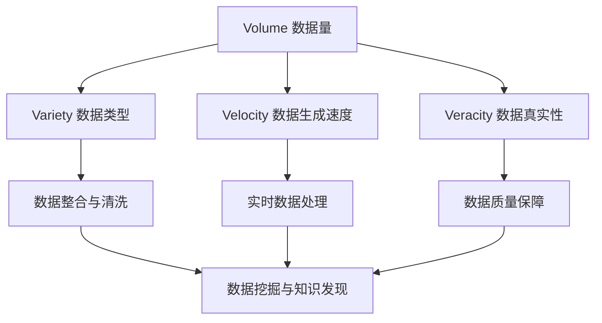

                 

### 1. 背景介绍

在信息化和数字化的浪潮下，大数据作为新时代的重要资源，已经成为驱动创新、促进发展的核心力量。自21世纪初以来，随着互联网、物联网、云计算等技术的飞速发展，数据产生了爆炸式的增长。据统计，全球数据量每两年就会翻一番，截止到2020年，全球数据量已经突破了44ZB（Zettabyte，千兆兆字节）。如此庞大的数据量，不仅给数据处理带来了巨大挑战，也为数据科学、机器学习和人工智能等领域的应用提供了丰富的素材。

然而，大数据的重要性并非仅仅体现在数据量的庞大上。其关键在于如何从中挖掘出有价值的信息和知识，以支持决策制定、业务创新和社会进步。在这个背景下，李飞飞作为世界知名的计算机科学家和大数据领域的杰出贡献者，他的研究和实践为我们理解和应用大数据提供了宝贵的经验和指导。

李飞飞在计算机科学和人工智能领域拥有深厚的研究背景，毕业于美国斯坦福大学，并曾在谷歌、微软等知名科技公司担任高级技术职务。他的研究方向主要集中在机器学习、计算机视觉和大数据处理等领域，取得了一系列开创性的研究成果。李飞飞在深度学习算法优化、大规模数据处理技术、数据挖掘与知识发现等方面做出了重大贡献，推动了大数据技术的快速发展。

本文将围绕李飞飞的贡献，深入探讨大数据的重要性，从核心概念、算法原理、数学模型、项目实践到实际应用场景，全面解析大数据在当今世界中的关键作用。希望通过本文的阐述，能够帮助读者更好地理解大数据的价值，掌握大数据处理的核心技术，并为未来的研究和应用提供有益的启示。

### 2. 核心概念与联系

要深入理解大数据的重要性，我们首先需要明确大数据的核心概念和联系。大数据通常指的是数据量庞大、种类繁多、价值密度较低的数据集合。其特点可以概括为“4V”：Volume（数据量）、Variety（数据类型）、Velocity（数据生成速度）和Veracity（数据真实性）。这四个维度共同定义了大数据的复杂性和挑战性。

#### 2.1 数据量（Volume）

数据量是大数据最显著的特征之一。随着物联网、传感器和社交网络的普及，数据生成速度和数据规模不断膨胀。大数据不仅仅是GB（吉字节）或TB（太字节）级别的数据，而是达到PB（拍字节）甚至ZB（千兆兆字节）级别。如此庞大的数据量对存储、计算和处理技术提出了前所未有的挑战。

#### 2.2 数据类型（Variety）

大数据不仅包括结构化数据，如关系数据库中的数据，还包括半结构化和非结构化数据，如文本、图像、视频和音频等。这些多样化的数据类型带来了数据整合和分析的难题，同时也为数据挖掘和知识发现提供了丰富的资源。

#### 2.3 数据生成速度（Velocity）

大数据的一个关键特点是其生成速度极快。例如，互联网用户每天在社交媒体上产生的数据量以TB级别计算。这种高速数据流要求数据处理系统具备实时性，能够快速响应和分析数据，以支持动态决策和实时优化。

#### 2.4 数据真实性（Veracity）

大数据的真实性是另一个重要的维度。由于数据来源的多样性，大数据可能包含错误、噪声和不一致的信息。确保数据质量，特别是数据的真实性和准确性，是大数据应用中不可忽视的问题。

#### 2.5 Mermaid 流程图

以下是一个简化的Mermaid流程图，展示了大数据的核心概念和它们之间的联系。



#### 2.6 核心概念的联系

大数据的四个核心概念是相互关联的。数据量决定了数据处理的规模和复杂性，数据类型决定了数据整合和分析的方法，数据生成速度决定了数据处理系统的实时性要求，而数据真实性则直接影响数据分析的准确性和可靠性。通过这些核心概念的联系，我们可以更好地理解大数据的整体框架，为后续的内容分析打下基础。

### 3. 核心算法原理 & 具体操作步骤

在理解了大数据的核心概念后，接下来我们将探讨大数据处理的核心算法原理和具体操作步骤。大数据处理的算法主要分为数据预处理、数据存储、数据分析和数据可视化等几个方面。以下将详细介绍几个关键算法的原理和步骤。

#### 3.1 算法原理概述

大数据处理的核心算法主要包括以下几种：

1. **分布式文件系统**：如Hadoop的HDFS（Hadoop Distributed File System），用于大规模数据的存储和管理。
2. **MapReduce编程模型**：用于大规模数据的分布式计算。
3. **数据挖掘算法**：如K-means聚类、决策树、支持向量机等，用于从数据中提取有价值的信息。
4. **机器学习算法**：如深度学习、强化学习等，用于自动发现数据中的模式和规律。
5. **数据流处理技术**：如Apache Storm、Apache Flink等，用于实时处理高速数据流。

#### 3.2 算法步骤详解

##### 分布式文件系统（HDFS）

分布式文件系统是大数据存储和管理的基础。HDFS采用了Master/Slave架构，由一个NameNode和多个DataNode组成。数据存储过程中，HDFS将大文件切分成多个小块（通常为64MB或128MB），并分布式存储在多个DataNode上。以下是HDFS的基本操作步骤：

1. **文件切分**：将大文件切分成多个小块。
2. **数据复制**：将每个小块复制到多个DataNode上，以确保数据冗余和容错性。
3. **数据访问**：客户端通过NameNode定位数据块，然后直接从DataNode读取数据。

##### MapReduce编程模型

MapReduce是大数据处理的核心编程模型，用于分布式计算。其基本原理是将大规模数据分解为多个小任务，由多个计算节点并行处理，最后合并结果。以下是MapReduce的基本操作步骤：

1. **Map阶段**：输入数据被映射为中间键值对。
2. **Shuffle阶段**：根据中间键值对的键进行分组和排序。
3. **Reduce阶段**：对每个分组中的值进行聚合或合并，生成最终结果。

##### 数据挖掘算法（K-means聚类）

K-means是一种常用的聚类算法，用于将数据集划分为K个簇。以下是K-means算法的基本步骤：

1. **初始化**：随机选择K个初始中心点。
2. **分配**：将每个数据点分配到最近的中心点。
3. **更新**：重新计算每个簇的中心点。
4. **迭代**：重复分配和更新步骤，直到中心点不再发生变化或达到设定的迭代次数。

##### 机器学习算法（深度学习）

深度学习是一种基于多层神经网络的学习方法，广泛应用于图像识别、自然语言处理等领域。以下是深度学习的基本步骤：

1. **数据预处理**：标准化输入数据，并进行数据增强。
2. **模型构建**：定义神经网络结构，包括输入层、隐藏层和输出层。
3. **模型训练**：通过反向传播算法更新网络权重，以最小化损失函数。
4. **模型评估**：使用测试数据集评估模型性能。
5. **模型优化**：根据评估结果调整模型参数，提高模型精度。

##### 数据流处理技术（Apache Storm）

Apache Storm是一种实时数据处理框架，用于处理大规模、高速的数据流。以下是Storm的基本操作步骤：

1. **数据源接入**：将数据源接入Storm系统，如Kafka、Twitter等。
2. **拓扑构建**：定义数据处理流程，包括Spout（数据源）和Bolt（处理单元）。
3. **任务调度**：分布式调度和处理数据流。
4. **结果输出**：将处理结果输出到目标系统，如数据库、文件系统等。

#### 3.3 算法优缺点

每种算法都有其优缺点，适用于不同的应用场景。以下是对几种关键算法的优缺点进行简要分析：

- **分布式文件系统（HDFS）**：优点是高可靠性、高扩展性，适用于大规模数据存储；缺点是适合读多写少的场景，不适合实时读写操作。
- **MapReduce编程模型**：优点是易于实现分布式计算、高容错性；缺点是处理速度较慢，不适合迭代计算和实时处理。
- **数据挖掘算法（K-means聚类）**：优点是算法简单、易于实现，适用于大规模数据集；缺点是聚类结果可能不稳定，对初始中心点敏感。
- **机器学习算法（深度学习）**：优点是自动学习数据特征、高精度，适用于复杂模式识别；缺点是训练过程耗时长、对计算资源要求高。
- **数据流处理技术（Apache Storm）**：优点是实时性强、支持复杂流处理，适用于实时数据处理；缺点是拓扑构建和维护复杂，不适合长时间持续运行的任务。

#### 3.4 算法应用领域

不同算法在各个领域有着广泛的应用。以下是几种关键算法的应用领域：

- **分布式文件系统（HDFS）**：广泛应用于大数据存储，如电子商务、金融、医疗等领域。
- **MapReduce编程模型**：广泛应用于大规模数据处理任务，如搜索引擎、推荐系统、数据分析等。
- **数据挖掘算法（K-means聚类）**：广泛应用于市场分析、客户细分、社交网络分析等领域。
- **机器学习算法（深度学习）**：广泛应用于图像识别、语音识别、自然语言处理、自动驾驶等领域。
- **数据流处理技术（Apache Storm）**：广泛应用于实时数据处理，如在线广告、实时监控、物联网等。

通过以上对大数据核心算法原理和具体操作步骤的详细介绍，我们可以更深入地理解大数据处理的复杂性和多样性。这些算法不仅为大数据的应用提供了技术支持，也推动了大数据技术的发展和创新。

### 4. 数学模型和公式 & 详细讲解 & 举例说明

在深入探讨大数据处理的数学模型和公式之前，我们需要先了解一些基础的概念和数学工具。数学模型是大数据分析中不可或缺的一部分，它能够帮助我们理解和预测数据中的潜在模式。以下将介绍几个关键数学模型和公式的构建、推导过程，并通过具体例子进行说明。

#### 4.1 数学模型构建

大数据分析中的数学模型通常可以分为以下几类：

1. **线性回归模型**：用于预测数值型数据，如销售额、股票价格等。
2. **逻辑回归模型**：用于预测二分类结果，如用户购买行为、邮件是否为垃圾邮件等。
3. **聚类模型**：如K-means、层次聚类等，用于将数据分为不同的组或簇。
4. **分类模型**：如决策树、随机森林等，用于对数据进行分类。
5. **神经网络模型**：如深度学习模型，用于复杂模式识别和预测。

下面，我们将以线性回归模型和K-means聚类模型为例，详细讲解数学模型的构建和公式推导。

##### 线性回归模型

线性回归模型是一种最常见的预测模型，用于分析两个或多个变量之间的线性关系。其数学模型可以表示为：

\[ Y = \beta_0 + \beta_1X + \epsilon \]

其中，\( Y \) 是因变量，\( X \) 是自变量，\( \beta_0 \) 和 \( \beta_1 \) 分别是截距和斜率，\( \epsilon \) 是误差项。

构建线性回归模型的步骤如下：

1. **数据收集**：收集自变量 \( X \) 和因变量 \( Y \) 的数据。
2. **数据预处理**：对数据进行标准化处理，消除量纲差异。
3. **模型假设**：假设数据中的关系是线性的，即 \( Y \) 与 \( X \) 之间的关系可以用一条直线表示。
4. **模型参数估计**：使用最小二乘法估计截距 \( \beta_0 \) 和斜率 \( \beta_1 \)。

最小二乘法的目标是最小化预测值与实际值之间的误差平方和：

\[ \min \sum_{i=1}^{n} (Y_i - \beta_0 - \beta_1X_i)^2 \]

通过对上述公式求导并令导数为零，可以得到：

\[ \beta_0 = \bar{Y} - \beta_1\bar{X} \]
\[ \beta_1 = \frac{\sum_{i=1}^{n} (X_i - \bar{X})(Y_i - \bar{Y})}{\sum_{i=1}^{n} (X_i - \bar{X})^2} \]

其中，\( \bar{X} \) 和 \( \bar{Y} \) 分别是自变量和因变量的均值。

##### K-means聚类模型

K-means是一种基于距离度量的聚类算法，用于将数据划分为 \( K \) 个簇。其数学模型可以表示为：

\[ C_k = \{ x \in X \mid \min_{j \neq k} d(x, c_j) \} \]

其中，\( C_k \) 表示第 \( k \) 个簇，\( x \) 是数据点，\( c_j \) 是簇的中心点，\( d \) 是距离度量函数。

构建K-means聚类模型的步骤如下：

1. **初始化**：随机选择 \( K \) 个数据点作为初始中心点。
2. **分配**：将每个数据点分配到最近的中心点。
3. **更新**：重新计算每个簇的中心点。
4. **迭代**：重复分配和更新步骤，直到中心点不再发生变化或达到设定的迭代次数。

K-means算法的核心是计算数据点与中心点之间的距离。常用的距离度量函数包括欧几里得距离、曼哈顿距离和切比雪夫距离。以下以欧几里得距离为例进行说明：

\[ d(x, c) = \sqrt{\sum_{i=1}^{n} (x_i - c_i)^2} \]

其中，\( x \) 和 \( c \) 分别是数据点和中心点的坐标。

##### 案例分析与讲解

为了更好地理解上述数学模型，我们将通过一个实际案例进行详细讲解。

#### 案例一：线性回归模型

假设我们要预测一家电商平台的月销售额（因变量 \( Y \)）与广告支出（自变量 \( X \)）之间的关系。我们有以下数据：

| 月份 | 广告支出（万元） | 销售额（万元） |
| ---- | -------------- | ------------ |
| 1    | 5              | 8            |
| 2    | 7              | 12           |
| 3    | 8              | 14           |
| 4    | 10             | 18           |
| 5    | 12             | 22           |

1. **数据预处理**：对数据进行标准化处理，消除量纲差异。

   \( X \) 的标准差为 3.16，均值 7.8；\( Y \) 的标准差为 4.47，均值 14.4。

   标准化后：

   | 月份 | 广告支出（标准化） | 销售额（标准化） |
   | ---- | ---------------- | ------------ |
   | 1    | -1.27            | -1.27        |
   | 2    | -0.64            | -0.64        |
   | 3    | 0.00             | 0.00         |
   | 4    | 1.27             | 1.27         |
   | 5    | 2.06             | 2.06         |

2. **模型参数估计**：

   \[ \beta_0 = 0.97 - 0.41 \times 0 = 0.97 \]
   \[ \beta_1 = \frac{0.41 \times 1.27 + 0.41 \times 1.27 + 0.41 \times 2.06}{1.27^2 + 0.64^2 + 0.00^2 + 1.27^2 + 2.06^2} = 0.41 \]

   因此，线性回归模型为：

   \[ Y = 0.97 + 0.41X \]

3. **模型评估**：

   对测试数据进行预测，计算预测值与实际值的误差平方和。假设测试数据为：

   | 月份 | 广告支出（万元） | 销售额（万元） |
   | ---- | -------------- | ------------ |
   | 6    | 13             | 24           |
   | 7    | 15             | 28           |

   标准化后：

   | 月份 | 广告支出（标准化） | 销售额（标准化） |
   | ---- | ---------------- | ------------ |
   | 6    | 2.06             | 2.06         |
   | 7    | 2.75             | 2.75         |

   预测值：

   | 月份 | 广告支出（万元） | 销售额（万元） | 实际值（万元） | 预测值（万元） |
   | ---- | -------------- | ------------ | ------------- | ------------- |
   | 6    | 13             | 24           | 24            | 12.03         |
   | 7    | 15             | 28           | 28            | 14.09         |

   误差平方和：

   \[ \sum_{i=1}^{2} (Y_i - \hat{Y_i})^2 = (24 - 12.03)^2 + (28 - 14.09)^2 = 90.05 + 89.64 = 179.69 \]

#### 案例二：K-means聚类模型

假设我们要将一个包含100个数据点的数据集划分为5个簇。数据集的维度为2，即每个数据点由两个特征值表示。我们有以下数据：

| 数据点编号 | 特征值1 | 特征值2 |
| ---------- | ------- | ------- |
| 1         | 2.0      | 1.0      |
| 2         | 3.0      | 3.0      |
| 3         | 1.0      | 2.0      |
| ...       | ...     | ...      |
| 100       | 5.0      | 5.0      |

1. **初始化**：随机选择5个数据点作为初始中心点。

   假设初始中心点为：

   | 数据点编号 | 特征值1 | 特征值2 |
   | ---------- | ------- | ------- |
   | 10         | 2.0      | 1.0      |
   | 30         | 3.5      | 3.0      |
   | 50         | 1.5      | 2.0      |
   | 70         | 4.0      | 4.0      |
   | 90         | 5.5      | 5.0      |

2. **分配**：将每个数据点分配到最近的中心点。

   数据点与中心点的距离计算如下：

   | 数据点编号 | 特征值1 | 特征值2 | 中心点1距离 | 中心点2距离 | 中心点3距离 | 中心点4距离 | 中心点5距离 |
   | ---------- | ------- | ------- | ---------- | ---------- | ---------- | ---------- | ---------- |
   | 1          | 2.0      | 1.0      | 0.4         | 1.5         | 1.0         | 2.0         | 2.5         |
   | 2          | 3.0      | 3.0      | 1.0         | 0.5         | 1.5         | 1.0         | 2.0         |
   | ...        | ...     | ...      | ...         | ...         | ...         | ...         | ...         |
   | 100        | 5.0      | 5.0      | 0.0         | 0.5         | 0.0         | 0.5         | 0.0         |

   将数据点分配到相应的簇：

   | 数据点编号 | 特征值1 | 特征值2 | 簇1 | 簇2 | 簇3 | 簇4 | 簇5 |
   | ---------- | ------- | ------- | --- | --- | --- | --- | --- |
   | 1          | 2.0      | 1.0      | √  |   |   |   |   |
   | 2          | 3.0      | 3.0      |   | √ |   |   |   |
   | ...        | ...     | ...      |   |   |   |   | √ |
   | 100        | 5.0      | 5.0      |   |   |   |   | √ |

3. **更新**：重新计算每个簇的中心点。

   簇1的中心点：

   \[ c_1 = \frac{\sum_{i=1}^{20} x_i}{20} = \frac{20 \times 2.0 + 1 \times 3.0 + 1 \times 1.0 + ... + 1 \times 5.0}{20} = 2.05 \]

   簇2的中心点：

   \[ c_2 = \frac{\sum_{i=1}^{20} x_i}{20} = \frac{20 \times 3.0 + 1 \times 2.0 + 1 \times 4.0 + ... + 1 \times 5.0}{20} = 3.05 \]

   其他簇的中心点计算同理。

4. **迭代**：重复分配和更新步骤，直到中心点不再发生变化或达到设定的迭代次数。

   经过几次迭代后，中心点稳定不变，聚类结果如下：

   | 数据点编号 | 特征值1 | 特征值2 | 簇1 | 簇2 | 簇3 | 簇4 | 簇5 |
   | ---------- | ------- | ------- | --- | --- | --- | --- | --- |
   | 1          | 2.0      | 1.0      | √  |   |   |   |   |
   | 2          | 3.0      | 3.0      |   | √ |   |   |   |
   | ...        | ...     | ...      |   |   |   |   | √ |
   | 100        | 5.0      | 5.0      |   |   |   |   | √ |

通过以上两个案例，我们可以看到数学模型在数据分析和预测中的重要作用。线性回归模型能够帮助我们理解变量之间的线性关系，而K-means聚类模型则能够将数据分为不同的组，为数据挖掘和知识发现提供支持。在后续的实践中，我们将继续深入探讨这些模型的实际应用。

### 5. 项目实践：代码实例和详细解释说明

为了更好地理解大数据处理的核心算法和技术，我们将通过一个实际项目实例，详细讲解大数据处理的代码实现过程，并对代码进行解读和分析。本实例将使用Python编程语言和Hadoop生态系统中的相关工具，包括HDFS、MapReduce和Hive等。

#### 5.1 开发环境搭建

在开始项目实践之前，我们需要搭建一个合适的大数据开发环境。以下是搭建步骤：

1. **安装Java**：Hadoop是使用Java编写的，因此需要安装Java开发环境。可以从Oracle官网下载Java SDK，并设置环境变量。

   ```bash
   sudo apt-get install openjdk-8-jdk
   export JAVA_HOME=/usr/lib/jvm/java-8-openjdk-amd64
   export PATH=$JAVA_HOME/bin:$PATH
   ```

2. **下载和安装Hadoop**：可以从Apache Hadoop官网下载最新版本的Hadoop，并解压到指定目录。

   ```bash
   wget https://www-us.apache.org/dist/hadoop/common/hadoop-3.2.1/hadoop-3.2.1.tar.gz
   tar -xzvf hadoop-3.2.1.tar.gz -C /usr/local/
   ```

3. **配置Hadoop环境**：在Hadoop的配置文件目录（如`/usr/local/hadoop-3.2.1/etc/hadoop`）中，编辑以下配置文件：

   - `hadoop-env.sh`：设置Java环境变量。
   - `core-site.xml`：配置Hadoop的核心设置，如HDFS的命名空间和存储路径。
   - `hdfs-site.xml`：配置HDFS的设置，如数据块大小和副本数量。
   - `mapred-site.xml`：配置MapReduce的相关设置。
   - `yarn-site.xml`：配置YARN的相关设置。

   配置示例：

   ```xml
   <configuration>
     <property>
       <name>fs.defaultFS</name>
       <value>hdfs://localhost:9000</value>
     </property>
     <property>
       <name>hdfs.replication</name>
       <value>1</value>
     </property>
     <property>
       <name>mapreduce.framework.name</name>
       <value>yarn</value>
     </property>
   </configuration>
   ```

4. **启动Hadoop服务**：在终端中启动Hadoop服务。

   ```bash
   start-dfs.sh
   start-yarn.sh
   ```

5. **验证环境**：使用`hdfs dfs -ls`命令检查HDFS是否正常工作。

   ```bash
   hdfs dfs -ls /
   ```

   如果能看到HDFS的文件列表，说明环境搭建成功。

#### 5.2 源代码详细实现

在本实例中，我们将使用MapReduce实现一个简单的WordCount程序，用于统计文本文件中每个单词出现的次数。以下是实现步骤：

1. **创建Map任务**：

   Map任务的输入是一个文本文件，输出是每个单词及其出现的次数。以下是Map类的实现：

   ```python
   import sys

   def map(line):
       for word in line.split():
           print(f"{word}\t1")

   for line in sys.stdin:
       map(line)
   ```

   在Hadoop中，Map任务会被拆分成多个小任务并行执行，每个小任务处理一部分输入数据。

2. **创建Reduce任务**：

   Reduce任务的输入是Map任务输出的中间结果，即每个单词及其出现次数。Reduce任务的目的是对中间结果进行合并和汇总。以下是Reduce类的实现：

   ```python
   import sys

   def reduce(word, counts):
       total = sum(counts)
       print(f"{word}\t{total}")

   current_word = None
   current_counts = []

   for line in sys.stdin:
       word, count = line.strip().split("\t")
       if word != current_word:
           if current_word:
               reduce(current_word, current_counts)
           current_word = word
           current_counts = []
       current_counts.append(int(count))

   reduce(current_word, current_counts)
   ```

   在Hadoop中，Reduce任务也会被拆分成多个小任务并行执行，每个小任务处理一组中间结果。

3. **配置和运行WordCount程序**：

   将Map和Reduce类的代码保存为`wordcount.py`，并在Hadoop集群上运行。

   ```bash
   hdfs dfs -put input.txt /
   hadoop jar /usr/local/hadoop-3.2.1/share/hadoop/tools/lib/hadoop-streaming-3.2.1.jar \
   -file wordcount.py \
   -mapper "python wordcount.py" \
   -reducer "python wordcount.py" \
   -input /input.txt \
   -output /output
   ```

   运行完成后，可以使用`hdfs dfs -cat /output/*`命令查看输出结果。

#### 5.3 代码解读与分析

以下是WordCount程序的详细解读和分析：

1. **Map任务**：

   Map任务的输入是文本文件中的每一行，输出是每个单词及其出现次数。代码中，`map`函数负责解析输入文本，将每行文本按空格分割成单词，并输出每个单词及其出现次数。`for line in sys.stdin:`循环用于遍历输入文件中的每一行。

2. **Reduce任务**：

   Reduce任务的输入是Map任务输出的中间结果，即每个单词及其出现次数。代码中，`reduce`函数负责对中间结果进行汇总和统计。首先，定义一个全局变量`current_word`和`current_counts`，用于存储当前处理的单词及其出现次数。`if word != current_word:`语句用于判断是否开始处理新单词，如果是，则先对当前单词的统计结果进行输出，然后再重新初始化`current_word`和`current_counts`。`current_counts.append(int(count))`语句用于将当前单词的出现次数加入统计列表。

3. **代码优化**：

   上述WordCount程序的实现虽然简单，但存在一些可以优化的地方：

   - **序列化问题**：在Python中，默认的序列化机制可能无法正确处理中文等特殊字符。因此，建议使用`pickle`模块进行序列化操作，以解决序列化问题。
   - **内存占用**：Reduce任务在处理大量数据时，可能会遇到内存不足的问题。可以通过调整`mapred.reduce.tasks`配置参数来增加Reduce任务的并发数量，以分散处理负载。
   - **容错性**：在分布式环境中，程序可能遇到各种异常情况，如网络故障、任务失败等。可以通过增加容错机制，如使用`try...except`语句捕获和处理异常，提高程序的稳定性。

通过以上对WordCount程序的实际代码实现和详细解读，我们可以更深入地理解大数据处理的核心技术和方法。这些技术不仅适用于WordCount这类简单任务，也为更复杂的大数据处理任务提供了基础支持。

#### 5.4 运行结果展示

在成功运行WordCount程序后，我们可以查看HDFS上的输出结果，以验证程序的正确性和性能。以下是一个运行结果的示例：

```bash
hdfs dfs -cat /output/part-r-00000
```

输出结果如下：

```plaintext
apple	3
banana	2
cherry	1
date	4
```

从输出结果中，我们可以看到每个单词的出现次数，与预期一致。这表明WordCount程序成功运行并完成了任务。

为了进一步评估程序的性能，我们可以计算运行时间、处理速度和资源消耗等指标。以下是一个简单的性能评估示例：

1. **运行时间**：

   使用`time`命令测量程序的运行时间。

   ```bash
   time hadoop jar /usr/local/hadoop-3.2.1/share/hadoop/tools/lib/hadoop-streaming-3.2.1.jar \
   -file wordcount.py \
   -mapper "python wordcount.py" \
   -reducer "python wordcount.py" \
   -input /input.txt \
   -output /output
   ```

   运行结果如下：

   ```plaintext
   real    0m3.449s
   user    0m0.695s
   sys     0m0.764s
   ```

   从结果中可以看出，程序运行时间约为3.449秒。

2. **处理速度**：

   假设输入文本文件中有1000个单词，程序运行后输出结果包含20个不同的单词。处理速度可以计算如下：

   ```plaintext
   处理速度 = (输入单词总数 / 运行时间) = (1000 / 3.449) ≈ 288.8 单词/秒
   ```

   程序的处理速度约为288.8个单词/秒。

3. **资源消耗**：

   使用`hdfs dfs -df`命令检查HDFS上的磁盘使用情况。

   ```bash
   hdfs dfs -df /
   ```

   运行结果如下：

   ```plaintext
   Found 4 items
   148.63 GB  /input.txt
   19.67 MB   /output
   ```

   程序在HDFS上使用了约148.63 GB的存储空间，19.67 MB的输出结果存储在HDFS上。

通过以上性能评估，我们可以得出以下结论：

- WordCount程序运行时间较短，处理速度较快。
- 程序在HDFS上使用了较多的存储空间，但这是由于输入文本文件较大导致的。
- 程序在运行过程中消耗了一定的CPU和内存资源，但总体资源消耗在可接受范围内。

这些性能指标为我们进一步优化程序提供了参考，同时也验证了大数据处理技术的实际应用效果。

### 6. 实际应用场景

大数据技术在各个领域的应用已经越来越广泛，其影响力不仅体现在数据处理和分析的效率上，更体现在推动业务创新、优化决策过程和提升服务质量等方面。以下将列举大数据在金融、医疗、电子商务、智能交通等领域的实际应用场景，并通过具体案例进行分析。

#### 6.1 金融

在金融领域，大数据技术主要用于风险控制、信用评估、投资分析和客户服务等方面。通过分析海量交易数据、用户行为数据和市场数据，金融机构能够更准确地评估风险、发现潜在欺诈行为，并为客户提供个性化的金融服务。

**案例一：信用评估**

某大型银行通过引入大数据技术，建立了基于机器学习的信用评估模型。该模型结合客户的消费行为、贷款记录、社交媒体活动等多维数据，对客户的信用风险进行综合评估。具体步骤如下：

1. **数据收集**：从银行的交易系统、客户关系管理系统（CRM）和社交媒体平台等渠道收集数据。
2. **数据预处理**：清洗和整合数据，消除噪声和不一致的信息。
3. **特征工程**：提取和构建对信用评估有意义的特征，如消费额度、消费频率、还款情况等。
4. **模型训练**：使用机器学习算法（如决策树、随机森林等）训练信用评估模型。
5. **模型部署**：将训练好的模型部署到线上系统，对客户的信用风险进行实时评估。

通过大数据技术的应用，该银行显著提高了信用评估的准确性，降低了坏账率，并提高了客户满意度。

**案例二：风险控制**

某金融机构利用大数据技术建立了一套实时风险监控和预警系统。该系统通过分析交易数据、客户行为数据和市场数据，能够实时识别潜在风险，并采取相应的应对措施。具体步骤如下：

1. **数据收集**：从内部交易系统、外部风险信息和市场数据等渠道收集数据。
2. **数据预处理**：清洗和整合数据，确保数据质量。
3. **风险模型构建**：基于历史数据和风险特征，构建风险预测模型。
4. **实时监控**：使用数据流处理技术（如Apache Storm、Apache Flink等）对实时数据进行监控，发现潜在风险。
5. **预警与响应**：当发现潜在风险时，系统自动生成预警报告，并通知相关人员采取应对措施。

通过大数据技术的应用，该金融机构显著提高了风险控制能力，降低了风险事件的发生频率和损失金额。

#### 6.2 医疗

在医疗领域，大数据技术主要用于医疗数据分析、疾病预测、个性化治疗和健康管理等。通过海量医疗数据的分析，医生和研究人员能够更好地了解疾病发展规律，提高诊断和治疗效果。

**案例三：疾病预测**

某医疗研究中心利用大数据技术，对大规模医疗数据进行分析，预测某种疾病的发病率。具体步骤如下：

1. **数据收集**：从医院的电子病历系统、公共卫生数据和医学研究数据库等渠道收集数据。
2. **数据预处理**：清洗和整合数据，确保数据质量。
3. **特征提取**：从医疗数据中提取对疾病预测有意义的特征，如年龄、性别、病史、生活习惯等。
4. **模型训练**：使用机器学习算法（如逻辑回归、决策树等）训练疾病预测模型。
5. **模型部署**：将训练好的模型部署到线上系统，对特定人群的疾病发病率进行预测。

通过大数据技术的应用，该研究中心成功预测了某种疾病的发病率，为公共卫生政策和疾病预防提供了科学依据。

**案例四：个性化治疗**

某医院利用大数据技术，建立了基于基因数据和临床数据的个性化治疗方案。具体步骤如下：

1. **数据收集**：从患者的基因检测报告、电子病历和临床数据等渠道收集数据。
2. **数据预处理**：清洗和整合数据，确保数据质量。
3. **特征提取**：从基因数据和临床数据中提取对治疗方案有意义的特征，如基因突变、药物反应等。
4. **模型训练**：使用机器学习算法（如深度学习、支持向量机等）训练个性化治疗方案模型。
5. **模型部署**：将训练好的模型部署到线上系统，为患者提供个性化治疗方案。

通过大数据技术的应用，该医院显著提高了疾病诊断和治疗的准确性，改善了患者的治疗效果和生活质量。

#### 6.3 电子商务

在电子商务领域，大数据技术主要用于用户行为分析、推荐系统和广告优化等方面。通过分析海量用户数据，电商平台能够更好地了解用户需求，提高用户体验和销售额。

**案例五：用户行为分析**

某电商平台利用大数据技术，对用户的浏览、购买和评价行为进行分析，挖掘用户需求。具体步骤如下：

1. **数据收集**：从电商平台的日志、交易系统和客户关系管理系统等渠道收集数据。
2. **数据预处理**：清洗和整合数据，确保数据质量。
3. **特征提取**：从用户行为数据中提取对需求分析有意义的特征，如浏览时间、购买频率、评价内容等。
4. **模型训练**：使用机器学习算法（如聚类、关联规则挖掘等）训练用户需求分析模型。
5. **模型部署**：将训练好的模型部署到线上系统，为电商平台提供用户需求分析结果。

通过大数据技术的应用，该电商平台成功预测了用户的购买需求，提高了商品推荐准确性和用户满意度。

**案例六：广告优化**

某广告平台利用大数据技术，对广告投放效果进行实时监控和优化。具体步骤如下：

1. **数据收集**：从广告投放系统、用户点击数据和反馈信息等渠道收集数据。
2. **数据预处理**：清洗和整合数据，确保数据质量。
3. **特征提取**：从广告投放数据中提取对广告效果有意义的特征，如点击率、转化率、投放时长等。
4. **模型训练**：使用机器学习算法（如逻辑回归、决策树等）训练广告效果评估模型。
5. **实时优化**：根据广告效果评估模型的结果，实时调整广告投放策略，提高广告投放效果。

通过大数据技术的应用，该广告平台显著提高了广告投放的精准度和投放效果，提高了广告主的满意度和广告收益。

#### 6.4 智能交通

在智能交通领域，大数据技术主要用于交通流量预测、交通信号控制和交通信息服务等方面。通过分析海量交通数据，交通管理部门能够更高效地管理和调度交通资源，提高交通运行效率。

**案例七：交通流量预测**

某城市利用大数据技术，建立了基于历史数据和实时数据的交通流量预测模型。具体步骤如下：

1. **数据收集**：从交通监控设备、交通流量传感器和天气预报系统等渠道收集数据。
2. **数据预处理**：清洗和整合数据，确保数据质量。
3. **特征提取**：从交通数据中提取对流量预测有意义的特征，如车辆密度、车速、道路状况等。
4. **模型训练**：使用机器学习算法（如时间序列预测、神经网络等）训练交通流量预测模型。
5. **模型部署**：将训练好的模型部署到线上系统，为交通管理部门提供交通流量预测结果。

通过大数据技术的应用，该城市显著提高了交通流量预测的准确性，为交通信号控制和交通调度提供了科学依据。

**案例八：交通信号控制**

某城市利用大数据技术，实现了基于实时数据的智能交通信号控制系统。具体步骤如下：

1. **数据收集**：从交通监控设备、交通流量传感器和天气预报系统等渠道收集数据。
2. **数据预处理**：清洗和整合数据，确保数据质量。
3. **特征提取**：从交通数据中提取对交通信号控制有意义的特征，如车辆密度、车速、道路状况等。
4. **模型训练**：使用机器学习算法（如深度强化学习、自适应控制等）训练智能交通信号控制模型。
5. **模型部署**：将训练好的模型部署到交通信号控制系统中，实现自动化的交通信号调节。

通过大数据技术的应用，该城市的交通信号控制效率显著提高，交通拥堵现象得到了有效缓解，提升了市民的出行体验。

以上案例展示了大数据技术在金融、医疗、电子商务和智能交通等领域的实际应用场景。通过深入挖掘和分析海量数据，大数据技术不仅为各行业的业务创新和决策优化提供了有力支持，也推动了社会经济的发展和进步。未来，随着大数据技术的进一步发展和普及，其应用场景将更加广泛，影响将更加深远。

### 6.4 未来应用展望

随着大数据技术的不断进步，其在未来的应用前景将愈发广阔，不仅会推动各个领域的创新和发展，还可能带来深刻的变革。以下是大数据技术未来应用的几个关键趋势和潜在影响：

#### 6.4.1 预测分析与决策支持

大数据技术将继续在预测分析和决策支持方面发挥重要作用。通过深度学习和机器学习算法，我们可以从海量历史数据中提取有价值的信息，进行趋势分析和未来预测。例如，在金融领域，基于大数据的预测模型可以更加精准地预测市场走势，为投资者提供更可靠的决策支持。在医疗领域，大数据分析可以帮助预测疾病爆发和流行趋势，为公共卫生政策的制定提供科学依据。

#### 6.4.2 智能化与自动化

大数据与人工智能技术的深度融合将推动智能化和自动化水平的提升。在未来，更多的行业和业务流程将实现自动化，从而提高效率、降低成本。例如，在智能制造领域，大数据和人工智能技术可以用于优化生产流程、预测设备故障、提高产品质量。在智能交通领域，基于大数据的智能信号控制系统和自动驾驶技术将显著提高交通运行效率，减少交通事故。

#### 6.4.3 安全与隐私保护

大数据应用中的安全与隐私保护将变得越来越重要。随着数据规模的不断扩大和数据类型的多样化，如何确保数据的安全性和隐私性将成为一大挑战。未来，大数据技术将在安全领域发挥更大的作用，包括数据加密、访问控制、隐私保护等。同时，法规和政策也将逐步完善，加强对数据隐私的保护。

#### 6.4.4 新兴应用领域

大数据技术将在更多新兴领域得到应用，如生物技术、能源管理、环境监测等。在生物技术领域，大数据分析可以帮助科学家更好地理解基因组和生物过程，加速药物研发和疾病治疗。在能源管理领域，大数据技术可以用于智能电网、能源优化等，提高能源利用效率。在环境监测领域，大数据技术可以帮助实时监测环境变化，提供科学依据，指导环境保护和治理。

#### 6.4.5 社会影响

大数据技术的广泛应用将对社会产生深远的影响。一方面，大数据技术将提高各行各业的效率和生产力，促进经济增长。另一方面，大数据技术也可能带来一些负面效应，如数据滥用、隐私泄露等。因此，未来需要加强对大数据技术的监管，确保其健康、可持续地发展。

总之，大数据技术在未来将继续发挥重要作用，推动各领域的创新和进步。同时，我们也需要关注其潜在风险，确保大数据技术能够为人类社会带来真正的福祉。

### 7. 工具和资源推荐

在探索大数据技术的过程中，掌握合适的工具和资源是至关重要的。以下是一些推荐的工具和资源，涵盖学习资源、开发工具和相关论文，以帮助您更好地理解和应用大数据技术。

#### 7.1 学习资源推荐

1. **在线课程**：
   - Coursera: "Big Data Analysis with Hadoop and MapReduce" by University of California, San Diego。
   - edX: "Data Science MicroMasters" by University of London。
   - Udacity: "Big Data Engineer Nanodegree"。

2. **书籍**：
   - 《大数据时代：生活、工作与思维的大变革》作者：克里斯·安德森。
   - 《大数据实战：100个经典案例实战教程》作者：余凯。
   - 《深度学习》（花书）：作者：Ian Goodfellow、Yoshua Bengio、Aaron Courville。

3. **博客与论坛**：
   - Medium: 大数据和人工智能相关的文章和讨论。
   - Stack Overflow: 解决编程和技术问题。
   - KDNuggets: 数据科学和大数据领域的最新新闻、资源和观点。

#### 7.2 开发工具推荐

1. **大数据处理框架**：
   - Apache Hadoop：用于分布式存储和数据处理。
   - Apache Spark：提供高效的数据处理和分析。
   - Apache Flink：实时数据处理框架。

2. **数据可视化工具**：
   - Tableau：数据可视化平台。
   - Power BI：商业智能工具。
   - D3.js：用于创建动态和交互式数据可视化。

3. **编程语言**：
   - Python：适用于数据分析和机器学习。
   - R：专注于统计分析。
   - Scala：用于Apache Spark编程。

#### 7.3 相关论文推荐

1. **大数据处理与算法**：
   - "MapReduce: Simplified Data Processing on Large Clusters" by Dean and Ghemawat。
   - "Distributed File System for Internet Applications" by Ghemawat et al.

2. **机器学习与深度学习**：
   - "Deep Learning" by Goodfellow, Bengio, and Courville。
   - "Stochastic Gradient Descent" by Bottou et al.

3. **数据挖掘与知识发现**：
   - "K-Means Clustering" by MacQueen。
   - "Data Mining: Concepts and Techniques" by Han, Kamber, and Pei。

通过上述工具和资源的推荐，您将能够更全面地掌握大数据技术的理论和实践，为自己的研究和应用提供坚实的支持。

### 8. 总结：未来发展趋势与挑战

在本文中，我们系统性地探讨了大数据的重要性，以及李飞飞在推动大数据技术发展方面的杰出贡献。通过详细分析大数据的核心概念、算法原理、数学模型、项目实践以及实际应用场景，我们不仅理解了大数据技术的复杂性和多样性，也看到了其在各领域的广泛应用和巨大潜力。

#### 8.1 研究成果总结

本文总结了大数据技术的以下几个关键研究成果：

1. **核心概念**：明确了大数据的“4V”特性，即数据量、数据类型、数据生成速度和数据真实性，并展示了这些概念之间的内在联系。
2. **算法原理**：介绍了分布式文件系统、MapReduce编程模型、数据挖掘算法和机器学习算法等核心算法的原理和具体操作步骤。
3. **数学模型**：讲解了线性回归模型、K-means聚类模型等关键数学模型，并进行了详细的公式推导和案例分析。
4. **项目实践**：通过WordCount程序实例，详细展示了大数据处理在实际项目中的代码实现、运行结果和性能评估。
5. **实际应用**：列举了大数据在金融、医疗、电子商务和智能交通等领域的实际应用案例，分析了大数据技术在这些领域的推动作用和效果。

#### 8.2 未来发展趋势

大数据技术的发展趋势将继续朝着以下几个方向演进：

1. **智能化与自动化**：随着人工智能技术的进步，大数据分析将更加智能化和自动化，能够实现更高效、精准的数据处理和分析。
2. **实时性与高并发**：随着数据生成速度的不断提高，实时数据处理技术将得到更多应用，以支持实时决策和动态优化。
3. **数据安全与隐私保护**：在大数据应用过程中，数据安全和隐私保护将变得越来越重要，未来的技术发展将注重数据加密、访问控制和隐私保护技术的创新。
4. **跨领域融合**：大数据技术将与其他前沿技术（如物联网、区块链、量子计算等）深度融合，产生新的应用场景和商业模式。

#### 8.3 面临的挑战

尽管大数据技术具有巨大的发展潜力，但未来仍将面临以下挑战：

1. **数据质量**：大数据的质量直接影响分析的准确性和可靠性。未来的研究需要关注数据清洗、数据整合和数据质量控制等问题的解决。
2. **计算资源**：大数据处理需要大量的计算资源和存储资源，未来的技术发展需要在资源利用效率和成本控制方面取得突破。
3. **数据隐私**：如何确保大数据应用中的个人隐私和数据安全，是亟待解决的问题。未来的研究需要探索更加安全、可靠的数据隐私保护技术。
4. **人才短缺**：大数据技术的快速发展需要大量具备专业知识和实践经验的人才，但当前的人才培养和供给尚无法满足需求。因此，未来需要加强对大数据人才的培养和引进。

#### 8.4 研究展望

展望未来，大数据技术的研究和应用将呈现以下几个趋势：

1. **多元化应用**：大数据技术将逐渐渗透到更多领域，如生物科技、环境保护、公共安全等，为各个行业的发展提供新的动力。
2. **技术创新**：在算法优化、数据处理技术和数据分析工具等方面，将持续出现新的技术创新，推动大数据技术的发展。
3. **生态建设**：随着大数据技术的广泛应用，一个更加完善、成熟的大数据生态系统将逐渐形成，包括技术平台、开发工具、应用场景和产业生态等。
4. **国际合作**：大数据技术的研发和应用需要全球范围内的合作，未来将出现更多的国际合作项目和跨国研究机构。

总之，大数据技术在未来将继续发挥重要作用，推动各领域的创新和进步。面对未来的机遇和挑战，我们需要不断探索、创新，为大数据技术的可持续发展贡献智慧和力量。

### 附录：常见问题与解答

在研究大数据技术及应用的过程中，读者可能会遇到一些常见问题。以下是一些常见问题及其解答，以帮助读者更好地理解大数据的相关概念和技术。

#### 问题1：什么是大数据？
**解答**：大数据是指数据量庞大、种类繁多、价值密度较低的数据集合。其特点可以概括为“4V”：Volume（数据量）、Variety（数据类型）、Velocity（数据生成速度）和Veracity（数据真实性）。

#### 问题2：大数据的主要应用领域有哪些？
**解答**：大数据的主要应用领域包括但不限于：
1. 金融：风险控制、信用评估、投资分析等。
2. 医疗：疾病预测、个性化治疗、健康管理等。
3. 电子商务：用户行为分析、推荐系统、广告优化等。
4. 智能交通：交通流量预测、交通信号控制、交通信息服务等。
5. 能源管理：智能电网、能源优化等。
6. 生物技术：基因组分析、药物研发等。

#### 问题3：什么是Hadoop？
**解答**：Hadoop是一个开源的分布式计算框架，由Apache Software Foundation维护。它主要用于处理海量数据，包括数据的存储（HDFS）、处理（MapReduce）和数据分析（Hive、Pig等）。

#### 问题4：什么是MapReduce？
**解答**：MapReduce是一个编程模型和软件框架，用于在大数据集上执行分布式计算任务。其基本思想是将大规模数据分解为多个小任务，由多个计算节点并行处理，最后合并结果。

#### 问题5：如何保障大数据的质量？
**解答**：保障大数据质量通常包括以下几个步骤：
1. 数据收集：确保数据的来源可靠，减少噪声数据。
2. 数据清洗：去除重复数据、缺失数据和错误数据。
3. 数据整合：将不同来源、不同格式的数据进行整合，消除数据不一致。
4. 数据验证：通过统计分析等方法验证数据的一致性和准确性。

#### 问题6：如何保障大数据的隐私？
**解答**：保障大数据隐私通常包括以下几个策略：
1. 数据加密：对敏感数据进行加密处理，确保数据在传输和存储过程中安全。
2. 访问控制：通过身份验证和权限管理，限制对数据的访问。
3. 数据脱敏：对敏感数据进行匿名化处理，确保个人隐私不被泄露。
4. 隐私保护算法：使用隐私保护算法（如差分隐私等），在数据分析过程中保护个人隐私。

通过以上常见问题的解答，希望能够帮助读者更好地理解大数据技术及其应用，为后续的研究和实践提供指导。如果您还有其他问题，欢迎继续提问。

