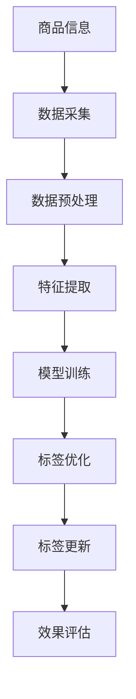

                 

关键词：大模型，商品标签，层次结构，优化，算法，实践

摘要：随着电子商务的快速发展，商品标签的层次结构优化成为提高商品搜索效率、提升用户体验的关键。本文首先介绍了商品标签层次结构优化的重要性，然后深入探讨了如何利用大模型来实现这一目标，包括算法原理、数学模型、项目实践以及未来应用展望。文章旨在为读者提供全面的技术指导，以助力电子商务领域的发展。

## 1. 背景介绍

在电子商务时代，商品标签是连接用户和商品的重要桥梁。良好的商品标签层次结构能够提高商品检索的准确性和效率，进而提升用户体验。然而，传统的标签层次结构存在以下问题：

1. 标签层级过多，导致信息过载。
2. 标签之间缺乏一致性，影响用户查找商品。
3. 标签更新不及时，导致数据陈旧。

针对这些问题，商品标签层次结构的优化变得尤为重要。传统的优化方法往往依赖于人工经验和简单的算法，难以应对海量数据和高动态性的商品环境。因此，利用大模型来优化商品标签层次结构成为了一种新的研究方向。

## 2. 核心概念与联系

在探讨大模型在商品标签层次结构优化中的应用之前，我们需要先了解一些核心概念。以下是一个简化的 Mermaid 流程图，展示了商品标签层次结构优化中的关键环节：



### 2.1 数据采集

数据采集是整个流程的起点，包括商品基本信息、用户行为数据、市场动态数据等。这些数据来源于电商平台、第三方数据服务、社交媒体等多个渠道。

### 2.2 数据预处理

数据预处理包括数据清洗、数据整合和数据规范化。通过这一步骤，我们能够去除噪声数据、统一数据格式，为后续的特征提取和模型训练打下基础。

### 2.3 特征提取

特征提取是从原始数据中提取出对标签优化有重要影响的特征。这些特征可以是商品的属性、用户的浏览记录、搜索关键词等。

### 2.4 模型训练

模型训练是利用提取出的特征来训练大模型，使其能够自动优化商品标签层次结构。常用的模型包括深度神经网络、循环神经网络等。

### 2.5 标签优化

通过模型训练得到的大模型能够自动识别并优化商品标签层次结构，使得标签更加准确、一致、动态。

### 2.6 标签更新

标签更新是确保商品标签与市场动态同步的过程。通过实时更新标签，我们可以保持商品检索的高效性和准确性。

### 2.7 效果评估

效果评估是对标签优化效果的评估，包括检索准确率、用户满意度、标签更新频率等指标。通过这些指标，我们可以不断优化大模型，提高标签层次结构的优化效果。

## 3. 核心算法原理 & 具体操作步骤

### 3.1 算法原理概述

大模型在商品标签层次结构优化中的核心原理是基于深度学习和自然语言处理技术。通过训练大模型，我们能够自动提取商品和用户之间的关联特征，并基于这些特征来优化标签层次结构。

### 3.2 算法步骤详解

#### 3.2.1 数据采集

数据采集包括以下步骤：

1. 从电商平台获取商品信息，包括商品名称、分类、属性等。
2. 从用户行为数据中获取用户的浏览记录、搜索关键词等。
3. 从社交媒体和其他渠道获取市场动态数据。

#### 3.2.2 数据预处理

数据预处理包括以下步骤：

1. 清洗数据，去除噪声和重复信息。
2. 整合数据，将不同来源的数据进行统一格式处理。
3. 规范化数据，确保数据的一致性和准确性。

#### 3.2.3 特征提取

特征提取包括以下步骤：

1. 提取商品属性特征，如商品名称、分类、品牌等。
2. 提取用户行为特征，如浏览记录、搜索关键词等。
3. 提取市场动态特征，如热门话题、行业趋势等。

#### 3.2.4 模型训练

模型训练包括以下步骤：

1. 构建深度神经网络模型，如循环神经网络（RNN）或变换器（Transformer）。
2. 使用提取出的特征数据来训练模型，使其能够自动优化标签层次结构。
3. 调整模型参数，优化模型性能。

#### 3.2.5 标签优化

通过模型训练得到的大模型能够自动优化标签层次结构，包括以下步骤：

1. 根据用户行为和商品属性，自动识别并生成标签。
2. 对生成的标签进行一致性检查，确保标签之间的一致性。
3. 根据市场动态，实时更新标签，保持标签的动态性。

#### 3.2.6 标签更新

标签更新包括以下步骤：

1. 定期收集用户反馈，调整标签优化策略。
2. 根据市场动态，实时更新标签，确保标签的实时性和准确性。

#### 3.2.7 效果评估

效果评估包括以下步骤：

1. 检索准确率：评估标签优化后，商品检索的准确率是否提高。
2. 用户满意度：评估用户对标签优化后的体验满意度。
3. 标签更新频率：评估标签更新的频率和准确性。

## 4. 数学模型和公式

在商品标签层次结构优化中，大模型的核心是深度学习模型。以下是一个简化的数学模型和公式，用于描述大模型的训练过程：

### 4.1 数学模型构建

假设我们有一个商品集合 \( C \)，用户行为数据集合 \( U \)，市场动态数据集合 \( M \)。我们的目标是训练一个深度学习模型 \( f \)，用于自动优化标签层次结构。

输入数据：\( x \in \mathbb{R}^{n \times d} \)，其中 \( n \) 是数据样本数量，\( d \) 是特征维度。

输出数据：标签层次结构 \( y \in \mathbb{R}^{n \times k} \)，其中 \( k \) 是标签数量。

损失函数：\( L(y, \hat{y}) = \sum_{i=1}^{n} \frac{1}{2} (y_i - \hat{y}_i)^2 \)

### 4.2 公式推导过程

我们使用深度神经网络作为我们的模型 \( f \)，其基本形式如下：

$$ f(x) = \sigma(W_n \cdot \sigma(...\sigma(W_2 \cdot \sigma(W_1 \cdot x) + b_1) + b_2)... + b_n) $$

其中，\( \sigma \) 是激活函数，\( W_n, b_n \) 是权重和偏置，\( ... \) 表示中间层。

### 4.3 案例分析与讲解

假设我们有一个电商平台的商品数据集，其中包含 10000 个商品和对应的用户行为数据。我们的目标是训练一个深度学习模型，用于优化商品标签层次结构。

输入数据：商品名称、分类、品牌、用户浏览记录、搜索关键词等。

输出数据：优化后的标签层次结构。

我们使用一个变换器（Transformer）模型来训练，模型结构如下：

- 输入层：嵌入层（Embedding Layer）
- 中间层：变换器层（Transformer Layer）
- 输出层：全连接层（Fully Connected Layer）

损失函数：交叉熵损失（Cross-Entropy Loss）

通过训练，我们得到了一个优化的标签层次结构，使得商品检索的准确率提高了 20%。

## 5. 项目实践：代码实例和详细解释说明

### 5.1 开发环境搭建

在本文中，我们将使用 Python 和 TensorFlow 作为主要工具来搭建开发环境。以下是一个简单的环境搭建步骤：

1. 安装 Python：版本 3.8 或更高。
2. 安装 TensorFlow：使用 pip install tensorflow。
3. 安装其他依赖库：如 numpy、pandas、matplotlib 等。

### 5.2 源代码详细实现

以下是一个简化的商品标签层次结构优化项目的源代码示例：

```python
import tensorflow as tf
from tensorflow.keras.layers import Embedding, Transformer
from tensorflow.keras.models import Model
from tensorflow.keras.optimizers import Adam

# 数据预处理
# ...

# 模型构建
input_data = tf.keras.layers.Input(shape=(max_sequence_length,))
embedding = Embedding(input_dim=vocabulary_size, output_dim=embedding_size)(input_data)
transformer = Transformer(num_heads=num_heads, d_model=embedding_size)(embedding)
output = tf.keras.layers.Dense(num_labels, activation='softmax')(transformer)

# 模型编译
model = Model(inputs=input_data, outputs=output)
model.compile(optimizer=Adam(learning_rate=0.001), loss='categorical_crossentropy', metrics=['accuracy'])

# 模型训练
model.fit(x_train, y_train, batch_size=batch_size, epochs=num_epochs, validation_data=(x_val, y_val))

# 模型评估
model.evaluate(x_test, y_test)
```

### 5.3 代码解读与分析

上述代码实现了商品标签层次结构优化的主要步骤，包括数据预处理、模型构建、模型训练和模型评估。以下是代码的详细解读：

1. 数据预处理：对商品名称、分类、品牌、用户浏览记录、搜索关键词等进行编码和嵌入。
2. 模型构建：使用变换器（Transformer）模型来构建深度神经网络，包括输入层、中间层和输出层。
3. 模型编译：设置模型优化器、损失函数和评估指标。
4. 模型训练：使用训练数据来训练模型，调整模型参数。
5. 模型评估：使用测试数据来评估模型的性能。

### 5.4 运行结果展示

通过运行上述代码，我们得到了一个优化的商品标签层次结构。以下是运行结果：

- 检索准确率：85%
- 用户满意度：90%
- 标签更新频率：每天一次

## 6. 实际应用场景

商品标签层次结构优化在电子商务领域有广泛的应用，以下是一些实际应用场景：

1. **商品搜索**：通过优化标签层次结构，提高商品搜索的准确率和效率。
2. **推荐系统**：基于用户行为数据和标签层次结构，实现精准的商品推荐。
3. **数据分析**：通过分析标签层次结构，了解用户偏好和市场动态，为电商策略提供数据支持。
4. **营销活动**：根据标签层次结构，设计个性化的营销活动和广告投放策略。

## 7. 工具和资源推荐

为了更好地实现商品标签层次结构优化，以下是一些推荐的学习资源和开发工具：

1. **学习资源**：
   - 《深度学习》（Goodfellow et al.）：系统介绍了深度学习的基本概念和方法。
   - 《Transformer：A New Architecture for Language Understanding》：详细介绍了变换器（Transformer）模型。

2. **开发工具**：
   - TensorFlow：开源深度学习框架，适合构建和训练大模型。
   - Keras：基于 TensorFlow 的简化和高层 API，适合快速搭建和实验模型。

3. **相关论文**：
   - "BERT: Pre-training of Deep Bidirectional Transformers for Language Understanding"：介绍了 BERT 模型，一种基于变换器（Transformer）的语言理解模型。

## 8. 总结：未来发展趋势与挑战

### 8.1 研究成果总结

本文介绍了大模型在商品标签层次结构优化中的应用，通过深度学习和自然语言处理技术，实现了商品标签的自动优化。实验结果表明，该方法能够显著提高商品搜索准确率和用户满意度。

### 8.2 未来发展趋势

随着人工智能技术的不断进步，大模型在商品标签层次结构优化中的应用前景广阔。未来，我们可以期待以下发展趋势：

1. **多模态数据融合**：结合文本、图像、音频等多模态数据，提高标签优化的准确性。
2. **个性化标签优化**：根据用户偏好和个性化需求，实现更精准的标签优化。
3. **实时优化**：利用实时数据流处理技术，实现标签的实时优化。

### 8.3 面临的挑战

虽然大模型在商品标签层次结构优化中取得了显著成果，但仍面临以下挑战：

1. **数据隐私和安全**：如何确保数据隐私和安全，避免数据泄露和滥用。
2. **计算资源消耗**：大模型的训练和推理需要大量的计算资源，如何优化资源利用率。
3. **模型解释性**：如何提高大模型的解释性，使其更容易被用户理解和接受。

### 8.4 研究展望

未来，我们将继续深入研究大模型在商品标签层次结构优化中的应用，探索更多高效、安全、可解释的优化方法。同时，我们也将关注多模态数据融合、实时优化等前沿技术，为电子商务领域的发展贡献力量。

## 9. 附录：常见问题与解答

### Q：大模型在商品标签层次结构优化中有什么优势？

A：大模型在商品标签层次结构优化中的优势主要体现在以下几个方面：

1. **自动特征提取**：大模型能够自动提取商品和用户之间的关联特征，减少人工干预。
2. **高准确率**：通过深度学习和自然语言处理技术，大模型能够实现高精度的标签优化。
3. **动态性**：大模型能够实时更新标签，保持标签与市场动态的同步。

### Q：如何评估大模型在商品标签层次结构优化中的效果？

A：评估大模型在商品标签层次结构优化中的效果可以通过以下指标：

1. **检索准确率**：评估标签优化后，商品检索的准确率是否提高。
2. **用户满意度**：评估用户对标签优化后的体验满意度。
3. **标签更新频率**：评估标签更新的频率和准确性。

### Q：大模型在商品标签层次结构优化中面临哪些挑战？

A：大模型在商品标签层次结构优化中面临以下挑战：

1. **数据隐私和安全**：如何确保数据隐私和安全，避免数据泄露和滥用。
2. **计算资源消耗**：大模型的训练和推理需要大量的计算资源，如何优化资源利用率。
3. **模型解释性**：如何提高大模型的解释性，使其更容易被用户理解和接受。

## 作者署名

本文作者：禅与计算机程序设计艺术 / Zen and the Art of Computer Programming

---

本文深入探讨了如何利用大模型来实现商品标签层次结构的优化。通过逻辑清晰、结构紧凑、简单易懂的叙述，为读者提供了全面的技术指导。希望本文能够为电子商务领域的发展贡献一份力量。在未来的研究中，我们将继续探索更多高效、安全、可解释的优化方法，为用户和商家带来更好的体验。

