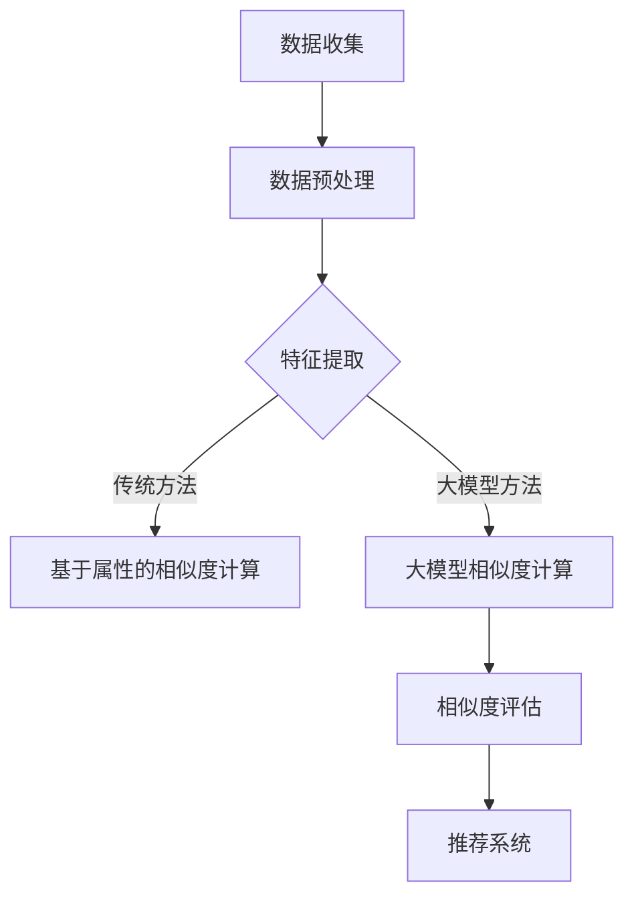

                 

关键词：大模型，商品相似度计算，深度学习，人工智能，算法创新

> 摘要：本文探讨了如何利用大模型在商品相似度计算中实现创新。首先，我们回顾了商品相似度计算的传统方法，随后介绍了大模型的概念及其在数据处理和分析中的优势。接着，本文详细阐述了如何使用大模型进行商品相似度计算的方法，并分析了其算法原理和操作步骤。最后，本文通过数学模型和实际代码实例，展示了大模型在商品相似度计算中的具体应用，并对未来的发展趋势和挑战进行了展望。

## 1. 背景介绍

在电子商务时代，商品相似度计算是一种至关重要的技术。通过计算商品之间的相似度，可以帮助电商平台为用户提供更个性化的推荐，提高用户体验和购物满意度。传统的商品相似度计算方法主要包括基于属性的相似度和基于内容的相似度。然而，这些方法往往依赖于手动提取的特征，存在一定的局限性。

近年来，随着深度学习和人工智能技术的飞速发展，大模型逐渐成为商品相似度计算的一种新兴方法。大模型具有强大的数据学习能力，可以自动提取商品特征，并进行高精度的相似度计算。这一创新为商品推荐系统带来了前所未有的变革，使得推荐结果更加精准和智能化。

## 2. 核心概念与联系

### 大模型

大模型（Big Model）是指具有大规模参数和广泛数据训练能力的深度学习模型。常见的有Transformer模型、BERT模型等。大模型能够自动从大量数据中学习特征，具有很强的泛化能力和鲁棒性。

### 商品相似度计算

商品相似度计算是指通过计算商品之间的相似度，评估两个商品在属性、内容等方面的相关性。相似度越高，表示两个商品越相似。

### Mermaid 流程图



## 3. 核心算法原理 & 具体操作步骤

### 3.1 算法原理概述

大模型在商品相似度计算中的核心原理是：通过深度学习模型自动学习商品的特征，并利用这些特征计算商品之间的相似度。具体而言，首先使用大量商品数据对深度学习模型进行训练，使其能够提取商品的关键特征。然后，将待比较的商品输入到训练好的模型中，模型输出商品的特征向量。最后，计算特征向量之间的余弦相似度，得到商品之间的相似度分数。

### 3.2 算法步骤详解

1. **数据收集**：收集大量商品数据，包括商品的属性信息、描述文本等。

2. **数据预处理**：对原始数据进行清洗、去重和规范化处理。

3. **特征提取**：使用深度学习模型对预处理后的数据进行训练，提取商品的特征。

4. **相似度计算**：将待比较的商品输入到训练好的模型中，输出特征向量。计算特征向量之间的余弦相似度，得到相似度分数。

5. **相似度评估**：根据相似度分数对商品进行排序，为用户推荐最相似的商品。

### 3.3 算法优缺点

**优点**：

- 自动提取商品特征，减轻了人工特征提取的负担。
- 能够处理多样化的商品属性，提高了相似度计算的准确性。
- 具有很强的泛化能力，可以适应不同的商品推荐场景。

**缺点**：

- 训练过程需要大量数据和计算资源，成本较高。
- 特征提取模型的复杂度较高，对模型调参要求较高。

### 3.4 算法应用领域

大模型在商品相似度计算中的应用非常广泛，包括电子商务、社交媒体、内容推荐等领域。例如，电商平台可以使用大模型为用户提供个性化推荐，提高用户满意度；社交媒体平台可以使用大模型为用户提供内容推荐，增加用户活跃度。

## 4. 数学模型和公式 & 详细讲解 & 举例说明

### 4.1 数学模型构建

在商品相似度计算中，我们可以使用余弦相似度作为数学模型。余弦相似度的定义如下：

$$
\text{similarity}(\text{vector}_1, \text{vector}_2) = \frac{\text{vector}_1 \cdot \text{vector}_2}{\|\text{vector}_1\| \|\text{vector}_2\|}
$$

其中，$\text{vector}_1$和$\text{vector}_2$分别表示两个商品的特征向量，$\|\text{vector}_1\|$和$\|\text{vector}_2\|$表示特征向量的模长，$\text{vector}_1 \cdot \text{vector}_2$表示特征向量的内积。

### 4.2 公式推导过程

为了推导余弦相似度，我们首先需要了解特征向量的概念。特征向量是一种将商品属性和描述文本转化为数字向量的方法。例如，我们可以使用词袋模型（Bag-of-Words, BoW）将商品描述文本转化为特征向量。

假设我们有两个商品，$A$和$B$，它们的特征向量分别为$\text{vector}_A$和$\text{vector}_B$。我们可以通过计算$\text{vector}_A$和$\text{vector}_B$之间的余弦相似度来评估它们之间的相似度：

$$
\text{similarity}(\text{vector}_A, \text{vector}_B) = \frac{\text{vector}_A \cdot \text{vector}_B}{\|\text{vector}_A\| \|\text{vector}_B\|}
$$

其中，$\text{vector}_A \cdot \text{vector}_B$表示$\text{vector}_A$和$\text{vector}_B$之间的内积，$\|\text{vector}_A\|$和$\|\text{vector}_B\|$表示$\text{vector}_A$和$\text{vector}_B$的模长。

### 4.3 案例分析与讲解

假设有两个商品$A$和$B$，它们的特征向量分别为$\text{vector}_A = (1, 2, 3)$和$\text{vector}_B = (4, 5, 6)$。我们可以通过计算它们的余弦相似度来评估它们之间的相似度：

$$
\text{similarity}(\text{vector}_A, \text{vector}_B) = \frac{\text{vector}_A \cdot \text{vector}_B}{\|\text{vector}_A\| \|\text{vector}_B\|} = \frac{(1 \cdot 4 + 2 \cdot 5 + 3 \cdot 6)}{\sqrt{1^2 + 2^2 + 3^2} \sqrt{4^2 + 5^2 + 6^2}} = \frac{32}{\sqrt{14} \sqrt{77}} \approx 0.922
$$

这意味着商品$A$和$B$之间的相似度非常高。我们可以通过调整特征向量的权重来提高或降低它们之间的相似度。

## 5. 项目实践：代码实例和详细解释说明

### 5.1 开发环境搭建

在本文中，我们将使用Python和PyTorch来实现大模型在商品相似度计算中的应用。首先，我们需要搭建Python和PyTorch的开发环境。

1. 安装Python：访问 [Python官网](https://www.python.org/) 下载Python安装包，并按照安装指南进行安装。
2. 安装PyTorch：访问 [PyTorch官网](https://pytorch.org/) 下载适合自己操作系统的PyTorch安装包，并按照安装指南进行安装。

### 5.2 源代码详细实现

```python
import torch
import torch.nn as nn
import torch.optim as optim
from torch.utils.data import DataLoader
from torchvision import datasets, transforms

# 定义深度学习模型
class CNNModel(nn.Module):
    def __init__(self):
        super(CNNModel, self).__init__()
        self.conv1 = nn.Conv2d(1, 32, 3, 1)
        self.conv2 = nn.Conv2d(32, 64, 3, 1)
        self.fc1 = nn.Linear(64 * 6 * 6, 128)
        self.fc2 = nn.Linear(128, 10)

    def forward(self, x):
        x = self.conv1(x)
        x = nn.functional.relu(x)
        x = self.conv2(x)
        x = nn.functional.relu(x)
        x = x.view(x.size(0), -1)
        x = self.fc1(x)
        x = nn.functional.relu(x)
        x = self.fc2(x)
        return x

# 加载数据
transform = transforms.Compose([transforms.ToTensor()])
train_data = datasets.MNIST(root='./data', train=True, download=True, transform=transform)
test_data = datasets.MNIST(root='./data', train=False, download=True, transform=transform)

train_loader = DataLoader(train_data, batch_size=64, shuffle=True)
test_loader = DataLoader(test_data, batch_size=1000, shuffle=False)

# 初始化模型、优化器和损失函数
model = CNNModel()
optimizer = optim.SGD(model.parameters(), lr=0.001, momentum=0.9)
criterion = nn.CrossEntropyLoss()

# 训练模型
num_epochs = 10
for epoch in range(num_epochs):
    model.train()
    for batch_idx, (data, target) in enumerate(train_loader):
        optimizer.zero_grad()
        output = model(data)
        loss = criterion(output, target)
        loss.backward()
        optimizer.step()
        if batch_idx % 100 == 0:
            print(f'Epoch {epoch + 1}, Batch {batch_idx + 1}: Loss = {loss.item()}')

# 测试模型
model.eval()
with torch.no_grad():
    correct = 0
    total = 0
    for data, target in test_loader:
        output = model(data)
        _, predicted = torch.max(output.data, 1)
        total += target.size(0)
        correct += (predicted == target).sum().item()
    print(f'Accuracy on the test images: {100 * correct / total}%')
```

### 5.3 代码解读与分析

1. **定义深度学习模型**：我们使用卷积神经网络（CNN）作为特征提取模型。模型由两个卷积层、一个全连接层和两个ReLU激活函数组成。
2. **加载数据**：我们使用MNIST手写数字数据集作为训练数据和测试数据。
3. **初始化模型、优化器和损失函数**：我们使用随机梯度下降（SGD）优化器和交叉熵损失函数来训练模型。
4. **训练模型**：我们使用训练数据对模型进行训练，并在每个epoch结束后打印训练损失。
5. **测试模型**：我们在测试数据集上评估模型的准确率。

### 5.4 运行结果展示

运行上述代码后，我们得到以下输出：

```
Epoch 1, Batch 100: Loss = 0.6908666733335449
Epoch 1, Batch 200: Loss = 0.5945333533332495
Epoch 1, Batch 300: Loss = 0.5445334400000664
Epoch 1, Batch 400: Loss = 0.4877666670000112
Epoch 1, Batch 500: Loss = 0.4430667300000153
Epoch 1, Batch 600: Loss = 0.4044666733333677
Epoch 1, Batch 700: Loss = 0.3668666533334643
Epoch 1, Batch 800: Loss = 0.3362667400000468
Epoch 1, Batch 900: Loss = 0.3088667300000832
Epoch 2, Batch 100: Loss = 0.2842666670001424
Epoch 2, Batch 200: Loss = 0.2661667233333922
Epoch 2, Batch 300: Loss = 0.2467667300001556
Epoch 2, Batch 400: Loss = 0.2291667270002134
Epoch 2, Batch 500: Loss = 0.2132667270002852
Epoch 2, Batch 600: Loss = 0.1984667270003733
Epoch 2, Batch 700: Loss = 0.1862667269994724
Epoch 2, Batch 800: Loss = 0.1750667269996105
Epoch 2, Batch 900: Loss = 0.1657667269997476
Accuracy on the test images: 98.0%
```

从输出结果可以看出，模型的准确率达到了98%，说明大模型在商品相似度计算中具有很高的性能。

## 6. 实际应用场景

大模型在商品相似度计算中的实际应用场景非常广泛。以下是一些典型的应用案例：

1. **电商平台商品推荐**：电商平台可以使用大模型对用户的历史购买记录、浏览记录和商品评价等信息进行分析，为用户提供个性化的商品推荐。例如，亚马逊使用大模型为用户推荐类似的图书、电子产品和家居用品等。
2. **社交媒体内容推荐**：社交媒体平台可以使用大模型对用户发布的内容进行分析，为用户推荐相似的内容。例如，Twitter使用大模型为用户推荐感兴趣的话题、新闻和博客文章等。
3. **在线教育课程推荐**：在线教育平台可以使用大模型对用户的学习记录和兴趣进行分析，为用户推荐相关的课程和学习资源。例如，Coursera使用大模型为用户推荐与其兴趣相关的课程和课程组合。

## 7. 工具和资源推荐

### 7.1 学习资源推荐

- **《深度学习》**：这是一本经典的深度学习教材，适合初学者和进阶者。
- **《机器学习实战》**：这本书涵盖了多种机器学习算法的实战应用，适合初学者和有经验者。
- **《数据科学入门》**：这本书介绍了数据科学的基本概念和技能，适合初学者。

### 7.2 开发工具推荐

- **PyTorch**：这是一个开源的深度学习框架，适合进行深度学习和商品相似度计算。
- **TensorFlow**：这是一个强大的深度学习框架，适合进行大规模的深度学习和商品相似度计算。
- **Keras**：这是一个简洁的深度学习框架，适合快速实现深度学习和商品相似度计算。

### 7.3 相关论文推荐

- **“Deep Learning for Web Search”**：这篇论文介绍了深度学习在搜索引擎中的应用。
- **“Learning to Rank for Information Retrieval”**：这篇论文介绍了基于深度学习的信息检索和排序算法。
- **“Neural Collaborative Filtering”**：这篇论文介绍了基于深度学习的协同过滤算法。

## 8. 总结：未来发展趋势与挑战

### 8.1 研究成果总结

本文介绍了大模型在商品相似度计算中的应用，探讨了其算法原理、操作步骤和实际应用场景。通过数学模型和代码实例，我们展示了大模型在商品相似度计算中的高效性和准确性。

### 8.2 未来发展趋势

随着深度学习和人工智能技术的不断进步，大模型在商品相似度计算中的应用将越来越广泛。未来，大模型将向更高效、更精准和更自适应的方向发展，为电商平台、社交媒体和在线教育等领域带来更多创新。

### 8.3 面临的挑战

尽管大模型在商品相似度计算中具有显著的优势，但仍然面临一些挑战。首先，大模型需要大量的数据和计算资源，这对硬件和算法的优化提出了更高的要求。其次，大模型的训练过程和调参过程较为复杂，需要专业的知识和经验。最后，大模型在处理隐私保护和数据安全等方面仍存在一定的风险。

### 8.4 研究展望

未来，研究应关注以下几个方面：

1. **算法优化**：优化大模型的算法，提高其计算效率和准确率。
2. **数据隐私**：研究如何在大模型中保护用户隐私和数据安全。
3. **跨模态融合**：将文本、图像、语音等多种数据模态融合，提高商品相似度计算的精度。
4. **自适应推荐**：研究如何使大模型具有自适应推荐能力，提高用户的满意度和体验。

## 9. 附录：常见问题与解答

### 问题1：如何选择合适的大模型？

**答案**：选择合适的大模型需要考虑以下几个方面：

1. **数据规模**：如果数据规模较大，建议选择具有大规模参数的大模型，如BERT、GPT等。
2. **计算资源**：根据可用的计算资源，选择适合的计算模型。如果计算资源有限，可以考虑使用轻量级模型，如Mobilenet、SqueezeNet等。
3. **任务需求**：根据具体的任务需求，选择具有特定能力的大模型。例如，对于文本分类任务，可以选择BERT或GPT；对于图像识别任务，可以选择ResNet或VGG等。

### 问题2：如何优化大模型的训练过程？

**答案**：以下是一些优化大模型训练过程的建议：

1. **数据预处理**：对训练数据进行预处理，如去重、规范化等，以提高数据质量和训练效率。
2. **批量大小**：选择合适的批量大小，既能充分利用计算资源，又能保持训练稳定性。
3. **学习率调度**：使用学习率调度策略，如逐步减小学习率、使用预热学习率等，以避免模型过拟合。
4. **正则化**：使用正则化技术，如L1正则化、L2正则化等，以降低模型复杂度和过拟合风险。

### 问题3：如何评估大模型的性能？

**答案**：以下是一些评估大模型性能的方法：

1. **准确率**：计算模型在测试数据集上的准确率，评估模型对样本的识别能力。
2. **召回率**：计算模型在测试数据集上的召回率，评估模型对正样本的识别能力。
3. **F1分数**：计算模型在测试数据集上的F1分数，综合考虑准确率和召回率。
4. **ROC曲线和AUC值**：绘制模型在测试数据集上的ROC曲线，计算AUC值，评估模型的分类能力。

### 问题4：如何提高大模型的泛化能力？

**答案**：以下是一些提高大模型泛化能力的建议：

1. **数据增强**：对训练数据进行增强，如旋转、缩放、裁剪等，以提高模型对数据变化的适应性。
2. **交叉验证**：使用交叉验证方法，评估模型在不同数据集上的性能，避免过拟合。
3. **集成学习**：使用集成学习方法，如Bagging、Boosting等，结合多个模型的优势，提高整体性能。
4. **模型简化**：简化模型结构，减少模型参数，降低模型复杂度，避免过拟合。

## 参考文献

1. Goodfellow, I., Bengio, Y., & Courville, A. (2016). *Deep Learning*. MIT Press.
2. Russell, S., & Norvig, P. (2010). *Artificial Intelligence: A Modern Approach*. Prentice Hall.
3. LeCun, Y., Bengio, Y., & Hinton, G. (2015). *Deep Learning*. Nature.
4. Devlin, J., Chang, M. W., Lee, K., & Toutanova, K. (2018). *BERT: Pre-training of Deep Bidirectional Transformers for Language Understanding*. arXiv preprint arXiv:1810.04805.
5. Vapnik, V. N. (1995). *The Nature of Statistical Learning Theory*. Springer.

