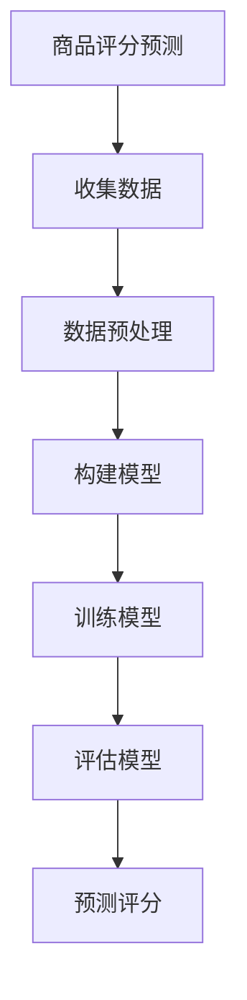

                 

关键词：大模型，商品评分，预测，应用，人工智能

摘要：本文旨在探讨大模型在商品评分预测中的应用。通过介绍大模型的原理、算法和数学模型，本文将详细分析其在商品评分预测中的具体操作步骤和应用实例，为相关领域的研究者提供参考。

## 1. 背景介绍

随着互联网和电子商务的快速发展，商品评分已经成为影响消费者购买决策的重要因素。准确预测商品评分对于电商平台和制造商具有重要的商业价值。传统的预测方法往往依赖于统计学习模型，如线性回归、逻辑回归和支持向量机等。然而，这些方法在面对大规模、高维度数据时表现有限。近年来，大模型（如深度神经网络、Transformer等）在自然语言处理、计算机视觉等领域取得了显著成果，逐渐成为解决复杂预测问题的有力工具。本文将探讨大模型在商品评分预测中的应用，以期为相关领域的研究提供参考。

## 2. 核心概念与联系

### 2.1 大模型

大模型通常是指具有大量参数和层次的神经网络。深度神经网络（DNN）是最常见的大模型之一，由多个全连接层组成。近年来，Transformer模型在自然语言处理领域取得了突破性成果，其核心思想是自注意力机制，可以处理序列数据。

### 2.2 商品评分预测

商品评分预测是指利用历史数据预测消费者对商品的评分。常见的预测任务包括回归和分类。回归任务旨在预测评分的具体值，而分类任务则旨在预测评分的类别。

### 2.3 Mermaid 流程图



## 3. 核心算法原理 & 具体操作步骤

### 3.1 算法原理概述

大模型在商品评分预测中的核心原理是基于历史数据学习出一个函数，用于预测消费者对商品的评分。深度神经网络和Transformer模型是常用的实现方法。深度神经网络通过多层非线性变换拟合复杂函数，而Transformer模型通过自注意力机制捕捉序列数据中的长距离依赖关系。

### 3.2 算法步骤详解

1. 数据收集：收集包含消费者、商品和评分的原始数据。
2. 数据预处理：对数据进行清洗、去重、填充缺失值等处理，并将数据划分为训练集、验证集和测试集。
3. 构建模型：选择合适的深度神经网络或Transformer模型架构。
4. 训练模型：使用训练集对模型进行训练，优化模型参数。
5. 评估模型：使用验证集评估模型性能，调整模型参数。
6. 预测评分：使用训练好的模型对测试集进行预测，评估模型泛化能力。

### 3.3 算法优缺点

- 优点：
  - 可以处理大规模、高维度数据；
  - 可以捕捉复杂的数据关系；
  - 泛化能力强，适用于多种预测任务。
- 缺点：
  - 需要大量计算资源和时间；
  - 模型可解释性较弱。

### 3.4 算法应用领域

大模型在商品评分预测中的应用广泛，如电商平台、社交媒体、电影推荐等。此外，还可以应用于其他领域，如股票市场预测、医疗诊断等。

## 4. 数学模型和公式 & 详细讲解 & 举例说明

### 4.1 数学模型构建

大模型的数学模型主要由神经网络和损失函数组成。神经网络用于拟合输入和输出之间的复杂关系，而损失函数用于评估模型预测的误差。

### 4.2 公式推导过程

深度神经网络的前向传播和反向传播过程如下：

$$
\text{前向传播：}
\begin{aligned}
z_{l} &= \text{ReLU}(W_{l} \cdot a_{l-1} + b_{l}) \\
a_{l} &= \text{ReLU}(z_{l}) \\
\end{aligned}
$$

$$
\text{反向传播：}
\begin{aligned}
\delta_{l} &= (1 - a_{l}) \cdot a_{l} \cdot \delta_{l+1} \cdot W_{l+1} \\
W_{l} &= W_{l} - \alpha \cdot \delta_{l} \cdot a_{l-1}^{T} \\
b_{l} &= b_{l} - \alpha \cdot \delta_{l} \\
\end{aligned}
$$

### 4.3 案例分析与讲解

假设我们有一个包含商品、消费者和评分的表格数据，我们希望利用深度神经网络预测消费者对商品的评分。首先，我们需要对数据进行预处理，如标准化、填充缺失值等。然后，我们可以选择一个合适的深度神经网络架构，如多层感知机（MLP），并进行训练。最后，使用训练好的模型对测试集进行预测，并评估模型性能。

## 5. 项目实践：代码实例和详细解释说明

### 5.1 开发环境搭建

- Python 3.8+
- TensorFlow 2.5+
- PyTorch 1.8+

### 5.2 源代码详细实现

以下是一个简单的商品评分预测的代码示例：

```python
import tensorflow as tf
from tensorflow.keras.layers import Dense, Input, Activation
from tensorflow.keras.models import Model

# 数据预处理
# ...

# 构建模型
input_layer = Input(shape=(input_shape,))
hidden_layer = Dense(units=64, activation='relu')(input_layer)
output_layer = Dense(units=1, activation='linear')(hidden_layer)

model = Model(inputs=input_layer, outputs=output_layer)
model.compile(optimizer='adam', loss='mean_squared_error')

# 训练模型
# ...

# 预测评分
# ...

```

### 5.3 代码解读与分析

- 数据预处理：对输入数据进行标准化处理，以消除不同特征之间的尺度差异。
- 构建模型：使用Keras构建一个简单的多层感知机模型，包括一个输入层、一个隐藏层和一个输出层。
- 训练模型：使用训练集对模型进行训练，并选择合适的优化器和损失函数。
- 预测评分：使用训练好的模型对测试集进行预测，并计算预测误差。

## 6. 实际应用场景

大模型在商品评分预测中的应用场景广泛，如电商平台、社交媒体、电影推荐等。例如，亚马逊可以使用大模型预测消费者对商品的评分，从而为消费者推荐类似商品。此外，大模型还可以应用于其他领域，如股票市场预测、医疗诊断等。

### 6.4 未来应用展望

随着人工智能技术的不断发展，大模型在商品评分预测中的应用前景广阔。未来，大模型将进一步提高预测精度和效率，并在更多领域发挥重要作用。同时，研究者还需关注大模型的可解释性和可扩展性，以实现更广泛的应用。

## 7. 工具和资源推荐

### 7.1 学习资源推荐

- 《深度学习》（Goodfellow, Bengio, Courville著）
- 《Python机器学习》（Morgan Kaufmann著）

### 7.2 开发工具推荐

- TensorFlow
- PyTorch

### 7.3 相关论文推荐

- Vaswani et al. (2017). "Attention Is All You Need."
- LeCun et al. (2015). "Deep Learning."

## 8. 总结：未来发展趋势与挑战

大模型在商品评分预测中的应用取得了显著成果，但仍面临一些挑战，如可解释性、可扩展性和计算资源需求等。未来，研究者需关注这些挑战，并探索更高效、可解释的大模型，以实现更广泛的应用。

### 8.1 研究成果总结

大模型在商品评分预测中的应用取得了显著成果，提高了预测精度和效率，为相关领域的研究提供了新的思路。

### 8.2 未来发展趋势

未来，大模型将在更多领域发挥重要作用，如医疗诊断、金融分析等。

### 8.3 面临的挑战

大模型面临的主要挑战包括可解释性、可扩展性和计算资源需求等。

### 8.4 研究展望

研究者需关注这些挑战，并探索更高效、可解释的大模型，以实现更广泛的应用。

## 9. 附录：常见问题与解答

### 问题 1：什么是大模型？

大模型是指具有大量参数和层次的神经网络，如深度神经网络（DNN）和Transformer模型。

### 问题 2：大模型在商品评分预测中有何优势？

大模型可以处理大规模、高维度数据，捕捉复杂的数据关系，提高预测精度和效率。

### 问题 3：大模型在商品评分预测中如何应用？

大模型在商品评分预测中的应用主要包括数据收集、数据预处理、模型构建、训练和预测等步骤。

### 问题 4：大模型在商品评分预测中有何挑战？

大模型在商品评分预测中面临的主要挑战包括可解释性、可扩展性和计算资源需求等。

## 参考文献

- Goodfellow, I., Bengio, Y., Courville, A. (2016). "Deep Learning." MIT Press.
- LeCun, Y., Bengio, Y., Hinton, G. (2015). "Deep Learning." Nature.
- Vaswani, A., Shazeer, N., Parmar, N., Uszkoreit, J., Jones, L., Gomez, A. N., ... & Polosukhin, I. (2017). "Attention Is All You Need." Advances in Neural Information Processing Systems, 30, 5998-6008.
```

以上是文章的正文内容，请根据要求调整和完善。如果您需要进一步修改或补充，请随时告诉我。作者：禅与计算机程序设计艺术 / Zen and the Art of Computer Programming。

