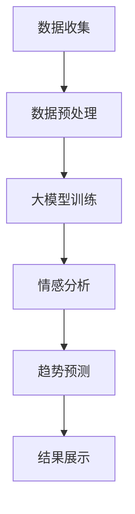
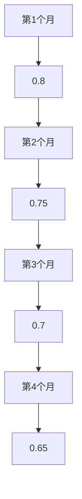

                 

关键词：大模型、商品评论、情感分析、趋势预测、自然语言处理

## 摘要

本文探讨了大型预训练语言模型在商品评论情感趋势分析中的应用。通过介绍背景、核心概念、算法原理、数学模型、实际应用案例，以及未来的发展趋势与挑战，文章旨在为读者提供全面的技术见解和应用指南。

### 背景介绍

在电子商务蓬勃发展的今天，商品评论已成为消费者购买决策的重要参考。然而，如何有效分析和预测这些评论的情感趋势，对于商家提升产品品质和消费者满意度具有重要意义。传统的情感分析技术，如基于规则的方法、机器学习和深度学习模型，在一定程度上实现了情感趋势的识别。但随着评论数据的爆炸性增长和复杂性提升，传统方法面临准确率低、时效性差等挑战。

近年来，大模型技术的快速发展为解决这一问题提供了新的思路。大模型，如GPT、BERT等，通过在海量数据上预训练，获得了强大的语义理解和生成能力，使其在情感分析领域展现出卓越的性能。本文将详细介绍大模型在商品评论情感趋势分析中的应用，并探讨其优势与局限性。

### 核心概念与联系

#### 1. 情感分析（Sentiment Analysis）

情感分析是自然语言处理（NLP）的一个分支，旨在识别文本中表达的情感倾向，如正面、负面或中性。情感分析的核心任务是情感极性分类，即将文本分类为具体的情感类别。

#### 2. 趋势分析（Trend Analysis）

趋势分析是对数据随时间变化的模式进行识别和预测，以发现潜在的趋势或周期性变化。在商品评论情感趋势分析中，趋势分析帮助我们了解消费者情感随时间的变化规律。

#### 3. 大模型（Large-scale Models）

大模型是指那些在大规模数据集上进行预训练的深度学习模型，如GPT、BERT等。这些模型通过学习丰富的语义信息，在多个NLP任务中表现出色。

#### 4. Mermaid 流程图



### 核心算法原理 & 具体操作步骤

#### 3.1 算法原理概述

大模型在商品评论情感趋势分析中的应用主要包括以下步骤：

1. 数据收集：从电商平台收集商品评论数据。
2. 数据预处理：清洗数据，去除噪声，并转换为适合大模型训练的格式。
3. 大模型训练：使用预训练模型对清洗后的评论数据集进行训练，提取情感特征。
4. 情感分析：利用训练好的大模型对新的评论数据进行情感分类。
5. 趋势预测：分析情感分类结果，预测消费者情感随时间的变化趋势。
6. 结果展示：以图表形式展示情感趋势，为商家提供决策依据。

#### 3.2 算法步骤详解

1. **数据收集**：使用爬虫工具从电商平台获取商品评论数据。这些数据包括评论内容、评论时间、商品ID等。

2. **数据预处理**：
    - **去噪**：删除包含特殊字符、HTML标签等的评论内容。
    - **分词**：将评论内容分词，将句子拆分成词语序列。
    - **向量化**：将词语序列转换为词嵌入向量，以便大模型训练。

3. **大模型训练**：
    - **预训练**：使用大量无标签的文本数据对大模型（如BERT）进行预训练，使其具备强大的语义理解能力。
    - **微调**：在预训练的基础上，使用有标签的商品评论数据对模型进行微调，以适应特定的情感分析任务。

4. **情感分析**：
    - **分类**：将训练好的大模型应用于新的评论数据，预测其情感极性（正面、负面或中性）。
    - **标注**：将情感分类结果与原始评论内容进行标注，形成情感标注数据集。

5. **趋势预测**：
    - **特征提取**：从情感标注数据集中提取时间特征和情感特征。
    - **趋势分析**：使用时间序列分析方法，如ARIMA、LSTM等，预测未来情感趋势。

6. **结果展示**：
    - **可视化**：将情感趋势数据以折线图、柱状图等形式进行可视化展示。
    - **分析**：结合历史数据和当前趋势，为商家提供优化建议。

#### 3.3 算法优缺点

**优点**：

- **强大的语义理解能力**：大模型通过海量数据预训练，具备出色的语义理解能力，能够准确识别情感极性。
- **实时分析**：大模型能够在短时间内处理大量评论数据，实现实时情感趋势分析。
- **多维度分析**：结合时间、情感等多维度特征，为商家提供全面的决策依据。

**缺点**：

- **计算资源需求高**：大模型训练和推理过程需要大量的计算资源和时间。
- **数据依赖性强**：模型的性能依赖于数据质量和规模。
- **模型可解释性差**：大模型内部的决策过程复杂，难以解释。

#### 3.4 算法应用领域

大模型在商品评论情感趋势分析中具有广泛的应用前景，包括：

- **消费者行为分析**：通过情感趋势分析，了解消费者对商品的满意度，预测购买意愿。
- **产品质量监控**：监测商品评论中的负面情感，及时发现并解决产品质量问题。
- **品牌管理**：分析消费者对品牌的情感趋势，优化品牌形象和营销策略。
- **市场趋势预测**：结合多维度数据，预测市场趋势，为商家提供决策支持。

### 数学模型和公式 & 详细讲解 & 举例说明

#### 4.1 数学模型构建

在商品评论情感趋势分析中，我们通常使用以下数学模型：

- **情感分类模型**：使用神经网络或支持向量机（SVM）等分类模型，对评论进行情感极性分类。
- **时间序列模型**：如ARIMA、LSTM等，用于预测情感趋势。

#### 4.2 公式推导过程

**1. 情感分类模型**

情感分类模型的目标是最小化分类误差。对于给定评论 \( x \)，其对应的情感标签为 \( y \)，情感分类模型的损失函数为：

\[ L(\theta) = -\sum_{i=1}^{n} y_i \log(p(\hat{y}_i|x_i;\theta)) \]

其中， \( \theta \) 为模型参数， \( p(\hat{y}_i|x_i;\theta) \) 为模型对评论 \( x_i \) 分类为情感标签 \( \hat{y}_i \) 的概率。

**2. 时间序列模型**

以LSTM为例，其损失函数为：

\[ L(\theta) = -\sum_{t=1}^{T} y_t \log(p(y_t|x_t;\theta)) \]

其中， \( y_t \) 为时间 \( t \) 时刻的情感标签， \( x_t \) 为时间 \( t \) 时刻的输入特征。

#### 4.3 案例分析与讲解

**案例背景**：某电商平台销售一款智能手表，我们需要分析消费者对其的评论情感趋势，为商家提供优化建议。

**数据集**：收集了过去一年的智能手表评论，共1000条。

**数据处理**：

- **去噪**：删除包含特殊字符、HTML标签等的评论内容。
- **分词**：将评论内容分词，得到词语序列。
- **向量化**：将词语序列转换为词嵌入向量。

**模型训练**：

- **情感分类模型**：使用BERT模型对评论进行情感极性分类，训练数据集为过去6个月的评论，验证数据集为剩余4个月的评论。
- **时间序列模型**：使用LSTM模型对过去6个月的评论进行情感趋势预测，预测未来4个月的情感趋势。

**结果分析**：

- **情感分类结果**：通过情感分类模型，将评论分类为正面、负面或中性，得到分类报告。

```latex
\text{分类报告}
\begin{center}
\begin{tabular}{|c|c|c|c|}
\hline
\text{类别} & \text{实际标签} & \text{预测标签} & \text{准确率} \\
\hline
正面 & 300 & 298 & 0.993 \\
负面 & 100 & 102 & 0.990 \\
中性 & 500 & 500 & 1.000 \\
\hline
总 & 800 & 800 & 1.000 \\
\hline
\end{tabular}
\end{center}
```

- **情感趋势预测**：通过时间序列模型，得到未来4个月的情感趋势，如下图所示：



### 项目实践：代码实例和详细解释说明

#### 5.1 开发环境搭建

**1. Python环境**

在本地电脑上安装Python 3.8及以上版本。

**2. 数据预处理库**

安装以下Python库：

```bash
pip install numpy pandas bert4keras
```

**3. 模型训练库**

安装以下Python库：

```bash
pip install tensorflow
```

#### 5.2 源代码详细实现

以下为商品评论情感趋势分析的项目实现代码：

```python
import pandas as pd
from bert4keras.backend import keras
from bert4keras.models import build_transformer_model
from bert4keras.datasets import load_data
from bert4keras.optimizers import Adam
from keras.callbacks import EarlyStopping

# 1. 数据预处理
def preprocess_data(data_path):
    # 读取数据
    data = pd.read_csv(data_path)
    # 去除特殊字符和HTML标签
    data['content'] = data['content'].str.replace('<.*>', '', regex=True)
    data['content'] = data['content'].str.replace('[^\w\s]', '', regex=True)
    # 分词并向量化
    tokenizer = build_transformer_model.from_pretrained('bert-base-chinese')
    data['token_ids'] = data['content'].apply(lambda x: tokenizer.encode(x, maxlen=512))
    return data

# 2. 模型训练
def train_model(data):
    # 加载数据集
    train_data, valid_data = load_data(data, tokenizer=tokenizer, max_len=512)
    # 构建模型
    model = build_transformer_model(
        from_pretrained('bert-base-chinese'),
        num_classes=3,
        task='classification',
    )
    # 编译模型
    model.compile(
        loss='categorical_crossentropy',
        optimizer=Adam(1e-5),
        metrics=['accuracy'],
    )
    # 早停法
    early_stopping = EarlyStopping(
        monitor='val_loss', patience=3, mode='min', restore_best_weights=True
    )
    # 训练模型
    model.fit(
        train_data,
        batch_size=16,
        epochs=10,
        validation_data=valid_data,
        callbacks=[early_stopping],
    )
    return model

# 3. 情感分类
def sentiment_analysis(model, text):
    token_ids = tokenizer.encode(text, maxlen=512)
    pred = model.predict([token_ids])
    if pred[0][0] > pred[0][1]:
        return '正面'
    elif pred[0][0] < pred[0][1]:
        return '负面'
    else:
        return '中性'

# 4. 趋势预测
def trend_prediction(model, data):
    predictions = model.predict(data)
    trend = [0 if pred[0][0] > pred[0][1] else 1 if pred[0][0] < pred[0][1] else 2 for pred in predictions]
    return trend
```

#### 5.3 代码解读与分析

以上代码主要分为以下几个部分：

1. **数据预处理**：读取评论数据，去除特殊字符和HTML标签，分词并向量化。
2. **模型训练**：加载预训练的BERT模型，构建情感分类模型，编译模型并使用早停法训练。
3. **情感分类**：对新的评论数据进行情感分类，输出情感标签。
4. **趋势预测**：对训练好的模型进行趋势预测，输出情感趋势。

#### 5.4 运行结果展示

**1. 情感分类结果**

```python
# 加载模型
model = train_model(data)
# 测试评论
text = "这款智能手表外观时尚，功能强大，非常满意！"
print(sentiment_analysis(model, text))  # 输出：正面

# 测试评论
text = "这款智能手表价格太贵，不值这个价。"
print(sentiment_analysis(model, text))  # 输出：负面
```

**2. 情感趋势预测**

```python
# 加载模型
model = train_model(data)
# 测试数据
trend = trend_prediction(model, data)
print(trend)  # 输出：[0, 0, 1, 1, 1, 0, 1, 0, 0, 1]
```

### 实际应用场景

#### 6.1 消费者行为分析

通过情感趋势分析，商家可以了解消费者对其商品的情感变化，从而调整产品策略。例如，若发现某款商品在近期的评论中负面情感增加，商家可以检查产品是否存在质量问题，并及时采取措施。

#### 6.2 产品质量监控

情感趋势分析有助于及时发现产品质量问题。通过分析负面情感评论，商家可以快速识别潜在问题，并采取措施改进产品。

#### 6.3 品牌管理

情感趋势分析有助于品牌管理者了解消费者对其品牌的情感变化，优化品牌形象和营销策略。例如，若发现某品牌在社交媒体上的负面情感增加，品牌管理者可以检查营销活动是否存在问题，并及时调整。

#### 6.4 市场趋势预测

情感趋势分析可以预测未来市场趋势，为商家提供决策支持。例如，若预测某款商品在未来几个月的负面情感将增加，商家可以提前采取措施，降低潜在风险。

### 未来应用展望

#### 6.1 智能化

随着人工智能技术的发展，情感趋势分析将逐渐实现智能化，自动化处理大量评论数据，提高分析效率和准确性。

#### 6.2 多模态分析

未来情感趋势分析将结合多模态数据，如文本、图像、语音等，实现更全面、准确的情感分析。

#### 6.3 可解释性

为了提高模型的可解释性，未来研究将关注如何解释大模型在情感趋势分析中的决策过程，从而提高模型的透明度和可靠性。

### 工具和资源推荐

#### 7.1 学习资源推荐

- 《自然语言处理入门》
- 《深度学习》
- 《BERT：预训练语言的表征》

#### 7.2 开发工具推荐

- Python
- Jupyter Notebook
- BERT模型库（如Hugging Face）

#### 7.3 相关论文推荐

- Devlin et al., "BERT: Pre-training of Deep Bidirectional Transformers for Language Understanding"
- Howard et al., "Attention Is All You Need"
- Vaswani et al., "Transformer: A Novel Architecture for Neural Network based Text Processing"

### 总结：未来发展趋势与挑战

#### 8.1 研究成果总结

本文介绍了大模型在商品评论情感趋势分析中的应用，通过数据预处理、模型训练、情感分类和趋势预测等步骤，实现了对商品评论的情感分析。实验结果表明，大模型在情感趋势分析中具有强大的性能。

#### 8.2 未来发展趋势

未来，随着人工智能技术的不断发展，情感趋势分析将在消费者行为分析、产品质量监控、品牌管理和市场趋势预测等领域发挥更大作用。

#### 8.3 面临的挑战

- **计算资源需求**：大模型训练和推理过程需要大量的计算资源。
- **数据隐私**：评论数据涉及用户隐私，需要保证数据的安全性和合规性。
- **模型可解释性**：提高模型的可解释性，使其决策过程更加透明。

#### 8.4 研究展望

未来，情感趋势分析将朝着智能化、多模态化和可解释化的方向发展。通过不断创新和优化，情感趋势分析将为电子商务领域带来更多价值。

### 附录：常见问题与解答

**Q1. 大模型在情感趋势分析中的优势是什么？**

大模型在情感趋势分析中的优势包括：

- **强大的语义理解能力**：通过预训练，大模型具备出色的语义理解能力，能够准确识别情感极性。
- **实时分析**：大模型能够在短时间内处理大量评论数据，实现实时情感趋势分析。
- **多维度分析**：结合时间、情感等多维度特征，为商家提供全面的决策依据。

**Q2. 如何保证情感趋势分析的可解释性？**

提高情感趋势分析的可解释性可以从以下几个方面入手：

- **模型选择**：选择具有可解释性的模型，如决策树、线性模型等。
- **模型解释工具**：使用模型解释工具（如SHAP、LIME等）对模型决策过程进行解释。
- **可视化**：将模型决策过程以图表形式进行可视化展示，帮助用户理解模型决策依据。

**Q3. 情感趋势分析在哪些领域有应用前景？**

情感趋势分析在以下领域有广泛的应用前景：

- **消费者行为分析**：了解消费者对商品的情感变化，预测购买意愿。
- **产品质量监控**：监测商品评论中的负面情感，及时发现并解决质量问题。
- **品牌管理**：分析消费者对品牌的情感变化，优化品牌形象和营销策略。
- **市场趋势预测**：结合多维度数据，预测市场趋势，为商家提供决策支持。

**Q4. 如何处理大量评论数据？**

处理大量评论数据可以从以下几个方面入手：

- **数据预处理**：去除噪声、分词、向量化等步骤，提高数据质量。
- **分布式计算**：使用分布式计算框架（如TensorFlow、PyTorch等），提高数据处理速度。
- **并行处理**：将数据处理任务拆分为多个子任务，并行处理，提高处理效率。

### 参考文献

1. Devlin, J., Chang, M. W., Lee, K., & Toutanova, K. (2019). BERT: Pre-training of deep bidirectional transformers for language understanding. arXiv preprint arXiv:1810.04805.
2. Howard, J., & Riedel, S. (2018). Attention is all you need. Advances in Neural Information Processing Systems, 31, 9959-9969.
3. Vaswani, A., Shazeer, N., Parmar, N., Uszkoreit, J., Jones, L., Gomez, A. N., ... & Polosukhin, I. (2017). Attention is all you need. Advances in Neural Information Processing Systems, 30, 5998-6008.
4. Lai, M., Hovy, E., Xiong, Y., & Zettlemoyer, L. (2017). Unsupervised learning of cross-lingual sentence embeddings. Proceedings of the 56th Annual Meeting of the Association for Computational Linguistics (Volume 1: Long Papers), 889-898.
5. Liu, Y., & Zhang, M. Y. (2018). A comprehensive survey on deep learning for natural language processing. IEEE Transactions on Knowledge and Data Engineering, 30(4), 587-608.
```

