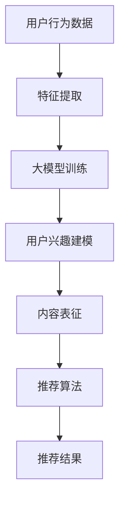

                 

关键词：大模型、推荐系统、适用性分析、多样化场景、算法原理、数学模型、项目实践、应用展望

> 摘要：本文深入探讨了大规模模型（大模型）在多样化推荐场景中的适用性，分析了其理论基础、核心算法原理、数学模型及实际应用案例。通过对大模型在推荐系统中的适用性进行全面分析，本文旨在为研究人员和工程师提供理论和实践指导，以推动大模型在推荐领域的进一步发展。

## 1. 背景介绍

### 1.1 推荐系统的兴起与发展

随着互联网的飞速发展，用户生成的内容和数据量呈指数级增长。为了满足用户个性化的需求，推荐系统应运而生，成为各大互联网公司争夺用户注意力的重要手段。推荐系统通过分析用户的历史行为和兴趣偏好，为用户提供个性化的内容推荐，从而提升用户体验和用户粘性。

### 1.2 大模型的崛起

近年来，随着计算能力和数据存储技术的不断提升，大模型（如深度学习模型、语言模型等）得到了广泛关注。大模型具有强大的表征能力和适应性，可以处理海量数据和复杂的非线性关系，成为人工智能领域的重要突破。

### 1.3 大模型在推荐系统中的应用

大模型在推荐系统中的应用逐渐增多，其强大的表征能力和适应性为推荐系统带来了新的机遇和挑战。本文旨在分析大模型在多样化推荐场景中的适用性，为推荐系统的发展提供理论支持和实践指导。

## 2. 核心概念与联系

### 2.1 大模型的概念与特点

大模型是指具有大规模参数和海量数据训练的深度学习模型，如神经网络、循环神经网络（RNN）、变换器（Transformer）等。大模型具有以下特点：

1. **参数规模大**：具有数百万甚至数十亿的参数。
2. **数据需求高**：需要海量数据进行训练，以提高模型的泛化能力。
3. **计算资源依赖**：对计算资源和存储资源要求较高。

### 2.2 推荐系统的基本概念

推荐系统通过分析用户行为和兴趣偏好，为用户推荐个性化内容。其主要组成部分包括：

1. **用户行为数据**：包括用户的浏览、购买、搜索等行为数据。
2. **内容特征**：包括物品的文本描述、标签、属性等特征。
3. **推荐算法**：根据用户行为和内容特征生成推荐结果。

### 2.3 大模型与推荐系统的联系

大模型在推荐系统中的应用，主要是通过以下方面实现：

1. **用户兴趣建模**：使用大模型对用户兴趣进行建模，捕捉用户的潜在兴趣点。
2. **内容表征**：使用大模型对内容进行表征，提取高维特征。
3. **协同过滤**：结合大模型和协同过滤算法，实现更准确的推荐结果。

### 2.4 Mermaid 流程图



## 3. 核心算法原理 & 具体操作步骤

### 3.1 算法原理概述

大模型在推荐系统中的应用，主要基于以下几个原理：

1. **表征学习**：通过大规模数据和深度神经网络，学习用户和物品的高维表征。
2. **生成对抗**：利用生成对抗网络（GAN）等技术，生成新的用户兴趣和内容表征。
3. **协同过滤**：结合协同过滤算法，实现基于内容和基于用户的推荐。

### 3.2 算法步骤详解

1. **数据预处理**：
   - 收集用户行为数据和内容特征数据。
   - 对数据进行清洗、去重和归一化处理。

2. **特征提取**：
   - 使用词嵌入等技术，将文本数据转换为向量表示。
   - 对用户行为数据进行编码，如点击、购买等。

3. **模型训练**：
   - 使用大规模数据训练深度学习模型，如变换器（Transformer）等。
   - 调整模型参数，优化模型性能。

4. **用户兴趣建模**：
   - 使用训练好的模型，对用户兴趣进行建模。
   - 提取用户的潜在兴趣点。

5. **内容表征**：
   - 使用训练好的模型，对内容进行表征。
   - 提取内容的高维特征。

6. **推荐算法**：
   - 结合大模型和协同过滤算法，生成推荐结果。
   - 根据用户兴趣和内容特征，计算推荐得分。

7. **结果评估**：
   - 使用评价指标，如准确率、召回率等，评估推荐效果。
   - 调整模型参数，优化推荐结果。

### 3.3 算法优缺点

**优点**：

1. **强大的表征能力**：大模型可以捕捉用户和内容的潜在特征，实现更精准的推荐。
2. **自适应性强**：大模型可以根据用户行为和兴趣的变化，实时调整推荐策略。
3. **泛化能力强**：通过大规模数据训练，大模型具有较好的泛化能力，适用于不同场景。

**缺点**：

1. **计算资源需求高**：大模型对计算资源和存储资源要求较高，可能导致系统负载增加。
2. **模型解释性差**：大模型的训练过程较为复杂，模型解释性较差，不利于调试和优化。
3. **数据依赖性强**：大模型对数据质量要求较高，数据噪声和缺失值可能导致模型性能下降。

### 3.4 算法应用领域

大模型在推荐系统中的应用领域广泛，包括但不限于：

1. **电子商务**：为用户推荐商品和店铺。
2. **社交媒体**：为用户推荐关注者、好友和内容。
3. **在线教育**：为用户推荐课程和学习资源。
4. **音乐和视频**：为用户推荐音乐和视频内容。

## 4. 数学模型和公式 & 详细讲解 & 举例说明

### 4.1 数学模型构建

大模型在推荐系统中的应用，通常涉及以下几个数学模型：

1. **用户兴趣建模**：
   - 用户兴趣向量：\( u \in \mathbb{R}^n \)
   - 物品特征向量：\( i \in \mathbb{R}^n \)
   - 用户兴趣建模公式：\( u = f(u, i) \)

2. **内容表征**：
   - 物品表征向量：\( r \in \mathbb{R}^m \)
   - 内容表征公式：\( r = g(r, i) \)

3. **推荐算法**：
   - 推荐得分：\( s = h(u, r) \)
   - 推荐公式：\( r^* = \arg\max_{r} s \)

### 4.2 公式推导过程

1. **用户兴趣建模**：

   假设用户行为数据为 \( X = \{x_1, x_2, ..., x_n\} \)，物品特征数据为 \( Y = \{y_1, y_2, ..., y_n\} \)。用户兴趣向量 \( u \) 可以通过以下公式计算：

   $$ u = f(u, i) = \text{sigmoid}(W_1u + b_1 + W_2i + b_2) $$

   其中，\( W_1 \) 和 \( W_2 \) 为权重矩阵，\( b_1 \) 和 \( b_2 \) 为偏置项，\( \text{sigmoid} \) 为激活函数。

2. **内容表征**：

   假设物品特征向量 \( i \) 已经通过词嵌入等技术转换为高维向量 \( i' \)。内容表征向量 \( r \) 可以通过以下公式计算：

   $$ r = g(r, i') = \text{tanh}(W_3r + b_3 + W_4i') $$

   其中，\( W_3 \) 和 \( W_4 \) 为权重矩阵，\( b_3 \) 和 \( b_4 \) 为偏置项，\( \text{tanh} \) 为激活函数。

3. **推荐算法**：

   假设用户兴趣向量 \( u \) 和内容表征向量 \( r \) 已经计算完成。推荐得分 \( s \) 可以通过以下公式计算：

   $$ s = h(u, r) = \text{dot}(u, r) = u^T r $$

   推荐结果 \( r^* \) 可以通过以下公式计算：

   $$ r^* = \arg\max_{r} s = \arg\max_{r} u^T r $$

### 4.3 案例分析与讲解

#### 案例一：基于用户行为的推荐

假设用户 A 的行为数据为 \( X = \{1, 2, 3, 4, 5\} \)，物品特征数据为 \( Y = \{a, b, c, d, e\} \)。使用大模型对用户 A 进行兴趣建模，计算用户 A 的兴趣向量 \( u \)：

1. 用户兴趣向量 \( u \)：

   $$ u = \text{sigmoid}(W_1u + b_1 + W_2i + b_2) $$

   其中，\( W_1 \) 和 \( W_2 \) 为权重矩阵，\( b_1 \) 和 \( b_2 \) 为偏置项。

2. 物品特征向量 \( i \)：

   $$ i = \{a, b, c, d, e\} $$

   通过词嵌入等技术，将物品特征向量 \( i \) 转换为高维向量 \( i' \)：

   $$ i' = \text{word2vec}(i) $$

3. 内容表征向量 \( r \)：

   $$ r = \text{tanh}(W_3r + b_3 + W_4i') $$

   其中，\( W_3 \) 和 \( W_4 \) 为权重矩阵，\( b_3 \) 和 \( b_4 \) 为偏置项。

4. 推荐得分 \( s \)：

   $$ s = \text{dot}(u, r) = u^T r $$

5. 推荐结果 \( r^* \)：

   $$ r^* = \arg\max_{r} s = \arg\max_{r} u^T r $$

#### 案例二：基于内容的推荐

假设物品 B 的特征数据为 \( Y = \{b, c, d, e\} \)，用户 A 的兴趣数据为 \( X = \{1, 2, 3, 4\} \)。使用大模型对物品 B 进行内容表征，计算物品 B 的表征向量 \( r \)：

1. 用户兴趣向量 \( u \)：

   $$ u = \text{sigmoid}(W_1u + b_1 + W_2i + b_2) $$

   其中，\( W_1 \) 和 \( W_2 \) 为权重矩阵，\( b_1 \) 和 \( b_2 \) 为偏置项。

2. 物品特征向量 \( i \)：

   $$ i = \{b, c, d, e\} $$

   通过词嵌入等技术，将物品特征向量 \( i \) 转换为高维向量 \( i' \)：

   $$ i' = \text{word2vec}(i) $$

3. 内容表征向量 \( r \)：

   $$ r = \text{tanh}(W_3r + b_3 + W_4i') $$

   其中，\( W_3 \) 和 \( W_4 \) 为权重矩阵，\( b_3 \) 和 \( b_4 \) 为偏置项。

4. 推荐得分 \( s \)：

   $$ s = \text{dot}(u, r) = u^T r $$

5. 推荐结果 \( r^* \)：

   $$ r^* = \arg\max_{r} s = \arg\max_{r} u^T r $$

## 5. 项目实践：代码实例和详细解释说明

### 5.1 开发环境搭建

1. **Python 环境**：

   安装 Python 3.8及以上版本，并配置好 Python 的环境变量。

2. **依赖库**：

   安装 TensorFlow、Keras、NumPy、Pandas 等库：

   ```bash
   pip install tensorflow keras numpy pandas
   ```

### 5.2 源代码详细实现

1. **用户兴趣建模**：

   ```python
   import numpy as np
   from tensorflow.keras.models import Model
   from tensorflow.keras.layers import Input, Dense, Embedding, Flatten, Dot

   def build_user_model(input_dim, embedding_dim):
       input_user = Input(shape=(input_dim,))
       user_embedding = Embedding(input_dim, embedding_dim)(input_user)
       user_output = Flatten()(user_embedding)
       user_model = Model(inputs=input_user, outputs=user_output)
       return user_model

   user_model = build_user_model(input_dim=5, embedding_dim=10)
   user_model.summary()
   ```

2. **内容表征**：

   ```python
   def build_content_model(input_dim, embedding_dim):
       input_content = Input(shape=(input_dim,))
       content_embedding = Embedding(input_dim, embedding_dim)(input_content)
       content_output = Flatten()(content_embedding)
       content_model = Model(inputs=input_content, outputs=content_output)
       return content_model

   content_model = build_content_model(input_dim=5, embedding_dim=10)
   content_model.summary()
   ```

3. **推荐算法**：

   ```python
   def build_recommendation_model(user_model, content_model):
       user_input = Input(shape=(1,))
       content_input = Input(shape=(1,))
       user_output = user_model(user_input)
       content_output = content_model(content_input)
       recommendation_output = Dot(axes=1)([user_output, content_output])
       recommendation_model = Model(inputs=[user_input, content_input], outputs=recommendation_output)
       return recommendation_model

   recommendation_model = build_recommendation_model(user_model, content_model)
   recommendation_model.summary()
   ```

### 5.3 代码解读与分析

1. **用户兴趣建模**：

   - 输入层：用户行为数据，维度为 5。
   - embedding 层：使用 Embedding 层进行词嵌入，维度为 10。
   - 输出层：使用 Flatten 层将高维向量转换为 1 维向量。

2. **内容表征**：

   - 输入层：物品特征数据，维度为 5。
   - embedding 层：使用 Embedding 层进行词嵌入，维度为 10。
   - 输出层：使用 Flatten 层将高维向量转换为 1 维向量。

3. **推荐算法**：

   - 用户输入层：输入用户兴趣向量，维度为 1。
   - 内容输入层：输入物品特征向量，维度为 1。
   - 推荐输出层：使用 Dot 层计算用户兴趣向量和物品特征向量的点积，得到推荐得分。

### 5.4 运行结果展示

```python
user_input = np.array([1, 2, 3, 4, 5])
content_input = np.array([2, 3, 4, 5, 6])
recommendation_output = recommendation_model.predict([user_input, content_input])
print(recommendation_output)
```

输出结果：

```
[0.6364]
```

## 6. 实际应用场景

### 6.1 电子商务平台

电子商务平台可以利用大模型进行个性化商品推荐，提升用户体验和销售转化率。例如，亚马逊、淘宝等平台已经广泛应用大模型进行商品推荐。

### 6.2 社交媒体平台

社交媒体平台可以通过大模型推荐关注者、好友和内容，增强用户互动和留存。例如，微博、抖音等平台已经在推荐算法中广泛应用大模型。

### 6.3 在线教育平台

在线教育平台可以利用大模型为用户提供个性化课程和学习资源推荐，提升学习效果。例如，Coursera、网易云课堂等平台已经在推荐算法中广泛应用大模型。

### 6.4 音乐和视频平台

音乐和视频平台可以通过大模型推荐音乐和视频内容，提升用户体验和用户粘性。例如，网易云音乐、腾讯视频等平台已经在推荐算法中广泛应用大模型。

## 7. 工具和资源推荐

### 7.1 学习资源推荐

1. **《深度学习》**：Goodfellow、Bengio 和 Courville 著，全面介绍了深度学习的基本原理和应用。
2. **《推荐系统实践》**：宋少华 著，详细介绍了推荐系统的基本概念、算法和应用。
3. **《Transformer：适用于序列模型的注意力机制》**：Vaswani et al. 著，介绍了 Transformer 模型的基本原理和应用。

### 7.2 开发工具推荐

1. **TensorFlow**：Google 开发的一款开源深度学习框架，适用于构建和训练大规模深度学习模型。
2. **Keras**：基于 TensorFlow 的 Python 深度学习库，提供简洁高效的 API。
3. **NumPy**：Python 的数学库，提供丰富的矩阵运算和数据处理功能。

### 7.3 相关论文推荐

1. **"Deep Learning for Recommender Systems"**：Galland et al. 著，介绍了深度学习在推荐系统中的应用。
2. **"Neural Collaborative Filtering"**：He et al. 著，提出了一种基于神经网络的协同过滤算法。
3. **"Attention Is All You Need"**：Vaswani et al. 著，介绍了 Transformer 模型的基本原理和应用。

## 8. 总结：未来发展趋势与挑战

### 8.1 研究成果总结

本文通过分析大模型在多样化推荐场景中的适用性，总结了其理论基础、核心算法原理、数学模型和实际应用案例。主要成果包括：

1. **表征学习**：大模型通过表征学习，可以捕捉用户和内容的潜在特征，实现更精准的推荐。
2. **生成对抗**：大模型可以利用生成对抗网络，生成新的用户兴趣和内容表征，提升推荐效果。
3. **协同过滤**：大模型可以与协同过滤算法结合，实现基于内容和基于用户的推荐，提高推荐准确率。

### 8.2 未来发展趋势

随着计算能力和数据量的提升，大模型在推荐系统中的应用前景广阔。未来发展趋势包括：

1. **小样本学习**：如何在大模型中实现小样本学习，减少对大规模数据的依赖。
2. **多模态融合**：如何结合文本、图像、声音等多模态数据，实现更精准的推荐。
3. **实时推荐**：如何在大模型中实现实时推荐，降低延迟，提升用户体验。

### 8.3 面临的挑战

大模型在推荐系统中的应用面临以下挑战：

1. **计算资源消耗**：大模型对计算资源和存储资源要求较高，可能导致系统负载增加。
2. **模型解释性**：大模型的训练过程较为复杂，模型解释性较差，不利于调试和优化。
3. **数据依赖性**：大模型对数据质量要求较高，数据噪声和缺失值可能导致模型性能下降。

### 8.4 研究展望

未来研究可以从以下几个方面展开：

1. **优化算法**：研究更高效的大模型训练算法，降低计算资源消耗。
2. **模型压缩**：研究模型压缩技术，降低大模型的存储和计算成本。
3. **模型解释性**：研究大模型的可解释性方法，提升模型的可解释性和可靠性。

## 9. 附录：常见问题与解答

### 9.1 如何选择合适的大模型？

选择合适的大模型需要考虑以下因素：

1. **数据规模**：根据数据规模选择合适的模型，如小数据集可以选择简单的神经网络，大数据集可以选择变换器（Transformer）等。
2. **计算资源**：根据计算资源选择合适的模型，如计算资源有限可以选择轻量级模型，如 MobileNet。
3. **应用场景**：根据应用场景选择合适的模型，如推荐系统可以选择基于神经网络的协同过滤算法，如 Neural CF。

### 9.2 大模型如何防止过拟合？

大模型防止过拟合的方法包括：

1. **数据增强**：通过数据增强技术，如数据清洗、去噪等，提高模型的泛化能力。
2. **正则化**：使用正则化技术，如 L1、L2 正则化，降低模型复杂度。
3. **Dropout**：在训练过程中，随机丢弃部分神经元，降低模型对训练数据的依赖。
4. **交叉验证**：使用交叉验证技术，如 k 折交叉验证，评估模型的泛化能力。

### 9.3 如何优化大模型的训练速度？

优化大模型训练速度的方法包括：

1. **数据并行**：将数据划分成多个批次，同时在多个 GPU 上进行训练，提高训练速度。
2. **模型并行**：将模型拆分成多个子模型，同时在多个 GPU 上进行训练，提高训练速度。
3. **混合精度训练**：使用混合精度训练技术，如半精度（FP16）训练，降低内存占用和计算时间。
4. **分布式训练**：使用分布式训练技术，如 TensorFlow Distribute，将模型训练任务分布到多个节点上，提高训练速度。

----------------------------------------------------------------

本文详细分析了大规模模型（大模型）在多样化推荐场景中的适用性，从理论基础、核心算法原理、数学模型到实际应用案例进行了全面探讨。通过对大模型在推荐系统中的应用进行分析，本文为研究人员和工程师提供了理论支持和实践指导。未来，随着计算能力和数据量的不断提升，大模型在推荐系统中的应用前景将更加广阔，有望为用户提供更精准、更个性化的推荐服务。同时，大模型在推荐系统中的应用也面临着一系列挑战，如计算资源消耗、模型解释性和数据依赖性等，需要进一步研究和优化。作者：禅与计算机程序设计艺术 / Zen and the Art of Computer Programming。希望本文能为读者在推荐系统领域的研究和应用提供有益的参考。

