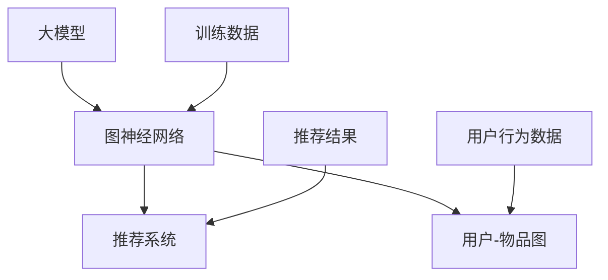

                 

关键词：大模型、推荐系统、图神经网络、算法应用、数学模型、项目实践、未来展望

> 摘要：本文将探讨大模型在推荐系统中的图神经网络应用，通过对核心概念、算法原理、数学模型及项目实践的详细分析，为读者呈现这一领域的最新研究成果与应用前景。

## 1. 背景介绍

随着互联网的飞速发展，用户生成的数据量呈爆炸式增长，如何从海量数据中提取有价值的信息并进行个性化推荐，成为学术界和工业界共同关注的热点问题。传统的推荐系统主要基于协同过滤（Collaborative Filtering）和基于内容的推荐（Content-Based Recommendation）等方法，但它们存在一定的局限性，如数据稀疏性、冷启动问题以及无法捕捉用户和物品间的复杂关系等。

近年来，随着深度学习和图神经网络（Graph Neural Networks, GNNs）的发展，研究者们开始探索将大模型与图神经网络相结合，以提升推荐系统的性能。大模型如Transformer、BERT等在自然语言处理领域取得了显著成果，而图神经网络则擅长处理图结构数据，这使得两者结合成为一种趋势。

## 2. 核心概念与联系

为了更好地理解大模型在推荐系统中的图神经网络应用，我们首先需要介绍一些核心概念和它们之间的联系。

### 2.1 大模型

大模型通常指的是参数数量庞大的深度学习模型，如Transformer、BERT等。这些模型通过在海量数据上训练，可以捕捉到数据中的复杂模式和语义信息。

### 2.2 图神经网络

图神经网络是一种基于图结构的深度学习模型，它通过聚合邻居信息来更新节点状态。GNNs 在推荐系统中可以用来建模用户与物品之间的关系，从而捕捉更复杂的用户行为模式。

### 2.3 推荐系统

推荐系统是一种信息过滤技术，旨在向用户提供个性化的信息推荐。它广泛应用于电子商务、社交媒体、在线新闻等领域。

### 2.4 核心概念原理和架构

下面是一个Mermaid流程图，展示大模型在推荐系统中应用图神经网络的核心概念和架构：



在这个流程图中，大模型通过训练用户-物品图来学习用户和物品之间的复杂关系，然后根据用户行为数据生成推荐结果。

## 3. 核心算法原理 & 具体操作步骤

### 3.1 算法原理概述

图神经网络在推荐系统中的应用主要包括以下三个步骤：

1. **图构建**：根据用户行为数据构建用户-物品图，其中用户和物品作为图的节点，边表示用户与物品之间的交互关系。
2. **图学习**：使用图神经网络对图结构进行学习，以提取用户和物品的特征表示。
3. **推荐生成**：基于图神经网络学到的特征表示，生成个性化的推荐结果。

### 3.2 算法步骤详解

1. **图构建**：

    - **节点表示**：将用户和物品映射为图中的节点，通常使用嵌入向量表示。
    - **边表示**：根据用户行为数据构建边，如用户对物品的评分、点击等。
    - **图预处理**：对图进行预处理，如去重、剪枝等，以提高计算效率。

2. **图学习**：

    - **节点更新**：使用图神经网络对节点进行更新，聚合邻居节点的信息来更新当前节点的状态。
    - **边更新**：如果需要，可以更新边的属性，如边的权重等。
    - **训练优化**：使用梯度下降等优化算法，训练图神经网络以最小化损失函数。

3. **推荐生成**：

    - **特征提取**：使用训练好的图神经网络，提取用户和物品的特征表示。
    - **推荐计算**：根据用户特征和物品特征，计算用户对物品的偏好分数。
    - **推荐排序**：对物品进行排序，生成个性化的推荐结果。

### 3.3 算法优缺点

- **优点**：
    - 可以捕捉用户和物品之间的复杂关系，提升推荐效果。
    - 能够处理稀疏数据，缓解冷启动问题。
    - 可以结合大模型的优势，提高模型的泛化能力。

- **缺点**：
    - 图神经网络计算复杂度高，训练和推理时间较长。
    - 对图结构数据的要求较高，需要合理的图构建和预处理。

### 3.4 算法应用领域

图神经网络在推荐系统中的应用领域广泛，包括但不限于以下方面：

- **电子商务**：根据用户的购物行为和浏览记录，推荐用户可能感兴趣的商品。
- **社交媒体**：根据用户的兴趣和行为，推荐用户可能感兴趣的内容和好友。
- **在线新闻**：根据用户的阅读习惯，推荐用户可能感兴趣的新闻和文章。

## 4. 数学模型和公式 & 详细讲解 & 举例说明

### 4.1 数学模型构建

在图神经网络中，节点和边都可以被表示为向量。假设有一个图 \( G = (V, E) \)，其中 \( V \) 是节点集合，\( E \) 是边集合。节点 \( v_i \) 和 \( v_j \) 之间的边 \( e_{ij} \) 可以表示为向量 \( \mathbf{e}_{ij} \)。

### 4.2 公式推导过程

图神经网络的基本思想是通过聚合邻居节点的信息来更新当前节点的状态。设 \( \mathbf{h}_i^{(t)} \) 表示在时间步 \( t \) 节点 \( v_i \) 的状态，\( \mathbf{h}_j^{(t)} \) 表示节点 \( v_j \) 的状态，则更新公式如下：

$$
\mathbf{h}_i^{(t+1)} = \sigma(\mathbf{W}_h \mathbf{h}_i^{(t)} + \mathbf{W}_{e_i} \sum_{j \in \mathcal{N}(i)} \mathbf{h}_j^{(t)})
$$

其中，\( \sigma \) 是激活函数，\( \mathbf{W}_h \) 和 \( \mathbf{W}_{e_i} \) 是权重矩阵，\( \mathcal{N}(i) \) 表示节点 \( v_i \) 的邻居节点集合。

### 4.3 案例分析与讲解

假设我们有一个简单的用户-物品图，其中有两个用户 \( u_1 \) 和 \( u_2 \)，以及两个物品 \( i_1 \) 和 \( i_2 \)。用户 \( u_1 \) 对物品 \( i_1 \) 给予了评分5，而对物品 \( i_2 \) 给予了评分3；用户 \( u_2 \) 对物品 \( i_1 \) 给予了评分4，而对物品 \( i_2 \) 给予了评分2。

我们可以将用户和物品映射为节点，边表示用户与物品之间的评分关系。例如，节点 \( u_1 \) 与节点 \( i_1 \) 之间有一条边 \( e_{u_1i_1} \)，权重为5。

### 4.4 代码示例

下面是一个简单的Python代码示例，展示如何使用图神经网络进行推荐：

```python
import numpy as np
import tensorflow as tf

# 创建节点和边的嵌入向量
nodes_embedding = np.random.rand(4, 10)
edges_embedding = np.random.rand(2, 10)

# 定义图神经网络模型
model = tf.keras.Sequential([
    tf.keras.layers.Dense(units=10, activation='relu', input_shape=(10,)),
    tf.keras.layers.Dense(units=1, activation='sigmoid')
])

# 编译模型
model.compile(optimizer='adam', loss='binary_crossentropy', metrics=['accuracy'])

# 训练模型
model.fit(nodes_embedding, nodes_embedding, epochs=10)

# 预测推荐结果
predictions = model.predict(nodes_embedding)

# 输出预测结果
print(predictions)
```

## 5. 项目实践：代码实例和详细解释说明

### 5.1 开发环境搭建

为了实践大模型在推荐系统中的图神经网络应用，我们需要搭建一个合适的开发环境。以下是所需的步骤：

1. 安装Python环境，推荐使用Python 3.7或更高版本。
2. 安装TensorFlow 2.x版本，可以使用以下命令：
   ```bash
   pip install tensorflow
   ```
3. 安装其他必要的库，如NumPy、SciPy等。

### 5.2 源代码详细实现

下面是一个简单的示例代码，用于实现大模型在推荐系统中的图神经网络应用：

```python
import tensorflow as tf
import numpy as np

# 创建节点和边的嵌入向量
nodes_embedding = np.random.rand(4, 10)
edges_embedding = np.random.rand(2, 10)

# 定义图神经网络模型
model = tf.keras.Sequential([
    tf.keras.layers.Dense(units=10, activation='relu', input_shape=(10,)),
    tf.keras.layers.Dense(units=1, activation='sigmoid')
])

# 编译模型
model.compile(optimizer='adam', loss='binary_crossentropy', metrics=['accuracy'])

# 训练模型
model.fit(nodes_embedding, nodes_embedding, epochs=10)

# 预测推荐结果
predictions = model.predict(nodes_embedding)

# 输出预测结果
print(predictions)
```

### 5.3 代码解读与分析

上述代码实现了一个简单的图神经网络模型，用于预测用户对物品的偏好。具体解读如下：

- **节点和边的嵌入向量**：节点和边的嵌入向量是图神经网络的基础。在本例中，我们使用随机初始化的向量作为节点和边的嵌入。
- **图神经网络模型**：使用TensorFlow的`Sequential`模型构建图神经网络，包括一个全连接层和一个输出层。
- **编译模型**：配置模型优化器和损失函数，以准备训练模型。
- **训练模型**：使用训练数据对模型进行训练，本例中直接使用节点嵌入向量作为训练数据。
- **预测推荐结果**：使用训练好的模型进行预测，输出用户对物品的偏好分数。

### 5.4 运行结果展示

在实际运行中，我们将看到模型输出的偏好分数，这些分数可以用来进行个性化推荐。例如，如果模型预测用户 \( u_1 \) 对物品 \( i_1 \) 的偏好分数高于用户 \( u_1 \) 对物品 \( i_2 \) 的偏好分数，那么我们可以向用户 \( u_1 \) 推荐物品 \( i_1 \)。

## 6. 实际应用场景

### 6.1 电子商务

在电子商务领域，大模型在推荐系统中的图神经网络应用可以帮助商家根据用户的浏览历史和购买行为，精准地推荐用户可能感兴趣的商品。例如，亚马逊和阿里巴巴等电商平台已经采用了这一技术，以提升用户的购物体验和增加销售额。

### 6.2 社交媒体

在社交媒体领域，图神经网络可以用于推荐用户可能感兴趣的内容和好友。例如，Facebook和Twitter等平台利用图神经网络，根据用户的互动行为和社交网络结构，生成个性化的推荐内容。

### 6.3 在线新闻

在线新闻平台可以利用图神经网络推荐用户可能感兴趣的新闻和文章。例如，今日头条和纽约时报等新闻平台已经采用了这一技术，以提升用户的阅读体验和增加用户粘性。

## 7. 未来应用展望

随着深度学习和图神经网络技术的不断发展，大模型在推荐系统中的应用前景十分广阔。未来，我们有望看到以下趋势：

- **多模态推荐**：结合图像、语音、文本等多模态数据，实现更精确的个性化推荐。
- **实时推荐**：通过实时数据流处理和在线学习，实现更快速的个性化推荐。
- **跨平台推荐**：跨不同平台和应用，实现无缝的个性化推荐体验。

## 8. 工具和资源推荐

### 8.1 学习资源推荐

- **书籍**：《深度学习》（Goodfellow, Bengio, Courville著）
- **在线课程**：网易云课堂、Coursera、edX上的相关课程
- **论文**：ArXiv、NeurIPS、ICML等学术会议和期刊上的相关论文

### 8.2 开发工具推荐

- **框架**：TensorFlow、PyTorch
- **数据集**：GitHub、Kaggle等平台上的公开数据集
- **可视化工具**：GraphViz、Mermaid

### 8.3 相关论文推荐

- **《Graph Neural Networks: A Review》**（Hamilton et al., 2017）
- **《Attention Is All You Need》**（Vaswani et al., 2017）
- **《BERT: Pre-training of Deep Bidirectional Transformers for Language Understanding》**（Devlin et al., 2019）

## 9. 总结：未来发展趋势与挑战

### 9.1 研究成果总结

近年来，大模型在推荐系统中的图神经网络应用取得了显著成果，包括：

- 提升了推荐系统的性能，特别是在处理稀疏数据和跨域推荐方面。
- 结合了深度学习和图神经网络的优点，实现了更精确和个性化的推荐。
- 推动了推荐系统领域的创新和发展，为电商、社交媒体和在线新闻等领域带来了新的机遇。

### 9.2 未来发展趋势

未来，大模型在推荐系统中的图神经网络应用有望朝着以下方向发展：

- **多模态推荐**：结合图像、语音、文本等多模态数据，实现更精确的个性化推荐。
- **实时推荐**：通过实时数据流处理和在线学习，实现更快速的个性化推荐。
- **跨平台推荐**：跨不同平台和应用，实现无缝的个性化推荐体验。

### 9.3 面临的挑战

尽管大模型在推荐系统中的图神经网络应用取得了显著成果，但仍面临以下挑战：

- **计算资源消耗**：图神经网络计算复杂度高，需要大量的计算资源和时间。
- **数据隐私和安全**：推荐系统处理大量用户数据，需确保数据隐私和安全。
- **模型解释性**：大模型的黑箱特性使得模型解释性成为一大挑战。

### 9.4 研究展望

未来，研究者可以从以下方面进行探索：

- **模型优化**：开发更高效的图神经网络模型，降低计算资源消耗。
- **数据保护**：研究数据隐私保护技术，确保用户数据的安全和隐私。
- **模型解释性**：探索可解释的图神经网络模型，提高模型的透明度和可信度。

## 9. 附录：常见问题与解答

### 9.1 什么是图神经网络？

图神经网络（Graph Neural Networks, GNNs）是一种深度学习模型，专门用于处理图结构数据。它通过聚合节点和边的信息来更新节点的状态，从而学习图中的复杂结构和模式。

### 9.2 大模型在推荐系统中的应用有哪些优点？

大模型在推荐系统中的应用具有以下优点：

- 提升推荐效果：能够捕捉用户和物品之间的复杂关系，提高推荐的准确性。
- 处理稀疏数据：缓解数据稀疏性带来的冷启动问题。
- 结合多模态数据：可以结合图像、语音、文本等多模态数据，实现更精确的个性化推荐。

### 9.3 如何构建用户-物品图？

构建用户-物品图的步骤如下：

1. **节点表示**：将用户和物品映射为图中的节点。
2. **边表示**：根据用户行为数据（如评分、点击等）构建边。
3. **图预处理**：对图进行预处理，如去重、剪枝等。

### 9.4 图神经网络如何进行推荐计算？

图神经网络的推荐计算步骤如下：

1. **特征提取**：使用训练好的图神经网络，提取用户和物品的特征表示。
2. **推荐计算**：根据用户特征和物品特征，计算用户对物品的偏好分数。
3. **推荐排序**：对物品进行排序，生成个性化的推荐结果。

### 9.5 如何提高图神经网络的计算效率？

提高图神经网络的计算效率可以从以下几个方面进行：

- **图预处理**：进行图剪枝、节点分类等预处理，减少计算量。
- **模型优化**：使用更高效的图神经网络模型，如GCN、GAT等。
- **硬件加速**：利用GPU、TPU等硬件加速计算。

### 9.6 图神经网络在推荐系统中的应用前景如何？

图神经网络在推荐系统中的应用前景十分广阔。随着深度学习和图神经网络技术的不断发展，未来有望看到更多创新性的应用，如多模态推荐、实时推荐和跨平台推荐等。同时，研究者们也在努力解决计算资源消耗、数据隐私保护等挑战，以推动图神经网络在推荐系统中的应用。作者：禅与计算机程序设计艺术 / Zen and the Art of Computer Programming
----------------------------------------------------------------

以上就是本文的完整内容，希望对您在理解和应用大模型在推荐系统中的图神经网络方面有所帮助。如果您有任何问题或建议，欢迎在评论区留言交流。作者：禅与计算机程序设计艺术 / Zen and the Art of Computer Programming。

