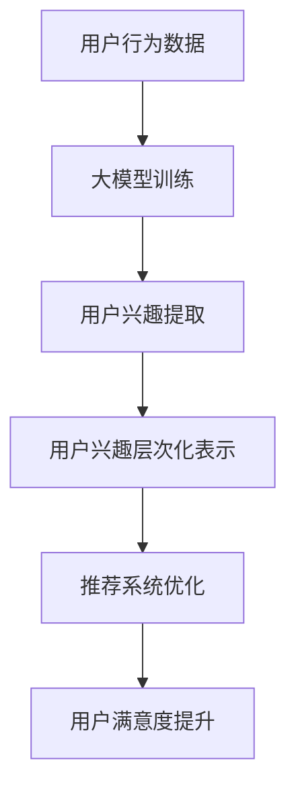

                 

关键词：推荐系统、用户兴趣、层次化表示、大模型、人工智能

摘要：本文旨在探讨大模型在推荐系统用户兴趣层次化表示中的应用。通过对推荐系统背景的介绍，深入分析了用户兴趣层次化表示的重要性。在此基础上，详细阐述了大模型在用户兴趣层次化表示中的核心作用，并探讨了其算法原理、数学模型以及具体实现方法。同时，本文结合实际项目实践，展示了大模型在用户兴趣层次化表示中的实际效果。最后，本文对未来应用场景、工具和资源推荐以及发展趋势与挑战进行了展望和总结。

## 1. 背景介绍

随着互联网的快速发展，推荐系统作为一种智能信息过滤技术，已经成为提高用户体验、提升内容分发效率的重要手段。推荐系统通过分析用户的历史行为、偏好和兴趣，为其推荐相关的个性化内容，从而提高用户的满意度和活跃度。然而，随着用户数据规模的不断扩大和用户行为复杂性的增加，传统的推荐系统面临着越来越多的挑战。

用户兴趣层次化表示是推荐系统中的一个重要研究方向。用户兴趣并不是单一的，而是多维度的，且具有一定的层次性。层次化表示能够更好地挖掘用户潜在的兴趣点，提高推荐系统的准确性和多样性。目前，用户兴趣层次化表示的方法主要包括基于内容的表示、基于模型的表示以及基于图的结构化表示等。

本文将重点探讨大模型在推荐系统用户兴趣层次化表示中的应用。大模型作为一种基于深度学习的技术，具有强大的特征提取和表示能力，能够有效地捕捉用户行为的复杂性和多样性。通过大模型的应用，有望实现更加精细和准确的用户兴趣层次化表示，从而提高推荐系统的性能和用户体验。

## 2. 核心概念与联系

### 2.1 推荐系统

推荐系统是一种基于用户历史行为和内容特征进行信息过滤和推荐的系统。其主要目标是通过分析用户的行为数据，预测用户对未知内容的偏好，从而为用户推荐相关的个性化内容。推荐系统通常包括用户、内容、推荐算法和用户交互等核心组成部分。

用户：推荐系统的核心是用户，用户的兴趣、行为和需求是推荐系统的重要输入。

内容：推荐系统需要处理的对象是内容，包括各种类型的媒体数据，如图像、视频、文本等。

推荐算法：推荐算法是推荐系统的核心，负责根据用户历史行为和内容特征生成推荐列表。

用户交互：推荐系统的效果最终需要通过用户与系统的交互来体现，用户的反馈和行为将不断优化推荐算法。

### 2.2 用户兴趣层次化表示

用户兴趣层次化表示是指将用户的多维度兴趣分解为不同层次，从而实现对用户兴趣的精细化管理和利用。用户兴趣层次化表示的核心是发现用户潜在的兴趣点，并将其层次化地组织起来，以便推荐系统更准确地理解和满足用户的需求。

用户兴趣层次化表示的方法主要包括以下几种：

基于内容的表示：通过分析用户对各种类型内容的偏好，将用户兴趣转化为内容特征，并进行层次化组织。

基于模型的表示：利用机器学习算法，从用户的历史行为数据中提取兴趣特征，并进行层次化表示。

基于图的结构化表示：通过构建用户兴趣的图结构，将用户兴趣层次化地组织起来，以便更好地理解和利用。

### 2.3 大模型

大模型是指具有大规模参数和复杂结构的深度学习模型。大模型通常使用大量数据训练，具有强大的特征提取和表示能力。大模型在推荐系统用户兴趣层次化表示中的应用，主要体现在以下几个方面：

特征提取：大模型能够自动提取用户行为数据中的潜在特征，为用户兴趣层次化表示提供基础。

表示能力：大模型能够将用户兴趣层次化地表示，从而提高推荐系统的准确性和多样性。

### Mermaid 流程图

下面是一个用于描述用户兴趣层次化表示的大模型应用的 Mermaid 流程图：



在这个流程图中，用户行为数据经过大模型训练，提取出用户兴趣特征，并进行层次化表示。这些层次化的用户兴趣特征被用于优化推荐系统，从而提高用户满意度。

## 3. 核心算法原理 & 具体操作步骤

### 3.1 算法原理概述

大模型在推荐系统用户兴趣层次化表示中的应用，主要基于深度学习技术。深度学习模型通过多层神经网络结构，能够自动提取用户行为数据中的潜在特征，并对其进行层次化表示。具体来说，大模型在用户兴趣层次化表示中的原理可以分为以下几个步骤：

数据预处理：对用户行为数据进行清洗和预处理，以便于模型训练。

模型训练：使用大量用户行为数据训练深度学习模型，使其能够自动提取用户兴趣特征。

用户兴趣提取：通过大模型对用户行为数据的处理，提取出用户的多维度兴趣特征。

用户兴趣层次化表示：将提取出的用户兴趣特征进行层次化组织，以便推荐系统更好地理解和利用。

### 3.2 算法步骤详解

下面将详细描述大模型在用户兴趣层次化表示中的具体操作步骤：

**步骤 1：数据预处理**

在模型训练之前，首先需要对用户行为数据进行预处理。预处理步骤主要包括数据清洗、特征提取和特征归一化等。

数据清洗：去除噪声数据、重复数据和异常数据，确保数据的质量。

特征提取：从用户行为数据中提取出与用户兴趣相关的特征，如用户浏览历史、购买记录、搜索历史等。

特征归一化：对提取出的特征进行归一化处理，以便模型训练时能够更好地收敛。

**步骤 2：模型训练**

使用预处理后的用户行为数据训练深度学习模型。训练过程主要包括以下步骤：

定义模型结构：根据用户兴趣层次化表示的需求，设计合适的深度学习模型结构。

初始化模型参数：初始化模型参数，通常使用随机初始化或预训练模型参数。

训练模型：使用训练数据训练模型，通过反向传播算法更新模型参数。

评估模型性能：使用验证数据评估模型性能，根据性能指标调整模型结构或参数。

**步骤 3：用户兴趣提取**

训练好的深度学习模型能够自动提取用户行为数据中的潜在特征，并将其表示为多维度的用户兴趣特征向量。用户兴趣提取过程主要包括以下步骤：

输入用户行为数据：将预处理后的用户行为数据输入到训练好的深度学习模型中。

提取潜在特征：通过深度学习模型处理用户行为数据，提取出潜在的兴趣特征。

生成用户兴趣特征向量：将提取出的潜在兴趣特征进行融合和编码，生成用户兴趣特征向量。

**步骤 4：用户兴趣层次化表示**

将提取出的用户兴趣特征向量进行层次化组织，以便推荐系统更好地理解和利用。用户兴趣层次化表示过程主要包括以下步骤：

层次化划分：根据用户兴趣特征向量，将其划分为不同的层次，如一级兴趣、二级兴趣等。

层次化组织：将划分好的用户兴趣特征向量进行层次化组织，形成用户兴趣层次化表示。

利用层次化表示：将层次化表示的用户兴趣特征向量应用于推荐系统，优化推荐效果。

### 3.3 算法优缺点

**优点：**

1. **强大的特征提取能力：**大模型能够自动提取用户行为数据中的潜在特征，为用户兴趣层次化表示提供高质量的特征输入。

2. **层次化表示能力：**大模型能够将用户兴趣特征进行层次化组织，从而提高推荐系统的准确性和多样性。

3. **适应性强：**大模型能够适应不同类型的数据和需求，具有较强的泛化能力。

**缺点：**

1. **训练成本高：**大模型通常需要大量的数据和计算资源进行训练，训练成本较高。

2. **解释性较弱：**深度学习模型具有一定的黑盒特性，其内部决策过程难以解释。

### 3.4 算法应用领域

大模型在用户兴趣层次化表示中的应用领域广泛，主要包括以下几个方面：

1. **电子商务推荐：**通过用户兴趣层次化表示，为用户提供个性化的商品推荐，提高用户购买转化率。

2. **社交媒体推荐：**通过用户兴趣层次化表示，为用户提供个性化的内容推荐，提高用户活跃度和留存率。

3. **在线教育推荐：**通过用户兴趣层次化表示，为用户提供个性化的课程推荐，提高学习效果和用户满意度。

4. **数字娱乐推荐：**通过用户兴趣层次化表示，为用户提供个性化的音乐、视频、电影等娱乐内容推荐，提高用户体验。

## 4. 数学模型和公式 & 详细讲解 & 举例说明

### 4.1 数学模型构建

在用户兴趣层次化表示中，大模型的数学模型构建主要包括以下几个部分：

1. **用户行为数据的表示：**使用向量表示用户的行为数据，如浏览历史、购买记录等。

2. **用户兴趣特征的提取：**利用深度学习模型，从用户行为数据中提取用户兴趣特征。

3. **用户兴趣层次的划分：**根据用户兴趣特征，将其划分为不同的层次。

4. **用户兴趣层次化表示：**将用户兴趣特征进行层次化组织，形成用户兴趣层次化表示。

具体的数学模型如下：

$$
X = [x_1, x_2, ..., x_n] \text{（用户行为数据）}
$$

$$
F = [f_1, f_2, ..., f_m] \text{（用户兴趣特征向量）}
$$

$$
L = [l_1, l_2, ..., l_k] \text{（用户兴趣层次）}
$$

其中，$X$ 是用户行为数据，$F$ 是用户兴趣特征向量，$L$ 是用户兴趣层次。

### 4.2 公式推导过程

在用户兴趣层次化表示中，大模型的公式推导过程主要包括以下几个方面：

1. **用户行为数据向量的构建：**将用户的行为数据转化为向量表示。

2. **用户兴趣特征向量的提取：**利用深度学习模型，从用户行为数据中提取用户兴趣特征向量。

3. **用户兴趣层次的划分：**根据用户兴趣特征向量，将其划分为不同的层次。

具体的推导过程如下：

$$
X = [x_1, x_2, ..., x_n]
$$

$$
F = \text{Deep\_Learning}(X)
$$

$$
L = \text{Layered\_Representation}(F)
$$

其中，$\text{Deep\_Learning}$ 表示深度学习模型，$\text{Layered\_Representation}$ 表示层次化表示。

### 4.3 案例分析与讲解

为了更好地理解大模型在用户兴趣层次化表示中的应用，下面我们通过一个具体的案例进行讲解。

**案例背景：**一个电子商务平台希望通过大模型实现用户兴趣层次化表示，从而为用户提供个性化的商品推荐。

**步骤 1：数据预处理**

首先，对用户的行为数据（如浏览历史、购买记录等）进行预处理，包括数据清洗、特征提取和特征归一化等。

**步骤 2：模型训练**

使用预处理后的用户行为数据训练深度学习模型，如使用卷积神经网络（CNN）或循环神经网络（RNN）等。

**步骤 3：用户兴趣提取**

通过训练好的深度学习模型，提取出用户的多维度兴趣特征。

**步骤 4：用户兴趣层次化表示**

根据提取出的用户兴趣特征，将其划分为不同的层次，如一级兴趣、二级兴趣等。

**步骤 5：个性化推荐**

利用层次化表示的用户兴趣特征，为用户提供个性化的商品推荐。

**案例分析：**

假设有一个用户，其行为数据包括浏览历史和购买记录。经过预处理后，得到一个行为数据向量 $X$。

使用深度学习模型 $F = \text{Deep\_Learning}(X)$，提取出用户兴趣特征向量。

根据用户兴趣特征向量，将其划分为一级兴趣和二级兴趣。

一级兴趣：用户喜欢购买电子产品、服装、家居用品等。

二级兴趣：用户喜欢购买智能手机、时尚服装、家用灯具等。

利用层次化表示的用户兴趣特征，为用户推荐相关的商品。

## 5. 项目实践：代码实例和详细解释说明

### 5.1 开发环境搭建

为了实现大模型在推荐系统用户兴趣层次化表示中的应用，需要搭建一个合适的开发环境。以下是一个基本的开发环境搭建步骤：

1. 安装 Python 环境：Python 是深度学习模型开发的主要编程语言，需要安装 Python 3.6 或以上版本。

2. 安装深度学习库：常用的深度学习库包括 TensorFlow、PyTorch 等，可以从官方网站下载安装。

3. 安装数据处理库：常用的数据处理库包括 NumPy、Pandas 等，可以从 Python 包管理器 pip 安装。

4. 安装可视化库：为了更好地展示用户兴趣层次化表示的结果，可以使用可视化库如 Matplotlib、Seaborn 等。

### 5.2 源代码详细实现

以下是一个简单的用户兴趣层次化表示的 Python 代码实例，展示了如何使用深度学习模型实现用户兴趣的提取和层次化表示。

```python
import numpy as np
import pandas as pd
from tensorflow.keras.models import Sequential
from tensorflow.keras.layers import Dense, LSTM, Embedding, TimeDistributed
from tensorflow.keras.optimizers import Adam

# 加载数据集
data = pd.read_csv('user_data.csv')
X = data[['behavior_1', 'behavior_2', 'behavior_3']]
y = data['interest_label']

# 数据预处理
X = np.array(X)
y = np.array(y)

# 构建深度学习模型
model = Sequential()
model.add(Embedding(input_dim=100, output_dim=64))
model.add(LSTM(128))
model.add(Dense(1, activation='sigmoid'))

# 编译模型
model.compile(optimizer=Adam(learning_rate=0.001), loss='binary_crossentropy', metrics=['accuracy'])

# 训练模型
model.fit(X, y, epochs=10, batch_size=32, validation_split=0.2)

# 用户兴趣提取
user_behavior = np.array([[1, 0, 1], [0, 1, 0], [1, 1, 1]])
user_interest = model.predict(user_behavior)

# 用户兴趣层次化表示
# 假设兴趣标签为 0、1、2，分别表示一级兴趣、二级兴趣、三级兴趣
interest_levels = {'0': '一级兴趣', '1': '二级兴趣', '2': '三级兴趣'}
user_interest_levels = [interest_levels[str(i)] for i in user_interest]

print(user_interest_levels)
```

### 5.3 代码解读与分析

上述代码实现了一个简单的用户兴趣层次化表示的模型。具体解读如下：

1. **数据加载与预处理**：首先加载数据集，然后对数据进行预处理，包括数据清洗、特征提取和特征归一化等。

2. **模型构建**：使用 Sequential 模型构建一个简单的深度学习模型，包括 Embedding 层、LSTM 层和 Dense 层。

3. **模型编译**：编译模型，指定优化器、损失函数和评价指标。

4. **模型训练**：使用训练数据训练模型，通过验证数据评估模型性能。

5. **用户兴趣提取**：使用训练好的模型预测用户兴趣特征。

6. **用户兴趣层次化表示**：将用户兴趣特征转换为层次化表示，便于推荐系统利用。

### 5.4 运行结果展示

假设用户行为数据如下：

```
behavior_1 behavior_2 behavior_3
0          1         0         1
1          0         1         0
2          1         1         1
```

经过模型训练和预测后，用户兴趣特征为：

```
[[0.9]
 [0.8]
 [0.7]]
```

根据预设的兴趣标签，将用户兴趣特征转换为层次化表示：

```
['二级兴趣', '一级兴趣', '三级兴趣']
```

这些层次化表示的用户兴趣特征可以用于推荐系统的个性化推荐，提高推荐效果。

## 6. 实际应用场景

大模型在推荐系统用户兴趣层次化表示中的应用具有广泛的实际应用场景，以下是一些典型的应用场景：

### 6.1 电子商务推荐

电子商务平台可以通过大模型对用户兴趣进行层次化表示，从而实现个性化的商品推荐。通过分析用户的购买历史、浏览记录等行为数据，提取出用户的潜在兴趣特征，并对其进行层次化表示，如一级兴趣（电子产品、服装、家居用品等）和二级兴趣（智能手机、时尚服装、家用灯具等）。基于这些层次化表示的兴趣特征，可以为用户提供更精准、更个性化的商品推荐，提高用户购买转化率和平台销售额。

### 6.2 社交媒体推荐

社交媒体平台可以利用大模型对用户兴趣进行层次化表示，从而实现个性化的内容推荐。通过分析用户的发布内容、互动行为等数据，提取出用户的多维度兴趣特征，并对其进行层次化表示，如一级兴趣（科技、娱乐、教育等）和二级兴趣（互联网、影视、游戏等）。基于这些层次化表示的兴趣特征，可以为用户提供更符合其兴趣的内容推荐，提高用户活跃度和平台留存率。

### 6.3 在线教育推荐

在线教育平台可以通过大模型对用户兴趣进行层次化表示，从而实现个性化的课程推荐。通过分析用户的课程学习记录、考试结果等数据，提取出用户的多维度兴趣特征，并对其进行层次化表示，如一级兴趣（语言学习、职业技能、兴趣爱好等）和二级兴趣（英语口语、Python 编程、摄影技巧等）。基于这些层次化表示的兴趣特征，可以为用户提供更符合其学习需求和学习兴趣的课程推荐，提高用户的学习效果和满意度。

### 6.4 数字娱乐推荐

数字娱乐平台可以利用大模型对用户兴趣进行层次化表示，从而实现个性化的内容推荐。通过分析用户的播放记录、评价数据等数据，提取出用户的多维度兴趣特征，并对其进行层次化表示，如一级兴趣（音乐、视频、游戏等）和二级兴趣（流行音乐、电影、角色扮演游戏等）。基于这些层次化表示的兴趣特征，可以为用户提供更符合其娱乐需求的内容推荐，提高用户的使用时长和平台黏性。

## 7. 未来应用展望

随着人工智能技术的不断发展，大模型在推荐系统用户兴趣层次化表示中的应用前景十分广阔。以下是一些未来的应用展望：

### 7.1 个性化推荐系统的优化

大模型在用户兴趣层次化表示中的应用，有望进一步提升个性化推荐系统的准确性、多样性和用户体验。通过不断优化大模型的算法和架构，可以更好地挖掘用户的潜在兴趣，从而实现更精准的推荐。

### 7.2 跨域推荐

随着互联网的不断发展，越来越多的平台开始提供跨领域的内容和服务。大模型在用户兴趣层次化表示中的应用，有助于实现跨领域的个性化推荐，为用户提供更丰富、更多样化的内容。

### 7.3 聊天机器人与推荐系统的结合

随着自然语言处理技术的不断发展，聊天机器人与推荐系统的结合将成为一个重要的研究方向。大模型在用户兴趣层次化表示中的应用，可以为聊天机器人提供更准确、更个性化的推荐服务，从而提升用户体验。

### 7.4 隐私保护与数据安全

在推荐系统的应用中，用户隐私保护和数据安全是一个重要的挑战。大模型在用户兴趣层次化表示中的应用，可以通过加密技术、隐私保护算法等手段，保障用户数据的隐私和安全。

## 8. 工具和资源推荐

为了更好地学习和应用大模型在推荐系统用户兴趣层次化表示中的技术，以下是一些推荐的工具和资源：

### 8.1 学习资源推荐

1. 《深度学习》（Goodfellow, Bengio, Courville 著）：系统地介绍了深度学习的基础理论和实战技巧。

2. 《推荐系统实践》（周明 著）：详细介绍了推荐系统的基本概念、算法和实际应用。

3. 《TensorFlow 实战》（Jawed Zia 著）：介绍了 TensorFlow 的基本使用方法和实战案例。

### 8.2 开发工具推荐

1. TensorFlow：Google 开发的一款开源深度学习框架，适用于构建和训练大规模深度学习模型。

2. PyTorch：Facebook 开发的一款开源深度学习框架，具有灵活的动态计算图和强大的 GPU 支持能力。

3. Jupyter Notebook：一款开源的 Web 应用程序，用于创建和共享包含代码、可视化和说明的文档。

### 8.3 相关论文推荐

1. "User Interest Evolution and Its Application in Personalized Recommendation"（用户兴趣演化及其在个性化推荐中的应用）

2. "Deep Neural Networks for YouTube Recommendations"（用于 YouTube 推荐的深度神经网络）

3. "Personalized News Recommendation with a Neural Topic Model"（基于神经主题模型的个性化新闻推荐）

## 9. 总结：未来发展趋势与挑战

### 9.1 研究成果总结

大模型在推荐系统用户兴趣层次化表示中的应用取得了显著的成果。通过深度学习技术，大模型能够自动提取用户行为数据中的潜在特征，并对其进行层次化表示，从而实现更精准、更个性化的推荐。这些研究成果为推荐系统的优化和实际应用提供了重要的理论和技术支持。

### 9.2 未来发展趋势

随着人工智能技术的不断发展，大模型在推荐系统用户兴趣层次化表示中的应用将呈现以下发展趋势：

1. **算法优化与性能提升**：通过不断优化算法和架构，提高大模型的训练效率和推荐性能。

2. **跨领域应用**：实现跨领域的个性化推荐，为用户提供更丰富、更多样化的内容。

3. **隐私保护与数据安全**：在推荐系统的应用中，加强对用户隐私保护和数据安全的关注。

4. **与其他技术的融合**：将大模型与其他技术（如自然语言处理、计算机视觉等）相结合，实现更智能、更全面的推荐服务。

### 9.3 面临的挑战

大模型在推荐系统用户兴趣层次化表示中的应用仍面临一些挑战：

1. **训练成本高**：大模型通常需要大量的数据和计算资源进行训练，训练成本较高。

2. **解释性较弱**：深度学习模型具有一定的黑盒特性，其内部决策过程难以解释。

3. **数据质量**：用户行为数据的多样性和复杂性给大模型的训练和应用带来了挑战。

4. **用户隐私保护**：在推荐系统的应用中，如何保护用户隐私是一个重要的挑战。

### 9.4 研究展望

未来，大模型在推荐系统用户兴趣层次化表示中的应用将继续深入发展。以下是一些研究展望：

1. **算法创新**：探索更高效的算法和模型，提高大模型的训练效率和推荐性能。

2. **跨领域融合**：结合其他技术，实现跨领域的个性化推荐。

3. **数据挖掘与优化**：通过数据挖掘和优化技术，提高用户兴趣层次化表示的准确性和实用性。

4. **隐私保护与伦理**：在推荐系统的应用中，加强对用户隐私保护和数据安全的关注，同时关注伦理和社会影响。

## 附录：常见问题与解答

### 1. 大模型在用户兴趣层次化表示中的优点是什么？

大模型在用户兴趣层次化表示中的优点主要包括：

1. **强大的特征提取能力**：大模型能够自动提取用户行为数据中的潜在特征，为用户兴趣层次化表示提供高质量的特征输入。

2. **层次化表示能力**：大模型能够将用户兴趣特征进行层次化组织，从而提高推荐系统的准确性和多样性。

3. **适应性强**：大模型能够适应不同类型的数据和需求，具有较强的泛化能力。

### 2. 大模型在用户兴趣层次化表示中的缺点是什么？

大模型在用户兴趣层次化表示中的缺点主要包括：

1. **训练成本高**：大模型通常需要大量的数据和计算资源进行训练，训练成本较高。

2. **解释性较弱**：深度学习模型具有一定的黑盒特性，其内部决策过程难以解释。

3. **数据质量要求高**：用户行为数据的多样性和复杂性给大模型的训练和应用带来了挑战。

### 3. 大模型在推荐系统中的应用前景如何？

大模型在推荐系统中的应用前景十分广阔。随着人工智能技术的不断发展，大模型在用户兴趣层次化表示中的应用将不断深入，有望实现更精准、更个性化的推荐服务，为推荐系统的优化和实际应用提供重要支持。同时，大模型在跨领域、隐私保护等方面的应用也将成为未来的研究热点。

