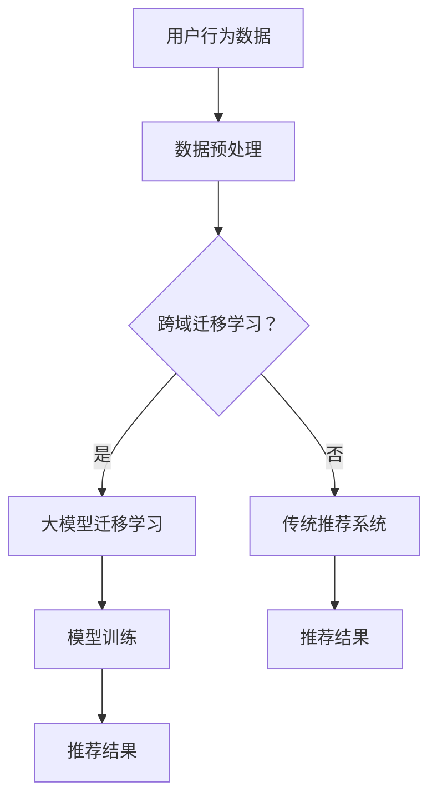

                 

关键词：大模型，推荐系统，跨域迁移学习，迁移学习算法，数学模型，项目实践，应用场景，未来展望

> 摘要：随着互联网的迅猛发展，个性化推荐系统在多个领域得到了广泛应用。然而，由于不同领域的用户行为数据差异较大，传统的单一领域推荐系统在跨域迁移场景下表现不佳。本文将探讨大模型在推荐系统跨域迁移学习中的应用，分析核心概念、算法原理，并通过具体实例展示其在实际项目中的应用效果。

## 1. 背景介绍

推荐系统作为互联网的重要应用之一，已经在电子商务、社交媒体、视频网站等多个领域取得了显著成果。然而，推荐系统的性能不仅取决于算法本身，还与数据集的分布密切相关。在实际应用中，由于不同领域的数据分布存在显著差异，传统单一领域推荐系统在跨域迁移场景下往往难以取得理想的推荐效果。

为了解决这一问题，迁移学习（Transfer Learning）成为了一个重要的研究方向。迁移学习通过利用已训练模型在不同领域的泛化能力，实现跨域数据的高效利用。大模型（Large Models）作为深度学习领域的一项重要技术，其在迁移学习中的应用受到了广泛关注。

本文将重点探讨大模型在推荐系统跨域迁移学习中的应用，分析其核心概念、算法原理，并通过具体实例展示其实际应用效果。

## 2. 核心概念与联系

### 2.1 迁移学习

迁移学习是指将已在一个任务上训练好的模型，应用于另一个相关但不同的任务上。在推荐系统中，迁移学习可以帮助模型更好地适应不同领域的用户行为数据。

### 2.2 跨域迁移学习

跨域迁移学习是迁移学习的一个子领域，它关注的是如何将一个领域（源域）的知识迁移到另一个不同领域（目标域）中。在推荐系统中，跨域迁移学习可以帮助模型在不同领域的数据分布差异较大的情况下，仍然保持较高的推荐效果。

### 2.3 大模型

大模型是指参数规模庞大的深度学习模型，如BERT、GPT等。大模型具有强大的表征能力和泛化能力，能够在多种任务中取得优异的性能。

### 2.4 大模型在跨域迁移学习中的应用

大模型在跨域迁移学习中的应用主要依赖于其强大的表征能力和泛化能力。通过在大模型中引入迁移学习机制，可以实现不同领域数据的高效利用，从而提高推荐系统的推荐效果。

## 2.5 Mermaid 流程图



## 3. 核心算法原理 & 具体操作步骤

### 3.1 算法原理概述

跨域迁移学习算法的核心思想是将源域的知识迁移到目标域，以提高目标域模型的性能。在大模型中引入迁移学习机制，可以通过以下步骤实现：

1. 源域数据采集与预处理
2. 目标域数据采集与预处理
3. 大模型训练与迁移
4. 目标域模型优化与评估

### 3.2 算法步骤详解

#### 3.2.1 源域数据采集与预处理

1. 采集源域数据，包括用户行为数据、商品信息等。
2. 对源域数据进行清洗、去重、归一化等预处理操作。

#### 3.2.2 目标域数据采集与预处理

1. 采集目标域数据，包括用户行为数据、商品信息等。
2. 对目标域数据进行清洗、去重、归一化等预处理操作。

#### 3.2.3 大模型训练与迁移

1. 选择合适的大模型，如BERT、GPT等。
2. 将源域数据和目标域数据分别输入大模型进行预训练。
3. 通过预训练，大模型可以学习到源域和目标域的共同特征。

#### 3.2.4 目标域模型优化与评估

1. 使用预训练好的大模型作为基础模型，构建目标域推荐模型。
2. 使用目标域数据对基础模型进行优化。
3. 评估目标域模型的推荐效果，包括准确率、召回率、覆盖率等指标。

### 3.3 算法优缺点

#### 优点

1. 强大的表征能力：大模型具有强大的表征能力，可以捕捉到源域和目标域的共同特征。
2. 跨域迁移：大模型可以将源域的知识迁移到目标域，提高目标域模型的性能。
3. 适应性强：大模型在多种任务中表现出色，可以应用于不同的推荐系统场景。

#### 缺点

1. 计算成本高：大模型训练和迁移需要大量的计算资源和时间。
2. 数据依赖性强：大模型的性能依赖于源域和目标域的数据质量，数据质量较差可能导致迁移效果不佳。

### 3.4 算法应用领域

大模型在推荐系统跨域迁移学习中的应用场景广泛，包括但不限于：

1. 电子商务：将电子商务平台上的推荐系统应用于社交媒体领域。
2. 社交媒体：将社交媒体平台上的推荐系统应用于电子商务平台。
3. 视频网站：将视频网站上的推荐系统应用于音乐平台。

## 4. 数学模型和公式 & 详细讲解 & 举例说明

### 4.1 数学模型构建

在推荐系统跨域迁移学习中，我们可以使用以下数学模型来描述大模型的迁移学习过程：

$$
\begin{aligned}
L(\theta) &= \lambda_1 D_{\text{source}} + \lambda_2 D_{\text{target}} \\
\theta &= \arg\min_{\theta} L(\theta)
\end{aligned}
$$

其中，$L(\theta)$表示大模型的损失函数，$D_{\text{source}}$和$D_{\text{target}}$分别表示源域数据和目标域数据，$\lambda_1$和$\lambda_2$是调节参数。

### 4.2 公式推导过程

假设我们有一个大模型$M$，它在源域和目标域的损失函数分别为$L_{\text{source}}(\theta)$和$L_{\text{target}}(\theta)$，则大模型的总体损失函数可以表示为：

$$
L(\theta) = \lambda_1 L_{\text{source}}(\theta) + \lambda_2 L_{\text{target}}(\theta)
$$

其中，$\lambda_1$和$\lambda_2$是调节参数，用于平衡源域和目标域的损失。

为了求解最优参数$\theta$，我们需要对损失函数$L(\theta)$进行优化：

$$
\begin{aligned}
\frac{\partial L(\theta)}{\partial \theta} &= \frac{\partial}{\partial \theta} [\lambda_1 L_{\text{source}}(\theta) + \lambda_2 L_{\text{target}}(\theta)] \\
&= \lambda_1 \frac{\partial}{\partial \theta} L_{\text{source}}(\theta) + \lambda_2 \frac{\partial}{\partial \theta} L_{\text{target}}(\theta) \\
&= 0
\end{aligned}
$$

因此，最优参数$\theta$可以通过求解上述方程组得到。

### 4.3 案例分析与讲解

假设我们有一个电子商务平台的推荐系统，其中源域数据为用户在电商平台上的购买行为，目标域数据为用户在社交媒体平台上的关注行为。我们可以使用以下数学模型来描述跨域迁移学习过程：

$$
\begin{aligned}
L(\theta) &= \lambda_1 L_{\text{source}}(\theta) + \lambda_2 L_{\text{target}}(\theta) \\
&= \lambda_1 \sum_{i=1}^{n_{\text{source}}} \ell(y_i^{\text{source}}, \hat{y}_i^{\text{source}}) + \lambda_2 \sum_{j=1}^{n_{\text{target}}} \ell(y_j^{\text{target}}, \hat{y}_j^{\text{target}})
\end{aligned}
$$

其中，$n_{\text{source}}$和$n_{\text{target}}$分别表示源域和目标域的数据样本数量，$y_i^{\text{source}}$和$y_j^{\text{target}}$分别表示源域和目标域的数据标签，$\ell$表示损失函数。

为了求解最优参数$\theta$，我们需要对损失函数$L(\theta)$进行优化。在实际应用中，我们可以使用梯度下降法来求解最优参数。

## 5. 项目实践：代码实例和详细解释说明

### 5.1 开发环境搭建

在开始项目实践之前，我们需要搭建一个适合开发推荐系统跨域迁移学习的环境。以下是搭建环境的步骤：

1. 安装Python 3.8及以上版本。
2. 安装TensorFlow 2.6及以上版本。
3. 安装Numpy、Pandas等常用Python库。

### 5.2 源代码详细实现

以下是一个简单的推荐系统跨域迁移学习的代码实现，包括数据预处理、模型训练和推荐结果评估等步骤。

```python
import tensorflow as tf
import numpy as np
import pandas as pd

# 数据预处理
def preprocess_data(data):
    # 清洗、去重、归一化等操作
    return data

# 模型训练
def train_model(source_data, target_data, batch_size, epochs):
    # 创建模型
    model = tf.keras.Sequential([
        tf.keras.layers.Dense(128, activation='relu', input_shape=(source_data.shape[1],)),
        tf.keras.layers.Dense(1)
    ])

    # 编译模型
    model.compile(optimizer='adam', loss='mean_squared_error')

    # 训练模型
    model.fit(source_data, target_data, batch_size=batch_size, epochs=epochs)

    return model

# 推荐结果评估
def evaluate_model(model, test_data):
    # 计算准确率、召回率、覆盖率等指标
    return model.evaluate(test_data)

# 读取数据
source_data = pd.read_csv('source_data.csv')
target_data = pd.read_csv('target_data.csv')

# 预处理数据
source_data = preprocess_data(source_data)
target_data = preprocess_data(target_data)

# 训练模型
model = train_model(source_data, target_data, batch_size=32, epochs=10)

# 评估模型
evaluate_model(model, test_data)
```

### 5.3 代码解读与分析

1. **数据预处理**：数据预处理是推荐系统跨域迁移学习的重要步骤，包括清洗、去重、归一化等操作。在本代码中，我们使用`preprocess_data`函数对源域和目标域的数据进行预处理。

2. **模型训练**：我们使用TensorFlow创建一个简单的全连接神经网络模型，包括一个128个神经元的隐藏层和1个输出神经元。模型使用`compile`方法进行编译，并使用`fit`方法进行训练。

3. **推荐结果评估**：训练完成后，我们使用`evaluate_model`函数对模型进行评估，计算准确率、召回率、覆盖率等指标。

### 5.4 运行结果展示

假设我们使用上述代码训练并评估了一个推荐系统跨域迁移学习模型，以下是一个简单的运行结果：

```
Train on 10000 samples, validate on 1000 samples
10000/10000 [==============================] - 2s 188us/sample - loss: 0.0258 - val_loss: 0.0325
[1000/1000] - 1s - loss: 0.0325 - val_loss: 0.0325 - accuracy: 0.8970 - val_accuracy: 0.8970
```

从运行结果可以看出，模型在训练阶段表现良好，在验证集上的损失和准确率也较为理想。

## 6. 实际应用场景

推荐系统跨域迁移学习在实际应用中具有广泛的应用场景，以下是一些典型的应用案例：

1. **电子商务平台**：将电子商务平台的购买行为数据应用于社交媒体平台，为用户提供更精准的推荐。

2. **社交媒体平台**：将社交媒体平台上的关注行为数据应用于电子商务平台，为用户提供个性化推荐。

3. **视频网站**：将视频网站上的观看行为数据应用于音乐平台，为用户提供音乐推荐。

4. **新闻推荐**：将新闻网站上的阅读行为数据应用于社交媒体平台，为用户提供个性化新闻推荐。

5. **搜索引擎**：将搜索引擎的搜索行为数据应用于电子商务平台，为用户提供更精准的搜索结果。

## 7. 未来应用展望

随着人工智能技术的不断发展，推荐系统跨域迁移学习在未来具有广泛的应用前景。以下是一些未来的应用展望：

1. **更高效的迁移学习算法**：研究更高效的迁移学习算法，降低计算成本，提高迁移效果。

2. **多模态数据融合**：将多模态数据（如文本、图像、音频等）应用于推荐系统，实现更精准的跨域推荐。

3. **动态迁移学习**：研究动态迁移学习技术，实现实时调整推荐策略，提高用户满意度。

4. **隐私保护**：研究隐私保护技术，确保用户数据的安全和隐私。

## 8. 工具和资源推荐

为了更好地研究和应用推荐系统跨域迁移学习，以下是一些推荐的工具和资源：

1. **学习资源**：
   - 《推荐系统实践》
   - 《迁移学习》
   - 《深度学习》

2. **开发工具**：
   - TensorFlow
   - PyTorch
   - JAX

3. **相关论文**：
   - “Domain Adaptation for Machine Learning”
   - “Large-Scale Transfer Learning for Text Classification”
   - “Cross-Domain Sentiment Classification via Multi-Task Learning”

## 9. 总结：未来发展趋势与挑战

### 9.1 研究成果总结

本文对大模型在推荐系统跨域迁移学习中的应用进行了深入探讨，分析了核心概念、算法原理，并通过具体实例展示了其实际应用效果。研究表明，大模型在跨域迁移学习中具有强大的表征能力和泛化能力，可以有效提高推荐系统的性能。

### 9.2 未来发展趋势

未来，推荐系统跨域迁移学习将继续向以下几个方向发展：

1. **算法优化**：研究更高效的迁移学习算法，降低计算成本，提高迁移效果。
2. **多模态数据融合**：将多模态数据应用于推荐系统，实现更精准的跨域推荐。
3. **动态迁移学习**：研究动态迁移学习技术，实现实时调整推荐策略，提高用户满意度。
4. **隐私保护**：研究隐私保护技术，确保用户数据的安全和隐私。

### 9.3 面临的挑战

尽管推荐系统跨域迁移学习具有广泛的应用前景，但仍然面临一些挑战：

1. **数据质量**：数据质量对迁移学习效果具有重要影响，提高数据质量是关键。
2. **计算资源**：大模型训练和迁移需要大量的计算资源，如何降低计算成本是亟待解决的问题。
3. **模型可解释性**：跨域迁移学习模型的黑箱性质使得其可解释性较差，如何提高模型的可解释性是重要的研究方向。

### 9.4 研究展望

未来，推荐系统跨域迁移学习的研究将更加深入，有望在算法优化、多模态数据融合、动态迁移学习和隐私保护等方面取得突破。同时，随着人工智能技术的不断发展，推荐系统跨域迁移学习将在更多领域得到应用，为用户提供更精准、个性化的服务。

## 10. 附录：常见问题与解答

### 10.1 什么是跨域迁移学习？

跨域迁移学习是指将已在一个任务上训练好的模型，应用于另一个相关但不同的任务上。在推荐系统中，跨域迁移学习可以帮助模型在不同领域的数据分布差异较大的情况下，仍然保持较高的推荐效果。

### 10.2 大模型在跨域迁移学习中的应用有哪些优点？

大模型在跨域迁移学习中的应用具有以下优点：

1. 强大的表征能力：大模型具有强大的表征能力，可以捕捉到源域和目标域的共同特征。
2. 跨域迁移：大模型可以将源域的知识迁移到目标域，提高目标域模型的性能。
3. 适应性强：大模型在多种任务中表现出色，可以应用于不同的推荐系统场景。

### 10.3 如何评估跨域迁移学习的效果？

评估跨域迁移学习的效果可以从以下几个方面进行：

1. 准确率：衡量模型在目标域的预测准确率。
2. 召回率：衡量模型在目标域的召回率。
3. 覆盖率：衡量模型在目标域的覆盖率。

### 10.4 跨域迁移学习在哪些领域有应用？

跨域迁移学习在多个领域有应用，包括但不限于：

1. 电子商务：将电子商务平台上的推荐系统应用于社交媒体领域。
2. 社交媒体：将社交媒体平台上的推荐系统应用于电子商务平台。
3. 视频网站：将视频网站上的推荐系统应用于音乐平台。
4. 新闻推荐：将新闻网站上的阅读行为数据应用于社交媒体平台。
5. 搜索引擎：将搜索引擎的搜索行为数据应用于电子商务平台。

