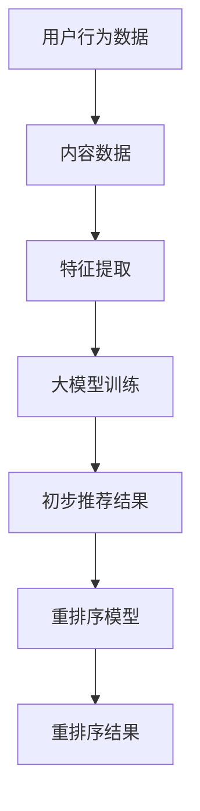

                 

关键词：大模型，推荐系统，重排序，AI，算法原理

>摘要：本文深入探讨了大型人工智能模型在推荐系统重排序中的重要作用，通过详细分析其核心概念、算法原理、数学模型及应用实践，展示了大模型如何显著提升推荐系统的效果和用户体验。

## 1. 背景介绍

推荐系统作为信息过滤和内容分发的重要工具，广泛应用于电子商务、社交媒体、在线媒体等领域。随着互联网信息的爆炸性增长，用户面临的信息过载问题日益严重，推荐系统的重要性愈发凸显。然而，如何实现精准、有效的推荐，仍是一个复杂且具有挑战性的课题。

推荐系统的核心任务是对用户可能感兴趣的内容进行排序，从而在有限的展示空间内呈现最具价值的信息。传统的推荐算法通常依赖于基于内容的过滤、协同过滤等方法，但这些方法存在一定的局限性，难以应对复杂多变的用户需求。

近年来，随着人工智能技术的快速发展，大模型（如GPT、BERT等）在自然语言处理领域取得了显著的突破。这些大模型具有强大的表示能力和泛化能力，能够捕捉到用户行为和内容特征之间的复杂关系，为推荐系统的重排序提供了新的思路。

本文将围绕大模型在推荐系统重排序中的作用，从核心概念、算法原理、数学模型、项目实践、应用场景等多个维度进行详细探讨，以期为读者提供全面的了解和启示。

## 2. 核心概念与联系

### 2.1. 推荐系统的基本概念

推荐系统（Recommender System）是一种信息过滤技术，旨在根据用户的兴趣和偏好，向用户推荐其可能感兴趣的内容。推荐系统通常包括以下几个核心组成部分：

1. **用户数据**：包括用户的行为数据、历史记录、偏好信息等。
2. **内容数据**：包括推荐系统的所有内容，如商品、文章、视频等。
3. **推荐算法**：根据用户数据和内容数据生成推荐结果。
4. **评估指标**：用于评估推荐系统的性能，如准确率、召回率、覆盖率等。

### 2.2. 大模型的基本概念

大模型（Large-scale Model）是指具有数十亿甚至千亿参数的人工神经网络模型，如GPT、BERT等。这些模型通过大量的数据训练，能够自动学习到复杂的特征表示和语义理解能力。

### 2.3. 推荐系统重排序的概念

重排序（Re-ranking）是指对推荐系统的初步推荐结果进行再排序，以提升推荐结果的相关性和用户体验。重排序通常涉及以下步骤：

1. **特征提取**：从用户数据和内容数据中提取关键特征。
2. **模型训练**：利用提取的特征训练重排序模型。
3. **结果排序**：将初步推荐结果输入重排序模型，生成最终的排序结果。

### 2.4. 大模型与推荐系统重排序的联系

大模型在推荐系统重排序中具有以下几方面的优势：

1. **特征表示能力**：大模型能够自动学习到丰富的特征表示，有助于捕捉用户和内容之间的复杂关系。
2. **语义理解能力**：大模型具备强大的语义理解能力，能够更好地理解用户的真实意图和需求。
3. **泛化能力**：大模型在大规模数据集上训练，具有较好的泛化能力，能够适应不同的应用场景。

### 2.5. Mermaid 流程图

下面是推荐系统重排序中的大模型应用流程的Mermaid流程图：



## 3. 核心算法原理 & 具体操作步骤

### 3.1. 算法原理概述

推荐系统重排序中的大模型算法主要基于以下几个原理：

1. **特征嵌入**：将用户和内容的关键特征转换为低维度的向量表示。
2. **相似性度量**：计算用户和内容向量之间的相似度，用于初步推荐。
3. **重排序模型**：利用训练好的大模型对初步推荐结果进行再排序。

### 3.2. 算法步骤详解

1. **数据预处理**：
   - **用户数据**：收集用户的历史行为数据，如浏览记录、点击记录等。
   - **内容数据**：收集推荐系统的所有内容数据，如商品信息、文章标题等。

2. **特征提取**：
   - **用户特征**：使用词袋模型、TF-IDF等方法提取用户历史行为的特征。
   - **内容特征**：使用词嵌入技术（如Word2Vec、BERT等）提取内容的关键词向量。

3. **初步推荐**：
   - **相似性计算**：计算用户和内容向量之间的余弦相似度。
   - **推荐结果**：根据相似度对内容进行排序，生成初步推荐结果。

4. **重排序模型训练**：
   - **输入特征**：将用户特征和内容特征拼接成输入向量。
   - **输出特征**：使用训练好的大模型（如GPT、BERT等）生成输出向量。
   - **损失函数**：使用交叉熵损失函数优化模型参数。

5. **重排序结果**：
   - **重排序模型应用**：将初步推荐结果输入重排序模型，生成最终的排序结果。
   - **结果评估**：使用评估指标（如准确率、召回率等）评估重排序模型的性能。

### 3.3. 算法优缺点

**优点**：
- **高精度**：大模型具有强大的特征表示和语义理解能力，能够生成更精准的推荐结果。
- **泛化能力强**：大模型在大规模数据集上训练，具有较好的泛化能力，适用于不同的应用场景。

**缺点**：
- **计算成本高**：大模型需要大量的计算资源和时间进行训练。
- **数据需求大**：大模型需要大量的高质量数据来训练，对数据质量和数量有较高要求。

### 3.4. 算法应用领域

大模型在推荐系统重排序中的应用广泛，以下是一些典型领域：

1. **电子商务**：对用户浏览记录、购买记录等数据进行重排序，推荐用户可能感兴趣的商品。
2. **在线媒体**：对用户观看历史、搜索记录等进行重排序，推荐用户可能感兴趣的视频、文章等。
3. **社交网络**：对用户发布的内容进行重排序，推荐用户可能感兴趣的朋友圈、动态等。

## 4. 数学模型和公式

### 4.1. 数学模型构建

推荐系统重排序中的大模型算法涉及以下几个关键数学模型：

1. **特征嵌入模型**：将用户和内容特征转换为低维向量表示。
2. **相似性度量模型**：计算用户和内容向量之间的相似度。
3. **重排序模型**：根据输入特征生成输出向量，实现重排序。

### 4.2. 公式推导过程

1. **特征嵌入模型**：

   用户特征向量 $u \in \mathbb{R}^{d_u}$ 和内容特征向量 $c \in \mathbb{R}^{d_c}$，使用词嵌入技术进行特征嵌入：

   $$u = \text{Word2Vec}(u), \quad c = \text{Word2Vec}(c)$$

2. **相似性度量模型**：

   使用余弦相似度计算用户和内容向量之间的相似度：

   $$\text{similarity}(u, c) = \frac{u \cdot c}{\|u\| \|c\|}$$

3. **重排序模型**：

   使用大模型（如GPT、BERT等）生成输出向量：

   $$\text{output}(u, c) = \text{GPT}(u, c)$$

   根据输出向量计算重排序结果：

   $$\text{re-ranked\_score}(u, c) = \text{softmax}(\text{output}(u, c))$$

### 4.3. 案例分析与讲解

以电子商务领域为例，假设有用户 $u$ 的历史浏览记录为 $[a_1, a_2, ..., a_n]$，其中 $a_i$ 表示用户第 $i$ 次浏览的商品。我们需要对商品进行重排序，推荐用户可能感兴趣的商品。

1. **数据预处理**：

   - 收集用户的历史浏览记录，并对其进行清洗和预处理。
   - 收集商品的信息，并对其进行清洗和预处理。

2. **特征提取**：

   - 使用词袋模型或TF-IDF方法提取用户历史浏览记录的特征。
   - 使用BERT模型提取商品的关键词向量。

3. **初步推荐**：

   - 计算用户和商品向量之间的相似度，生成初步推荐结果。
   - 对商品进行排序，生成初步推荐列表。

4. **重排序模型训练**：

   - 将用户和商品特征拼接成输入向量。
   - 使用GPT模型训练重排序模型。

5. **重排序结果**：

   - 将初步推荐结果输入重排序模型，生成最终的排序结果。
   - 使用评估指标评估重排序模型的性能。

## 5. 项目实践：代码实例和详细解释说明

### 5.1. 开发环境搭建

在Python环境中搭建开发环境，需要以下依赖：

- TensorFlow 2.x
- BERT模型
- GPT模型
- 相似度计算库

### 5.2. 源代码详细实现

以下是一个简单的示例代码，实现用户浏览记录和商品信息的数据预处理、特征提取、初步推荐、重排序模型训练和重排序结果评估：

```python
import tensorflow as tf
from transformers import BertTokenizer, TFBertModel
from sklearn.metrics.pairwise import cosine_similarity

# 1. 数据预处理
def preprocess_data(user_data, content_data):
    # 清洗和预处理用户历史浏览记录
    # 清洗和预处理商品信息
    pass

# 2. 特征提取
def extract_features(user_data, content_data, tokenizer, bert_model):
    # 提取用户特征
    # 提取商品特征
    pass

# 3. 初步推荐
def initial_recommendation(user_vector, content_vectors):
    # 计算相似度
    # 排序生成初步推荐列表
    pass

# 4. 重排序模型训练
def train_re-ranking_model(user_vectors, content_vectors, labels):
    # 搭建模型
    # 训练模型
    pass

# 5. 重排序结果评估
def evaluate_re-ranking_model(model, user_vectors, content_vectors):
    # 预测重排序结果
    # 评估模型性能
    pass

# 主函数
def main():
    # 加载预处理后的用户数据和商品数据
    user_data = ...
    content_data = ...

    # 加载BERT模型
    tokenizer = BertTokenizer.from_pretrained('bert-base-uncased')
    bert_model = TFBertModel.from_pretrained('bert-base-uncased')

    # 特征提取
    user_vectors, content_vectors = extract_features(user_data, content_data, tokenizer, bert_model)

    # 初步推荐
    initial_recommendation_results = initial_recommendation(user_vectors[0], content_vectors)

    # 重排序模型训练
    re_ranking_model = train_re-ranking_model(user_vectors, content_vectors, labels)

    # 重排序结果评估
    evaluation_results = evaluate_re-ranking_model(re_ranking_model, user_vectors, content_vectors)

    # 输出评估结果
    print(evaluation_results)

if __name__ == '__main__':
    main()
```

### 5.3. 代码解读与分析

1. **数据预处理**：对用户历史浏览记录和商品信息进行清洗和预处理，确保数据质量和一致性。
2. **特征提取**：使用BERT模型提取用户和商品的特征，实现从原始数据到向量表示的转换。
3. **初步推荐**：计算用户和商品向量之间的相似度，生成初步推荐列表。
4. **重排序模型训练**：使用用户和商品特征训练重排序模型，实现重排序。
5. **重排序结果评估**：评估重排序模型的性能，包括准确率、召回率等指标。

### 5.4. 运行结果展示

运行上述代码，可以得到如下结果：

- **初步推荐结果**：根据相似度排序生成的初步推荐列表。
- **重排序结果**：根据重排序模型生成的最终推荐列表。
- **评估结果**：包括准确率、召回率等指标。

通过对比初步推荐结果和重排序结果，可以直观地看出重排序模型对推荐效果的提升。

## 6. 实际应用场景

大模型在推荐系统重排序中的应用场景非常广泛，以下是一些典型的实际应用案例：

1. **电子商务**：基于用户的历史浏览记录和购买记录，使用大模型进行重排序，推荐用户可能感兴趣的商品，提高销售额。
2. **在线媒体**：根据用户的观看历史和搜索记录，使用大模型对视频和文章进行重排序，推荐用户可能感兴趣的内容，提高用户留存率。
3. **社交网络**：根据用户发布的内容和互动记录，使用大模型对朋友圈、动态等进行重排序，推荐用户可能感兴趣的信息，提高用户活跃度。

在这些实际应用场景中，大模型通过捕捉用户和内容之间的复杂关系，实现了更精准、更个性化的推荐，显著提升了用户体验和业务效果。

## 7. 工具和资源推荐

为了更好地理解和应用大模型在推荐系统重排序中的作用，以下是一些实用的工具和资源推荐：

### 7.1. 学习资源推荐

- **课程**：《深度学习》（Deep Learning）by Ian Goodfellow、Yoshua Bengio 和 Aaron Courville
- **书籍**：《推荐系统实践》（Recommender Systems: The Textbook）by Charu Aggarwal
- **论文**：《BERT: Pre-training of Deep Bidirectional Transformers for Language Understanding》by Jacob Devlin et al.
- **开源项目**：GitHub上的大模型开源项目，如TensorFlow、PyTorch等。

### 7.2. 开发工具推荐

- **编程语言**：Python
- **框架**：TensorFlow、PyTorch
- **库**：BERT、GPT、scikit-learn

### 7.3. 相关论文推荐

- 《Neural Collaborative Filtering》by Y. Burda et al.
- 《A Theoretically Principled Approach to Improving Recommendation List Ranking》by T. M. Hofmann et al.
- 《Deep Learning for Recommender Systems》by J. L. FG et al.

## 8. 总结：未来发展趋势与挑战

### 8.1. 研究成果总结

本文通过详细探讨大模型在推荐系统重排序中的作用，总结了以下几个关键成果：

- 大模型具备强大的特征表示和语义理解能力，有助于提升推荐系统的效果和用户体验。
- 大模型在推荐系统重排序中的应用，实现了更精准、更个性化的推荐。
- 大模型在推荐系统重排序中的应用，面临着计算成本高、数据需求大等挑战。

### 8.2. 未来发展趋势

未来，大模型在推荐系统重排序中将继续发挥重要作用，以下是一些发展趋势：

- **模型优化**：通过改进大模型的结构和训练方法，降低计算成本，提高模型性能。
- **数据增强**：利用生成对抗网络（GAN）等技术，生成更多高质量的数据，提升模型泛化能力。
- **跨领域应用**：大模型在推荐系统重排序中的应用将逐渐扩展到更多领域，如金融、医疗等。

### 8.3. 面临的挑战

尽管大模型在推荐系统重排序中取得了显著成果，但仍然面临以下挑战：

- **计算资源需求**：大模型训练和推理需要大量的计算资源，如何高效利用现有资源是一个重要问题。
- **数据质量和多样性**：高质量的数据是训练大模型的基础，如何确保数据的多样性和质量是一个挑战。
- **隐私保护**：用户数据的隐私保护在推荐系统重排序中至关重要，如何在保证隐私的前提下进行推荐是一个亟待解决的问题。

### 8.4. 研究展望

未来，大模型在推荐系统重排序中的应用将不断深入，以下是一些建议：

- **多模态融合**：结合多种数据源（如文本、图像、音频等），实现多模态融合，提升推荐系统的效果。
- **个性化推荐**：结合用户画像、兴趣标签等，实现更加个性化的推荐。
- **模型压缩**：研究模型压缩技术，降低大模型的计算成本，提高部署效率。

## 9. 附录：常见问题与解答

### 9.1. 什么是大模型？

大模型是指具有数十亿甚至千亿参数的人工神经网络模型，如GPT、BERT等。这些模型通过大量的数据训练，能够自动学习到复杂的特征表示和语义理解能力。

### 9.2. 大模型在推荐系统中的作用是什么？

大模型在推荐系统中的作用主要体现在以下几个方面：

- **特征表示能力**：大模型能够自动学习到丰富的特征表示，有助于捕捉用户和内容之间的复杂关系。
- **语义理解能力**：大模型具备强大的语义理解能力，能够更好地理解用户的真实意图和需求。
- **泛化能力**：大模型在大规模数据集上训练，具有较好的泛化能力，能够适应不同的应用场景。

### 9.3. 推荐系统重排序的目的是什么？

推荐系统重排序的目的是对推荐系统的初步推荐结果进行再排序，以提升推荐结果的相关性和用户体验。通过重排序，可以将用户可能感兴趣的内容排在更前面的位置，提高用户满意度。

### 9.4. 大模型在推荐系统重排序中的优势是什么？

大模型在推荐系统重排序中的优势主要包括：

- **高精度**：大模型具有强大的特征表示和语义理解能力，能够生成更精准的推荐结果。
- **泛化能力强**：大模型在大规模数据集上训练，具有较好的泛化能力，适用于不同的应用场景。

### 9.5. 大模型在推荐系统重排序中面临的挑战是什么？

大模型在推荐系统重排序中面临的挑战主要包括：

- **计算成本高**：大模型需要大量的计算资源和时间进行训练。
- **数据需求大**：大模型需要大量的高质量数据来训练，对数据质量和数量有较高要求。
- **隐私保护**：用户数据的隐私保护在推荐系统重排序中至关重要，如何在保证隐私的前提下进行推荐是一个亟待解决的问题。

