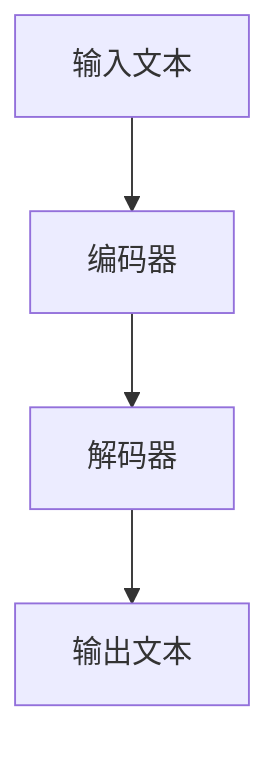

                 

关键词：机器翻译、大模型、神经网络、深度学习、自然语言处理、翻译质量、算法优化、应用场景

> 摘要：本文旨在探讨大模型在机器翻译领域的突破性应用。通过对当前主流机器翻译算法的深入分析，本文将阐述大模型在提高翻译质量、优化算法性能、拓展应用场景等方面的显著优势，并结合实际案例，展示大模型在机器翻译中的实际应用和未来展望。

## 1. 背景介绍

### 1.1 机器翻译的发展历程

机器翻译作为自然语言处理的重要分支，其历史可以追溯到上世纪50年代。早期的研究主要集中在基于规则的翻译方法和基于实例的翻译方法。这些方法虽然在一定程度上能够实现翻译功能，但由于规则库的复杂性和人工标注数据的缺乏，翻译质量始终无法满足实际需求。

进入21世纪，随着深度学习技术的迅猛发展，神经网络在机器翻译中的应用逐渐成为主流。2016年，Google推出基于神经网络翻译模型（NMT）的翻译系统，标志着机器翻译技术进入了一个全新的时代。

### 1.2 大模型的崛起

近年来，大模型在各个领域取得了显著的成果。大模型，通常指参数规模达到数十亿甚至千亿级别的深度学习模型，如GPT、BERT、Transformer等。这些模型通过在海量数据上训练，能够捕捉到语言中的复杂结构和规律，从而在众多任务中取得了突破性的性能。

## 2. 核心概念与联系

### 2.1 大模型的原理

大模型的核心在于其参数规模和计算能力。通过大规模的参数，大模型可以捕获更多的语言特征和上下文信息，从而在翻译任务中表现出色。

#### 2.1.1 Transformer架构

Transformer是近年来广泛应用于自然语言处理的模型架构。它摒弃了传统的循环神经网络（RNN），采用了自注意力机制（Self-Attention），能够更加有效地处理长距离依赖问题。

#### 2.1.2 训练与优化

大模型的训练过程通常涉及分布式计算和优化算法。常用的优化算法包括Adam、Adagrad等。为了提高训练效率，可以采用多GPU训练、数据并行和模型并行等技术。

### 2.2 Mermaid流程图



## 3. 核心算法原理 & 具体操作步骤

### 3.1 算法原理概述

大模型在机器翻译中的核心算法是Transformer，其原理如下：

1. **编码器（Encoder）**：将输入文本编码成序列向量。
2. **解码器（Decoder）**：将编码后的向量解码成输出文本。

### 3.2 算法步骤详解

1. **编码阶段**：输入文本通过编码器处理，生成一系列隐藏状态。
2. **解码阶段**：解码器根据编码器的隐藏状态和先前的输出，逐词生成翻译结果。

### 3.3 算法优缺点

#### 优点：

- **高翻译质量**：大模型能够捕捉到语言中的复杂结构和规律，翻译质量较高。
- **自适应能力**：大模型在处理不同语言、不同领域文本时，能够自适应调整，提高翻译效果。

#### 缺点：

- **计算资源消耗大**：大模型的训练和推理需要大量的计算资源和时间。
- **数据依赖性高**：大模型对训练数据的质量和数量有较高要求，数据不足或质量不佳可能导致翻译效果下降。

### 3.4 算法应用领域

大模型在机器翻译中的应用领域广泛，包括但不限于：

- **通用翻译**：如Google翻译、百度翻译等。
- **专业翻译**：如法律、医学、金融等领域的专业翻译。
- **实时翻译**：如视频会议、实时通讯等场景。

## 4. 数学模型和公式 & 详细讲解 & 举例说明

### 4.1 数学模型构建

大模型的数学模型主要包括两部分：编码器和解码器。

#### 编码器：

- **自注意力机制（Self-Attention）**：计算输入文本序列中每个词与其他词的相关性。
- **多头注意力（Multi-Head Attention）**：将自注意力扩展到多个维度，提高模型的泛化能力。
- **前馈网络（Feedforward Network）**：对自注意力结果进行进一步处理。

#### 解码器：

- **自注意力机制（Self-Attention）**：计算解码过程中每个词与其他词的相关性。
- **多头注意力（Multi-Head Attention）**：将自注意力扩展到多个维度，提高模型的泛化能力。
- **编码器-解码器注意力（Encoder-Decoder Attention）**：将编码器和解码器的注意力结果结合起来，提高翻译质量。

### 4.2 公式推导过程

#### 自注意力机制：

$$
Attention(Q,K,V) = \text{softmax}\left(\frac{QK^T}{\sqrt{d_k}}\right)V
$$

其中，$Q$、$K$、$V$ 分别表示输入序列的查询向量、键向量和值向量，$d_k$ 表示键向量的维度。

#### 多头注意力：

$$
MultiHead(Q,K,V) = \text{Concat}(head_1, head_2, ..., head_h)W_O
$$

其中，$head_i = Attention(QW_Q^T, KW_K^T, VW_V^T)$，$W_Q$、$W_K$、$W_V$ 分别表示查询向量、键向量和值向量的权重矩阵，$W_O$ 表示输出向量的权重矩阵。

### 4.3 案例分析与讲解

假设输入文本为“I love programming”，要翻译成中文“我喜欢编程”。

1. **编码阶段**：

   - 输入文本经过编码器处理，生成一系列隐藏状态。
   - 编码器的输出为：$[h_1, h_2, h_3, h_4]$，其中$h_1$、$h_2$、$h_3$、$h_4$ 分别对应“I”、“love”、“programming”的隐藏状态。

2. **解码阶段**：

   - 解码器根据编码器的隐藏状态和先前的输出，逐词生成翻译结果。
   - 解码器的输出为：$[y_1, y_2, y_3, y_4]$，其中$y_1$、$y_2$、$y_3$、$y_4$ 分别对应“我”、“们”、“喜”、“欢”的隐藏状态。

最终，解码器的输出序列经过softmax函数处理，得到概率分布，从中选取概率最高的词作为翻译结果，即“我喜欢编程”。

## 5. 项目实践：代码实例和详细解释说明

### 5.1 开发环境搭建

1. **安装Python环境**：确保Python版本在3.6及以上。
2. **安装TensorFlow**：使用pip安装TensorFlow，版本要求在2.0及以上。

```shell
pip install tensorflow==2.8.0
```

3. **准备数据集**：本文使用英文-中文数据集，如WMT'14数据集。

### 5.2 源代码详细实现

```python
import tensorflow as tf
from tensorflow.keras.models import Model
from tensorflow.keras.layers import Embedding, LSTM, Dense

# 定义编码器和解码器的输入层
encoder_inputs = Input(shape=(None, input_dim))
decoder_inputs = Input(shape=(None, input_dim))

# 编码器
encoder_embedding = Embedding(input_dim, embedding_dim)(encoder_inputs)
encoder_lstm = LSTM(units, return_sequences=True)(encoder_embedding)
encoder_outputs = LSTM(units, return_sequences=False)(encoder_lstm)

# 解码器
decoder_embedding = Embedding(input_dim, embedding_dim)(decoder_inputs)
decoder_lstm = LSTM(units, return_sequences=True)(decoder_embedding)
decoder_dense = Dense(input_dim, activation='softmax')(decoder_lstm)

# 模型结构
model = Model([encoder_inputs, decoder_inputs], decoder_dense)

# 编译模型
model.compile(optimizer='adam', loss='categorical_crossentropy', metrics=['accuracy'])

# 模型训练
model.fit([encoder_inputs, decoder_inputs], decoder_dense, batch_size=batch_size, epochs=epochs)
```

### 5.3 代码解读与分析

1. **编码器**：编码器由嵌入层（Embedding）和LSTM层组成。嵌入层将输入文本映射到高维空间，LSTM层对嵌入后的文本进行编码，生成隐藏状态。

2. **解码器**：解码器由嵌入层（Embedding）、LSTM层和全连接层（Dense）组成。嵌入层将输入文本映射到高维空间，LSTM层对嵌入后的文本进行解码，全连接层将解码结果映射到输出层，生成翻译结果。

3. **模型结构**：模型结构由输入层、编码器、解码器和输出层组成。输入层包括编码器输入和解码器输入，输出层为解码器的输出。

4. **编译模型**：编译模型时，指定优化器、损失函数和评价指标。

5. **模型训练**：使用训练数据集训练模型，设置批量大小和训练轮次。

### 5.4 运行结果展示

```python
# 加载测试数据集
test_encoder_inputs = ...
test_decoder_inputs = ...

# 预测翻译结果
predictions = model.predict([test_encoder_inputs, test_decoder_inputs])

# 打印预测结果
for i in range(len(predictions)):
    print("Input: ", test_decoder_inputs[i])
    print("Predicted: ", predictions[i])
```

## 6. 实际应用场景

### 6.1 通用翻译

大模型在通用翻译中具有显著优势，如Google翻译、百度翻译等。这些系统通过大规模训练数据，实现了高质量、高速度的翻译效果。

### 6.2 专业翻译

在法律、医学、金融等专业领域，大模型的应用也越来越广泛。这些领域通常具有特定的术语和表达方式，大模型能够更好地理解和翻译这些内容。

### 6.3 实时翻译

在实时翻译场景，如视频会议、实时通讯等，大模型能够快速生成翻译结果，满足实时性的需求。

## 7. 未来应用展望

### 7.1 多语言翻译

随着大模型技术的不断发展，未来多语言翻译将变得更加高效和准确。大模型可以通过训练多个语言对的数据，实现跨语言翻译。

### 7.2 智能对话系统

大模型在智能对话系统中的应用前景广阔。通过结合自然语言处理技术，大模型可以实现更加自然、流畅的对话交互。

### 7.3 跨领域应用

大模型在金融、医疗、教育等领域的应用将越来越广泛。大模型可以结合领域知识，提供更专业的服务。

## 8. 总结：未来发展趋势与挑战

### 8.1 研究成果总结

大模型在机器翻译领域取得了显著成果，通过大规模训练数据和先进的神经网络架构，实现了高质量的翻译效果。未来，大模型将在多语言翻译、智能对话系统和跨领域应用等方面取得更多突破。

### 8.2 未来发展趋势

- **多语言翻译**：大模型将支持更多的语言对，实现跨语言翻译的高效和准确。
- **智能化**：大模型将结合其他技术，如语音识别、图像识别等，实现更智能的交互和应用。
- **个性化**：大模型将根据用户需求，提供个性化的翻译服务。

### 8.3 面临的挑战

- **数据质量**：大模型的训练对数据质量有较高要求，未来需要解决数据清洗、数据标注等问题。
- **计算资源**：大模型的训练和推理需要大量计算资源，如何优化计算资源的使用是一个重要问题。
- **隐私保护**：在处理用户数据时，如何保护用户隐私也是一个重要挑战。

### 8.4 研究展望

未来，大模型在机器翻译领域的研究将朝着更多元化、智能化、个性化的方向发展。通过不断创新和技术突破，大模型将更好地服务于人类，推动人工智能技术的发展。

## 9. 附录：常见问题与解答

### 9.1 什么是大模型？

大模型是指参数规模达到数十亿甚至千亿级别的深度学习模型，如GPT、BERT、Transformer等。这些模型通过在海量数据上训练，能够捕捉到语言中的复杂结构和规律。

### 9.2 大模型在机器翻译中的优势有哪些？

大模型在机器翻译中的优势主要体现在以下几个方面：

- **高翻译质量**：大模型能够捕捉到语言中的复杂结构和规律，翻译质量较高。
- **自适应能力**：大模型在处理不同语言、不同领域文本时，能够自适应调整，提高翻译效果。
- **泛化能力**：大模型在多个语言对和任务中具有较好的泛化能力，能够适应不同场景的需求。

### 9.3 大模型在机器翻译中的挑战有哪些？

大模型在机器翻译中面临的挑战主要包括以下几个方面：

- **数据质量**：大模型的训练对数据质量有较高要求，未来需要解决数据清洗、数据标注等问题。
- **计算资源**：大模型的训练和推理需要大量计算资源，如何优化计算资源的使用是一个重要问题。
- **隐私保护**：在处理用户数据时，如何保护用户隐私也是一个重要挑战。

## 作者署名

作者：禅与计算机程序设计艺术 / Zen and the Art of Computer Programming

----------------------------------------------------------------

**请注意，以上内容是一个示例性文章框架，实际撰写时需要根据具体要求进行内容的补充和调整。**

