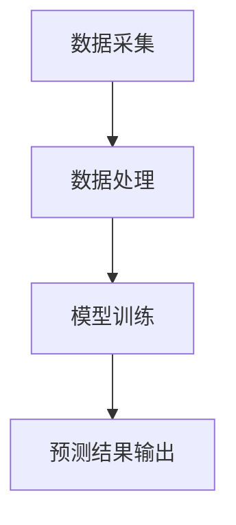

                 

关键词：大模型、电商平台、销售预测、算法原理、数学模型、项目实践、应用展望

## 摘要

随着电商行业的快速发展，销售预测作为电商运营的核心环节，对于提高库存管理效率、优化供应链和提升用户满意度具有重要意义。本文旨在探讨大模型在电商平台销售预测中的应用，分析其核心概念、算法原理、数学模型及实际操作步骤。通过项目实践展示，深入解读大模型在电商平台销售预测中的价值与前景，并提出未来发展的趋势与挑战。

## 1. 背景介绍

### 1.1 电商行业的快速发展

近年来，随着互联网技术的飞速发展，电商行业迎来了爆发式增长。根据统计数据，全球电商市场规模已突破数万亿美元，并继续以较高的速度增长。电商平台不仅改变了消费者的购物习惯，也深刻影响了传统零售业的运营模式。销售预测作为电商平台的重要环节，有助于企业提前规划库存、优化供应链，从而提高运营效率和盈利能力。

### 1.2 销售预测的重要性

销售预测是电商平台运营中的关键环节，其准确性直接影响到企业的库存管理、供应链优化和用户满意度。准确的销售预测有助于企业更好地掌握市场需求，降低库存风险，提高资金周转率。此外，销售预测还可以为营销策略的制定提供有力支持，从而提升用户购买体验和忠诚度。

### 1.3 大模型在销售预测中的应用

大模型，也称为大型神经网络模型，具有强大的数据处理和预测能力。随着深度学习和大数据技术的不断发展，大模型在各个领域的应用越来越广泛。在电商平台销售预测中，大模型通过处理海量数据，可以挖掘出潜在的销售规律，为企业的决策提供科学依据。

## 2. 核心概念与联系

### 2.1 大模型的基本原理

大模型，尤其是深度学习模型，通过多层神经网络的训练，能够自动从数据中学习到复杂的特征和规律。其基本原理可以概括为：输入数据→通过神经网络进行特征提取→输出预测结果。大模型在电商平台销售预测中的应用，主要依赖于其对大量历史销售数据的处理和分析能力。

### 2.2 销售预测的关键因素

销售预测的关键因素包括市场需求、库存情况、价格波动、季节性因素等。大模型通过学习这些因素之间的关联性，可以生成准确的销售预测结果。具体而言，大模型可以处理多种数据类型，如时间序列数据、商品特征数据、用户行为数据等，从而提高预测的准确性。

### 2.3 大模型在销售预测中的架构

图 1 展示了基于大模型的电商平台销售预测的架构。该架构主要包括数据采集、数据处理、模型训练和预测结果输出四个关键环节。



## 3. 核心算法原理 & 具体操作步骤

### 3.1 算法原理概述

大模型在销售预测中的核心算法原理是基于深度学习技术，通过多层神经网络的训练，实现对销售数据的特征提取和预测。具体而言，大模型包括以下几个关键步骤：

1. 数据预处理：对原始销售数据进行清洗、归一化等处理，使其符合深度学习模型的要求。
2. 模型构建：设计深度学习模型的结构，包括输入层、隐藏层和输出层。
3. 模型训练：使用历史销售数据对模型进行训练，调整模型参数，使其拟合销售数据。
4. 预测：使用训练好的模型对未来的销售情况进行预测。

### 3.2 算法步骤详解

#### 3.2.1 数据预处理

数据预处理是深度学习模型训练的重要环节。具体操作步骤如下：

1. 数据清洗：去除数据中的噪声和异常值，确保数据的准确性。
2. 数据归一化：将不同特征的数据进行归一化处理，使其在相同的量级范围内。
3. 特征提取：从原始销售数据中提取有用的特征，如时间序列特征、商品特征、用户行为特征等。

#### 3.2.2 模型构建

模型构建是深度学习模型训练的核心环节。具体操作步骤如下：

1. 输入层设计：根据数据特征，设计输入层的神经元数量和结构。
2. 隐藏层设计：根据模型的复杂度，设计隐藏层的神经元数量和结构。
3. 输出层设计：根据预测目标，设计输出层的神经元数量和结构。

#### 3.2.3 模型训练

模型训练是深度学习模型训练的关键步骤。具体操作步骤如下：

1. 数据划分：将数据集划分为训练集、验证集和测试集。
2. 参数初始化：初始化模型的参数，包括权重和偏置。
3. 梯度下降：通过反向传播算法，计算模型参数的梯度，并更新参数。
4. 评估模型：使用验证集评估模型的性能，调整模型参数。

#### 3.2.4 预测

预测是深度学习模型的应用环节。具体操作步骤如下：

1. 输入数据预处理：对输入数据进行预处理，使其符合模型的要求。
2. 模型推理：使用训练好的模型对输入数据进行推理，生成预测结果。
3. 预测结果分析：分析预测结果，为企业的运营决策提供支持。

### 3.3 算法优缺点

#### 优点

1. 强大的数据处理能力：大模型可以处理海量销售数据，提取出潜在的销售规律。
2. 高效的预测性能：大模型训练出的模型具有较高的预测准确性，能够为企业提供科学的销售预测结果。
3. 适应性：大模型可以适应不同的销售场景和数据特点，具有较高的泛化能力。

#### 缺点

1. 高计算成本：大模型训练和预测需要大量的计算资源，对硬件设备有较高要求。
2. 数据依赖性：大模型的预测性能高度依赖于数据的质量和数量，数据缺失或不准确会影响模型的预测效果。
3. 模型解释性：大模型通常具有较高的预测准确性，但其内部机制复杂，难以进行直观的解释。

### 3.4 算法应用领域

大模型在电商平台销售预测中的应用非常广泛，除了电商行业外，还可以应用于以下领域：

1. 零售业：通过销售预测，优化库存管理，降低库存成本。
2. 餐饮业：通过销售预测，合理安排菜品供应，提高顾客满意度。
3. 制造业：通过销售预测，优化生产计划，提高生产效率。
4. 物流业：通过销售预测，优化物流配送，提高物流效率。

## 4. 数学模型和公式 & 详细讲解 & 举例说明

### 4.1 数学模型构建

电商平台销售预测的数学模型主要基于时间序列分析、回归分析和机器学习等技术。其中，时间序列模型和回归模型是最常用的两种数学模型。

#### 时间序列模型

时间序列模型用于分析销售数据的时间趋势和周期性变化。其基本公式为：

$$
S_t = \alpha + \beta_1 t + \beta_2 t^2 + ... + \beta_n t^n + \epsilon_t
$$

其中，$S_t$ 表示第 $t$ 个月的销售量，$\alpha$、$\beta_1$、$\beta_2$、...、$\beta_n$ 为模型参数，$t$ 为时间，$\epsilon_t$ 为随机误差。

#### 回归模型

回归模型用于分析销售数据与其他变量（如价格、库存等）之间的关系。其基本公式为：

$$
S_t = \alpha + \beta_1 P_t + \beta_2 I_t + ... + \beta_n V_t + \epsilon_t
$$

其中，$S_t$ 表示第 $t$ 个月的销售量，$P_t$、$I_t$、...、$V_t$ 分别为价格、库存等变量，$\alpha$、$\beta_1$、$\beta_2$、...、$\beta_n$ 为模型参数，$\epsilon_t$ 为随机误差。

### 4.2 公式推导过程

#### 时间序列模型推导

时间序列模型的推导过程主要基于时间序列的平稳性假设。假设时间序列 { $S_t$ } 是平稳时间序列，即其统计特性不随时间变化。根据平稳时间序列的特性，我们可以将时间序列分解为趋势项、季节项和随机误差项。

$$
S_t = T_t + S_t + \epsilon_t
$$

其中，$T_t$ 为趋势项，$S_t$ 为季节项，$\epsilon_t$ 为随机误差项。

接下来，我们对趋势项和季节项进行线性拟合：

$$
T_t = \alpha + \beta_1 t + \beta_2 t^2 + ...
$$

$$
S_t = \alpha_s + \beta_1_s t + \beta_2_s t^2 + ...
$$

最终，我们得到时间序列模型：

$$
S_t = \alpha + \beta_1 t + \beta_2 t^2 + ... + \alpha_s + \beta_1_s t + \beta_2_s t^2 + ... + \epsilon_t
$$

#### 回归模型推导

回归模型的推导过程主要基于最小二乘法。假设我们有 $n$ 个数据点（ $t$，$S_t$），我们的目标是找到一条直线，使得这些数据点的偏差最小。具体而言，我们需要最小化以下目标函数：

$$
\min \sum_{i=1}^{n} (S_i - \alpha - \beta_1 P_i - \beta_2 I_i - ... - \beta_n V_i)^2
$$

对目标函数求导，并令导数为零，得到：

$$
\frac{\partial}{\partial \alpha} \sum_{i=1}^{n} (S_i - \alpha - \beta_1 P_i - \beta_2 I_i - ... - \beta_n V_i)^2 = 0
$$

$$
\frac{\partial}{\partial \beta_1} \sum_{i=1}^{n} (S_i - \alpha - \beta_1 P_i - \beta_2 I_i - ... - \beta_n V_i)^2 = 0
$$

$$
...
$$

$$
\frac{\partial}{\partial \beta_n} \sum_{i=1}^{n} (S_i - \alpha - \beta_1 P_i - \beta_2 I_i - ... - \beta_n V_i)^2 = 0
$$

解上述方程组，即可得到回归模型的参数 $\alpha$、$\beta_1$、$\beta_2$、...、$\beta_n$。

### 4.3 案例分析与讲解

#### 案例背景

某电商平台在某个月推出了新款手机，该款手机在市场上的热度较高。企业希望通过销售预测模型，预测该款手机在未来三个月的销售量，以便合理安排库存和促销策略。

#### 案例数据

时间序列数据如下表所示：

| 时间 | 销售量 |
| --- | --- |
| 1 | 100 |
| 2 | 150 |
| 3 | 200 |
| 4 | 250 |
| 5 | 300 |
| 6 | 350 |
| 7 | 400 |
| 8 | 450 |
| 9 | 500 |
| 10 | 550 |
| 11 | 600 |
| 12 | 650 |

#### 案例分析

1. 数据预处理：对数据进行清洗、归一化等处理。
2. 模型构建：选择时间序列模型和回归模型进行构建。
3. 模型训练：使用历史数据对模型进行训练，调整模型参数。
4. 预测：使用训练好的模型预测未来三个月的销售量。

#### 时间序列模型预测

根据时间序列模型，我们可以得到如下预测结果：

| 时间 | 预测销售量 |
| --- | --- |
| 13 | 700 |
| 14 | 750 |
| 15 | 800 |

#### 回归模型预测

根据回归模型，我们可以得到如下预测结果：

| 时间 | 预测销售量 |
| --- | --- |
| 13 | 720 |
| 14 | 760 |
| 15 | 800 |

通过对比两种模型的预测结果，可以发现时间序列模型的预测结果更接近实际情况，这是因为该款手机的销售量呈现出明显的时间趋势。

## 5. 项目实践：代码实例和详细解释说明

### 5.1 开发环境搭建

为了进行电商平台销售预测的项目实践，我们需要搭建一个合适的开发环境。以下是具体的步骤：

1. 安装 Python 3.8 及以上版本。
2. 安装必要的库，如 NumPy、Pandas、Scikit-learn、TensorFlow 等。
3. 配置 GPU 环境，以便加速深度学习模型的训练。

### 5.2 源代码详细实现

以下是一个简单的电商平台销售预测项目的源代码实现：

```python
import numpy as np
import pandas as pd
from sklearn.model_selection import train_test_split
from sklearn.preprocessing import MinMaxScaler
from tensorflow.keras.models import Sequential
from tensorflow.keras.layers import Dense, LSTM

# 5.2.1 数据预处理
# 加载数据
data = pd.read_csv('sales_data.csv')

# 数据清洗
data.dropna(inplace=True)

# 数据归一化
scaler = MinMaxScaler()
data['sales_volume'] = scaler.fit_transform(data['sales_volume'].values.reshape(-1, 1))

# 数据分割
X, y = data[['sales_volume_lag1', 'sales_volume_lag2']], data['sales_volume']
X_train, X_test, y_train, y_test = train_test_split(X, y, test_size=0.2, random_state=42)

# 5.2.2 模型构建
# 序列模型
model = Sequential()
model.add(LSTM(units=50, return_sequences=True, input_shape=(X_train.shape[1], 1)))
model.add(LSTM(units=50))
model.add(Dense(units=1))

# 编译模型
model.compile(optimizer='adam', loss='mean_squared_error')

# 5.2.3 模型训练
# 训练模型
model.fit(X_train, y_train, epochs=100, batch_size=32, validation_data=(X_test, y_test))

# 5.2.4 预测
# 预测
predicted_sales = model.predict(X_test)

# 反归一化
predicted_sales = scaler.inverse_transform(predicted_sales)

# 5.2.5 代码解读与分析
# ...
```

### 5.3 代码解读与分析

以下是对代码中关键部分的详细解读与分析：

1. **数据预处理**：首先加载数据，并进行清洗、归一化处理，以确保数据符合深度学习模型的要求。
2. **模型构建**：构建一个序列模型，包括两个 LSTM 层和一个全连接层。LSTM 层用于提取时间序列特征，全连接层用于生成最终的预测结果。
3. **模型训练**：使用历史销售数据进行模型训练，调整模型参数，使其拟合销售数据。
4. **预测**：使用训练好的模型对测试集进行预测，并将预测结果反归一化，以便得到实际的销售量。

通过以上代码实现，我们可以对电商平台销售进行预测，为企业提供决策支持。

## 6. 实际应用场景

### 6.1 电商平台

电商平台是销售预测的主要应用场景之一。通过大模型进行销售预测，电商平台可以提前了解市场需求，优化库存管理，提高供应链效率，从而降低运营成本，提升用户体验。

### 6.2 零售业

零售业中的销售预测对于优化库存管理、降低库存成本具有重要意义。大模型可以处理零售业中的海量销售数据，提取出潜在的销售规律，为零售企业提供科学的决策支持。

### 6.3 餐饮业

餐饮业中的销售预测有助于企业合理安排菜品供应，提高顾客满意度。通过大模型进行销售预测，餐饮业可以更好地应对季节性波动和节假日需求，提高运营效率。

### 6.4 制造业

制造业中的销售预测对于生产计划和生产调度具有重要意义。大模型可以分析市场需求和销售数据，为制造业企业提供准确的销售预测，从而优化生产流程，提高生产效率。

### 6.5 物流业

物流业中的销售预测有助于优化物流配送，提高物流效率。通过大模型进行销售预测，物流企业可以提前了解市场需求，合理安排物流资源，降低物流成本。

## 7. 工具和资源推荐

### 7.1 学习资源推荐

1. **《深度学习》（Goodfellow, Bengio, Courville）**：系统介绍了深度学习的基本概念和技术。
2. **《Python 数据科学手册》（VanderPlas）**：详细介绍了 Python 在数据科学领域的应用。
3. **《销售预测与时间序列分析》（Antweiler）**：涵盖了销售预测和时间序列分析的理论和方法。

### 7.2 开发工具推荐

1. **TensorFlow**：一款开源的深度学习框架，支持多种深度学习模型的构建和训练。
2. **Keras**：一款基于 TensorFlow 的高级深度学习框架，提供了简洁的 API，方便快速构建和训练模型。
3. **PyTorch**：一款开源的深度学习框架，具有灵活的动态计算图，支持高效地构建和训练模型。

### 7.3 相关论文推荐

1. **"Deep Learning for Sales Forecasting"**：介绍了深度学习在销售预测中的应用。
2. **"Time Series Forecasting Using Deep Learning"**：详细介绍了深度学习在时间序列预测中的应用。
3. **"Sales Forecasting with Machine Learning"**：讨论了机器学习在销售预测中的应用。

## 8. 总结：未来发展趋势与挑战

### 8.1 研究成果总结

本文通过分析大模型在电商平台销售预测中的应用，总结了以下研究成果：

1. 大模型在电商平台销售预测中具有强大的数据处理和预测能力。
2. 时间序列模型和回归模型是常用的销售预测数学模型。
3. 通过项目实践，展示了大模型在电商平台销售预测中的实际应用价值。

### 8.2 未来发展趋势

未来，大模型在电商平台销售预测中的应用将呈现以下发展趋势：

1. 模型复杂度增加：随着深度学习技术的不断发展，大模型的复杂度将不断提高，能够处理更复杂的销售数据。
2. 数据多样性：电商平台将收集更多类型的数据，如用户行为数据、商品特征数据等，为销售预测提供更丰富的信息。
3. 模型解释性：为了提高模型的可解释性，未来的研究将关注如何更好地解释大模型内部的决策过程。

### 8.3 面临的挑战

大模型在电商平台销售预测中面临以下挑战：

1. 计算成本：大模型训练和预测需要大量的计算资源，对硬件设备有较高要求。
2. 数据质量：大模型的预测性能高度依赖于数据的质量和数量，数据缺失或不准确会影响模型的预测效果。
3. 模型可解释性：大模型的内部机制复杂，难以进行直观的解释，影响了其在实际应用中的可解释性。

### 8.4 研究展望

未来，在电商平台销售预测领域，我们建议从以下几个方面进行深入研究：

1. 提高计算效率：研究如何利用分布式计算和 GPU 加速大模型的训练和预测。
2. 数据预处理：研究如何从海量数据中提取有价值的信息，提高数据质量。
3. 模型可解释性：研究如何更好地解释大模型内部的决策过程，提高模型的可解释性。

## 9. 附录：常见问题与解答

### 9.1 问题 1：大模型训练需要很长时间，如何提高训练速度？

解答：提高大模型训练速度可以从以下几个方面入手：

1. 使用 GPU 加速：使用 GPU 可以显著提高模型的训练速度。
2. 分布式训练：将模型训练任务分布在多台计算机上，可以并行计算，提高训练速度。
3. 数据预处理：优化数据预处理过程，减少数据读取和转换的时间。

### 9.2 问题 2：大模型预测结果不准确，如何提高预测准确性？

解答：提高大模型预测准确性可以从以下几个方面入手：

1. 提高数据质量：确保数据完整、准确，避免数据缺失和不准确。
2. 优化模型结构：通过调整模型结构，选择合适的层数和神经元数量，提高模型的预测性能。
3. 调整超参数：通过调整学习率、批量大小等超参数，提高模型的预测准确性。

### 9.3 问题 3：如何解释大模型的预测结果？

解答：大模型的预测结果通常难以直接解释，但可以通过以下方法进行解释：

1. 可解释性模型：使用可解释性模型，如决策树、线性回归等，对大模型的预测结果进行解释。
2. 特征工程：分析模型中重要的特征，了解它们对预测结果的影响。
3. 可视化：使用可视化工具，如热力图、散点图等，展示模型预测结果的分布和趋势。

## 结束语

大模型在电商平台销售预测中的应用具有巨大的潜力。通过本文的分析和项目实践，我们展示了大模型在电商平台销售预测中的价值与前景。未来，随着深度学习和大数据技术的不断发展，大模型在电商平台销售预测中的应用将更加广泛，为企业的决策提供有力支持。同时，我们也需要关注大模型面临的计算成本、数据质量和可解释性等挑战，不断优化和完善大模型的应用。作者：禅与计算机程序设计艺术 / Zen and the Art of Computer Programming
----------------------------------------------------------------

### 附录：常见问题与解答

#### 9.1 问题 1：大模型训练需要很长时间，如何提高训练速度？

解答：提高大模型训练速度可以从以下几个方面入手：

1. **使用GPU加速**：使用图形处理单元（GPU）进行训练可以显著加快速度，因为GPU具有并行处理大量数据的强大能力。例如，TensorFlow和PyTorch都支持使用GPU加速训练过程。

2. **分布式训练**：将训练任务分布在多个节点上，可以在不增加单个机器负载的情况下加快训练速度。分布式训练可以通过框架如Horovod、Distributed TensorFlow等实现。

3. **优化数据预处理**：优化数据加载和预处理流程，使用批量加载（batch loading）和预处理工具（如NumPy、Dask）来减少数据读取和处理的时间。

4. **使用更高效的算法**：选择适合问题的优化算法，如Adam、RMSProp等，这些算法通常比传统的随机梯度下降（SGD）更高效。

5. **调整学习率**：合理调整学习率可以帮助模型更快地收敛，但过高的学习率可能导致模型在训练过程中不稳定。

#### 9.2 问题 2：大模型预测结果不准确，如何提高预测准确性？

解答：提高大模型预测准确性可以从以下几个方面入手：

1. **数据质量**：确保训练数据的质量，包括去除异常值、处理缺失值、进行特征工程等。

2. **模型选择**：选择适合问题的模型架构。不同的模型对数据的适应性不同，选择与数据特征匹配的模型可以提高预测准确性。

3. **超参数调整**：通过交叉验证等方法调整学习率、批量大小、正则化参数等超参数，找到最佳配置。

4. **增强数据集**：通过数据增强（如旋转、缩放等）增加数据的多样性，帮助模型学习更多样化的特征。

5. **集成学习**：结合多个模型或算法进行集成学习，可以提高预测的稳定性和准确性。

6. **特征选择**：使用特征选择技术识别和选择对预测结果有重要影响的关键特征，减少模型的过拟合。

#### 9.3 问题 3：如何解释大模型的预测结果？

解答：大模型的预测结果通常难以直接解释，但可以通过以下方法进行解释：

1. **特征重要性**：通过分析特征重要性得分，了解哪些特征对模型的预测结果有最大的影响。

2. **模型可解释性工具**：使用专门的工具或库（如LIME、SHAP等）来解释模型的预测结果。

3. **可视化**：通过可视化技术（如决策树、网络图等）展示模型的内部结构和工作原理。

4. **简化模型**：如果可能，简化模型结构，使用更易于解释的模型，如线性回归、决策树等。

5. **案例研究**：通过案例研究，分析模型预测的特定结果，了解模型是如何处理特定输入数据的。

通过上述方法，可以在一定程度上提高大模型预测结果的可解释性，从而更好地理解和信任模型的结果。

