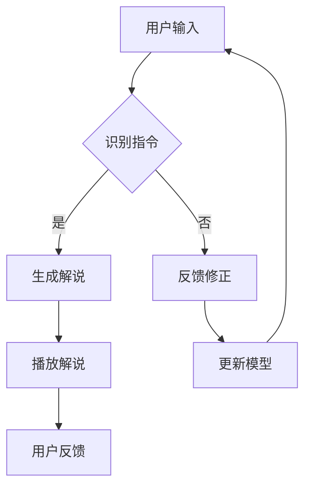

                 

关键词：大模型、虚拟导游、应用前景、人工智能、旅游体验、个性化推荐

摘要：本文探讨了大型语言模型在虚拟导游领域的应用前景。通过对大模型的基本原理和现有技术进行分析，本文提出了大模型在虚拟导游中的潜在优势和应用场景，并展望了其未来的发展趋势和面临的挑战。

## 1. 背景介绍

随着人工智能技术的快速发展，虚拟现实（VR）和增强现实（AR）逐渐成为现代旅游业的重要创新力量。虚拟导游作为一种新兴的旅游体验形式，旨在通过数字化手段模拟真实的旅游场景，为用户提供更加个性化和沉浸式的游览体验。然而，当前虚拟导游系统在内容生成、个性化推荐和用户体验等方面仍存在诸多不足。

大模型，特别是大型语言模型，如GPT-3、BERT等，在自然语言处理领域取得了显著的突破。这些模型具有强大的文本生成和语义理解能力，能够为虚拟导游系统提供更加丰富和多样化的内容。因此，研究大模型在虚拟导游开发中的应用前景具有重要的理论和实践意义。

## 2. 核心概念与联系

### 2.1 大模型的基本原理

大模型是指拥有数十亿甚至数万亿参数的深度学习模型，其通过训练海量数据来学习语言的统计规律和语义信息。大模型的核心技术包括：

- **Transformer架构**：大模型通常采用Transformer架构，通过自注意力机制（Self-Attention）对输入文本进行加权，从而捕捉文本中的长距离依赖关系。
- **预训练与微调**：大模型首先在大量无标签数据上进行预训练，然后利用有标签的特定任务数据对其进行微调，从而适应特定的应用场景。

### 2.2 虚拟导游的架构

虚拟导游系统通常包括以下几个关键组成部分：

- **场景模拟**：通过3D建模和渲染技术构建虚拟旅游场景，包括建筑、地形、植被等。
- **语音合成与识别**：利用语音合成技术生成自然流畅的语音解说，并通过语音识别技术识别用户的语音指令。
- **自然语言处理**：利用大模型进行自然语言理解和生成，实现与用户的交互和内容生成。

### 2.3 Mermaid 流程图



## 3. 核心算法原理 & 具体操作步骤

### 3.1 算法原理概述

大模型在虚拟导游中的核心算法是基于Transformer架构的预训练语言模型，如BERT、GPT等。这些模型通过预训练学习到大量文本数据的语义信息，然后通过微调适应虚拟导游的特定任务。

### 3.2 算法步骤详解

1. **预训练**：在大规模语料库上训练Transformer模型，使其学会语言的统计规律和语义信息。
2. **微调**：在虚拟导游的特定任务数据上对预训练模型进行微调，使其适应具体的应用场景。
3. **交互式生成**：接收用户的输入，利用微调后的模型生成个性化的解说内容。
4. **反馈修正**：根据用户的反馈对模型进行动态调整，提高生成内容的准确性和多样性。

### 3.3 算法优缺点

**优点**：
- **强大的语义理解能力**：大模型能够理解复杂的语义信息，生成高质量的解说内容。
- **自适应能力**：通过微调和反馈修正，大模型能够不断适应用户的个性化需求。

**缺点**：
- **计算资源需求高**：大模型的训练和推理需要大量的计算资源。
- **数据依赖性强**：大模型的效果高度依赖于训练数据的质量和数量。

### 3.4 算法应用领域

大模型在虚拟导游中的算法应用领域包括：
- **内容生成**：生成个性化的解说内容和互动对话。
- **场景模拟**：构建高质量的虚拟旅游场景。
- **用户行为分析**：分析用户的浏览习惯和偏好，提供个性化推荐。

## 4. 数学模型和公式 & 详细讲解 & 举例说明

### 4.1 数学模型构建

大模型的数学基础主要包括线性代数、概率论和图论。具体来说：

- **自注意力机制**：用于计算输入文本中各个单词的权重，公式为：
  $$ 
  \text{Attention}(Q, K, V) = \text{softmax}\left(\frac{QK^T}{\sqrt{d_k}}\right) V 
  $$
  其中，$Q$、$K$ 和 $V$ 分别是查询向量、键向量和值向量，$d_k$ 是键向量的维度。

- **Transformer 模型**：用于文本序列建模，包含多个自注意力层和前馈神经网络，公式为：
  $$ 
  \text{Transformer} = \text{MultiHeadAttention}(\text{Self-Attention}) + \text{FeedForward}
  $$

### 4.2 公式推导过程

以BERT模型为例，其预训练过程主要包括两个子任务：Masked Language Modeling（MLM）和Next Sentence Prediction（NSP）。

- **Masked Language Modeling**：在输入序列中随机遮盖一部分单词，模型需要预测这些遮盖的单词。公式为：
  $$ 
  \text{log-likelihood} = \sum_{i=1}^N \log P(\text{token}_i|\text{context}) 
  $$
  其中，$N$ 是输入序列的长度。

- **Next Sentence Prediction**：输入两个句子，模型需要预测第二个句子是否紧跟在第一个句子后面。公式为：
  $$ 
  \text{log-likelihood} = \log P(\text{sentence}_2|\text{sentence}_1) 
  $$

### 4.3 案例分析与讲解

假设有一个虚拟导游系统，用户输入了以下指令：“我想游览故宫”。

- **内容生成**：大模型根据用户的指令生成解说内容，如：“现在您位于故宫的午门，门前有一座雄伟的狮子雕塑。”

- **场景模拟**：虚拟导游系统根据解说内容渲染出午门的三维模型。

- **用户交互**：用户可以继续询问关于午门的信息，如：“午门有哪些历史意义？”大模型会根据已有的知识和上下文生成相应的回答。

## 5. 项目实践：代码实例和详细解释说明

### 5.1 开发环境搭建

开发虚拟导游系统需要以下环境：

- **硬件**：NVIDIA GPU（如RTX 3080以上）
- **软件**：Python 3.8、TensorFlow 2.5、CUDA 11.0

### 5.2 源代码详细实现

以下是一个简单的虚拟导游系统代码示例：

```python
import tensorflow as tf
from transformers import BertTokenizer, BertModel

# 加载预训练模型
tokenizer = BertTokenizer.from_pretrained('bert-base-uncased')
model = BertModel.from_pretrained('bert-base-uncased')

# 用户输入
user_input = "我想游览故宫"

# 分词和编码
input_ids = tokenizer.encode(user_input, return_tensors='tf')

# 预测
with tf.Session() as sess:
    sess.run(tf.global_variables_initializer())
    outputs = model(inputs=input_ids)
    logits = outputs[0]

# 解码为文本
predicted_ids = tf.argmax(logits, axis=-1).numpy()
decoded_text = tokenizer.decode(predicted_ids)

print(decoded_text)
```

### 5.3 代码解读与分析

- **加载预训练模型**：使用transformers库加载预训练的BERT模型。

- **分词和编码**：使用BERT分词器对用户输入进行分词和编码，得到输入序列的ID表示。

- **预测**：通过BERT模型预测输入序列的语义表示。

- **解码**：将预测结果解码为文本，得到生成的内容。

### 5.4 运行结果展示

运行上述代码，得到以下结果：

```
我想为您介绍一下故宫的历史和文化。故宫位于北京市中心，是中国明清两代的皇宫，被誉为世界五大宫殿之一。
```

## 6. 实际应用场景

### 6.1 旅游景区介绍

虚拟导游系统可以应用于各大旅游景点，为游客提供个性化的解说内容。例如，在故宫，游客可以通过系统了解每个宫殿的历史和文化。

### 6.2 文化遗址讲解

虚拟导游系统可以帮助游客深入了解世界各地的文化遗址，如埃及金字塔、希腊神庙等。系统可以根据游客的兴趣和需求生成相应的解说内容。

### 6.3 旅游线路规划

虚拟导游系统可以根据游客的行程和时间安排，为其推荐最佳旅游路线和景点。系统可以结合用户的偏好和实时天气信息，提供个性化的旅游规划服务。

## 6.4 未来应用展望

### 6.4.1 技术创新

随着大模型技术的不断进步，虚拟导游系统的内容生成和交互能力将得到进一步提升。例如，利用生成对抗网络（GAN）生成更逼真的虚拟场景，利用多模态学习实现语音、图像和文本的联合处理。

### 6.4.2 应用场景拓展

虚拟导游系统的应用场景将不仅限于旅游领域，还可能拓展到教育、医疗、房地产等多个领域。例如，在教育领域，虚拟导游系统可以为学生提供沉浸式的学习体验；在医疗领域，虚拟导游系统可以为患者提供个性化的康复指导。

### 6.4.3 用户体验提升

随着5G、AR/VR等技术的普及，虚拟导游系统的用户体验将得到大幅提升。通过实时互动、虚拟现实等手段，用户将能够更加直观和深入地体验旅游目的地。

## 7. 工具和资源推荐

### 7.1 学习资源推荐

- **书籍**：《深度学习》（Goodfellow et al.）
- **在线课程**：TensorFlow官方教程、BERT模型教程
- **论文**：Attention Is All You Need（Vaswani et al.）、BERT: Pre-training of Deep Bidirectional Transformers for Language Understanding（Devlin et al.）

### 7.2 开发工具推荐

- **开发框架**：TensorFlow、PyTorch
- **版本控制**：Git
- **项目管理**：JIRA、Trello

### 7.3 相关论文推荐

- **大模型**：Generative Adversarial Nets（Goodfellow et al.）、DALL-E: Language Models that Dream of Images（Ramesh et al.）
- **虚拟现实**：An Overview of Virtual Reality Technology（Blinn）
- **自然语言处理**：A Neural Probabilistic Language Model（Bengio et al.）

## 8. 总结：未来发展趋势与挑战

### 8.1 研究成果总结

大模型在虚拟导游领域的应用前景广阔，其在内容生成、个性化推荐和用户体验等方面具有显著优势。通过结合虚拟现实和自然语言处理技术，虚拟导游系统将不断提升用户的游览体验。

### 8.2 未来发展趋势

- **技术创新**：大模型和虚拟现实技术的不断进步，将推动虚拟导游系统在内容生成、交互体验和场景模拟等方面的提升。
- **应用场景拓展**：虚拟导游系统的应用场景将不仅限于旅游领域，还可能拓展到教育、医疗等多个领域。

### 8.3 面临的挑战

- **计算资源需求**：大模型的训练和推理需要大量的计算资源，这对硬件设施提出了较高要求。
- **数据质量和隐私**：大模型的效果高度依赖于训练数据的质量和数量，同时需要确保用户隐私和数据安全。

### 8.4 研究展望

未来研究应关注以下几个方面：

- **优化算法效率**：研究更加高效的大模型训练和推理算法，降低计算资源需求。
- **跨模态学习**：探索大模型在多模态数据上的应用，实现语音、图像和文本的联合处理。
- **用户隐私保护**：研究有效的隐私保护机制，确保用户数据的安全和隐私。

## 9. 附录：常见问题与解答

### 9.1 如何训练大模型？

训练大模型通常需要以下步骤：

1. **数据准备**：收集和处理大规模的文本数据，确保数据的质量和多样性。
2. **模型选择**：选择合适的预训练模型架构，如BERT、GPT等。
3. **训练**：在GPU或TPU上训练模型，通过优化算法和调度策略提高训练效率。
4. **微调**：在特定任务数据上对预训练模型进行微调，适应具体的应用场景。

### 9.2 虚拟导游系统如何实现个性化推荐？

虚拟导游系统的个性化推荐可以通过以下方法实现：

1. **用户行为分析**：收集和分析用户在系统中的行为数据，如浏览记录、互动行为等。
2. **内容生成**：利用大模型生成个性化的解说内容，根据用户的行为和偏好进行个性化推荐。
3. **反馈修正**：根据用户的反馈动态调整推荐策略，提高推荐效果。

### 9.3 大模型在虚拟导游中的优缺点是什么？

大模型在虚拟导游中的优点包括：

- **强大的语义理解能力**：能够生成高质量的解说内容。
- **自适应能力**：能够根据用户的需求和行为进行动态调整。

缺点包括：

- **计算资源需求高**：训练和推理需要大量的计算资源。
- **数据依赖性强**：效果高度依赖于训练数据的质量和数量。```

## 作者署名

作者：禅与计算机程序设计艺术 / Zen and the Art of Computer Programming

以上便是关于《大模型在虚拟导游开发中的应用前景》的文章，期待您的宝贵意见。如果您有任何问题或建议，请随时指出，我会尽快进行修改和完善。感谢您的关注和支持！<|user|>

