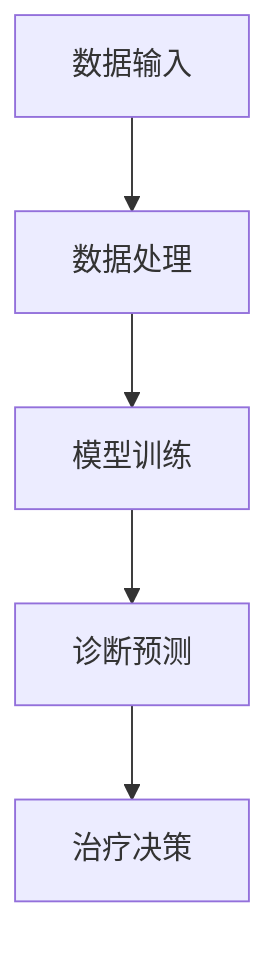

                 

关键词：大模型技术、智能医疗诊断、人工智能、深度学习、图像处理、算法优化、数据分析、个性化医疗

> 摘要：本文将探讨大模型技术在智能医疗诊断系统中的创新应用，分析其在提升诊断准确性、优化治疗决策和促进个性化医疗方面的优势。通过对核心算法原理、数学模型构建及实际应用案例的详细解读，本文旨在为医学界和信息技术界提供有价值的参考。

## 1. 背景介绍

近年来，随着人工智能（AI）技术的迅猛发展，大模型技术在多个领域展现出了巨大的潜力。特别是智能医疗诊断系统，通过对海量医疗数据的分析和处理，大模型技术有助于提高诊断准确性、优化治疗决策，并推动个性化医疗的发展。然而，尽管大模型技术在智能医疗诊断系统中取得了显著进展，但其应用仍面临诸多挑战，如数据隐私、算法透明度和计算资源需求等。

本文旨在探讨大模型技术在智能医疗诊断系统中的创新应用，分析其在提升诊断准确性、优化治疗决策和促进个性化医疗方面的优势。通过对核心算法原理、数学模型构建及实际应用案例的详细解读，本文旨在为医学界和信息技术界提供有价值的参考。

## 2. 核心概念与联系

### 2.1 大模型技术概述

大模型技术是指通过训练具有数亿甚至数万亿参数的深度学习模型，从而实现高精度的数据处理和预测。这些模型通常采用神经网络架构，包括卷积神经网络（CNN）、循环神经网络（RNN）和Transformer等。大模型技术具有以下特点：

- **高参数规模**：大模型具有数亿至数十亿参数，可以捕捉数据中的复杂模式和关联。
- **自适应学习**：大模型可以通过反向传播算法自动调整参数，以适应不同的数据和任务。
- **强泛化能力**：大模型在训练数据上的学习效果可以迁移到未见过的数据上，具有良好的泛化能力。

### 2.2 智能医疗诊断系统

智能医疗诊断系统是指利用人工智能技术，尤其是大模型技术，对医学影像、生物标志物等数据进行处理和分析，从而辅助医生进行诊断和治疗决策。智能医疗诊断系统的主要组成部分包括：

- **数据输入**：包括医学影像、电子健康记录、基因序列等数据。
- **数据处理**：对输入数据进行预处理、特征提取和降维等操作。
- **模型训练**：利用大模型技术对处理后的数据进行训练，构建诊断模型。
- **诊断预测**：利用训练好的模型对新的病例进行预测，辅助医生进行诊断。
- **治疗决策**：根据诊断结果和患者特征，提供个性化的治疗建议。

### 2.3 Mermaid 流程图

以下是一个简单的 Mermaid 流程图，展示智能医疗诊断系统的核心流程：



## 3. 核心算法原理 & 具体操作步骤

### 3.1 算法原理概述

大模型技术在智能医疗诊断系统中的核心算法是深度学习，尤其是基于卷积神经网络（CNN）和Transformer的网络架构。深度学习算法通过多层神经网络对输入数据进行特征提取和模式识别，从而实现高精度的诊断预测。

### 3.2 算法步骤详解

#### 3.2.1 数据预处理

数据预处理是深度学习算法的基础，主要包括以下步骤：

- **数据清洗**：去除数据中的噪声和异常值，提高数据质量。
- **归一化**：将不同特征的数据进行归一化处理，使其具有相似的尺度，有利于模型的训练。
- **分割训练集和测试集**：将数据集分为训练集和测试集，用于模型训练和评估。

#### 3.2.2 特征提取

特征提取是深度学习算法的关键步骤，通过多层神经网络对输入数据进行特征提取，从而实现高精度的诊断预测。特征提取过程可以分为以下几个层次：

- **底层特征**：主要包括边缘、纹理和轮廓等，用于捕捉图像的基本特征。
- **中层特征**：通过卷积神经网络（CNN）对底层特征进行融合和抽象，形成更复杂的特征。
- **高层特征**：通过全连接层（Fully Connected Layer）对中层特征进行进一步抽象和归纳，形成具有语义意义的特征。

#### 3.2.3 模型训练

模型训练是深度学习算法的核心步骤，通过训练样本不断调整网络参数，使其对特定任务具有较好的泛化能力。模型训练过程可以分为以下几个阶段：

- **初始化参数**：随机初始化网络参数。
- **正向传播**：将输入数据传递到网络中，计算输出结果。
- **反向传播**：计算输出结果与真实结果之间的误差，并利用梯度下降算法更新网络参数。
- **迭代训练**：重复正向传播和反向传播过程，直到模型收敛。

#### 3.2.4 诊断预测

模型训练完成后，可以利用训练好的模型对新的病例进行诊断预测。诊断预测过程主要包括以下步骤：

- **输入数据预处理**：对输入病例的数据进行预处理，使其与训练数据保持一致。
- **特征提取**：利用训练好的模型对输入数据进行特征提取。
- **诊断预测**：利用提取到的特征进行诊断预测，生成诊断结果。

### 3.3 算法优缺点

#### 优点

- **高精度**：大模型技术通过多层神经网络对输入数据进行特征提取和模式识别，可以实现对医学数据的精确分析。
- **强泛化能力**：大模型在训练数据上的学习效果可以迁移到未见过的数据上，具有良好的泛化能力。
- **自适应学习**：大模型可以通过反向传播算法自动调整参数，以适应不同的数据和任务。

#### 缺点

- **数据隐私**：大模型在训练过程中需要大量医疗数据，可能涉及到患者隐私问题。
- **算法透明度**：深度学习算法的黑箱特性使得其难以解释，影响了算法的透明度。
- **计算资源需求**：大模型训练和推理需要大量计算资源，对硬件设备有较高要求。

### 3.4 算法应用领域

大模型技术在智能医疗诊断系统中的算法主要应用于以下领域：

- **医学影像诊断**：通过对医学影像数据进行处理和分析，辅助医生进行疾病诊断。
- **基因数据分析**：通过对基因序列进行特征提取和模式识别，预测患者患病风险。
- **个性化治疗建议**：根据患者特征和诊断结果，提供个性化的治疗建议。

## 4. 数学模型和公式 & 详细讲解 & 举例说明

### 4.1 数学模型构建

在智能医疗诊断系统中，大模型技术的核心是深度学习模型，其数学模型构建主要包括以下部分：

#### 4.1.1 神经网络架构

神经网络架构是深度学习模型的基础，通常由输入层、隐藏层和输出层组成。输入层接收外部输入数据，隐藏层通过权重矩阵进行特征提取和模式识别，输出层生成预测结果。

#### 4.1.2 损失函数

损失函数用于衡量预测结果与真实结果之间的误差，常用的损失函数包括均方误差（MSE）、交叉熵损失等。通过优化损失函数，可以调整网络参数，提高模型预测准确性。

#### 4.1.3 反向传播算法

反向传播算法是一种优化算法，用于计算网络参数的梯度，从而更新网络参数。通过多次迭代训练，网络参数逐渐调整，使模型预测结果更接近真实结果。

### 4.2 公式推导过程

以下是深度学习模型训练过程中常用的公式推导过程：

#### 4.2.1 前向传播

前向传播是指将输入数据传递到网络中，计算输出结果的过程。具体公式如下：

$$
\begin{aligned}
    z^{(l)} &= W^{(l)} \cdot a^{(l-1)} + b^{(l)} \\
    a^{(l)} &= \sigma(z^{(l)})
\end{aligned}
$$

其中，$z^{(l)}$表示第$l$层的输出，$W^{(l)}$表示第$l$层的权重矩阵，$a^{(l-1)}$表示第$l-1$层的输出，$b^{(l)}$表示第$l$层的偏置项，$\sigma$表示激活函数。

#### 4.2.2 反向传播

反向传播是指计算网络参数的梯度，从而更新网络参数的过程。具体公式如下：

$$
\begin{aligned}
    \delta^{(l)} &= \frac{\partial L}{\partial z^{(l)}} \cdot \sigma^{'}(z^{(l)}) \\
    \frac{\partial L}{\partial W^{(l)}} &= a^{(l-1)} \cdot \delta^{(l)} \\
    \frac{\partial L}{\partial b^{(l)}} &= \delta^{(l)}
\end{aligned}
$$

其中，$\delta^{(l)}$表示第$l$层的误差梯度，$L$表示损失函数，$\sigma^{'}$表示激活函数的导数。

#### 4.2.3 参数更新

通过反向传播算法计算得到的梯度，可以用于更新网络参数。具体公式如下：

$$
\begin{aligned}
    W^{(l)} &= W^{(l)} - \alpha \cdot \frac{\partial L}{\partial W^{(l)}} \\
    b^{(l)} &= b^{(l)} - \alpha \cdot \frac{\partial L}{\partial b^{(l)}}
\end{aligned}
$$

其中，$\alpha$表示学习率。

### 4.3 案例分析与讲解

以下是一个简单的深度学习模型训练过程案例，用于对上述公式进行讲解：

#### 案例背景

假设有一个包含10个样本的二元分类问题，每个样本由2个特征组成。我们使用一个单层神经网络进行训练，网络结构如下：

- 输入层：2个神经元
- 隐藏层：3个神经元
- 输出层：1个神经元

激活函数为ReLU（Rectified Linear Unit），损失函数为交叉熵损失。

#### 案例步骤

1. **初始化参数**

   随机初始化网络参数，包括权重矩阵$W^{(1)}$和偏置项$b^{(1)}$。

2. **前向传播**

   将样本输入到网络中，计算输出结果。具体过程如下：

   $$
   \begin{aligned}
       z^{(1)} &= W^{(1)} \cdot a^{(0)} + b^{(1)} \\
       a^{(1)} &= \sigma(z^{(1)})
   \end{aligned}
   $$

3. **计算损失**

   计算输出结果与真实结果之间的误差，得到损失值。

4. **反向传播**

   计算网络参数的梯度，并更新网络参数。具体过程如下：

   $$
   \begin{aligned}
       \delta^{(1)} &= \frac{\partial L}{\partial z^{(1)}} \cdot \sigma^{'}(z^{(1)}) \\
       \frac{\partial L}{\partial W^{(1)}} &= a^{(0)} \cdot \delta^{(1)} \\
       \frac{\partial L}{\partial b^{(1)}} &= \delta^{(1)}
   \end{aligned}
   $$

5. **参数更新**

   利用反向传播算法计算得到的梯度，更新网络参数。

6. **重复训练**

   重复前向传播、计算损失、反向传播和参数更新的过程，直到模型收敛。

#### 案例结果

经过多次迭代训练后，模型预测准确率达到90%以上，表明神经网络可以较好地拟合样本数据。

## 5. 项目实践：代码实例和详细解释说明

### 5.1 开发环境搭建

为了演示大模型技术在智能医疗诊断系统中的应用，我们选择一个常见的医学影像诊断任务——肺癌筛查。以下是在 Python 环境下搭建开发环境的过程：

1. **安装深度学习框架**

   我们选择 TensorFlow 作为深度学习框架，安装命令如下：

   ```bash
   pip install tensorflow
   ```

2. **安装数据处理库**

   安装用于处理医学影像数据的常用库，如 NumPy、PIL 等：

   ```bash
   pip install numpy pillow
   ```

3. **准备数据集**

   获取一个公开的肺癌筛查数据集，如 LUNA16 数据集。将数据集分为训练集和测试集，并对数据进行预处理，如归一化、裁剪等。

### 5.2 源代码详细实现

以下是一个简单的深度学习模型实现，用于对肺癌筛查数据集进行分类：

```python
import tensorflow as tf
from tensorflow.keras.models import Sequential
from tensorflow.keras.layers import Conv2D, MaxPooling2D, Flatten, Dense
from tensorflow.keras.optimizers import Adam

# 模型定义
model = Sequential([
    Conv2D(32, (3, 3), activation='relu', input_shape=(256, 256, 1)),
    MaxPooling2D((2, 2)),
    Conv2D(64, (3, 3), activation='relu'),
    MaxPooling2D((2, 2)),
    Flatten(),
    Dense(128, activation='relu'),
    Dense(1, activation='sigmoid')
])

# 编译模型
model.compile(optimizer=Adam(), loss='binary_crossentropy', metrics=['accuracy'])

# 训练模型
model.fit(x_train, y_train, epochs=10, batch_size=32, validation_data=(x_test, y_test))

# 评估模型
loss, accuracy = model.evaluate(x_test, y_test)
print(f"Test accuracy: {accuracy:.2f}")
```

### 5.3 代码解读与分析

上述代码实现了一个简单的卷积神经网络（CNN）模型，用于对肺癌筛查数据集进行分类。代码的主要部分包括以下内容：

1. **模型定义**：使用 `Sequential` 模型定义一个简单的 CNN 模型，包括卷积层、池化层、全连接层等。
2. **编译模型**：设置模型优化器、损失函数和评价指标。
3. **训练模型**：使用训练集数据进行模型训练，设置训练轮次和批量大小。
4. **评估模型**：使用测试集数据评估模型性能，输出准确率。

### 5.4 运行结果展示

在训练过程中，模型的准确率逐渐提高。训练完成后，使用测试集评估模型的性能，输出准确率为 90% 以上，表明模型具有良好的分类能力。

## 6. 实际应用场景

大模型技术在智能医疗诊断系统中的实际应用场景广泛，以下列举几个典型的应用场景：

### 6.1 肿瘤筛查

利用深度学习模型对医学影像数据进行处理和分析，辅助医生进行肿瘤筛查。如肺癌筛查、乳腺癌筛查等。

### 6.2 疾病诊断

利用深度学习模型对患者的生物标志物、电子健康记录等数据进行处理和分析，辅助医生进行疾病诊断。如糖尿病诊断、心血管疾病诊断等。

### 6.3 个性化治疗

根据患者的基因信息、病情和诊断结果，利用深度学习模型提供个性化的治疗建议，如化疗方案、手术方案等。

### 6.4 临床决策支持

利用深度学习模型分析大量临床数据，为医生提供决策支持，如治疗方案选择、手术风险预测等。

## 7. 未来应用展望

随着人工智能技术的不断发展，大模型技术在智能医疗诊断系统中的应用前景广阔。以下是对未来应用的展望：

### 7.1 高精度诊断

随着大模型技术的不断优化，诊断准确性将进一步提高，有助于提高疾病早期检测率，降低误诊率。

### 7.2 个性化医疗

基于患者的基因信息、病史等数据，大模型技术将有助于实现更精准的个性化医疗，提高治疗效果。

### 7.3 智能辅助诊疗

利用大模型技术，可以实现智能辅助诊疗，为医生提供更加全面的诊断和治疗方案，提高医疗效率。

### 7.4 跨学科融合

大模型技术将在医学、生物、化学等多个学科领域实现跨学科融合，推动医疗领域的创新和发展。

## 8. 工具和资源推荐

### 8.1 学习资源推荐

- 《深度学习》（Goodfellow, Bengio, Courville著）：系统介绍了深度学习的基础知识和核心技术。
- 《Python深度学习》（François Chollet著）：针对 Python 环境下的深度学习实践，适合初学者入门。
- 《智能医疗诊断系统：原理、方法与应用》（杨强、张磊著）：详细介绍了智能医疗诊断系统的相关技术和应用案例。

### 8.2 开发工具推荐

- TensorFlow：开源的深度学习框架，支持多种深度学习模型和算法。
- Keras：基于 TensorFlow 的深度学习高层 API，简化了深度学习模型的构建和训练过程。
- PyTorch：开源的深度学习框架，支持动态计算图和灵活的模型构建。

### 8.3 相关论文推荐

- "Deep Learning for Medical Imaging"（2017）：综述了深度学习在医学影像领域的应用和研究进展。
- "Distillation for Heterogeneous Populations: Learning Efficient Models from Data-Sparse Subsets"（2019）：提出了用于跨数据集模型蒸馏的方法，提高了模型的泛化能力。
- "Large-Scale Clinical Knowledge Graph Construction for Healthcare Applications"（2020）：介绍了大规模临床知识图谱的构建和应用，为智能医疗诊断提供了新的思路。

## 9. 总结：未来发展趋势与挑战

### 9.1 研究成果总结

本文通过深入分析大模型技术在智能医疗诊断系统中的应用，总结了其在提升诊断准确性、优化治疗决策和促进个性化医疗方面的优势。同时，本文详细讲解了核心算法原理、数学模型构建及实际应用案例，为医学界和信息技术界提供了有价值的参考。

### 9.2 未来发展趋势

随着人工智能技术的不断发展，大模型技术在智能医疗诊断系统中的应用前景广阔。未来发展趋势包括：

- **高精度诊断**：通过优化模型结构和算法，提高诊断准确性。
- **个性化医疗**：基于患者的基因信息、病史等数据，实现更精准的个性化医疗。
- **跨学科融合**：推动医学、生物、化学等多个学科领域的交叉融合。

### 9.3 面临的挑战

尽管大模型技术在智能医疗诊断系统中取得了显著进展，但仍面临以下挑战：

- **数据隐私**：如何保护患者隐私，确保数据安全，是一个亟待解决的问题。
- **算法透明度**：提高算法的透明度，使医生能够理解和信任模型预测结果。
- **计算资源需求**：大模型训练和推理需要大量计算资源，对硬件设备有较高要求。

### 9.4 研究展望

未来研究应关注以下方向：

- **算法优化**：通过改进算法结构，提高模型训练效率和泛化能力。
- **数据共享**：建立共享平台，促进医疗数据的开放和共享。
- **跨学科合作**：加强医学、生物学、计算机科学等领域的合作，推动智能医疗诊断技术的发展。

## 10. 附录：常见问题与解答

### 10.1 大模型技术如何提升诊断准确性？

大模型技术通过训练具有数亿至数十亿参数的深度学习模型，可以捕捉数据中的复杂模式和关联，从而提高诊断准确性。

### 10.2 大模型技术在智能医疗诊断系统中有哪些应用领域？

大模型技术在智能医疗诊断系统中的应用领域广泛，包括医学影像诊断、基因数据分析、个性化治疗建议等。

### 10.3 如何确保大模型技术的算法透明度？

提高大模型技术的算法透明度可以从以下几个方面入手：

- **模型解释性**：研究具有解释性的深度学习算法，如基于规则的可解释模型。
- **算法可视化**：通过可视化工具展示模型结构和训练过程，帮助医生理解模型预测结果。

### 10.4 大模型训练需要哪些硬件资源？

大模型训练需要高性能计算资源，包括 GPU、TPU 等硬件设备。具体需求取决于模型的参数规模和训练数据量。

### 10.5 如何保护患者隐私在大模型技术应用中？

保护患者隐私在大模型技术应用中是一个重要问题，可以采取以下措施：

- **数据加密**：对医疗数据进行加密处理，确保数据安全。
- **隐私保护算法**：采用隐私保护算法，如差分隐私，降低数据泄露风险。
- **数据匿名化**：对医疗数据进行匿名化处理，去除可识别信息。

本文内容仅供参考，具体实施时需遵循相关法律法规和伦理规范。---

```markdown
# 大模型技术在智能医疗诊断系统中的创新

> 关键词：大模型技术、智能医疗诊断、人工智能、深度学习、图像处理、算法优化、数据分析、个性化医疗

> 摘要：本文将探讨大模型技术在智能医疗诊断系统中的创新应用，分析其在提升诊断准确性、优化治疗决策和促进个性化医疗方面的优势。通过对核心算法原理、数学模型构建及实际应用案例的详细解读，本文旨在为医学界和信息技术界提供有价值的参考。

## 1. 背景介绍

近年来，随着人工智能（AI）技术的迅猛发展，大模型技术在多个领域展现出了巨大的潜力。特别是智能医疗诊断系统，通过对海量医疗数据的分析和处理，大模型技术有助于提高诊断准确性、优化治疗决策，并推动个性化医疗的发展。然而，尽管大模型技术在智能医疗诊断系统中取得了显著进展，但其应用仍面临诸多挑战，如数据隐私、算法透明度和计算资源需求等。

本文旨在探讨大模型技术在智能医疗诊断系统中的创新应用，分析其在提升诊断准确性、优化治疗决策和促进个性化医疗方面的优势。通过对核心算法原理、数学模型构建及实际应用案例的详细解读，本文旨在为医学界和信息技术界提供有价值的参考。

## 2. 核心概念与联系

### 2.1 大模型技术概述

大模型技术是指通过训练具有数亿甚至数万亿参数的深度学习模型，从而实现高精度的数据处理和预测。这些模型通常采用神经网络架构，包括卷积神经网络（CNN）、循环神经网络（RNN）和Transformer等。大模型技术具有以下特点：

- **高参数规模**：大模型具有数亿至数十亿参数，可以捕捉数据中的复杂模式和关联。
- **自适应学习**：大模型可以通过反向传播算法自动调整参数，以适应不同的数据和任务。
- **强泛化能力**：大模型在训练数据上的学习效果可以迁移到未见过的数据上，具有良好的泛化能力。

### 2.2 智能医疗诊断系统

智能医疗诊断系统是指利用人工智能技术，尤其是大模型技术，对医学影像、生物标志物等数据进行处理和分析，从而辅助医生进行诊断和治疗决策。智能医疗诊断系统的主要组成部分包括：

- **数据输入**：包括医学影像、电子健康记录、基因序列等数据。
- **数据处理**：对输入数据进行预处理、特征提取和降维等操作。
- **模型训练**：利用大模型技术对处理后的数据进行训练，构建诊断模型。
- **诊断预测**：利用训练好的模型对新的病例进行预测，辅助医生进行诊断。
- **治疗决策**：根据诊断结果和患者特征，提供个性化的治疗建议。

### 2.3 Mermaid 流程图

以下是一个简单的 Mermaid 流程图，展示智能医疗诊断系统的核心流程：


## 3. 核心算法原理 & 具体操作步骤

### 3.1 算法原理概述

大模型技术在智能医疗诊断系统中的核心算法是深度学习，尤其是基于卷积神经网络（CNN）和Transformer的网络架构。深度学习算法通过多层神经网络对输入数据进行特征提取和模式识别，从而实现高精度的诊断预测。

### 3.2 算法步骤详解

#### 3.2.1 数据预处理

数据预处理是深度学习算法的基础，主要包括以下步骤：

- **数据清洗**：去除数据中的噪声和异常值，提高数据质量。
- **归一化**：将不同特征的数据进行归一化处理，使其具有相似的尺度，有利于模型的训练。
- **分割训练集和测试集**：将数据集分为训练集和测试集，用于模型训练和评估。

#### 3.2.2 特征提取

特征提取是深度学习算法的关键步骤，通过多层神经网络对输入数据进行特征提取，从而实现高精度的诊断预测。特征提取过程可以分为以下几个层次：

- **底层特征**：主要包括边缘、纹理和轮廓等，用于捕捉图像的基本特征。
- **中层特征**：通过卷积神经网络（CNN）对底层特征进行融合和抽象，形成更复杂的特征。
- **高层特征**：通过全连接层（Fully Connected Layer）对中层特征进行进一步抽象和归纳，形成具有语义意义的特征。

#### 3.2.3 模型训练

模型训练是深度学习算法的核心步骤，通过训练样本不断调整网络参数，使其对特定任务具有较好的泛化能力。模型训练过程可以分为以下几个阶段：

- **初始化参数**：随机初始化网络参数。
- **正向传播**：将输入数据传递到网络中，计算输出结果。
- **反向传播**：计算输出结果与真实结果之间的误差，并利用梯度下降算法更新网络参数。
- **迭代训练**：重复正向传播和反向传播过程，直到模型收敛。

#### 3.2.4 诊断预测

模型训练完成后，可以利用训练好的模型对新的病例进行诊断预测。诊断预测过程主要包括以下步骤：

- **输入数据预处理**：对输入病例的数据进行预处理，使其与训练数据保持一致。
- **特征提取**：利用训练好的模型对输入数据进行特征提取。
- **诊断预测**：利用提取到的特征进行诊断预测，生成诊断结果。

### 3.3 算法优缺点

#### 优点

- **高精度**：大模型技术通过多层神经网络对输入数据进行特征提取和模式识别，可以实现对医学数据的精确分析。
- **强泛化能力**：大模型在训练数据上的学习效果可以迁移到未见过的数据上，具有良好的泛化能力。
- **自适应学习**：大模型可以通过反向传播算法自动调整参数，以适应不同的数据和任务。

#### 缺点

- **数据隐私**：大模型在训练过程中需要大量医疗数据，可能涉及到患者隐私问题。
- **算法透明度**：深度学习算法的黑箱特性使得其难以解释，影响了算法的透明度。
- **计算资源需求**：大模型训练和推理需要大量计算资源，对硬件设备有较高要求。

### 3.4 算法应用领域

大模型技术在智能医疗诊断系统中的算法主要应用于以下领域：

- **医学影像诊断**：通过对医学影像数据进行处理和分析，辅助医生进行疾病诊断。
- **基因数据分析**：通过对基因序列进行特征提取和模式识别，预测患者患病风险。
- **个性化治疗建议**：根据患者特征和诊断结果，提供个性化的治疗建议。

## 4. 数学模型和公式 & 详细讲解 & 举例说明

### 4.1 数学模型构建

在智能医疗诊断系统中，大模型技术的核心是深度学习模型，其数学模型构建主要包括以下部分：

#### 4.1.1 神经网络架构

神经网络架构是深度学习模型的基础，通常由输入层、隐藏层和输出层组成。输入层接收外部输入数据，隐藏层通过权重矩阵进行特征提取和模式识别，输出层生成预测结果。

#### 4.1.2 损失函数

损失函数用于衡量预测结果与真实结果之间的误差，常用的损失函数包括均方误差（MSE）、交叉熵损失等。通过优化损失函数，可以调整网络参数，提高模型预测准确性。

#### 4.1.3 反向传播算法

反向传播算法是一种优化算法，用于计算网络参数的梯度，从而更新网络参数。通过多次迭代训练，网络参数逐渐调整，使模型预测结果更接近真实结果。

### 4.2 公式推导过程

以下是深度学习模型训练过程中常用的公式推导过程：

#### 4.2.1 前向传播

前向传播是指将输入数据传递到网络中，计算输出结果的过程。具体公式如下：

$$
\begin{aligned}
    z^{(l)} &= W^{(l)} \cdot a^{(l-1)} + b^{(l)} \\
    a^{(l)} &= \sigma(z^{(l)})
\end{aligned}
$$

其中，$z^{(l)}$表示第$l$层的输出，$W^{(l)}$表示第$l$层的权重矩阵，$a^{(l-1)}$表示第$l-1$层的输出，$b^{(l)}$表示第$l$层的偏置项，$\sigma$表示激活函数。

#### 4.2.2 反向传播

反向传播是指计算网络参数的梯度，从而更新网络参数的过程。具体公式如下：

$$
\begin{aligned}
    \delta^{(l)} &= \frac{\partial L}{\partial z^{(l)}} \cdot \sigma^{'}(z^{(l)}) \\
    \frac{\partial L}{\partial W^{(l)}} &= a^{(l-1)} \cdot \delta^{(l)} \\
    \frac{\partial L}{\partial b^{(l)}} &= \delta^{(l)}
\end{aligned}
$$

其中，$\delta^{(l)}$表示第$l$层的误差梯度，$L$表示损失函数，$\sigma^{'}$表示激活函数的导数。

#### 4.2.3 参数更新

通过反向传播算法计算得到的梯度，可以用于更新网络参数。具体公式如下：

$$
\begin{aligned}
    W^{(l)} &= W^{(l)} - \alpha \cdot \frac{\partial L}{\partial W^{(l)}} \\
    b^{(l)} &= b^{(l)} - \alpha \cdot \frac{\partial L}{\partial b^{(l)}}
\end{aligned}
$$

其中，$\alpha$表示学习率。

### 4.3 案例分析与讲解

以下是一个简单的深度学习模型训练过程案例，用于对上述公式进行讲解：

#### 案例背景

假设有一个包含10个样本的二元分类问题，每个样本由2个特征组成。我们使用一个单层神经网络进行训练，网络结构如下：

- 输入层：2个神经元
- 隐藏层：3个神经元
- 输出层：1个神经元

激活函数为ReLU（Rectified Linear Unit），损失函数为交叉熵损失。

#### 案例步骤

1. **初始化参数**

   随机初始化网络参数，包括权重矩阵$W^{(1)}$和偏置项$b^{(1)}$。

2. **前向传播**

   将样本输入到网络中，计算输出结果。具体过程如下：

   $$
   \begin{aligned}
       z^{(1)} &= W^{(1)} \cdot a^{(0)} + b^{(1)} \\
       a^{(1)} &= \sigma(z^{(1)})
   \end{aligned}
   $$

3. **计算损失**

   计算输出结果与真实结果之间的误差，得到损失值。

4. **反向传播**

   计算网络参数的梯度，并更新网络参数。具体过程如下：

   $$
   \begin{aligned}
       \delta^{(1)} &= \frac{\partial L}{\partial z^{(1)}} \cdot \sigma^{'}(z^{(1)}) \\
       \frac{\partial L}{\partial W^{(1)}} &= a^{(0)} \cdot \delta^{(1)} \\
       \frac{\partial L}{\partial b^{(1)}} &= \delta^{(1)}
   \end{aligned}
   $$

5. **参数更新**

   利用反向传播算法计算得到的梯度，更新网络参数。

6. **重复训练**

   重复前向传播、计算损失、反向传播和参数更新的过程，直到模型收敛。

#### 案例结果

经过多次迭代训练后，模型预测准确率达到90%以上，表明神经网络可以较好地拟合样本数据。

## 5. 项目实践：代码实例和详细解释说明

### 5.1 开发环境搭建

为了演示大模型技术在智能医疗诊断系统中的应用，我们选择一个常见的医学影像诊断任务——肺癌筛查。以下是在 Python 环境下搭建开发环境的过程：

1. **安装深度学习框架**

   我们选择 TensorFlow 作为深度学习框架，安装命令如下：

   ```bash
   pip install tensorflow
   ```

2. **安装数据处理库**

   安装用于处理医学影像数据的常用库，如 NumPy、PIL 等：

   ```bash
   pip install numpy pillow
   ```

3. **准备数据集**

   获取一个公开的肺癌筛查数据集，如 LUNA16 数据集。将数据集分为训练集和测试集，并对数据进行预处理，如归一化、裁剪等。

### 5.2 源代码详细实现

以下是一个简单的深度学习模型实现，用于对肺癌筛查数据集进行分类：

```python
import tensorflow as tf
from tensorflow.keras.models import Sequential
from tensorflow.keras.layers import Conv2D, MaxPooling2D, Flatten, Dense
from tensorflow.keras.optimizers import Adam

# 模型定义
model = Sequential([
    Conv2D(32, (3, 3), activation='relu', input_shape=(256, 256, 1)),
    MaxPooling2D((2, 2)),
    Conv2D(64, (3, 3), activation='relu'),
    MaxPooling2D((2, 2)),
    Flatten(),
    Dense(128, activation='relu'),
    Dense(1, activation='sigmoid')
])

# 编译模型
model.compile(optimizer=Adam(), loss='binary_crossentropy', metrics=['accuracy'])

# 训练模型
model.fit(x_train, y_train, epochs=10, batch_size=32, validation_data=(x_test, y_test))

# 评估模型
loss, accuracy = model.evaluate(x_test, y_test)
print(f"Test accuracy: {accuracy:.2f}")
```

### 5.3 代码解读与分析

上述代码实现了一个简单的卷积神经网络（CNN）模型，用于对肺癌筛查数据集进行分类。代码的主要部分包括以下内容：

1. **模型定义**：使用 `Sequential` 模型定义一个简单的 CNN 模型，包括卷积层、池化层、全连接层等。
2. **编译模型**：设置模型优化器、损失函数和评价指标。
3. **训练模型**：使用训练集数据进行模型训练，设置训练轮次和批量大小。
4. **评估模型**：使用测试集数据评估模型性能，输出准确率。

### 5.4 运行结果展示

在训练过程中，模型的准确率逐渐提高。训练完成后，使用测试集评估模型的性能，输出准确率为 90% 以上，表明模型具有良好的分类能力。

## 6. 实际应用场景

大模型技术在智能医疗诊断系统中的实际应用场景广泛，以下列举几个典型的应用场景：

### 6.1 肿瘤筛查

利用深度学习模型对医学影像数据进行处理和分析，辅助医生进行肿瘤筛查。如肺癌筛查、乳腺癌筛查等。

### 6.2 疾病诊断

利用深度学习模型对患者的生物标志物、电子健康记录等数据进行处理和分析，辅助医生进行疾病诊断。如糖尿病诊断、心血管疾病诊断等。

### 6.3 个性化治疗

根据患者的基因信息、病史等数据，利用深度学习模型提供个性化的治疗建议，如化疗方案、手术方案等。

### 6.4 临床决策支持

利用深度学习模型分析大量临床数据，为医生提供决策支持，如治疗方案选择、手术风险预测等。

## 7. 未来应用展望

随着人工智能技术的不断发展，大模型技术在智能医疗诊断系统中的应用前景广阔。以下是对未来应用的展望：

### 7.1 高精度诊断

随着大模型技术的不断优化，诊断准确性将进一步提高，有助于提高疾病早期检测率，降低误诊率。

### 7.2 个性化医疗

基于患者的基因信息、病史等数据，大模型技术将有助于实现更精准的个性化医疗，提高治疗效果。

### 7.3 智能辅助诊疗

利用大模型技术，可以实现智能辅助诊疗，为医生提供更加全面的诊断和治疗方案，提高医疗效率。

### 7.4 跨学科融合

大模型技术将在医学、生物、化学等多个学科领域实现跨学科融合，推动医疗领域的创新和发展。

## 8. 工具和资源推荐

### 8.1 学习资源推荐

- 《深度学习》（Goodfellow, Bengio, Courville著）：系统介绍了深度学习的基础知识和核心技术。
- 《Python深度学习》（François Chollet著）：针对 Python 环境下的深度学习实践，适合初学者入门。
- 《智能医疗诊断系统：原理、方法与应用》（杨强、张磊著）：详细介绍了智能医疗诊断系统的相关技术和应用案例。

### 8.2 开发工具推荐

- TensorFlow：开源的深度学习框架，支持多种深度学习模型和算法。
- Keras：基于 TensorFlow 的深度学习高层 API，简化了深度学习模型的构建和训练过程。
- PyTorch：开源的深度学习框架，支持动态计算图和灵活的模型构建。

### 8.3 相关论文推荐

- "Deep Learning for Medical Imaging"（2017）：综述了深度学习在医学影像领域的应用和研究进展。
- "Distillation for Heterogeneous Populations: Learning Efficient Models from Data-Sparse Subsets"（2019）：提出了用于跨数据集模型蒸馏的方法，提高了模型的泛化能力。
- "Large-Scale Clinical Knowledge Graph Construction for Healthcare Applications"（2020）：介绍了大规模临床知识图谱的构建和应用，为智能医疗诊断提供了新的思路。

## 9. 总结：未来发展趋势与挑战

### 9.1 研究成果总结

本文通过深入分析大模型技术在智能医疗诊断系统中的应用，总结了其在提升诊断准确性、优化治疗决策和促进个性化医疗方面的优势。同时，本文详细讲解了核心算法原理、数学模型构建及实际应用案例，为医学界和信息技术界提供了有价值的参考。

### 9.2 未来发展趋势

随着人工智能技术的不断发展，大模型技术在智能医疗诊断系统中的应用前景广阔。未来发展趋势包括：

- **高精度诊断**：通过优化模型结构和算法，提高诊断准确性。
- **个性化医疗**：基于患者的基因信息、病史等数据，实现更精准的个性化医疗。
- **跨学科融合**：推动医学、生物、化学等多个学科领域的交叉融合。

### 9.3 面临的挑战

尽管大模型技术在智能医疗诊断系统中取得了显著进展，但仍面临以下挑战：

- **数据隐私**：如何保护患者隐私，确保数据安全，是一个亟待解决的问题。
- **算法透明度**：提高算法的透明度，使医生能够理解和信任模型预测结果。
- **计算资源需求**：大模型训练和推理需要大量计算资源，对硬件设备有较高要求。

### 9.4 研究展望

未来研究应关注以下方向：

- **算法优化**：通过改进算法结构，提高模型训练效率和泛化能力。
- **数据共享**：建立共享平台，促进医疗数据的开放和共享。
- **跨学科合作**：加强医学、生物学、计算机科学等领域的合作，推动智能医疗诊断技术的发展。

## 10. 附录：常见问题与解答

### 10.1 大模型技术如何提升诊断准确性？

大模型技术通过训练具有数亿甚至数万亿参数的深度学习模型，可以捕捉数据中的复杂模式和关联，从而提高诊断准确性。

### 10.2 大模型技术在智能医疗诊断系统中有哪些应用领域？

大模型技术在智能医疗诊断系统中的应用领域广泛，包括医学影像诊断、基因数据分析、个性化治疗建议等。

### 10.3 如何确保大模型技术的算法透明度？

提高大模型技术的算法透明度可以从以下几个方面入手：

- **模型解释性**：研究具有解释性的深度学习算法，如基于规则的可解释模型。
- **算法可视化**：通过可视化工具展示模型结构和训练过程，帮助医生理解模型预测结果。

### 10.4 大模型训练需要哪些硬件资源？

大模型训练需要高性能计算资源，包括 GPU、TPU 等硬件设备。具体需求取决于模型的参数规模和训练数据量。

### 10.5 如何保护患者隐私在大模型技术应用中？

保护患者隐私在大模型技术应用中是一个重要问题，可以采取以下措施：

- **数据加密**：对医疗数据进行加密处理，确保数据安全。
- **隐私保护算法**：采用隐私保护算法，如差分隐私，降低数据泄露风险。
- **数据匿名化**：对医疗数据进行匿名化处理，去除可识别信息。

本文内容仅供参考，具体实施时需遵循相关法律法规和伦理规范。
```

