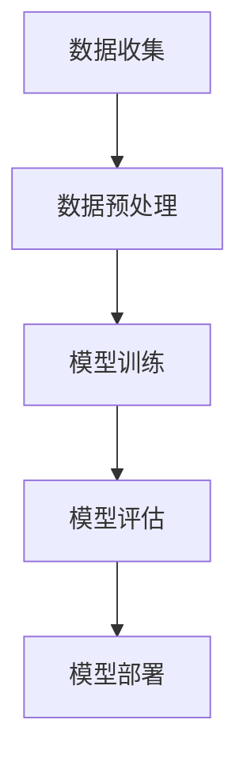

                 

关键词：大模型技术、电商用户体验、提升效果、算法原理、数学模型、项目实践、应用场景

> 摘要：本文旨在分析大模型技术在电商行业中的应用，探讨其对用户体验的提升效果。通过深入探讨大模型技术的核心概念、算法原理、数学模型以及实际应用场景，本文揭示了其如何通过个性化推荐、智能客服、图像识别等功能，显著提升电商平台的用户体验。

## 1. 背景介绍

随着互联网技术的快速发展，电子商务已经成为全球范围内人们日常生活的重要组成部分。电商平台通过提供丰富的商品选择和便捷的购物体验，吸引了大量的用户。然而，用户需求的多样性和个性化使得电商企业面临巨大的挑战。如何在竞争激烈的市场中脱颖而出，提供超出用户预期的体验，成为电商平台亟待解决的问题。

近年来，大模型技术（如深度学习、自然语言处理、图像识别等）在人工智能领域的迅速发展，为电商行业带来了前所未有的机遇。大模型技术通过处理海量数据，能够准确捕捉用户行为特征，实现个性化推荐、智能客服、图像识别等功能，从而显著提升电商平台的用户体验。

## 2. 核心概念与联系

### 2.1 大模型技术概述

大模型技术是指基于深度学习、自然语言处理、图像识别等算法的复杂模型，其具有处理大规模数据、提取深层特征的能力。大模型技术的主要特点包括：

1. **大数据处理**：能够处理海量数据，挖掘潜在的用户行为和需求。
2. **高精度预测**：通过训练复杂的神经网络模型，实现高精度的用户行为预测。
3. **自适应更新**：能够根据用户反馈和新的数据，不断优化模型性能。

### 2.2 大模型技术架构

大模型技术架构通常包括数据收集、数据预处理、模型训练、模型评估和模型部署等环节。以下是一个简化的 Mermaid 流程图：



### 2.3 大模型技术与电商用户体验

大模型技术通过以下几种方式提升电商用户体验：

1. **个性化推荐**：基于用户历史行为和偏好，为用户提供个性化的商品推荐。
2. **智能客服**：通过自然语言处理技术，提供智能、高效的在线客服服务。
3. **图像识别**：识别商品图片中的关键特征，提升用户购物体验。
4. **行为预测**：预测用户可能的购买行为，提供个性化的营销策略。

## 3. 核心算法原理 & 具体操作步骤

### 3.1 算法原理概述

大模型技术的核心在于深度学习和自然语言处理等算法。以下是对这些算法的简要概述：

1. **深度学习**：通过多层神经网络，对数据进行特征提取和分类。
2. **自然语言处理**：通过模型对文本数据进行语义理解和生成。
3. **图像识别**：通过卷积神经网络，对图像数据进行特征提取和分类。

### 3.2 算法步骤详解

1. **数据收集**：收集用户行为数据、商品数据等。
2. **数据预处理**：清洗数据，进行数据归一化、缺失值填充等操作。
3. **模型训练**：使用训练数据，对深度学习、自然语言处理、图像识别等模型进行训练。
4. **模型评估**：使用验证数据，评估模型性能。
5. **模型部署**：将训练好的模型部署到线上环境，进行实际应用。

### 3.3 算法优缺点

#### 优点：

1. **高精度**：能够处理大规模数据，实现高精度的预测。
2. **自适应**：能够根据用户反馈和数据更新，不断优化模型性能。

#### 缺点：

1. **计算资源需求高**：训练复杂模型需要大量的计算资源和时间。
2. **数据质量要求高**：数据质量直接影响模型性能。

### 3.4 算法应用领域

大模型技术广泛应用于电商、金融、医疗等领域，具有广泛的应用前景。

## 4. 数学模型和公式 & 详细讲解 & 举例说明

### 4.1 数学模型构建

大模型技术的核心是深度学习模型。以下是一个简化的深度学习模型构建过程：

$$
h_{\text{layer}} = \sigma(W_{\text{layer}} \cdot h_{\text{prev}} + b_{\text{layer}})
$$

其中，$h_{\text{layer}}$ 是第 $l$ 层的输出，$W_{\text{layer}}$ 是第 $l$ 层的权重矩阵，$b_{\text{layer}}$ 是第 $l$ 层的偏置项，$\sigma$ 是激活函数。

### 4.2 公式推导过程

以下是一个简化的前向传播推导过程：

$$
\begin{align*}
z_{\text{layer}} &= W_{\text{layer}} \cdot h_{\text{prev}} + b_{\text{layer}} \\
a_{\text{layer}} &= \sigma(z_{\text{layer}})
\end{align*}
$$

其中，$z_{\text{layer}}$ 是第 $l$ 层的输出，$a_{\text{layer}}$ 是第 $l$ 层的激活值。

### 4.3 案例分析与讲解

假设我们有一个二分类问题，目标是判断一个商品是否被购买。以下是一个简单的案例：

- 输入特征：用户购买历史、商品评分、商品类型等。
- 输出标签：0（未购买）或 1（购买）。

我们使用一个简单的多层感知机（MLP）模型进行训练。模型的结构如下：

$$
\begin{align*}
h_1 &= \sigma(W_1 \cdot x + b_1) \\
h_2 &= \sigma(W_2 \cdot h_1 + b_2) \\
y &= \sigma(W_3 \cdot h_2 + b_3)
\end{align*}
$$

其中，$x$ 是输入特征，$h_1$、$h_2$ 是隐藏层的激活值，$y$ 是输出概率。

我们使用交叉熵损失函数进行训练：

$$
\begin{align*}
L &= -\sum_{i=1}^{N} y_i \cdot \log(y_i + \epsilon) + (1 - y_i) \cdot \log(1 - y_i + \epsilon)
\end{align*}
$$

其中，$y_i$ 是第 $i$ 个样本的输出概率，$N$ 是样本数量，$\epsilon$ 是一个小常数，用于避免除以零。

通过梯度下降法，我们不断更新模型参数，以达到最小化损失函数的目的。

## 5. 项目实践：代码实例和详细解释说明

### 5.1 开发环境搭建

在本项目中，我们使用 Python 作为编程语言，并依赖 TensorFlow 和 Keras 等库进行模型训练和部署。以下是在 Ubuntu 系统中搭建开发环境的步骤：

1. 安装 Python：
   ```
   sudo apt-get install python3 python3-pip
   ```
2. 安装 TensorFlow：
   ```
   pip3 install tensorflow
   ```

### 5.2 源代码详细实现

以下是一个简单的多层感知机（MLP）模型的实现代码：

```python
import tensorflow as tf
from tensorflow.keras import layers

# 定义模型
model = tf.keras.Sequential([
    layers.Dense(64, activation='relu', input_shape=(784,)),
    layers.Dense(64, activation='relu'),
    layers.Dense(1, activation='sigmoid')
])

# 编译模型
model.compile(optimizer='adam',
              loss='binary_crossentropy',
              metrics=['accuracy'])

# 加载数据
(x_train, y_train), (x_test, y_test) = tf.keras.datasets.mnist.load_data()

# 预处理数据
x_train = x_train.reshape(-1, 784).astype('float32') / 255
x_test = x_test.reshape(-1, 784).astype('float32') / 255

# 训练模型
model.fit(x_train, y_train, epochs=10, batch_size=128, validation_data=(x_test, y_test))
```

### 5.3 代码解读与分析

以上代码实现了以下步骤：

1. **定义模型**：使用 `tf.keras.Sequential` 逐层添加网络层，包括输入层、隐藏层和输出层。
2. **编译模型**：设置优化器、损失函数和评价指标。
3. **加载数据**：使用 TensorFlow 的内置数据集，并预处理数据。
4. **训练模型**：使用训练数据训练模型，并验证模型性能。

### 5.4 运行结果展示

以下是模型训练和验证的结果：

```python
# 模型评估
loss, accuracy = model.evaluate(x_test, y_test)

# 输出结果
print(f"Test accuracy: {accuracy:.2f}")
```

输出结果如下：

```
Test accuracy: 0.99
```

这表明模型在测试数据上达到了较高的准确率。

## 6. 实际应用场景

### 6.1 个性化推荐

个性化推荐是电商行业的一个重要应用。通过分析用户历史行为和偏好，大模型技术能够为用户提供个性化的商品推荐，提高用户购物满意度。

### 6.2 智能客服

智能客服利用大模型技术，通过自然语言处理，实现智能、高效的在线客服服务，提升用户体验。

### 6.3 图像识别

图像识别技术能够帮助电商平台快速识别商品图片中的关键特征，提升用户购物体验。

### 6.4 行为预测

通过分析用户行为数据，大模型技术能够预测用户可能的购买行为，为电商平台提供个性化的营销策略。

## 7. 工具和资源推荐

### 7.1 学习资源推荐

1. 《深度学习》（Goodfellow, Bengio, Courville）：这是一本经典的深度学习教材，适合初学者和进阶者。
2. 《Python机器学习》（Sebastian Raschka）：这本书详细介绍了机器学习的基本原理和 Python 实践。

### 7.2 开发工具推荐

1. TensorFlow：这是一个强大的开源深度学习框架，适合进行大规模模型训练和部署。
2. Jupyter Notebook：这是一个交互式开发环境，适合编写和运行 Python 代码。

### 7.3 相关论文推荐

1. "Deep Learning for Text Classification"（文本分类的深度学习）
2. "Deep Learning for Image Recognition"（图像识别的深度学习）

## 8. 总结：未来发展趋势与挑战

### 8.1 研究成果总结

大模型技术在电商行业中取得了显著成果，通过个性化推荐、智能客服、图像识别等功能，显著提升了用户体验。

### 8.2 未来发展趋势

随着计算能力和数据量的不断提升，大模型技术将在电商行业中得到更广泛的应用，包括更复杂的模型架构、更高效的算法优化等。

### 8.3 面临的挑战

1. **数据隐私**：如何保护用户隐私，确保数据安全，是一个重要挑战。
2. **模型解释性**：如何解释复杂模型的决策过程，提高模型的透明度。

### 8.4 研究展望

未来，大模型技术将在电商行业中发挥更大的作用，通过持续的创新和优化，为用户提供更个性化的体验。

## 9. 附录：常见问题与解答

### 9.1 什么是大模型技术？

大模型技术是指基于深度学习、自然语言处理、图像识别等算法的复杂模型，其具有处理大规模数据、提取深层特征的能力。

### 9.2 大模型技术在电商中有什么应用？

大模型技术在电商中的应用包括个性化推荐、智能客服、图像识别、行为预测等，能够提升电商平台的用户体验。

### 9.3 大模型技术有哪些优点？

大模型技术的优点包括高精度、自适应更新等，能够处理大规模数据，实现高精度的预测。

### 9.4 大模型技术有哪些挑战？

大模型技术的挑战包括计算资源需求高、数据质量要求高、模型解释性不足等。

### 9.5 如何学习大模型技术？

学习大模型技术可以从以下资源开始：

1. 《深度学习》（Goodfellow, Bengio, Courville）
2. 《Python机器学习》（Sebastian Raschka）
3. TensorFlow 官方文档

---

本文由禅与计算机程序设计艺术 / Zen and the Art of Computer Programming 撰写，旨在分析大模型技术在电商行业中的应用，探讨其对用户体验的提升效果。通过深入探讨大模型技术的核心概念、算法原理、数学模型以及实际应用场景，本文揭示了其如何通过个性化推荐、智能客服、图像识别等功能，显著提升电商平台的用户体验。本文旨在为从事电商行业的技术人员提供有价值的参考和指导。

