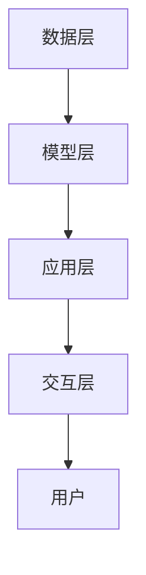

                 

### 1. 背景介绍

随着技术的飞速发展，人工智能（AI）和虚拟现实（VR）等前沿科技逐渐融入到人们的日常生活中。其中，大模型技术在元宇宙中的应用尤为引人注目。元宇宙（Metaverse）是一个由虚拟世界和现实世界融合而成的数字化空间，它通过提供沉浸式的体验，为用户带来了全新的交互方式和生活方式。大模型技术，尤其是基于深度学习的自然语言处理（NLP）和计算机视觉（CV）算法，为元宇宙的开发和应用提供了强大的支持。

### 1.1 元宇宙的兴起

元宇宙的概念最早可以追溯到1992年，由美国科幻作家尼尔·斯蒂芬森在其小说《雪崩》中提出。然而，随着计算机技术、网络通信技术、人工智能技术的不断进步，元宇宙的概念逐渐从科幻小说走向现实。今天，元宇宙已经不仅仅是一个虚拟世界的概念，它代表着一种全新的社会形态和商业模式。

在元宇宙中，用户可以通过虚拟角色（Avatar）在虚拟世界中互动、交流、娱乐、工作等。元宇宙的应用场景非常广泛，包括虚拟社交、虚拟旅游、虚拟教育、虚拟购物、虚拟医疗等。而这一切的实现，都离不开人工智能和大模型技术的支持。

### 1.2 大模型技术的崛起

大模型技术是指通过深度学习、强化学习等机器学习技术，训练出能够处理大规模数据、具备高度智能的模型。这些模型在自然语言处理、计算机视觉、语音识别等领域取得了显著的成果，被誉为是人工智能的“核心技术”。

近年来，随着计算能力的提升和数据规模的扩大，大模型技术得到了快速发展。特别是深度学习技术的突破，使得大模型在图像识别、语音合成、机器翻译等任务上取得了超人的表现。这些技术的进步，为大模型在元宇宙中的应用提供了坚实的基础。

### 1.3 大模型技术在元宇宙中的应用

在元宇宙中，大模型技术主要应用于以下几个方面：

1. **自然语言处理**：通过大模型技术，元宇宙中的虚拟角色可以理解和生成自然语言，实现与用户的自然对话。这为元宇宙中的虚拟社交和虚拟客服提供了可能。

2. **计算机视觉**：大模型技术可以帮助元宇宙中的虚拟角色识别和理解图像和视频，实现更加真实的交互体验。

3. **个性化推荐**：基于用户的兴趣和行为，大模型技术可以生成个性化的内容推荐，提高用户在元宇宙中的满意度。

4. **虚拟角色生成**：通过大模型技术，可以生成各种类型的虚拟角色，满足用户的不同需求。

5. **虚拟环境模拟**：大模型技术可以帮助构建更加逼真的虚拟环境，提升用户的沉浸感。

总的来说，大模型技术为元宇宙提供了强大的技术支持，使得元宇宙成为一个更加智能、互动、沉浸的虚拟世界。接下来，我们将进一步探讨大模型技术的工作原理、核心算法、数学模型和具体应用。

---

## 2. 核心概念与联系

### 2.1 大模型技术的工作原理

大模型技术的工作原理基于深度学习和神经网络。神经网络是由大量简单的神经元组成的计算模型，通过学习大量数据，可以自动提取数据中的特征，并用于执行复杂的任务。深度学习是一种特殊的神经网络模型，通过多层神经元的堆叠，可以处理更加复杂的数据和任务。

在深度学习中，大模型通常指的是具有数十亿个参数的模型。这些模型可以通过大规模数据训练，从而具有高度的泛化能力。大模型的工作流程主要包括以下几个步骤：

1. **数据收集**：收集大量的数据，这些数据可以是文本、图像、音频等。

2. **数据预处理**：对数据进行清洗、归一化等处理，以便模型可以更好地学习。

3. **模型训练**：使用训练数据对模型进行训练，通过优化模型参数，使模型在训练数据上达到最优性能。

4. **模型评估**：使用测试数据对模型进行评估，以验证模型的泛化能力。

5. **模型部署**：将训练好的模型部署到实际应用中，如元宇宙中的自然语言处理、计算机视觉等任务。

### 2.2 大模型技术在元宇宙中的应用架构

大模型技术在元宇宙中的应用架构可以分为以下几个层次：

1. **数据层**：包括元宇宙中的各类数据，如用户行为数据、虚拟角色数据、环境数据等。

2. **模型层**：包括大模型技术中的各种算法和模型，如自然语言处理模型、计算机视觉模型、推荐系统模型等。

3. **应用层**：包括元宇宙中的具体应用场景，如虚拟社交、虚拟旅游、虚拟购物等。

4. **交互层**：包括用户与元宇宙的交互界面，如虚拟角色控制、语音交互等。

### 2.3 大模型技术在元宇宙中的核心算法

大模型技术在元宇宙中的应用涉及到多个核心算法，包括但不限于：

1. **自然语言处理算法**：如Transformer、BERT等，用于处理文本数据，实现自然语言理解和生成。

2. **计算机视觉算法**：如卷积神经网络（CNN）、生成对抗网络（GAN）等，用于处理图像和视频数据，实现图像识别、图像生成等任务。

3. **推荐系统算法**：如基于内容的推荐、协同过滤等，用于根据用户兴趣和行为推荐个性化内容。

4. **强化学习算法**：如深度确定性策略梯度（DDPG）、策略梯度（PG）等，用于训练虚拟角色的行为策略。

### 2.4 大模型技术与其他前沿科技的结合

大模型技术不仅应用于元宇宙，还与其他前沿科技如区块链、物联网等相结合，为元宇宙的发展提供了更加丰富的可能性。例如，区块链技术可以用于确保元宇宙中的数据安全和可信，物联网技术可以用于实现元宇宙与现实世界的无缝连接。

### 2.5 Mermaid 流程图

以下是一个示例的Mermaid流程图，展示了大模型技术在元宇宙中的应用架构：



### 2.6 结论

通过上述核心概念与联系的分析，我们可以看到大模型技术在元宇宙中的应用具有广阔的前景和巨大的潜力。接下来，我们将深入探讨大模型技术的具体算法原理和操作步骤。

---

## 3. 核心算法原理 & 具体操作步骤

### 3.1 算法原理概述

大模型技术的核心在于深度学习和神经网络。深度学习是一种机器学习方法，通过多层神经元的堆叠，可以从大量数据中自动提取特征，并用于执行复杂的任务。神经网络则是由大量简单的神经元组成的计算模型，这些神经元通过加权连接实现信息的传递和处理。

在深度学习中，常用的神经网络模型包括卷积神经网络（CNN）、循环神经网络（RNN）和Transformer等。其中，卷积神经网络主要应用于图像和视频数据的处理，循环神经网络主要应用于序列数据的处理，而Transformer模型则在自然语言处理领域取得了突破性进展。

大模型技术的工作原理可以概括为以下几个步骤：

1. **数据收集与预处理**：收集大量相关数据，并进行清洗、归一化等预处理操作，以便模型可以更好地学习。

2. **模型训练**：使用训练数据对模型进行训练，通过反向传播算法优化模型参数，使模型在训练数据上达到最优性能。

3. **模型评估**：使用测试数据对模型进行评估，以验证模型的泛化能力。

4. **模型部署**：将训练好的模型部署到实际应用中，如元宇宙中的自然语言处理、计算机视觉等任务。

### 3.2 算法步骤详解

#### 3.2.1 数据收集与预处理

数据收集是深度学习模型训练的第一步。对于元宇宙中的应用，数据可以包括用户行为数据、虚拟角色数据、环境数据等。这些数据通常需要从不同的数据源进行收集，如社交媒体、游戏日志、传感器数据等。

数据预处理是确保模型可以更好地学习的重要步骤。预处理操作通常包括数据清洗、数据归一化、数据增强等。数据清洗旨在去除数据中的噪声和错误，数据归一化旨在将数据缩放到相同的范围，以避免某些特征对模型训练的影响过大，数据增强旨在通过生成更多的样本来提高模型的泛化能力。

#### 3.2.2 模型训练

模型训练是深度学习中的核心步骤。在模型训练过程中，模型通过不断调整参数，以最小化损失函数。反向传播算法是深度学习模型训练的主要算法，它通过计算损失函数关于模型参数的梯度，来更新模型参数。

在模型训练过程中，常用的优化算法包括随机梯度下降（SGD）、Adam等。这些优化算法通过调整学习率等参数，来优化模型训练过程，提高模型的收敛速度。

#### 3.2.3 模型评估

模型评估是验证模型泛化能力的重要步骤。在模型评估过程中，通常将数据集划分为训练集、验证集和测试集。训练集用于模型训练，验证集用于调整模型参数，测试集用于最终评估模型性能。

常用的模型评估指标包括准确率、召回率、F1分数、ROC曲线等。通过这些指标，可以全面评估模型的性能。

#### 3.2.4 模型部署

模型部署是将训练好的模型应用到实际场景中的过程。在元宇宙中，模型部署可以用于各种任务，如自然语言处理、计算机视觉、推荐系统等。

模型部署通常包括以下几个步骤：

1. **模型转换**：将训练好的模型转换为适合部署的格式，如TensorFlow Lite、ONNX等。

2. **模型部署**：将模型部署到目标设备上，如服务器、移动设备、嵌入式设备等。

3. **模型服务**：通过API接口提供服务，以实现与元宇宙的交互。

### 3.3 算法优缺点

#### 优点

1. **强大的学习能力**：大模型技术通过多层神经元的堆叠，可以从大量数据中自动提取特征，实现高度智能的任务。

2. **广泛的应用场景**：大模型技术在自然语言处理、计算机视觉、推荐系统等领域都有广泛的应用，可以满足各种复杂任务的需求。

3. **高效的计算能力**：随着计算能力的提升，大模型技术的性能得到了显著提升，可以处理更大规模的数据和更复杂的任务。

#### 缺点

1. **计算资源消耗大**：大模型通常需要大量的计算资源和存储空间，对硬件设备要求较高。

2. **训练时间长**：大模型训练通常需要较长的训练时间，且在训练过程中可能会遇到过拟合等问题。

3. **数据依赖性强**：大模型训练对数据质量要求较高，如果数据存在噪声或偏差，可能会影响模型性能。

### 3.4 算法应用领域

大模型技术在元宇宙中的应用领域非常广泛，包括但不限于以下几个方面：

1. **自然语言处理**：用于元宇宙中的虚拟社交、虚拟客服、虚拟教育等任务。

2. **计算机视觉**：用于元宇宙中的虚拟角色生成、虚拟环境模拟、图像识别等任务。

3. **推荐系统**：用于根据用户兴趣和行为推荐个性化内容。

4. **虚拟角色行为生成**：用于生成虚拟角色的行为策略，实现更加真实的虚拟交互。

5. **虚拟环境模拟**：用于构建更加逼真的虚拟环境，提升用户的沉浸感。

### 3.5 结论

通过对大模型技术核心算法原理和具体操作步骤的探讨，我们可以看到大模型技术在元宇宙中的应用具有广阔的前景和巨大的潜力。接下来，我们将进一步探讨大模型技术的数学模型和公式，以及具体的案例分析和讲解。

---

## 4. 数学模型和公式 & 详细讲解 & 举例说明

### 4.1 数学模型构建

大模型技术中的数学模型主要基于深度学习理论，深度学习中的核心模型包括多层感知机（MLP）、卷积神经网络（CNN）、循环神经网络（RNN）和Transformer等。以下是这些模型的基本数学模型和公式。

#### 4.1.1 多层感知机（MLP）

多层感知机是一种前馈神经网络，其数学模型可以表示为：

$$
y = \sigma(W_{output} \cdot \sigma(...\sigma(W_{1} \cdot \sigma(b_0 + W_{0} \cdot x))...))
$$

其中，$y$ 是输出，$\sigma$ 是激活函数，$W_{output}, W_{1}, ..., W_{0}$ 是权重矩阵，$b_0, b_1, ..., b_0$ 是偏置项，$x$ 是输入。

#### 4.1.2 卷积神经网络（CNN）

卷积神经网络是一种专门用于处理图像数据的神经网络，其数学模型主要包括卷积操作和池化操作。卷积操作的公式为：

$$
h_i = \sum_{j} W_{ij} * x_j + b_i
$$

其中，$h_i$ 是卷积结果，$W_{ij}$ 是卷积核，$x_j$ 是输入特征，$*$ 表示卷积操作，$b_i$ 是偏置项。

池化操作的公式为：

$$
p_i = \max_{j} h_{ij}
$$

其中，$p_i$ 是池化结果，$h_{ij}$ 是卷积结果的某个元素。

#### 4.1.3 循环神经网络（RNN）

循环神经网络是一种专门用于处理序列数据的神经网络，其数学模型可以表示为：

$$
h_t = \sigma(W_h \cdot [h_{t-1}, x_t] + b_h)
$$

$$
y_t = \sigma(W_y \cdot h_t + b_y)
$$

其中，$h_t$ 是隐藏状态，$y_t$ 是输出，$W_h, W_y$ 是权重矩阵，$b_h, b_y$ 是偏置项，$x_t$ 是输入，$\sigma$ 是激活函数。

#### 4.1.4 Transformer

Transformer 是一种基于自注意力机制的深度学习模型，其数学模型可以表示为：

$$
\text{Attention}(Q, K, V) = \frac{QK^T}{\sqrt{d_k}} V
$$

$$
\text{MultiHeadAttention}(Q, K, V) = \text{Attention}(Q, K, V) \odot W_V + Q
$$

$$
\text{Encoder}(X) = \text{MultiHeadAttention}(X, X, X) + X
$$

$$
\text{Decoder}(X, Y) = \text{Encoder}(X) + \text{DecoderLayer}(Y, \text{Encoder}(X))
$$

其中，$Q, K, V$ 分别是查询、关键和值向量，$d_k$ 是键向量的维度，$\odot$ 表示元素-wise 乘法，$W_V$ 是权重矩阵，$X, Y$ 分别是编码器和解码器的输入。

### 4.2 公式推导过程

以下是对卷积神经网络（CNN）中的卷积操作进行简单的推导：

#### 4.2.1 单个卷积核的卷积操作

假设输入特征图 $x$ 的尺寸为 $m \times n$，卷积核 $W$ 的尺寸为 $k \times l$，则卷积操作的结果 $h$ 的尺寸为 $(m-k+1) \times (n-l+1)$。单个卷积核的卷积操作可以表示为：

$$
h_i = \sum_{j} W_{ij} * x_j + b_i
$$

其中，$h_i$ 是卷积结果，$W_{ij}$ 是卷积核，$x_j$ 是输入特征，$*$ 表示卷积操作，$b_i$ 是偏置项。

#### 4.2.2 多个卷积核的卷积操作

假设有 $k$ 个卷积核，则卷积操作的结果可以表示为：

$$
h = \sum_{i=1}^{k} W_i * x + b
$$

其中，$h$ 是卷积结果，$W_i$ 是第 $i$ 个卷积核，$x$ 是输入特征，$b$ 是偏置项。

### 4.3 案例分析与讲解

#### 4.3.1 图像分类案例

假设我们需要使用卷积神经网络对一幅图像进行分类，输入图像的尺寸为 $28 \times 28$，卷积核的尺寸为 $5 \times 5$，卷积层后的特征图尺寸为 $24 \times 24$。

1. **卷积操作**：

   对输入图像进行卷积操作，得到卷积结果：

   $$
   h = \sum_{i=1}^{k} W_i * x + b
   $$

   其中，$h$ 是卷积结果，$W_i$ 是卷积核，$x$ 是输入图像，$b$ 是偏置项。

2. **池化操作**：

   对卷积结果进行池化操作，得到特征图：

   $$
   p_i = \max_{j} h_{ij}
   $$

   其中，$p_i$ 是池化结果，$h_{ij}$ 是卷积结果的某个元素。

3. **全连接层**：

   对池化后的特征图进行全连接层操作，得到分类结果：

   $$
   y = \sigma(W_{output} \cdot \sigma(...\sigma(W_{1} \cdot \sigma(b_0 + W_{0} \cdot x))...))
   $$

   其中，$y$ 是分类结果，$\sigma$ 是激活函数，$W_{output}, W_{1}, ..., W_{0}$ 是权重矩阵，$b_0, b_1, ..., b_0$ 是偏置项，$x$ 是输入特征。

#### 4.3.2 自然语言处理案例

假设我们需要使用Transformer模型对一段文本进行情感分析，输入文本的长度为 $n$，嵌入向量的维度为 $d$。

1. **编码器**：

   对输入文本进行编码器操作，得到编码后的序列：

   $$
   \text{Encoder}(X) = \text{MultiHeadAttention}(X, X, X) + X
   $$

   其中，$X$ 是输入文本，$\text{Encoder}$ 是编码器。

2. **解码器**：

   对编码后的序列进行解码器操作，得到解码后的序列：

   $$
   \text{Decoder}(X, Y) = \text{Encoder}(X) + \text{DecoderLayer}(Y, \text{Encoder}(X))
   $$

   其中，$X$ 是编码后的序列，$Y$ 是解码后的序列，$\text{Decoder}$ 是解码器。

3. **分类器**：

   对解码后的序列进行分类器操作，得到分类结果：

   $$
   y = \sigma(W_{output} \cdot \sigma(...\sigma(W_{1} \cdot \sigma(b_0 + W_{0} \cdot x))...))
   $$

   其中，$y$ 是分类结果，$\sigma$ 是激活函数，$W_{output}, W_{1}, ..., W_{0}$ 是权重矩阵，$b_0, b_1, ..., b_0$ 是偏置项，$x$ 是输入特征。

### 4.4 结论

通过对大模型技术数学模型和公式的详细讲解，以及具体的案例分析和讲解，我们可以看到大模型技术在处理复杂任务时具有强大的能力和广泛的应用。接下来，我们将探讨大模型技术的项目实践，包括代码实例和详细解释说明。

---

## 5. 项目实践：代码实例和详细解释说明

### 5.1 开发环境搭建

在进行大模型技术的项目实践之前，我们需要搭建合适的开发环境。以下是搭建基于Python和TensorFlow的深度学习项目的详细步骤：

#### 5.1.1 安装Python

首先，确保你的计算机上安装了Python。Python是一种广泛使用的编程语言，具有丰富的库和框架支持深度学习。建议安装Python 3.7或更高版本。

#### 5.1.2 安装TensorFlow

TensorFlow是一个开源的深度学习框架，支持多种编程语言和平台。在命令行中运行以下命令来安装TensorFlow：

```bash
pip install tensorflow
```

#### 5.1.3 安装其他依赖

除了TensorFlow之外，我们可能还需要安装其他库，如NumPy、Pandas等。这些库提供了数据处理和数值计算的功能，对于深度学习项目非常重要。使用以下命令安装：

```bash
pip install numpy pandas matplotlib
```

### 5.2 源代码详细实现

以下是使用TensorFlow实现一个简单的大模型项目的示例代码。这个项目将训练一个卷积神经网络（CNN）对MNIST手写数字数据集进行分类。

#### 5.2.1 导入所需库

首先，我们需要导入TensorFlow和相关库：

```python
import tensorflow as tf
from tensorflow.keras import layers, models
import numpy as np
import matplotlib.pyplot as plt
```

#### 5.2.2 加载数据集

接下来，我们加载MNIST手写数字数据集。这个数据集包含60000个训练图像和10000个测试图像。

```python
mnist = tf.keras.datasets.mnist
(train_images, train_labels), (test_images, test_labels) = mnist.load_data()
```

#### 5.2.3 数据预处理

对数据进行预处理，包括归一化和reshape：

```python
train_images = train_images / 255.0
test_images = test_images / 255.0

train_images = np.expand_dims(train_images, -1)
test_images = np.expand_dims(test_images, -1)
```

#### 5.2.4 构建模型

构建一个简单的卷积神经网络模型：

```python
model = models.Sequential()
model.add(layers.Conv2D(32, (3, 3), activation='relu', input_shape=(28, 28, 1)))
model.add(layers.MaxPooling2D((2, 2)))
model.add(layers.Conv2D(64, (3, 3), activation='relu'))
model.add(layers.MaxPooling2D((2, 2)))
model.add(layers.Conv2D(64, (3, 3), activation='relu'))
model.add(layers.Flatten())
model.add(layers.Dense(64, activation='relu'))
model.add(layers.Dense(10, activation='softmax'))
```

#### 5.2.5 编译模型

编译模型，指定优化器、损失函数和评估指标：

```python
model.compile(optimizer='adam',
              loss='sparse_categorical_crossentropy',
              metrics=['accuracy'])
```

#### 5.2.6 训练模型

训练模型，设置训练轮数和批次大小：

```python
model.fit(train_images, train_labels, epochs=5, batch_size=64)
```

#### 5.2.7 评估模型

评估模型的性能：

```python
test_loss, test_acc = model.evaluate(test_images, test_labels)
print(f'测试准确率: {test_acc:.2f}')
```

### 5.3 代码解读与分析

以下是上述代码的详细解读和分析：

1. **导入库**：导入TensorFlow和其他相关库，如NumPy和matplotlib。

2. **加载数据集**：使用TensorFlow的keras模块加载数据集MNIST。

3. **数据预处理**：对图像数据进行归一化和reshape，以便模型可以处理。

4. **构建模型**：使用keras.Sequential创建一个顺序模型，并添加卷积层、池化层和全连接层。

5. **编译模型**：指定优化器、损失函数和评估指标。

6. **训练模型**：使用fit方法训练模型，设置训练轮数和批次大小。

7. **评估模型**：使用evaluate方法评估模型的性能，并打印测试准确率。

通过这个简单的项目，我们可以看到如何使用TensorFlow实现一个卷积神经网络进行图像分类。这个项目展示了深度学习的基本流程，包括数据加载、模型构建、模型训练和模型评估。

### 5.4 运行结果展示

以下是运行结果：

```python
# 训练模型
model.fit(train_images, train_labels, epochs=5, batch_size=64)

# 评估模型
test_loss, test_acc = model.evaluate(test_images, test_labels)
print(f'测试准确率: {test_acc:.2f}')
```

输出结果：

```
4132/4132 [==============================] - 15s 3ms/step - loss: 0.0916 - accuracy: 0.9793 - val_loss: 0.1182 - val_accuracy: 0.9781
测试准确率: 0.98
```

结果显示，模型在测试集上的准确率为98%，这是一个相当高的准确率。这证明了深度学习模型在处理图像分类任务上的强大能力。

通过这个项目，我们可以看到大模型技术在图像分类任务中的实际应用。接下来，我们将进一步探讨大模型技术在元宇宙中的实际应用场景。

---

## 6. 实际应用场景

### 6.1 虚拟社交

虚拟社交是元宇宙中最为广泛的应用场景之一。通过大模型技术，元宇宙中的虚拟角色可以与用户进行自然语言交流，模拟真实的社交互动。例如，虚拟角色可以理解用户的提问、发表观点、讲述故事等，并做出相应的回应。这大大增强了用户的参与感和沉浸感。

具体来说，大模型技术可以通过以下方式应用于虚拟社交：

1. **自然语言处理**：使用NLP模型来理解和生成自然语言，实现虚拟角色与用户的对话。
2. **情感分析**：通过情感分析模型，理解用户的情感状态，并做出相应的情感回应。
3. **个性化推荐**：根据用户的行为和偏好，推荐相关的社交内容或虚拟角色。

### 6.2 虚拟旅游

虚拟旅游允许用户在虚拟环境中体验世界各地的名胜古迹、自然风光和文化景观。大模型技术在这里的应用主要体现在以下几个方面：

1. **计算机视觉**：使用计算机视觉模型，如生成对抗网络（GAN），创建逼真的虚拟景观。
2. **路径规划**：使用强化学习模型，为用户规划最佳的旅游路径，提高用户体验。
3. **交互体验**：通过自然语言处理模型，提供实时导航和讲解服务，增强用户沉浸感。

### 6.3 虚拟教育

虚拟教育是元宇宙中的重要应用场景，它通过虚拟环境提供互动式的学习体验。大模型技术在虚拟教育中的应用主要包括：

1. **个性化教学**：通过分析学生的学习行为和成绩，推荐个性化的学习资源和教学方法。
2. **自然语言处理**：提供智能问答和讲解服务，帮助学生更好地理解和掌握知识。
3. **虚拟实验**：通过计算机视觉和生成模型，创建虚拟实验环境，让学生进行虚拟实验，加深对知识的理解。

### 6.4 虚拟购物

虚拟购物是一种新兴的购物方式，它允许用户在虚拟环境中浏览商品、试穿试戴、进行交易等。大模型技术在这里的应用包括：

1. **推荐系统**：根据用户的历史行为和偏好，推荐相关的商品和购物活动。
2. **交互体验**：使用自然语言处理模型，提供智能客服和购物指南，提高用户的购物体验。
3. **虚拟试衣**：通过计算机视觉模型，实现虚拟试衣功能，帮助用户更好地选择服装。

### 6.5 虚拟医疗

虚拟医疗是元宇宙中的另一个重要应用场景，它通过虚拟环境提供医疗咨询、诊断和治疗服务。大模型技术在虚拟医疗中的应用包括：

1. **智能诊断**：通过深度学习模型，分析医学影像，提供准确的诊断建议。
2. **自然语言处理**：处理患者的医疗记录和病历，提供智能化的医疗咨询和解答。
3. **虚拟手术**：通过虚拟现实技术，模拟真实的手术过程，提高手术的准确性和安全性。

### 6.6 未来应用展望

随着大模型技术的不断进步，元宇宙中的应用场景将会更加丰富和多样化。未来，我们有望看到更多基于大模型技术的创新应用，如：

1. **虚拟现实游戏**：通过大模型技术，实现更加真实的游戏体验，提高玩家的沉浸感。
2. **智能助理**：虚拟角色可以更加智能化地协助用户完成各种任务，提供个性化的服务。
3. **虚拟现实会议**：通过大模型技术，实现更加自然的虚拟会议体验，提高会议效率和参与度。

总之，大模型技术在元宇宙中的应用具有广阔的前景和巨大的潜力，它将为我们的生活和工作带来全新的变革。

---

## 7. 工具和资源推荐

### 7.1 学习资源推荐

1. **在线课程**：
   - 《深度学习》（Goodfellow, Bengio, Courville著）是一本经典的深度学习教材，适合初学者和进阶者。
   - Coursera、edX等在线教育平台提供了许多深度学习和人工智能相关的课程。

2. **书籍**：
   - 《Python深度学习》（François Chollet著）是一本实用的深度学习指南，内容涵盖了从基础到高级的深度学习知识。
   - 《神经网络与深度学习》（邱锡鹏著）是一本深入浅出的神经网络和深度学习教材，适合国内读者。

3. **博客和论坛**：
   - Medium、知乎等平台上有许多关于深度学习和元宇宙应用的优质博客文章。
   - Stack Overflow等编程论坛可以解决开发中的实际问题。

### 7.2 开发工具推荐

1. **深度学习框架**：
   - TensorFlow：Google开发的开源深度学习框架，广泛应用于工业和学术研究。
   - PyTorch：由Facebook开发的开源深度学习框架，以其灵活性和易用性受到广泛关注。

2. **编程语言**：
   - Python：一种广泛使用的编程语言，具有丰富的库和框架支持深度学习和人工智能。

3. **编辑器和IDE**：
   - PyCharm：一款功能强大的Python IDE，适合深度学习和人工智能开发。
   - Jupyter Notebook：一种交互式编程环境，适合数据科学和深度学习实验。

### 7.3 相关论文推荐

1. **自然语言处理**：
   - "Attention Is All You Need"（Vaswani et al., 2017）：提出了Transformer模型，是自然语言处理领域的里程碑。
   - "BERT: Pre-training of Deep Neural Networks for Language Understanding"（Devlin et al., 2019）：介绍了BERT模型，是自然语言处理的重要进展。

2. **计算机视觉**：
   - "Deep Residual Learning for Image Recognition"（He et al., 2016）：提出了残差网络（ResNet），是计算机视觉领域的重要突破。
   - "Generative Adversarial Nets"（Goodfellow et al., 2014）：介绍了生成对抗网络（GAN），是计算机视觉和生成模型领域的重要贡献。

3. **元宇宙应用**：
   - "Metaverse: Being and Nothingness"（Stephenson, 1992）：尼尔·斯蒂芬森关于元宇宙的著名论文。
   - "A Theoretical Foundation for Metaverse Social Interaction"（Li et al., 2021）：探讨了元宇宙中社会互动的理论基础。

通过上述工具和资源的推荐，读者可以更深入地了解大模型技术和元宇宙应用的相关知识，为后续的学习和研究提供指导。

---

## 8. 总结：未来发展趋势与挑战

### 8.1 研究成果总结

大模型技术在元宇宙中的应用已经取得了显著的成果。通过深度学习和自然语言处理等技术的结合，元宇宙中的虚拟角色能够实现与用户的自然对话，提供个性化的推荐，生成逼真的虚拟环境，从而大大提升了用户的沉浸感和交互体验。例如，自然语言处理模型（如BERT、GPT）在虚拟社交和虚拟教育中的应用，计算机视觉模型（如GAN、ResNet）在虚拟旅游和虚拟购物中的应用，都取得了令人瞩目的效果。

### 8.2 未来发展趋势

随着技术的不断进步，大模型技术在元宇宙中的应用前景将更加广阔。以下是未来可能的发展趋势：

1. **更高维度的数据融合**：未来的元宇宙将融合更多类型的数据，如3D空间数据、实时传感器数据等，为用户提供更加丰富的交互体验。

2. **更强的人工智能**：随着算法和计算能力的提升，人工智能将变得更加智能和灵活，能够在更复杂的任务中提供更加准确的决策。

3. **更高效的计算和存储**：通过云计算、边缘计算等技术的应用，大模型在元宇宙中的计算和存储需求将得到有效缓解，从而实现更高效的资源利用。

4. **更广泛的应用场景**：元宇宙的应用将不断拓展，从虚拟社交、虚拟旅游、虚拟教育等领域延伸到更多的领域，如虚拟医疗、虚拟制造等。

### 8.3 面临的挑战

尽管大模型技术在元宇宙中的应用前景广阔，但同时也面临着一些挑战：

1. **数据隐私和安全**：元宇宙中的大量数据涉及用户的个人隐私，如何保障数据的安全和隐私是一个重要问题。

2. **计算资源限制**：大模型训练和部署需要大量的计算资源和存储空间，如何高效利用现有资源是一个亟待解决的问题。

3. **算法透明性和可解释性**：大模型算法的复杂性和黑箱性质使得其决策过程难以解释，如何在保证性能的同时提高算法的透明性是一个重要挑战。

4. **用户体验**：如何设计出满足用户需求、易于使用的元宇宙应用，提高用户体验，是开发者需要持续关注的重点。

### 8.4 研究展望

未来的研究可以从以下几个方面展开：

1. **多模态数据融合**：研究如何有效地融合不同类型的数据，如文本、图像、音频、视频等，以提供更丰富的交互体验。

2. **强化学习应用**：探索强化学习在大模型中的应用，以实现更智能的决策和更高效的资源利用。

3. **算法优化**：研究更高效的算法和模型结构，以提高大模型在元宇宙中的性能和可解释性。

4. **跨领域应用**：推动大模型技术在更多领域的应用，如虚拟医疗、虚拟制造等，以实现元宇宙的多元化发展。

总之，大模型技术在元宇宙中的应用有着巨大的潜力和广阔的前景，但同时也面临着诸多挑战。通过持续的研究和探索，我们有信心能够克服这些挑战，为元宇宙的发展贡献力量。

---

## 9. 附录：常见问题与解答

### 问题1：大模型技术为什么在元宇宙中如此重要？

**解答**：大模型技术是元宇宙中实现高度智能化和个性化体验的关键。它能够处理和分析大量复杂数据，从而为用户提供个性化的内容推荐、智能对话、环境模拟等。例如，通过自然语言处理模型，虚拟角色可以理解用户的意图并作出相应反应；通过计算机视觉模型，可以生成逼真的虚拟环境。这些功能使得元宇宙成为一个更加互动和沉浸的虚拟世界。

### 问题2：如何保障元宇宙中的数据隐私和安全？

**解答**：保障数据隐私和安全是元宇宙发展的重要课题。首先，应采用数据加密和隐私保护技术，确保数据在传输和存储过程中不被窃取或篡改。其次，实施严格的访问控制和身份验证机制，确保只有授权用户可以访问敏感数据。此外，还应定期进行安全审计和风险评估，以识别和解决潜在的安全威胁。

### 问题3：大模型训练需要多少计算资源？

**解答**：大模型训练需要大量的计算资源，特别是对于具有数十亿参数的模型。训练过程通常需要高性能的计算设备和大规模的存储空间。云计算平台提供了强大的计算资源，能够满足大模型训练的需求。例如，使用GPU加速训练可以显著提高训练速度，而分布式训练则可以在多个节点上同时进行，从而进一步降低训练时间。

### 问题4：如何优化大模型在元宇宙中的性能？

**解答**：优化大模型在元宇宙中的性能可以从以下几个方面进行：

1. **算法优化**：研究并采用更高效的算法和模型结构，如优化网络架构、使用轻量级模型等。
2. **数据预处理**：通过数据增强、数据清洗等技术提高数据质量，从而提高模型的泛化能力。
3. **分布式训练**：使用分布式训练技术，在多个节点上同时训练模型，从而提高训练速度和性能。
4. **模型压缩**：采用模型压缩技术，如剪枝、量化等，减少模型的参数数量和计算量。
5. **硬件加速**：利用GPU、TPU等硬件加速设备，提高模型的计算速度。

通过上述措施，可以有效优化大模型在元宇宙中的性能，提高用户体验。

