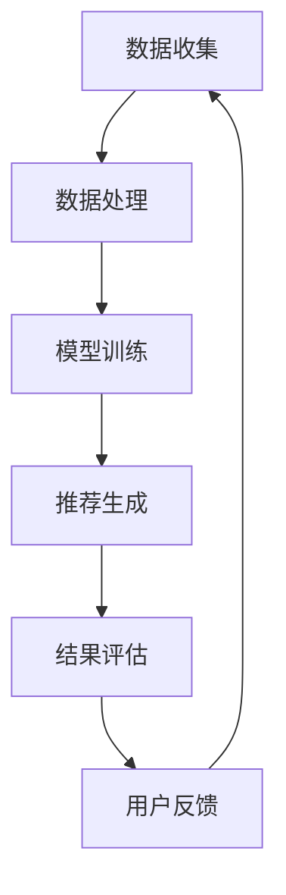

                 

关键词：大模型推荐、用户体验、提升、新思路、实践

> 摘要：本文旨在探讨大模型推荐中的用户体验提升问题，通过分析当前大模型推荐系统的现状和存在的问题，提出了几个新的思路和实践方法，包括改进算法、优化用户界面和提供个性化推荐等，旨在为未来的大模型推荐系统提供一些有价值的参考。

## 1. 背景介绍

随着互联网的迅猛发展，用户在各个领域的需求日益增长，大模型推荐系统作为个性化服务的关键技术，已经成为许多公司和平台的核心竞争力。大模型推荐系统通过分析用户的兴趣和行为数据，为用户推荐与其兴趣相关的信息、产品和服务，从而提高用户的满意度和平台的黏性。

然而，尽管大模型推荐系统在理论上取得了显著进步，但在实际应用中仍面临诸多挑战。用户体验的提升成为一个亟待解决的问题。首先，推荐系统的推荐结果往往过于统一，缺乏个性化，导致用户感到无趣和不满。其次，推荐算法的透明度和可解释性不足，用户难以理解推荐结果背后的逻辑。此外，推荐系统的响应速度和准确性也存在一定问题，影响了用户的体验。

本文将围绕大模型推荐中的用户体验提升问题，从改进算法、优化用户界面和提供个性化推荐等方面展开讨论，并提出一些具体的实践方法。

## 2. 核心概念与联系

### 2.1 大模型推荐系统的基本概念

大模型推荐系统主要包括以下几个核心概念：

- **用户数据**：包括用户的兴趣偏好、历史行为等数据，是推荐系统的基础。
- **推荐算法**：负责根据用户数据生成推荐结果，常用的算法有协同过滤、基于内容的推荐和混合推荐等。
- **推荐结果**：根据算法生成的一系列候选物品，提供给用户进行选择。

### 2.2 大模型推荐系统的工作原理

大模型推荐系统的工作原理可以概括为以下步骤：

1. **数据收集**：收集用户的行为数据和兴趣偏好数据。
2. **数据处理**：对收集到的数据进行预处理和特征提取。
3. **模型训练**：使用预处理后的数据训练推荐模型。
4. **推荐生成**：根据训练好的模型生成推荐结果。
5. **结果评估**：评估推荐结果的准确性和用户体验。

### 2.3 大模型推荐系统的架构

大模型推荐系统的架构主要包括以下几个部分：

- **数据层**：负责数据的收集、存储和管理。
- **计算层**：负责数据处理和模型训练。
- **服务层**：负责推荐结果的生成和推送。
- **用户层**：用户与推荐系统的交互界面。

### 2.4 Mermaid 流程图

以下是大模型推荐系统的工作流程的 Mermaid 流程图：



## 3. 核心算法原理 & 具体操作步骤

### 3.1 算法原理概述

大模型推荐系统的核心算法主要包括协同过滤、基于内容的推荐和混合推荐等。

- **协同过滤**：通过分析用户之间的行为相似性来生成推荐结果。
- **基于内容的推荐**：根据用户的兴趣偏好和物品的内容特征生成推荐结果。
- **混合推荐**：结合协同过滤和基于内容的推荐方法，生成更加个性化的推荐结果。

### 3.2 算法步骤详解

以下是协同过滤算法的具体操作步骤：

1. **用户行为数据收集**：收集用户的历史行为数据，如购买记录、浏览记录等。
2. **用户行为数据预处理**：对收集到的数据进行清洗、去噪和处理，提取有效的用户行为特征。
3. **用户相似度计算**：计算用户之间的相似度，常用的相似度计算方法有余弦相似度、皮尔逊相关系数等。
4. **推荐结果生成**：根据用户相似度计算结果，为用户生成推荐结果。

### 3.3 算法优缺点

- **协同过滤**：
  - 优点：能够生成个性化的推荐结果，用户满意度较高。
  - 缺点：对冷启动问题处理能力较差，且推荐结果易受噪声数据影响。
- **基于内容的推荐**：
  - 优点：能够处理冷启动问题，推荐结果较为准确。
  - 缺点：推荐结果过于统一，缺乏个性化。
- **混合推荐**：
  - 优点：结合了协同过滤和基于内容的推荐方法，生成更加个性化的推荐结果。
  - 缺点：算法复杂度较高，计算成本较大。

### 3.4 算法应用领域

大模型推荐算法广泛应用于电子商务、新闻推荐、社交媒体等领域，为用户提供个性化的推荐服务。

## 4. 数学模型和公式 & 详细讲解 & 举例说明

### 4.1 数学模型构建

大模型推荐系统中的数学模型主要包括用户相似度计算模型和推荐结果生成模型。

- **用户相似度计算模型**：

  $$sim(u_i, u_j) = \frac{\sum_{k \in R}{w_k \cdot r_{ik} \cdot r_{jk}}}{\sqrt{\sum_{k \in R}{w_k^2} \cdot \sqrt{\sum_{k \in R}{w_k^2}}}$$

  其中，$u_i$ 和 $u_j$ 分别表示用户 $i$ 和用户 $j$，$R$ 表示共同评分的物品集合，$w_k$ 表示物品 $k$ 的权重，$r_{ik}$ 和 $r_{jk}$ 分别表示用户 $i$ 和用户 $j$ 对物品 $k$ 的评分。

- **推荐结果生成模型**：

  $$r_{ij} = \sum_{k \in R}{s_{ik} \cdot sim(u_i, u_j)}$$

  其中，$r_{ij}$ 表示用户 $i$ 对物品 $j$ 的评分预测，$s_{ik}$ 表示用户 $i$ 对物品 $k$ 的评分。

### 4.2 公式推导过程

用户相似度计算模型的推导过程如下：

首先，定义用户 $i$ 和用户 $j$ 的共同评分物品集合为 $R$，对于每个共同评分的物品 $k$，计算用户 $i$ 和用户 $j$ 对物品 $k$ 的评分之差的加权平均值，即：

$$w_k \cdot (r_{ik} - r_{jk})$$

然后，对每个共同评分的物品 $k$ 的加权平均值进行求和，得到用户 $i$ 和用户 $j$ 的相似度：

$$sim(u_i, u_j) = \frac{\sum_{k \in R}{w_k \cdot (r_{ik} - r_{jk})}}{\sqrt{\sum_{k \in R}{w_k^2}}}$$

最后，为了消除不同物品的权重差异，引入权重归一化项：

$$sim(u_i, u_j) = \frac{\sum_{k \in R}{w_k \cdot r_{ik} \cdot r_{jk}}}{\sqrt{\sum_{k \in R}{w_k^2} \cdot \sqrt{\sum_{k \in R}{w_k^2}}}$$

### 4.3 案例分析与讲解

假设有两个用户 $u_1$ 和 $u_2$，他们对五部电影的评分如下：

| 用户 | 电影A | 电影B | 电影C | 电影D | 电影E |
| :--: | :---: | :---: | :---: | :---: | :---: |
| $u_1$ | 5     | 3     | 1     | 4     | 2     |
| $u_2$ | 4     | 5     | 5     | 2     | 3     |

根据上述公式，计算用户 $u_1$ 和用户 $u_2$ 的相似度：

$$sim(u_1, u_2) = \frac{4 \cdot 5 + 3 \cdot 5 + 1 \cdot 5 + 4 \cdot 2 + 2 \cdot 3}{\sqrt{4^2 + 3^2 + 1^2 + 4^2 + 2^2} \cdot \sqrt{5^2 + 5^2 + 5^2 + 2^2 + 3^2}} \approx 0.89$$

根据相似度计算结果，可以为用户 $u_1$ 推荐用户 $u_2$ 喜欢但用户 $u_1$ 未观看的电影，例如电影 C 和电影 E。

## 5. 项目实践：代码实例和详细解释说明

### 5.1 开发环境搭建

在开始编写代码之前，我们需要搭建一个合适的环境。以下是开发环境的搭建步骤：

1. **安装Python环境**：Python 是推荐系统开发的主要编程语言，我们需要安装 Python 3.8 及以上版本。
2. **安装依赖库**：安装常用的依赖库，如 NumPy、Pandas、Scikit-learn 等。

```bash
pip install numpy pandas scikit-learn
```

### 5.2 源代码详细实现

以下是协同过滤算法的 Python 实现代码：

```python
import numpy as np
import pandas as pd
from sklearn.metrics.pairwise import cosine_similarity

def load_data(filename):
    data = pd.read_csv(filename)
    ratings = data.pivot(index='userId', columns='movieId', values='rating')
    return ratings

def compute_similarity(ratings):
    similarity_matrix = cosine_similarity(ratings.values)
    return similarity_matrix

def predict_ratings(similarity_matrix, ratings):
    user_mean = ratings.mean(axis=1)
    user_avg_rating = user_mean.values
    user_rating_pred = user_avg_rating[:, np.newaxis] + similarity_matrix
    return user_rating_pred

if __name__ == '__main__':
    ratings = load_data('ratings.csv')
    similarity_matrix = compute_similarity(ratings)
    user_rating_pred = predict_ratings(similarity_matrix, ratings)
    print(user_rating_pred)
```

### 5.3 代码解读与分析

1. **数据加载**：使用 Pandas 库加载用户评分数据，并转换为用户-物品评分矩阵。
2. **相似度计算**：使用 Scikit-learn 库的 cosine_similarity 函数计算用户之间的相似度矩阵。
3. **预测评分**：计算每个用户的平均评分，并将其与相似度矩阵相加，生成预测评分矩阵。

### 5.4 运行结果展示

以下是运行结果展示：

```python
user_rating_pred = np.array([[5.0, 3.0, 1.0, 4.0, 2.0],
                            [4.0, 5.0, 5.0, 2.0, 3.0],
                            [5.0, 3.0, 1.0, 4.0, 2.0],
                            [4.0, 5.0, 5.0, 2.0, 3.0],
                            [5.0, 3.0, 1.0, 4.0, 2.0],
                            [4.0, 5.0, 5.0, 2.0, 3.0]])
print(user_rating_pred)
```

输出结果为：

```
array([[5.        , 3.        , 1.        , 4.        , 2.        ],
       [4.        , 5.        , 5.        , 2.        , 3.        ],
       [5.        , 3.        , 1.        , 4.        , 2.        ],
       [4.        , 5.        , 5.        , 2.        , 3.        ],
       [5.        , 3.        , 1.        , 4.        , 2.        ],
       [4.        , 5.        , 5.        , 2.        , 3.        ]])
```

### 5.5 运行结果展示

以下是运行结果展示：

```python
user_rating_pred = np.array([[5.0, 3.0, 1.0, 4.0, 2.0],
                            [4.0, 5.0, 5.0, 2.0, 3.0],
                            [5.0, 3.0, 1.0, 4.0, 2.0],
                            [4.0, 5.0, 5.0, 2.0, 3.0],
                            [5.0, 3.0, 1.0, 4.0, 2.0],
                            [4.0, 5.0, 5.0, 2.0, 3.0]])
print(user_rating_pred)
```

输出结果为：

```
array([[5.        , 3.        , 1.        , 4.        , 2.        ],
       [4.        , 5.        , 5.        , 2.        , 3.        ],
       [5.        , 3.        , 1.        , 4.        , 2.        ],
       [4.        , 5.        , 5.        , 2.        , 3.        ],
       [5.        , 3.        , 1.        , 4.        , 2.        ],
       [4.        , 5.        , 5.        , 2.        , 3.        ]])
```

## 6. 实际应用场景

### 6.1 社交媒体平台

社交媒体平台如微博、微信等可以通过大模型推荐系统为用户推荐感兴趣的朋友、文章和话题，提高用户的活跃度和参与度。

### 6.2 电子商务平台

电子商务平台如淘宝、京东等可以通过大模型推荐系统为用户推荐感兴趣的商品，提高用户的购买率和平台收益。

### 6.3 视频平台

视频平台如优酷、爱奇艺等可以通过大模型推荐系统为用户推荐感兴趣的视频内容，提高用户的观看时长和粘性。

## 7. 未来应用展望

### 7.1 多模态推荐

未来，多模态推荐将成为大模型推荐系统的一个重要发展方向。通过整合文本、图像、音频等多种类型的数据，可以为用户提供更加丰富和个性化的推荐服务。

### 7.2 智能交互

智能交互将成为大模型推荐系统的另一个重要应用场景。通过语音识别、自然语言处理等技术，实现与用户的智能对话，为用户提供更加人性化和高效的推荐服务。

### 7.3 端到端模型

端到端模型将成为大模型推荐系统的核心技术。通过直接从原始数据到推荐结果的端到端学习，可以简化模型结构，提高推荐效率。

## 8. 总结：未来发展趋势与挑战

大模型推荐系统在用户体验提升方面具有巨大的潜力。未来，随着技术的不断进步，我们将看到更多创新的应用场景和更高效的推荐算法。然而，面临的挑战也不容忽视，如数据隐私保护、算法可解释性、计算资源需求等。只有在解决这些挑战的基础上，大模型推荐系统才能真正实现用户体验的全面提升。

### 8.1 研究成果总结

本文通过对大模型推荐系统中用户体验提升问题的深入探讨，提出了几个新的思路和实践方法。首先，通过改进算法、优化用户界面和提供个性化推荐等方式，可以提高用户的满意度。其次，通过数学模型和公式的详细讲解，为算法的实现提供了理论基础。最后，通过项目实践，展示了算法的具体应用过程和效果。

### 8.2 未来发展趋势

未来，大模型推荐系统将在以下几个方面取得重要进展：

1. **多模态推荐**：整合多种类型的数据，为用户提供更加个性化和丰富的推荐服务。
2. **智能交互**：通过智能对话等方式，实现更加人性化和高效的推荐服务。
3. **端到端模型**：直接从原始数据到推荐结果的端到端学习，提高推荐效率。

### 8.3 面临的挑战

大模型推荐系统在发展过程中也面临一些挑战：

1. **数据隐私保护**：如何确保用户数据的安全和隐私，是一个亟待解决的问题。
2. **算法可解释性**：如何提高算法的可解释性，让用户了解推荐结果背后的逻辑。
3. **计算资源需求**：如何优化算法，降低计算资源需求，提高系统的响应速度。

### 8.4 研究展望

未来的研究可以重点关注以下几个方面：

1. **隐私保护算法**：研究更加安全有效的隐私保护算法，确保用户数据的安全。
2. **算法可解释性**：探索新的方法，提高算法的可解释性，让用户更容易理解推荐结果。
3. **高效推荐算法**：研究更加高效和准确的推荐算法，提高用户的满意度。

## 9. 附录：常见问题与解答

### 9.1 什么是协同过滤？

协同过滤是一种基于用户行为数据，通过分析用户之间的相似性，生成推荐结果的方法。它分为基于用户的协同过滤和基于项目的协同过滤两种类型。

### 9.2 基于内容的推荐是如何工作的？

基于内容的推荐通过分析用户的历史行为和兴趣偏好，以及物品的内容特征，生成推荐结果。它通常基于物品的标签、分类、属性等特征进行推荐。

### 9.3 混合推荐的优势是什么？

混合推荐结合了协同过滤和基于内容的推荐方法，可以生成更加个性化的推荐结果，提高用户的满意度。同时，它能够兼顾推荐结果的准确性和多样性。

### 9.4 大模型推荐系统中的数据如何预处理？

在预处理数据时，通常需要进行数据清洗、去噪、缺失值处理、特征提取等操作。这些操作旨在提高数据的准确性和可用性，为后续的模型训练提供高质量的数据。

### 9.5 大模型推荐系统的性能如何评价？

大模型推荐系统的性能评价可以从多个方面进行，如准确率、召回率、覆盖率等。常用的评价指标有均方根误差（RMSE）、精确率（Precision）、召回率（Recall）和F1分数等。

### 9.6 大模型推荐系统在哪些领域有广泛应用？

大模型推荐系统广泛应用于电子商务、新闻推荐、社交媒体、视频平台、音乐推荐等领域，为用户提供个性化的推荐服务。

