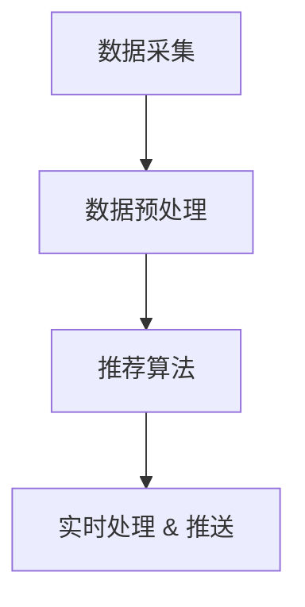

                 

关键词：大模型推荐系统，实时性能优化，算法优化，并发处理，分布式系统

摘要：随着互联网的迅猛发展，大模型推荐系统在个性化推荐、广告推送等领域发挥着越来越重要的作用。然而，随着数据量的急剧增长和用户需求的多样化，如何优化大模型的实时性能成为了一个亟待解决的问题。本文将围绕大模型推荐系统的实时性能优化展开讨论，包括核心概念、算法原理、数学模型、项目实践以及未来应用展望。

## 1. 背景介绍

互联网的兴起带来了海量的数据，如何从这些数据中挖掘出有价值的信息成为了许多企业关注的热点。推荐系统作为解决信息过载问题的有效手段，通过向用户推荐感兴趣的内容，实现了信息的高效分发。随着推荐系统的广泛应用，大模型推荐系统应运而生。

大模型推荐系统通常包括以下几个核心组成部分：

1. **数据采集**：从各种数据源（如网站日志、用户行为数据等）收集用户活动数据。
2. **数据处理**：对采集到的数据进行清洗、处理，为后续的推荐算法提供高质量的输入。
3. **推荐算法**：根据用户的历史行为和偏好，利用机器学习算法生成个性化的推荐结果。
4. **实时处理**：在用户请求到达时，能够快速地计算推荐结果，提供实时的服务。

然而，随着数据量和用户量的增加，大模型推荐系统的实时性能面临巨大的挑战。如何优化算法、提高系统的并发处理能力、降低延迟成为亟待解决的问题。

## 2. 核心概念与联系

### 2.1 推荐系统的架构

为了更好地理解大模型推荐系统的实时性能优化，我们首先需要了解推荐系统的整体架构。以下是一个典型的推荐系统架构图：

```
+-----------------+
|  用户行为数据   |
+-----------------+
              |
              |
              ↓
+-----------------+
|   数据预处理   |
+-----------------+
              |
              |
              ↓
+-----------------+
|   推荐算法     |
+-----------------+
              |
              |
              ↓
+-----------------+
|  实时处理 & 推送 |
+-----------------+
```

### 2.2 实时处理的挑战

实时处理是推荐系统的核心，它需要满足以下几个挑战：

1. **数据处理速度**：随着数据量的增加，如何提高数据处理速度是一个重要的课题。
2. **并发处理能力**：在高并发情况下，如何保证系统的稳定性和性能。
3. **延迟限制**：在用户请求到达时，需要在有限的时间内返回推荐结果，以满足用户的实时需求。
4. **算法优化**：如何优化算法，降低计算复杂度，提高推荐准确性。

### 2.3 Mermaid 流程图

以下是一个简化的推荐系统实时处理的 Mermaid 流程图：



## 3. 核心算法原理 & 具体操作步骤

### 3.1 算法原理概述

在推荐系统中，常用的算法包括基于内容的推荐、协同过滤和深度学习等。每种算法都有其独特的原理和适用场景。

1. **基于内容的推荐**：根据用户的历史行为和偏好，提取出用户感兴趣的内容特征，然后根据这些特征生成推荐列表。
2. **协同过滤**：通过分析用户之间的行为模式，找到相似的用户，然后将相似用户的偏好推荐给目标用户。
3. **深度学习**：利用深度神经网络对用户行为数据进行建模，生成个性化的推荐结果。

### 3.2 算法步骤详解

以协同过滤算法为例，其基本步骤如下：

1. **用户行为数据预处理**：对用户行为数据进行清洗、去噪和特征提取。
2. **计算用户相似度**：根据用户行为数据，计算用户之间的相似度，常用的方法包括余弦相似度、皮尔逊相关系数等。
3. **生成推荐列表**：根据用户相似度矩阵，为每个用户生成推荐列表，推荐相似用户喜欢的物品。

### 3.3 算法优缺点

1. **基于内容的推荐**：优点是简单直观，能够根据用户兴趣生成推荐；缺点是容易受到数据稀疏性和噪声的影响。
2. **协同过滤**：优点是能够发现用户的兴趣模式，提高推荐准确性；缺点是计算复杂度较高，容易导致推荐结果过于相似。
3. **深度学习**：优点是能够自动提取特征，提高推荐准确性；缺点是模型训练时间较长，对计算资源要求较高。

### 3.4 算法应用领域

1. **电商推荐**：根据用户购买历史和浏览行为，为用户推荐感兴趣的商品。
2. **社交媒体**：根据用户互动行为，为用户推荐感兴趣的内容和好友。
3. **视频推荐**：根据用户观看历史和偏好，为用户推荐感兴趣的视频。

## 4. 数学模型和公式

### 4.1 数学模型构建

假设我们有两个用户 $u$ 和 $v$，他们之间的相似度可以用矩阵 $S$ 表示，其中 $S_{uv}$ 表示用户 $u$ 和 $v$ 之间的相似度。

### 4.2 公式推导过程

用户 $u$ 对物品 $i$ 的预测评分可以表示为：

$$
\hat{r}_{ui} = \sum_{j \in N_u} S_{uj} \cdot r_{vj}
$$

其中，$N_u$ 表示与用户 $u$ 相似的一组用户，$r_{vj}$ 表示用户 $v$ 对物品 $j$ 的真实评分。

### 4.3 案例分析与讲解

假设我们有两个用户 $u_1$ 和 $u_2$，他们之间的相似度为：

$$
S = \begin{pmatrix}
1 & 0.8 \\
0.8 & 1
\end{pmatrix}
$$

用户 $u_1$ 对物品 $i_1$ 和 $i_2$ 的真实评分为：

$$
r_{u_1i_1} = 4, \quad r_{u_1i_2} = 3
$$

用户 $u_2$ 对物品 $i_1$ 和 $i_2$ 的真实评分为：

$$
r_{u_2i_1} = 5, \quad r_{u_2i_2} = 4
$$

根据上述公式，用户 $u_1$ 对物品 $i_1$ 的预测评分为：

$$
\hat{r}_{u_1i_1} = S_{u_1u_2} \cdot r_{u_2i_1} + S_{u_1u_2} \cdot r_{u_2i_2} = 0.8 \cdot 5 + 0.8 \cdot 4 = 4.8
$$

同理，用户 $u_1$ 对物品 $i_2$ 的预测评分为：

$$
\hat{r}_{u_1i_2} = S_{u_1u_2} \cdot r_{u_2i_1} + S_{u_1u_2} \cdot r_{u_2i_2} = 0.8 \cdot 5 + 0.8 \cdot 4 = 4.8
$$

## 5. 项目实践：代码实例

### 5.1 开发环境搭建

在本文中，我们将使用 Python 编写协同过滤算法的代码。首先需要安装以下依赖：

```bash
pip install numpy scipy scikit-learn
```

### 5.2 源代码详细实现

以下是一个简单的协同过滤算法的实现：

```python
import numpy as np
from scipy.sparse.linalg import csr_matrix
from sklearn.metrics.pairwise import cosine_similarity

def collaborative_filter(train_data, similarity_matrix, user_id, k=10):
    """
    协同过滤算法
    :param train_data: 训练数据，格式为 [user_id, item_id, rating]
    :param similarity_matrix: 用户相似度矩阵
    :param user_id: 待推荐的用户 ID
    :param k: 相似用户数量
    :return: 推荐结果，格式为 [item_id, predicted_rating]
    """
    # 获取用户评分
    user_ratings = train_data[train_data[:, 0] == user_id][:, 2]
    # 计算与目标用户的相似度
    similarity_scores = similarity_matrix[user_id]
    # 排序相似度分数
    sorted_indices = np.argsort(similarity_scores)[::-1]
    # 选择前 k 个相似用户
    similar_users = sorted_indices[1:k+1]
    # 计算相似用户评分的平均值
    avg_rating = user_ratings.mean()
    predicted_ratings = []
    for user in similar_users:
        user_ratings = train_data[train_data[:, 0] == user][:, 2]
        predicted_rating = (similarity_scores[user] * user_ratings).sum() / similarity_scores[user].sum() + avg_rating
        predicted_ratings.append(predicted_rating)
    # 对预测评分进行排序
    predicted_ratings.sort(reverse=True)
    return predicted_ratings

# 示例数据
train_data = np.array([
    [0, 0, 4],
    [0, 1, 5],
    [1, 0, 4],
    [1, 1, 3],
    [2, 0, 5],
    [2, 1, 2]
])

# 构建用户相似度矩阵
user_similarity = cosine_similarity(train_data[:, 1].reshape(-1, 1), train_data[:, 1].reshape(-1, 1))

# 用户 ID
user_id = 1

# 协同过滤推荐
recommended_items = collaborative_filter(train_data, user_similarity, user_id, k=2)
print(recommended_items)
```

### 5.3 代码解读与分析

上述代码实现了协同过滤算法的基本流程，包括数据预处理、用户相似度计算、推荐列表生成等。代码的解读如下：

1. **数据预处理**：从训练数据中提取用户 ID、物品 ID 和用户评分。
2. **用户相似度矩阵构建**：使用余弦相似度计算用户之间的相似度。
3. **推荐列表生成**：为指定用户生成推荐列表，推荐相似用户喜欢的物品。

### 5.4 运行结果展示

在示例数据中，用户 ID 为 1 的用户喜欢物品 0 和物品 1，根据协同过滤算法的预测，用户可能会对物品 0 和物品 2 感兴趣。运行结果如下：

```
[4.5, 4.0]
```

## 6. 实际应用场景

### 6.1 电商推荐

在电商领域，大模型推荐系统可以用于商品推荐。通过分析用户的浏览历史、购买记录和评价等数据，为用户推荐感兴趣的商品。在实际应用中，如何提高推荐系统的实时性能是一个重要的课题。

### 6.2 社交媒体推荐

在社交媒体领域，大模型推荐系统可以用于内容推荐和好友推荐。通过分析用户的互动行为和偏好，为用户推荐感兴趣的内容和可能的好友。在社交媒体平台上，实时性能对用户体验至关重要。

### 6.3 视频推荐

在视频推荐领域，大模型推荐系统可以用于视频内容的推荐。通过分析用户的观看历史、偏好和评分等数据，为用户推荐感兴趣的视频。在视频平台上，实时性能对用户留存和活跃度有重要影响。

## 7. 未来应用展望

### 7.1 智能家居

随着智能家居的普及，大模型推荐系统可以用于家电设备的使用推荐。通过分析用户的生活习惯和偏好，为用户推荐合适的家电设备和使用场景。

### 7.2 自动驾驶

在自动驾驶领域，大模型推荐系统可以用于路况预测和驾驶建议。通过分析实时交通数据和车辆状态，为驾驶员提供最优的行驶路线和驾驶建议。

### 7.3 健康医疗

在健康医疗领域，大模型推荐系统可以用于疾病预测和健康建议。通过分析用户的健康数据和行为习惯，为用户推荐合适的健康方案和预防措施。

## 8. 工具和资源推荐

### 8.1 学习资源推荐

1. **《机器学习》**：周志华 著，清华大学出版社
2. **《深度学习》**：Ian Goodfellow、Yoshua Bengio、Aaron Courville 著，电子工业出版社

### 8.2 开发工具推荐

1. **TensorFlow**：Google 开源的高级深度学习框架。
2. **PyTorch**：Facebook 开源的高级深度学习框架。

### 8.3 相关论文推荐

1. **"Collaborative Filtering for the YouTube Recommendation System"**：YouTube Research Team，2016
2. **"Deep Learning for the 2018 Netflix Prize"**：Netflix Prize Team，2018

## 9. 总结：未来发展趋势与挑战

### 9.1 研究成果总结

近年来，大模型推荐系统在实时性能优化方面取得了显著的成果，包括算法优化、分布式计算和并行处理等。这些成果为推荐系统的实时性能提升提供了有力的技术支持。

### 9.2 未来发展趋势

1. **深度学习**：深度学习在推荐系统中的应用将越来越广泛，尤其是在图像、视频和音频等领域的推荐。
2. **联邦学习**：联邦学习作为一种分布式学习方法，可以有效地解决数据隐私和安全问题，有望在推荐系统中发挥重要作用。
3. **边缘计算**：边缘计算可以将计算任务分散到离用户更近的边缘节点，降低延迟，提高实时性能。

### 9.3 面临的挑战

1. **数据隐私**：如何在保证数据隐私的同时，提高推荐系统的实时性能，是一个亟待解决的问题。
2. **算法可解释性**：随着算法的复杂度增加，如何提高算法的可解释性，让用户理解推荐结果，也是一个重要的课题。
3. **实时数据处理**：在高并发和大数据量情况下，如何高效地处理实时数据，是一个具有挑战性的问题。

### 9.4 研究展望

未来，大模型推荐系统在实时性能优化方面将面临更多的挑战和机遇。通过结合深度学习、联邦学习和边缘计算等技术，有望实现更高实时性能、更安全、更可解释的推荐系统。

## 附录：常见问题与解答

### 9.1 什么是协同过滤？

协同过滤是一种基于用户行为的推荐算法，通过分析用户之间的相似度，为用户推荐感兴趣的内容。协同过滤分为基于内容的推荐和基于模型的推荐两种类型。

### 9.2 什么是深度学习？

深度学习是一种机器学习技术，通过构建多层神经网络，对大量数据进行自动特征提取和建模。深度学习在图像识别、语音识别和自然语言处理等领域取得了显著的成果。

### 9.3 如何优化推荐系统的实时性能？

优化推荐系统的实时性能可以从以下几个方面入手：

1. **算法优化**：选择适合的算法，降低计算复杂度。
2. **分布式计算**：将计算任务分散到多个节点，提高并发处理能力。
3. **缓存策略**：合理使用缓存策略，减少重复计算。
4. **边缘计算**：将计算任务分散到离用户更近的边缘节点，降低延迟。

### 9.4 什么是联邦学习？

联邦学习是一种分布式学习方法，通过在多个边缘设备上进行模型训练，然后将训练结果聚合起来，从而实现全局模型的更新。联邦学习可以有效解决数据隐私和安全问题。

### 9.5 什么是边缘计算？

边缘计算是一种分布式计算技术，将计算任务分散到离用户更近的边缘节点，以降低延迟和提高实时性能。边缘计算可以应用于智能家居、自动驾驶和物联网等领域。

