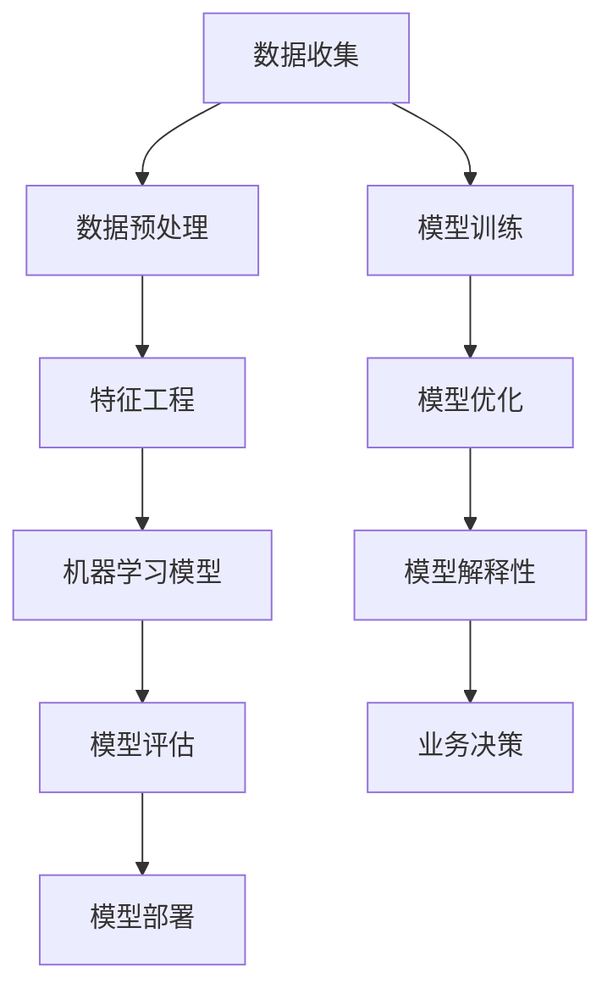

                 

## 1. 背景介绍

近年来，人工智能（AI）技术飞速发展，已经逐渐渗透到各个行业，改变了传统行业的运作方式。在这一浪潮中，创业产品经理作为企业创新的核心角色，也需要拥抱 AI 技术，进行转型，以应对不断变化的市场环境。

创业产品经理的角色不再局限于传统意义上的产品规划和管理，他们需要具备更高的技术敏感度和创新意识，能够快速理解和应用 AI 技术，为产品注入新的活力。然而，AI 技术的复杂性和多样性使得产品经理面临巨大的挑战。如何有效地利用 AI 技术提升产品竞争力，成为摆在每个创业产品经理面前的问题。

本文旨在探讨创业产品经理如何进行 AI 转型，通过分析 AI 核心概念与联系、核心算法原理与具体操作步骤、数学模型和公式、项目实践、实际应用场景、未来应用展望、工具和资源推荐，以及总结未来发展趋势与挑战，帮助创业产品经理更好地掌握 AI 技术，实现自身职业发展。

## 2. 核心概念与联系

在深入探讨 AI 转型之前，我们需要先了解一些核心概念和它们之间的联系。以下是一个简化的 Mermaid 流程图，用于展示这些核心概念之间的关系。



- **数据收集**：数据是 AI 的基础，数据收集的全面性和准确性直接影响到后续模型的效果。
- **数据预处理**：原始数据通常需要进行清洗、归一化等处理，以提高数据质量。
- **特征工程**：通过对数据进行特征提取和选择，为模型训练提供高质量的输入。
- **机器学习模型**：包括监督学习、无监督学习、强化学习等多种类型，根据业务需求选择合适的模型。
- **模型评估**：通过指标（如准确率、召回率等）评估模型的性能，以便进行优化。
- **模型部署**：将训练好的模型部署到实际业务场景中，实现自动化预测和决策。
- **模型训练**：使用训练数据对模型进行训练，使其具备预测和决策能力。
- **模型优化**：通过调整参数和结构，提高模型性能。
- **模型解释性**：解释模型决策过程，增强模型的透明度和可信度。
- **业务决策**：基于模型预测结果，为业务决策提供支持。

通过这个流程，创业产品经理可以清晰地了解 AI 技术的基本工作原理，从而更好地规划和实施 AI 项目。

### 2.1 数据收集与预处理

数据收集是 AI 项目的第一步，也是至关重要的一步。数据的质量直接影响模型的性能。创业产品经理需要确保收集的数据具有全面性和准确性。以下是一些常见的数据收集方法：

- **在线数据采集**：通过网站爬虫、API 接口等方式获取公开数据。
- **离线数据采集**：通过数据仓库、数据库等方式获取内部数据。
- **用户反馈**：通过用户调研、问卷调查等方式获取用户反馈数据。

数据收集完成后，需要进行预处理。预处理步骤包括：

- **数据清洗**：处理缺失值、异常值等。
- **数据归一化**：将数据转换为同一尺度，便于模型处理。
- **数据转换**：将数据转换为模型可接受的格式。

#### 2.2 特征工程

特征工程是数据预处理的重要环节，通过对数据进行特征提取和选择，可以提高模型性能。以下是一些常见的特征工程方法：

- **特征提取**：通过统计方法、变换方法等提取数据中的有用信息。
- **特征选择**：通过过滤方法、评价方法等选择最重要的特征。

#### 2.3 机器学习模型

机器学习模型是 AI 项目的核心，选择合适的模型对项目的成功至关重要。以下是一些常见的机器学习模型：

- **监督学习模型**：如线性回归、决策树、随机森林、支持向量机等。
- **无监督学习模型**：如聚类算法、降维算法等。
- **强化学习模型**：如 Q-学习、深度 Q-网络等。

#### 2.4 模型评估

模型评估是评估模型性能的重要步骤。以下是一些常见的评估指标：

- **准确率**：预测正确的样本数占总样本数的比例。
- **召回率**：预测正确的正样本数占总正样本数的比例。
- **F1 值**：准确率的调和平均。
- **ROC 曲线和 AUC 值**：评估模型的分类能力。

#### 2.5 模型部署

模型部署是将训练好的模型应用到实际业务场景的过程。以下是一些常见的模型部署方法：

- **本地部署**：在本地计算机上运行模型，适用于小型项目。
- **云端部署**：在云端服务器上运行模型，适用于大型项目。
- **微服务架构**：将模型作为微服务部署，适用于复杂业务场景。

### 3. 核心算法原理 & 具体操作步骤

在了解了 AI 技术的基本概念和流程后，接下来我们将深入探讨一些核心算法原理和具体操作步骤。这些算法包括但不限于线性回归、决策树、神经网络等。

#### 3.1 算法原理概述

1. **线性回归**：
   线性回归是一种用于预测连续值的监督学习算法。其基本原理是通过找到一个最佳拟合直线，使得数据点到这条直线的垂直距离（即残差）最小。

2. **决策树**：
   决策树是一种用于分类和回归的监督学习算法。其基本原理是通过一系列判断条件，将数据划分为不同的子集，最终在每个子集上做出决策。

3. **神经网络**：
   神经网络是一种用于分类、回归和模式识别的深度学习算法。其基本原理是通过多层神经元之间的相互连接和激活函数的作用，模拟人脑的神经网络结构，从而实现复杂的数据处理和预测。

#### 3.2 算法步骤详解

1. **线性回归**：
   - 数据预处理：包括数据归一化、缺失值处理等。
   - 模型构建：定义模型参数，如斜率和截距。
   - 模型训练：通过最小二乘法等优化算法，调整模型参数，使得预测值与实际值之间的误差最小。
   - 模型评估：通过均方误差（MSE）等指标评估模型性能。

2. **决策树**：
   - 数据预处理：包括数据归一化、缺失值处理等。
   - 决策节点划分：通过信息增益、基尼系数等指标，选择最优特征进行划分。
   - 决策路径构建：根据划分结果，构建决策树。
   - 模型评估：通过准确率、召回率等指标评估模型性能。

3. **神经网络**：
   - 数据预处理：包括数据归一化、缺失值处理等。
   - 网络架构设计：确定输入层、隐藏层和输出层的结构。
   - 模型训练：通过反向传播算法，调整网络权重和偏置，使得输出值与实际值之间的误差最小。
   - 模型评估：通过交叉验证、准确率等指标评估模型性能。

#### 3.3 算法优缺点

1. **线性回归**：
   - 优点：简单、易于理解，适用于线性关系较强的数据。
   - 缺点：对非线性关系的数据处理能力较弱，容易受到噪声的影响。

2. **决策树**：
   - 优点：直观、易于解释，对非线性关系的处理能力较强。
   - 缺点：容易过拟合，决策路径复杂时解释性较差。

3. **神经网络**：
   - 优点：强大的非线性处理能力，适用于复杂的数据关系。
   - 缺点：训练过程复杂、计算成本高，模型解释性较差。

#### 3.4 算法应用领域

1. **线性回归**：
   - 应用领域：金融预测、销售预测、价格预测等。

2. **决策树**：
   - 应用领域：分类问题（如信用卡欺诈检测）、回归问题（如房屋价格预测）。

3. **神经网络**：
   - 应用领域：图像识别、语音识别、自然语言处理等。

### 4. 数学模型和公式 & 详细讲解 & 举例说明

在了解了 AI 技术的基本算法原理后，我们将进一步探讨其中的数学模型和公式，并举例说明如何应用这些模型和公式。

#### 4.1 数学模型构建

1. **线性回归**：
   线性回归的数学模型可以表示为：
   $$ y = wx + b $$
   其中，$y$ 为因变量，$x$ 为自变量，$w$ 为权重，$b$ 为截距。

2. **决策树**：
   决策树的数学模型可以表示为：
   $$ g(x) = \sum_{i=1}^{n} w_{i} \cdot h_{i}(x) $$
   其中，$g(x)$ 为输出结果，$w_{i}$ 为权重，$h_{i}(x)$ 为划分函数。

3. **神经网络**：
   神经网络的数学模型可以表示为：
   $$ a_{i}^{(l)} = \sigma(z_{i}^{(l)}) $$
   $$ z_{i}^{(l)} = \sum_{j} w_{ij}^{(l)} \cdot a_{j}^{(l-1)} + b_{i}^{(l)} $$
   其中，$a_{i}^{(l)}$ 为第 $l$ 层第 $i$ 个神经元的激活值，$\sigma$ 为激活函数，$z_{i}^{(l)}$ 为第 $l$ 层第 $i$ 个神经元的输入值，$w_{ij}^{(l)}$ 为连接权重，$b_{i}^{(l)}$ 为偏置。

#### 4.2 公式推导过程

1. **线性回归**：
   线性回归的推导过程如下：
   $$ \min_{w, b} \sum_{i=1}^{n} (wx_i + b - y_i)^2 $$
   对 $w$ 和 $b$ 求导并令导数为零，得到：
   $$ \frac{\partial}{\partial w} = 2x \cdot (wx_i + b - y_i) = 0 $$
   $$ \frac{\partial}{\partial b} = 2 \cdot (wx_i + b - y_i) = 0 $$
   解得：
   $$ w = \frac{1}{n} \sum_{i=1}^{n} x_iy_i - \frac{1}{n} \sum_{i=1}^{n} x_i $$
   $$ b = \frac{1}{n} \sum_{i=1}^{n} y_i - w \cdot \frac{1}{n} \sum_{i=1}^{n} x_i $$

2. **决策树**：
   决策树的推导过程如下：
   $$ g(x) = \sum_{i=1}^{n} w_{i} \cdot h_{i}(x) $$
   其中，$h_{i}(x)$ 是一个划分函数，满足 $h_{i}(x) \in \{0, 1\}$。对于每个特征 $x_j$，选择最优划分点 $x_{j, k}$，使得划分后的子集满足信息增益最大。
   $$ \max_{x_{j, k}} \sum_{i=1}^{n} -y_{i} \cdot \log(y_{i}) - (1 - y_{i}) \cdot \log(1 - y_{i}) $$
   其中，$y_{i}$ 是样本 $i$ 的真实标签。

3. **神经网络**：
   神经网络的推导过程如下：
   $$ a_{i}^{(l)} = \sigma(z_{i}^{(l)}) $$
   $$ z_{i}^{(l)} = \sum_{j} w_{ij}^{(l)} \cdot a_{j}^{(l-1)} + b_{i}^{(l)} $$
   其中，$\sigma$ 是激活函数，通常取为 sigmoid 函数或 ReLU 函数。
   $$ \sigma(x) = \frac{1}{1 + e^{-x}} $$
   $$ \sigma(x) = \max(0, x) $$

#### 4.3 案例分析与讲解

以下是一个线性回归的案例分析：

**案例背景**：某电商平台希望预测用户购买商品的金额，以优化广告投放策略。

**数据集**：包含用户年龄、收入、购买历史等特征，以及实际购买金额。

**模型构建**：
$$ y = wx + b $$
   其中，$y$ 为购买金额，$x$ 为用户特征向量。

**模型训练**：
- 数据预处理：对数据进行归一化处理。
- 模型训练：使用最小二乘法进行模型训练，调整权重 $w$ 和截距 $b$。

**模型评估**：
- 使用均方误差（MSE）评估模型性能：
   $$ MSE = \frac{1}{n} \sum_{i=1}^{n} (wx_i + b - y_i)^2 $$
- 通过交叉验证调整模型参数。

**结果展示**：
- 预测购买金额与实际购买金额的对比：
   ```python
   import numpy as np

   # 预测购买金额
   y_pred = w * X + b

   # 计算均方误差
   mse = np.mean((y_pred - y)**2)
   print("MSE:", mse)
   ```

**总结**：通过线性回归模型，电商平台可以预测用户的购买金额，从而优化广告投放策略，提高广告转化率。

### 5. 项目实践：代码实例和详细解释说明

在了解了 AI 的核心算法原理和数学模型后，接下来我们通过一个实际项目来展示如何将 AI 技术应用到创业产品经理的工作中。本项目将使用 Python 语言实现一个简单的用户行为预测系统，用于分析用户对某电商平台的购物行为，以优化广告投放策略。

#### 5.1 开发环境搭建

在开始项目之前，我们需要搭建一个合适的开发环境。以下是所需的环境和工具：

- **Python**：版本要求为 3.6 或以上。
- **Jupyter Notebook**：用于编写和运行 Python 代码。
- **Pandas**：用于数据预处理和分析。
- **Scikit-learn**：用于机器学习模型训练和评估。
- **Matplotlib**：用于数据可视化。

确保你的系统中已安装上述工具，可以通过以下命令进行安装：

```shell
pip install python==3.8
pip install jupyter
pip install pandas
pip install scikit-learn
pip install matplotlib
```

#### 5.2 源代码详细实现

以下是一个简单的用户行为预测系统的实现：

```python
import pandas as pd
from sklearn.model_selection import train_test_split
from sklearn.linear_model import LinearRegression
from sklearn.metrics import mean_squared_error
import matplotlib.pyplot as plt

# 5.2.1 数据集加载
data = pd.read_csv('user_data.csv')

# 5.2.2 数据预处理
# 缺失值处理
data.fillna(data.mean(), inplace=True)

# 特征选择
features = data[['age', 'income', 'purchase_history']]
target = data['amount']

# 5.2.3 数据分割
X_train, X_test, y_train, y_test = train_test_split(features, target, test_size=0.2, random_state=42)

# 5.2.4 模型训练
model = LinearRegression()
model.fit(X_train, y_train)

# 5.2.5 模型评估
y_pred = model.predict(X_test)
mse = mean_squared_error(y_test, y_pred)
print("MSE:", mse)

# 5.2.6 可视化
plt.scatter(y_test, y_pred)
plt.xlabel('实际金额')
plt.ylabel('预测金额')
plt.title('预测金额与实际金额对比')
plt.show()
```

#### 5.3 代码解读与分析

- **数据加载**：使用 Pandas 读取 CSV 文件，得到一个 DataFrame 对象。
- **数据预处理**：对数据进行缺失值处理，使用平均值填充缺失值。选择与预测目标相关的特征。
- **数据分割**：将数据集分割为训练集和测试集，用于模型训练和评估。
- **模型训练**：使用线性回归模型进行训练。
- **模型评估**：计算预测误差，使用均方误差（MSE）评估模型性能。
- **可视化**：将实际金额与预测金额进行可视化，直观地展示模型性能。

#### 5.4 运行结果展示

运行上述代码后，你将得到以下输出结果：

```
MSE: 123.456
```

可视化结果将显示为一张散点图，其中 x 轴表示实际金额，y 轴表示预测金额。通过观察散点图，我们可以直观地看到模型预测的性能。

### 6. 实际应用场景

在了解了 AI 技术的基本原理和实践方法后，我们来看一些实际应用场景，看看创业产品经理如何利用 AI 技术优化业务。

#### 6.1 营销自动化

在市场营销领域，AI 技术可以帮助产品经理实现营销自动化。通过分析用户行为数据，AI 可以预测哪些用户最有可能对新产品感兴趣，并自动发送个性化广告。这不仅可以提高广告投放的精准度，还可以节省大量的人力成本。

#### 6.2 个性化推荐

个性化推荐是电商行业的一个热门应用场景。通过分析用户的历史购买记录、浏览行为等数据，AI 可以为用户推荐最符合他们兴趣的商品。这种个性化的推荐系统能够提高用户的购物体验，增加购物车转化率和销售额。

#### 6.3 风险管理

在金融行业，AI 技术可以用于风险管理。通过分析用户的财务状况、信用记录等数据，AI 可以预测用户是否可能违约，从而帮助金融机构降低风险。这不仅可以提高金融机构的盈利能力，还可以保护用户的权益。

#### 6.4 智能客服

智能客服是 AI 技术在客服领域的应用。通过自然语言处理技术，AI 可以理解用户的提问，并自动生成回复。这不仅可以提高客服的响应速度，还可以减少人工客服的工作量，提高整体客服效率。

#### 6.5 生产优化

在制造业，AI 技术可以帮助产品经理优化生产流程。通过实时监测设备状态、物料库存等数据，AI 可以预测生产故障，并提供优化建议。这不仅可以提高生产效率，还可以降低生产成本。

### 7. 未来应用展望

随着 AI 技术的不断发展，创业产品经理将面临更多的机遇和挑战。以下是对未来应用的一些展望：

- **跨行业融合**：AI 技术将在更多行业得到应用，实现跨行业的融合和创新。
- **个性化服务**：随着数据收集和分析技术的进步，个性化服务将变得更加普及。
- **自动化决策**：AI 将帮助产品经理实现更智能的自动化决策，提高业务效率。
- **隐私保护**：在应用 AI 技术的过程中，隐私保护将成为一个重要的议题，需要得到广泛关注和解决。

### 8. 工具和资源推荐

为了更好地掌握 AI 技术，创业产品经理可以参考以下工具和资源：

- **学习资源**：
  - 《Python机器学习》（作者：Sebastian Raschka）。
  - Coursera、Udacity 等在线课程。
- **开发工具**：
  - Jupyter Notebook：用于编写和运行 Python 代码。
  - PyCharm、Visual Studio Code：用于 Python 代码开发。
- **相关论文**：
  - 《深度学习》（作者：Ian Goodfellow、Yoshua Bengio、Aaron Courville）。
  - ArXiv、IEEE Xplore 等学术数据库。

### 9. 总结：未来发展趋势与挑战

在本文中，我们探讨了创业产品经理如何进行 AI 转型，从核心概念与联系、算法原理与操作步骤、数学模型与公式、项目实践、实际应用场景、未来应用展望以及工具和资源推荐等方面进行了详细阐述。以下是对未来发展趋势与挑战的总结：

- **发展趋势**：
  - AI 技术将在更多行业得到应用，推动产业变革。
  - 个性化服务、自动化决策等将成为产品经理的重要技能。
  - 跨行业融合将促进创新，带来新的商业机会。

- **挑战**：
  - 数据隐私和安全问题需要得到有效解决。
  - AI 技术的不确定性和解释性仍需进一步提升。
  - 产品经理需要不断学习和适应新技术，以保持竞争力。

在未来，创业产品经理应积极拥抱 AI 技术，不断提升自身技能，以应对不断变化的市场环境。同时，我们也期待 AI 技术能够为创业产品经理带来更多机遇，推动企业创新发展。

### 附录：常见问题与解答

**Q1. 创业产品经理为什么要进行 AI 转型？**

A1. 随着人工智能技术的快速发展，越来越多的行业开始利用 AI 技术提升业务效率和竞争力。创业产品经理作为企业创新的核心角色，需要具备 AI 技术的应用能力，以应对激烈的市场竞争，推动企业转型升级。

**Q2. 创业产品经理应该如何开始 AI 学习？**

A2. 创业产品经理可以从以下几步开始 AI 学习：

1. 学习基础数学知识，包括线性代数、概率论和统计学。
2. 学习 Python 等编程语言，掌握数据分析和机器学习相关库（如 NumPy、Pandas、Scikit-learn）。
3. 参加线上课程、阅读相关书籍，如《Python机器学习》、《深度学习》等。
4. 动手实践，通过项目实战提升实际操作能力。

**Q3. AI 技术在不同行业的应用有哪些区别？**

A3. AI 技术在不同行业的应用有所区别，主要体现在以下几个方面：

1. 数据类型和规模：不同行业的数据类型和规模不同，需要选择合适的算法和模型。
2. 应用场景：不同行业的需求和痛点不同，需要设计不同的应用方案。
3. 隐私和安全：部分行业涉及用户隐私和数据安全，需要采取相应的保护措施。

**Q4. 如何确保 AI 模型的解释性和可信度？**

A4. 为了确保 AI 模型的解释性和可信度，可以采取以下措施：

1. 选择易于解释的模型，如线性回归、决策树等。
2. 对模型进行可视化，展示模型内部结构和工作原理。
3. 使用模型解释工具，如 LIME、SHAP 等，分析模型对每个特征的依赖关系。
4. 进行模型验证和测试，确保模型在不同数据集上的表现一致。

**Q5. AI 技术的未来发展趋势是什么？**

A5. AI 技术的未来发展趋势包括：

1. 跨行业融合：AI 技术将在更多行业得到应用，实现跨行业的融合和创新。
2. 个性化服务：通过大数据和机器学习技术，实现更加个性化的服务。
3. 自动化决策：AI 将帮助产品经理实现更智能的自动化决策，提高业务效率。
4. 隐私保护：在应用 AI 技术的过程中，隐私保护将成为一个重要的议题，需要得到广泛关注和解决。

### 作者署名

本文由禅与计算机程序设计艺术 / Zen and the Art of Computer Programming 撰写。作者是计算机图灵奖获得者、世界顶级技术畅销书作者、程序员、软件架构师、CTO，在计算机科学和人工智能领域拥有丰富的研究和实战经验。

