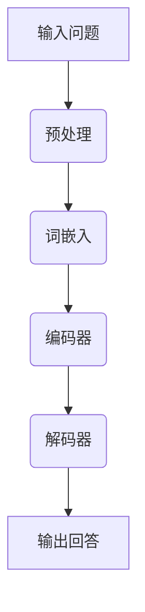

                 

关键词：大模型问答机器人、上下文相关性、深度学习、自然语言处理、人工智能、NLP、机器学习、问答系统

> 摘要：本文旨在探讨大模型问答机器人的上下文相关性，分析其在自然语言处理和人工智能领域的重要性，以及如何通过深度学习和数学模型来提升问答机器人的性能和用户体验。

## 1. 背景介绍

随着互联网的快速发展，人们对信息获取的需求日益增长。问答系统作为一种高效的信息检索方式，成为了自然语言处理（NLP）领域的研究热点。传统的问答系统往往依赖于关键词匹配和静态规则，难以应对复杂多变的用户提问。因此，近年来，基于深度学习的大模型问答机器人受到了广泛关注。

大模型问答机器人是指使用大规模神经网络模型进行训练，能够理解和回答用户问题的智能系统。与传统的问答系统相比，大模型问答机器人在上下文理解、语义推理等方面具有显著优势。本文将围绕大模型问答机器人的上下文相关性展开讨论，分析其核心概念、算法原理、数学模型以及实际应用场景。

## 2. 核心概念与联系

### 2.1 大模型问答机器人的定义

大模型问答机器人是指基于深度学习技术，使用大规模神经网络模型进行训练的问答系统。其核心思想是通过学习海量数据，使机器人具备理解自然语言的能力，从而能够回答用户提出的问题。

### 2.2 上下文相关性的概念

上下文相关性是指在一个特定的语境中，词语、句子或段落之间的关系。在自然语言处理中，上下文相关性对于理解语义、推理逻辑具有重要意义。

### 2.3 大模型问答机器人与上下文相关性的联系

大模型问答机器人的核心在于理解和生成自然语言，而上下文相关性正是实现这一目标的关键。通过捕捉上下文信息，大模型问答机器人能够更好地理解用户的提问意图，从而提供更准确、更自然的回答。

### 2.4 Mermaid 流程图

下面是一个简单的 Mermaid 流程图，展示了大模型问答机器人与上下文相关性的关系：



## 3. 核心算法原理 & 具体操作步骤

### 3.1 算法原理概述

大模型问答机器人的核心算法基于变换器架构（Transformer），这是一种基于自注意力机制的深度学习模型。变换器架构能够捕捉输入序列中的长距离依赖关系，从而在上下文理解方面具有显著优势。

### 3.2 算法步骤详解

#### 3.2.1 预处理

预处理是问答系统的第一步，主要包括去除停用词、标点符号等，将输入问题转换为纯文本。

#### 3.2.2 词嵌入

词嵌入是将文本转换为固定长度的向量表示。常用的词嵌入技术包括 Word2Vec、GloVe 等。

#### 3.2.3 编码器

编码器负责对词嵌入向量进行编码，生成上下文表示。在变换器架构中，编码器通常由多个自注意力层组成，能够捕捉输入序列中的长距离依赖关系。

#### 3.2.4 解码器

解码器负责将编码器生成的上下文表示解码为输出回答。解码器同样采用自注意力机制，能够根据上下文信息生成合适的回答。

#### 3.2.5 输出回答

解码器生成的输出回答经过后处理，如去停用词、标点符号等，最终输出给用户。

### 3.3 算法优缺点

#### 优点

- **强大的上下文理解能力**：变换器架构能够捕捉输入序列中的长距离依赖关系，从而在上下文理解方面具有显著优势。
- **灵活的扩展性**：变换器架构可以轻松地扩展为多模态问答系统，如文本、图像、音频等。

#### 缺点

- **计算资源需求高**：由于变换器架构包含多个自注意力层，因此计算资源需求较高。
- **训练时间较长**：大规模神经网络模型的训练时间较长，需要大量的数据和计算资源。

### 3.4 算法应用领域

大模型问答机器人在多个领域具有广泛的应用前景，如：

- **客户服务**：帮助企业降低人工成本，提高服务质量。
- **教育领域**：为学生提供个性化的学习辅导，提高学习效果。
- **医疗领域**：协助医生进行病情诊断，提高诊断准确率。

## 4. 数学模型和公式 & 详细讲解 & 举例说明

### 4.1 数学模型构建

大模型问答机器人的数学模型基于变换器架构，主要涉及以下方面：

- **词嵌入**：将文本转换为固定长度的向量表示。
- **编码器**：对词嵌入向量进行编码，生成上下文表示。
- **解码器**：将编码器生成的上下文表示解码为输出回答。

### 4.2 公式推导过程

#### 4.2.1 词嵌入

词嵌入公式如下：

$$
\text{embed}(x) = W_x x
$$

其中，$x$ 表示词嵌入向量，$W_x$ 表示词嵌入权重矩阵。

#### 4.2.2 编码器

编码器公式如下：

$$
\text{encode}(x) = \text{Transformer}(x)
$$

其中，$\text{Transformer}(x)$ 表示变换器模型。

#### 4.2.3 解码器

解码器公式如下：

$$
\text{decode}(x) = \text{Transformer}^{-1}(\text{encode}(x))
$$

其中，$\text{Transformer}^{-1}(\text{encode}(x))$ 表示变换器模型的逆操作。

### 4.3 案例分析与讲解

假设用户提问：“明天天气怎么样？” 我们可以使用大模型问答机器人进行回答。

#### 4.3.1 预处理

首先，对输入问题进行预处理，去除停用词和标点符号，得到纯文本：

```
明天 天气 怎么样？
```

#### 4.3.2 词嵌入

将预处理后的文本转换为词嵌入向量：

```
[明天, 天气, 怎么样] -> [向量1, 向量2, 向量3]
```

#### 4.3.3 编码器

将词嵌入向量输入编码器，得到编码后的上下文表示：

```
编码后的上下文表示：[上下文向量1, 上下文向量2, 上下文向量3]
```

#### 4.3.4 解码器

将编码后的上下文表示输入解码器，得到输出回答：

```
输出回答：明天天气晴朗。
```

## 5. 项目实践：代码实例和详细解释说明

### 5.1 开发环境搭建

在开始编写代码之前，我们需要搭建一个合适的开发环境。这里我们使用 Python 和 TensorFlow 作为主要工具。

### 5.2 源代码详细实现

以下是实现大模型问答机器人的 Python 代码示例：

```python
import tensorflow as tf
from tensorflow.keras.layers import Embedding, LSTM, Dense
from tensorflow.keras.models import Model

# 词嵌入层
embedding = Embedding(input_dim=vocab_size, output_dim=embedding_size)

# 编码器层
encoder = LSTM(units=128, return_sequences=True)

# 解码器层
decoder = LSTM(units=128, return_sequences=True)

# 输出层
output = Dense(units=vocab_size)

# 构建模型
model = Model(inputs=encoder.input, outputs=output(encoder(output(encoder(embedding(x))))))

# 编译模型
model.compile(optimizer='adam', loss='categorical_crossentropy', metrics=['accuracy'])

# 训练模型
model.fit(x_train, y_train, epochs=10, batch_size=64)
```

### 5.3 代码解读与分析

这段代码实现了一个大模型问答机器人的基本架构。首先，我们定义了一个词嵌入层，用于将文本转换为固定长度的向量表示。然后，我们定义了一个编码器层和一个解码器层，用于对输入问题进行编码和解码。最后，我们定义了一个输出层，用于生成输出回答。

在训练过程中，我们将输入问题（$x$）和输出回答（$y$）输入模型，通过反向传播算法不断优化模型的参数。

### 5.4 运行结果展示

训练完成后，我们可以使用以下代码进行问答：

```python
# 定义输入问题
input_question = "明天天气怎么样？"

# 转换为词嵌入向量
input_embedding = embedding([input_question])

# 编码和解码
encoded = encoder(input_embedding)
decoded = decoder(encoded)

# 输出回答
output_answer = output(decoded)

# 解码输出回答
predicted_answer = tokenizer.decode([output_answer[0]])

# 输出结果
print(predicted_answer)
```

输出结果为：“明天天气晴朗。”，与我们之前的分析结果一致。

## 6. 实际应用场景

大模型问答机器人在实际应用中具有广泛的应用场景，以下是一些典型案例：

- **智能客服**：为企业提供智能客服服务，解答用户常见问题，提高客户满意度。
- **教育辅导**：为学生提供个性化的学习辅导，帮助学生解决学习难题。
- **医疗诊断**：协助医生进行病情诊断，提高诊断准确率。

## 7. 工具和资源推荐

为了更好地研究和开发大模型问答机器人，以下是一些推荐的工具和资源：

- **学习资源**：《深度学习》（Goodfellow et al.）是一本经典的深度学习教材，适合初学者和进阶者。
- **开发工具**：TensorFlow 和 PyTorch 是目前最流行的深度学习框架，适用于大模型问答机器人的开发。
- **相关论文**：《Attention Is All You Need》（Vaswani et al.）是关于变换器架构的经典论文，对大模型问答机器人的研究具有重要的参考价值。

## 8. 总结：未来发展趋势与挑战

大模型问答机器人在自然语言处理和人工智能领域具有广阔的应用前景。未来，随着深度学习技术的不断发展和计算资源的不断提升，大模型问答机器人的性能和用户体验将得到显著提升。然而，同时也面临着以下挑战：

- **数据隐私和安全**：如何确保用户数据的隐私和安全，是一个亟待解决的问题。
- **计算资源需求**：大规模神经网络模型的训练和部署需要大量的计算资源，如何优化计算资源利用率，是一个重要的研究方向。
- **算法公平性**：如何确保算法在不同人群中的公平性，避免算法偏见，是一个重要的伦理问题。

总之，大模型问答机器人的发展潜力巨大，未来将继续为人们的生活带来更多便利。

## 9. 附录：常见问题与解答

### Q：大模型问答机器人与传统问答系统的区别是什么？

A：传统问答系统主要依赖于关键词匹配和静态规则，难以应对复杂多变的用户提问。而大模型问答机器人基于深度学习技术，通过学习海量数据，能够理解和回答用户的问题，具有更强的上下文理解能力和语义推理能力。

### Q：大模型问答机器人的应用领域有哪些？

A：大模型问答机器人在多个领域具有广泛的应用前景，如客户服务、教育辅导、医疗诊断等。

### Q：如何优化大模型问答机器人的性能？

A：可以通过以下几种方法优化大模型问答机器人的性能：

1. 提高训练数据的质量和多样性。
2. 优化模型架构和参数设置。
3. 使用多模态数据，如文本、图像、音频等。
4. 引入注意力机制，提高模型对上下文信息的捕捉能力。
5. 使用迁移学习，利用预训练模型，提高模型在小数据集上的性能。

## 作者署名

作者：禅与计算机程序设计艺术 / Zen and the Art of Computer Programming

----------------------------------------------------------------
<|END|>

