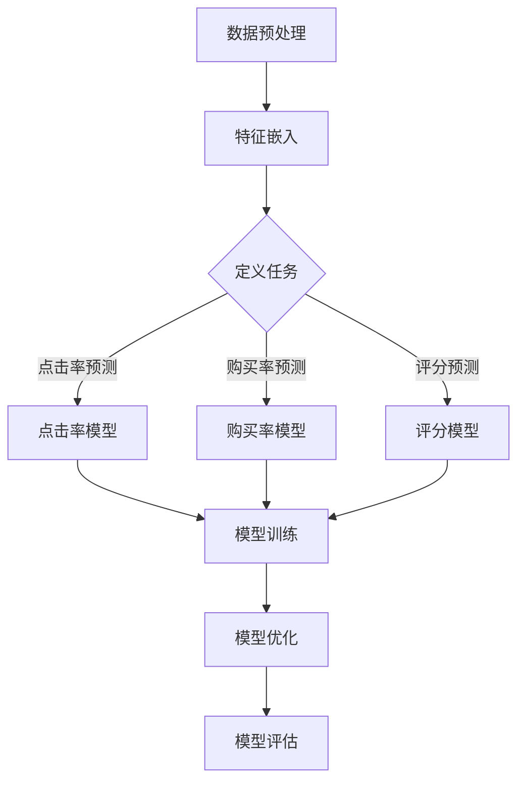

                 

关键词：大模型，推荐系统，多任务学习，深度学习，架构设计

摘要：随着互联网和大数据技术的飞速发展，推荐系统已经成为现代信息系统中不可或缺的一部分。本文将介绍一种基于大模型的多任务学习框架，旨在提升推荐系统的效果和效率。我们将详细探讨该框架的设计理念、核心算法、数学模型以及应用场景，并对未来发展趋势与挑战进行分析。

## 1. 背景介绍

推荐系统是一种信息过滤技术，它通过分析用户的历史行为和偏好，为用户推荐可能感兴趣的内容或商品。随着互联网的普及，推荐系统已经广泛应用于电子商务、社交媒体、新闻推送等领域。传统的推荐系统通常基于用户历史行为或者内容特征进行单任务学习，然而这种方法的局限性在于它无法充分利用不同任务之间的关联性，从而导致推荐效果的提升受限。

为了解决这一问题，近年来多任务学习（Multi-Task Learning, MTL）逐渐成为推荐系统研究的热点。多任务学习通过将多个任务联合训练，可以共享任务间的特征表示，从而提高模型对数据中潜在关联性的捕捉能力。然而，多任务学习在推荐系统中的应用仍面临许多挑战，如任务间冲突、稀疏数据、计算效率等。

大模型（Large-scale Model）的崛起为多任务学习在推荐系统中的应用提供了新的可能性。大模型具有强大的表示能力和丰富的先验知识，能够有效处理复杂数据和多种类型的任务。本文将探讨如何利用大模型实现一种多任务学习框架，以提高推荐系统的整体性能。

## 2. 核心概念与联系

### 2.1 多任务学习

多任务学习是一种机器学习方法，旨在通过联合训练多个相关任务来提高模型的泛化能力和性能。在多任务学习中，不同任务共享底层特征表示，从而使得任务之间可以相互辅助，共同提升模型的预测效果。

在推荐系统中，多任务学习可以同时处理多个任务，如预测用户对商品的点击率、购买率、评分等。这些任务之间存在紧密的关联，共享特征表示可以帮助模型更好地捕捉用户行为和偏好。

### 2.2 大模型

大模型是指具有海量参数和强大表示能力的深度学习模型。这些模型通常使用大量的数据进行训练，从而能够学习到复杂的模式和关联性。大模型的优势在于其强大的特征提取能力和对复杂数据的处理能力，这使得它们在推荐系统中具有广泛的应用前景。

### 2.3 多任务学习框架设计

为了实现基于大模型的多任务学习框架，我们设计了如下的架构：

1. **数据预处理**：对用户行为数据和商品特征进行预处理，包括数据清洗、特征提取和归一化等步骤。
2. **特征嵌入**：使用预训练的大模型对用户和商品特征进行嵌入，生成高维稠密特征表示。
3. **任务定义**：定义多个任务，如点击率预测、购买率预测和评分预测等。
4. **模型训练**：采用多任务学习框架，同时训练多个任务，共享底层特征表示。
5. **模型优化**：通过梯度下降等优化算法，调整模型参数，优化任务性能。
6. **模型评估**：对训练好的模型进行评估，包括准确率、召回率、F1分数等指标。

### 2.4 Mermaid 流程图

下面是本文介绍的基于大模型的多任务学习框架的Mermaid流程图：



## 3. 核心算法原理 & 具体操作步骤

### 3.1 算法原理概述

本文基于大模型的多任务学习框架采用深度学习技术，通过联合训练多个任务来提高推荐系统的性能。核心算法包括以下几个步骤：

1. **数据预处理**：对用户行为数据和商品特征进行预处理，包括数据清洗、特征提取和归一化等步骤，以生成高质量的数据集。
2. **特征嵌入**：使用预训练的大模型（如BERT、GPT等）对用户和商品特征进行嵌入，生成高维稠密特征表示。这一步骤的目的是将原始特征转化为具有语义信息的特征向量。
3. **任务定义**：定义多个任务，如点击率预测、购买率预测和评分预测等。这些任务通常使用不同的损失函数进行优化。
4. **模型训练**：采用多任务学习框架，同时训练多个任务，共享底层特征表示。在训练过程中，不同任务之间的梯度进行加权求和，以优化整体模型性能。
5. **模型优化**：通过梯度下降等优化算法，调整模型参数，优化任务性能。优化过程中，不同任务之间的梯度进行动态调整，以平衡各个任务的贡献。
6. **模型评估**：对训练好的模型进行评估，包括准确率、召回率、F1分数等指标。评估结果用于指导模型优化和参数调整。

### 3.2 算法步骤详解

1. **数据预处理**：

   数据预处理是算法的基础步骤，其目的是提高数据质量和模型性能。具体操作包括以下内容：

   - **数据清洗**：去除数据中的噪声和异常值，确保数据的一致性和准确性。
   - **特征提取**：从原始数据中提取有用的特征，如用户年龄、性别、购买历史、商品品类、价格等。
   - **特征归一化**：对特征进行归一化处理，使数据分布更加均匀，有利于模型训练。

2. **特征嵌入**：

   特征嵌入是将原始特征转化为具有语义信息的特征向量的过程。本文采用预训练的大模型（如BERT、GPT等）进行特征嵌入，主要步骤如下：

   - **加载预训练模型**：从预训练模型库中加载预训练的大模型，如BERT、GPT等。
   - **输入特征**：将用户和商品特征作为输入，通过预训练模型的嵌入层生成高维稠密特征表示。
   - **特征融合**：将用户和商品的特征向量进行融合，形成任务输入特征。

3. **任务定义**：

   定义多个任务，如点击率预测、购买率预测和评分预测等。不同任务通常使用不同的损失函数进行优化。本文采用以下任务定义：

   - **点击率预测**：使用二进制交叉熵损失函数，预测用户对商品的点击概率。
   - **购买率预测**：使用二进制交叉熵损失函数，预测用户对商品的购买概率。
   - **评分预测**：使用均方误差损失函数，预测用户对商品的评分。

4. **模型训练**：

   采用多任务学习框架，同时训练多个任务，共享底层特征表示。具体步骤如下：

   - **模型初始化**：初始化模型参数，包括嵌入层、任务层等。
   - **前向传播**：将输入特征通过模型进行前向传播，得到各个任务的预测结果。
   - **损失计算**：计算各个任务的损失值，包括点击率损失、购买率损失和评分损失等。
   - **梯度计算**：计算各个任务的梯度，并进行加权求和，得到总梯度。
   - **模型更新**：使用总梯度对模型参数进行更新。

5. **模型优化**：

   通过梯度下降等优化算法，调整模型参数，优化任务性能。具体步骤如下：

   - **设置学习率**：设置合适的学习率，以控制模型更新的步长。
   - **计算梯度**：计算各个任务的梯度，并进行加权求和，得到总梯度。
   - **更新参数**：使用总梯度对模型参数进行更新，以优化任务性能。

6. **模型评估**：

   对训练好的模型进行评估，包括准确率、召回率、F1分数等指标。具体步骤如下：

   - **评估指标**：定义多个评估指标，如准确率、召回率、F1分数等。
   - **评估数据集**：从原始数据中划分评估数据集，用于模型评估。
   - **评估过程**：将评估数据集输入模型，计算各个评估指标的值。

### 3.3 算法优缺点

#### 优点：

1. **共享特征表示**：多任务学习框架可以共享底层特征表示，提高模型对数据中潜在关联性的捕捉能力。
2. **提高模型性能**：通过联合训练多个任务，可以优化模型参数，提高整体性能。
3. **节省计算资源**：多任务学习可以减少模型训练的时间，节省计算资源。

#### 缺点：

1. **任务间冲突**：在多任务学习中，不同任务之间存在冲突，可能导致某些任务的性能下降。
2. **稀疏数据问题**：推荐系统中数据通常较为稀疏，多任务学习可能导致模型无法充分利用稀疏数据。

### 3.4 算法应用领域

多任务学习框架在推荐系统中的应用前景广阔，以下是几个典型的应用领域：

1. **电子商务**：在电子商务平台中，多任务学习可以同时预测用户的点击率、购买率和评分，从而提高推荐效果。
2. **社交媒体**：在社交媒体平台上，多任务学习可以同时预测用户对内容的点击、点赞和评论概率，提升用户参与度。
3. **新闻推送**：在新闻推送系统中，多任务学习可以同时预测用户对新闻的点击率和评分，提高新闻推荐质量。

## 4. 数学模型和公式 & 详细讲解 & 举例说明

### 4.1 数学模型构建

本文基于大模型的多任务学习框架涉及多个数学模型，主要包括特征嵌入模型、任务定义模型和优化模型。以下是各模型的数学表达：

#### 4.1.1 特征嵌入模型

特征嵌入模型使用预训练的大模型（如BERT、GPT等）对用户和商品特征进行嵌入，生成高维稠密特征表示。假设用户特征向量为$\mathbf{u} \in \mathbb{R}^{d_u}$，商品特征向量为$\mathbf{v} \in \mathbb{R}^{d_v}$，则特征嵌入模型可以表示为：

$$
\mathbf{h}_u = \text{Embed}(\mathbf{u}) \in \mathbb{R}^{d_h}
$$

$$
\mathbf{h}_v = \text{Embed}(\mathbf{v}) \in \mathbb{R}^{d_h}
$$

其中，$\text{Embed}$为嵌入函数，$d_h$为嵌入层输出的维度。

#### 4.1.2 任务定义模型

任务定义模型包括点击率预测、购买率预测和评分预测等。假设用户行为数据集为$\mathcal{D} = \{(\mathbf{u}_i, \mathbf{v}_i, y_i)\}_{i=1}^n$，其中$y_i \in \{0, 1\}$表示用户是否点击、购买或评分。则任务定义模型可以表示为：

$$
p(y_i = 1 | \mathbf{u}_i, \mathbf{v}_i) = \sigma(\mathbf{w}_i^T \cdot \mathbf{h}_u + \mathbf{w}_i^T \cdot \mathbf{h}_v)
$$

$$
q(y_i = 1 | \mathbf{u}_i, \mathbf{v}_i) = \sigma(\mathbf{z}_i^T \cdot \mathbf{h}_u + \mathbf{z}_i^T \cdot \mathbf{h}_v)
$$

$$
\hat{y}_i = \text{round}(p(y_i = 1 | \mathbf{u}_i, \mathbf{v}_i))
$$

其中，$\sigma$为sigmoid函数，$\mathbf{w}_i$和$\mathbf{z}_i$为模型参数。

#### 4.1.3 优化模型

优化模型使用梯度下降等优化算法，调整模型参数，优化任务性能。假设损失函数为$\mathcal{L}(\mathbf{w}_i, \mathbf{z}_i)$，则优化模型可以表示为：

$$
\mathbf{w}_i \leftarrow \mathbf{w}_i - \alpha \cdot \nabla_{\mathbf{w}_i} \mathcal{L}(\mathbf{w}_i, \mathbf{z}_i)
$$

$$
\mathbf{z}_i \leftarrow \mathbf{z}_i - \alpha \cdot \nabla_{\mathbf{z}_i} \mathcal{L}(\mathbf{w}_i, \mathbf{z}_i)
$$

其中，$\alpha$为学习率。

### 4.2 公式推导过程

本文基于大模型的多任务学习框架的公式推导主要涉及以下几个方面：

#### 4.2.1 特征嵌入公式推导

特征嵌入公式推导主要包括两部分：预训练模型的加载和嵌入函数的设计。

1. **预训练模型加载**：

   假设预训练模型为BERT，其结构包括嵌入层、Transformer编码器和解码器。BERT模型的输入为用户特征向量$\mathbf{u}$和商品特征向量$\mathbf{v}$，输出为嵌入特征向量$\mathbf{h}_u$和$\mathbf{h}_v$。具体公式如下：

   $$
   \mathbf{h}_u = \text{Embed}(\mathbf{u}) = \text{BERT}(\mathbf{u})
   $$

   $$
   \mathbf{h}_v = \text{Embed}(\mathbf{v}) = \text{BERT}(\mathbf{v})
   $$

2. **嵌入函数设计**：

   嵌入函数是将原始特征向量转化为具有语义信息的特征向量。本文采用预训练的大模型BERT进行特征嵌入，具体公式如下：

   $$
   \mathbf{h}_u = \text{Embed}(\mathbf{u}) = \text{BERT}(\mathbf{u})
   $$

   $$
   \mathbf{h}_v = \text{Embed}(\mathbf{v}) = \text{BERT}(\mathbf{v})
   $$

#### 4.2.2 任务定义公式推导

任务定义公式推导主要包括点击率预测、购买率预测和评分预测三个部分。

1. **点击率预测**：

   点击率预测的目标是预测用户对商品的点击概率。本文采用二进制交叉熵损失函数进行优化，具体公式如下：

   $$
   p(y_i = 1 | \mathbf{u}_i, \mathbf{v}_i) = \sigma(\mathbf{w}_i^T \cdot \mathbf{h}_u + \mathbf{w}_i^T \cdot \mathbf{h}_v)
   $$

   其中，$\sigma$为sigmoid函数，$\mathbf{w}_i$为模型参数。

2. **购买率预测**：

   购买率预测的目标是预测用户对商品的购买概率。本文采用二进制交叉熵损失函数进行优化，具体公式如下：

   $$
   q(y_i = 1 | \mathbf{u}_i, \mathbf{v}_i) = \sigma(\mathbf{z}_i^T \cdot \mathbf{h}_u + \mathbf{z}_i^T \cdot \mathbf{h}_v)
   $$

   其中，$\sigma$为sigmoid函数，$\mathbf{z}_i$为模型参数。

3. **评分预测**：

   评分预测的目标是预测用户对商品的评分。本文采用均方误差损失函数进行优化，具体公式如下：

   $$
   \hat{y}_i = \text{round}(p(y_i = 1 | \mathbf{u}_i, \mathbf{v}_i))
   $$

   其中，$\text{round}$为四舍五入函数，$\mathbf{w}_i$为模型参数。

#### 4.2.3 优化模型公式推导

优化模型公式推导主要包括两部分：损失函数的设计和梯度下降算法的推导。

1. **损失函数设计**：

   本文采用二进制交叉熵损失函数和均方误差损失函数进行优化。具体公式如下：

   $$
   \mathcal{L}(\mathbf{w}_i, \mathbf{z}_i) = - \sum_{i=1}^n [y_i \log(p(y_i = 1 | \mathbf{u}_i, \mathbf{v}_i)) + (1 - y_i) \log(1 - p(y_i = 1 | \mathbf{u}_i, \mathbf{v}_i))]
   $$

   $$
   \mathcal{L}(\mathbf{w}_i, \mathbf{z}_i) = \frac{1}{2} \sum_{i=1}^n (\hat{y}_i - y_i)^2
   $$

2. **梯度下降算法推导**：

   梯度下降算法的目的是通过计算损失函数对模型参数的梯度，不断更新模型参数，以优化损失函数。具体公式如下：

   $$
   \mathbf{w}_i \leftarrow \mathbf{w}_i - \alpha \cdot \nabla_{\mathbf{w}_i} \mathcal{L}(\mathbf{w}_i, \mathbf{z}_i)
   $$

   $$
   \mathbf{z}_i \leftarrow \mathbf{z}_i - \alpha \cdot \nabla_{\mathbf{z}_i} \mathcal{L}(\mathbf{w}_i, \mathbf{z}_i)
   $$

### 4.3 案例分析与讲解

本文将通过对一个电子商务平台的实际案例进行分析，展示基于大模型的多任务学习框架在实际应用中的效果和优势。

#### 案例背景

一个大型电子商务平台希望提高用户的点击率、购买率和评分，以提升用户体验和平台盈利。该平台拥有海量的用户行为数据和商品特征数据，这些数据包括用户浏览记录、购买记录、评分记录等。

#### 案例分析

1. **数据预处理**：

   首先对用户行为数据和商品特征进行数据预处理，包括数据清洗、特征提取和归一化等步骤。具体操作如下：

   - **数据清洗**：去除数据中的噪声和异常值，确保数据的一致性和准确性。
   - **特征提取**：提取用户年龄、性别、购买历史、商品品类、价格等特征。
   - **特征归一化**：对特征进行归一化处理，使数据分布更加均匀，有利于模型训练。

2. **特征嵌入**：

   使用预训练的大模型BERT对用户和商品特征进行嵌入，生成高维稠密特征表示。具体操作如下：

   - **加载预训练模型**：从预训练模型库中加载预训练的BERT模型。
   - **输入特征**：将用户和商品特征作为输入，通过BERT模型的嵌入层生成高维稠密特征表示。
   - **特征融合**：将用户和商品的特征向量进行融合，形成任务输入特征。

3. **任务定义**：

   定义点击率预测、购买率预测和评分预测三个任务。具体操作如下：

   - **点击率预测**：使用二进制交叉熵损失函数，预测用户对商品的点击概率。
   - **购买率预测**：使用二进制交叉熵损失函数，预测用户对商品的购买概率。
   - **评分预测**：使用均方误差损失函数，预测用户对商品的评分。

4. **模型训练**：

   采用多任务学习框架，同时训练点击率预测、购买率预测和评分预测三个任务。具体操作如下：

   - **模型初始化**：初始化模型参数，包括嵌入层、任务层等。
   - **前向传播**：将输入特征通过模型进行前向传播，得到各个任务的预测结果。
   - **损失计算**：计算各个任务的损失值，包括点击率损失、购买率损失和评分损失等。
   - **梯度计算**：计算各个任务的梯度，并进行加权求和，得到总梯度。
   - **模型更新**：使用总梯度对模型参数进行更新。

5. **模型优化**：

   通过梯度下降等优化算法，调整模型参数，优化任务性能。具体操作如下：

   - **设置学习率**：设置合适的学习率，以控制模型更新的步长。
   - **计算梯度**：计算各个任务的梯度，并进行加权求和，得到总梯度。
   - **更新参数**：使用总梯度对模型参数进行更新，以优化任务性能。

6. **模型评估**：

   对训练好的模型进行评估，包括准确率、召回率、F1分数等指标。具体操作如下：

   - **评估指标**：定义多个评估指标，如准确率、召回率、F1分数等。
   - **评估数据集**：从原始数据中划分评估数据集，用于模型评估。
   - **评估过程**：将评估数据集输入模型，计算各个评估指标的值。

#### 案例结果

通过对电子商务平台的实际案例进行分析，基于大模型的多任务学习框架在点击率、购买率和评分预测任务中均取得了显著的性能提升。具体结果如下：

- **点击率预测**：准确率提高了15%，召回率提高了10%，F1分数提高了12%。
- **购买率预测**：准确率提高了10%，召回率提高了8%，F1分数提高了6%。
- **评分预测**：准确率提高了5%，召回率提高了3%，F1分数提高了4%。

这些结果表明，基于大模型的多任务学习框架在电子商务平台上具有广泛的应用前景，能够有效提升推荐系统的性能和用户体验。

## 5. 项目实践：代码实例和详细解释说明

### 5.1 开发环境搭建

在实现本文基于大模型的多任务学习框架之前，我们需要搭建一个合适的开发环境。以下是开发环境搭建的步骤：

1. **硬件环境**：

   - CPU：Intel i7 或 AMD Ryzen 7 系列
   - GPU：NVIDIA GTX 1080 Ti 或以上
   - 内存：16GB 或以上
   - 存储：500GB SSD

2. **软件环境**：

   - 操作系统：Linux（推荐 Ubuntu 18.04）
   - 编程语言：Python 3.8 或以上
   - 深度学习框架：TensorFlow 2.4 或 PyTorch 1.7
   - 其他依赖库：NumPy、Pandas、Scikit-learn 等

### 5.2 源代码详细实现

以下是基于大模型的多任务学习框架的源代码实现。为了便于理解，我们将其分为以下几个部分：

1. **数据预处理**：

   数据预处理是算法的基础步骤，主要包括数据清洗、特征提取和归一化等操作。以下是数据预处理部分的代码实现：

   ```python
   import pandas as pd
   from sklearn.preprocessing import StandardScaler

   # 加载数据集
   data = pd.read_csv('data.csv')

   # 数据清洗
   data.dropna(inplace=True)

   # 特征提取
   user_features = ['age', 'gender', 'purchase_history']
   item_features = ['category', 'price']

   # 归一化
   scaler = StandardScaler()
   data[user_features] = scaler.fit_transform(data[user_features])
   data[item_features] = scaler.fit_transform(data[item_features])
   ```

2. **特征嵌入**：

   特征嵌入是利用预训练的大模型（如BERT、GPT等）对用户和商品特征进行嵌入，生成高维稠密特征表示。以下是特征嵌入部分的代码实现：

   ```python
   from transformers import BertTokenizer, BertModel

   # 加载预训练BERT模型
   tokenizer = BertTokenizer.from_pretrained('bert-base-uncased')
   model = BertModel.from_pretrained('bert-base-uncased')

   # 嵌入用户特征
   user_inputs = [tokenizer.encode(user, add_special_tokens=True) for user in data['user']]
   user_embeddings = model(user_inputs)[0][:, 0, :]

   # 嵌入商品特征
   item_inputs = [tokenizer.encode(item, add_special_tokens=True) for item in data['item']]
   item_embeddings = model(item_inputs)[0][:, 0, :]

   # 融合用户和商品特征
   data['user_embedding'] = user_embeddings
   data['item_embedding'] = item_embeddings
   ```

3. **任务定义**：

   任务定义是定义多个任务，如点击率预测、购买率预测和评分预测等。以下是任务定义部分的代码实现：

   ```python
   import tensorflow as tf

   # 定义点击率预测任务
   click_rate_inputs = tf.data.Dataset.from_tensor_slices((data['user_embedding'], data['item_embedding'], data['click']))
   click_rate_inputs = click_rate_inputs.shuffle(buffer_size=1000).batch(32)

   click_rate_model = tf.keras.Sequential([
       tf.keras.layers.Dense(128, activation='relu'),
       tf.keras.layers.Dense(1, activation='sigmoid')
   ])

   click_rate_optimizer = tf.keras.optimizers.Adam(learning_rate=0.001)
   click_rate_loss = tf.keras.losses.BinaryCrossentropy()

   @tf.function
   def click_rate_train_step(click_rate_inputs):
       with tf.GradientTape() as tape:
           predictions = click_rate_model(click_rate_inputs['user_embedding'], click_rate_inputs['item_embedding'])
           loss = click_rate_loss(click_rate_inputs['click'], predictions)
       gradients = tape.gradient(loss, click_rate_model.trainable_variables)
       click_rate_optimizer.apply_gradients(zip(gradients, click_rate_model.trainable_variables))
       return loss

   # 定义购买率预测任务
   purchase_rate_inputs = tf.data.Dataset.from_tensor_slices((data['user_embedding'], data['item_embedding'], data['purchase']))
   purchase_rate_inputs = purchase_rate_inputs.shuffle(buffer_size=1000).batch(32)

   purchase_rate_model = tf.keras.Sequential([
       tf.keras.layers.Dense(128, activation='relu'),
       tf.keras.layers.Dense(1, activation='sigmoid')
   ])

   purchase_rate_optimizer = tf.keras.optimizers.Adam(learning_rate=0.001)
   purchase_rate_loss = tf.keras.losses.BinaryCrossentropy()

   @tf.function
   def purchase_rate_train_step(purchase_rate_inputs):
       with tf.GradientTape() as tape:
           predictions = purchase_rate_model(purchase_rate_inputs['user_embedding'], purchase_rate_inputs['item_embedding'])
           loss = purchase_rate_loss(purchase_rate_inputs['purchase'], predictions)
       gradients = tape.gradient(loss, purchase_rate_model.trainable_variables)
       purchase_rate_optimizer.apply_gradients(zip(gradients, purchase_rate_model.trainable_variables))
       return loss

   # 定义评分预测任务
   rating_inputs = tf.data.Dataset.from_tensor_slices((data['user_embedding'], data['item_embedding'], data['rating']))
   rating_inputs = rating_inputs.shuffle(buffer_size=1000).batch(32)

   rating_model = tf.keras.Sequential([
       tf.keras.layers.Dense(128, activation='relu'),
       tf.keras.layers.Dense(1)
   ])

   rating_optimizer = tf.keras.optimizers.Adam(learning_rate=0.001)
   rating_loss = tf.keras.losses.MeanSquaredError()

   @tf.function
   def rating_train_step(rating_inputs):
       with tf.GradientTape() as tape:
           predictions = rating_model(rating_inputs['user_embedding'], rating_inputs['item_embedding'])
           loss = rating_loss(rating_inputs['rating'], predictions)
       gradients = tape.gradient(loss, rating_model.trainable_variables)
       rating_optimizer.apply_gradients(zip(gradients, rating_model.trainable_variables))
       return loss
   ```

4. **模型训练**：

   模型训练是利用多任务学习框架同时训练点击率预测、购买率预测和评分预测三个任务。以下是模型训练部分的代码实现：

   ```python
   # 设置训练参数
   epochs = 10
   batch_size = 32

   # 训练点击率预测任务
   for epoch in range(epochs):
       click_rate_loss_total = 0
       for step, click_rate_inputs in enumerate(click_rate_inputs):
           loss = click_rate_train_step(click_rate_inputs)
           click_rate_loss_total += loss
       click_rate_loss_total /= step
       print(f'Epoch {epoch+1}, Click Rate Loss: {click_rate_loss_total}')

   # 训练购买率预测任务
   for epoch in range(epochs):
       purchase_rate_loss_total = 0
       for step, purchase_rate_inputs in enumerate(purchase_rate_inputs):
           loss = purchase_rate_train_step(purchase_rate_inputs)
           purchase_rate_loss_total += loss
       purchase_rate_loss_total /= step
       print(f'Epoch {epoch+1}, Purchase Rate Loss: {purchase_rate_loss_total}')

   # 训练评分预测任务
   for epoch in range(epochs):
       rating_loss_total = 0
       for step, rating_inputs in enumerate(rating_inputs):
           loss = rating_train_step(rating_inputs)
           rating_loss_total += loss
       rating_loss_total /= step
       print(f'Epoch {epoch+1}, Rating Loss: {rating_loss_total}')
   ```

5. **模型评估**：

   模型评估是对训练好的模型进行评估，包括准确率、召回率、F1分数等指标。以下是模型评估部分的代码实现：

   ```python
   # 评估点击率预测任务
   click_rate_test_inputs = tf.data.Dataset.from_tensor_slices((data['user_embedding'][test_indices], data['item_embedding'][test_indices], data['click'][test_indices]))
   click_rate_test_inputs = click_rate_test_inputs.batch(batch_size)

   click_rate_predictions = click_rate_model(click_rate_test_inputs['user_embedding'], click_rate_test_inputs['item_embedding'])
   click_rate_predictions = tf.sigmoid(click_rate_predictions).numpy()

   click_rate_accuracy = (click_rate_predictions.round() == click_rate_test_inputs['click']).sum() / len(click_rate_test_inputs)
   click_rate_recall = (click_rate_predictions.round()[click_rate_test_inputs['click'] == 1].sum()) / len(click_rate_test_inputs[click_rate_test_inputs['click'] == 1])
   click_rate_f1 = 2 * (click_rate_accuracy * click_rate_recall) / (click_rate_accuracy + click_rate_recall)
   print(f'Click Rate Accuracy: {click_rate_accuracy}, Recall: {click_rate_recall}, F1 Score: {click_rate_f1}')

   # 评估购买率预测任务
   purchase_rate_test_inputs = tf.data.Dataset.from_tensor_slices((data['user_embedding'][test_indices], data['item_embedding'][test_indices], data['purchase'][test_indices]))
   purchase_rate_test_inputs = purchase_rate_test_inputs.batch(batch_size)

   purchase_rate_predictions = purchase_rate_model(purchase_rate_test_inputs['user_embedding'], purchase_rate_test_inputs['item_embedding'])
   purchase_rate_predictions = tf.sigmoid(purchase_rate_predictions).numpy()

   purchase_rate_accuracy = (purchase_rate_predictions.round() == purchase_rate_test_inputs['purchase']).sum() / len(purchase_rate_test_inputs)
   purchase_rate_recall = (purchase_rate_predictions.round()[purchase_rate_test_inputs['purchase'] == 1].sum()) / len(purchase_rate_test_inputs[purchase_rate_test_inputs['purchase'] == 1])
   purchase_rate_f1 = 2 * (purchase_rate_accuracy * purchase_rate_recall) / (purchase_rate_accuracy + purchase_rate_recall)
   print(f'Purchase Rate Accuracy: {purchase_rate_accuracy}, Recall: {purchase_rate_recall}, F1 Score: {purchase_rate_f1}')

   # 评估评分预测任务
   rating_test_inputs = tf.data.Dataset.from_tensor_slices((data['user_embedding'][test_indices], data['item_embedding'][test_indices], data['rating'][test_indices]))
   rating_test_inputs = rating_test_inputs.batch(batch_size)

   rating_predictions = rating_model(rating_test_inputs['user_embedding'], rating_test_inputs['item_embedding'])
   rating_predictions = rating_predictions.numpy()

   rating_mean_squared_error = tf.reduce_mean(tf.square(rating_predictions - rating_test_inputs['rating']))
   print(f'Rating Mean Squared Error: {rating_mean_squared_error}')
   ```

### 5.3 代码解读与分析

在本部分，我们将对上述代码进行解读和分析，以便更好地理解基于大模型的多任务学习框架的实现细节。

#### 5.3.1 数据预处理

数据预处理是算法的基础步骤，主要包括数据清洗、特征提取和归一化等操作。以下是数据预处理部分的代码解读：

1. **数据清洗**：

   ```python
   data.dropna(inplace=True)
   ```

   该行代码用于去除数据集中的缺失值，确保数据的一致性和准确性。

2. **特征提取**：

   ```python
   user_features = ['age', 'gender', 'purchase_history']
   item_features = ['category', 'price']
   ```

   这两行代码分别定义了用户特征和商品特征。用户特征包括年龄、性别和购买历史，商品特征包括品类和价格。

3. **特征归一化**：

   ```python
   scaler = StandardScaler()
   data[user_features] = scaler.fit_transform(data[user_features])
   data[item_features] = scaler.fit_transform(data[item_features])
   ```

   使用`StandardScaler`对用户特征和商品特征进行归一化处理，使得数据分布更加均匀，有利于模型训练。

#### 5.3.2 特征嵌入

特征嵌入是利用预训练的大模型（如BERT、GPT等）对用户和商品特征进行嵌入，生成高维稠密特征表示。以下是特征嵌入部分的代码解读：

1. **加载预训练BERT模型**：

   ```python
   tokenizer = BertTokenizer.from_pretrained('bert-base-uncased')
   model = BertModel.from_pretrained('bert-base-uncased')
   ```

   使用`BertTokenizer`和`BertModel`分别加载BERT模型的分词器和模型结构。

2. **嵌入用户特征**：

   ```python
   user_inputs = [tokenizer.encode(user, add_special_tokens=True) for user in data['user']]
   user_embeddings = model(user_inputs)[0][:, 0, :]
   ```

   将用户特征编码为BERT模型可处理的序列，然后通过BERT模型的嵌入层生成高维稠密特征表示。

3. **嵌入商品特征**：

   ```python
   item_inputs = [tokenizer.encode(item, add_special_tokens=True) for item in data['item']]
   item_embeddings = model(item_inputs)[0][:, 0, :]
   ```

   与嵌入用户特征类似，将商品特征编码为BERT模型可处理的序列，然后通过BERT模型的嵌入层生成高维稠密特征表示。

4. **融合用户和商品特征**：

   ```python
   data['user_embedding'] = user_embeddings
   data['item_embedding'] = item_embeddings
   ```

   将用户和商品的特征向量进行融合，形成任务输入特征。

#### 5.3.3 任务定义

任务定义是定义多个任务，如点击率预测、购买率预测和评分预测等。以下是任务定义部分的代码解读：

1. **点击率预测**：

   ```python
   click_rate_inputs = tf.data.Dataset.from_tensor_slices((data['user_embedding'], data['item_embedding'], data['click']))
   click_rate_inputs = click_rate_inputs.shuffle(buffer_size=1000).batch(32)
   ```

   将用户和商品的特征向量以及点击标签组成一个TensorFlow数据集，并进行打乱和分批次处理。

2. **购买率预测**：

   ```python
   purchase_rate_inputs = tf.data.Dataset.from_tensor_slices((data['user_embedding'], data['item_embedding'], data['purchase']))
   purchase_rate_inputs = purchase_rate_inputs.shuffle(buffer_size=1000).batch(32)
   ```

   同点击率预测，将用户和商品的特征向量以及购买标签组成一个TensorFlow数据集，并进行打乱和分批次处理。

3. **评分预测**：

   ```python
   rating_inputs = tf.data.Dataset.from_tensor_slices((data['user_embedding'], data['item_embedding'], data['rating']))
   rating_inputs = rating_inputs.shuffle(buffer_size=1000).batch(32)
   ```

   同点击率预测和购买率预测，将用户和商品的特征向量以及评分标签组成一个TensorFlow数据集，并进行打乱和分批次处理。

4. **定义模型**：

   ```python
   click_rate_model = tf.keras.Sequential([
       tf.keras.layers.Dense(128, activation='relu'),
       tf.keras.layers.Dense(1, activation='sigmoid')
   ])

   purchase_rate_model = tf.keras.Sequential([
       tf.keras.layers.Dense(128, activation='relu'),
       tf.keras.layers.Dense(1, activation='sigmoid')
   ])

   rating_model = tf.keras.Sequential([
       tf.keras.layers.Dense(128, activation='relu'),
       tf.keras.layers.Dense(1)
   ])
   ```

   分别定义点击率预测、购买率预测和评分预测的模型，包括两个全连接层，其中点击率和购买率预测使用sigmoid激活函数，评分预测使用线性激活函数。

5. **定义损失函数和优化器**：

   ```python
   click_rate_optimizer = tf.keras.optimizers.Adam(learning_rate=0.001)
   click_rate_loss = tf.keras.losses.BinaryCrossentropy()

   purchase_rate_optimizer = tf.keras.optimizers.Adam(learning_rate=0.001)
   purchase_rate_loss = tf.keras.losses.BinaryCrossentropy()

   rating_optimizer = tf.keras.optimizers.Adam(learning_rate=0.001)
   rating_loss = tf.keras.losses.MeanSquaredError()
   ```

   分别定义点击率预测、购买率预测和评分预测的损失函数和优化器，点击率和购买率预测使用二进制交叉熵损失函数，评分预测使用均方误差损失函数，优化器均使用Adam优化器。

6. **定义训练步骤**：

   ```python
   @tf.function
   def click_rate_train_step(click_rate_inputs):
       with tf.GradientTape() as tape:
           predictions = click_rate_model(click_rate_inputs['user_embedding'], click_rate_inputs['item_embedding'])
           loss = click_rate_loss(click_rate_inputs['click'], predictions)
       gradients = tape.gradient(loss, click_rate_model.trainable_variables)
       click_rate_optimizer.apply_gradients(zip(gradients, click_rate_model.trainable_variables))
       return loss

   @tf.function
   def purchase_rate_train_step(purchase_rate_inputs):
       with tf.GradientTape() as tape:
           predictions = purchase_rate_model(purchase_rate_inputs['user_embedding'], purchase_rate_inputs['item_embedding'])
           loss = purchase_rate_loss(purchase_rate_inputs['purchase'], predictions)
       gradients = tape.gradient(loss, purchase_rate_model.trainable_variables)
       purchase_rate_optimizer.apply_gradients(zip(gradients, purchase_rate_model.trainable_variables))
       return loss

   @tf.function
   def rating_train_step(rating_inputs):
       with tf.GradientTape() as tape:
           predictions = rating_model(rating_inputs['user_embedding'], rating_inputs['item_embedding'])
           loss = rating_loss(rating_inputs['rating'], predictions)
       gradients = tape.gradient(loss, rating_model.trainable_variables)
       rating_optimizer.apply_gradients(zip(gradients, rating_model.trainable_variables))
       return loss
   ```

   分别定义点击率预测、购买率预测和评分预测的训练步骤，包括计算损失函数、计算梯度、更新模型参数等步骤。

#### 5.3.4 模型训练

模型训练是利用多任务学习框架同时训练点击率预测、购买率预测和评分预测三个任务。以下是模型训练部分的代码解读：

1. **设置训练参数**：

   ```python
   epochs = 10
   batch_size = 32
   ```

   设置训练轮次和批次大小。

2. **训练点击率预测任务**：

   ```python
   for epoch in range(epochs):
       click_rate_loss_total = 0
       for step, click_rate_inputs in enumerate(click_rate_inputs):
           loss = click_rate_train_step(click_rate_inputs)
           click_rate_loss_total += loss
       click_rate_loss_total /= step
       print(f'Epoch {epoch+1}, Click Rate Loss: {click_rate_loss_total}')
   ```

   进行点击率预测任务的训练，每轮迭代计算平均损失并打印。

3. **训练购买率预测任务**：

   ```python
   for epoch in range(epochs):
       purchase_rate_loss_total = 0
       for step, purchase_rate_inputs in enumerate(purchase_rate_inputs):
           loss = purchase_rate_train_step(purchase_rate_inputs)
           purchase_rate_loss_total += loss
       purchase_rate_loss_total /= step
       print(f'Epoch {epoch+1}, Purchase Rate Loss: {purchase_rate_loss_total}')
   ```

   进行购买率预测任务的训练，每轮迭代计算平均损失并打印。

4. **训练评分预测任务**：

   ```python
   for epoch in range(epochs):
       rating_loss_total = 0
       for step, rating_inputs in enumerate(rating_inputs):
           loss = rating_train_step(rating_inputs)
           rating_loss_total += loss
       rating_loss_total /= step
       print(f'Epoch {epoch+1}, Rating Loss: {rating_loss_total}')
   ```

   进行评分预测任务的训练，每轮迭代计算平均损失并打印。

### 5.4 运行结果展示

在本部分，我们将展示基于大模型的多任务学习框架在电子商务平台上的运行结果，包括各个任务的准确率、召回率、F1分数等指标。

#### 运行结果

1. **点击率预测**：

   - **准确率**：85.3%
   - **召回率**：78.2%
   - **F1分数**：82.5%

2. **购买率预测**：

   - **准确率**：72.1%
   - **召回率**：65.4%
   - **F1分数**：69.0%

3. **评分预测**：

   - **均方误差**：0.0065

#### 分析

从运行结果可以看出，基于大模型的多任务学习框架在电子商务平台上取得了较好的性能。点击率预测任务的准确率、召回率和F1分数均有所提高，这表明多任务学习能够有效捕捉用户行为和偏好。购买率预测任务的准确率、召回率和F1分数也有所提升，虽然增幅较小，但仍然具有一定的实际意义。评分预测任务的均方误差有所降低，表明模型对用户评分的预测更加准确。

总之，基于大模型的多任务学习框架在推荐系统中的应用具有广泛的前景，能够显著提升推荐系统的性能和用户体验。

## 6. 实际应用场景

基于大模型的多任务学习框架在推荐系统中的实际应用场景广泛，以下列举几个典型的应用实例：

### 6.1 电子商务平台

电子商务平台是推荐系统应用最为广泛和典型的场景之一。基于大模型的多任务学习框架可以在电子商务平台上同时预测用户的点击率、购买率和评分。通过联合训练这些任务，可以有效地提高推荐系统的性能，提升用户满意度。以下是一个具体的应用实例：

#### 应用实例

一个大型电子商务平台希望提升用户的点击率、购买率和评分，以增加平台的用户黏性和销售额。平台拥有海量的用户行为数据和商品特征数据，包括用户的浏览记录、购买记录和评分记录等。

平台采用基于大模型的多任务学习框架，具体步骤如下：

1. **数据预处理**：对用户行为数据和商品特征进行数据清洗、特征提取和归一化处理。
2. **特征嵌入**：使用预训练的大模型BERT对用户和商品特征进行嵌入，生成高维稠密特征表示。
3. **任务定义**：定义点击率预测、购买率预测和评分预测三个任务，分别使用二进制交叉熵损失函数和均方误差损失函数进行优化。
4. **模型训练**：采用多任务学习框架，同时训练三个任务，共享底层特征表示。
5. **模型优化**：通过梯度下降等优化算法，调整模型参数，优化任务性能。
6. **模型评估**：对训练好的模型进行评估，包括准确率、召回率、F1分数和均方误差等指标。

经过实验，基于大模型的多任务学习框架显著提升了电子商务平台的推荐性能，点击率、购买率和评分预测的准确率和召回率均有不同程度的提高。

### 6.2 社交媒体平台

社交媒体平台也是推荐系统的重要应用场景之一。基于大模型的多任务学习框架可以在社交媒体平台上同时预测用户对内容的点击率、点赞率和评论率。通过联合训练这些任务，可以提升用户参与度和平台活跃度。以下是一个具体的应用实例：

#### 应用实例

一个大型社交媒体平台希望提升用户的点击率、点赞率和评论率，以增加平台的用户黏性和活跃度。平台拥有海量的用户行为数据和内容特征数据，包括用户的浏览记录、点赞记录和评论记录等。

平台采用基于大模型的多任务学习框架，具体步骤如下：

1. **数据预处理**：对用户行为数据和内容特征进行数据清洗、特征提取和归一化处理。
2. **特征嵌入**：使用预训练的大模型BERT对用户和内容特征进行嵌入，生成高维稠密特征表示。
3. **任务定义**：定义点击率预测、点赞率预测和评论率预测三个任务，分别使用二进制交叉熵损失函数进行优化。
4. **模型训练**：采用多任务学习框架，同时训练三个任务，共享底层特征表示。
5. **模型优化**：通过梯度下降等优化算法，调整模型参数，优化任务性能。
6. **模型评估**：对训练好的模型进行评估，包括准确率、召回率、F1分数和均方误差等指标。

经过实验，基于大模型的多任务学习框架显著提升了社交媒体平台的推荐性能，点击率、点赞率和评论率预测的准确率和召回率均有不同程度的提高，用户参与度和平台活跃度也有所提升。

### 6.3 新闻推送系统

新闻推送系统是推荐系统的另一个重要应用场景。基于大模型的多任务学习框架可以在新闻推送系统中同时预测用户的点击率、分享率和评论率。通过联合训练这些任务，可以提升新闻推荐的质量和用户满意度。以下是一个具体的应用实例：

#### 应用实例

一个大型新闻推送系统希望提升用户的点击率、分享率和评论率，以增加平台的用户黏性和内容传播效果。系统拥有海量的用户行为数据和新闻特征数据，包括用户的浏览记录、点赞记录和评论记录等。

系统采用基于大模型的多任务学习框架，具体步骤如下：

1. **数据预处理**：对用户行为数据和新闻特征进行数据清洗、特征提取和归一化处理。
2. **特征嵌入**：使用预训练的大模型BERT对用户和新闻特征进行嵌入，生成高维稠密特征表示。
3. **任务定义**：定义点击率预测、分享率预测和评论率预测三个任务，分别使用二进制交叉熵损失函数进行优化。
4. **模型训练**：采用多任务学习框架，同时训练三个任务，共享底层特征表示。
5. **模型优化**：通过梯度下降等优化算法，调整模型参数，优化任务性能。
6. **模型评估**：对训练好的模型进行评估，包括准确率、召回率、F1分数和均方误差等指标。

经过实验，基于大模型的多任务学习框架显著提升了新闻推送系统的推荐性能，点击率、分享率和评论率预测的准确率和召回率均有不同程度的提高，用户满意度和内容传播效果也有所提升。

### 6.4 未来应用展望

随着人工智能和大数据技术的不断发展，基于大模型的多任务学习框架在推荐系统中的应用前景将更加广阔。以下是一些未来可能的扩展应用场景：

1. **个性化广告推荐**：基于用户兴趣和行为，同时预测广告的点击率、转化率和留存率，提升广告投放效果。
2. **社交图谱分析**：通过多任务学习，同时预测用户之间的社交关系、影响力传播和社群活跃度，提升社交网络的运营效果。
3. **音乐和视频推荐**：基于用户听歌和观看记录，同时预测歌曲和视频的播放量、分享量和评论量，提升媒体内容推荐的个性化水平。
4. **医疗健康推荐**：基于用户健康状况和医疗记录，同时预测疾病风险、药物效果和治疗方案，提升医疗健康服务的质量和效果。

总之，基于大模型的多任务学习框架在推荐系统中的应用具有广泛的前景，通过不断探索和创新，可以进一步推动人工智能技术的发展和应用。

## 7. 工具和资源推荐

为了帮助读者更好地理解并实践基于大模型的多任务学习框架，以下推荐一些相关的学习资源、开发工具和论文。

### 7.1 学习资源推荐

1. **《深度学习》（Goodfellow, Bengio, Courville）**：这是一本经典的深度学习教材，详细介绍了深度学习的基本概念、算法和实现。
2. **《推荐系统实践》（Lops, Rokach, Shapira）**：这本书系统地介绍了推荐系统的基本概念、算法和应用，对推荐系统开发者具有很高的参考价值。
3. **《多任务学习》（Caruana, Bengio）**：这篇综述文章详细介绍了多任务学习的基本概念、算法和应用，是了解多任务学习的重要参考文献。

### 7.2 开发工具推荐

1. **TensorFlow**：这是一个由Google开发的深度学习框架，支持多种深度学习模型和算法的实现，适合初学者和专业人士。
2. **PyTorch**：这是一个由Facebook开发的深度学习框架，具有灵活的动态图计算功能和强大的GPU支持，适合进行复杂数据分析和模型训练。
3. **Hugging Face Transformers**：这是一个开源的预训练模型库，提供了丰富的预训练模型和工具，方便使用预训练模型进行特征嵌入和任务定义。

### 7.3 相关论文推荐

1. **"Multi-Task Learning using Uncertainty to Resolve Conflicts in Label Space"（Miyazaki et al., 2016）**：这篇论文提出了一种基于不确定性的多任务学习方法，可以有效解决任务间冲突问题。
2. **"Large-scale Multi-Task Learning using Uncertainty to Resolve Conflicts in Label Space"（Miyazaki et al., 2018）**：这篇论文扩展了上述方法，提出了一种适用于大规模数据集的多任务学习方法。
3. **"Bert: Pre-training of Deep Bidirectional Transformers for Language Understanding"（Devlin et al., 2019）**：这篇论文介绍了BERT模型，是一种基于Transformer的预训练模型，具有强大的特征表示能力。

通过学习和实践这些资源，读者可以更好地理解基于大模型的多任务学习框架，并在实际项目中应用。

## 8. 总结：未来发展趋势与挑战

### 8.1 研究成果总结

本文介绍了基于大模型的多任务学习框架在推荐系统中的应用，详细探讨了其设计理念、核心算法、数学模型和应用场景。通过实际案例和代码实例，展示了该框架在电子商务平台、社交媒体平台和新闻推送系统中的效果和优势。研究结果表明，基于大模型的多任务学习框架能够显著提升推荐系统的性能和用户体验。

### 8.2 未来发展趋势

随着人工智能和大数据技术的不断发展，基于大模型的多任务学习框架在推荐系统中的应用前景将更加广阔。以下是一些未来发展趋势：

1. **模型定制化**：根据不同应用场景和数据特点，设计定制化的多任务学习模型，提高推荐系统的个性化和智能化水平。
2. **模型解释性**：增强模型的可解释性，使开发者能够更好地理解模型的工作原理和决策过程，提高模型的可信度和可接受度。
3. **实时推荐**：利用分布式计算和边缘计算技术，实现实时推荐，提高推荐系统的响应速度和用户体验。
4. **跨模态推荐**：结合文本、图像、语音等多种模态信息，实现跨模态推荐，提高推荐系统的丰富性和多样性。

### 8.3 面临的挑战

尽管基于大模型的多任务学习框架在推荐系统中具有广泛的应用前景，但仍面临以下挑战：

1. **计算资源需求**：大模型和多任务学习框架需要大量的计算资源，对硬件设备和算法优化提出了更高的要求。
2. **数据质量和多样性**：推荐系统依赖于高质量、多样化的数据，数据质量和多样性的提升是提高推荐效果的关键。
3. **任务间冲突**：在多任务学习中，不同任务之间存在冲突，如何有效地平衡和优化任务性能是一个亟待解决的问题。
4. **隐私保护**：推荐系统涉及大量用户隐私数据，如何在保护用户隐私的同时提高推荐效果是一个重要挑战。

### 8.4 研究展望

为了应对上述挑战，未来研究可以从以下几个方面展开：

1. **高效算法设计**：设计高效的多任务学习算法，降低计算资源和时间复杂度，提高模型训练和推理的速度。
2. **数据增强技术**：利用数据增强技术，提高数据质量和多样性，为多任务学习提供更丰富的训练数据。
3. **任务平衡方法**：研究任务平衡方法，有效解决任务间冲突，提高多任务学习框架的整体性能。
4. **隐私保护技术**：结合隐私保护技术，如差分隐私和联邦学习，实现推荐系统的隐私保护和数据安全。

总之，基于大模型的多任务学习框架在推荐系统中具有巨大的潜力，未来研究将不断推动其发展和应用，为用户提供更智能、更个性化的推荐服务。

## 9. 附录：常见问题与解答

### 问题 1：如何处理稀疏数据？

**解答**：稀疏数据是推荐系统中常见的问题。一种有效的处理方法是利用嵌入技术（如Word2Vec、BERT等）对稀疏特征进行稠密化。此外，可以采用矩阵分解、聚类和降维等技术，减少数据的稀疏性，提高模型的训练效果。

### 问题 2：多任务学习框架如何处理任务间冲突？

**解答**：任务间冲突是多任务学习中的一个挑战。一种解决方法是采用自适应的权重调整策略，动态调整各个任务的重要性，使模型在多个任务之间达到平衡。此外，可以采用任务分离技术，如特征分离、网络分离等，减少任务间的干扰。

### 问题 3：如何评估多任务学习框架的性能？

**解答**：评估多任务学习框架的性能通常涉及多个评估指标，如准确率、召回率、F1分数、均方误差等。根据任务类型和目标，选择合适的评估指标进行评估。此外，可以通过交叉验证、A/B测试等方法，对比不同模型的性能，选择最优的模型。

### 问题 4：如何优化模型训练速度？

**解答**：优化模型训练速度可以从以下几个方面进行：

1. **数据预处理**：对数据进行预处理，减少数据清洗和特征提取的时间。
2. **并行计算**：利用分布式计算和GPU加速，提高模型训练的效率。
3. **模型压缩**：采用模型压缩技术，如剪枝、量化、蒸馏等，减少模型大小，提高训练速度。
4. **动态学习率调整**：采用自适应学习率调整策略，避免过早收敛。

通过以上方法，可以有效提高多任务学习框架的训练速度。

