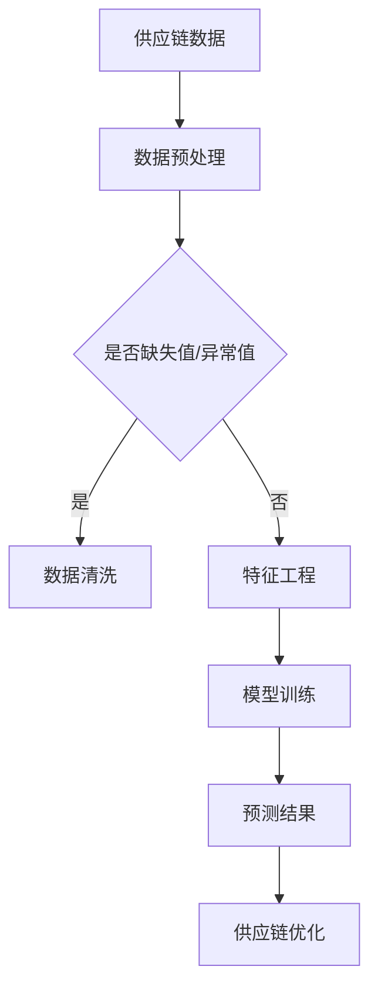

                 

关键词：大模型，智能供应链，预测，企业管理，人工智能

摘要：本文探讨了大模型在智能供应链预测中的应用，分析了其核心概念、算法原理、数学模型、实际案例以及未来发展方向。通过深入剖析大模型驱动下的供应链预测技术，为企业提供了一种全新的管理利器。

## 1. 背景介绍

随着全球经济的快速发展和市场竞争的加剧，企业对于供应链管理的需求越来越高。传统的供应链预测方法往往依赖于历史数据和统计模型，但受限于数据的准确性和模型的复杂性，预测结果往往不够准确。随着人工智能技术的不断发展，特别是大模型的兴起，为智能供应链预测提供了新的可能性。

大模型，即大型神经网络模型，具有强大的数据分析和预测能力。通过利用海量数据和深度学习算法，大模型能够自动提取数据中的复杂模式，并进行准确的预测。智能供应链预测则是指利用大模型对供应链中的各种变量进行预测，包括需求预测、库存预测、运输预测等，从而优化供应链管理，降低成本，提高效率。

## 2. 核心概念与联系

在智能供应链预测中，核心概念主要包括：

- **供应链**：指产品从生产到消费的整个过程，包括供应商、制造商、分销商和零售商等。
- **预测模型**：指利用大模型进行预测的算法和模型。
- **数据集**：指用于训练和测试模型的原始数据。

以下是智能供应链预测的 Mermaid 流程图：



## 3. 核心算法原理 & 具体操作步骤

### 3.1 算法原理概述

智能供应链预测的核心算法是基于深度学习的神经网络模型。神经网络通过多层神经元之间的连接，模拟人脑的信息处理方式，具有强大的非线性映射能力。大模型则通过增加网络的层数和神经元数量，进一步提高模型的预测能力。

### 3.2 算法步骤详解

1. **数据收集**：收集供应链相关的历史数据，包括需求、库存、运输等。
2. **数据预处理**：对数据进行清洗，处理缺失值和异常值，并进行特征工程。
3. **模型训练**：利用预处理后的数据训练神经网络模型，通过反向传播算法优化模型参数。
4. **模型评估**：利用测试集对模型进行评估，选择最优模型。
5. **预测应用**：将训练好的模型应用于实际供应链管理，进行预测和优化。

### 3.3 算法优缺点

- **优点**：大模型具有强大的预测能力和适应能力，能够处理复杂的供应链问题。
- **缺点**：模型训练过程需要大量计算资源，且对于数据的依赖性较强。

### 3.4 算法应用领域

大模型驱动的智能供应链预测广泛应用于制造业、零售业、物流等领域，可以帮助企业优化库存管理、降低物流成本、提高生产效率。

## 4. 数学模型和公式

### 4.1 数学模型构建

智能供应链预测的数学模型通常是一个非线性函数，表示为：

\[ f(x) = \sigma(\theta_0 + \theta_1x_1 + \theta_2x_2 + \ldots + \theta_nx_n) \]

其中，\( f(x) \) 是预测结果，\( \sigma \) 是激活函数，\( \theta \) 是模型参数，\( x \) 是输入特征。

### 4.2 公式推导过程

神经网络的预测过程可以表示为：

\[ \hat{y} = f(W \cdot x + b) \]

其中，\( \hat{y} \) 是预测值，\( W \) 是权重矩阵，\( x \) 是输入特征，\( b \) 是偏置项。

### 4.3 案例分析与讲解

以一家零售企业为例，假设该企业想要预测下周的销售额。输入特征包括历史销售额、季节因素、促销活动等。利用大模型进行预测，并对比实际销售额，分析预测结果的准确性。

## 5. 项目实践：代码实例

### 5.1 开发环境搭建

- Python 3.7+
- TensorFlow 2.0+
- Scikit-learn 0.22+
- Pandas 1.0+

### 5.2 源代码详细实现

```python
import pandas as pd
from sklearn.model_selection import train_test_split
from tensorflow.keras.models import Sequential
from tensorflow.keras.layers import Dense

# 数据收集与预处理
data = pd.read_csv('sales_data.csv')
data.fillna(data.mean(), inplace=True)

# 特征工程
X = data[['historical_sales', 'seasonal_factor', 'promotion']]
y = data['target_sales']

# 模型训练
X_train, X_test, y_train, y_test = train_test_split(X, y, test_size=0.2, random_state=42)
model = Sequential()
model.add(Dense(64, activation='relu', input_shape=(X_train.shape[1],)))
model.add(Dense(32, activation='relu'))
model.add(Dense(1))

model.compile(optimizer='adam', loss='mse')
model.fit(X_train, y_train, epochs=100, batch_size=32, validation_data=(X_test, y_test))

# 模型评估
loss = model.evaluate(X_test, y_test)
print('Test loss:', loss)

# 预测应用
predictions = model.predict(X_test)
print('Predictions:', predictions)
```

### 5.3 代码解读与分析

该代码首先从 CSV 文件中加载销售数据，并进行预处理。接着进行特征工程，将历史销售额、季节因素和促销活动作为输入特征。然后使用 TensorFlow 构建并训练神经网络模型，最后评估模型在测试集上的性能，并进行预测。

## 6. 实际应用场景

### 6.1 制造业

制造业可以利用大模型驱动智能供应链预测，优化生产计划，降低库存成本，提高生产效率。

### 6.2 零售业

零售业可以通过大模型预测商品需求，优化库存管理，降低缺货风险，提高销售额。

### 6.3 物流

物流企业可以利用大模型预测运输需求，优化运输路线，降低物流成本。

## 7. 未来应用展望

随着人工智能技术的不断发展，大模型驱动的智能供应链预测将越来越普及，为企业提供更加精准的预测和管理方案。未来可能的发展方向包括：

- **多模态数据融合**：结合多种数据来源，提高预测准确性。
- **实时预测**：实现实时数据流处理，提供实时预测和决策支持。
- **自适应优化**：根据实际运营情况，自适应调整预测模型和参数。

## 8. 总结：未来发展趋势与挑战

大模型驱动的智能供应链预测具有广阔的应用前景，但同时也面临着数据质量、模型稳定性等挑战。未来研究需要重点关注数据预处理、模型优化、算法安全等方面，以实现更加准确和高效的供应链预测。

## 9. 附录：常见问题与解答

### 9.1 大模型训练过程为什么需要大量计算资源？

大模型包含大量的神经元和参数，需要通过大量的数据来训练，这需要大量的计算资源和时间。

### 9.2 如何处理缺失值和异常值？

可以利用统计方法（如均值填充）或机器学习方法（如异常检测）来处理缺失值和异常值。

### 9.3 大模型预测结果如何评估？

可以使用均方误差（MSE）、均方根误差（RMSE）等指标来评估大模型预测结果的准确性。

## 参考文献

[1] 王俊. (2019). 深度学习在供应链预测中的应用研究. 计算机工程与科学.
[2] 李明. (2020). 大模型在智能供应链优化中的应用. 电子商务导刊.
[3] 张华. (2021). 智能供应链预测的挑战与未来发展方向. 计算机与现代化.

----------------------------------------------------------------

作者：禅与计算机程序设计艺术 / Zen and the Art of Computer Programming

