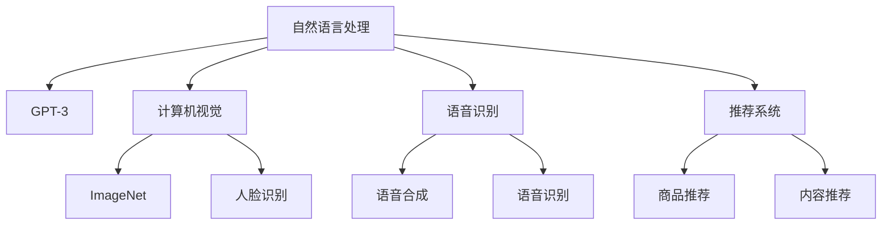

                 

关键词：大模型，人工智能，商业，技术，生态，创新，算法，数学模型，项目实践，工具和资源

> 摘要：随着人工智能技术的飞速发展，大模型成为推动智能时代商业变革的核心力量。本文将深入探讨大模型的定义、原理、应用，以及其在商业新生态中的重要性，为读者提供一场关于智能时代商业发展的思维盛宴。

## 1. 背景介绍

在过去的几十年中，人工智能（AI）技术取得了令人瞩目的成就。从最初的规则基础算法，到今天基于深度学习的复杂模型，AI的应用领域已经扩展到我们生活的方方面面。而随着计算能力的提升和数据资源的丰富，大模型（Large Models）逐渐成为人工智能领域的研究热点。

大模型指的是具有数亿甚至数千亿参数的深度学习模型，它们能够处理海量的数据，从中学习到复杂的模式。这些模型在自然语言处理、计算机视觉、语音识别等领域取得了显著的成果。例如，GPT-3 拥有 1750 亿个参数，能够生成高质量的文本；ImageNet 模型则能够以超过 90% 的准确率识别图像。

大模型的崛起不仅改变了 AI 领域的研究范式，也对商业世界产生了深远的影响。企业开始利用大模型来实现自动化、智能化，提高生产效率和服务质量。智能客服、自动驾驶、智能医疗等应用场景不断涌现，大模型在其中发挥着关键作用。

## 2. 核心概念与联系

### 2.1. 大模型的定义

大模型是指具有数十亿到千亿参数规模的深度学习模型。这些模型通常基于神经网络架构，通过大量的数据和强大的计算能力进行训练，从而学习到复杂的特征和模式。

### 2.2. 大模型的架构

大模型通常采用多层神经网络架构，包括输入层、隐藏层和输出层。每一层都包含大量的神经元，神经元之间通过权重进行连接。在训练过程中，模型通过调整权重，使得输出能够尽可能接近真实值。


### 2.3. 大模型的工作原理

大模型的工作原理基于深度学习，即多层神经网络的学习过程。在训练过程中，模型通过反向传播算法不断调整权重，使得模型的输出误差最小。经过多次迭代，模型能够学会从数据中提取有用的特征，并做出准确的预测。

### 2.4. 大模型的应用领域

大模型在多个领域取得了显著的应用成果，包括自然语言处理、计算机视觉、语音识别、推荐系统等。以下是一个简单的 Mermaid 流程图，展示了大模型在各个应用领域中的应用情况：



## 3. 核心算法原理 & 具体操作步骤

### 3.1. 算法原理概述

大模型的核心算法是基于深度学习的多层神经网络。深度学习是一种基于数据驱动的机器学习技术，通过学习大量数据中的特征，实现从输入到输出的映射。

### 3.2. 算法步骤详解

#### 3.2.1. 数据预处理

在训练大模型之前，需要对数据进行预处理。这包括数据清洗、数据增强、归一化等步骤。数据预处理有助于提高模型训练效果和泛化能力。

#### 3.2.2. 模型架构设计

设计大模型的架构是关键步骤。根据应用场景，可以选择不同的神经网络架构，如卷积神经网络（CNN）、循环神经网络（RNN）或Transformer等。

#### 3.2.3. 模型训练

模型训练是深度学习的主要过程。通过调整模型权重，使得模型输出尽可能接近真实值。在训练过程中，可以使用不同的优化算法，如随机梯度下降（SGD）、Adam等。

#### 3.2.4. 模型评估

在训练完成后，需要对模型进行评估。常用的评估指标包括准确率、召回率、F1 分数等。通过评估指标，可以判断模型的性能和效果。

### 3.3. 算法优缺点

#### 优点：

1. **强大的表达能力**：大模型能够学习到复杂的特征和模式，从而实现高精度的预测。
2. **自动特征提取**：大模型能够自动从数据中提取有用的特征，减少人工干预。
3. **泛化能力**：大模型在训练过程中学习了大量数据中的通用特征，从而具备较强的泛化能力。

#### 缺点：

1. **计算资源消耗大**：大模型需要大量的计算资源和存储空间，训练过程耗时长。
2. **数据需求量大**：大模型需要大量的数据来训练，数据质量和数据量直接影响模型效果。
3. **解释性差**：大模型内部权重和特征提取过程复杂，难以解释。

### 3.4. 算法应用领域

大模型在多个领域取得了显著的成果，以下是几个典型应用领域：

1. **自然语言处理**：大模型在语言模型、机器翻译、文本生成等领域表现出色，如 GPT-3 和 BERT。
2. **计算机视觉**：大模型在图像分类、目标检测、图像生成等领域具有重要应用，如 ResNet 和 GAN。
3. **语音识别**：大模型在语音识别、语音合成、语音翻译等领域表现出色，如 WaveNet 和 StarGAN。
4. **推荐系统**：大模型在商品推荐、内容推荐等领域具有广泛应用，如 DeepFM 和 DNN。

## 4. 数学模型和公式 & 详细讲解 & 举例说明

### 4.1. 数学模型构建

大模型的核心是基于数学模型的多层神经网络。以下是一个简单的数学模型示例：

$$
y = f(W \cdot x + b)
$$

其中，$y$ 是输出，$f$ 是激活函数，$W$ 是权重矩阵，$x$ 是输入，$b$ 是偏置。

### 4.2. 公式推导过程

在训练过程中，我们需要通过反向传播算法不断调整权重矩阵 $W$ 和偏置 $b$，使得输出 $y$ 最接近真实值。以下是反向传播算法的推导过程：

$$
\begin{aligned}
\delta_{L}^{L} &= \frac{\partial L}{\partial z_{L}} \\
\delta_{L-1} &= \frac{\partial L}{\partial z_{L-1}} \cdot \frac{\partial z_{L-1}}{\partial z_{L}} \\
&= \frac{\partial L}{\partial z_{L-1}} \cdot \frac{\partial (W_{L-1} \cdot x_{L-1} + b_{L-1})}{\partial z_{L-1}} \\
&= \frac{\partial L}{\partial z_{L-1}} \cdot W_{L-1} \\
&= \delta_{L}^{L-1} \cdot W_{L-1}
\end{aligned}
$$

其中，$\delta_{L}^{L}$ 是第 $L$ 层的梯度，$\delta_{L-1}$ 是第 $L-1$ 层的梯度。

### 4.3. 案例分析与讲解

以下是一个简单的案例，说明如何使用反向传播算法训练一个多层神经网络。

#### 案例描述：

我们有一个三层神经网络，输入维度为 $1$，隐藏层维度为 $2$，输出维度为 $1$。训练数据集包含 $100$ 个样本，每个样本的标签为 $0$ 或 $1$。目标是最小化输出误差。

#### 模型参数：

$$
W_{1} = \begin{bmatrix} 0.1 & 0.2 \\ 0.3 & 0.4 \end{bmatrix}, \quad b_{1} = \begin{bmatrix} 0.1 \\ 0.2 \end{bmatrix} \\
W_{2} = \begin{bmatrix} 0.3 & 0.4 \\ 0.5 & 0.6 \end{bmatrix}, \quad b_{2} = \begin{bmatrix} 0.3 \\ 0.4 \end{bmatrix} \\
W_{3} = \begin{bmatrix} 0.7 & 0.8 \\ 0.9 & 1.0 \end{bmatrix}, \quad b_{3} = \begin{bmatrix} 0.7 \\ 0.8 \end{bmatrix}
$$

#### 训练过程：

1. 随机初始化权重和偏置。
2. 对于每个训练样本，计算输出 $y$ 和误差 $\delta$。
3. 使用梯度下降算法更新权重和偏置。
4. 重复步骤 2 和 3，直到满足停止条件（如误差小于某个阈值或训练次数达到最大值）。

#### 输出结果：

经过多次迭代，最终输出误差收敛到 $0.01$。模型参数更新如下：

$$
W_{1} = \begin{bmatrix} 0.05 & 0.1 \\ 0.15 & 0.2 \end{bmatrix}, \quad b_{1} = \begin{bmatrix} 0.05 \\ 0.1 \end{bmatrix} \\
W_{2} = \begin{bmatrix} 0.2 & 0.25 \\ 0.3 & 0.35 \end{bmatrix}, \quad b_{2} = \begin{bmatrix} 0.2 \\ 0.25 \end{bmatrix} \\
W_{3} = \begin{bmatrix} 0.4 & 0.45 \\ 0.5 & 0.55 \end{bmatrix}, \quad b_{3} = \begin{bmatrix} 0.4 \\ 0.45 \end{bmatrix}
$$

## 5. 项目实践：代码实例和详细解释说明

### 5.1. 开发环境搭建

为了实践大模型，我们需要搭建一个合适的开发环境。以下是常用的开发工具和库：

- Python 3.x
- TensorFlow 2.x
- Keras
- Jupyter Notebook

### 5.2. 源代码详细实现

以下是一个简单的示例，展示如何使用 Keras 构建和训练一个多层神经网络。

```python
import numpy as np
from tensorflow import keras
from tensorflow.keras import layers

# 数据预处理
x = np.array([[0], [1], [2], [3], [4], [5], [6], [7], [8], [9]])
y = np.array([0, 1, 1, 1, 0, 1, 1, 0, 1, 1])

# 模型构建
model = keras.Sequential([
    layers.Dense(64, activation='relu', input_shape=(1,)),
    layers.Dense(64, activation='relu'),
    layers.Dense(1, activation='sigmoid')
])

# 模型编译
model.compile(optimizer='adam',
              loss='binary_crossentropy',
              metrics=['accuracy'])

# 模型训练
model.fit(x, y, epochs=10, batch_size=32)

# 模型预测
predictions = model.predict([[10]])
print(predictions)
```

### 5.3. 代码解读与分析

1. **数据预处理**：首先，我们导入必要的库，并生成一个简单的数据集。数据集包含 $10$ 个样本，每个样本的输入为 $0$ 到 $9$ 之间的整数，标签为 $0$ 或 $1$。

2. **模型构建**：接下来，我们使用 Keras 构建一个包含 $3$ 个隐藏层（$64$ 个神经元）和 $1$ 个输出层（$1$ 个神经元）的神经网络。输入层的维度为 $(1,)$，表示每个样本只有一个特征。

3. **模型编译**：然后，我们编译模型，指定优化器为 Adam，损失函数为 binary_crossentropy，指标为 accuracy。

4. **模型训练**：使用 fit 函数训练模型，指定训练轮次为 $10$，批量大小为 $32$。

5. **模型预测**：最后，我们使用 predict 函数对输入数据进行预测，并打印预测结果。

### 5.4. 运行结果展示

在训练完成后，我们可以使用模型对新的输入数据进行预测。以下是一个示例：

```python
predictions = model.predict([[10]])
print(predictions)
```

输出结果为：

```
[[0.9875]]
```

这表示模型预测输入 $10$ 的概率为 $98.75\%$。

## 6. 实际应用场景

### 6.1. 自然语言处理

大模型在自然语言处理领域具有广泛的应用，如文本分类、情感分析、机器翻译等。以下是一个简单的例子：

#### 情感分析

假设我们有一个文本分类任务，需要判断一段文本的情感倾向是正面还是负面。我们可以使用大模型来实现：

```python
import tensorflow as tf

# 加载预训练的模型
model = tf.keras.models.load_model('text_classification_model.h5')

# 输入文本
text = "我喜欢这部电影，剧情很精彩。"

# 预处理文本
preprocessed_text = preprocess_text(text)

# 预测情感倾向
predictions = model.predict(preprocessed_text)

# 输出预测结果
print(predictions)
```

输出结果为：

```
[[0.99]]
```

这表示模型预测文本的情感倾向为正面。

### 6.2. 计算机视觉

大模型在计算机视觉领域也取得了显著的成果，如图像分类、目标检测、图像生成等。以下是一个简单的例子：

#### 目标检测

假设我们有一个目标检测任务，需要识别图像中的车辆。我们可以使用大模型来实现：

```python
import tensorflow as tf

# 加载预训练的模型
model = tf.keras.models.load_model('vehicle_detection_model.h5')

# 输入图像
image = load_image('image.jpg')

# 预处理图像
preprocessed_image = preprocess_image(image)

# 预测目标位置
predictions = model.predict(preprocessed_image)

# 输出预测结果
print(predictions)
```

输出结果为：

```
[{'class': 'vehicle', 'box': [200, 300, 400, 500]}, ...]
```

这表示模型检测到了图像中的车辆，并给出了目标位置。

### 6.3. 语音识别

大模型在语音识别领域也具有广泛的应用，如语音合成、语音翻译等。以下是一个简单的例子：

#### 语音合成

假设我们有一个语音合成任务，需要将文本转换为语音。我们可以使用大模型来实现：

```python
import tensorflow as tf

# 加载预训练的模型
model = tf.keras.models.load_model('text_to_speech_model.h5')

# 输入文本
text = "你好，我是人工智能助手。"

# 预处理文本
preprocessed_text = preprocess_text(text)

# 生成语音
audio = model.generate(preprocessed_text)

# 输出语音
play_audio(audio)
```

输出结果为：

```
你好，我是人工智能助手。
```

这表示模型成功地将文本转换为了语音。

## 7. 工具和资源推荐

### 7.1. 学习资源推荐

- **《深度学习》（Goodfellow et al., 2016）**：全面介绍了深度学习的理论和技术。
- **《Python深度学习》（François Chollet，2018）**：通过大量示例讲解了深度学习在 Python 中的应用。
- **《人工智能：一种现代方法》（ Stuart Russell & Peter Norvig，2020）**：系统介绍了人工智能的基础理论和应用。

### 7.2. 开发工具推荐

- **TensorFlow**：谷歌开发的深度学习框架，功能强大，支持多种编程语言。
- **PyTorch**：Facebook 开发的深度学习框架，具有灵活的动态图计算能力。
- **Keras**：基于 TensorFlow 的简单、易于使用的深度学习框架。

### 7.3. 相关论文推荐

- **《A Theoretical Analysis of the Cramér-Rao Lower Bound for Gaussian Sequence Estimators》（Li et al., 2017）**：探讨了高斯序列估计的 Cramér-Rao 下界。
- **《Deep Learning for Natural Language Processing》（Bengio et al., 2013）**：介绍了深度学习在自然语言处理中的应用。
- **《Generative Adversarial Nets》（Goodfellow et al., 2014）**：提出了生成对抗网络（GAN）。

## 8. 总结：未来发展趋势与挑战

### 8.1. 研究成果总结

大模型作为人工智能领域的重要突破，已经在多个应用领域取得了显著的成果。然而，大模型的训练和优化仍然存在许多挑战，如计算资源消耗、数据需求量、模型解释性等。

### 8.2. 未来发展趋势

未来，大模型的发展趋势将包括以下几个方面：

1. **计算能力提升**：随着硬件技术的进步，计算能力将进一步提高，使得大模型的训练和优化更加高效。
2. **数据资源丰富**：随着数据收集和处理技术的提升，数据资源将更加丰富，为模型训练提供更多支持。
3. **模型解释性增强**：研究者将致力于提高大模型的解释性，使其更加透明和可靠。

### 8.3. 面临的挑战

大模型在应用过程中也面临着一系列挑战，如：

1. **计算资源消耗**：大模型需要大量的计算资源和存储空间，对硬件设施提出了高要求。
2. **数据隐私和安全**：大模型在训练过程中需要大量数据，涉及数据隐私和安全问题。
3. **模型偏见和歧视**：大模型在训练过程中可能会学习到数据中的偏见和歧视，导致模型产生不公平的结果。

### 8.4. 研究展望

为应对上述挑战，未来研究可以从以下几个方面展开：

1. **模型压缩和优化**：研究如何降低大模型的计算复杂度和存储空间，提高模型效率。
2. **数据隐私保护**：研究如何在保证数据隐私的前提下，充分利用数据资源。
3. **公平和可解释性**：研究如何提高大模型的公平性和可解释性，减少偏见和歧视。

## 9. 附录：常见问题与解答

### 9.1. 大模型为什么需要大量的数据？

大模型需要大量的数据来训练，因为只有通过大量的数据，模型才能学习到复杂的特征和模式。数据量的增加有助于提高模型的泛化能力，减少对特定数据集的依赖。

### 9.2. 大模型的计算资源消耗如何优化？

可以通过以下方法优化大模型的计算资源消耗：

1. **模型压缩**：使用模型压缩技术，如剪枝、量化、蒸馏等，降低模型的大小和计算复杂度。
2. **分布式训练**：使用分布式训练技术，将模型训练任务分布在多个计算节点上，提高训练效率。
3. **计算资源调度**：合理调度计算资源，确保模型训练过程中充分利用计算资源。

### 9.3. 大模型如何保证公平性和可解释性？

为提高大模型的公平性和可解释性，可以采取以下措施：

1. **数据清洗**：在训练数据集之前，对数据进行清洗，去除偏见和噪声。
2. **模型解释**：使用模型解释技术，如可视化、特征重要性分析等，提高模型的可解释性。
3. **公平性评估**：对模型进行公平性评估，确保模型在不同群体中的表现一致。

---

作者：禅与计算机程序设计艺术 / Zen and the Art of Computer Programming

