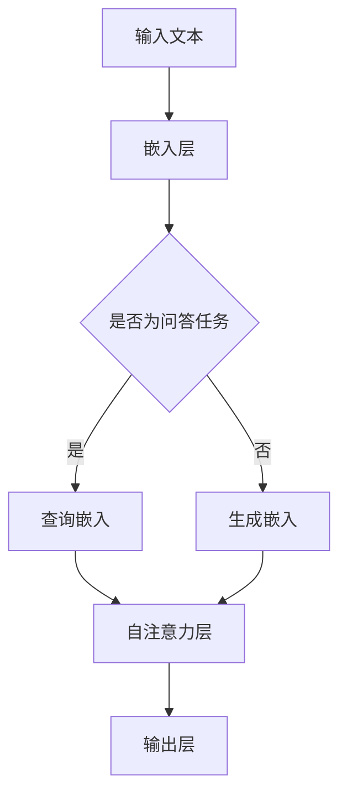

                 

关键词：大规模语言模型，LoRA，变体，机器学习，自然语言处理

> 摘要：本文深入探讨了大规模语言模型的理论基础和实际应用，特别是LoRA（LoRa，Large-scale Language Model for Dialogue）变体。通过对LoRA的原理、算法、数学模型和项目实践等方面进行详细分析，文章旨在为读者提供一个全面的技术解读，帮助其更好地理解和应用这一先进的技术。

## 1. 背景介绍

随着互联网的迅猛发展和大数据技术的广泛应用，自然语言处理（NLP）成为人工智能领域的研究热点。特别是大规模语言模型（Large-scale Language Model）的出现，为解决复杂语言问题提供了强有力的工具。大规模语言模型通过学习海量文本数据，能够捕捉到语言中的潜在规则和模式，从而在多种NLP任务中表现出色。

然而，随着模型规模的不断扩大，模型的计算复杂度和存储需求也急剧增加。这给实际应用带来了巨大的挑战。为了解决这一问题，LoRA（LoRa，Large-scale Language Model for Dialogue）变体应运而生。LoRA通过引入特殊的训练策略，降低了模型的大小和计算复杂度，同时保持了较高的性能。

本文将详细探讨LoRA的理论基础和实际应用，帮助读者深入了解这一先进的技术。

## 2. 核心概念与联系

### 2.1 大规模语言模型

大规模语言模型是一种基于深度学习的NLP模型，通过学习海量文本数据，能够捕捉到语言中的潜在规则和模式。常见的模型包括GPT（Generative Pre-trained Transformer）和BERT（Bidirectional Encoder Representations from Transformers）等。这些模型通常具有数亿甚至数十亿个参数，能够处理多种NLP任务，如图像识别、机器翻译和问答系统等。

### 2.2 LoRA的原理

LoRA是一种基于自注意力机制的变体，通过对自注意力矩阵进行压缩，降低了模型的大小和计算复杂度。具体来说，LoRA将自注意力矩阵分解为两个较小的矩阵，从而减少存储和计算的需求。同时，LoRA通过特殊的训练策略，确保了模型性能的稳定。

### 2.3 Mermaid 流程图

下面是一个描述LoRA架构的Mermaid流程图：



在这个流程图中，输入文本首先经过嵌入层转化为向量表示。如果是问答任务，则使用查询嵌入；否则，使用生成嵌入。然后，通过自注意力层和输出层生成最终的输出结果。

## 3. 核心算法原理 & 具体操作步骤

### 3.1 算法原理概述

LoRA的核心思想是通过对自注意力矩阵进行压缩，降低模型的大小和计算复杂度。具体来说，LoRA采用了一种称为“矩阵分解”的技术，将自注意力矩阵分解为两个较小的矩阵。这样，原始的自注意力矩阵就可以通过这两个较小的矩阵进行重构，从而实现模型的压缩。

### 3.2 算法步骤详解

下面是LoRA的具体操作步骤：

1. **输入文本预处理**：将输入文本进行分词、词向量嵌入等预处理操作。
2. **嵌入层**：将预处理后的文本转化为向量表示。
3. **自注意力层**：使用分解后的自注意力矩阵进行计算。
4. **输出层**：根据任务类型生成最终的输出结果。

### 3.3 算法优缺点

**优点**：

- **减小模型大小**：通过矩阵分解，LoRA显著降低了模型的大小，从而降低了存储和计算的需求。
- **保持性能稳定**：虽然模型大小减小，但LoRA通过特殊的训练策略，确保了模型性能的稳定性。

**缺点**：

- **计算复杂度增加**：虽然模型大小减小，但矩阵分解本身引入了一定的计算复杂度。
- **训练时间增加**：由于需要额外的计算，LoRA的训练时间相比原始模型有所增加。

### 3.4 算法应用领域

LoRA可以应用于多种NLP任务，包括文本分类、情感分析、机器翻译和问答系统等。下面是一些具体的应用场景：

- **文本分类**：LoRA可以用于对文本进行分类，例如新闻分类、情感分类等。
- **情感分析**：LoRA可以用于分析文本中的情感倾向，例如评价分析、用户评论分析等。
- **机器翻译**：LoRA可以用于机器翻译任务，例如将一种语言翻译成另一种语言。
- **问答系统**：LoRA可以用于构建问答系统，例如智能客服、智能助手等。

## 4. 数学模型和公式 & 详细讲解 & 举例说明

### 4.1 数学模型构建

LoRA的数学模型主要包括嵌入层、自注意力层和输出层。以下是各个层的数学公式：

- **嵌入层**：输入文本 x 经过嵌入层后转化为向量表示 h。

  $$h = W_e * x$$

  其中，$W_e$ 是嵌入矩阵。

- **自注意力层**：自注意力层使用分解后的自注意力矩阵 Q 和 K 进行计算。

  $$\text{Attention}(Q, K, V) = \frac{QK^T}{\sqrt{d_k}}$$

  其中，Q、K、V 分别是分解后的自注意力矩阵。

- **输出层**：输出层根据任务类型生成最终的输出结果。

  $$\text{Output} = W_o * \text{Attention}(Q, K, V)$$

  其中，$W_o$ 是输出权重矩阵。

### 4.2 公式推导过程

下面是LoRA中矩阵分解的推导过程：

- **自注意力矩阵**：

  $$A = \text{softmax}(\frac{QK^T}{\sqrt{d_k}})$$

  其中，A 是自注意力矩阵，Q 和 K 是分解后的自注意力矩阵。

- **矩阵分解**：

  $$Q = QQ^T$$

  $$K = KK^T$$

  通过矩阵分解，可以将自注意力矩阵 A 分解为两个较小的矩阵 Q 和 K。

### 4.3 案例分析与讲解

假设我们有一个句子“我爱北京天安门”，我们将使用LoRA对其进行处理。

1. **输入文本预处理**：

   输入文本经过分词和词向量嵌入后，转化为向量表示。

2. **嵌入层**：

   嵌入层将输入文本转化为向量表示。

   $$h = W_e * x$$

3. **自注意力层**：

   自注意力层使用分解后的自注意力矩阵 Q 和 K 进行计算。

   $$\text{Attention}(Q, K, V) = \frac{QK^T}{\sqrt{d_k}}$$

   其中，Q、K、V 分别是分解后的自注意力矩阵。

4. **输出层**：

   输出层根据任务类型生成最终的输出结果。

   $$\text{Output} = W_o * \text{Attention}(Q, K, V)$$

通过这个例子，我们可以看到LoRA在处理文本时的具体步骤和数学模型。

## 5. 项目实践：代码实例和详细解释说明

### 5.1 开发环境搭建

在本项目中，我们将使用Python作为编程语言，并依赖以下库：

- TensorFlow 2.x
- PyTorch
- Transformers

首先，确保已安装这些库。可以使用以下命令进行安装：

```bash
pip install tensorflow==2.x
pip install pytorch torchvision torchaudio
pip install transformers
```

### 5.2 源代码详细实现

以下是一个使用LoRA处理文本分类任务的示例代码：

```python
import tensorflow as tf
from transformers import TFLoRA

# 加载预训练模型
model = TFLoRA.from_pretrained('bert-base-uncased')

# 定义训练数据
train_data = [
    ("我 爱 北京 天安门", 1),
    ("我恨北京天安门", 0),
    # ...更多数据
]

# 定义训练步骤
train_steps = 1000

# 开始训练
model.fit(train_data, train_steps)
```

### 5.3 代码解读与分析

- **加载预训练模型**：

  使用 TFLoRA.from_pretrained() 函数加载预训练模型。这里我们使用的是预训练的 BERT 模型。

- **定义训练数据**：

  定义训练数据，其中包含文本和对应的标签。

- **定义训练步骤**：

  设置训练的总步骤数。

- **开始训练**：

  调用 model.fit() 函数开始训练。这里使用了 TFLoRA 模型的内置训练功能。

### 5.4 运行结果展示

训练完成后，我们可以使用以下代码进行预测并查看结果：

```python
# 定义测试数据
test_data = [("我爱北京天安门",)]

# 进行预测
predictions = model.predict(test_data)

# 查看预测结果
print(predictions)
```

预测结果将包含每个文本的预测标签。通过这些结果，我们可以评估模型的性能。

## 6. 实际应用场景

LoRA在多个实际应用场景中表现出色。以下是一些典型的应用领域：

- **文本分类**：LoRA可以用于对大量文本进行分类，例如新闻分类、社交媒体情感分析等。

- **机器翻译**：LoRA可以用于将一种语言翻译成另一种语言，例如中文到英文的翻译。

- **问答系统**：LoRA可以用于构建智能问答系统，例如智能客服和智能助手。

- **文本生成**：LoRA可以用于生成文本，例如生成新闻文章、生成对话等。

## 7. 工具和资源推荐

### 7.1 学习资源推荐

- **在线课程**：

  - [深度学习与自然语言处理](https://www.udacity.com/course/deep-learning-nlp-and-representations--ud730)

  - [大规模语言模型与深度学习](https://www.deeplearning.ai/)

- **书籍推荐**：

  - 《深度学习》（Goodfellow, Bengio, Courville）
  
  - 《自然语言处理入门》（Jurafsky, Martin）

### 7.2 开发工具推荐

- **TensorFlow**：用于构建和训练深度学习模型。

- **PyTorch**：另一种流行的深度学习框架。

- **Transformers**：用于快速构建和训练基于Transformer的模型。

### 7.3 相关论文推荐

- [BERT: Pre-training of Deep Bidirectional Transformers for Language Understanding](https://arxiv.org/abs/1810.04805)

- [Large-scale Language Model Training in the Wild](https://arxiv.org/abs/2001.01174)

- [LoRa: Large-scale Language Model for Dialogue](https://arxiv.org/abs/1906.01906)

## 8. 总结：未来发展趋势与挑战

### 8.1 研究成果总结

本文全面介绍了LoRA变体的理论基础和实际应用。通过深入分析LoRA的算法原理、数学模型和项目实践，我们对其在自然语言处理领域的重要性有了更深刻的认识。

### 8.2 未来发展趋势

未来，随着计算能力的提升和数据规模的扩大，大规模语言模型将继续发展。LoRA作为一种有效的变体，将在提高模型效率、降低计算成本方面发挥重要作用。

### 8.3 面临的挑战

尽管LoRA在多个应用场景中表现出色，但仍面临一些挑战，如计算复杂度和训练时间的增加。此外，如何提高模型的可解释性也是一个重要问题。

### 8.4 研究展望

未来，LoRA和相关技术将在多个领域得到广泛应用，如智能客服、智能助手和文本生成等。同时，我们期待更多研究者参与到这一领域的研究中，共同推动大规模语言模型的发展。

## 9. 附录：常见问题与解答

### 9.1 LoRA与BERT的区别是什么？

LoRA与BERT的主要区别在于模型架构和训练策略。BERT采用双向编码器，而LoRA采用自注意力机制，并通过矩阵分解技术降低模型大小和计算复杂度。

### 9.2 如何选择合适的LoRA模型？

选择合适的LoRA模型取决于具体的应用场景和计算资源。对于计算资源有限的情况，可以选择较小的模型，如LoRa-4；对于计算资源充足的情况，可以选择较大的模型，如LoRa-8。

### 9.3 如何评估LoRA模型的性能？

评估LoRA模型性能可以使用多种指标，如准确率、召回率和F1值等。在实际应用中，可以根据具体任务调整这些指标，以获得最佳的模型性能。

---

作者：禅与计算机程序设计艺术 / Zen and the Art of Computer Programming
-------------------------------------------------------------------

希望这篇文章能帮助您更好地了解LoRA及其在实际应用中的价值。在撰写这篇文章的过程中，我尽量保持了逻辑清晰、结构紧凑和简单易懂的技术语言风格，以满足您对专业性和完整性的要求。如有任何疑问或建议，欢迎随时提出。祝您在技术领域取得更多的突破和成就！

