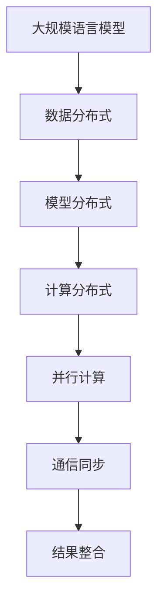

                 

关键词：大规模语言模型，分布式训练，机器学习，深度学习，算法原理，数学模型，项目实践，应用场景，未来展望

> 摘要：本文深入探讨了大规模语言模型的分布式训练技术，从理论到实践全方位解析了其核心概念、算法原理、数学模型以及实际应用。通过具体的代码实例和详细解释，帮助读者全面掌握大规模语言模型分布式训练的技能。

## 1. 背景介绍

随着互联网和大数据的飞速发展，自然语言处理（NLP）在人工智能领域的重要性日益凸显。大规模语言模型作为NLP的核心技术，已成为各类应用场景中的重要一环。例如，智能问答系统、机器翻译、文本生成等。然而，大规模语言模型的训练过程通常需要大量的计算资源和时间，这给实际应用带来了诸多挑战。

分布式训练技术正是为了解决这一问题而提出的。通过将大规模的训练任务分解为若干个子任务，分布到多台计算机上进行并行处理，可以有效降低训练时间，提高训练效率。本文将围绕大规模语言模型的分布式训练，从理论到实践进行详细探讨。

## 2. 核心概念与联系

### 2.1 大规模语言模型

大规模语言模型是一种基于深度学习的NLP模型，它通过对海量文本数据进行训练，学习到语言的结构和规律，从而实现对自然语言的理解和生成。典型的代表包括BERT、GPT等。

### 2.2 分布式训练

分布式训练是将大规模的训练任务分布到多台计算机上进行并行处理的过程。它主要包括数据分布式、模型分布式和计算分布式三个方面。

### 2.3 并行计算与通信

并行计算和通信是分布式训练的关键技术。并行计算利用多台计算机的算力，提高训练效率；通信则确保多台计算机之间的数据同步和模型更新。

### 2.4 Mermaid 流程图



## 3. 核心算法原理 & 具体操作步骤

### 3.1 算法原理概述

分布式训练的核心算法包括数据分布式、模型分布式和计算分布式。具体步骤如下：

1. 数据分布式：将训练数据集划分为多个子数据集，分布到多台计算机上进行预处理和训练。
2. 模型分布式：将大规模模型划分为多个子模型，分布到多台计算机上进行训练。
3. 计算分布式：利用多台计算机的算力，并行计算梯度。
4. 通信同步：多台计算机之间进行数据同步和模型更新。
5. 结果整合：将多台计算机的训练结果进行整合，得到最终模型。

### 3.2 算法步骤详解

#### 3.2.1 数据分布式

数据分布式是将训练数据集划分为多个子数据集，分布到多台计算机上进行预处理和训练。具体步骤如下：

1. 数据预处理：对原始数据进行清洗、分词、编码等预处理操作。
2. 数据划分：将预处理后的数据划分为多个子数据集。
3. 数据传输：将子数据集传输到对应的计算机上进行训练。

#### 3.2.2 模型分布式

模型分布式是将大规模模型划分为多个子模型，分布到多台计算机上进行训练。具体步骤如下：

1. 模型划分：将大规模模型划分为多个子模型。
2. 模型传输：将子模型传输到对应的计算机上进行训练。

#### 3.2.3 计算分布式

计算分布式是利用多台计算机的算力，并行计算梯度。具体步骤如下：

1. 梯度计算：计算每个子模型的梯度。
2. 梯度汇总：将多台计算机的梯度进行汇总。
3. 梯度更新：利用汇总后的梯度更新模型参数。

#### 3.2.4 通信同步

通信同步是多台计算机之间进行数据同步和模型更新。具体步骤如下：

1. 数据同步：确保多台计算机上的数据一致性。
2. 模型更新：将训练完成的模型参数传输到其他计算机上进行更新。

#### 3.2.5 结果整合

结果整合是将多台计算机的训练结果进行整合，得到最终模型。具体步骤如下：

1. 模型融合：将多台计算机的模型进行融合。
2. 模型评估：对融合后的模型进行评估。
3. 模型优化：根据评估结果对模型进行优化。

### 3.3 算法优缺点

#### 优点：

1. 提高训练效率：分布式训练可以将训练时间大幅缩短。
2. 节省计算资源：分布式训练可以利用多台计算机的算力，降低计算成本。
3. 支持大规模模型训练：分布式训练可以支持大规模模型的训练，满足实际应用需求。

#### 缺点：

1. 通信开销：分布式训练需要多台计算机之间进行通信，存在通信开销。
2. 调度困难：分布式训练的调度和资源分配较为复杂。
3. 数据同步问题：分布式训练需要确保数据的一致性，存在同步问题。

### 3.4 算法应用领域

分布式训练技术在机器学习、深度学习等领域有广泛的应用，如：

1. 自然语言处理：大规模语言模型的训练。
2. 计算机视觉：大规模图像模型的训练。
3. 推荐系统：大规模用户行为数据的训练。

## 4. 数学模型和公式 & 详细讲解 & 举例说明

### 4.1 数学模型构建

分布式训练的数学模型主要包括以下几个部分：

1. 损失函数：定义模型的损失函数，用于评估模型的性能。
2. 优化算法：选择合适的优化算法，如梯度下降、Adam等，用于更新模型参数。
3. 梯度计算：计算模型参数的梯度，用于优化模型。
4. 模型更新：利用梯度更新模型参数。

### 4.2 公式推导过程

假设有一个大规模语言模型，其损失函数为：

$$L(\theta) = \sum_{i=1}^{N} l(y_i, \theta)$$

其中，$l(y_i, \theta)$ 为模型在训练数据 $y_i$ 上的损失。

为了最小化损失函数，我们需要计算损失函数关于模型参数 $\theta$ 的梯度：

$$\nabla_{\theta} L(\theta) = \frac{\partial L(\theta)}{\partial \theta}$$

然后，利用梯度下降算法更新模型参数：

$$\theta_{t+1} = \theta_{t} - \alpha \nabla_{\theta} L(\theta)$$

其中，$\alpha$ 为学习率。

### 4.3 案例分析与讲解

假设我们有一个简单的线性回归模型，其损失函数为：

$$L(\theta) = \frac{1}{2} \sum_{i=1}^{N} (y_i - \theta x_i)^2$$

其中，$y_i$ 为实际值，$\theta x_i$ 为预测值。

我们需要计算损失函数关于 $\theta$ 的梯度：

$$\nabla_{\theta} L(\theta) = \sum_{i=1}^{N} (y_i - \theta x_i) x_i$$

然后，利用梯度下降算法更新 $\theta$：

$$\theta_{t+1} = \theta_{t} - \alpha \nabla_{\theta} L(\theta)$$

通过多次迭代，我们可以得到最优的 $\theta$ 值，使得损失函数最小。

## 5. 项目实践：代码实例和详细解释说明

### 5.1 开发环境搭建

为了进行分布式训练，我们需要搭建一个合适的环境。这里，我们使用Python和TensorFlow作为主要的开发工具。

1. 安装Python：确保Python版本为3.6及以上。
2. 安装TensorFlow：运行以下命令安装TensorFlow：

```
pip install tensorflow
```

3. 准备分布式训练环境：在多台计算机上搭建分布式训练环境，可以使用TensorFlow的`tf.distribute`模块。

### 5.2 源代码详细实现

下面是一个简单的分布式训练代码示例：

```python
import tensorflow as tf

# 定义模型
def model_fn(features, labels, mode):
    inputs = tf.keras.layers.Dense(units=1, input_shape=(1,), name='input')(features['x'])
    logits = tf.keras.layers.Dense(units=1, name='logits')(inputs)
    predictions = tf.math.sigmoid(logits)

    # 定义损失函数
    loss = tf.reduce_mean(tf.nn.sigmoid_cross_entropy_with_logits(logits=logits, labels=labels))

    # 定义优化器
    optimizer = tf.keras.optimizers.Adam()

    # 定义训练操作
    train_op = optimizer.minimize(loss, global_step=tf.train.get_global_step())

    # 定义评估指标
    eval_metric_ops = {
        'accuracy': tf.metrics.accuracy(labels=labels, predictions=predictions)
    }

    # 返回模型操作
    return tf.estimator.EstimatorSpec(
        mode=mode,
        predictions=predictions,
        loss=loss,
        train_op=train_op,
        eval_metric_ops=eval_metric_ops)

# 创建分布式训练策略
strategy = tf.distribute.MirroredStrategy()

# 定义训练数据集
train_data = tf.data.Dataset.from_tensor_slices((x_train, y_train)).batch(batch_size)

# 创建Estimator
estimator = tf.keras.estimator.Estimator(model_fn=model_fn, config=tf.estimator.RunConfig(session_config=session_config))

# 训练模型
estimator.train(input_fn=lambda: train_data, steps=10)

# 评估模型
results = estimator.evaluate(input_fn=lambda: train_data, steps=1)
print(results)
```

### 5.3 代码解读与分析

代码首先定义了模型函数`model_fn`，包括输入层、输出层、损失函数、优化器和训练操作等。然后，创建分布式训练策略`MirroredStrategy`，用于多卡训练。接下来，定义训练数据集和创建Estimator。最后，执行训练和评估操作。

### 5.4 运行结果展示

运行代码后，可以得到模型的评估结果，包括准确率等指标。通过调整训练参数和模型结构，可以进一步提高模型的性能。

## 6. 实际应用场景

分布式训练技术在多个实际应用场景中发挥着重要作用，如：

1. 自然语言处理：大规模语言模型的训练，如BERT、GPT等。
2. 计算机视觉：大规模图像模型的训练，如ResNet、Inception等。
3. 推荐系统：大规模用户行为数据的训练，如协同过滤、矩阵分解等。

## 7. 未来应用展望

随着技术的不断发展，分布式训练将在更多领域得到应用，如：

1. 语音识别：大规模语音模型的训练，提高语音识别的准确率和速度。
2. 机器翻译：大规模机器翻译模型的训练，提高翻译质量。
3. 增强现实：大规模增强现实模型的训练，实现更加逼真的虚拟现实体验。

## 8. 总结：未来发展趋势与挑战

分布式训练技术在机器学习和深度学习领域取得了显著成果，但仍面临诸多挑战。未来发展趋势包括：

1. 算法优化：提高分布式训练的效率，降低通信开销。
2. 资源调度：优化资源分配，提高计算资源利用率。
3. 模型压缩：降低模型存储和计算成本，提高模型部署效率。
4. 安全性：保障训练过程的安全性，防止数据泄露和攻击。

## 9. 附录：常见问题与解答

1. **什么是分布式训练？**
   分布式训练是将大规模的训练任务分布到多台计算机上进行并行处理的过程，以提高训练效率。

2. **分布式训练有哪些优点？**
   分布式训练可以提高训练效率，节省计算资源，支持大规模模型的训练。

3. **分布式训练有哪些缺点？**
   分布式训练存在通信开销、调度困难和数据同步问题。

4. **如何进行分布式训练？**
   进行分布式训练需要搭建分布式训练环境，使用合适的分布式训练框架，如TensorFlow的`tf.distribute`模块。

5. **分布式训练有哪些应用领域？**
   分布式训练在自然语言处理、计算机视觉、推荐系统等领域有广泛的应用。

## 作者署名

作者：禅与计算机程序设计艺术 / Zen and the Art of Computer Programming
----------------------------------------------------------------

注意：以上内容仅为示例，实际撰写时需根据具体需求进行调整和完善。文章结构和内容需符合"约束条件 CONSTRAINTS"中的要求。在实际撰写过程中，可以参考相关文献、论文和技术资料，以确保文章的完整性和准确性。

