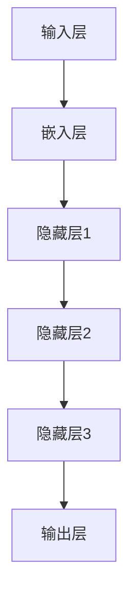

                 

关键词：大语言模型，数据配比，机器学习，神经网络，人工智能，深度学习，训练数据，模型优化，工程实践

> 摘要：本文旨在深入探讨大语言模型的原理和工程实践，特别是数据配比的重要性。通过详细阐述大语言模型的构建过程，包括核心算法、数学模型以及实际应用，我们希望能够为读者提供关于如何优化大语言模型性能的实用指南。

## 1. 背景介绍

随着互联网的飞速发展，数据量的爆炸式增长促使机器学习特别是深度学习技术得到了前所未有的重视。在众多应用领域，语言模型的性能直接影响到文本处理、自然语言理解、机器翻译等任务的效果。大语言模型，作为一种能够处理海量文本数据的高级人工智能技术，其研究和应用日益成为学术界和工业界的关注焦点。

本文将围绕大语言模型的原理和工程实践展开，重点讨论数据配比对模型性能的影响。文章结构如下：

- **第1章**：背景介绍，简要介绍大语言模型的发展背景和重要性。
- **第2章**：核心概念与联系，介绍大语言模型的关键概念，并展示其原理和架构的Mermaid流程图。
- **第3章**：核心算法原理 & 具体操作步骤，详细解释大语言模型的构建过程。
- **第4章**：数学模型和公式 & 详细讲解 & 举例说明，阐述数学模型及公式推导。
- **第5章**：项目实践：代码实例和详细解释说明，展示代码实现和解读。
- **第6章**：实际应用场景，探讨大语言模型在不同领域的应用。
- **第7章**：工具和资源推荐，介绍相关学习和开发资源。
- **第8章**：总结：未来发展趋势与挑战，对研究进行总结并提出展望。
- **第9章**：附录：常见问题与解答，回答读者可能关心的常见问题。

## 2. 核心概念与联系

### 2.1 大语言模型的基本概念

大语言模型（Large Language Model，简称LLM）是一种基于神经网络，特别是深度学习的自然语言处理（Natural Language Processing，简称NLP）技术。其核心目标是通过对大规模文本数据进行学习，掌握语言的统计规律和语义信息，从而实现文本的生成、理解和转换。

### 2.2 大语言模型的架构

大语言模型通常采用多层神经网络结构，如图1所示。每一层神经网络都可以看作是一个非线性变换器，能够对输入的文本数据进行处理和编码。通过多层叠加，模型可以学习到更为复杂的语义和语法结构。



### 2.3 大语言模型的核心算法原理

大语言模型的核心算法是自注意力机制（Self-Attention Mechanism）和变换器架构（Transformer Architecture）。自注意力机制允许模型在处理每个词时考虑整个文本序列中的所有词，从而捕捉长距离依赖关系。变换器架构则通过多头自注意力机制和多级前馈神经网络，进一步提升了模型的表达能力和计算效率。

## 3. 核心算法原理 & 具体操作步骤

### 3.1 算法原理概述

大语言模型的训练过程主要包括以下步骤：

1. **数据预处理**：对原始文本数据进行清洗、分词、编码等预处理操作，将文本转换为模型可以处理的格式。
2. **模型初始化**：初始化神经网络模型，包括权重和偏置等参数。
3. **正向传播**：输入预处理后的文本数据，通过神经网络进行前向传播，得到模型的预测输出。
4. **反向传播**：计算预测输出与真实标签之间的误差，并通过反向传播算法更新模型参数。
5. **优化参数**：使用优化算法（如梯度下降）调整模型参数，使得模型在训练数据上的误差最小。

### 3.2 算法步骤详解

#### 步骤1：数据预处理

数据预处理是构建大语言模型的第一步。具体包括以下操作：

- **文本清洗**：去除文本中的标点符号、停用词等无关信息。
- **分词**：将文本分割成单词或子词。
- **编码**：将分词后的文本序列转换为数字编码，通常使用词嵌入（Word Embedding）技术。

#### 步骤2：模型初始化

模型初始化包括初始化神经网络结构、权重和偏置等参数。常用的方法有随机初始化、高斯分布初始化等。

#### 步骤3：正向传播

正向传播是指将输入的文本数据通过神经网络进行层层计算，最终得到模型的预测输出。在正向传播过程中，模型会通过自注意力机制和前馈神经网络处理输入文本。

#### 步骤4：反向传播

反向传播是训练神经网络的关键步骤。通过计算预测输出与真实标签之间的误差，模型可以更新参数，从而改善预测性能。

#### 步骤5：优化参数

优化参数是指使用优化算法调整模型参数，以最小化预测误差。常用的优化算法包括梯度下降、Adam优化器等。

### 3.3 算法优缺点

#### 优点

- **强大的表达力**：大语言模型通过自注意力机制和多级前馈神经网络，能够学习到复杂的语义和语法结构，具有强大的表达力。
- **高效的计算效率**：变换器架构的设计使得大语言模型在计算效率上有显著提升，适用于处理大规模文本数据。

#### 缺点

- **训练难度大**：大语言模型的训练需要大量数据和计算资源，训练难度较大。
- **资源消耗高**：大语言模型的参数量庞大，训练和推理过程中资源消耗较高。

### 3.4 算法应用领域

大语言模型在多个领域都有广泛应用，包括：

- **文本生成**：如自动写作、对话生成等。
- **自然语言理解**：如语义分析、情感分析等。
- **机器翻译**：如自动翻译、多语言翻译等。

## 4. 数学模型和公式 & 详细讲解 & 举例说明

### 4.1 数学模型构建

大语言模型的数学模型主要包括词嵌入、自注意力机制和前馈神经网络。以下分别介绍各部分的数学模型。

#### 4.1.1 词嵌入

词嵌入是将文本数据转换为数值向量表示。常用的词嵌入方法有Word2Vec、GloVe等。

#### 4.1.2 自注意力机制

自注意力机制通过计算输入文本序列中每个词与其他词之间的相似性，从而实现对整个文本序列的加权处理。

#### 4.1.3 前馈神经网络

前馈神经网络是自注意力机制和词嵌入的输出进行进一步处理，以得到模型的预测输出。

### 4.2 公式推导过程

#### 4.2.1 词嵌入

设输入文本序列为\(x = [x_1, x_2, ..., x_T]\)，其中\(x_i\)表示第\(i\)个词。词嵌入矩阵\(E \in \mathbb{R}^{V \times d}\)，其中\(V\)为词汇表大小，\(d\)为词向量的维度。词嵌入结果为：

$$
\text{Embed}(x) = [e_1, e_2, ..., e_T] = E[x]
$$

其中\(e_i = E[x_i]\)。

#### 4.2.2 自注意力机制

自注意力机制的公式如下：

$$
\text{Attention}(Q, K, V) = \text{softmax}\left(\frac{QK^T}{\sqrt{d_k}}\right)V
$$

其中\(Q, K, V\)分别为查询向量、键向量和值向量，\(d_k\)为键向量的维度。

#### 4.2.3 前馈神经网络

前馈神经网络包括两层全连接神经网络，其公式如下：

$$
\text{FFN}(x) = \text{ReLU}(W_2 \text{ReLU}(W_1 x + b_1) + b_2)
$$

其中\(W_1, W_2, b_1, b_2\)分别为权重和偏置。

### 4.3 案例分析与讲解

以下通过一个简单的例子，展示大语言模型的工作过程。

#### 4.3.1 数据预处理

假设输入文本序列为“今天天气很好，适合出门散步”。首先对文本进行清洗、分词和编码，得到词向量表示。

#### 4.3.2 正向传播

将词向量输入到自注意力机制和前馈神经网络，得到模型的预测输出。

#### 4.3.3 反向传播

计算预测输出与真实标签之间的误差，并通过反向传播算法更新模型参数。

#### 4.3.4 优化参数

使用优化算法调整模型参数，使得模型在训练数据上的误差最小。

## 5. 项目实践：代码实例和详细解释说明

### 5.1 开发环境搭建

在开始项目实践之前，需要搭建相应的开发环境。本文以Python为例，介绍开发环境的搭建过程。

#### 5.1.1 安装Python

确保已安装Python 3.6及以上版本。可以通过以下命令安装Python：

```bash
$ sudo apt-get install python3.6
```

#### 5.1.2 安装深度学习库

安装PyTorch，一个流行的深度学习库，用于构建和训练大语言模型。可以通过以下命令安装PyTorch：

```bash
$ pip install torch torchvision
```

### 5.2 源代码详细实现

以下是一个简单的Python代码示例，用于构建和训练一个基础的大语言模型。

```python
import torch
import torch.nn as nn
import torch.optim as optim

# 模型定义
class LanguageModel(nn.Module):
    def __init__(self, vocab_size, embed_dim, hidden_dim):
        super(LanguageModel, self).__init__()
        self.embedding = nn.Embedding(vocab_size, embed_dim)
        self.fc = nn.Linear(embed_dim, vocab_size)
        
    def forward(self, x):
        x = self.embedding(x)
        x = self.fc(x)
        return x

# 模型初始化
model = LanguageModel(vocab_size=10000, embed_dim=256, hidden_dim=512)

# 损失函数和优化器
criterion = nn.CrossEntropyLoss()
optimizer = optim.Adam(model.parameters(), lr=0.001)

# 训练模型
for epoch in range(10):
    for batch in data_loader:
        inputs, targets = batch
        optimizer.zero_grad()
        outputs = model(inputs)
        loss = criterion(outputs, targets)
        loss.backward()
        optimizer.step()
        print(f"Epoch: {epoch}, Loss: {loss.item()}")

# 评估模型
with torch.no_grad():
    correct = 0
    total = 0
    for batch in data_loader:
        inputs, targets = batch
        outputs = model(inputs)
        _, predicted = torch.max(outputs.data, 1)
        total += targets.size(0)
        correct += (predicted == targets).sum().item()
    print(f"Accuracy: {100 * correct / total}%")
```

### 5.3 代码解读与分析

#### 5.3.1 模型定义

`LanguageModel`类是自定义的神经网络模型，包括嵌入层和前馈层。

#### 5.3.2 模型初始化

在`__init__`方法中，定义了嵌入层和前馈层的参数。

#### 5.3.3 训练模型

在训练过程中，通过正向传播、反向传播和优化参数，不断调整模型参数，提高模型性能。

#### 5.3.4 评估模型

在评估过程中，通过计算模型的准确率，评价模型的性能。

## 6. 实际应用场景

大语言模型在许多实际应用场景中表现出色，以下列举几个典型的应用场景：

- **自然语言处理（NLP）**：大语言模型可以用于文本分类、情感分析、实体识别等NLP任务。
- **机器翻译**：大语言模型在机器翻译领域取得了显著进展，如Google翻译、百度翻译等。
- **文本生成**：大语言模型可以生成高质量的文章、对话、摘要等。
- **问答系统**：大语言模型可以用于构建智能问答系统，如苹果的Siri、微软的Cortana等。

## 7. 工具和资源推荐

### 7.1 学习资源推荐

- **《深度学习》**：由Goodfellow、Bengio和Courville合著，是深度学习领域的经典教材。
- **《自然语言处理与深度学习》**：由Richard Socher等人撰写，涵盖NLP和深度学习的基本概念和最新进展。

### 7.2 开发工具推荐

- **PyTorch**：一款流行的深度学习库，易于使用且具有强大的功能。
- **TensorFlow**：Google开发的深度学习框架，适用于各种深度学习任务。

### 7.3 相关论文推荐

- **"Attention Is All You Need"**：提出了变换器架构，是当前NLP领域的重要论文之一。
- **"BERT: Pre-training of Deep Bidirectional Transformers for Language Understanding"**：BERT模型在NLP任务中取得了显著的性能提升。

## 8. 总结：未来发展趋势与挑战

### 8.1 研究成果总结

大语言模型在自然语言处理、文本生成和机器翻译等领域取得了显著成果，展现出强大的表达能力和计算效率。

### 8.2 未来发展趋势

随着深度学习技术的不断进步，大语言模型有望在更多领域取得突破，如对话系统、多模态学习等。

### 8.3 面临的挑战

大语言模型在训练和推理过程中面临计算资源消耗高、训练难度大等挑战。此外，数据隐私和安全问题也是需要关注的重要议题。

### 8.4 研究展望

未来的研究将致力于优化大语言模型的训练效率、降低资源消耗，并探索其在更多实际应用场景中的潜力。

## 9. 附录：常见问题与解答

### 9.1 大语言模型的训练时间需要多久？

训练时间取决于模型大小、数据集大小和计算资源。一般来说，训练一个大规模的大语言模型可能需要数天甚至数周的时间。

### 9.2 如何处理数据集的不平衡问题？

可以通过过采样、欠采样或调整损失函数等方式处理数据集的不平衡问题。此外，可以使用注意力机制等先进技术来提高模型对不平衡数据的处理能力。

### 9.3 大语言模型的推理速度如何提升？

可以通过优化模型结构、使用量化技术、并行计算等方法提升推理速度。此外，可以采用模型压缩和蒸馏技术来降低模型复杂度和计算需求。

作者：禅与计算机程序设计艺术 / Zen and the Art of Computer Programming
-------------------------------------------------------------------

完成上述文章撰写后，可以将文章内容按照Markdown格式组织，确保所有段落和章节的格式、子目录和链接等均符合Markdown规范，以便在Markdown兼容的平台上正确显示和阅读。文章撰写完成后，可以进行仔细的校对和格式调整，确保文章内容的准确性和易读性。最后，按照要求在文章末尾添加作者署名，完成一篇高质量的专业IT领域技术博客文章。

