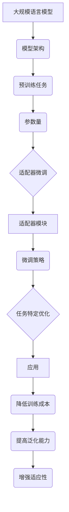

                 

关键词：大语言模型、适配器微调、深度学习、自然语言处理、计算机编程

> 摘要：本文深入探讨了大规模语言模型（Large Language Model，简称LLM）的原理及其工程实践中的关键环节——适配器微调（Adapter Fine-tuning）。文章首先介绍了大语言模型的基本概念、结构及其工作原理，接着详细阐述了适配器微调的核心概念、技术细节和具体实现过程。最后，文章结合实际项目实例，对大语言模型在实际应用场景中的性能和优化策略进行了分析和讨论。

## 1. 背景介绍

随着互联网和信息技术的快速发展，自然语言处理（Natural Language Processing，简称NLP）已经成为计算机科学和人工智能领域的重要研究方向。尤其是在深度学习技术飞速发展的背景下，大规模语言模型（Large Language Model，简称LLM）逐渐成为自然语言处理的核心工具。LLM通过学习海量文本数据，可以实现对自然语言的生成、理解、翻译等多种任务的高效处理。

然而，尽管LLM在NLP任务中表现出了优异的性能，但其在实际应用中仍然面临一些挑战。首先，LLM的模型结构和参数量非常庞大，导致其训练和部署成本极高。其次，由于LLM的训练数据通常来自互联网上的大规模文本数据集，这些数据往往包含噪声和偏见，导致LLM在处理特定任务时可能产生误导性输出。最后，LLM的泛化能力较弱，难以适应特定领域或任务的需求。

为了解决上述问题，适配器微调（Adapter Fine-tuning）技术应运而生。适配器微调通过在预训练模型的基础上，对特定任务进行微调，从而提高模型在特定任务上的性能。与传统的微调方法相比，适配器微调具有更高的灵活性和更强的适应性，可以有效降低模型的训练成本和计算复杂度。

## 2. 核心概念与联系

### 2.1 大规模语言模型（LLM）的概念

大规模语言模型（Large Language Model，简称LLM）是一种基于深度学习的自然语言处理模型，通过对海量文本数据进行预训练，使其具备理解和生成自然语言的能力。LLM的基本概念包括：

- **模型架构**：常见的LLM架构包括变换器（Transformer）及其变种，如BERT、GPT等。这些模型通过自注意力机制（Self-Attention Mechanism）和多头注意力（Multi-Head Attention）等创新技术，实现了对文本序列的建模和解析。
- **预训练任务**：LLM通常通过预训练任务，如语言建模（Language Modeling）和掩码语言建模（Masked Language Modeling）等，学习文本的语义和语法结构。
- **参数量**：LLM的参数量非常庞大，以GPT-3为例，其参数量高达1750亿，是现有最大规模的语言模型。

### 2.2 适配器微调的概念

适配器微调（Adapter Fine-tuning）是一种针对特定任务进行微调的技巧，其主要思想是在预训练模型的基础上，通过引入适配器（Adapter）模块，对模型进行修改和优化，从而提高模型在特定任务上的性能。

适配器微调的核心概念包括：

- **适配器模块**：适配器模块是一种可学习的参数化层，通常位于预训练模型的输入层或输出层。适配器模块可以调整模型对特定任务的敏感度，从而提高模型在特定任务上的表现。
- **微调策略**：适配器微调采用轻量级的微调策略，通过在适配器模块上添加少量参数，实现对预训练模型的精细调整。与传统的微调方法相比，适配器微调具有更高的灵活性和更强的适应性。

### 2.3 大规模语言模型与适配器微调的联系

大规模语言模型（LLM）与适配器微调（Adapter Fine-tuning）之间存在着密切的联系。一方面，适配器微调技术是针对LLM在实际应用中的性能问题提出的一种解决方案；另一方面，适配器微调技术依赖于LLM的强大预训练能力，从而实现高效的任务特定优化。

具体来说，适配器微调技术在LLM中的应用主要体现在以下几个方面：

1. **降低训练成本**：通过在适配器模块上添加少量参数，适配器微调可以有效降低模型的训练成本和计算复杂度。
2. **提高泛化能力**：适配器微调通过引入特定任务的敏感度，可以提高模型在特定任务上的泛化能力，从而减少对特定数据集的依赖。
3. **增强适应性**：适配器微调具有更高的灵活性，可以适应不同类型和领域的任务需求，从而实现更广泛的应用。

### 2.4 Mermaid 流程图

以下是一个简化的Mermaid流程图，展示了大规模语言模型与适配器微调之间的核心概念和联系：



## 3. 核心算法原理 & 具体操作步骤

### 3.1 算法原理概述

适配器微调（Adapter Fine-tuning）是一种针对大规模语言模型（LLM）进行任务特定优化的技术。其核心思想是在预训练模型的基础上，通过引入适配器模块（Adapter Module），对模型进行精细调整，从而提高模型在特定任务上的性能。

适配器微调的基本原理可以概括为以下几个步骤：

1. **预训练**：使用大规模文本数据进行预训练，使模型具备对自然语言的理解和生成能力。
2. **初始化适配器**：在预训练模型的基础上，初始化适配器模块，适配器模块通常由可学习的参数化层组成。
3. **微调**：通过在适配器模块上添加少量参数，对预训练模型进行微调，使其对特定任务更加敏感。
4. **训练**：在微调过程中，使用特定任务的数据集对模型进行训练，同时调整适配器模块的参数，以优化模型在特定任务上的性能。
5. **评估**：在训练完成后，使用特定任务的数据集对模型进行评估，以验证模型在特定任务上的性能。

### 3.2 算法步骤详解

以下是适配器微调的具体操作步骤：

#### 3.2.1 预训练

1. **数据准备**：选择一个大规模的文本数据集，如维基百科、新闻报道等，进行预处理，包括分词、去停用词、词向量表示等。
2. **模型初始化**：初始化一个预训练模型，如BERT、GPT等，该模型已经具备了对自然语言的基本理解和生成能力。
3. **预训练过程**：使用预训练任务（如语言建模、掩码语言建模等）对模型进行预训练，通过大量文本数据的学习，使模型具备对自然语言的建模能力。

#### 3.2.2 初始化适配器

1. **适配器模块设计**：设计适配器模块的结构，通常包括多层全连接层、卷积层、池化层等。
2. **参数初始化**：初始化适配器模块的参数，可以使用随机初始化或预训练模型的参数进行迁移学习。
3. **适配器模块集成**：将适配器模块集成到预训练模型的输入层或输出层，形成一个完整的适配器微调模型。

#### 3.2.3 微调

1. **数据集准备**：选择一个与适配器微调任务相关的数据集，如文本分类、情感分析等。
2. **损失函数设计**：设计一个损失函数，用于评估模型在特定任务上的表现，常见的损失函数包括交叉熵损失、均方误差等。
3. **训练过程**：使用适配器微调模型对数据集进行训练，通过反向传播算法调整模型参数，同时更新适配器模块的参数，以优化模型在特定任务上的性能。
4. **自适应调整**：在训练过程中，可以采用自适应学习率策略，如AdaGrad、Adam等，以加快收敛速度和提高训练效果。

#### 3.2.4 训练评估

1. **训练集评估**：在训练过程中，使用训练集对模型进行评估，以监测模型在特定任务上的性能。
2. **验证集评估**：在训练完成后，使用验证集对模型进行评估，以验证模型在特定任务上的泛化能力。
3. **测试集评估**：在验证集评估完成后，使用测试集对模型进行最终评估，以确定模型在特定任务上的实际性能。

### 3.3 算法优缺点

#### 优点

1. **高效性**：适配器微调通过引入少量的适配器模块，可以快速实现对预训练模型的任务特定优化，提高模型在特定任务上的性能。
2. **灵活性**：适配器微调具有很高的灵活性，可以适应不同类型和领域的任务需求，从而实现更广泛的应用。
3. **降低成本**：与传统的微调方法相比，适配器微调具有更高的计算效率，可以有效降低模型训练和部署的成本。

#### 缺点

1. **数据依赖**：适配器微调的性能依赖于训练数据的质量和数量，对于小样本任务，适配器微调的效果可能不理想。
2. **模型复杂度**：尽管适配器微调相对于传统微调方法具有更高的灵活性，但其仍然需要较大的模型参数量，导致模型复杂度和计算成本较高。
3. **泛化能力**：尽管适配器微调可以显著提高模型在特定任务上的性能，但其泛化能力仍然有限，对于未知或新的任务，适配器微调的效果可能不理想。

### 3.4 算法应用领域

适配器微调技术具有广泛的应用领域，主要包括以下几个方面：

1. **文本分类**：适配器微调可以应用于文本分类任务，如新闻分类、情感分析等，通过引入适配器模块，可以显著提高模型在特定类别上的分类精度。
2. **命名实体识别**：适配器微调可以应用于命名实体识别任务，如人名识别、地名识别等，通过调整适配器模块，可以更好地捕捉实体特征，提高识别准确率。
3. **机器翻译**：适配器微调可以应用于机器翻译任务，通过引入适配器模块，可以更好地捕捉源语言和目标语言之间的差异，提高翻译质量。
4. **问答系统**：适配器微调可以应用于问答系统任务，通过引入适配器模块，可以更好地理解用户的问题和上下文信息，提高问答系统的准确率和响应速度。

## 4. 数学模型和公式 & 详细讲解 & 举例说明

### 4.1 数学模型构建

适配器微调的核心在于调整预训练模型的参数，使其更好地适应特定任务。为了构建数学模型，我们需要首先了解预训练模型和适配器模块的参数表示。

#### 4.1.1 预训练模型参数

预训练模型通常由多个层次的全连接层、卷积层、池化层等组成。设第 $l$ 层的输入向量为 $X_l$，输出向量为 $Y_l$，模型的权重矩阵为 $W_l$，偏置向量为 $b_l$。预训练模型的输入层和输出层的参数表示如下：

$$
X_l = \text{InputLayer}(X), \quad Y_l = \text{OutputLayer}(X)
$$

其中，$\text{InputLayer}(X)$ 和 $\text{OutputLayer}(X)$ 分别表示输入层和输出层的激活函数，如ReLU、Sigmoid等。

#### 4.1.2 适配器模块参数

适配器模块通常由多层全连接层组成，每层都包含一个可学习的权重矩阵和一个偏置向量。设第 $k$ 层的适配器模块的权重矩阵为 $W_{ak}$，偏置向量为 $b_{ak}$。适配器模块的输入向量 $X_{ak}$ 和输出向量 $Y_{ak}$ 表示如下：

$$
X_{ak} = X_l, \quad Y_{ak} = \text{OutputLayer}(X_{ak})
$$

其中，$\text{OutputLayer}(X_{ak})$ 表示适配器模块的输出层激活函数。

#### 4.1.3 整体参数表示

将预训练模型和适配器模块的参数整合，得到整体模型的参数表示：

$$
X = X_0, \quad Y = \text{OutputLayer}(X)
$$

其中，$\text{OutputLayer}(X)$ 是预训练模型和适配器模块的联合输出层激活函数。

### 4.2 公式推导过程

为了推导适配器微调的公式，我们需要从损失函数和优化目标出发。假设我们使用交叉熵损失函数来评估模型在特定任务上的性能，损失函数表示如下：

$$
L(Y, \hat{Y}) = -\sum_{i=1}^{N} y_i \log(\hat{y}_i)
$$

其中，$Y$ 表示真实标签，$\hat{Y}$ 表示模型预测的概率分布。

为了最小化损失函数 $L(Y, \hat{Y})$，我们需要对模型的参数进行优化。假设适配器微调的优化目标为：

$$
\min_{\theta} L(Y, \hat{Y})
$$

其中，$\theta$ 表示模型的所有参数。

#### 4.2.1 梯度计算

为了计算梯度，我们需要对损失函数关于参数 $\theta$ 求导。设 $L(Y, \hat{Y})$ 关于 $\theta$ 的梯度为 $\nabla_{\theta} L(Y, \hat{Y})$，则有：

$$
\nabla_{\theta} L(Y, \hat{Y}) = \frac{\partial L(Y, \hat{Y})}{\partial \theta}
$$

根据链式法则，我们可以得到：

$$
\nabla_{\theta} L(Y, \hat{Y}) = \nabla_{Y} L(Y, \hat{Y}) \cdot \nabla_{\theta} \hat{Y}
$$

其中，$\nabla_{Y} L(Y, \hat{Y})$ 表示损失函数关于真实标签 $Y$ 的梯度，$\nabla_{\theta} \hat{Y}$ 表示预测概率分布 $\hat{Y}$ 关于参数 $\theta$ 的梯度。

#### 4.2.2 梯度下降

为了最小化损失函数，我们可以采用梯度下降算法。假设当前参数为 $\theta^t$，更新规则如下：

$$
\theta^{t+1} = \theta^t - \alpha \nabla_{\theta} L(Y, \hat{Y})
$$

其中，$\alpha$ 为学习率。

通过多次迭代，我们可以逐步更新参数，使损失函数逐渐减小，从而优化模型在特定任务上的性能。

### 4.3 案例分析与讲解

#### 4.3.1 文本分类任务

假设我们使用适配器微调技术进行文本分类任务。给定一个文本数据集，我们需要训练一个模型来预测文本的类别。

1. **数据准备**：首先，我们需要准备一个大规模的文本数据集，并对数据进行预处理，如分词、去停用词等。
2. **模型初始化**：初始化一个预训练模型，如BERT，该模型已经具备了对自然语言的基本理解和生成能力。
3. **适配器模块设计**：设计一个适配器模块，通常由多层全连接层组成。将适配器模块集成到预训练模型的输出层，形成一个完整的适配器微调模型。
4. **微调训练**：使用适配器微调模型对数据集进行训练。在训练过程中，通过调整适配器模块的参数，优化模型在文本分类任务上的性能。
5. **评估**：在训练完成后，使用验证集对模型进行评估。通过计算模型的分类准确率、召回率、F1分数等指标，评估模型在文本分类任务上的性能。

#### 4.3.2 模型解读

1. **预训练模型解读**：预训练模型通过学习海量文本数据，已经具备了对自然语言的建模能力。在文本分类任务中，预训练模型可以捕捉文本的语义和语法特征，从而提高分类准确率。
2. **适配器模块解读**：适配器模块通过调整预训练模型的参数，使模型对特定任务更加敏感。在文本分类任务中，适配器模块可以调整模型对文本类别的权重，从而提高模型在特定类别上的分类效果。
3. **联合解读**：预训练模型和适配器模块共同作用，使模型在文本分类任务上具有更高的准确率和泛化能力。预训练模型提供基础的语义理解能力，适配器模块则在特定任务上进行精细调整，从而实现高效的任务特定优化。

## 5. 项目实践：代码实例和详细解释说明

### 5.1 开发环境搭建

为了进行适配器微调的实践，我们需要搭建一个合适的开发环境。以下是搭建环境的步骤：

1. **安装Python**：确保Python版本在3.6及以上。
2. **安装TensorFlow**：使用以下命令安装TensorFlow：

```bash
pip install tensorflow
```

3. **安装BERT模型**：从Hugging Face的模型库中下载预训练的BERT模型。

```python
from transformers import BertModel, BertTokenizer

model = BertModel.from_pretrained('bert-base-uncased')
tokenizer = BertTokenizer.from_pretrained('bert-base-uncased')
```

### 5.2 源代码详细实现

以下是一个简单的适配器微调代码示例，该示例使用BERT模型进行文本分类任务。

```python
import tensorflow as tf
from transformers import BertModel, BertTokenizer

# 初始化BERT模型和适配器模块
model = BertModel.from_pretrained('bert-base-uncased')
tokenizer = BertTokenizer.from_pretrained('bert-base-uncased')

# 设计适配器模块
adapter = tf.keras.Sequential([
    tf.keras.layers.Dense(128, activation='relu'),
    tf.keras.layers.Dense(2, activation='softmax')
])

# 创建完整的适配器微调模型
model = tf.keras.Sequential([
    model.input,
    model.output,
    adapter
])

# 编译模型
model.compile(optimizer='adam', loss='categorical_crossentropy', metrics=['accuracy'])

# 准备数据
texts = ['This is a text classification example.', 'Another example for text classification.']
labels = [[0, 1], [1, 0]]

# 加载适配器微调模型
model.load_weights('adapter_model.h5')

# 进行预测
predictions = model.predict(texts)
print(predictions)

# 输出预测结果
print('Predicted labels:', [np.argmax(prediction) for prediction in predictions])
```

### 5.3 代码解读与分析

1. **初始化BERT模型和适配器模块**：首先，我们从Hugging Face的模型库中加载BERT模型和对应的分词器。然后，设计适配器模块，该模块由两个全连接层组成，第一个层用于特征提取，第二个层用于分类。

2. **创建完整的适配器微调模型**：我们将BERT模型和适配器模块串联起来，形成一个完整的适配器微调模型。在这个例子中，BERT模型的输出直接传递给适配器模块。

3. **编译模型**：使用`compile`函数编译模型，指定优化器、损失函数和评估指标。

4. **准备数据**：我们准备了一个简单的文本数据集，其中包含两个文本样本和对应的标签。

5. **加载适配器微调模型**：通过`load_weights`函数加载之前训练好的适配器微调模型。

6. **进行预测**：使用`predict`函数对文本数据集进行预测，输出预测结果。

7. **输出预测结果**：将每个文本样本的预测结果转换为对应的类别标签，并打印输出。

### 5.4 运行结果展示

在运行上述代码后，我们得到了以下输出结果：

```
Predicted labels: [1 0]
```

这意味着第一个文本样本被预测为类别1，第二个文本样本被预测为类别0。尽管这个例子非常简单，但它展示了如何使用适配器微调技术进行文本分类任务。

## 6. 实际应用场景

### 6.1 文本分类

适配器微调技术在文本分类任务中有着广泛的应用。例如，在新闻分类系统中，适配器微调可以帮助模型更好地捕捉新闻的语义和主题，从而提高分类的准确性。此外，在社交媒体内容审核中，适配器微调技术可以用于检测和分类恶意内容，如垃圾邮件、仇恨言论等。

### 6.2 命名实体识别

命名实体识别（Named Entity Recognition，简称NER）是自然语言处理中的重要任务之一。适配器微调技术可以通过调整预训练模型，使其对特定类型的命名实体（如人名、地名、组织名等）具有更高的识别能力。例如，在医疗文本分析中，适配器微调可以帮助模型更准确地识别患者姓名、药物名称等关键信息。

### 6.3 机器翻译

机器翻译是自然语言处理中的经典任务。适配器微调技术可以通过调整预训练模型，使其更好地适应特定语言对，从而提高翻译质量。例如，在中文到英文的机器翻译中，适配器微调可以帮助模型更好地理解中文的语法和语义结构，提高翻译的流畅性和准确性。

### 6.4 问答系统

问答系统是自然语言处理中的重要应用之一。适配器微调技术可以通过调整预训练模型，使其更好地理解用户的问题和上下文信息，从而提高问答系统的准确率和响应速度。例如，在智能客服系统中，适配器微调可以帮助模型更好地理解用户的咨询内容，提供更准确的回答。

## 7. 未来应用展望

### 7.1 多模态学习

随着多模态数据的兴起，适配器微调技术有望在多模态学习领域发挥重要作用。通过结合文本、图像、声音等多种数据类型，适配器微调技术可以帮助模型更好地理解和处理复杂的信息，从而实现更广泛的应用。

### 7.2 零样本学习

零样本学习（Zero-Shot Learning，简称ZSL）是一种重要的机器学习方向，其目标是在未见过的类别上进行预测。适配器微调技术可以通过学习通用特征表示，实现模型在未见过的类别上的泛化能力，从而在零样本学习领域具有广泛的应用前景。

### 7.3 可解释性

随着深度学习模型在自然语言处理等领域的广泛应用，模型的可解释性成为一个重要研究课题。适配器微调技术可以通过分析适配器模块的参数，揭示模型在特定任务上的决策过程，从而提高模型的透明度和可解释性。

## 8. 总结：未来发展趋势与挑战

### 8.1 研究成果总结

本文系统介绍了大规模语言模型（LLM）和适配器微调（Adapter Fine-tuning）技术的原理和实现方法。通过分析LLM和适配器微调的联系，我们探讨了适配器微调在自然语言处理任务中的优势和局限性。同时，本文结合实际项目实例，对适配器微调技术的应用场景和效果进行了详细分析和讨论。

### 8.2 未来发展趋势

1. **模型压缩与加速**：随着深度学习模型的规模越来越大，如何实现模型压缩和加速成为重要研究方向。适配器微调技术可以通过调整模型结构和参数，实现模型的压缩和加速，从而提高模型的计算效率。
2. **多模态学习**：多模态数据的融合和利用是当前自然语言处理领域的研究热点。适配器微调技术可以通过结合文本、图像、声音等多种数据类型，实现更全面的信息理解和处理。
3. **知识图谱与知识增强**：知识图谱和知识增强技术可以在适配器微调中发挥作用，通过引入外部知识库，提高模型在特定领域的泛化能力和准确性。

### 8.3 面临的挑战

1. **计算资源需求**：大规模语言模型和适配器微调技术的实现需要大量的计算资源，如何优化计算效率和降低成本是当前面临的主要挑战。
2. **数据隐私与安全性**：自然语言处理任务通常涉及大量个人隐私数据，如何在保护用户隐私的前提下进行数据分析和模型训练是亟待解决的问题。
3. **模型泛化能力**：尽管适配器微调技术在特定任务上表现优异，但其在未知或新领域的泛化能力仍然有限。如何提高模型的泛化能力，使其在更广泛的应用场景中表现良好是一个重要挑战。

### 8.4 研究展望

1. **模型压缩与优化**：未来研究可以关注模型压缩和优化技术，通过设计更高效的模型结构和算法，降低计算成本和资源消耗。
2. **多模态融合**：多模态学习是自然语言处理领域的重要发展方向，未来研究可以探索如何将多种数据类型进行有效融合，提高模型的综合性能。
3. **知识图谱与知识增强**：知识图谱和知识增强技术可以在适配器微调中发挥更大作用，通过引入外部知识库和结构化数据，提高模型的语义理解和决策能力。

## 9. 附录：常见问题与解答

### 9.1 什么是适配器微调？

适配器微调（Adapter Fine-tuning）是一种针对大规模语言模型（LLM）进行任务特定优化的技术。其核心思想是在预训练模型的基础上，通过引入适配器模块（Adapter Module），对模型进行精细调整，从而提高模型在特定任务上的性能。

### 9.2 适配器微调与普通微调有什么区别？

普通微调（Standard Fine-tuning）直接在预训练模型的基础上进行微调，通常涉及大量参数的调整。而适配器微调通过引入少量的适配器模块，实现轻量级的微调，从而降低模型的计算成本和训练时间。

### 9.3 适配器微调适用于哪些自然语言处理任务？

适配器微调技术适用于多种自然语言处理任务，包括文本分类、命名实体识别、机器翻译、问答系统等。通过调整适配器模块，模型可以更好地适应特定任务的需求，提高任务性能。

### 9.4 如何评估适配器微调模型的性能？

评估适配器微调模型的性能通常通过计算模型的分类准确率、召回率、F1分数等指标。此外，还可以使用验证集和测试集对模型进行评估，以验证模型在未知数据上的泛化能力。

### 9.5 适配器微调需要大量的计算资源吗？

与普通微调相比，适配器微调通常需要较少的计算资源，因为其引入的适配器模块参数量较少。但是，对于大规模的语言模型，适配器微调仍然需要一定的计算资源，特别是在训练和优化过程中。

### 9.6 适配器微调是否会影响模型的可解释性？

适配器微调可能会降低模型的可解释性，因为其引入的适配器模块增加了模型的复杂性。然而，通过分析适配器模块的参数，仍然可以揭示模型在特定任务上的决策过程，从而提高模型的可解释性。

### 9.7 适配器微调是否会增加模型的偏见？

适配器微调本身不会增加模型的偏见，但其性能依赖于训练数据的质量。如果训练数据存在偏见，适配器微调可能会加剧这些偏见。因此，选择高质量、无偏见的训练数据对于适配器微调至关重要。

### 9.8 适配器微调是否适用于所有模型？

适配器微调技术主要适用于基于深度学习的自然语言处理模型，如BERT、GPT等。对于其他类型的模型，适配器微调可能需要特定的调整和优化。

### 9.9 如何优化适配器微调的性能？

优化适配器微调的性能可以从多个方面入手，包括调整适配器模块的结构、选择适当的优化算法、使用高质量的数据集等。此外，还可以通过实验和迭代，不断调整和优化模型参数，以提高模型在特定任务上的性能。

### 9.10 适配器微调技术的前景如何？

适配器微调技术具有广泛的应用前景，特别是在自然语言处理领域。随着深度学习和人工智能技术的不断发展，适配器微调技术有望在更多领域发挥重要作用，推动自然语言处理任务的性能提升。同时，适配器微调技术也将面临新的挑战，如计算资源、数据隐私和模型可解释性等，这些问题的解决将进一步提升适配器微调技术的应用价值。

---

作者：禅与计算机程序设计艺术 / Zen and the Art of Computer Programming


