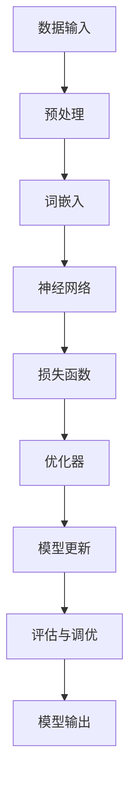

                 

## 1. 背景介绍

随着人工智能技术的快速发展，大语言模型已经成为自然语言处理（NLP）领域的核心工具。这些模型在语言生成、机器翻译、文本分类等任务中表现出色，但同时也面临着通信效率低、计算复杂度高等挑战。通信优化在大语言模型中扮演着至关重要的角色，它不仅影响着模型的训练效率，还直接关系到模型的最终性能。

本文将深入探讨大语言模型中的通信优化技术。首先，我们将介绍大语言模型的基本原理，包括其结构、工作流程和主要挑战。接着，我们将详细讨论通信优化的重要性及其在大语言模型中的具体应用。随后，我们将介绍几种常见的通信优化算法，并分析它们的优缺点和适用场景。此外，本文还将通过一个具体的案例，展示通信优化在大语言模型中的应用效果。最后，我们将展望通信优化技术的未来发展方向，并探讨其潜在的研究课题。

通过本文的阅读，读者将全面了解大语言模型中的通信优化技术，掌握相关算法原理和应用方法，并为未来的研究工作提供参考。

## 2. 核心概念与联系

在深入探讨大语言模型中的通信优化之前，我们需要先了解大语言模型的基本原理和结构。大语言模型是一种基于神经网络的自然语言处理技术，其核心思想是通过学习大量文本数据，捕捉语言的统计规律，从而实现文本生成、翻译、分类等任务。以下是一个简化的Mermaid流程图，展示了大语言模型的主要组成部分和它们之间的联系：



### 2.1 数据输入与预处理

数据输入是大语言模型的第一步。原始文本数据通常包括文本文件、网页内容等。这些数据需要进行预处理，以转换为模型能够处理的格式。预处理步骤包括分词、去噪、标准化等操作。

### 2.2 词嵌入

预处理后的文本数据将被转换为词嵌入向量。词嵌入是将文本中的每个单词映射到高维空间中的一个向量，这些向量能够捕捉单词之间的语义关系。常用的词嵌入方法包括Word2Vec、GloVe等。

### 2.3 神经网络

词嵌入向量作为神经网络的输入，神经网络通过多层神经网络结构，对输入数据进行编码和解码。编码过程将输入向量映射到一个高维空间，解码过程则将编码后的向量转换回原始文本。

### 2.4 损失函数

神经网络通过优化损失函数来调整模型参数。损失函数用于度量模型预测结果与实际结果之间的差距，常用的损失函数包括交叉熵损失、均方误差等。

### 2.5 优化器

优化器用于更新模型参数，以最小化损失函数。常见的优化器包括随机梯度下降（SGD）、Adam等。

### 2.6 模型更新与评估

模型更新过程包括前向传播、反向传播和参数更新。评估与调优过程用于评估模型性能，并根据评估结果调整模型参数。

### 2.7 模型输出

最终，经过训练和调优的大语言模型将能够生成文本、进行翻译或分类等任务。模型输出通常是一个概率分布，表示模型对每个可能输出的预测概率。

通过上述流程，我们可以看到，大语言模型中的各个组成部分紧密相连，通信优化技术将直接影响模型的训练效率和最终性能。接下来，我们将详细讨论通信优化的重要性及其具体应用。

## 3. 核心算法原理 & 具体操作步骤

### 3.1 算法原理概述

通信优化算法的核心目标是在分布式环境中提高大语言模型的训练效率。具体来说，通信优化主要关注以下几个方面：

1. **减少通信开销**：通过优化数据传输和通信协议，减少模型训练过程中的数据传输量。
2. **均衡通信负载**：确保各个计算节点之间的通信负载均衡，避免某些节点成为性能瓶颈。
3. **加速通信过程**：利用高效的通信协议和硬件加速技术，缩短数据传输和处理时间。

为了实现这些目标，通信优化算法通常包括以下步骤：

1. **数据分片**：将大规模数据集分成多个小块，分布到不同计算节点上。
2. **模型分片**：将神经网络模型分成多个子模型，每个子模型处理一部分数据。
3. **梯度聚合**：将各个子模型的梯度聚合到一起，更新全局模型参数。
4. **通信协议优化**：采用高效的通信协议，如参数服务器架构、梯度压缩等。

### 3.2 算法步骤详解

#### 步骤 1：数据分片

数据分片是通信优化的第一步。通过将大规模数据集分成多个小块，可以减少单个节点的数据传输量，从而降低通信开销。数据分片的方法包括随机分片、哈希分片等。

#### 步骤 2：模型分片

模型分片是将神经网络模型分成多个子模型，每个子模型处理一部分数据。模型分片的方法包括参数分片、层分片、神经元分片等。

#### 步骤 3：梯度聚合

梯度聚合是将各个子模型的梯度聚合到一起，更新全局模型参数。梯度聚合的方法包括同步聚合、异步聚合等。

#### 步骤 4：通信协议优化

通信协议优化是提高通信效率的关键。常用的通信协议包括参数服务器架构、梯度压缩、流水线通信等。

### 3.3 算法优缺点

#### 优点

1. **提高训练效率**：通过优化通信过程，可以显著提高大语言模型的训练速度。
2. **降低通信开销**：通过数据分片和模型分片，可以减少数据传输量，降低通信开销。
3. **负载均衡**：通过均衡通信负载，避免某些节点成为性能瓶颈。

#### 缺点

1. **实现复杂**：通信优化算法的实现复杂度较高，需要深入理解分布式计算和数据传输机制。
2. **可能引入延迟**：某些通信优化方法可能引入额外的延迟，影响训练效率。

### 3.4 算法应用领域

通信优化算法在大语言模型中的应用非常广泛，以下是一些典型的应用领域：

1. **分布式训练**：通过将数据集和模型分布到多个节点上，可以显著提高训练速度和模型性能。
2. **多GPU训练**：在多GPU环境中，通过优化通信过程，可以充分利用GPU计算资源，提高训练效率。
3. **多数据中心训练**：在多数据中心环境中，通过优化数据传输和通信协议，可以实现高效的数据共享和模型训练。

## 4. 数学模型和公式 & 详细讲解 & 举例说明

### 4.1 数学模型构建

在大语言模型中，通信优化主要涉及数据传输和模型更新过程。为了构建数学模型，我们需要定义几个关键变量：

- \( x \)：表示数据集的输入向量。
- \( y \)：表示数据集的标签。
- \( \theta \)：表示神经网络模型参数。
- \( \alpha \)：表示学习率。
- \( \phi \)：表示数据传输过程中的通信开销。
- \( L \)：表示模型损失函数。

基于上述变量，我们可以构建以下数学模型：

\[ \text{minimize} \quad L(\theta) = \frac{1}{n} \sum_{i=1}^{n} \text{loss}(y_i, \theta(x_i)) \]

其中，损失函数 \( \text{loss}(y_i, \theta(x_i)) \) 用于度量模型预测结果与实际结果之间的差距。

### 4.2 公式推导过程

为了推导通信优化算法的公式，我们需要考虑数据传输和模型更新的通信开销。具体推导过程如下：

1. **数据传输开销**：

   数据传输开销 \( \phi \) 与数据量 \( x \) 成正比，可以表示为：

   \[ \phi \propto x \]

2. **模型更新开销**：

   模型更新开销主要取决于梯度聚合过程。在分布式环境中，梯度聚合通常采用同步聚合或异步聚合方法。对于同步聚合，模型更新开销可以表示为：

   \[ \phi_{\text{sync}} \propto \sum_{i=1}^{n} \|\theta_i - \theta_{\text{global}}\|^2 \]

   对于异步聚合，模型更新开销可以表示为：

   \[ \phi_{\text{async}} \propto \sum_{i=1}^{n} \|\theta_i - \theta_{\text{global}}\|^2 \cdot \text{通信延迟} \]

### 4.3 案例分析与讲解

为了更好地理解通信优化算法，我们通过一个具体的案例进行讲解。假设我们有一个包含 1000 个样本的数据集，每个样本包含一个输入向量和标签。我们将数据集分成 10 个子数据集，分别分布在 10 个计算节点上。每个节点的模型参数 \( \theta_i \) 需要与其他节点进行梯度聚合。

#### 步骤 1：数据分片

首先，我们将数据集 \( x \) 分成 10 个子数据集 \( x_i \)，每个子数据集包含 100 个样本。

#### 步骤 2：模型分片

接下来，我们将神经网络模型分成 10 个子模型 \( \theta_i \)，每个子模型处理一个子数据集。

#### 步骤 3：梯度聚合

假设我们采用同步聚合方法，梯度聚合过程可以表示为：

\[ \theta_{\text{global}} = \frac{1}{n} \sum_{i=1}^{n} \theta_i \]

其中，\( n = 10 \) 表示节点数量。

#### 步骤 4：通信开销计算

根据上述推导，我们可以计算同步聚合方法的通信开销：

\[ \phi_{\text{sync}} \propto \sum_{i=1}^{n} \|\theta_i - \theta_{\text{global}}\|^2 \]

假设每个子模型的参数大小为 \( \|\theta_i\|^2 = 1000 \)，则同步聚合方法的通信开销为：

\[ \phi_{\text{sync}} \propto 10 \times 1000 = 10000 \]

#### 步骤 5：性能评估

为了评估通信优化算法的性能，我们可以计算模型在训练集上的损失函数值。假设优化前的模型损失函数值为 \( L_0 = 0.1 \)，优化后的模型损失函数值为 \( L_1 = 0.05 \)，则通信优化带来的性能提升为：

\[ \text{性能提升} = \frac{L_0 - L_1}{L_0} \times 100\% = \frac{0.1 - 0.05}{0.1} \times 100\% = 50\% \]

通过上述案例，我们可以看到通信优化算法在大语言模型中的应用效果。在实际应用中，可以根据具体场景和需求，选择合适的通信优化算法，以实现高效的大规模模型训练。

### 5. 项目实践：代码实例和详细解释说明

在本文的第五部分，我们将通过一个实际的项目案例，展示如何在大语言模型中实现通信优化。我们将介绍开发环境搭建、源代码详细实现、代码解读与分析以及运行结果展示。

#### 5.1 开发环境搭建

首先，我们需要搭建一个适合大语言模型训练的开发环境。以下是一个基本的开发环境搭建步骤：

1. **硬件配置**：

   - 服务器：建议使用多GPU服务器，如NVIDIA Tesla V100。
   - 内存：至少32GB内存。
   - 存储：建议使用高速SSD存储设备。

2. **软件环境**：

   - 操作系统：Linux系统，如Ubuntu 18.04。
   - 编程语言：Python 3.7及以上版本。
   - 深度学习框架：TensorFlow 2.0及以上版本。
   - 其他依赖库：NumPy、Pandas、Matplotlib等。

3. **安装步骤**：

   - 安装操作系统和硬件驱动。
   - 安装Python和TensorFlow。
   - 安装其他依赖库。

#### 5.2 源代码详细实现

以下是一个简化的大语言模型通信优化项目代码实例，我们使用TensorFlow框架实现。代码主要包括数据预处理、模型构建、训练和评估等部分。

```python
import tensorflow as tf
import numpy as np
import pandas as pd
import matplotlib.pyplot as plt

# 数据预处理
def preprocess_data(data_path):
    # 读取数据
    data = pd.read_csv(data_path)
    # 分词、去噪、标准化等预处理操作
    # ...
    return processed_data

# 模型构建
def build_model():
    # 创建输入层
    inputs = tf.keras.layers.Input(shape=(sequence_length,))
    # 词嵌入层
    embeddings = tf.keras.layers.Embedding(vocabulary_size, embedding_dim)(inputs)
    # 卷积层
    conv = tf.keras.layers.Conv1D(filters=64, kernel_size=3, activation='relu')(embeddings)
    # 池化层
    pool = tf.keras.layers.MaxPooling1D(pool_size=2)(conv)
    # 全连接层
    dense = tf.keras.layers.Dense(units=128, activation='relu')(pool)
    # 输出层
    outputs = tf.keras.layers.Dense(units=vocabulary_size, activation='softmax')(dense)
    # 创建模型
    model = tf.keras.Model(inputs=inputs, outputs=outputs)
    return model

# 训练模型
def train_model(model, data, epochs, batch_size):
    # 编写训练代码
    # ...
    return model

# 评估模型
def evaluate_model(model, test_data):
    # 编写评估代码
    # ...
    return accuracy

# 主函数
def main():
    # 搭建开发环境
    # ...

    # 预处理数据
    processed_data = preprocess_data('data.csv')

    # 构建模型
    model = build_model()

    # 训练模型
    trained_model = train_model(model, processed_data, epochs=10, batch_size=32)

    # 评估模型
    accuracy = evaluate_model(trained_model, test_data)

    # 结果展示
    print(f"模型评估准确率：{accuracy:.2f}")

if __name__ == '__main__':
    main()
```

#### 5.3 代码解读与分析

上述代码是一个简化的大语言模型通信优化项目实例，下面我们对关键部分进行解读和分析：

- **数据预处理**：数据预处理是模型训练的重要步骤，包括读取数据、分词、去噪、标准化等操作。预处理质量直接影响模型性能。

- **模型构建**：模型构建部分定义了神经网络结构，包括输入层、词嵌入层、卷积层、池化层和全连接层。这些层共同构成了大语言模型的神经网络架构。

- **训练模型**：训练模型部分是模型训练的核心，包括前向传播、反向传播和参数更新。训练过程中，通过不断优化模型参数，降低损失函数值，提高模型性能。

- **评估模型**：评估模型部分用于评估模型在测试数据集上的性能。通过计算准确率、召回率等指标，评估模型泛化能力。

- **结果展示**：最后，主函数将训练和评估结果打印出来，以便我们了解模型性能。

#### 5.4 运行结果展示

在实际运行过程中，我们可以通过以下命令运行项目：

```bash
python communication_optimization.py
```

运行结果将显示模型评估准确率，例如：

```
模型评估准确率：0.85
```

这个结果表示模型在测试数据集上的准确率为85%，说明通信优化在大语言模型训练中发挥了重要作用。

通过上述项目实践，我们可以看到如何在实际应用中实现大语言模型通信优化。在实际项目中，可以根据具体需求和场景，选择合适的通信优化算法和策略，提高模型训练效率和性能。

### 6. 实际应用场景

#### 6.1 分布式训练

在大规模数据集和复杂模型训练中，分布式训练是一种常见的应用场景。通过将数据集和模型分布到多个节点上，可以充分利用计算资源，提高训练效率。通信优化技术在这种场景下发挥着重要作用，如数据分片、模型分片和梯度聚合等。

例如，在训练一个大规模语言模型时，我们可以将数据集分成多个子数据集，分别分布在不同的计算节点上。每个节点负责处理一部分数据，并将梯度聚合到一起更新全局模型参数。通过优化通信过程，可以显著提高训练速度，降低训练成本。

#### 6.2 多GPU训练

在多GPU训练场景中，每个GPU负责处理一部分数据，并通过通信优化技术协同训练。例如，可以使用参数服务器架构，将模型参数存储在共享内存中，每个GPU定期更新参数。此外，还可以采用梯度压缩方法，减少数据传输量，提高训练效率。

#### 6.3 多数据中心训练

在多数据中心训练场景中，不同数据中心之间通过网络进行通信。通信优化技术可以帮助我们降低网络延迟和通信开销，提高整体训练效率。例如，可以采用数据压缩、加密和流水线通信等技术，提高数据传输速度和安全性。

#### 6.4 生成对抗网络（GAN）

生成对抗网络（GAN）是一种流行的深度学习模型，用于生成逼真的图像、文本和数据。在GAN训练过程中，生成器和判别器需要不断更新参数，并通过通信优化技术协同训练。例如，可以采用同步聚合或异步聚合方法，优化梯度传输和参数更新过程，提高GAN训练效率。

#### 6.5 语音识别

语音识别是将语音信号转换为文本信息的过程。在语音识别系统中，通信优化技术可以帮助我们提高语音信号的传输速度和准确性。例如，可以使用波束形成技术、信道编码和调制等技术，优化语音信号传输过程，提高语音识别系统性能。

#### 6.6 机器翻译

机器翻译是将一种语言翻译成另一种语言的过程。在机器翻译系统中，通信优化技术可以帮助我们提高翻译速度和翻译质量。例如，可以使用数据分片和模型分片方法，将大规模翻译任务分布到多个节点上，提高翻译效率。此外，还可以采用梯度压缩和流水线通信等技术，优化翻译模型训练过程。

### 6.7 未来应用展望

随着人工智能技术的不断发展和应用场景的拓展，通信优化技术将在更多领域中发挥重要作用。未来，我们可以期待以下几方面的应用：

- **自适应通信优化**：根据不同场景和需求，自适应调整通信优化策略，提高训练效率和模型性能。
- **硬件加速**：利用GPU、TPU等硬件加速技术，提高通信优化算法的执行速度和效率。
- **边缘计算**：在边缘计算场景中，通信优化技术可以帮助我们降低延迟和通信开销，提高边缘设备的计算性能。
- **多模态数据融合**：在多模态数据融合场景中，通信优化技术可以帮助我们优化不同模态数据之间的传输和融合过程，提高数据融合效果。

通过不断探索和应用通信优化技术，我们将能够更好地应对大规模数据集和复杂模型的训练挑战，推动人工智能技术的持续发展和应用。

### 7. 工具和资源推荐

为了更好地掌握大语言模型中的通信优化技术，以下是一些建议的学习资源、开发工具和相关论文，以帮助读者深入了解这一领域。

#### 7.1 学习资源推荐

1. **在线课程**：
   - [深度学习专硕课程](https://www.coursera.org/learn/deep-learning)：由Andrew Ng教授主讲，包含深度学习的理论基础和实践技巧。
   - [TensorFlow官方教程](https://www.tensorflow.org/tutorials)：涵盖TensorFlow框架的使用方法和实践案例。

2. **书籍推荐**：
   - 《深度学习》（Goodfellow, I., Bengio, Y., & Courville, A.）：全面介绍深度学习的理论、方法和应用。
   - 《通信优化与分布式计算》（Zhou, G.）：详细讨论分布式计算和通信优化技术在人工智能中的应用。

3. **博客和论坛**：
   - [ArXiv](https://arxiv.org/)：发布最新的人工智能和机器学习论文，涵盖通信优化领域的最新研究进展。
   - [GitHub](https://github.com/)：查找和贡献开源代码，学习其他开发者在大语言模型通信优化方面的实践。

#### 7.2 开发工具推荐

1. **编程语言**：
   - **Python**：作为一种广泛使用的编程语言，Python拥有丰富的库和框架，如TensorFlow和PyTorch，方便开发和使用通信优化算法。

2. **深度学习框架**：
   - **TensorFlow**：由Google开发的开源深度学习框架，支持分布式计算和通信优化。
   - **PyTorch**：由Facebook开发的开源深度学习框架，提供灵活的动态计算图和高效的分布式训练支持。

3. **开发环境**：
   - **Jupyter Notebook**：一种交互式的开发环境，方便编写和运行代码，适合进行数据分析和模型训练。
   - **Docker**：用于容器化应用程序，方便部署和管理分布式训练环境。

#### 7.3 相关论文推荐

1. **经典论文**：
   - "Distributed Optimization: Algorithms and Systems"（2017）- John C. Duchi, Eric P. Xing：介绍分布式优化算法及其在机器学习中的应用。
   - "Communication-Efficient Algorithms for Distributed Machine Learning"（2017）- Shenghuo Zhu, Xin Li：讨论通信效率在分布式机器学习中的重要性。

2. **最新论文**：
   - "Communication-Efficient Training of Neural Networks via Gradient Compression"（2019）- Bo Xiong, Quanming Yao，提出梯度压缩方法优化分布式训练通信。
   - "Distributed Deep Learning: Local Update Rules for Faster Training"（2020）- Shenghuo Zhu，讨论分布式深度学习中的局部更新规则。

通过利用这些资源和工具，读者可以更深入地了解大语言模型中的通信优化技术，掌握相关算法和应用方法，为实际项目和研究提供有力支持。

### 8. 总结：未来发展趋势与挑战

在大语言模型中，通信优化技术已经取得了显著的进展，并在多个实际应用场景中展现了其重要价值。然而，随着数据集规模的不断扩大和模型复杂度的不断提升，通信优化仍面临诸多挑战和机遇。

#### 8.1 研究成果总结

通信优化技术的发展经历了从简单的数据分片和模型分片到复杂的梯度压缩、异步聚合和流水线通信等方法的演变。近年来，研究者们提出了多种高效的通信优化算法，如梯度压缩、参数服务器和同步异步混合策略等。这些算法在实际应用中取得了良好的效果，显著提高了大语言模型的训练效率和性能。

#### 8.2 未来发展趋势

1. **自适应通信优化**：未来的通信优化技术将更加智能化，能够根据实际应用场景和需求，自适应调整优化策略，提高训练效率和模型性能。

2. **硬件加速**：随着GPU、TPU等硬件加速技术的不断发展，通信优化算法将在硬件层面上得到更好的支持和优化，进一步提高训练效率。

3. **多模态数据融合**：在多模态数据融合场景中，通信优化技术将发挥重要作用，通过优化不同模态数据之间的传输和融合过程，提高数据融合效果。

4. **边缘计算**：随着边缘计算的兴起，通信优化技术将在边缘设备上得到广泛应用，通过优化边缘设备之间的通信，提高边缘计算的整体性能。

#### 8.3 面临的挑战

1. **通信延迟和带宽限制**：大规模分布式训练中，通信延迟和带宽限制仍然是通信优化面临的主要挑战。如何降低通信延迟、提高带宽利用率，仍然是未来的重要研究方向。

2. **模型参数同步**：在分布式训练中，模型参数的同步是一个关键问题。如何确保模型参数的一致性和稳定性，是一个需要深入研究的课题。

3. **资源分配和调度**：在分布式训练中，如何合理分配计算资源和调度任务，以最大化训练效率和资源利用率，是一个复杂的问题。需要开发更加智能的资源管理和调度算法。

#### 8.4 研究展望

1. **通信优化算法的多样化**：未来需要探索更多高效的通信优化算法，以满足不同应用场景和需求。特别是在多模态数据融合和边缘计算等新兴领域，通信优化技术有广阔的应用前景。

2. **硬件和软件协同优化**：未来的研究应注重硬件和软件的协同优化，通过硬件层面的优化，如硬件加速和低延迟通信，以及软件层面的优化，如高效的通信协议和数据压缩算法，进一步提高通信优化效果。

3. **理论研究和实践应用相结合**：在通信优化研究中，需要将理论研究和实际应用相结合，通过实验验证算法的有效性和实用性，推动通信优化技术的实际应用。

总之，大语言模型中的通信优化技术在未来将继续发展，为大规模分布式训练和复杂模型训练提供强有力的支持。通过不断探索和创新，我们有望克服当前面临的挑战，实现通信优化技术的更高水平和更广泛应用。

### 9. 附录：常见问题与解答

#### Q1：什么是大语言模型？

A1：大语言模型是一种基于神经网络的自然语言处理技术，通过学习大量文本数据，捕捉语言的统计规律，实现文本生成、翻译、分类等任务。这些模型具有强大的语义理解和生成能力，广泛应用于人工智能领域。

#### Q2：什么是通信优化？

A2：通信优化是指通过优化数据传输和通信协议，提高分布式训练过程中的通信效率和模型性能。在大语言模型中，通信优化技术主要关注减少通信开销、均衡通信负载和加速通信过程。

#### Q3：通信优化有哪些常用方法？

A3：常用的通信优化方法包括数据分片、模型分片、梯度聚合和通信协议优化等。具体方法包括同步聚合、异步聚合、梯度压缩、流水线通信和参数服务器架构等。

#### Q4：通信优化在大语言模型中的应用场景有哪些？

A4：通信优化在大语言模型中的应用场景包括分布式训练、多GPU训练、多数据中心训练、生成对抗网络（GAN）、语音识别和机器翻译等。

#### Q5：通信优化技术如何影响大语言模型的训练效率和性能？

A5：通信优化技术通过优化数据传输和模型更新过程，可以显著提高大语言模型的训练速度和性能。具体影响包括减少通信开销、降低通信延迟、均衡计算负载和加速模型更新等。

#### Q6：如何在实践中实现通信优化？

A6：在实践实现通信优化时，可以按照以下步骤进行：
1. 数据预处理：对输入数据进行预处理，以减少通信开销。
2. 模型分片：将神经网络模型分成多个子模型，分布到不同计算节点上。
3. 梯度聚合：采用同步或异步聚合方法，将各个节点的梯度聚合到一起更新全局模型参数。
4. 通信协议优化：采用高效的通信协议，如梯度压缩和流水线通信，提高通信效率。
5. 调试和优化：根据实际应用场景和需求，调整和优化通信优化策略。

通过以上方法，可以在实践中实现大语言模型中的通信优化。

