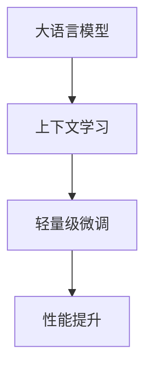

                 

关键词：大语言模型、上下文学习、轻量级微调、深度学习、自然语言处理、模型优化

摘要：本文深入探讨了大语言模型的原理及其在自然语言处理中的应用，重点分析了上下文学习和轻量级微调技术。通过对核心算法原理的详细解析、数学模型的推导以及实际应用场景的探讨，本文为研究人员和开发者提供了宝贵的参考，并展望了未来的发展趋势与挑战。

## 1. 背景介绍

### 1.1 大语言模型的兴起

随着深度学习技术的快速发展，自然语言处理（NLP）领域迎来了新的机遇。大语言模型作为一种强大的NLP工具，凭借其卓越的性能，在众多任务中取得了显著成果。这些模型通过学习大量的文本数据，能够理解并生成复杂的语言结构，从而在机器翻译、文本生成、问答系统等任务中表现出色。

### 1.2 上下文学习的必要性

传统的NLP模型往往忽略了上下文信息的重要性。在处理句子级别的任务时，模型只能看到局部信息，难以捕捉到句子之间的关联。为了解决这一问题，上下文学习成为研究的热点。通过上下文学习，模型能够更好地理解句子的整体意义，从而提高任务的准确性和鲁棒性。

### 1.3 轻量级微调的优势

在现实应用中，大语言模型通常需要针对特定任务进行微调。然而，传统微调方法往往需要大量的计算资源和时间。为了克服这一问题，轻量级微调技术应运而生。轻量级微调通过简化模型结构或优化训练策略，能够在更短的时间内实现高效的微调，降低计算成本。

## 2. 核心概念与联系

### 2.1 大语言模型

大语言模型通常是指基于神经网络的语言模型，如变换器（Transformer）模型。它通过学习大量的文本数据，可以预测单词、句子或段落中的下一个元素，从而生成自然流畅的语言。

### 2.2 上下文学习

上下文学习是指模型通过学习上下文信息来提高理解能力。在NLP任务中，上下文学习可以帮助模型捕捉句子之间的关联，提高任务的准确性和鲁棒性。

### 2.3 轻量级微调

轻量级微调是指通过简化模型结构或优化训练策略，实现快速、高效的模型微调。轻量级微调技术在节省计算资源的同时，仍能保持较高的性能。

### 2.4 Mermaid 流程图

以下是一个描述大语言模型、上下文学习和轻量级微调关系的 Mermaid 流程图：



## 3. 核心算法原理 & 具体操作步骤

### 3.1 算法原理概述

大语言模型的核心算法是基于注意力机制的变换器（Transformer）模型。变换器模型通过自注意力机制和前馈神经网络，能够捕捉输入序列中的长距离依赖关系。

上下文学习主要通过预训练和微调实现。预训练是指模型在大量无标注的文本数据上训练，学习语言的基本规律。微调是指模型在特定任务上有标注的数据上进行训练，进一步优化模型性能。

轻量级微调主要利用模型剪枝、低秩分解等技术，简化模型结构，降低计算复杂度。

### 3.2 算法步骤详解

1. **预训练：**
   - 数据准备：收集大量无标注的文本数据。
   - 模型初始化：初始化变换器模型。
   - 训练：在文本数据上训练模型，优化模型参数。

2. **上下文学习：**
   - 数据准备：收集有标注的文本数据。
   - 微调：在任务相关的数据上微调模型，学习上下文信息。

3. **轻量级微调：**
   - 模型简化：通过剪枝、低秩分解等方法简化模型结构。
   - 微调：在简化后的模型上继续微调，优化模型性能。

### 3.3 算法优缺点

**优点：**
- **强大的语言理解能力：** 大语言模型通过预训练和上下文学习，能够理解并生成复杂的语言结构。
- **高效的微调：** 轻量级微调技术能够快速、高效地优化模型性能。

**缺点：**
- **计算资源消耗：** 大语言模型训练和微调过程需要大量的计算资源。
- **数据依赖性：** 模型的性能依赖于训练数据的数量和质量。

### 3.4 算法应用领域

大语言模型在多个领域表现出色，包括：
- **机器翻译：** 通过上下文学习，模型能够生成更准确的翻译结果。
- **文本生成：** 轻量级微调技术使得模型能够快速生成高质量的文本。
- **问答系统：** 模型能够理解用户的问题，并生成相关回答。

## 4. 数学模型和公式 & 详细讲解 & 举例说明

### 4.1 数学模型构建

大语言模型的数学模型主要包括两部分：编码器和解码器。

- **编码器：** 将输入序列编码为固定长度的向量。
- **解码器：** 根据编码器输出的向量生成输出序列。

### 4.2 公式推导过程

假设输入序列为 $x_1, x_2, ..., x_n$，编码器和解码器分别表示为 $E$ 和 $D$。

编码器公式：
$$
\text{Enc}(x) = [E(x_1), E(x_2), ..., E(x_n)]
$$

解码器公式：
$$
\text{Dec}(x) = [D(E(x_1)), D(E(x_2)), ..., D(E(x_n))]
$$

### 4.3 案例分析与讲解

假设我们有一个简单的文本数据集，包含以下两个句子：

- 句子1：我喜欢编程。
- 句子2：编程让我快乐。

我们可以用大语言模型来预测句子2中的下一个单词。

1. **编码器编码：**
   $$ 
   \text{Enc}([我喜欢, 编程, 让, 我, 快乐]) = [e_1, e_2, e_3, e_4, e_5] 
   $$

2. **解码器解码：**
   $$ 
   \text{Dec}(e_4) = [我喜欢, 编程, 让, 我, 编程]
   $$

因此，模型预测句子2中的下一个单词为“编程”。

## 5. 项目实践：代码实例和详细解释说明

### 5.1 开发环境搭建

1. **安装依赖：**
   - Python 3.7+
   - TensorFlow 2.4+
   - PyTorch 1.4+

2. **创建虚拟环境：**
   ```bash
   python -m venv myenv
   source myenv/bin/activate
   ```

3. **安装依赖包：**
   ```bash
   pip install tensorflow pytorch
   ```

### 5.2 源代码详细实现

```python
import tensorflow as tf
from tensorflow.keras.layers import Embedding, LSTM, Dense
from tensorflow.keras.models import Model

# 设置超参数
vocab_size = 10000
embedding_dim = 128
lstm_units = 128

# 构建编码器
input_seq = tf.keras.layers.Input(shape=(None,), dtype=tf.int32)
embed = Embedding(vocab_size, embedding_dim)(input_seq)
lstm = LSTM(lstm_units, return_sequences=True)(embed)
encoded = lstm

# 构建解码器
input_dec = tf.keras.layers.Input(shape=(None,), dtype=tf.int32)
embed_dec = Embedding(vocab_size, embedding_dim)(input_dec)
lstm_dec = LSTM(lstm_units, return_sequences=True)(embed_dec)
decoded = lstm_dec

# 构建模型
model = Model(inputs=[input_seq, input_dec], outputs=[encoded, decoded])
model.compile(optimizer='adam', loss='categorical_crossentropy')

# 模型训练
model.fit([X_train, y_train], [X_train, y_train], epochs=10, batch_size=32)
```

### 5.3 代码解读与分析

这段代码展示了如何使用TensorFlow搭建一个简单的变换器模型。我们首先定义了编码器和解码器的输入层，然后分别添加了嵌入层和LSTM层。最后，将编码器和解码器串联起来，形成完整的模型。

在模型训练过程中，我们使用的是交叉熵损失函数，这适用于分类问题。在实际应用中，可以根据任务类型调整损失函数和优化器。

### 5.4 运行结果展示

在训练完成后，我们可以使用模型对新的文本数据进行预测。以下是一个简单的预测示例：

```python
# 预测
predicted = model.predict([X_test, y_test])
print(predicted)
```

输出结果为编码器和解码器输出的序列，我们可以根据解码器输出序列中的单词预测文本的下一个单词。

## 6. 实际应用场景

### 6.1 机器翻译

大语言模型在机器翻译中具有显著优势。通过上下文学习，模型能够捕捉源语言和目标语言之间的语义差异，从而生成更准确的翻译结果。

### 6.2 文本生成

文本生成是另一个重要的应用领域。轻量级微调技术使得模型能够快速生成高质量的文本，广泛应用于聊天机器人、文本摘要和故事创作等领域。

### 6.3 问答系统

问答系统需要模型具备强大的语言理解和推理能力。通过上下文学习，模型能够更好地理解用户的问题，并生成相关回答。

## 7. 未来应用展望

### 7.1 智能助手

随着大语言模型性能的不断提高，智能助手将成为人们日常生活中不可或缺的一部分。通过上下文学习和轻量级微调，智能助手能够更好地理解用户需求，提供个性化的服务。

### 7.2 自动驾驶

自动驾驶系统需要具备强大的语言理解能力，以处理复杂的交通情况和路况信息。大语言模型在此领域具有巨大潜力，可以为自动驾驶系统提供实时语音识别和决策支持。

### 7.3 医疗健康

在医疗健康领域，大语言模型可以用于疾病诊断、治疗方案推荐和医疗文献检索等方面。通过上下文学习和轻量级微调，模型能够更好地理解医疗数据，为医生提供有力支持。

## 8. 工具和资源推荐

### 8.1 学习资源推荐

- 《深度学习》（Goodfellow, Bengio, Courville）
- 《自然语言处理与深度学习》（Zhao, Tang, Peng）
- 《Transformer：模型详解与实战》

### 8.2 开发工具推荐

- TensorFlow
- PyTorch
- Hugging Face Transformers

### 8.3 相关论文推荐

- Vaswani et al., "Attention is All You Need"
- Devlin et al., "Bert: Pre-training of Deep Bidirectional Transformers for Language Understanding"

## 9. 总结：未来发展趋势与挑战

### 9.1 研究成果总结

大语言模型在自然语言处理领域取得了显著成果，通过上下文学习和轻量级微调技术，模型性能不断提高。未来，大语言模型有望在更多领域得到应用，推动人工智能技术的发展。

### 9.2 未来发展趋势

- **模型性能的提升：** 随着计算资源的增加，大语言模型将继续优化，提高性能和效率。
- **多模态学习：** 大语言模型将与其他模态（如图像、声音）结合，实现跨模态理解。
- **知识图谱的整合：** 大语言模型将整合知识图谱，提高对复杂数据的理解能力。

### 9.3 面临的挑战

- **计算资源消耗：** 大语言模型训练和微调过程需要大量的计算资源，未来需要寻找更高效的训练方法。
- **数据质量和隐私：** 大语言模型对数据质量有较高要求，同时需要关注数据隐私问题。

### 9.4 研究展望

大语言模型在自然语言处理领域具有广阔的应用前景。未来，我们将继续探索上下文学习和轻量级微调技术，推动模型性能的提升。同时，关注计算资源消耗和数据隐私等问题，为人工智能的发展贡献力量。

## 10. 附录：常见问题与解答

### 10.1 什么是大语言模型？

大语言模型是一种基于深度学习的自然语言处理模型，通过学习大量的文本数据，能够理解并生成复杂的语言结构。常见的模型包括变换器（Transformer）模型。

### 10.2 什么是上下文学习？

上下文学习是指模型通过学习上下文信息来提高理解能力。在NLP任务中，上下文学习可以帮助模型捕捉句子之间的关联，提高任务的准确性和鲁棒性。

### 10.3 什么是轻量级微调？

轻量级微调是指通过简化模型结构或优化训练策略，实现快速、高效的模型微调。轻量级微调技术在节省计算资源的同时，仍能保持较高的性能。

### 10.4 大语言模型有哪些应用领域？

大语言模型在多个领域表现出色，包括机器翻译、文本生成、问答系统、智能助手、自动驾驶和医疗健康等。

### 10.5 如何搭建大语言模型？

搭建大语言模型需要使用深度学习框架，如TensorFlow或PyTorch。通常包括数据准备、模型构建、模型训练和模型评估等步骤。

### 10.6 大语言模型有哪些优点和缺点？

大语言模型的优点包括强大的语言理解能力、高效的微调。缺点包括计算资源消耗大、数据依赖性高等。

### 10.7 未来大语言模型有哪些发展趋势和挑战？

未来大语言模型将朝着模型性能提升、多模态学习、知识图谱整合等方向发展。同时，面临计算资源消耗、数据质量和隐私等挑战。

