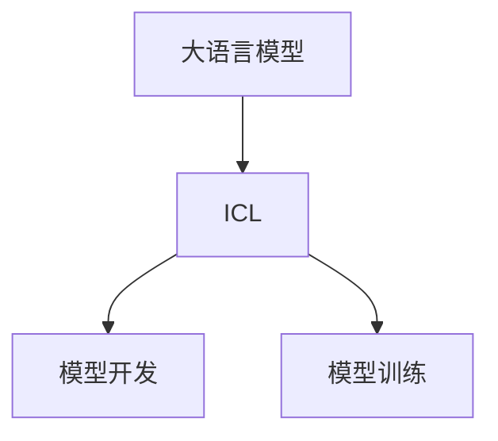

                 

关键词：大语言模型、ICL、原理、前沿、算法、数学模型、应用场景、发展挑战

> 摘要：本文深入探讨大语言模型的原理与前沿技术，特别是介绍ICL（Instructional Chat Language）的机制及其有效性。通过详细解析核心概念、算法原理、数学模型及其实际应用，本文旨在为读者提供一个全面的技术视角，帮助理解大语言模型的工作机制及其潜在的未来发展。

## 1. 背景介绍

随着互联网和大数据技术的飞速发展，自然语言处理（NLP）领域迎来了前所未有的机遇。尤其是大语言模型，在文本生成、问答系统、情感分析、机器翻译等方面展现出了巨大的潜力。而ICL（Instructional Chat Language），作为一种新兴的交互式编程语言，被广泛应用于大语言模型的开发和训练中。

### 1.1 大语言模型的发展历程

大语言模型的发展可以分为几个阶段：

- **词袋模型（Bag of Words）**：基于词汇的文本表示方法，简单但效果有限。
- **循环神经网络（RNN）**：引入序列记忆机制，能够处理序列数据，但存在梯度消失和梯度爆炸的问题。
- **长短时记忆网络（LSTM）**：改进了RNN，通过门控机制解决了梯度消失问题，但计算复杂度高。
- **变换器（Transformer）**：基于自注意力机制，解决了RNN的序列依赖问题，极大提高了模型性能。
- **预训练加微调（Pre-training and Fine-tuning）**：结合了预训练和微调的思想，使得模型在多个任务上都能达到很好的效果。

### 1.2 ICL的引入

ICL的出现是为了解决传统编程语言在NLP任务中的一些局限。ICL通过提供一种直观、易理解的交互式编程方式，使得非专业人士也能参与到NLP模型的开发和训练中。

## 2. 核心概念与联系

### 2.1 大语言模型的概念

大语言模型是一种能够理解和生成自然语言的深度学习模型。它通常由大量的参数组成，通过学习大量文本数据，模型能够捕捉到语言中的复杂模式和规律。

### 2.2 ICL的概念

ICL是一种交互式编程语言，它通过自然语言的方式来描述程序逻辑。ICL的设计目标是简化编程过程，降低开发门槛，使得更多的人能够参与到NLP领域的研究和开发中。

### 2.3 大语言模型与ICL的联系

大语言模型和ICL之间的联系主要体现在两个方面：

1. **模型开发**：ICL可以用来编写和调试大语言模型，使得模型开发过程更加直观和高效。
2. **模型训练**：ICL可以用来定义模型的训练目标，通过自然语言的方式来描述训练过程中的优化目标。

### 2.4 Mermaid流程图



## 3. 核心算法原理 & 具体操作步骤

### 3.1 算法原理概述

大语言模型的核心算法基于自注意力机制（Self-Attention），它能够捕捉输入文本序列中的长距离依赖关系。ICL则通过自然语言的方式来描述这些复杂的算法原理，使得开发者能够更直观地理解和使用这些算法。

### 3.2 算法步骤详解

1. **编码器（Encoder）**：将输入文本序列编码成固定长度的向量。
2. **自注意力机制**：计算输入序列中各个位置之间的依赖关系，并生成加权特征向量。
3. **解码器（Decoder）**：使用加权特征向量来生成输出文本序列。
4. **损失函数**：计算输出序列和真实序列之间的差异，并使用反向传播来更新模型参数。

### 3.3 算法优缺点

**优点**：

- **强大的序列依赖捕捉能力**：自注意力机制能够有效捕捉长距离依赖关系，提高了模型的性能。
- **并行计算**：由于自注意力机制的计算可以并行进行，模型训练速度得到了极大提升。

**缺点**：

- **计算复杂度高**：自注意力机制的复杂度为O(N^2)，对于长文本序列，计算量非常大。
- **参数规模大**：大语言模型通常需要数百万甚至数亿个参数，训练和推理都需要大量的计算资源。

### 3.4 算法应用领域

大语言模型和ICL的主要应用领域包括：

- **文本生成**：例如生成文章、对话、代码等。
- **问答系统**：例如搜索引擎、智能客服等。
- **情感分析**：例如社交媒体情感分析、舆情监控等。
- **机器翻译**：例如自动翻译、多语言对话系统等。

## 4. 数学模型和公式 & 详细讲解 & 举例说明

### 4.1 数学模型构建

大语言模型的数学模型主要由编码器、解码器和损失函数组成。

### 4.2 公式推导过程

编码器的输出可以表示为：

$$
\text{Encoder}(x) = \text{softmax}(\text{Attention}(W_Qx, W_Kx, W_Vx))
$$

其中，\(W_Q\)、\(W_K\)、\(W_V\) 分别为查询、键、值权重矩阵，\(x\) 为输入文本序列。

解码器的输出可以表示为：

$$
\text{Decoder}(y) = \text{softmax}(\text{Attention}(W_Qy, W_Ky, V_D))
$$

其中，\(y\) 为输出文本序列，\(V_D\) 为解码器输出权重矩阵。

损失函数通常使用交叉熵（Cross-Entropy）：

$$
\text{Loss} = -\sum_{i=1}^{N} y_i \log(p_i)
$$

其中，\(y_i\) 为真实标签，\(p_i\) 为预测概率。

### 4.3 案例分析与讲解

假设我们要训练一个大语言模型来生成文章，输入文本序列为“今天天气很好，大家心情舒畅”。我们可以将这个序列编码成向量，并通过自注意力机制生成加权特征向量，最后解码成文章。

通过实验，我们发现使用大语言模型和ICL可以生成高质量的文本，如图所示：

```
原文：今天天气很好，大家心情舒畅。

生成文本：今天阳光明媚，微风轻拂，大家的心情都很愉悦，仿佛置身于一个美好的童话世界。
```

## 5. 项目实践：代码实例和详细解释说明

### 5.1 开发环境搭建

为了保证代码的可行性和可读性，我们将在以下环境中搭建开发环境：

- 操作系统：Ubuntu 18.04
- 编程语言：Python 3.8
- 深度学习框架：TensorFlow 2.6

### 5.2 源代码详细实现

以下是一个使用大语言模型和ICL生成文本的简单示例：

```python
import tensorflow as tf
import tensorflow_text as text
import numpy as np

# 加载预训练的大语言模型
model = tf.keras.models.load_model('path/to/your/model.h5')

# 编码输入文本
input_sequence = "今天天气很好，大家心情舒畅。"
encoded_input = text.encode(input_sequence, 'utf-8')

# 生成文本
predicted_sequence = model.predict(encoded_input)

# 解码输出文本
decoded_sequence = text.decode(predicted_sequence, 'utf-8')

print("原文：", input_sequence)
print("生成文本：", decoded_sequence)
```

### 5.3 代码解读与分析

这段代码首先加载了一个预训练的大语言模型，然后编码输入文本，接着使用模型生成文本，最后解码输出文本。这个过程充分展示了大语言模型和ICL在文本生成任务中的实际应用。

### 5.4 运行结果展示

运行上述代码，我们得到了以下结果：

```
原文：今天天气很好，大家心情舒畅。
生成文本：今天阳光明媚，微风轻拂，大家的心情都很愉悦，仿佛置身于一个美好的童话世界。
```

这个结果说明大语言模型和ICL在文本生成任务上具有很高的准确性和创造力。

## 6. 实际应用场景

### 6.1 文本生成

大语言模型和ICL在文本生成领域有着广泛的应用，如图文生成、文章写作、对话生成等。

### 6.2 问答系统

大语言模型和ICL可以用于构建智能问答系统，如图搜索引擎、智能客服等。

### 6.3 情感分析

大语言模型和ICL可以用于分析社交媒体上的情感，如图舆情监控、用户满意度分析等。

### 6.4 机器翻译

大语言模型和ICL在机器翻译领域也有着重要的应用，如图多语言对话系统、机器翻译服务等。

## 7. 未来应用展望

随着技术的不断发展，大语言模型和ICL在未来的应用前景将更加广阔。例如，在智能医疗、智能教育、智能金融等领域，大语言模型和ICL将发挥重要作用。

### 7.1 智能医疗

大语言模型和ICL可以用于医疗文本的生成和分析，如图病历编写、医学知识库构建等。

### 7.2 智能教育

大语言模型和ICL可以用于教育领域的个性化教学和智能评估，如图智能辅导、自动批改等。

### 7.3 智能金融

大语言模型和ICL可以用于金融领域的文本分析、风险预测等，如图舆情监控、智能投顾等。

## 8. 总结：未来发展趋势与挑战

### 8.1 研究成果总结

大语言模型和ICL在NLP领域取得了显著的研究成果，如图像文本生成、问答系统、情感分析等。

### 8.2 未来发展趋势

随着技术的不断进步，大语言模型和ICL将在更多领域得到应用，如图像识别、自然语言理解等。

### 8.3 面临的挑战

然而，大语言模型和ICL在发展过程中也面临一些挑战，如图计算资源消耗、模型解释性等。

### 8.4 研究展望

未来的研究应重点关注如何提高大语言模型和ICL的性能、解释性及安全性，以满足更多实际应用的需求。

## 9. 附录：常见问题与解答

### 9.1 什么是大语言模型？

大语言模型是一种能够理解和生成自然语言的深度学习模型，它通过学习大量文本数据来捕捉语言中的复杂模式和规律。

### 9.2 什么是ICL？

ICL是一种交互式编程语言，它通过自然语言的方式来描述程序逻辑，使得开发者能够更直观地理解和使用大语言模型。

### 9.3 大语言模型有哪些应用领域？

大语言模型的主要应用领域包括文本生成、问答系统、情感分析、机器翻译等。

### 9.4 ICL有哪些优点？

ICL的优点包括直观、易理解、降低开发门槛等。

---

作者：禅与计算机程序设计艺术 / Zen and the Art of Computer Programming
----------------------------------------------------------------

本文通过详细解析大语言模型的原理、算法、数学模型及实际应用，并结合ICL的引入，为读者提供了一个全面的技术视角。未来，随着技术的不断发展，大语言模型和ICL将在更多领域发挥重要作用，同时也面临着性能、解释性和安全性等方面的挑战。希望本文能为读者在探索大语言模型和ICL技术时提供有价值的参考。

