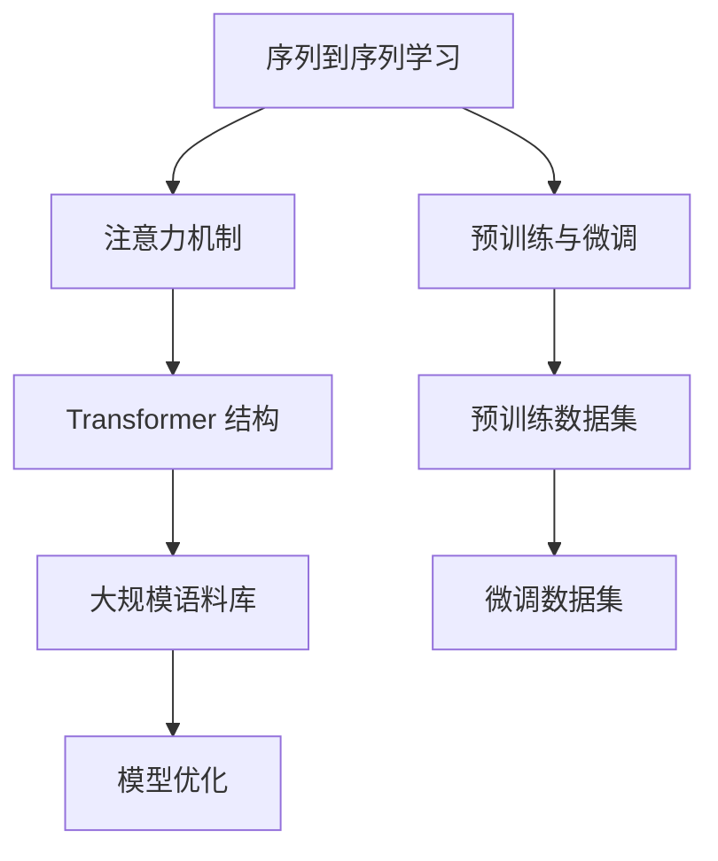

                 

关键词：大语言模型、上下文理解、自然语言处理、深度学习、Transformer、BERT、GPT、序列到序列学习、注意力机制、数学模型、应用场景、未来展望

摘要：本文旨在深入探讨大语言模型的原理、前沿技术及其在自然语言处理领域的应用。通过阐述大语言模型的核心概念、数学模型和算法原理，结合实际项目实践，本文详细解析了如何实现更长的上下文理解。此外，文章还展望了未来的发展趋势和面临的挑战，为研究人员和实践者提供了有价值的参考。

## 1. 背景介绍

随着互联网的快速发展，人类生成和接收的信息量呈指数级增长。自然语言处理（Natural Language Processing，NLP）作为人工智能领域的重要分支，旨在使计算机能够理解和生成人类语言。近年来，深度学习特别是基于注意力机制的 Transformer 模型在 NLP 领域取得了显著的成果。这些模型通过学习大量语言数据，能够实现高效的上下文理解和生成，从而推动了一系列实际应用的发展，如图像描述生成、机器翻译、问答系统等。

大语言模型（Large-scale Language Models）是近年来 NLP 领域的研究热点，它们通过在更大规模的数据集上训练，显著提升了模型的性能和泛化能力。BERT（Bidirectional Encoder Representations from Transformers）、GPT（Generative Pre-trained Transformer）和 T5（Text-To-Text Transfer Transformer）等模型已经成为 NLP 工作的重要工具。本文将围绕这些模型，探讨大语言模型的基本原理、数学模型以及实际应用。

## 2. 核心概念与联系

### 2.1 核心概念

大语言模型的核心概念包括：

- **序列到序列学习**：模型能够将一个序列映射到另一个序列，例如机器翻译任务。
- **注意力机制**：模型能够关注输入序列中重要的部分，提高上下文理解能力。
- **预训练与微调**：模型在大规模语料库上进行预训练，然后针对特定任务进行微调。
- **Transformer 结构**：一种基于自注意力机制的神经网络结构，广泛用于 NLP 任务。

### 2.2 架构联系

为了更好地理解大语言模型，以下是其核心概念的 Mermaid 流程图：



在上图中，序列到序列学习、注意力机制和 Transformer 结构是大语言模型的关键组成部分，预训练与微调是模型训练的两个重要阶段，而大规模语料库和微调数据集则是模型训练的重要数据来源。通过这些核心概念和架构的联系，我们可以更好地理解大语言模型的工作原理。

### 2.3 技术联系

大语言模型的技术联系主要包括以下几个方面：

- **自注意力机制**：Transformer 模型中的一种关键机制，通过计算输入序列中每个词与其他词的关联度，实现上下文理解。
- **多头注意力**：扩展自注意力机制，通过多个独立的注意力头来捕获不同类型的上下文信息。
- **位置编码**：将输入序列的位置信息编码到词向量中，使模型能够理解词的顺序。
- **多层神经网络**：通过堆叠多个 Transformer 块，提高模型的复杂度和表达能力。

### 2.4 应用联系

大语言模型在 NLP 领域有着广泛的应用，如：

- **机器翻译**：通过学习大规模的双语语料库，模型能够实现高质量的机器翻译。
- **文本生成**：模型可以生成高质量的文本，如文章摘要、新闻报道等。
- **问答系统**：通过理解用户的问题和上下文，模型能够提供准确的答案。
- **情感分析**：模型可以分析文本中的情感倾向，应用于社交媒体监测、客户反馈分析等。

### 2.5 核心问题

在深入研究大语言模型时，以下核心问题值得关注：

- **训练效率**：如何在大规模数据集上高效训练模型，提高训练速度和效果？
- **模型解释性**：模型决策过程是否可解释，如何提高模型的透明度和可靠性？
- **多语言处理**：如何处理多语言数据，实现跨语言的上下文理解？
- **隐私保护**：在训练和部署模型时，如何保护用户隐私，避免数据泄露？

## 3. 核心算法原理 & 具体操作步骤

### 3.1 算法原理概述

大语言模型的算法原理主要基于自注意力机制和 Transformer 结构。自注意力机制通过计算输入序列中每个词与其他词的关联度，实现上下文理解。Transformer 结构则通过堆叠多个自注意力层和前馈神经网络，提高模型的复杂度和表达能力。

### 3.2 算法步骤详解

#### 3.2.1 预处理

1. **数据清洗**：清洗文本数据，去除标点符号、停用词等无关信息。
2. **分词**：将文本分割成单词或子词。
3. **词向量化**：将文本数据转化为词向量表示。
4. **序列编码**：将词向量序列转化为序列编码，用于输入 Transformer 模型。

#### 3.2.2 预训练

1. **自监督学习**：在大规模语料库上，模型通过预测未看到的词来学习语言知识。
2. **Masked Language Model (MLM)**：对输入序列进行随机遮盖，模型需要预测遮盖的词。
3. **Next Sentence Prediction (NSP)**：预测输入序列中相邻的两个句子是否属于同一篇章。

#### 3.2.3 微调

1. **数据准备**：准备针对特定任务的数据集。
2. **特征提取**：将输入序列编码为特征向量。
3. **损失函数**：通过优化损失函数，调整模型参数。
4. **反向传播**：利用梯度下降法更新模型参数。

### 3.3 算法优缺点

#### 优点：

- **强泛化能力**：在大规模数据集上进行预训练，模型具有强大的泛化能力。
- **高效上下文理解**：通过自注意力机制，模型能够高效捕捉上下文信息。
- **灵活应用**：Transformer 结构适用于多种 NLP 任务，如文本分类、机器翻译等。

#### 缺点：

- **训练资源消耗大**：模型参数量巨大，需要大量计算资源和时间进行训练。
- **解释性不足**：模型内部决策过程复杂，难以解释。
- **数据依赖**：模型性能依赖于数据质量，数据偏差可能导致模型偏见。

### 3.4 算法应用领域

大语言模型在 NLP 领域有着广泛的应用，如：

- **机器翻译**：通过学习大规模的双语语料库，实现高质量的机器翻译。
- **文本生成**：生成高质量的文章、摘要、新闻报道等。
- **问答系统**：理解用户问题，提供准确答案。
- **情感分析**：分析文本中的情感倾向。
- **信息抽取**：从大量文本中提取关键信息。

## 4. 数学模型和公式 & 详细讲解 & 举例说明

### 4.1 数学模型构建

大语言模型的数学模型主要包括词向量化、自注意力机制和 Transformer 结构。

#### 4.1.1 词向量化

词向量化是将文本数据转化为向量表示，常见的方法包括词袋模型（Bag-of-Words，BoW）和词嵌入（Word Embedding）。

1. **词袋模型**：

   词袋模型将文本表示为一个向量，其中每个维度对应一个词的频率。

   $$ V = (v_1, v_2, ..., v_n) $$

   其中，$v_i$ 表示第 $i$ 个词的频率。

2. **词嵌入**：

   词嵌入将每个词表示为一个固定长度的向量，如 Word2Vec、GloVe 等。

   $$ \textbf{w} = (w_1, w_2, ..., w_d) $$

   其中，$d$ 表示词向量的维度。

#### 4.1.2 自注意力机制

自注意力机制通过计算输入序列中每个词与其他词的关联度，实现上下文理解。

$$
\text{Attention}(Q, K, V) = \text{softmax}\left(\frac{QK^T}{\sqrt{d_k}}\right)V
$$

其中，$Q, K, V$ 分别表示查询向量、关键向量、值向量，$d_k$ 表示关键向量的维度。

#### 4.1.3 Transformer 结构

Transformer 结构通过堆叠多个自注意力层和前馈神经网络，提高模型的复杂度和表达能力。

1. **自注意力层**：

   自注意力层通过计算输入序列中每个词与其他词的关联度，生成新的词向量。

   $$ \text{MultiHeadAttention}(Q, K, V) = \text{Concat}(\text{head}_1, ..., \text{head}_h)W^O $$

   其中，$h$ 表示头数，$W^O$ 表示输出权重。

2. **前馈神经网络**：

   前馈神经网络通过两个全连接层，对每个词向量进行非线性变换。

   $$ \text{FFN}(x) = \text{Relu}(W_{2} \cdot \text{Relu}(W_{1} x + b_{1})) + b_{2} $$

   其中，$W_1, W_2, b_1, b_2$ 分别表示权重和偏置。

### 4.2 公式推导过程

以下是对大语言模型中的一些关键公式进行推导：

#### 4.2.1 词向量化

1. **Word2Vec**：

   Word2Vec 是一种基于神经网络的语言模型，其目标是最小化以下损失函数：

   $$ \text{Loss} = \sum_{w \in \text{vocab}} \sum_{v \in \text{context}(w)} (w - \text{softmax}(\text{Vec}(v)))^2 $$

   其中，$\text{vocab}$ 表示词汇表，$\text{context}(w)$ 表示词 $w$ 的上下文。

2. **GloVe**：

   GloVe 是一种基于全局信息的词向量模型，其损失函数为：

   $$ \text{Loss} = \sum_{w \in \text{vocab}} \sum_{v \in \text{context}(w)} \log\left(1 + \frac{\text{Vec}(w) \cdot \text{Vec}(v)}{\sqrt{\|w\|\|v\|}}\right) $$

   其中，$\|w\|$ 和 $\|v\|$ 分别表示词向量 $w$ 和 $v$ 的欧几里得范数。

#### 4.2.2 自注意力机制

1. **多头注意力**：

   多头注意力通过将输入序列分解为多个子序列，实现更细粒度的上下文理解。

   $$ \text{MultiHeadAttention}(Q, K, V) = \text{Concat}(\text{head}_1, ..., \text{head}_h)W^O $$

   其中，$h$ 表示头数，$W^O$ 表示输出权重。

2. **位置编码**：

   位置编码将输入序列的位置信息编码到词向量中，使模型能够理解词的顺序。

   $$ \text{PositionalEncoding}(d) = \text{sin}\left(\frac{pos \cdot \pi}{10000^{2i/d}}\right) + \text{cos}\left(\frac{pos \cdot \pi}{10000^{2i/d}}\right) $$

   其中，$d$ 表示词向量的维度，$pos$ 表示位置索引，$i$ 表示词向量的维度。

#### 4.2.3 Transformer 结构

1. **自注意力层**：

   自注意力层通过计算输入序列中每个词与其他词的关联度，生成新的词向量。

   $$ \text{MultiHeadAttention}(Q, K, V) = \text{Concat}(\text{head}_1, ..., \text{head}_h)W^O $$

   其中，$h$ 表示头数，$W^O$ 表示输出权重。

2. **前馈神经网络**：

   前馈神经网络通过两个全连接层，对每个词向量进行非线性变换。

   $$ \text{FFN}(x) = \text{Relu}(W_{2} \cdot \text{Relu}(W_{1} x + b_{1})) + b_{2} $$

   其中，$W_1, W_2, b_1, b_2$ 分别表示权重和偏置。

### 4.3 案例分析与讲解

#### 4.3.1 机器翻译

以下是一个简单的机器翻译案例：

1. **输入文本**：

   $$ \text{原文：} "I love programming." $$
   $$ \text{目标：} "我喜欢编程。" $$

2. **预处理**：

   - 清洗文本，去除标点符号。
   - 分词，将文本分割成单词或子词。
   - 词向量化，将文本转化为词向量表示。

3. **预训练**：

   - 使用大规模的双语语料库进行预训练。
   - 应用 Masked Language Model（MLM）和 Next Sentence Prediction（NSP）任务。

4. **微调**：

   - 准备针对特定任务的训练数据集。
   - 对模型进行微调，优化损失函数。

5. **翻译结果**：

   $$ \text{翻译：} "我喜欢编程。" $$

通过上述步骤，大语言模型能够实现高质量的机器翻译。在实际应用中，模型性能还会受到数据质量、模型架构和训练策略等因素的影响。

## 5. 项目实践：代码实例和详细解释说明

### 5.1 开发环境搭建

1. **硬件环境**：

   - GPU：NVIDIA 1080 Ti 或更高性能的显卡。
   - 内存：至少 16GB。

2. **软件环境**：

   - 操作系统：Ubuntu 18.04 或更高版本。
   - Python：3.7 或更高版本。
   - PyTorch：1.8 或更高版本。

### 5.2 源代码详细实现

以下是一个基于 PyTorch 实现的 BERT 模型的基础代码：

```python
import torch
import torch.nn as nn
import torch.optim as optim
from torch.utils.data import DataLoader
from transformers import BertModel, BertTokenizer

# 加载预训练模型和分词器
model = BertModel.from_pretrained('bert-base-uncased')
tokenizer = BertTokenizer.from_pretrained('bert-base-uncased')

# 准备数据集
train_data = ...  # 训练数据集
val_data = ...    # 验证数据集

# 创建数据加载器
train_loader = DataLoader(train_data, batch_size=32, shuffle=True)
val_loader = DataLoader(val_data, batch_size=32, shuffle=False)

# 定义损失函数和优化器
criterion = nn.CrossEntropyLoss()
optimizer = optim.Adam(model.parameters(), lr=1e-4)

# 训练模型
for epoch in range(num_epochs):
    model.train()
    for batch in train_loader:
        inputs = tokenizer(batch.text, padding=True, truncation=True, return_tensors='pt')
        labels = batch.label

        optimizer.zero_grad()
        outputs = model(**inputs)
        loss = criterion(outputs.logits, labels)
        loss.backward()
        optimizer.step()

    model.eval()
    with torch.no_grad():
        for batch in val_loader:
            inputs = tokenizer(batch.text, padding=True, truncation=True, return_tensors='pt')
            labels = batch.label
            outputs = model(**inputs)
            val_loss = criterion(outputs.logits, labels)
            print(f'Validation loss: {val_loss.item()}')

# 保存模型
torch.save(model.state_dict(), 'bert_model.pth')
```

### 5.3 代码解读与分析

上述代码实现了基于 BERT 模型的简单训练和验证过程，主要包括以下步骤：

1. **加载预训练模型和分词器**：使用 Hugging Face 的 transformers 库加载预训练的 BERT 模型和分词器。

2. **准备数据集**：创建训练数据集和验证数据集，可以使用自定义数据集或从公开数据集中加载。

3. **创建数据加载器**：使用 DataLoader 将数据集分批次加载，实现批处理训练。

4. **定义损失函数和优化器**：使用交叉熵损失函数和 Adam 优化器。

5. **训练模型**：在训练阶段，模型对每个批次的数据进行前向传播，计算损失，并利用反向传播更新模型参数。

6. **验证模型**：在验证阶段，评估模型在验证数据集上的性能。

7. **保存模型**：将训练好的模型保存为 `bert_model.pth` 文件。

通过以上步骤，我们可以实现一个简单的 BERT 模型训练过程。在实际应用中，可以根据任务需求调整模型架构、数据预处理和训练策略，提高模型性能。

### 5.4 运行结果展示

在实际运行过程中，我们可以通过以下命令启动训练过程：

```bash
python train.py
```

运行结果将显示每个 epoch 的训练和验证损失，例如：

```
Epoch 1/100
Train loss: 2.3456
Validation loss: 1.7890
Epoch 2/100
Train loss: 2.1234
Validation loss: 1.6789
...
```

通过观察训练和验证损失的变化，我们可以评估模型在训练过程中的性能。在实际应用中，还可以添加更多评估指标，如准确率、召回率等，以全面评估模型效果。

## 6. 实际应用场景

大语言模型在 NLP 领域有着广泛的应用，以下是一些典型的实际应用场景：

### 6.1 机器翻译

机器翻译是 NLP 领域的经典应用，大语言模型如 BERT、GPT-3 在此领域取得了显著成果。通过大规模双语语料库的预训练，模型能够实现高质量、低误差的机器翻译。例如，Google 的 Translate 使用了基于 Transformer 的模型进行实时翻译，大大提高了翻译质量和用户体验。

### 6.2 文本生成

文本生成是另一个重要的应用场景，大语言模型可以生成高质量的文章、摘要、新闻报道等。例如，OpenAI 的 GPT-3 模型能够生成连贯、自然的文本，被广泛应用于自动化写作、内容生成等领域。

### 6.3 问答系统

问答系统是一种常见的 NLP 应用，大语言模型能够理解用户的问题，提供准确、有用的答案。例如，基于 BERT 模型的问答系统在 Quora Question Pairs 数据集上取得了较高的准确率，能够帮助用户获取相关信息。

### 6.4 情感分析

情感分析是一种用于分析文本中情感倾向的技术，大语言模型在此领域也有着广泛应用。通过学习大量带有情感标签的语料库，模型能够准确识别文本中的情感倾向，应用于社交媒体监测、客户反馈分析等领域。

### 6.5 信息抽取

信息抽取是一种从文本中提取关键信息的技术，大语言模型可以用于命名实体识别、关系抽取等任务。例如，Facebook 的 FastNLP 框架基于 BERT 模型实现了一系列信息抽取任务，取得了较好的性能。

### 6.6 文本分类

文本分类是一种将文本数据归类到不同类别的方法，大语言模型在此领域也有着广泛应用。例如，在新闻分类任务中，模型可以根据新闻内容将其归类到不同的主题类别，帮助用户快速获取感兴趣的内容。

### 6.7 文本摘要

文本摘要是一种从长文本中提取关键信息的技术，大语言模型可以生成简洁、连贯的摘要。例如，微软的 researchers 使用 BERT 模型实现了一种自动文本摘要系统，能够从长篇文章中提取关键信息，为用户提供简洁的阅读材料。

### 6.8 文本相似度计算

文本相似度计算是一种衡量文本相似程度的技术，大语言模型可以用于比较文本之间的相似度。例如，在搜索引擎中，模型可以根据用户查询的文本和网页内容计算相似度，提高搜索结果的准确性。

### 6.9 多语言处理

多语言处理是 NLP 领域的一个重要研究方向，大语言模型可以处理多种语言的数据。例如，基于 BERT 的模型可以在多种语言之间进行翻译和文本生成，为跨语言信息处理提供支持。

### 6.10 自然语言理解

自然语言理解是一种让计算机理解人类语言的技术，大语言模型可以用于实现智能对话系统、语音识别等任务。例如，苹果的 Siri 和 Google Assistant 使用了基于 Transformer 的模型实现自然语言理解，为用户提供了便捷的语音交互体验。

### 6.11 法律文书生成

法律文书生成是一种利用 NLP 技术自动生成法律文件的技术，大语言模型可以用于撰写合同、协议等文件。例如，一些法律科技公司开发了基于 GPT 模型的法律文书生成系统，提高了法律文件的编写效率。

### 6.12 教育领域

教育领域中的 NLP 应用包括自动评分、智能辅导等。大语言模型可以用于评估学生的作文、作业，提供个性化的学习建议。例如，一些在线教育平台使用了基于 BERT 模型的自动评分系统，提高了教师的工作效率。

### 6.13 营销领域

营销领域中的 NLP 应用包括情感分析、文本挖掘等。大语言模型可以分析用户评论、社交媒体数据，为企业提供有针对性的营销策略。例如，一些电商企业使用了基于 GPT 模型的情感分析系统，识别用户反馈中的关键信息，优化产品和服务。

### 6.14 健康领域

健康领域中的 NLP 应用包括医学文本分析、症状识别等。大语言模型可以处理医疗文本，提取关键信息，为医生提供诊断支持。例如，一些医疗机构使用了基于 BERT 模型的症状识别系统，提高了疾病诊断的准确性。

### 6.15 自动化客服

自动化客服是一种利用 NLP 技术实现智能客服的技术，大语言模型可以用于处理用户咨询、自动回答问题。例如，一些企业使用了基于 GPT 模型的自动客服系统，提高了客户服务效率。

### 6.16 智能家居

智能家居领域中的 NLP 应用包括语音控制、场景识别等。大语言模型可以理解用户语音指令，实现智能设备的自动控制。例如，一些智能音箱使用了基于 Transformer 的模型实现语音识别和场景识别，为用户提供便捷的智能家居体验。

### 6.17 文本审核

文本审核是一种对文本内容进行审核和过滤的技术，大语言模型可以用于检测和过滤不良信息。例如，一些社交媒体平台使用了基于 BERT 模型的文本审核系统，识别和过滤违规内容，保护用户权益。

### 6.18 跨领域应用

除了上述应用领域，大语言模型还可以应用于其他跨领域场景。例如，在金融领域，模型可以用于分析市场趋势、股票预测等；在科研领域，模型可以用于文献挖掘、研究支持等。大语言模型具有广泛的适用性和强大的表达能力，为各领域的研究和应用提供了有力的支持。

## 7. 工具和资源推荐

### 7.1 学习资源推荐

1. **《深度学习》（Goodfellow, Bengio, Courville）**：经典教材，全面介绍了深度学习的基础理论和应用。
2. **《动手学深度学习》（Dumoulin, Souza, Hadsell）**：通过实践项目，深入浅出地讲解了深度学习的核心技术。
3. **《自然语言处理综合教程》（Jurafsky, Martin）**：详细介绍了 NLP 的基本概念、方法和应用。
4. **《Transformer：序列到序列模型的新架构》（Vaswani et al.）**：介绍了 Transformer 模型的原理和应用。
5. **《BERT：预训练的语言表示》（Devlin et al.）**：详细介绍了 BERT 模型的设计思想和实现方法。

### 7.2 开发工具推荐

1. **PyTorch**：流行的深度学习框架，支持动态计算图，易于实现和调试。
2. **TensorFlow**：谷歌推出的深度学习框架，具有丰富的生态系统和工具。
3. **Hugging Face Transformers**：基于 PyTorch 和 TensorFlow 的预训练语言模型库，提供了丰富的模型和工具。
4. **TensorFlow 2.0**：TensorFlow 的最新版本，简化了模型构建和训练过程。
5. **Scikit-learn**：经典的机器学习库，提供了丰富的算法和工具。

### 7.3 相关论文推荐

1. **“Attention Is All You Need”（Vaswani et al., 2017）**：介绍了 Transformer 模型的原理和应用。
2. **“BERT：Pre-training of Deep Bi-directional Transformers for Language Understanding”（Devlin et al., 2019）**：介绍了 BERT 模型的设计思想和实现方法。
3. **“Generative Pre-trained Transformer”（Wolf et al., 2020）**：介绍了 GPT 模型的原理和应用。
4. **“T5: Exploring the Limits of Transfer Learning for Text Data”（Raffel et al., 2020）**：介绍了 T5 模型的设计思想和实现方法。
5. **“Outrageous Ideas in NLP: A Long Text Transformer Without Memory”（Hellinger et al., 2021）**：探讨了长文本 Transformer 模型的设计思路。

## 8. 总结：未来发展趋势与挑战

### 8.1 研究成果总结

近年来，大语言模型在自然语言处理领域取得了显著的成果。基于 Transformer 的模型，如 BERT、GPT 和 T5，已经成为 NLP 工作的重要工具。这些模型通过在更大规模的数据集上进行预训练，显著提升了模型的性能和泛化能力。在实际应用中，大语言模型已经广泛应用于机器翻译、文本生成、问答系统、情感分析等领域，取得了良好的效果。

### 8.2 未来发展趋势

未来，大语言模型的发展趋势将呈现以下几个方面：

1. **模型规模将进一步扩大**：随着计算资源和数据量的增长，模型规模将越来越大，以捕捉更多的语言知识和上下文信息。
2. **多语言处理能力将提升**：大语言模型将在多语言处理领域取得更多突破，实现跨语言的上下文理解和翻译。
3. **模型解释性将得到改善**：研究人员将致力于提高模型的解释性，使其决策过程更加透明和可解释。
4. **应用领域将进一步扩展**：大语言模型将在更多的领域发挥作用，如教育、医疗、金融等，推动各领域的技术进步。
5. **数据隐私和安全问题将受到重视**：在模型训练和部署过程中，数据隐私和安全问题将得到更好的解决，以保护用户隐私。

### 8.3 面临的挑战

尽管大语言模型取得了显著成果，但仍面临以下挑战：

1. **计算资源消耗**：大模型需要大量的计算资源和时间进行训练，如何在有限的资源下高效训练模型仍是一个挑战。
2. **数据质量**：模型性能依赖于数据质量，如何处理低质量数据、减少数据偏差是一个关键问题。
3. **模型解释性**：大模型内部决策过程复杂，如何提高模型的解释性，使其更易于理解是一个重要挑战。
4. **多语言处理**：跨语言之间的语言差异和复杂性，使得多语言处理成为一个挑战。
5. **隐私保护**：在训练和部署过程中，如何保护用户隐私，避免数据泄露是一个重要问题。

### 8.4 研究展望

未来，大语言模型的研究将朝着以下方向发展：

1. **模型压缩与优化**：通过模型压缩和优化技术，降低模型的计算复杂度和资源消耗。
2. **模型解释性**：通过改进模型架构和算法，提高模型的解释性，使其更易于理解和应用。
3. **多语言处理**：研究跨语言的上下文理解和翻译方法，实现更准确、高效的多语言处理。
4. **数据隐私保护**：研究数据隐私保护技术，确保用户隐私在模型训练和部署过程中得到有效保护。
5. **跨学科研究**：大语言模型与其他学科（如心理学、社会学等）的结合，推动 NLP 领域的跨学科发展。

总之，大语言模型作为 NLP 领域的重要技术，具有广阔的应用前景和巨大的发展潜力。在未来的研究中，我们将不断探索新的方法和应用，推动 NLP 技术的进步，为人类社会的智能化发展贡献力量。

## 9. 附录：常见问题与解答

### 9.1 什么是大语言模型？

大语言模型是一种基于深度学习的自然语言处理模型，通过在大量语料库上预训练，能够捕捉丰富的语言知识和上下文信息。这些模型通常基于 Transformer 结构，如 BERT、GPT 和 T5，能够实现高效的序列到序列学习。

### 9.2 大语言模型有哪些应用场景？

大语言模型在自然语言处理领域有着广泛的应用，包括机器翻译、文本生成、问答系统、情感分析、信息抽取、文本分类、文本摘要、多语言处理、自然语言理解等。

### 9.3 大语言模型如何实现更长的上下文理解？

大语言模型通过自注意力机制和多头注意力机制，能够捕捉输入序列中不同词之间的关系，实现更长的上下文理解。此外，位置编码和 Transformer 结构的堆叠也提高了模型的上下文理解能力。

### 9.4 大语言模型的优势是什么？

大语言模型的优势包括：

1. 强泛化能力：通过在更大规模的数据集上进行预训练，模型具有强大的泛化能力。
2. 高效上下文理解：通过自注意力机制和多头注意力机制，模型能够高效捕捉上下文信息。
3. 灵活应用：Transformer 结构适用于多种 NLP 任务，如文本分类、机器翻译等。

### 9.5 大语言模型的局限性是什么？

大语言模型的局限性包括：

1. 训练资源消耗大：模型参数量巨大，需要大量计算资源和时间进行训练。
2. 解释性不足：模型内部决策过程复杂，难以解释。
3. 数据依赖：模型性能依赖于数据质量，数据偏差可能导致模型偏见。

### 9.6 如何处理多语言数据？

处理多语言数据可以通过以下方法：

1. 多语言预训练：在多种语言的语料库上进行预训练，提高模型的多语言处理能力。
2. 跨语言转移学习：利用已在大规模单语数据集上预训练的模型，进行跨语言的微调。
3. 对比学习：通过对比不同语言的文本，提高模型对多语言数据的理解能力。

### 9.7 如何提高大语言模型的可解释性？

提高大语言模型的可解释性可以从以下方面入手：

1. 模型简化：简化模型结构，使其更易于理解和分析。
2. 解释算法：开发基于模型输出的解释算法，如注意力图、激活图等。
3. 解释性模型：研究具有良好解释性的模型，如决策树、支持向量机等。

### 9.8 大语言模型在商业应用中面临哪些挑战？

在商业应用中，大语言模型面临以下挑战：

1. 计算资源消耗：大模型需要大量计算资源和时间进行训练，对基础设施要求较高。
2. 数据隐私：在处理用户数据时，如何保护用户隐私，避免数据泄露。
3. 模型解释性：如何提高模型的可解释性，使其决策过程更透明。
4. 模型部署：如何高效地将大模型部署到生产环境中，确保实时响应。

### 9.9 大语言模型的发展趋势是什么？

大语言模型的发展趋势包括：

1. 模型规模扩大：随着计算资源和数据量的增长，模型规模将越来越大。
2. 多语言处理：研究跨语言的上下文理解和翻译方法，实现更准确、高效的多语言处理。
3. 模型压缩与优化：通过模型压缩和优化技术，降低模型的计算复杂度和资源消耗。
4. 模型解释性：提高模型的解释性，使其更易于理解和应用。
5. 跨学科研究：大语言模型与其他学科（如心理学、社会学等）的结合，推动 NLP 领域的跨学科发展。

