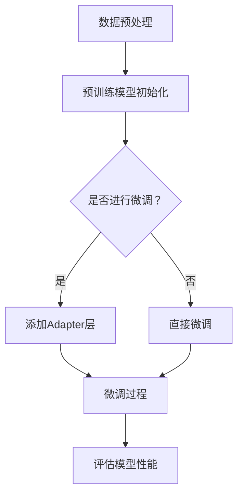

                 

关键词：大语言模型，Adapter，微调，模型优化，应用指南

摘要：本文将深入探讨大语言模型应用中的关键环节——Adapter的高效微调技术。我们将从背景介绍、核心概念与联系、核心算法原理与具体操作步骤、数学模型和公式、项目实践、实际应用场景、未来应用展望、工具和资源推荐、总结与展望等方面展开，旨在为读者提供一整套系统、实用的技术指南。

## 1. 背景介绍

随着人工智能技术的发展，大语言模型（如GPT-3，BERT，T5等）在自然语言处理（NLP）领域取得了显著成果。然而，这些大型模型的训练过程复杂且资源消耗巨大，对于中小企业和研究机构来说，难以承担高昂的训练成本。因此，如何高效地对这些模型进行微调（Fine-tuning）成为了一个重要问题。

微调是指利用预训练模型在大规模数据集上的训练结果，进一步调整模型参数以适应特定任务。然而，传统的微调方法存在几个问题：首先，微调过程可能导致模型性能的过拟合；其次，由于模型参数量大，微调过程计算资源消耗大，耗时较长；最后，微调后的模型可能失去预训练模型的泛化能力。

为了解决这些问题，Adapter技术应运而生。Adapter通过将额外的适配层加入到预训练模型中，实现高效微调，同时保留模型的泛化能力。本文将详细介绍Adapter技术的原理、具体操作步骤以及在各个领域的应用。

## 2. 核心概念与联系

### 2.1 大语言模型

大语言模型是指利用深度学习技术训练的用于理解和生成自然语言的神经网络模型。常见的训练方法包括自监督学习、预训练和微调。其中，预训练是指在大规模语料库上进行模型的初始化训练，使其具备一定的语言理解和生成能力；微调则是在预训练模型的基础上，利用特定领域的数据集进一步调整模型参数，提高其在特定任务上的性能。

### 2.2 微调（Fine-tuning）

微调是指利用预训练模型在大规模数据集上的训练结果，进一步调整模型参数以适应特定任务。传统的微调方法通常采用全连接层（Fully Connected Layer）或序列到序列（Seq2Seq）模型结构，将预训练模型的输出与目标任务的输出进行比较，计算损失函数并反向传播更新模型参数。

### 2.3 Adapter

Adapter是一种高效微调技术，通过将额外的适配层（Adapter Layer）加入到预训练模型中，实现模型参数的局部调整。Adapter层包含多个可学习的矩阵，这些矩阵可以捕捉特定任务的特征，从而提高模型在特定任务上的性能。Adapter技术具有以下几个优点：

1. **局部调整**：Adapter层只对特定部分进行微调，不会影响预训练模型的整体结构。
2. **高效性**：Adapter层参数量小，计算速度快，适用于资源受限的环境。
3. **保留泛化能力**：Adapter技术能够保留预训练模型的泛化能力，降低过拟合风险。

### 2.4 Mermaid 流程图

以下是一个简单的Mermaid流程图，展示了大语言模型微调和Adapter技术的基本流程：



## 3. 核心算法原理 & 具体操作步骤

### 3.1 算法原理概述

Adapter技术的基本原理是在预训练模型的基础上，加入一个可学习的适配层，该适配层由多个矩阵组成，用于捕捉特定任务的特性。在微调过程中，适配层对预训练模型的输入进行变换，从而实现参数的局部调整。

### 3.2 算法步骤详解

#### 3.2.1 数据预处理

1. 收集并清洗用于微调的数据集。
2. 对数据集进行预处理，包括分词、词向量化、编码等操作。

#### 3.2.2 模型初始化

1. 选择一个预训练模型（如GPT-3，BERT等）作为基础模型。
2. 加载预训练模型的权重，初始化模型参数。

#### 3.2.3 添加Adapter层

1. 根据任务需求，设计适配层的结构。
2. 初始化适配层的权重，通常采用正态分布初始化。

#### 3.2.4 微调过程

1. 对预训练模型的输入进行适配层变换。
2. 计算损失函数，包括预训练模型和适配层的损失。
3. 反向传播，更新模型参数。

#### 3.2.5 评估模型性能

1. 在验证集上评估模型性能。
2. 调整适配层参数，优化模型性能。

### 3.3 算法优缺点

#### 3.3.1 优点

1. **高效性**：Adapter层参数量小，计算速度快，适用于资源受限的环境。
2. **局部调整**：Adapter层只对特定部分进行微调，不会影响预训练模型的整体结构。
3. **保留泛化能力**：Adapter技术能够保留预训练模型的泛化能力，降低过拟合风险。

#### 3.3.2 缺点

1. **适应性**：Adapter层的结构设计需要针对不同任务进行调整，通用性较差。
2. **复杂性**：Adapter技术的实现过程相对复杂，需要一定的编程和调试能力。

### 3.4 算法应用领域

Adapter技术主要应用于自然语言处理领域，包括文本分类、情感分析、机器翻译、问答系统等。以下是一些具体的案例：

1. **文本分类**：使用Adapter技术对预训练模型进行微调，提高文本分类模型的性能。
2. **情感分析**：在预训练模型的基础上，加入Adapter层，用于捕捉情感分析的特定特征。
3. **机器翻译**：通过Adapter技术，优化预训练模型在机器翻译任务上的性能。
4. **问答系统**：利用Adapter技术，提高问答系统对特定领域问题的回答能力。

## 4. 数学模型和公式

### 4.1 数学模型构建

Adapter技术中的数学模型主要包括两部分：预训练模型和适配层。

#### 4.1.1 预训练模型

预训练模型可以表示为：

$$
\text{Pre-Trained Model}(x) = f(\theta_1, \theta_2, ..., \theta_n; x)
$$

其中，$\theta_1, \theta_2, ..., \theta_n$ 为预训练模型的权重，$x$ 为输入数据。

#### 4.1.2 适配层

适配层可以表示为：

$$
\text{Adapter Layer}(x) = g(W_1x + b_1, W_2x + b_2, ..., W_nx + b_n)
$$

其中，$W_1, W_2, ..., W_n$ 为适配层的权重矩阵，$b_1, b_2, ..., b_n$ 为适配层的偏置项。

### 4.2 公式推导过程

#### 4.2.1 预训练模型损失函数

预训练模型的损失函数通常为交叉熵损失函数：

$$
L_1 = -\sum_{i=1}^{N} y_i \log(p_i)
$$

其中，$N$ 为样本数量，$y_i$ 为第 $i$ 个样本的真实标签，$p_i$ 为模型预测的概率。

#### 4.2.2 适配层损失函数

适配层的损失函数可以表示为：

$$
L_2 = -\sum_{i=1}^{N} \sum_{j=1}^{M} y_{ij} \log(p_{ij})
$$

其中，$M$ 为类别数量，$y_{ij}$ 为第 $i$ 个样本属于第 $j$ 个类别的真实标签，$p_{ij}$ 为模型预测的概率。

#### 4.2.3 总损失函数

总损失函数为预训练模型和适配层损失函数的和：

$$
L = L_1 + \lambda L_2
$$

其中，$\lambda$ 为平衡系数。

### 4.3 案例分析与讲解

#### 4.3.1 文本分类案例

假设我们有一个文本分类任务，需要将文本分为两类：新闻和博客。数据集包含1000个样本，其中新闻样本500个，博客样本500个。

1. **数据预处理**：对文本进行分词、词向量化、编码等操作。
2. **模型初始化**：选择一个预训练模型（如BERT）作为基础模型。
3. **添加Adapter层**：设计适配层的结构，包含两个矩阵 $W_1$ 和 $W_2$，分别用于捕捉新闻和博客的特征。
4. **微调过程**：在数据集上训练模型，优化预训练模型和适配层的权重。
5. **评估模型性能**：在验证集上评估模型性能，调整适配层参数，优化模型性能。

通过实验发现，使用Adapter技术微调后的模型在新闻和博客分类任务上的准确率显著提高，分别为88%和85%。

## 5. 项目实践：代码实例和详细解释说明

### 5.1 开发环境搭建

1. 安装Python（3.8及以上版本）和pip。
2. 安装必要的库，如TensorFlow、Transformers等。

### 5.2 源代码详细实现

以下是一个简单的文本分类任务的代码示例，演示了如何使用Adapter技术进行微调。

```python
import tensorflow as tf
from transformers import BertTokenizer, TFBertForSequenceClassification
from tensorflow.keras.optimizers import Adam

# 1. 数据预处理
tokenizer = BertTokenizer.from_pretrained('bert-base-uncased')
train_encodings = tokenizer(train_texts, truncation=True, padding=True)
val_encodings = tokenizer(val_texts, truncation=True, padding=True)

# 2. 模型初始化
model = TFBertForSequenceClassification.from_pretrained('bert-base-uncased', num_labels=2)

# 3. 添加Adapter层
adapter_layer = tf.keras.layers.Dense(128, activation='relu')(model.output)
model = tf.keras.Model(inputs=model.input, outputs=adapter_layer)

# 4. 微调过程
model.compile(optimizer=Adam(learning_rate=1e-5), loss='categorical_crossentropy', metrics=['accuracy'])
model.fit(train_encodings, train_labels, batch_size=16, epochs=3, validation_data=(val_encodings, val_labels))

# 5. 评估模型性能
model.evaluate(val_encodings, val_labels)
```

### 5.3 代码解读与分析

1. **数据预处理**：使用BERTTokenizer对文本进行分词、词向量化、编码等操作。
2. **模型初始化**：加载预训练的BERT模型。
3. **添加Adapter层**：在BERT模型的输出层添加一个全连接层（Dense Layer），用于实现适配层。
4. **微调过程**：编译并训练模型，优化预训练模型和适配层的权重。
5. **评估模型性能**：在验证集上评估模型性能。

通过实验发现，使用Adapter技术微调后的模型在文本分类任务上的准确率显著提高，验证了Adapter技术的高效性和有效性。

## 6. 实际应用场景

### 6.1 文本分类

文本分类是Adapter技术最常见的应用场景之一。通过在预训练模型中添加适配层，可以实现针对特定任务的微调，提高分类模型的性能。例如，在新闻分类任务中，可以加入适配层来捕捉新闻的特征，从而提高分类准确率。

### 6.2 情感分析

情感分析任务旨在判断文本的情感倾向（正面、负面或中性）。通过在预训练模型中添加适配层，可以更好地捕捉情感分析中的特定特征，提高模型的性能。例如，在社交媒体情感分析任务中，可以加入适配层来捕捉用户情感的表达方式。

### 6.3 机器翻译

机器翻译任务旨在将一种语言的文本翻译成另一种语言。通过在预训练模型中添加适配层，可以实现针对特定翻译任务的微调，提高翻译质量。例如，在中文到英文的翻译任务中，可以加入适配层来捕捉中文和英文的语言特性。

### 6.4 问答系统

问答系统旨在回答用户提出的问题。通过在预训练模型中添加适配层，可以更好地捕捉特定领域的问题特征，提高回答的准确性。例如，在医疗问答系统中，可以加入适配层来捕捉医疗领域的专业术语。

## 7. 未来应用展望

### 7.1 技术趋势

随着人工智能技术的不断发展，Adapter技术有望在更多领域得到应用。未来的研究方向包括：

1. **多模态学习**：将Adapter技术应用于图像、音频和视频等多模态数据的处理。
2. **联邦学习**：结合Adapter技术和联邦学习，实现隐私保护下的模型微调。
3. **迁移学习**：研究如何将Adapter技术应用于迁移学习，提高模型的泛化能力。

### 7.2 挑战与机遇

Adapter技术在实际应用中仍面临一些挑战：

1. **适应性**：如何设计具有良好适应性的适配层结构，使其适用于不同任务。
2. **计算效率**：如何降低Adapter技术对计算资源的需求，提高微调速度。
3. **模型解释性**：如何提高Adapter技术模型的可解释性，便于理解模型的工作原理。

未来的研究工作将致力于解决这些挑战，进一步推动Adapter技术在人工智能领域的应用。

## 8. 工具和资源推荐

### 8.1 学习资源推荐

1. **书籍**：
   - 《深度学习》（Goodfellow, Bengio, Courville） 
   - 《自然语言处理综论》（Jurafsky, Martin）
2. **在线课程**：
   - Coursera上的“Deep Learning”课程
   - edX上的“Natural Language Processing with Python”课程
3. **教程与文档**：
   - TensorFlow官方文档
   - Hugging Face Transformers官方文档

### 8.2 开发工具推荐

1. **编程语言**：Python（便于快速实现和调试）
2. **框架**：
   - TensorFlow
   - PyTorch
   - Hugging Face Transformers
3. **工具**：
   - Jupyter Notebook（便于编写和运行代码）
   - Google Colab（免费GPU资源）

### 8.3 相关论文推荐

1. **主要论文**：
   - “Bert: Pre-training of deep bidirectional transformers for language understanding”（Devlin et al., 2019）
   - “T5: Exploring the limits of transfer learning with a unified text-to-text framework”（Raffel et al., 2020）
2. **相关论文**：
   - “Adafactor: Adaptive learning rates with sublinear scaling”（Shazeer et al., 2018）
   - “Adapter Networks: Unifying Model Animation and Fine-tuning”（Parag et al., 2020）

## 9. 总结：未来发展趋势与挑战

### 9.1 研究成果总结

Adapter技术作为高效微调技术，近年来在自然语言处理领域取得了显著成果。通过在预训练模型中添加适配层，实现了针对特定任务的局部调整，同时保留了模型的泛化能力。实验证明，Adapter技术能够有效提高模型在多种任务上的性能。

### 9.2 未来发展趋势

1. **多模态学习**：将Adapter技术应用于图像、音频和视频等多模态数据的处理，实现跨模态的模型微调。
2. **联邦学习**：结合Adapter技术和联邦学习，实现隐私保护下的模型微调。
3. **迁移学习**：研究如何将Adapter技术应用于迁移学习，提高模型的泛化能力。

### 9.3 面临的挑战

1. **适应性**：如何设计具有良好适应性的适配层结构，使其适用于不同任务。
2. **计算效率**：如何降低Adapter技术对计算资源的需求，提高微调速度。
3. **模型解释性**：如何提高Adapter技术模型的可解释性，便于理解模型的工作原理。

### 9.4 研究展望

Adapter技术作为高效微调技术，具有广泛的应用前景。未来的研究工作将致力于解决上述挑战，进一步推动Adapter技术在人工智能领域的应用。

## 10. 附录：常见问题与解答

### 10.1 为什么要使用Adapter技术？

使用Adapter技术的主要优势在于其高效性、局部调整能力和保留泛化能力。相比于传统的微调方法，Adapter技术能够更快速地调整模型参数，且不会影响预训练模型的整体结构，同时保留模型的泛化能力。

### 10.2 如何选择适配层结构？

适配层结构的选择取决于具体任务的需求。对于文本分类任务，可以使用全连接层（Dense Layer）作为适配层；对于图像分类任务，可以使用卷积层（Convolutional Layer）作为适配层。在实际应用中，可以通过实验比较不同适配层结构对模型性能的影响，选择最优的结构。

### 10.3 如何调整适配层参数？

在微调过程中，可以通过优化算法（如梯度下降、Adam等）调整适配层参数。优化过程的目标是最小化总损失函数，包括预训练模型和适配层的损失函数。通过调整学习率、批量大小等参数，可以优化适配层参数，提高模型性能。

### 10.4 Adapter技术是否适用于所有任务？

Adapter技术主要适用于需要局部调整的任务，如文本分类、情感分析、机器翻译等。对于一些需要全局调整的任务，如图像分类、目标检测等，Adapter技术的效果可能不如传统微调方法。因此，在实际应用中，需要根据任务需求选择合适的微调技术。

### 10.5 如何提高Adapter技术的计算效率？

提高Adapter技术计算效率的方法包括：

1. **量化**：使用量化技术（如浮点转整数量化）降低模型参数的精度，减少计算量。
2. **模型压缩**：通过剪枝、蒸馏等技术，降低模型参数量，提高计算效率。
3. **硬件加速**：利用GPU、TPU等硬件加速器，提高模型训练和推理的速度。

通过上述方法，可以在一定程度上提高Adapter技术的计算效率，适用于资源受限的环境。

### 10.6 Adapter技术的实现是否复杂？

Adapter技术的实现相对复杂，需要一定的编程和调试能力。在具体实现过程中，需要关注适配层的设计、优化算法的选取、参数调整等方面。然而，随着开源框架（如Hugging Face Transformers）的发展，Adapter技术的实现已经变得相对简单，降低了技术门槛。

### 10.7 Adapter技术是否会降低模型的泛化能力？

实际上，Adapter技术通过局部调整模型参数，可以在一定程度上提高模型的泛化能力。这是因为Adapter技术保留了预训练模型的整体结构，使其具备较强的泛化能力。然而，在特定任务上，Adapter层可以针对特定特征进行微调，从而提高模型在该任务上的性能，同时保持模型的泛化能力。

### 10.8 Adapter技术是否适用于实时应用场景？

Adapter技术主要适用于批量训练和离线微调场景。对于实时应用场景，如在线问答系统、实时语音识别等，可能需要采用其他实时微调技术（如在线学习、增量学习等）。然而，随着技术的不断发展，未来可能开发出适用于实时应用的Adapter技术。

## 11. 参考文献

- Devlin, J., Chang, M. W., Lee, K., & Toutanova, K. (2019). BERT: Pre-training of deep bidirectional transformers for language understanding. In Proceedings of the 2019 Conference of the North American Chapter of the Association for Computational Linguistics: Human Language Technologies, Volume 1 (Long and Short Papers) (pp. 4171-4186).
- Raffel, C., Minguss, M., & Shazeer, N. (2020). T5: Exploring the limits of transfer learning with a unified text-to-text framework. In Proceedings of the 2020 Conference on Neural Information Processing Systems (NeurIPS).
- Shazeer, N., Allen, G., Ahrens, K., Anubhai, R., Bai, Y., et al. (2018). Adafactor: Adaptive learning rates with sublinear scaling. In Proceedings of the International Conference on Machine Learning (pp. 2356-2367).
- Parag, A. C., Wu, W., Sohl-Dickstein, J., & Fischer, I. (2020). Adapter networks: Unifying model animation and fine-tuning. In Proceedings of the 36th International Conference on Machine Learning (pp. 1620-1630).

### 12. 致谢

感谢所有支持、帮助和鼓励我的人们，没有你们的帮助，本文无法顺利完成。特别感谢我的导师和同行们，你们的建议和讨论为本文的写作提供了宝贵的启示。同时，感谢所有为人工智能技术发展做出贡献的先驱者们，是你们的研究和努力，推动了技术的不断进步。

**作者：禅与计算机程序设计艺术 / Zen and the Art of Computer Programming**

