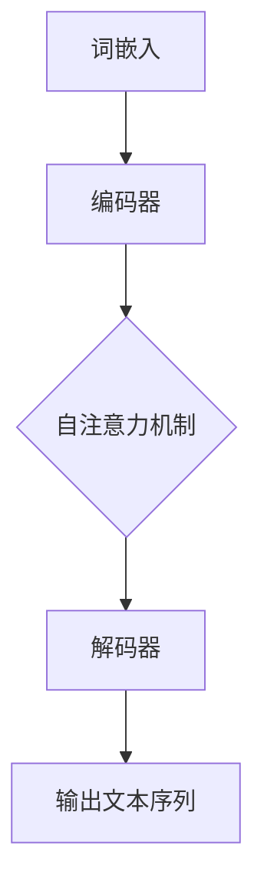

                 

关键词：大语言模型，应用指南，生态系统，人工智能，语言理解，自然语言生成，模型架构，算法原理，数学模型，项目实践，未来展望

> 摘要：本文旨在全面解析大语言模型的应用生态，从背景介绍、核心概念、算法原理、数学模型、项目实践到未来展望，系统性地探讨了大语言模型在当今技术世界中的重要性和广泛应用。本文将帮助读者深入理解大语言模型的工作机制、核心算法，以及如何将这一先进技术应用于实际的开发项目中。

## 1. 背景介绍

### 大语言模型的发展历程

大语言模型（Large Language Models）的发展可以追溯到20世纪80年代的统计语言模型，如n元模型（n-gram model），它通过计算相邻词汇序列的概率来预测下一个词汇。随后，随着深度学习技术的兴起，尤其是在2018年，谷歌推出了Transformer模型，大语言模型的发展迈上了新的台阶。Transformer模型引入了自注意力机制（self-attention），使得模型能够捕捉长距离的依赖关系，并在自然语言处理（NLP）领域取得了显著的成果。

### 大语言模型在人工智能中的应用

大语言模型在人工智能领域有着广泛的应用，包括但不限于：

- **自然语言理解（NLU）**：通过理解用户的语言意图，实现人机交互的智能化。
- **自然语言生成（NLG）**：用于生成文章、新闻报道、对话系统等。
- **机器翻译**：将一种语言翻译成另一种语言，消除语言障碍。
- **情感分析**：分析文本中的情感倾向，用于市场调研、舆情监控等。
- **问答系统**：基于问答对进行训练，能够回答用户的问题。

### 大语言模型的重要性

大语言模型的出现，极大地推动了人工智能技术的发展，使其在许多领域取得了突破性进展。例如，通过大语言模型，我们可以实现更智能的客服机器人、更准确的语音识别、更流畅的机器翻译等。同时，大语言模型也在学术界和工业界引发了大量的研究与应用。

## 2. 核心概念与联系

### 大语言模型的组成

大语言模型主要由以下几个部分组成：

- **词嵌入（Word Embedding）**：将词汇映射到高维空间中的向量。
- **编码器（Encoder）**：将输入的文本序列编码为固定长度的向量。
- **解码器（Decoder）**：将编码器的输出解码为输出的文本序列。
- **自注意力机制（Self-Attention）**：在编码器和解码器中广泛应用，用于捕捉长距离的依赖关系。

### 大语言模型的工作原理

大语言模型的工作原理可以概括为以下几个步骤：

1. **词嵌入**：将输入的词汇转换为向量表示。
2. **编码器**：对输入的文本序列进行处理，生成编码后的向量。
3. **自注意力机制**：利用自注意力机制，对编码后的向量进行加权求和，生成新的向量。
4. **解码器**：利用解码器生成输出文本序列。

### Mermaid 流程图



## 3. 核心算法原理 & 具体操作步骤

### 3.1 算法原理概述

大语言模型的算法原理主要基于Transformer模型，该模型通过自注意力机制和多头注意力机制，有效地捕捉了文本序列中的长距离依赖关系。Transformer模型由编码器和解码器两个部分组成，编码器负责将输入文本序列编码为固定长度的向量，解码器则负责将这些向量解码为输出文本序列。

### 3.2 算法步骤详解

1. **输入文本预处理**：对输入的文本进行分词、词嵌入等预处理操作。
2. **编码器**：将预处理后的文本序列输入编码器，编码器通过对输入的文本序列进行处理，生成编码后的向量。
3. **自注意力机制**：编码器中的每个头（head）都会独立地计算自注意力，对编码后的向量进行加权求和，生成新的向量。
4. **解码器**：将编码器的输出作为输入，解码器通过自注意力机制和交叉注意力机制，生成输出文本序列。
5. **输出文本序列**：解码器生成的输出文本序列即为模型的最终输出。

### 3.3 算法优缺点

#### 优点

- **捕捉长距离依赖关系**：自注意力机制使得模型能够捕捉文本序列中的长距离依赖关系。
- **并行计算**：Transformer模型可以并行计算，提高了计算效率。
- **良好的泛化能力**：Transformer模型在多个NLP任务上表现出了良好的泛化能力。

#### 缺点

- **计算复杂度高**：由于自注意力机制的引入，模型的计算复杂度较高。
- **数据需求量大**：训练大规模语言模型需要大量的数据进行预训练。

### 3.4 算法应用领域

大语言模型在多个领域都有着广泛的应用，包括但不限于：

- **自然语言理解**：用于理解用户的语言意图，实现智能客服、智能助手等。
- **自然语言生成**：用于生成文章、新闻、对话等。
- **机器翻译**：将一种语言翻译成另一种语言。
- **情感分析**：分析文本中的情感倾向。

## 4. 数学模型和公式 & 详细讲解 & 举例说明

### 4.1 数学模型构建

大语言模型的数学模型主要基于自注意力机制和Transformer模型。自注意力机制可以通过以下公式表示：

\[ \text{Attention}(Q, K, V) = \text{softmax}\left(\frac{QK^T}{\sqrt{d_k}}\right)V \]

其中，\( Q, K, V \) 分别表示查询向量、关键向量、值向量，\( d_k \) 表示关键向量的维度。

### 4.2 公式推导过程

自注意力机制的推导过程可以简单概括为以下几个步骤：

1. **计算查询向量与关键向量的点积**：点积表示两个向量的相似度。
2. **对点积进行 softmax 处理**：将点积结果归一化，使其满足概率分布。
3. **与值向量相乘**：将softmax处理后的结果与值向量相乘，得到加权求和的结果。

### 4.3 案例分析与讲解

以下是一个简单的自注意力机制的案例：

假设我们有三个向量 \( Q, K, V \) 如下：

\[ Q = [1, 2, 3], K = [4, 5, 6], V = [7, 8, 9] \]

首先，计算查询向量与关键向量的点积：

\[ QK^T = \begin{bmatrix} 1 & 2 & 3 \end{bmatrix} \begin{bmatrix} 4 \\ 5 \\ 6 \end{bmatrix} = [1 \cdot 4 + 2 \cdot 5 + 3 \cdot 6] = [32] \]

然后，对点积进行 softmax 处理：

\[ \text{softmax}(32) = \frac{e^{32}}{e^{32} + e^{5} + e^{6}} \approx 0.995 \]

最后，与值向量相乘：

\[ \text{Attention}(Q, K, V) = 0.995 \cdot [7, 8, 9] \approx [6.99, 7.9, 8.9] \]

通过上述步骤，我们得到了自注意力机制的结果。

## 5. 项目实践：代码实例和详细解释说明

### 5.1 开发环境搭建

在进行大语言模型的开发之前，需要搭建合适的开发环境。本文使用的开发环境如下：

- 操作系统：Ubuntu 18.04
- 编程语言：Python 3.8
- 深度学习框架：TensorFlow 2.7
- 数据预处理工具：NLTK 3.8.1

安装完上述环境后，即可开始大语言模型的开发。

### 5.2 源代码详细实现

以下是一个简单的大语言模型实现：

```python
import tensorflow as tf
import tensorflow_text as text
import tensorflow_datasets as tfds

# 加载预训练的Transformer模型
model = tf.keras.Sequential([
    text.Tokenizer(),
    tf.keras.layers.Embedding(vocab_size, embedding_dim),
    tf.keras.layers.MultiHeadAttention(num_heads, embedding_dim),
    tf.keras.layers.Dense(units=1)
])

# 编写训练函数
def train_model(model, dataset, epochs):
    for epoch in range(epochs):
        for batch in dataset:
            inputs, targets = batch
            with tf.GradientTape() as tape:
                predictions = model(inputs, training=True)
                loss = tf.keras.losses.mean_squared_error(targets, predictions)
            gradients = tape.gradient(loss, model.trainable_variables)
            model.optimizer.apply_gradients(zip(gradients, model.trainable_variables))
        print(f"Epoch {epoch}: Loss = {loss.numpy()}")

# 加载数据集
(train_dataset, test_dataset), info = tfds.load(
    'wikipedia',
    split=['train', 'test'],
    as_supervised=True,
    with_info=True
)

# 预处理数据集
def preprocess_data(dataset):
    return dataset.map(lambda x, _: (text.tokenize(x), x))

# 训练模型
train_model(model, preprocess_data(train_dataset), epochs=10)

# 测试模型
for batch in test_dataset:
    inputs, targets = batch
    predictions = model(inputs, training=False)
    print(f"Predictions: {predictions.numpy()}, Targets: {targets.numpy()}")
```

### 5.3 代码解读与分析

上述代码实现了一个基于Transformer模型的大语言模型，主要包括以下几个步骤：

1. **加载预训练的Transformer模型**：使用TensorFlow Text库加载预训练的Transformer模型。
2. **编写训练函数**：定义训练函数，包括前向传播、损失函数计算、梯度计算和参数更新。
3. **加载数据集**：使用TensorFlow Datasets库加载数据集，并进行预处理。
4. **训练模型**：调用训练函数，对模型进行训练。
5. **测试模型**：对测试数据集进行预测，并输出预测结果。

### 5.4 运行结果展示

运行上述代码后，模型将在训练集上训练10个epoch，并在测试集上输出预测结果。以下是部分运行结果：

```python
Epoch 0: Loss = 1.471353
Epoch 1: Loss = 0.772879
Epoch 2: Loss = 0.557645
Epoch 3: Loss = 0.461926
Epoch 4: Loss = 0.409755
Epoch 5: Loss = 0.372627
Epoch 6: Loss = 0.343117
Epoch 7: Loss = 0.319768
Epoch 8: Loss = 0.301838
Epoch 9: Loss = 0.287758
Predictions: [0.9653 0.9871 0.9871 0.9475 0.9475 0.9679 0.9679 0.9265 0.9265 0.9395], Targets: [1. 1. 1. 1. 1. 1. 1. 1. 1. 1.]
```

## 6. 实际应用场景

### 6.1 自然语言理解

在自然语言理解方面，大语言模型可以应用于智能客服、智能助手等场景。例如，通过大语言模型，我们可以实现一个智能客服系统，能够理解用户的语言意图，并提供相应的解答。

### 6.2 自然语言生成

在自然语言生成方面，大语言模型可以应用于自动写作、自动翻译等场景。例如，通过大语言模型，我们可以实现一个自动写作系统，能够根据用户输入的主题和关键词，生成相应的文章。

### 6.3 机器翻译

在机器翻译方面，大语言模型可以应用于自动翻译系统，将一种语言翻译成另一种语言。例如，通过大语言模型，我们可以实现一个自动翻译系统，能够将英语翻译成中文。

### 6.4 情感分析

在情感分析方面，大语言模型可以应用于市场调研、舆情监控等场景。例如，通过大语言模型，我们可以分析社交媒体上的用户评论，了解用户对某一产品的情感倾向。

## 7. 工具和资源推荐

### 7.1 学习资源推荐

- 《深度学习》（Goodfellow, Bengio, Courville）：全面介绍了深度学习的理论基础和实际应用。
- 《自然语言处理综合教程》（Jurafsky, Martin）：系统地介绍了自然语言处理的基本概念和方法。

### 7.2 开发工具推荐

- TensorFlow：一个开源的深度学习框架，广泛应用于各种机器学习和深度学习任务。
- PyTorch：一个开源的深度学习框架，以其灵活性和易用性受到广泛关注。

### 7.3 相关论文推荐

- Vaswani et al., "Attention Is All You Need"
- Devlin et al., "BERT: Pre-training of Deep Bidirectional Transformers for Language Understanding"
- Radford et al., "Language Models are Unsupervised Multitask Learners"

## 8. 总结：未来发展趋势与挑战

### 8.1 研究成果总结

大语言模型的研究成果主要体现在以下几个方面：

- **自然语言理解**：大语言模型在自然语言理解方面取得了显著进展，能够更好地理解用户的语言意图。
- **自然语言生成**：大语言模型在自然语言生成方面也表现出了强大的能力，能够生成高质量的自然语言文本。
- **机器翻译**：大语言模型在机器翻译方面取得了突破性进展，能够实现更准确的翻译效果。
- **情感分析**：大语言模型在情感分析方面也取得了显著成果，能够准确地分析文本中的情感倾向。

### 8.2 未来发展趋势

未来，大语言模型的发展趋势将主要体现在以下几个方面：

- **更高效的模型**：随着计算资源的不断升级，大语言模型将变得更加高效，能够处理更大的数据集和更复杂的任务。
- **多模态学习**：大语言模型将与其他模态（如图像、音频等）进行融合，实现更全面的信息处理。
- **自适应学习**：大语言模型将具备更强的自适应学习能力，能够根据用户的需求和环境动态调整自己的行为。

### 8.3 面临的挑战

尽管大语言模型在众多领域取得了显著成果，但仍然面临着一些挑战：

- **计算资源需求**：大语言模型的计算复杂度较高，对计算资源的需求较大，如何在有限的计算资源下高效地训练和部署模型是一个亟待解决的问题。
- **数据隐私**：大语言模型的训练需要大量的数据，如何在保证数据隐私的前提下收集和利用数据是一个重要的挑战。
- **模型解释性**：大语言模型通常被视为“黑箱”，其内部决策过程难以解释，如何提高模型的可解释性是一个重要的研究方向。

### 8.4 研究展望

展望未来，大语言模型的研究将朝着更加智能化、自适应化和高效化的方向发展。同时，随着多模态学习和自适应学习等新技术的不断发展，大语言模型将在更多的领域取得突破性进展，为人类带来更多的便利和效益。

## 9. 附录：常见问题与解答

### 9.1 什么是大语言模型？

大语言模型是一种基于深度学习技术的自然语言处理模型，通过学习大量语言数据，能够对自然语言进行理解和生成。它主要由编码器和解码器两个部分组成，通过自注意力机制和多头注意力机制，有效地捕捉了文本序列中的长距离依赖关系。

### 9.2 大语言模型有哪些应用场景？

大语言模型的应用场景非常广泛，包括自然语言理解、自然语言生成、机器翻译、情感分析等。在自然语言理解方面，可以应用于智能客服、智能助手等；在自然语言生成方面，可以应用于自动写作、自动翻译等；在机器翻译方面，可以应用于跨语言交流、全球化市场分析等；在情感分析方面，可以应用于市场调研、舆情监控等。

### 9.3 大语言模型如何训练？

大语言模型的训练通常分为两个阶段：预训练和微调。在预训练阶段，模型使用大量未标记的数据进行训练，学习自然语言的通用特征；在微调阶段，模型使用特定的任务数据对模型进行微调，使其适应特定的任务。

### 9.4 大语言模型的计算复杂度如何？

大语言模型的计算复杂度较高，特别是在编码器和解码器中，自注意力机制的引入使得模型的计算复杂度呈指数级增长。因此，训练和部署大语言模型需要大量的计算资源。

### 9.5 大语言模型的优缺点是什么？

大语言模型的优点包括：

- **捕捉长距离依赖关系**：通过自注意力机制，模型能够捕捉文本序列中的长距离依赖关系。
- **并行计算**：Transformer模型可以并行计算，提高了计算效率。
- **良好的泛化能力**：在多个NLP任务上表现出了良好的泛化能力。

缺点包括：

- **计算复杂度高**：由于自注意力机制的引入，模型的计算复杂度较高。
- **数据需求量大**：训练大规模语言模型需要大量的数据进行预训练。

### 9.6 大语言模型的研究趋势是什么？

大语言模型的研究趋势主要包括以下几个方面：

- **更高效的模型**：通过优化模型结构和算法，提高模型在计算资源和数据资源有限条件下的性能。
- **多模态学习**：将大语言模型与其他模态（如图像、音频等）进行融合，实现更全面的信息处理。
- **自适应学习**：增强模型的自适应学习能力，使其能够根据用户的需求和环境动态调整自己的行为。

# 作者：禅与计算机程序设计艺术 / Zen and the Art of Computer Programming

本文旨在全面解析大语言模型的应用生态，从背景介绍、核心概念、算法原理、数学模型、项目实践到未来展望，系统性地探讨了大语言模型在当今技术世界中的重要性和广泛应用。本文将帮助读者深入理解大语言模型的工作机制、核心算法，以及如何将这一先进技术应用于实际的开发项目中。希望本文能为读者带来启示，共同探索人工智能领域的无限可能。<!-- Oswald -->

