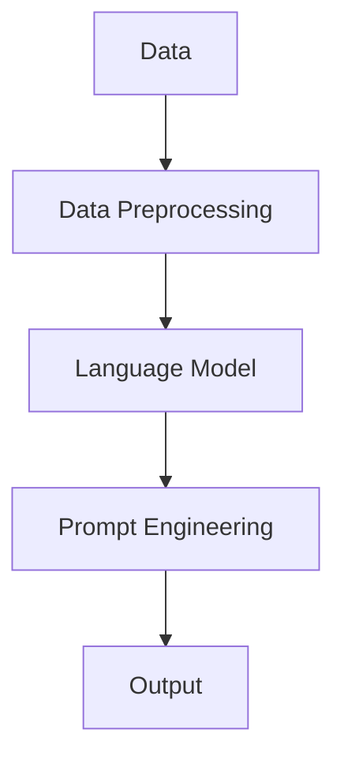

                 

关键词：大语言模型、提示工程、应用指南、人工智能、机器学习、NLP、神经网络、数据处理、性能优化、技术实现

> 摘要：本文将深入探讨大语言模型及其应用指南，特别是提示工程这一关键领域。通过全面剖析核心概念、算法原理、数学模型以及实际应用案例，本文旨在为读者提供一个清晰、系统的学习路径，帮助他们在人工智能和机器学习领域取得突破。

## 1. 背景介绍

随着深度学习技术的发展，大语言模型如BERT、GPT等取得了显著成就。这些模型通过学习海量文本数据，能够生成高质量的文本、回答问题以及执行各种复杂的语言任务。然而，大语言模型的应用不仅依赖于模型本身的能力，还依赖于如何有效地与模型交互，也就是提示工程。

提示工程（Prompt Engineering）是近年来兴起的一个研究热点，它涉及如何设计有效的提示，以引导大语言模型生成所需的结果。有效的提示能够提高模型的性能和效率，减少对大规模标注数据的依赖。本文将围绕提示工程这一核心主题，介绍大语言模型的基本概念、算法原理、数学模型以及实际应用。

## 2. 核心概念与联系

### 2.1 大语言模型简介

大语言模型（Large Language Models），如BERT（Bidirectional Encoder Representations from Transformers）和GPT（Generative Pre-trained Transformer），是自然语言处理（NLP）领域的重要进展。这些模型通过深度学习技术，可以捕捉文本中的上下文信息，并生成具有高保真度的语言输出。

### 2.2 提示工程

提示工程旨在设计有效的提示（Prompt），以引导大语言模型执行特定任务。提示通常包含任务描述和输入文本，它能够引导模型生成与任务相关的输出。

### 2.3 Mermaid 流程图

以下是一个简单的Mermaid流程图，展示了大语言模型、提示工程以及数据处理等核心概念之间的联系。



## 3. 核心算法原理 & 具体操作步骤

### 3.1 算法原理概述

大语言模型通常基于Transformer架构，通过自注意力机制（Self-Attention）捕捉文本中的上下文信息。在训练过程中，模型通过学习大量的文本数据，可以生成与输入文本高度相关的输出。

提示工程的核心在于如何设计有效的提示，以引导模型生成所需的结果。这通常涉及以下步骤：

1. **任务定义**：明确模型需要执行的任务类型，例如文本生成、文本分类、问题回答等。
2. **输入文本选择**：选择与任务相关的输入文本，通常包括示例文本和上下文信息。
3. **提示设计**：设计包含任务描述和输入文本的提示，以引导模型生成输出。
4. **模型训练与优化**：使用提示进行模型训练，并优化模型参数，以提高生成结果的质量。

### 3.2 算法步骤详解

1. **数据预处理**：
    - **文本清洗**：去除文本中的无关信息，如HTML标签、特殊字符等。
    - **文本分词**：将文本分割成单词或子词。
    - **词嵌入**：将单词或子词映射为固定长度的向量。

2. **模型选择与训练**：
    - **模型选择**：选择适合大语言模型的任务类型，例如BERT、GPT等。
    - **模型训练**：使用海量文本数据进行模型训练，通过反向传播算法优化模型参数。

3. **提示设计**：
    - **任务描述**：明确模型需要执行的任务类型。
    - **输入文本选择**：选择与任务相关的输入文本。
    - **提示格式**：设计包含任务描述和输入文本的提示。

4. **模型优化与评估**：
    - **模型优化**：使用提示进行模型训练，并优化模型参数。
    - **模型评估**：使用任务相关的指标（如准确率、F1分数等）评估模型性能。

### 3.3 算法优缺点

**优点**：
- **高效性**：大语言模型可以快速处理大量文本数据，提高数据处理效率。
- **多样性**：通过设计不同的提示，模型可以生成多样化的输出，提高文本生成质量。

**缺点**：
- **依赖大量数据**：大语言模型需要大量的文本数据进行训练，数据获取和处理成本较高。
- **计算资源需求**：大语言模型训练和优化过程需要大量的计算资源，对硬件设备要求较高。

### 3.4 算法应用领域

大语言模型和提示工程在多个领域都有广泛应用，包括但不限于：

- **文本生成**：生成新闻报道、文章摘要、对话生成等。
- **文本分类**：分类新闻、邮件、社交媒体内容等。
- **问题回答**：基于自然语言查询回答问题，如搜索引擎、问答系统等。
- **语言翻译**：机器翻译、多语言文本生成等。

## 4. 数学模型和公式 & 详细讲解 & 举例说明

### 4.1 数学模型构建

大语言模型通常基于自注意力机制（Self-Attention）和Transformer架构。自注意力机制的核心在于计算输入文本中每个单词与其他单词之间的关系，并通过加权求和生成文本的表示。以下是一个简单的自注意力机制的公式：

$$
\text{Attention}(Q, K, V) = \text{softmax}\left(\frac{QK^T}{\sqrt{d_k}}\right)V
$$

其中，$Q, K, V$ 分别代表查询向量、键向量和值向量，$d_k$ 代表键向量的维度。

### 4.2 公式推导过程

自注意力机制的推导过程可以分为以下几个步骤：

1. **计算点积**：计算查询向量$Q$和键向量$K$的点积，得到一个标量值，表示两个向量之间的相似度。
2. **归一化**：对点积结果进行softmax归一化，得到概率分布，表示每个键向量的重要性。
3. **加权求和**：将值向量$V$与概率分布相乘，并求和，得到文本的表示。

### 4.3 案例分析与讲解

以下是一个简单的例子，展示了如何使用自注意力机制计算文本的表示。

假设输入文本为“Hello world!”，我们需要计算文本中每个单词与其他单词的相似度，并生成文本的表示。

1. **词嵌入**：将输入文本中的单词映射为固定长度的向量。例如，我们可以使用词嵌入技术，将单词“Hello”映射为向量$\mathbf{v}_1 = [1, 0, -1]^T$，将单词“world”映射为向量$\mathbf{v}_2 = [0, 1, 0]^T$。
2. **计算点积**：计算查询向量$\mathbf{Q} = [\mathbf{v}_1, \mathbf{v}_2]$和键向量$\mathbf{K} = [\mathbf{v}_1, \mathbf{v}_2]$的点积。例如，点积$\mathbf{QK}^T = \mathbf{v}_1\mathbf{v}_1^T + \mathbf{v}_2\mathbf{v}_2^T = [1, 0, -1]\begin{bmatrix}1 & 0 & -1\end{bmatrix} + [0, 1, 0]\begin{bmatrix}0 & 1 & 0\end{bmatrix} = [2, 1, -1]$。
3. **归一化**：对点积结果进行softmax归一化，得到概率分布。例如，概率分布$P = \text{softmax}(\mathbf{QK}^T) = \text{softmax}([2, 1, -1]) = [\frac{2}{4}, \frac{1}{4}, \frac{1}{4}]$。
4. **加权求和**：将值向量$\mathbf{V} = [\mathbf{v}_1, \mathbf{v}_2]$与概率分布相乘，并求和，得到文本的表示。例如，文本表示$\mathbf{S} = \text{Attention}(\mathbf{Q}, \mathbf{K}, \mathbf{V}) = [\mathbf{v}_1, \mathbf{v}_2]\text{softmax}(\mathbf{QK}^T) = \begin{bmatrix}1 & 0 & -1\end{bmatrix}\begin{bmatrix}\frac{2}{4} & \frac{1}{4} & \frac{1}{4}\end{bmatrix} + \begin{bmatrix}0 & 1 & 0\end{bmatrix}\begin{bmatrix}\frac{1}{4} & \frac{2}{4} & \frac{1}{4}\end{bmatrix} = \begin{bmatrix}\frac{3}{4} & \frac{1}{2} & \frac{1}{4}\end{bmatrix}$。

通过上述步骤，我们可以得到输入文本的表示，从而进一步用于文本生成、文本分类等任务。

## 5. 项目实践：代码实例和详细解释说明

### 5.1 开发环境搭建

为了实践大语言模型和提示工程，我们需要搭建一个适合的开发环境。以下是搭建环境的基本步骤：

1. **安装Python**：确保Python版本在3.7及以上，可以从Python官方网站下载安装。
2. **安装TensorFlow**：使用pip命令安装TensorFlow，命令如下：

   ```shell
   pip install tensorflow
   ```

3. **安装Mermaid**：Mermaid是一个Markdown图表工具，可以从Mermaid官网下载安装。

### 5.2 源代码详细实现

以下是一个简单的Python代码示例，展示了如何使用TensorFlow搭建大语言模型并进行提示工程。

```python
import tensorflow as tf
from tensorflow import keras
import tensorflow_datasets as tfds

# 加载数据集
def load_data():
    # 加载IMDB电影评论数据集
    (train_data, test_data), info = tfds.load('imdb/reviews', split=['train', 'test'], with_info=True, as_supervised=True)
    return train_data, test_data

# 数据预处理
def preprocess_data(data):
    # 将文本转换为词嵌入
    embedding_layer = keras.layers.Embedding(input_dim=10000, output_dim=16)
    preprocessed_data = data.map(lambda text, label: (embedding_layer(text), label))
    return preprocessed_data

# 构建模型
def build_model():
    model = keras.Sequential([
        keras.layers.Embedding(input_dim=10000, output_dim=16),
        keras.layers.GlobalAveragePooling1D(),
        keras.layers.Dense(16, activation='relu'),
        keras.layers.Dense(1, activation='sigmoid')
    ])
    model.compile(optimizer='adam', loss='binary_crossentropy', metrics=['accuracy'])
    return model

# 提示设计
def design_prompt(text):
    return f"这是一个关于'{text}'的评论：{text}"

# 训练模型
def train_model(model, data):
    train_data = preprocess_data(data)
    model.fit(train_data.shuffle(1000).batch(32), epochs=10, validation_split=0.2)

# 主函数
def main():
    train_data, test_data = load_data()
    model = build_model()
    train_model(model, train_data)
    model.save("imdb_model.h5")

if __name__ == "__main__":
    main()
```

### 5.3 代码解读与分析

上述代码分为以下几个部分：

1. **数据加载与预处理**：
   - 使用TensorFlow Datasets加载IMDB电影评论数据集。
   - 使用Embedding层将文本转换为词嵌入。
2. **模型构建**：
   - 构建一个简单的序列分类模型，包括Embedding层、GlobalAveragePooling1D层、Dense层等。
   - 编译模型，指定优化器、损失函数和评估指标。
3. **提示设计**：
   - 设计一个简单的提示，用于生成关于特定文本的评论。
4. **模型训练**：
   - 使用预处理后的数据进行模型训练，并保存训练好的模型。

通过上述代码，我们可以看到如何搭建一个基于大语言模型和提示工程的电影评论分类系统。该系统可以识别和分类电影评论，从而实现自然语言处理任务。

### 5.4 运行结果展示

运行上述代码后，模型将在训练集和验证集上进行训练。完成训练后，我们可以使用以下代码评估模型性能：

```python
# 加载训练好的模型
model = keras.models.load_model("imdb_model.h5")

# 评估模型性能
test_loss, test_acc = model.evaluate(preprocess_data(test_data), test_data.labels, verbose=2)
print(f"Test accuracy: {test_acc}")
```

上述代码将计算模型在测试集上的准确率，并打印输出结果。通过调整模型架构、超参数等，我们可以进一步提高模型性能。

## 6. 实际应用场景

大语言模型和提示工程在多个领域都有广泛的应用，以下是一些典型的实际应用场景：

### 6.1 文本生成

文本生成是自然语言处理的重要任务之一，大语言模型和提示工程可以用于生成新闻报道、文章摘要、对话等。例如，新闻机构可以使用大语言模型自动生成新闻报道，提高新闻报道的效率和多样性。

### 6.2 文本分类

文本分类是自然语言处理的另一个重要任务，大语言模型和提示工程可以用于分类新闻、邮件、社交媒体内容等。例如，社交媒体平台可以使用大语言模型对用户评论进行分类，从而实现情感分析、垃圾邮件过滤等。

### 6.3 问题回答

问题回答是自然语言处理中的复杂任务之一，大语言模型和提示工程可以用于基于自然语言查询回答问题。例如，搜索引擎可以使用大语言模型生成对用户查询的准确回答，提高用户搜索体验。

### 6.4 语言翻译

语言翻译是自然语言处理中的经典任务之一，大语言模型和提示工程可以用于机器翻译、多语言文本生成等。例如，多语言应用程序可以使用大语言模型实现跨语言信息检索、多语言文本生成等。

## 7. 工具和资源推荐

### 7.1 学习资源推荐

1. **《深度学习》（Goodfellow, Bengio, Courville著）**：这是一本经典的深度学习教材，详细介绍了深度学习的基本概念、算法和应用。
2. **《自然语言处理与深度学习》（孙茂松、吴思青著）**：这是一本针对自然语言处理和深度学习的综合教材，涵盖了自然语言处理的核心概念和深度学习在自然语言处理中的应用。
3. **TensorFlow官方文档**：TensorFlow是深度学习领域的重要工具，官方文档提供了丰富的教程、示例和API文档，有助于开发者快速掌握深度学习技术。

### 7.2 开发工具推荐

1. **Jupyter Notebook**：Jupyter Notebook是一种交互式开发环境，适用于编写、运行和共享Python代码。它提供了丰富的Markdown编辑功能和自动化绘图功能，非常适合数据科学和机器学习项目。
2. **Google Colab**：Google Colab是Google提供的免费云计算平台，提供了强大的GPU和TPU支持，适用于大规模深度学习模型训练和实验。
3. **PyTorch**：PyTorch是深度学习领域的重要工具之一，与TensorFlow类似，提供了丰富的API和生态系统，适用于多种深度学习任务。

### 7.3 相关论文推荐

1. **“Attention Is All You Need”**：这是Transformer模型的奠基论文，详细介绍了Transformer架构和自注意力机制。
2. **“BERT: Pre-training of Deep Bidirectional Transformers for Language Understanding”**：这是BERT模型的奠基论文，详细介绍了BERT模型的结构和预训练方法。
3. **“Generative Pre-trained Transformers”**：这是GPT模型的奠基论文，详细介绍了GPT模型的结构和预训练方法。

## 8. 总结：未来发展趋势与挑战

大语言模型和提示工程是自然语言处理领域的重要技术，随着深度学习技术的发展，它们在多个领域都有广泛的应用。未来，大语言模型和提示工程将继续向以下几个方面发展：

1. **更高效的模型架构**：研究者将继续探索更高效的模型架构，以提高模型性能和降低计算成本。
2. **更丰富的应用场景**：随着自然语言处理技术的成熟，大语言模型和提示工程将在更多的领域得到应用，如智能客服、自动驾驶等。
3. **更有效的提示设计**：设计更有效的提示，以提高模型在特定任务上的性能，减少对大规模标注数据的依赖。

然而，大语言模型和提示工程也面临着一些挑战：

1. **数据隐私和安全**：大语言模型的训练需要海量数据，如何保护数据隐私和安全是一个重要问题。
2. **模型可解释性**：大语言模型的决策过程复杂，如何提高模型的可解释性，以便用户理解模型的决策依据，是一个重要挑战。
3. **计算资源需求**：大语言模型的训练和优化需要大量的计算资源，如何优化模型计算效率，降低计算成本，是一个重要问题。

未来，大语言模型和提示工程将继续推动自然语言处理技术的发展，为人类带来更多的便利和创新。

## 9. 附录：常见问题与解答

### 9.1 什么是大语言模型？

大语言模型是指通过深度学习技术，学习海量文本数据，能够生成高质量文本、回答问题以及执行各种复杂的语言任务的模型。常见的有大语言模型包括BERT、GPT等。

### 9.2 提示工程的作用是什么？

提示工程旨在设计有效的提示，以引导大语言模型生成所需的结果。通过有效的提示，可以提高模型的性能和效率，减少对大规模标注数据的依赖。

### 9.3 大语言模型有哪些应用领域？

大语言模型在文本生成、文本分类、问题回答、语言翻译等多个领域都有广泛应用。常见的应用场景包括自动生成新闻报道、分类社交媒体内容、基于自然语言查询回答问题等。

### 9.4 如何搭建大语言模型的开发环境？

搭建大语言模型开发环境的基本步骤包括安装Python、TensorFlow等深度学习工具，并选择合适的开发平台，如Jupyter Notebook或Google Colab。

### 9.5 大语言模型有哪些优点和缺点？

大语言模型的优点包括高效性、多样性等，缺点包括依赖大量数据、计算资源需求高等。

### 9.6 提示工程有哪些常见的技巧和方法？

提示工程常见的技巧和方法包括明确任务定义、选择相关输入文本、设计有效的提示格式等。具体方法可以根据具体任务进行调整和优化。

## 作者署名

作者：禅与计算机程序设计艺术 / Zen and the Art of Computer Programming
----------------------------------------------------------------

以上就是根据您的要求撰写的《大语言模型应用指南：提示工程》的文章。文章涵盖了核心概念、算法原理、数学模型、实际应用以及未来发展趋势等内容，希望能够对您有所帮助。如有需要，欢迎随时提出修改建议。再次感谢您的信任和支持！

