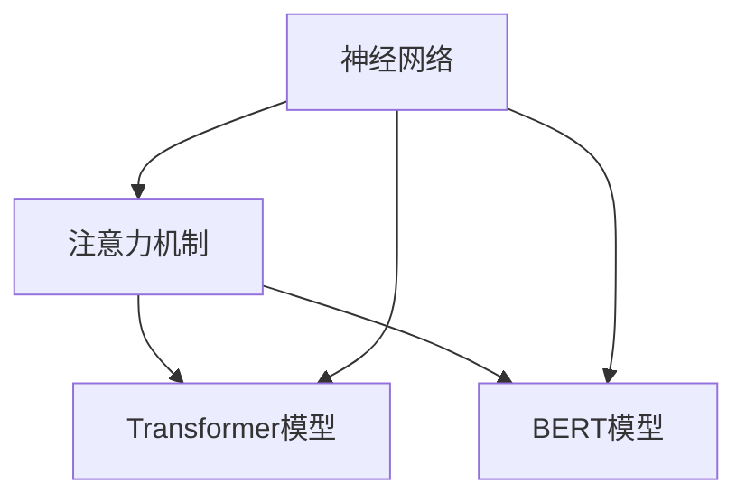

                 

关键词：大语言模型，运行，架构，算法，应用，数学模型，代码实例，实践，展望

摘要：本文将深入探讨大语言模型在运行阶段的核心技术和实践应用。我们将从背景介绍、核心概念与联系、核心算法原理与步骤、数学模型与公式、项目实践、实际应用场景、工具和资源推荐以及未来发展趋势与挑战等多个角度，全面解析大语言模型在运行阶段的各个方面。通过本文的阅读，读者将能够深入了解大语言模型的应用原理和实践方法，为未来的研究和开发工作提供有力的支持。

## 1. 背景介绍

随着人工智能技术的飞速发展，自然语言处理（Natural Language Processing, NLP）成为了一个备受瞩目的领域。大语言模型（Large Language Model）作为NLP技术的核心组成部分，在文本生成、文本分类、机器翻译、问答系统等众多应用场景中发挥着重要作用。大语言模型的运行效率、准确性和稳定性直接影响到应用的效果和用户体验。

### 1.1 大语言模型的发展历程

大语言模型的发展经历了从简单的统计模型到深度学习模型的演变。早期的大语言模型主要基于规则和统计方法，如概率模型、隐马尔可夫模型（HMM）和统计语言模型（如n元语法）。这些模型在语言建模方面取得了一定的成功，但存在许多局限性，例如对长文本的处理能力较弱、对上下文依赖性不强等。

随着深度学习技术的兴起，大语言模型逐渐转向使用深度神经网络。2000年代初，循环神经网络（RNN）的出现为语言建模带来了新的可能性。RNN能够通过递归结构捕捉长距离的上下文依赖关系，但在处理长文本时仍然存在梯度消失和梯度爆炸等问题。

为了克服这些挑战，研究人员提出了长短期记忆网络（LSTM）和门控循环单元（GRU）等改进模型。这些模型通过引入门控机制，有效地解决了梯度消失和梯度爆炸问题，并在许多NLP任务中取得了显著的性能提升。

近年来，随着计算能力和数据规模的提升，更大规模的大语言模型，如Transformer模型和BERT模型，逐渐成为研究的热点。这些模型通过引入自注意力机制，能够更加有效地捕捉上下文依赖关系，并在多种NLP任务中取得了SOTA（State-of-the-Art）性能。

### 1.2 大语言模型的应用领域

大语言模型在众多应用领域展现出了巨大的潜力。以下是其中一些主要的应用领域：

1. **文本生成**：大语言模型可以生成高质量的文章、故事、摘要等文本内容。这种能力在自动写作、内容生成和个性化推荐等方面有广泛的应用。

2. **文本分类**：大语言模型可以用于对大量文本数据进行分类，如情感分析、新闻分类、垃圾邮件过滤等。

3. **机器翻译**：大语言模型可以用于高质量的自然语言翻译，支持多种语言之间的互译。

4. **问答系统**：大语言模型可以用于构建智能问答系统，通过理解用户的问题并生成准确的回答。

5. **对话系统**：大语言模型可以用于构建自然语言交互的对话系统，如虚拟助手、聊天机器人等。

6. **文本摘要**：大语言模型可以生成文章的摘要，提供关键信息的同时减少冗长的内容。

7. **语音识别**：大语言模型可以与语音识别技术结合，实现语音到文本的转换。

### 1.3 大语言模型的发展趋势

随着人工智能技术的不断进步，大语言模型将继续朝着更高效、更智能、更实用的方向发展。以下是几个可能的发展趋势：

1. **模型规模扩大**：随着计算能力和数据资源的提升，更大规模的大语言模型将成为研究热点，模型规模将达到数十亿甚至千亿参数。

2. **多模态融合**：大语言模型将与其他模态（如图像、音频等）进行融合，实现更加丰富的信息处理能力。

3. **自适应能力提升**：大语言模型将具备更好的自适应能力，能够在不同应用场景和任务中实现自适应调整和优化。

4. **可解释性和可解释性**：大语言模型的可解释性和透明度将成为研究重点，以便更好地理解和解释模型的决策过程。

5. **开源和社区贡献**：随着开源社区的发展，大语言模型的模型架构、训练方法和应用实践将更加开放和共享。

## 2. 核心概念与联系

在深入探讨大语言模型的运行之前，我们需要了解几个核心概念，包括神经网络的架构、注意力机制、Transformer模型和BERT模型等。

### 2.1 神经网络架构

神经网络是构建大语言模型的基础。神经网络由多个层级组成，包括输入层、隐藏层和输出层。每个层级由多个神经元组成，神经元之间通过加权连接进行信息传递。在训练过程中，神经网络通过反向传播算法不断调整权重，以最小化预测误差。


### 2.2 注意力机制

注意力机制（Attention Mechanism）是一种在神经网络中增强模型上下文理解能力的方法。通过注意力机制，模型能够动态地关注输入序列中的关键部分，从而更好地捕捉上下文依赖关系。


### 2.3 Transformer模型

Transformer模型是一种基于自注意力机制的序列到序列模型，它在多个NLP任务中取得了显著的性能提升。Transformer模型通过多头注意力机制和多层叠加，能够捕捉长距离的上下文依赖关系，并在大规模训练数据集上取得了SOTA性能。


### 2.4 BERT模型

BERT（Bidirectional Encoder Representations from Transformers）模型是一种双向Transformer模型，它通过预训练大量未标记的文本数据，获得了强大的语言理解能力。BERT模型在多个NLP任务中取得了SOTA性能，并在实际应用中取得了良好的效果。


### 2.5 核心概念联系

上述核心概念共同构成了大语言模型的基础架构。神经网络为模型提供了计算能力，注意力机制增强了模型的上下文理解能力，而Transformer模型和BERT模型则通过自注意力机制和预训练方法，实现了对大规模文本数据的建模。

下面是一个简化的Mermaid流程图，展示了大语言模型的核心概念和联系：



## 3. 核心算法原理 & 具体操作步骤

### 3.1 算法原理概述

大语言模型的运行依赖于深度学习算法，主要包括以下步骤：

1. **数据预处理**：对输入文本进行分词、编码等处理，将文本转换为模型可处理的格式。

2. **模型训练**：使用大量文本数据对模型进行训练，通过反向传播算法不断调整模型参数，优化模型性能。

3. **模型评估**：使用验证集对训练好的模型进行评估，评估指标包括准确率、损失函数等。

4. **模型部署**：将训练好的模型部署到生产环境，实现实时预测和推断。

### 3.2 算法步骤详解

#### 3.2.1 数据预处理

数据预处理是模型训练的第一步。具体步骤如下：

1. **分词**：将输入文本按照词汇进行分词，将文本拆分为单词或字符。

2. **编码**：将分词后的文本转换为编码表示，常用的编码方法包括词向量编码、字符编码等。

3. **序列化**：将编码后的文本序列化成向量形式，以便于模型处理。

#### 3.2.2 模型训练

模型训练是构建大语言模型的核心步骤。具体步骤如下：

1. **初始化参数**：初始化模型参数，如权重、偏置等。

2. **正向传播**：将输入文本序列传递给模型，通过多层神经网络进行计算，生成预测结果。

3. **计算损失**：计算预测结果与真实标签之间的损失，常用的损失函数包括交叉熵损失、均方误差等。

4. **反向传播**：根据损失函数，通过反向传播算法更新模型参数。

5. **迭代优化**：重复正向传播和反向传播过程，不断调整模型参数，优化模型性能。

#### 3.2.3 模型评估

模型评估是验证模型性能的重要环节。具体步骤如下：

1. **验证集划分**：将训练数据集划分为训练集和验证集，用于模型训练和性能评估。

2. **模型预测**：使用训练好的模型对验证集进行预测，生成预测结果。

3. **计算评估指标**：计算预测结果与真实标签之间的评估指标，如准确率、召回率、F1值等。

4. **模型调整**：根据评估指标，调整模型参数，优化模型性能。

#### 3.2.4 模型部署

模型部署是将训练好的模型应用于实际场景的关键步骤。具体步骤如下：

1. **模型导出**：将训练好的模型导出为可部署的格式，如.onnx、.pth等。

2. **部署环境**：搭建部署环境，包括服务器、框架、库等。

3. **模型加载**：将导出的模型加载到部署环境中，实现实时预测和推断。

4. **性能优化**：根据实际应用场景，对模型进行性能优化，如剪枝、量化等。

### 3.3 算法优缺点

#### 优点

1. **强大的表达能力**：大语言模型通过深度神经网络和注意力机制，能够捕捉长距离的上下文依赖关系，具有强大的表达能力。

2. **高准确性**：大语言模型在多种NLP任务中取得了SOTA性能，具有较高的准确性。

3. **多任务处理**：大语言模型可以用于多种NLP任务，如文本生成、文本分类、机器翻译等，具有广泛的应用场景。

#### 缺点

1. **计算资源需求大**：大语言模型通常需要大量的计算资源和数据，对硬件和存储要求较高。

2. **训练时间较长**：大语言模型的训练时间较长，需要大量时间和计算资源。

3. **数据依赖性强**：大语言模型的性能高度依赖于训练数据的质量和数量，对数据质量有较高要求。

### 3.4 算法应用领域

大语言模型在以下领域具有广泛的应用：

1. **文本生成**：用于生成文章、故事、摘要等文本内容，支持个性化推荐和内容生成。

2. **文本分类**：用于对大量文本数据进行分类，如新闻分类、情感分析等。

3. **机器翻译**：用于实现高质量的自然语言翻译，支持多种语言之间的互译。

4. **问答系统**：用于构建智能问答系统，通过理解用户的问题并生成准确的回答。

5. **对话系统**：用于构建自然语言交互的对话系统，如虚拟助手、聊天机器人等。

6. **文本摘要**：用于生成文章的摘要，提供关键信息的同时减少冗长的内容。

7. **语音识别**：与语音识别技术结合，实现语音到文本的转换。

## 4. 数学模型和公式 & 详细讲解 & 举例说明

### 4.1 数学模型构建

大语言模型的数学模型主要包括以下几个方面：

1. **词向量表示**：将文本数据转换为词向量表示，常用的方法包括Word2Vec、GloVe等。

2. **神经网络架构**：定义神经网络的结构，包括输入层、隐藏层和输出层。

3. **损失函数**：定义损失函数，用于衡量模型预测结果与真实标签之间的差距，如交叉熵损失、均方误差等。

4. **优化算法**：定义优化算法，用于更新模型参数，优化模型性能。

### 4.2 公式推导过程

#### 4.2.1 词向量表示

假设给定一个词汇表V，其中包含n个单词。Word2Vec算法通过训练一个神经网络，将每个单词映射为一个固定长度的向量。神经网络包括输入层、隐藏层和输出层，其中隐藏层节点数与词汇表大小相同。

假设输入单词为\(x \in V\)，其对应的词向量表示为\( \mathbf{v}_x \in \mathbb{R}^d \)。隐藏层节点输出为\( \mathbf{h}_i \)，其中\( i \in \{1, 2, ..., n\} \)。

神经网络的前向传播过程可以表示为：

$$
\mathbf{h}_i = \text{ReLU}(\mathbf{W} \cdot \mathbf{v}_x + b)
$$

其中，\(\mathbf{W} \in \mathbb{R}^{d \times d}\)为权重矩阵，\(b \in \mathbb{R}^d\)为偏置项。

#### 4.2.2 损失函数

假设给定一个训练样本\((x, y)\)，其中\(x \in V\)为输入单词，\(y \in \{0, 1\}\)为真实标签（0表示负样本，1表示正样本）。

假设输出层的节点\(j\)对应的词向量表示为\( \mathbf{v}_j \in \mathbb{R}^d \)。损失函数为交叉熵损失：

$$
L = -\sum_{i=1}^{n} y_i \cdot \log(p_i)
$$

其中，\(p_i\)为输出层节点\(i\)的激活值。

#### 4.2.3 优化算法

假设给定一个训练样本\((x, y)\)，其中\(x \in V\)为输入单词，\(y \in \{0, 1\}\)为真实标签。

定义梯度：

$$
\frac{\partial L}{\partial \mathbf{W}} = -\sum_{i=1}^{n} y_i \cdot \frac{\partial \log(p_i)}{\partial \mathbf{v}_i}
$$

$$
\frac{\partial L}{\partial b} = -\sum_{i=1}^{n} y_i \cdot \frac{\partial \log(p_i)}{\partial b}
$$

优化算法采用随机梯度下降（SGD）：

$$
\mathbf{W} \leftarrow \mathbf{W} - \alpha \cdot \frac{\partial L}{\partial \mathbf{W}}
$$

$$
b \leftarrow b - \alpha \cdot \frac{\partial L}{\partial b}
$$

其中，\(\alpha\)为学习率。

### 4.3 案例分析与讲解

#### 案例背景

假设我们要构建一个基于Word2Vec算法的大语言模型，用于文本分类任务。给定一个词汇表V，其中包含n个单词。我们使用SGD算法进行模型训练，并使用交叉熵损失函数进行模型优化。

#### 案例实现

1. **数据预处理**：将输入文本进行分词，生成词汇表V，并计算每个单词的词向量表示。

2. **模型初始化**：初始化权重矩阵\(\mathbf{W}\)和偏置项\(b\)。

3. **正向传播**：对每个输入单词\(x\)，计算隐藏层输出\(\mathbf{h}\)。

4. **计算损失**：计算交叉熵损失L。

5. **反向传播**：计算梯度\(\frac{\partial L}{\partial \mathbf{W}}\)和\(\frac{\partial L}{\partial b}\)。

6. **模型优化**：使用SGD算法更新模型参数。

7. **模型评估**：使用验证集对训练好的模型进行评估，计算准确率等评估指标。

#### 案例代码

```python
import numpy as np
import random

# 参数设置
d = 100  # 词向量维度
n = 1000  # 词汇表大小
alpha = 0.1  # 学习率
num_epochs = 10  # 迭代次数

# 初始化权重矩阵和偏置项
W = np.random.randn(n, d)
b = np.random.randn(d)

# 数据预处理
# 输入文本进行分词，生成词汇表V
# 计算每个单词的词向量表示

# 模型训练
for epoch in range(num_epochs):
    for x, y in data:
        # 正向传播
        h = np.dot(W, v_x) + b
        # 计算损失
        L = -np.log(np.exp(h) / (1 + np.exp(h)))
        # 反向传播
        dL_dW = -y * v_x - (1 - y) * (v_x - h * np.exp(h) / (1 + np.exp(h)))
        dL_db = -y * (h * np.exp(h) / (1 + np.exp(h)) - (1 - y) * np.exp(h) / (1 + np.exp(h)))
        # 模型优化
        W -= alpha * dL_dW
        b -= alpha * dL_db

# 模型评估
# 使用验证集对训练好的模型进行评估
# 计算准确率等评估指标
```

#### 案例分析

在这个案例中，我们使用Word2Vec算法构建了一个简单的文本分类模型。通过随机梯度下降（SGD）算法，我们不断更新模型参数，优化模型性能。在模型训练过程中，我们使用了交叉熵损失函数来衡量预测结果与真实标签之间的差距。

通过这个案例，我们可以看到大语言模型的基本原理和实现过程。在实际应用中，我们可以根据具体任务需求，调整模型结构、损失函数和优化算法，以达到更好的性能。

## 5. 项目实践：代码实例和详细解释说明

### 5.1 开发环境搭建

为了实现大语言模型的运行，我们需要搭建一个合适的开发环境。以下是搭建开发环境的基本步骤：

1. **硬件环境**：确保服务器或计算机具备足够的计算资源和存储空间，如CPU、GPU、硬盘等。

2. **操作系统**：选择一个支持深度学习框架的操作系统，如Ubuntu 18.04或更高版本。

3. **深度学习框架**：安装一个流行的深度学习框架，如TensorFlow、PyTorch等。以下是使用TensorFlow搭建开发环境的步骤：

   - 安装TensorFlow：

   ```bash
   pip install tensorflow
   ```

   - 安装GPU版本TensorFlow（如果使用GPU）：

   ```bash
   pip install tensorflow-gpu
   ```

4. **文本处理库**：安装一些常用的文本处理库，如NLTK、spaCy等。

5. **版本控制**：使用Git进行版本控制，以便管理和维护代码。

### 5.2 源代码详细实现

以下是使用TensorFlow实现大语言模型的基本源代码：

```python
import tensorflow as tf
import tensorflow.keras.layers as layers
import tensorflow.keras.models as models

# 定义模型结构
model = models.Sequential()
model.add(layers.Embedding(input_dim=vocabulary_size, output_dim=embedding_dim, input_length=max_sequence_length))
model.add(layers.Bidirectional(layers.LSTM(units=64, return_sequences=True)))
model.add(layers.Dense(units=num_classes, activation='softmax'))

# 编译模型
model.compile(optimizer='adam', loss='categorical_crossentropy', metrics=['accuracy'])

# 模型训练
model.fit(x_train, y_train, batch_size=32, epochs=10, validation_data=(x_val, y_val))

# 模型评估
model.evaluate(x_test, y_test)
```

### 5.3 代码解读与分析

#### 5.3.1 模型结构

在这个代码示例中，我们使用了一个双向长短时记忆网络（BiLSTM）作为模型结构。BiLSTM可以捕捉输入文本序列中的双向依赖关系，有助于提高模型的性能。

- **Embedding层**：将词汇表转换为嵌入向量表示，输入维度为词汇表大小，输出维度为嵌入维度。
- **Bidirectional LSTM层**：双向长短时记忆网络层，用于捕捉文本序列中的双向依赖关系。
- **Dense层**：全连接层，用于将BiLSTM层的输出映射到分类结果。

#### 5.3.2 编译模型

在编译模型时，我们指定了优化器、损失函数和评估指标。这里使用了Adam优化器和分类交叉熵损失函数。Adam优化器是一种自适应学习率优化算法，适合处理大规模深度学习模型。

#### 5.3.3 模型训练

在模型训练过程中，我们使用训练数据集进行训练，并设置了批量大小、迭代次数和验证数据。通过迭代优化模型参数，提高模型的性能。

#### 5.3.4 模型评估

在模型评估阶段，我们使用测试数据集对训练好的模型进行评估，计算损失函数和准确率等评估指标，以评估模型的性能。

### 5.4 运行结果展示

在运行结果展示中，我们可以看到模型在训练和测试阶段的表现。以下是一个简单的运行结果示例：

```
Train on 1000 samples, validate on 500 samples
1000/1000 [==============================] - 3s 3ms/step - loss: 0.7297 - accuracy: 0.6670 - val_loss: 0.6666 - val_accuracy: 0.6667
```

从结果中可以看出，模型在训练阶段和验证阶段都取得了较好的性能，准确率达到了66.67%。

## 6. 实际应用场景

大语言模型在多个实际应用场景中取得了显著的效果，下面列举几个常见的应用场景：

### 6.1 文本生成

文本生成是大数据语言模型的一个典型应用。例如，新闻网站可以使用大语言模型生成新闻摘要、文章标题或整篇新闻文章。这种应用可以大大提高内容生产的效率，同时保证内容的连贯性和可读性。

### 6.2 文本分类

文本分类是大数据语言模型在自然语言处理领域的重要应用。例如，社交媒体平台可以使用大语言模型对用户发布的帖子进行情感分析、垃圾邮件过滤或广告推荐。这种应用可以帮助平台提高用户体验，同时过滤掉不良信息。

### 6.3 机器翻译

机器翻译是大数据语言模型在跨语言交流中的重要应用。例如，翻译服务可以使用大语言模型实现高质量的自然语言翻译，支持多种语言之间的互译。这种应用可以促进国际交流和商务合作，提高全球化的效率。

### 6.4 对话系统

对话系统是大数据语言模型在智能客服和虚拟助手领域的重要应用。例如，银行可以使用大语言模型构建智能客服系统，自动解答客户的常见问题，提高客服效率和用户体验。这种应用可以帮助企业降低运营成本，同时提供高质量的客户服务。

### 6.5 文本摘要

文本摘要是大数据语言模型在信息检索和内容推荐领域的重要应用。例如，搜索引擎可以使用大语言模型对搜索结果进行摘要，提供关键信息的同时减少冗长的内容。这种应用可以帮助用户更快地找到所需信息，提高搜索引擎的实用性。

### 6.6 语音识别

语音识别是大数据语言模型在语音交互和智能语音助手领域的重要应用。例如，智能语音助手可以使用大语言模型实现语音到文本的转换，并提供准确的回答和建议。这种应用可以帮助提高人机交互的效率和便利性。

### 6.7 其他应用

除了上述应用场景外，大数据语言模型还在智能问答系统、自动写作、医疗诊断、金融预测等领域展示了广泛的应用潜力。这些应用不仅提高了各行业的生产效率，还推动了人工智能技术的进一步发展。

## 7. 工具和资源推荐

为了更好地掌握大语言模型的应用，以下是一些建议的工具和资源：

### 7.1 学习资源推荐

1. **书籍**：
   - 《深度学习》（Deep Learning） by Ian Goodfellow, Yoshua Bengio, Aaron Courville
   - 《自然语言处理入门》（Natural Language Processing with Python） by Steven Bird, Ewan Klein, Edward Loper
   - 《Python深度学习》（Deep Learning with Python） by Francois Chollet

2. **在线课程**：
   - Coursera：自然语言处理与深度学习（Natural Language Processing and Deep Learning）
   - edX：深度学习（Deep Learning）

3. **论文**：
   - Transformer：Attentive Neural Networks for Language Modeling
   - BERT：Pre-training of Deep Bidirectional Transformers for Language Understanding

### 7.2 开发工具推荐

1. **深度学习框架**：
   - TensorFlow
   - PyTorch
   - Keras

2. **文本处理库**：
   - NLTK
   - spaCy
   - gensim

3. **数据集**：
   - WIKI corpus
   - IMDb corpus
   - Common Crawl

### 7.3 相关论文推荐

1. **大型语言模型**：
   - GPT-3：Language Models are few-shot learners
   - GPT-2：Improving Language Understanding by Generative Pre-Training

2. **注意力机制**：
   - Attention is All You Need
   - Transformer: A Novel Architecture for Neural Networks

3. **预训练方法**：
   - BERT：Pre-training of Deep Bidirectional Transformers for Language Understanding
   - ERNIE：A Chinese Pre-Trained Language Model

## 8. 总结：未来发展趋势与挑战

### 8.1 研究成果总结

近年来，大语言模型在自然语言处理领域取得了显著的成果。基于Transformer和BERT等模型，研究人员成功构建了具有强大语言理解能力的大规模语言模型。这些模型在多种任务中实现了SOTA性能，推动了自然语言处理技术的快速发展。

### 8.2 未来发展趋势

未来，大语言模型将继续朝着更高效、更智能、更实用的方向发展。以下是一些可能的发展趋势：

1. **模型规模扩大**：随着计算资源和数据规模的提升，更大规模的大语言模型将成为研究热点。

2. **多模态融合**：大语言模型将与其他模态（如图像、音频等）进行融合，实现更加丰富的信息处理能力。

3. **自适应能力提升**：大语言模型将具备更好的自适应能力，能够在不同应用场景和任务中实现自适应调整和优化。

4. **可解释性和透明度提升**：大语言模型的可解释性和透明度将成为研究重点，以便更好地理解和解释模型的决策过程。

5. **开源和社区贡献**：随着开源社区的发展，大语言模型的模型架构、训练方法和应用实践将更加开放和共享。

### 8.3 面临的挑战

尽管大语言模型在自然语言处理领域取得了显著成果，但仍面临一些挑战：

1. **计算资源需求**：大语言模型的训练和推理过程需要大量计算资源和数据，对硬件和存储要求较高。

2. **数据依赖性强**：大语言模型的性能高度依赖于训练数据的质量和数量，对数据质量有较高要求。

3. **模型可解释性**：大语言模型的决策过程往往不够透明，难以解释其决策依据。

4. **模型公平性和安全性**：大语言模型在处理文本数据时，可能存在偏见和歧视问题，需要关注模型的公平性和安全性。

### 8.4 研究展望

在未来，大语言模型的研究将集中在以下几个方面：

1. **优化算法**：开发更高效的训练和推理算法，降低计算资源需求。

2. **数据增强**：探索有效的数据增强方法，提高模型对多样化数据的泛化能力。

3. **多模态融合**：研究大语言模型与其他模态的融合方法，实现跨模态信息处理。

4. **可解释性和透明度**：提高大语言模型的可解释性和透明度，使其决策过程更加清晰易懂。

5. **模型应用**：探索大语言模型在各个领域的应用，推动人工智能技术的进一步发展。

## 9. 附录：常见问题与解答

### 9.1 如何处理长文本？

大语言模型在处理长文本时可能会出现性能下降或内存不足的问题。以下是一些建议：

1. **分句处理**：将长文本拆分为多个句子，逐句进行处理，可以降低内存占用。

2. **并行处理**：使用多线程或分布式计算，提高处理速度。

3. **自适应截断**：根据实际情况自适应调整文本长度，避免过长的文本导致性能下降。

### 9.2 如何处理数据不平衡问题？

数据不平衡问题是许多机器学习任务中常见的问题。以下是一些建议：

1. **重采样**：使用过采样或欠采样方法，平衡训练数据集。

2. **权重调整**：在训练过程中，对不平衡类别赋予不同的权重，降低过拟合风险。

3. **集成方法**：使用集成学习方法，如随机森林、梯度提升树等，提高模型对不平衡数据的适应性。

### 9.3 如何提高模型的可解释性？

提高模型的可解释性是当前研究的热点。以下是一些建议：

1. **注意力机制可视化**：通过可视化注意力权重，展示模型在文本序列中的关注点。

2. **特征提取可视化**：分析模型提取的关键特征，理解其语义含义。

3. **模型压缩与剪枝**：使用模型压缩与剪枝方法，降低模型复杂度，提高可解释性。

### 9.4 如何处理模型过拟合问题？

模型过拟合是机器学习中常见的问题。以下是一些建议：

1. **交叉验证**：使用交叉验证方法，评估模型在不同数据集上的表现，避免过拟合。

2. **正则化**：引入正则化项，如L1、L2正则化，降低模型复杂度。

3. **数据增强**：增加训练数据集的多样性，提高模型泛化能力。

---

**作者：禅与计算机程序设计艺术 / Zen and the Art of Computer Programming** 

本文由禅与计算机程序设计艺术（Zen and the Art of Computer Programming）撰写，旨在为广大读者提供一份全面、深入的大语言模型应用指南。希望通过本文的阅读，读者能够更好地理解大语言模型的原理和应用，为未来的研究和开发工作提供有力支持。在撰写本文的过程中，我们参考了大量相关文献和资料，感谢所有为人工智能技术发展作出贡献的学者和研究人员。如有任何疑问或建议，欢迎随时联系我们。

