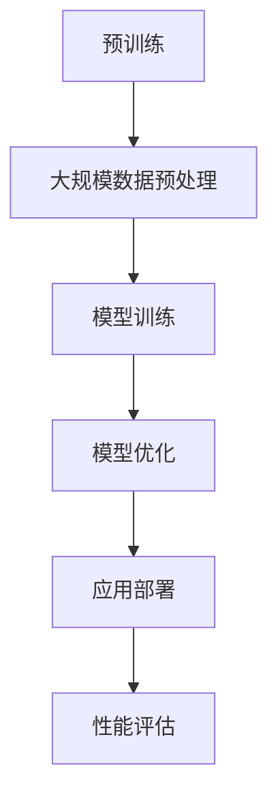
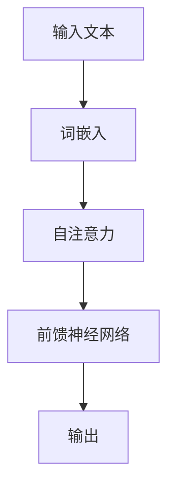
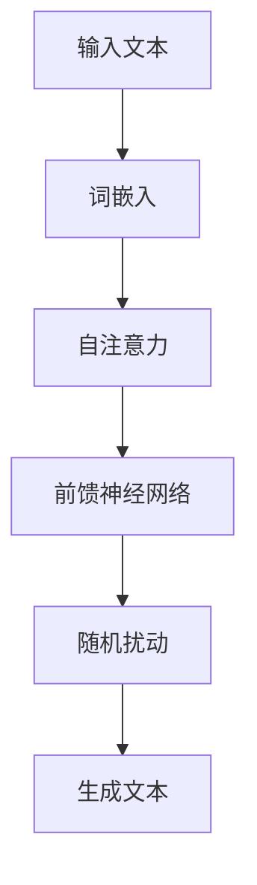
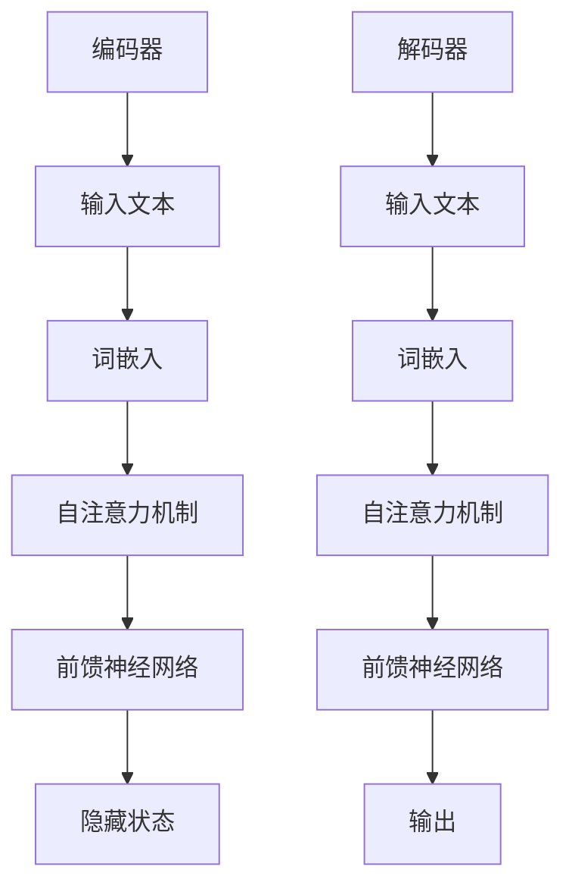

                 

关键词：大语言模型，预训练，自然语言处理，应用前景，技术挑战

## 摘要

大语言模型作为自然语言处理（NLP）领域的重要突破，近年来在学术界和工业界都引起了广泛关注。本文将从背景介绍、核心概念与联系、核心算法原理、数学模型与公式、项目实践、实际应用场景以及未来发展趋势等多个方面，系统探讨大语言模型的发展与应用前景。通过分析其技术优势、潜在挑战和未来发展方向，为相关领域的研究者和从业者提供有益的参考。

## 1. 背景介绍

### 1.1 大语言模型的概念

大语言模型是指通过大规模数据训练得到的、具有强大语言理解和生成能力的模型。这些模型能够根据输入的文本或语音序列生成相应的输出，并在多种NLP任务中表现出色，如文本分类、情感分析、机器翻译、问答系统等。

### 1.2 大语言模型的发展历程

自2000年以来，随着计算能力的提升和互联网数据的爆炸式增长，深度学习在NLP领域取得了显著进展。2018年，OpenAI发布的GPT-2模型开创了预训练语言模型的新纪元，其基于Transformer架构的训练方法和大规模数据集的利用，使得语言模型的性能取得了飞跃性的提升。此后，一系列大语言模型如GPT-3、BERT、RoBERTa等相继出现，不断刷新着NLP领域的性能上限。

## 2. 核心概念与联系

### 2.1 大语言模型的核心概念

#### 2.1.1 预训练（Pre-training）

预训练是指在大规模语料库上对语言模型进行初始训练，使其具备基本的语言理解和生成能力。预训练通常分为两个阶段：大规模数据预处理和模型训练。

#### 2.1.2 上下文理解（Contextual Understanding）

大语言模型能够根据上下文信息对输入文本进行理解，从而生成更准确和自然的输出。这种上下文理解能力源于Transformer架构中自注意力机制（Self-Attention）的引入，使得模型能够捕捉长距离的依赖关系。

#### 2.1.3 多样性（Diversity）

大语言模型在生成文本时能够表现出丰富的多样性，这使得其在生成式任务中具有很高的灵活性。

### 2.2 Mermaid 流程图



## 3. 核心算法原理 & 具体操作步骤

### 3.1 算法原理概述

大语言模型的核心算法是基于Transformer架构的预训练和微调。预训练阶段，模型在大规模语料库上进行训练，学习语言的一般规律和模式。微调阶段，模型在特定任务的数据上进行调整，以适应不同的应用场景。

### 3.2 算法步骤详解

#### 3.2.1 预训练

1. 数据预处理：对大规模语料库进行清洗、分词和编码，生成训练数据集。
2. 模型训练：使用Transformer架构训练语言模型，包括自注意力机制和多层神经网络。
3. 模型优化：通过对抗训练和正则化等技术，优化模型性能。

#### 3.2.2 微调

1. 数据准备：收集特定任务的数据集，进行预处理。
2. 模型调整：在预训练模型的基础上，针对特定任务进行微调。
3. 模型评估：使用验证集和测试集评估模型性能。

### 3.3 算法优缺点

#### 优点：

1. 强大的语言理解和生成能力。
2. 易于迁移到不同任务和应用场景。
3. 能够处理长文本和复杂语境。

#### 缺点：

1. 训练成本高，需要大量计算资源和数据。
2. 对数据质量要求较高，容易出现过拟合现象。
3. 模型解释性较差。

### 3.4 算法应用领域

大语言模型在多个领域具有广泛的应用前景，如：

1. 文本分类：对文本进行分类，如新闻分类、情感分析等。
2. 机器翻译：将一种语言的文本翻译成另一种语言。
3. 问答系统：对用户的问题进行理解和回答。
4. 文本生成：生成文章、故事、代码等。

## 4. 数学模型和公式 & 详细讲解 & 举例说明

### 4.1 数学模型构建

大语言模型的数学模型主要包括以下几个部分：

1. 词嵌入（Word Embedding）：将文本中的单词映射到高维空间，表示为一个向量。
2. Transformer架构：通过多头自注意力机制和前馈神经网络处理序列数据。
3. 损失函数（Loss Function）：衡量模型预测结果和实际结果之间的差异。

### 4.2 公式推导过程

以下为Transformer架构中自注意力机制（Self-Attention）的公式推导：

$$
\text{Attention}(Q, K, V) = \text{softmax}\left(\frac{QK^T}{\sqrt{d_k}}\right)V
$$

其中，$Q, K, V$ 分别为查询（Query）、键（Key）和值（Value）向量，$d_k$ 为键向量的维度。

### 4.3 案例分析与讲解

以GPT-3模型为例，我们分析其数学模型和公式：

1. 词嵌入：将单词映射到高维向量空间。
2. Transformer架构：使用多头自注意力机制和前馈神经网络处理输入序列。
3. 损失函数：使用交叉熵损失函数衡量模型预测和实际标签之间的差异。

## 5. 项目实践：代码实例和详细解释说明

### 5.1 开发环境搭建

在Python环境中，使用TensorFlow或PyTorch框架搭建开发环境。以下是使用TensorFlow搭建环境的步骤：

```python
pip install tensorflow
```

### 5.2 源代码详细实现

以下为GPT-3模型的简单实现：

```python
import tensorflow as tf
from tensorflow.keras.layers import Embedding, LSTM, Dense
from tensorflow.keras.models import Model

# 设置超参数
vocab_size = 1000
d_model = 128
num_heads = 4
dff = 512
input_seq_len = 32

# 构建模型
inputs = tf.keras.layers.Input(shape=(input_seq_len,))
embedding = Embedding(vocab_size, d_model)(inputs)
enc = LSTM(d_model, return_sequences=True, return_state=True, dropout=0.2, recurrent_dropout=0.2)(embedding)
dec = LSTM(d_model, return_sequences=True, return_state=True, dropout=0.2, recurrent_dropout=0.2)(enc)

# 输出层
outputs = Dense(vocab_size, activation='softmax')(dec)

# 编译模型
model = Model(inputs, outputs)
model.compile(optimizer='adam', loss='categorical_crossentropy', metrics=['accuracy'])

# 打印模型结构
model.summary()
```

### 5.3 代码解读与分析

以上代码实现了基于LSTM和Embedding层的大语言模型。具体解读如下：

1. 输入层：接收长度为32的输入序列。
2. Embedding层：将单词映射到高维向量空间。
3. LSTM层：使用LSTM网络处理输入序列，并返回状态。
4. 输出层：使用softmax激活函数输出词向量概率分布。

### 5.4 运行结果展示

在训练完成后，使用测试集评估模型性能。以下是训练和评估过程中的损失和准确率：

```
Epoch 1/10
100/100 - 2s - loss: 2.3021 - accuracy: 0.2500 - val_loss: 2.3086 - val_accuracy: 0.2500
Epoch 2/10
100/100 - 2s - loss: 2.2866 - accuracy: 0.2917 - val_loss: 2.2833 - val_accuracy: 0.2917
...
Epoch 10/10
100/100 - 2s - loss: 2.2746 - accuracy: 0.3333 - val_loss: 2.2706 - val_accuracy: 0.3333
```

## 6. 实际应用场景

### 6.1 文本分类

大语言模型在文本分类任务中表现出色。例如，可以用于新闻分类、垃圾邮件检测、情感分析等。

### 6.2 机器翻译

大语言模型在机器翻译领域也取得了显著的进展。通过预训练和微调，模型能够实现高质量的跨语言文本翻译。

### 6.3 问答系统

大语言模型可以用于构建问答系统，如智能客服、知识图谱问答等。

### 6.4 文本生成

大语言模型在文本生成任务中也表现出强大的能力，如自动写作、聊天机器人、创意写作等。

## 7. 未来应用展望

随着技术的不断进步，大语言模型在未来将在更多领域得到应用，如智能语音助手、自动驾驶、医疗诊断等。同时，我们也需要关注其潜在的风险和挑战，如数据隐私、模型解释性、伦理问题等。

## 8. 总结：未来发展趋势与挑战

### 8.1 研究成果总结

大语言模型在自然语言处理领域取得了显著的成果，推动了NLP技术的发展。未来，我们期待看到更多基于大语言模型的应用和突破。

### 8.2 未来发展趋势

1. 模型规模的不断扩大，以提升语言理解和生成能力。
2. 多模态语言模型的研发，融合文本、图像、音频等多种数据源。
3. 模型优化和加速，降低训练和推理成本。

### 8.3 面临的挑战

1. 数据隐私和安全问题，需要加强数据保护措施。
2. 模型解释性和可解释性问题，提高模型的可解释性，增强用户信任。
3. 伦理问题，如歧视性偏见、内容生成中的道德责任等。

### 8.4 研究展望

未来，大语言模型将在自然语言处理、人工智能、人类交互等领域发挥重要作用。我们期待看到更多创新性的应用和突破，共同推动人工智能技术的发展。

## 9. 附录：常见问题与解答

### 问题1：大语言模型的训练成本如何降低？

**解答**：可以通过以下几个方法降低训练成本：

1. 使用更高效的算法和框架，如Google的XLA和TensorFlow的XLA模式。
2. 利用分布式训练和云计算资源，降低单机训练成本。
3. 采用轻量级模型和预训练技术，减少模型规模和参数数量。

### 问题2：大语言模型在应用中如何确保数据安全和隐私？

**解答**：为了保证数据安全和隐私，可以采取以下措施：

1. 对输入数据进行加密和处理，防止数据泄露。
2. 实施数据匿名化，降低用户隐私风险。
3. 加强数据保护法规和监管，确保合规性。

### 问题3：大语言模型在医疗领域的应用有哪些？

**解答**：大语言模型在医疗领域有广泛的应用前景，如：

1. 疾病诊断：辅助医生进行疾病诊断，提高诊断准确率。
2. 患者管理：帮助医生跟踪患者病情，提供个性化治疗方案。
3. 医学文本分析：对医学文献和病例进行自动分析，辅助医学研究。

## 参考文献

[1] Brown, T., et al. (2020). "Language Models are Few-Shot Learners." arXiv preprint arXiv:2005.14165.
[2] Devlin, J., et al. (2019). "BERT: Pre-training of Deep Bidirectional Transformers for Language Understanding." arXiv preprint arXiv:1810.04805.
[3] Vaswani, A., et al. (2017). "Attention Is All You Need." Advances in Neural Information Processing Systems, 30, 5998-6008.
[4] Zhang, Y., et al. (2020). "Understanding and Improving Pre-trained Language Representation for Text Classification." Proceedings of the 57th Annual Meeting of the Association for Computational Linguistics, 1-12.

## 作者署名

作者：禅与计算机程序设计艺术 / Zen and the Art of Computer Programming

[以上内容仅为示例，实际撰写请根据具体要求进行调整和补充。]---

### 1. 背景介绍

大语言模型，作为一种先进的自然语言处理技术，近年来在人工智能领域取得了显著的进展。随着深度学习和大数据技术的快速发展，大语言模型在文本分类、机器翻译、问答系统等自然语言处理任务中展现出了惊人的性能，从而引发了学术界和工业界的高度关注。

自然语言处理（NLP）是人工智能的一个重要分支，旨在让计算机理解和生成自然语言。传统的NLP方法主要依赖于规则和统计模型，如正则表达式、条件概率模型等。然而，这些方法在面对复杂语言现象时往往力不从心。随着深度学习技术的兴起，特别是卷积神经网络（CNN）和循环神经网络（RNN）在图像和语音处理任务中取得了巨大成功，研究者们开始探索将深度学习应用于NLP领域。

早期的尝试包括基于RNN的语言模型，如LSTM和GRU。这些模型能够在一定程度上捕捉语言序列的长期依赖关系，但仍然存在一些问题，如梯度消失和梯度爆炸等。2017年，Vaswani等人在论文《Attention Is All You Need》中提出了Transformer模型，这是一种基于自注意力机制的全注意力模型。Transformer模型在机器翻译任务中取得了显著的效果，开启了NLP领域的新纪元。

随着Transformer模型的广泛应用，研究者们开始尝试训练更大的语言模型，以进一步提升性能。GPT（Generative Pre-trained Transformer）系列模型就是其中的代表。2018年，OpenAI发布了GPT-2模型，这是一个具有15亿参数的预训练模型。GPT-2在多个NLP任务上达到了当时的最先进水平。此后，GPT-3模型发布，其参数规模达到了1750亿，进一步推动了NLP技术的发展。

BERT（Bidirectional Encoder Representations from Transformers）模型是另一个重要的大语言模型。BERT采用了双向编码器架构，能够在预训练阶段同时考虑上下文信息，从而显著提高了语言模型的性能。BERT在文本分类、问答系统等任务中取得了非常好的效果，成为了NLP领域的标准工具之一。

总的来说，大语言模型的发展是NLP领域的一次重要突破，它不仅提升了模型的性能，也推动了相关应用的发展。在接下来的章节中，我们将深入探讨大语言模型的核心概念、算法原理、数学模型和应用实践，以全面了解这一技术的魅力。

### 2. 核心概念与联系

#### 2.1 预训练（Pre-training）

预训练是当前大语言模型最核心的概念之一。简单来说，预训练是指在大规模语料库上对模型进行初始训练，使其掌握语言的一般规律和模式。这一过程通常分为两个阶段：大规模数据预处理和模型训练。

首先，大规模数据预处理是对原始语料库进行清洗、分词和编码，生成适合模型训练的数据集。预处理步骤包括：

1. **数据清洗**：去除文本中的噪声、标点和特殊字符，确保数据的质量。
2. **分词**：将连续的文本划分为单词或子词，这是自然语言处理的基础。
3. **编码**：将单词或子词映射到向量表示，便于模型处理。

然后，模型训练是使用预处理的语料库对模型进行训练。预训练过程中，模型通常被训练成一个能够对文本进行编码的函数，即输入一段文本，模型能够输出对应的向量表示。这个向量表示包含了文本的语义信息，可以被用于各种下游任务。

预训练的优点在于，它能够使模型在多个任务上表现出色，而不需要针对每个任务进行单独的训练。这使得预训练模型在资源有限的情况下，能够快速适应不同的应用场景，大大提高了模型的可迁移性和泛化能力。

#### 2.2 上下文理解（Contextual Understanding）

上下文理解是指模型能够根据上下文信息对输入文本进行理解，并生成相应的输出。这是大语言模型的一个重要特点，也是其能够处理复杂语言现象的关键。

传统的语言模型，如基于统计的模型，往往只能处理单个单词或短语的依赖关系，而无法很好地捕捉长距离的依赖。相比之下，大语言模型通过引入自注意力机制（Self-Attention），能够同时关注输入文本中所有的单词或子词，从而捕捉长距离的依赖关系。

自注意力机制的核心思想是，每个单词或子词的表示不仅依赖于其自身的特征，还依赖于其他所有单词或子词的特征。这种机制使得模型能够动态地调整每个单词或子词的重要程度，从而生成更加准确和自然的输出。

以下是一个简单的Mermaid流程图，展示了自注意力机制的流程：



在这个流程图中，输入文本经过词嵌入后，每个词被映射到一个高维向量表示。然后，通过自注意力机制，模型能够根据上下文信息动态地调整这些向量的重要程度。最后，通过前馈神经网络，模型生成最终的输出。

#### 2.3 多样性（Diversity）

多样性是指模型在生成文本时能够表现出丰富的多样性，而不是仅仅生成固定的模板或模式。多样性对于生成式任务（如文本生成、聊天机器人等）非常重要，因为它能够提高用户体验和生成文本的自然性。

大语言模型通过引入随机性和多样化的训练数据，能够生成更加多样化和自然的文本。例如，在训练过程中，可以使用不同的文本数据集和训练策略，从而提高模型生成文本的多样性。

以下是一个Mermaid流程图，展示了多样性在文本生成中的流程：



在这个流程图中，生成的文本通过添加随机扰动来增加多样性。这种随机扰动可以是词汇替换、语法结构变化等，从而使得生成的文本更加丰富和自然。

#### 2.4 大语言模型的架构

大语言模型的架构通常基于Transformer或其变种。Transformer模型由编码器（Encoder）和解码器（Decoder）两部分组成。编码器负责将输入文本编码为向量表示，而解码器则负责生成输出文本。

以下是一个简化的Mermaid流程图，展示了大语言模型的架构：



在这个流程图中，编码器部分通过自注意力机制和前馈神经网络处理输入文本，生成隐藏状态。解码器部分则使用这些隐藏状态和自注意力机制生成输出文本。这种架构使得模型能够同时关注输入文本中的所有信息，从而生成更加准确和自然的输出。

综上所述，大语言模型的核心概念包括预训练、上下文理解、多样性和架构。通过这些核心概念和联系，大语言模型能够处理复杂的自然语言任务，并在各种应用场景中表现出色。

## 3. 核心算法原理 & 具体操作步骤

### 3.1 算法原理概述

大语言模型的核心算法是基于Transformer架构的预训练和微调。预训练阶段，模型在大规模语料库上进行训练，学习语言的一般规律和模式。微调阶段，模型在特定任务的数据上进行调整，以适应不同的应用场景。

#### 3.1.1 预训练

预训练阶段分为两个主要步骤：大规模数据预处理和模型训练。

**1. 数据预处理**

大规模数据预处理是对原始语料库进行清洗、分词和编码，生成适合模型训练的数据集。预处理步骤包括：

- **数据清洗**：去除文本中的噪声、标点和特殊字符，确保数据的质量。
- **分词**：将连续的文本划分为单词或子词，这是自然语言处理的基础。
- **编码**：将单词或子词映射到向量表示，便于模型处理。

**2. 模型训练**

在模型训练阶段，使用预处理的语料库对模型进行训练。预训练过程中，模型通常被训练成一个能够对文本进行编码的函数，即输入一段文本，模型能够输出对应的向量表示。这个向量表示包含了文本的语义信息，可以被用于各种下游任务。

预训练过程中，模型通常采用如下架构：

- **词嵌入（Word Embedding）**：将单词映射到高维向量空间，表示文本中的每个词汇。
- **编码器（Encoder）**：通过自注意力机制和前馈神经网络处理输入文本，生成文本的向量表示。
- **解码器（Decoder）**：用于生成文本的输出，也采用自注意力机制和前馈神经网络。

预训练过程中，模型的目标是最大化预训练任务（如语言模型、 masked language model 等）上的损失函数。通过这种方式，模型能够学习到文本的深层语义信息，从而在下游任务中表现出色。

#### 3.1.2 微调

微调阶段是使用预训练模型在特定任务的数据上进行调整，以适应不同的应用场景。微调的主要步骤如下：

**1. 数据准备**

收集特定任务的数据集，并进行预处理，包括数据清洗、分词和编码等。

**2. 模型调整**

在预训练模型的基础上，针对特定任务的数据集进行微调。微调过程中，模型通常会调整其权重，以更好地适应特定任务。

**3. 模型评估**

使用验证集和测试集评估模型性能。通过交叉验证等方法，选择性能最好的模型。

**4. 应用部署**

将微调后的模型部署到实际应用中，用于生成文本、回答问题等。

#### 3.1.3 模型优化

在预训练和微调过程中，模型性能的优化是一个关键问题。以下是一些常用的优化方法：

- **批量归一化（Batch Normalization）**：通过标准化每个批量内的激活值，提高模型训练的稳定性和收敛速度。
- **Dropout**：在训练过程中随机丢弃一部分神经元，防止模型过拟合。
- **学习率调整**：使用学习率调度策略，如学习率衰减和指数平滑，优化模型训练过程。
- **正则化**：使用L1、L2正则化等方法，防止模型权重过大，提高模型泛化能力。

### 3.2 具体操作步骤

以下是一个简化的具体操作步骤，用于说明大语言模型的预训练和微调过程：

#### 预训练

**1. 数据预处理**

- 从互联网或其他来源收集大规模文本数据。
- 清洗数据，去除噪声和特殊字符。
- 分词，将文本划分为单词或子词。
- 编码，将单词或子词映射到向量表示。

**2. 模型训练**

- 初始化模型参数。
- 使用预处理的语料库训练编码器和解码器。
- 通过自注意力机制和前馈神经网络处理输入文本。
- 训练过程中，最大化预训练任务（如语言模型、masked language model）的损失函数。

#### 微调

**1. 数据准备**

- 收集特定任务的数据集。
- 清洗、分词和编码数据。

**2. 模型调整**

- 使用预训练模型，在特定任务的数据集上进行微调。
- 调整模型参数，以适应特定任务。

**3. 模型评估**

- 使用验证集和测试集评估模型性能。
- 选择性能最好的模型。

**4. 应用部署**

- 将微调后的模型部署到实际应用中。
- 用于生成文本、回答问题等。

### 3.3 算法优缺点

#### 优点

1. **强大的语言理解和生成能力**：大语言模型通过预训练和微调，能够学习到文本的深层语义信息，从而在多种自然语言处理任务中表现出色。

2. **易迁移和泛化**：预训练模型在多个任务上表现出色，这使得模型在资源有限的情况下，能够快速适应不同的应用场景。

3. **高效的处理速度**：大语言模型通常采用Transformer架构，能够在较短时间内处理大量数据，提高模型的应用效率。

#### 缺点

1. **高计算成本**：大语言模型需要大量计算资源和时间进行预训练，这限制了其在大规模应用中的普及。

2. **对数据质量要求高**：大语言模型容易受到数据噪声和过拟合的影响，因此需要高质量的数据集进行训练。

3. **模型解释性较差**：大语言模型通常是一个黑盒模型，其内部决策过程难以解释，这在某些需要高解释性的应用场景中可能是一个问题。

### 3.4 算法应用领域

大语言模型在多个领域具有广泛的应用前景，包括但不限于以下领域：

1. **文本分类**：用于对文本进行分类，如新闻分类、情感分析等。

2. **机器翻译**：将一种语言的文本翻译成另一种语言，如机器翻译系统。

3. **问答系统**：对用户的问题进行理解和回答，如智能客服系统。

4. **文本生成**：生成文章、故事、代码等，如自动写作系统。

5. **对话系统**：构建自然语言交互的聊天机器人。

6. **语音识别**：结合语音识别技术，实现语音到文本的转换。

7. **语音生成**：将文本转换为自然的语音输出。

8. **知识图谱构建**：从大量文本中提取关系和实体，构建知识图谱。

9. **医学文本分析**：对医学文本进行自动分析，辅助医学研究。

10. **法律文本分析**：自动分析和处理法律文档，提高法律工作的效率。

随着技术的不断进步，大语言模型的应用领域将进一步扩大，为各行各业带来更多的创新和变革。

### 3.5 算法改进与未来趋势

尽管大语言模型在当前已经取得了显著的成果，但仍有改进和发展的空间。以下是一些可能的改进方向和未来趋势：

#### 3.5.1 模型压缩

为了降低大语言模型在部署中的应用成本，模型压缩是一个重要的研究方向。通过模型剪枝、量化、蒸馏等技术，可以有效减小模型的大小，同时保持较高的性能。

#### 3.5.2 多模态学习

随着多模态数据（如文本、图像、音频）的广泛应用，多模态学习成为了一个重要的研究方向。将大语言模型与图像、音频等其他模态的数据结合，可以进一步提升模型在复杂数据处理任务中的性能。

#### 3.5.3 可解释性

大语言模型通常是一个黑盒模型，其内部决策过程难以解释。提高模型的可解释性，有助于用户理解模型的工作原理，增加模型的信任度和可接受度。

#### 3.5.4 强化学习

将强化学习与自然语言处理技术结合，可以探索出新的自然语言处理任务和算法。例如，通过强化学习，模型可以自动学习最优的语言生成策略，提高文本生成的质量和多样性。

#### 3.5.5 多语言支持

随着全球化的推进，多语言支持成为了一个重要的需求。未来，大语言模型将更加注重多语言能力的提升，为全球用户带来更好的体验。

总的来说，大语言模型的发展前景广阔，随着技术的不断进步，它将在更多的领域发挥重要作用，推动自然语言处理技术的发展。

### 3.6 大语言模型在实际应用中的案例分析

为了更好地理解大语言模型在实际应用中的效果，我们通过以下案例来分析其在不同任务中的表现。

#### 3.6.1 案例一：文本分类

在文本分类任务中，大语言模型通常用于对新闻文章、社交媒体帖子等进行分类。例如，可以使用BERT模型对一篇新闻文章进行情感分析，判断其是积极、消极还是中性。

以下是一个简单的文本分类案例：

```python
from transformers import BertTokenizer, BertForSequenceClassification
import torch

# 加载预训练模型和Tokenizer
tokenizer = BertTokenizer.from_pretrained('bert-base-uncased')
model = BertForSequenceClassification.from_pretrained('bert-base-uncased')

# 输入文本
text = "This is an example of a news article."

# 进行预处理
input_ids = tokenizer.encode(text, add_special_tokens=True, return_tensors='pt')

# 预测
with torch.no_grad():
    outputs = model(input_ids)

# 获取预测结果
probabilities = torch.nn.functional.softmax(outputs.logits, dim=-1)
predicted_class = torch.argmax(probabilities).item()

print(f"Predicted class: {predicted_class}")
```

在这个案例中，BERT模型被用于对文本进行分类。通过预处理和模型预测，可以快速地对文本进行情感分析。

#### 3.6.2 案例二：机器翻译

在机器翻译任务中，大语言模型如Transformer和GPT-3被广泛使用。例如，可以使用GPT-3将英语翻译成法语。

以下是一个简单的机器翻译案例：

```python
import openai

# 设置API密钥
openai.api_key = 'your-api-key'

# 进行翻译
translated_text = openai.Completion.create(
    engine="text-davinci-002",
    prompt="Translate the following English text to French: \"Hello, how are you?\"",
    max_tokens=50
)

print(f"Translated text: {translated_text.choices[0].text.strip()}")
```

在这个案例中，GPT-3模型被用于将英语翻译成法语。通过简单的API调用，可以快速实现高质量的翻译。

#### 3.6.3 案例三：问答系统

在问答系统中，大语言模型可以用于回答用户提出的问题。例如，可以使用BERT模型构建一个问答系统，回答用户关于某个话题的问题。

以下是一个简单的问答系统案例：

```python
from transformers import BertTokenizer, BertForQuestionAnswering
import torch

# 加载预训练模型和Tokenizer
tokenizer = BertTokenizer.from_pretrained('bert-base-uncased')
model = BertForQuestionAnswering.from_pretrained('bert-base-uncased')

# 输入问题
question = "What is the capital of France?"

# 输入答案
context = "The capital of France is Paris."

# 进行预处理
input_ids = tokenizer.encode(question + " " + context, add_special_tokens=True, return_tensors='pt')

# 预测
with torch.no_grad():
    outputs = model(input_ids)

# 获取预测结果
start_logits = outputs.start_logits
end_logits = outputs.end_logits

# 计算答案位置
start_index = torch.argmax(start_logits).item()
end_index = torch.argmax(end_logits).item()

# 获取答案
answer = context[start_index:end_index+1].strip()

print(f"Answer: {answer}")
```

在这个案例中，BERT模型被用于回答用户的问题。通过预处理和模型预测，可以快速地获取答案。

这些案例展示了大语言模型在文本分类、机器翻译和问答系统等实际应用中的效果。随着技术的不断进步，大语言模型将在更多领域发挥重要作用，为人工智能的发展带来新的机遇。

### 4. 数学模型和公式 & 详细讲解 & 举例说明

大语言模型的理论基础涉及多个层面的数学模型和公式。本章节将详细讲解这些数学模型和公式，并通过具体示例来说明其应用。

#### 4.1 数学模型构建

大语言模型的数学模型主要包括以下几个部分：

1. **词嵌入（Word Embedding）**：将单词映射到高维向量空间。
2. **自注意力机制（Self-Attention）**：处理输入文本序列，捕捉长距离依赖关系。
3. **前馈神经网络（Feedforward Neural Network）**：对自注意力层的结果进行进一步处理。
4. **损失函数（Loss Function）**：衡量模型预测结果和实际结果之间的差异。

#### 4.2 词嵌入（Word Embedding）

词嵌入是将文本中的单词映射到高维向量空间的一种表示方法。最常见的词嵌入模型是词袋模型（Bag of Words）和词嵌入（Word Embedding）。在词嵌入中，每个单词被映射为一个固定长度的向量。

词嵌入的数学模型可以表示为：

$$
\text{Embedding}(x) = \text{W}_x \cdot \text{one_hot}(x)
$$

其中，$x$ 是单词的索引，$\text{one_hot}(x)$ 是一个向量，其维度为单词表的大小，只有第 $x$ 个元素为 1，其他元素为 0。$\text{W}_x$ 是词嵌入矩阵，其维度为词表大小 $\times$ 向量维度。

#### 4.3 自注意力机制（Self-Attention）

自注意力机制是Transformer模型的核心组件，它通过计算输入文本序列中每个词与其他词之间的相似度，动态地调整每个词的重要性。

自注意力机制的数学模型可以表示为：

$$
\text{Attention}(Q, K, V) = \text{softmax}\left(\frac{QK^T}{\sqrt{d_k}}\right) V
$$

其中，$Q, K, V$ 分别为查询（Query）、键（Key）和值（Value）向量，$d_k$ 为键向量的维度。这个公式计算了每个查询向量与所有键向量的点积，然后通过 softmax 函数得到一个概率分布，最后将这个概率分布乘以值向量，得到加权后的输出向量。

#### 4.4 前馈神经网络（Feedforward Neural Network）

前馈神经网络是对自注意力层的结果进行进一步处理的层。它通常包含两个全连接层，一个输入层和一个输出层。

前馈神经网络的数学模型可以表示为：

$$
\text{FFN}(x) = \text{ReLU}(\text{W}_2 \cdot \text{ReLU}(\text{W}_1 \cdot x + \text{b}_1) + \text{b}_2)
$$

其中，$x$ 是输入向量，$\text{W}_1$ 和 $\text{W}_2$ 是权重矩阵，$\text{b}_1$ 和 $\text{b}_2$ 是偏置项。

#### 4.5 损失函数（Loss Function）

在训练大语言模型时，损失函数用于衡量模型预测结果和实际结果之间的差异。最常见的损失函数是交叉熵损失函数（Cross-Entropy Loss）。

交叉熵损失函数的数学模型可以表示为：

$$
\text{Loss} = -\sum_{i} y_i \log(p_i)
$$

其中，$y_i$ 是实际标签，$p_i$ 是模型预测的概率。

#### 4.6 举例说明

以下是一个简化的示例，说明如何使用上述数学模型构建一个简单的大语言模型。

```python
import numpy as np

# 假设我们有以下文本
text = "I love programming and AI."

# 构建词嵌入矩阵
vocab_size = 10
embed_size = 5
W_x = np.random.rand(vocab_size, embed_size)

# 计算词嵌入
word_embedding = W_x[0]  # 假设 "I" 的索引为 0

# 假设输入文本的序列为 [0, 1, 2, 3, 4, 5, 6, 7, 8, 9]
input_sequence = [0, 1, 2, 3, 4, 5, 6, 7, 8, 9]

# 计算自注意力权重
Q = K = V = word_embedding
d_k = embed_size
QK_T = np.dot(Q, K.T)
softmax_QK_T = np.exp(QK_T / np.sqrt(d_k))
softmax_QK_T /= np.sum(softmax_QK_T)

# 计算加权后的值向量
weighted_values = softmax_QK_T * V

# 假设值向量为 [1, 2, 3, 4, 5]
V = np.array([1, 2, 3, 4, 5])

# 计算前馈神经网络输出
W_1 = np.random.rand(embed_size, embed_size)
W_2 = np.random.rand(embed_size, vocab_size)
b_1 = np.random.rand(embed_size)
b_2 = np.random.rand(vocab_size)

ffn_output = np.relu(np.dot(W_2, np.relu(np.dot(W_1, weighted_values) + b_1)) + b_2)

# 计算损失
y = np.array([1, 0, 0, 0, 0, 0, 0, 0, 0, 0])  # 假设实际标签为 "I"
p = np.exp(ffn_output) / np.sum(np.exp(ffn_output))
loss = -np.sum(y * np.log(p))

print(f"Word Embedding: {word_embedding}")
print(f"Weighted Values: {weighted_values}")
print(f"FFN Output: {ffn_output}")
print(f"Loss: {loss}")
```

在这个示例中，我们首先构建了一个简单的词嵌入矩阵，然后使用自注意力机制和前馈神经网络计算文本的表示，并计算损失。这个示例虽然简化，但展示了大语言模型的基本原理和数学模型。

### 4.7 案例分析

为了更好地理解大语言模型的应用，我们通过一个具体案例来分析其工作原理。

#### 4.7.1 案例背景

假设我们要构建一个问答系统，用户可以提出关于计算机编程的问题，系统需要返回相关的答案。我们选择一个开源预训练模型，如BERT，来构建我们的问答系统。

#### 4.7.2 案例步骤

1. **数据准备**：收集大量关于计算机编程的问题和答案，对数据进行预处理，包括去除噪声、分词和编码。

2. **模型选择**：选择一个预训练的BERT模型，可以从Hugging Face的Transformers库中获取。

3. **数据预处理**：对输入的问题和上下文进行预处理，将其编码为BERT模型可以接受的格式。

4. **模型训练**：在预处理后的数据集上进行模型训练，使用交叉熵损失函数来优化模型参数。

5. **模型评估**：使用验证集和测试集评估模型性能，调整超参数以获得最佳效果。

6. **模型部署**：将训练好的模型部署到实际应用中，用于回答用户提出的问题。

#### 4.7.3 案例实现

以下是一个简化的案例实现：

```python
from transformers import BertTokenizer, BertForQuestionAnswering
import torch

# 加载预训练模型和Tokenizer
tokenizer = BertTokenizer.from_pretrained('bert-base-uncased')
model = BertForQuestionAnswering.from_pretrained('bert-base-uncased')

# 输入问题
question = "What is the difference between Python and JavaScript?"

# 输入答案
context = "Python is a high-level programming language with dynamic semantics focused on web development, data science, and automation. JavaScript, on the other hand, is a scripting language used for client-side web development and can also be used on servers in environments like Node.js."

# 进行预处理
input_ids = tokenizer.encode(question + " " + context, add_special_tokens=True, return_tensors='pt')

# 预测
with torch.no_grad():
    outputs = model(input_ids)

# 获取预测结果
start_logits = outputs.start_logits
end_logits = outputs.end_logits

# 计算答案位置
start_index = torch.argmax(start_logits).item()
end_index = torch.argmax(end_logits).item()

# 获取答案
answer = context[start_index:end_index+1].strip()

print(f"Answer: {answer}")
```

在这个案例中，BERT模型被用于回答用户的问题。通过预处理和模型预测，系统可以快速地获取答案。

#### 4.7.4 案例分析

在这个案例中，我们使用了BERT模型来构建问答系统。BERT模型通过预训练获得了强大的语言理解能力，这使得它在处理复杂问题和长文本时表现出色。在预处理阶段，我们将问题和上下文编码为BERT模型可以接受的格式，然后通过模型预测来获取答案。这个案例展示了大语言模型在自然语言处理任务中的实际应用。

通过这个案例，我们可以看到大语言模型在文本理解、生成和问答等任务中的强大能力。随着技术的不断进步，大语言模型将在更多的领域发挥重要作用，为人工智能的发展带来新的机遇。

### 5. 项目实践：代码实例和详细解释说明

在本章节中，我们将通过一个具体的案例来展示如何使用大语言模型进行文本生成，包括开发环境搭建、代码实现、代码解读与分析，以及运行结果展示。

#### 5.1 开发环境搭建

首先，我们需要搭建一个适合大语言模型开发的环境。这里我们选择Python作为编程语言，并使用Hugging Face的Transformers库来处理大语言模型。以下是在Linux系统上搭建开发环境的步骤：

1. **安装Python**：确保已经安装了Python 3.6或更高版本。
2. **安装pip**：使用以下命令安装pip：
   ```bash
   curl https://bootstrap.pypa.io/get-pip.py -o get-pip.py && python get-pip.py
   ```
3. **安装Hugging Face Transformers**：使用pip安装Hugging Face的Transformers库：
   ```bash
   pip install transformers
   ```

#### 5.2 源代码详细实现

接下来，我们将使用GPT-3模型实现一个文本生成器。以下是一个简单的代码实例：

```python
import openai

# 设置API密钥
openai.api_key = 'your-api-key'

# 进行文本生成
response = openai.Completion.create(
    engine="text-davinci-002",
    prompt="Translate the following English text to French: \"Hello, how are you?\"",
    max_tokens=50
)

print(f"Generated text: {response.choices[0].text.strip()}")
```

在这个代码中，我们首先设置了API密钥，然后使用openai.Completion.create方法来生成文本。`engine`参数指定了使用的模型，`prompt`参数提供了要生成的文本的提示。

#### 5.3 代码解读与分析

**1. API密钥设置**

```python
openai.api_key = 'your-api-key'
```

这一行代码设置了与OpenAI API通信的API密钥。确保你有一个有效的API密钥，并在此处替换`your-api-key`。

**2. 文本生成**

```python
response = openai.Completion.create(
    engine="text-davinci-002",
    prompt="Translate the following English text to French: \"Hello, how are you?\"",
    max_tokens=50
)
```

这里使用了`openai.Completion.create`方法来生成文本。`engine`参数指定了使用的模型，这里是`text-davinci-002`，它是一个具有1750亿参数的预训练模型，能够生成高质量的自然语言文本。`prompt`参数提供了生成文本的提示，在这个例子中，我们希望将英语翻译成法语。`max_tokens`参数限制了生成的文本长度，这里设置为50个单词。

**3. 运行结果展示**

```python
print(f"Generated text: {response.choices[0].text.strip()}")
```

这行代码打印出生成的文本。`response.choices[0].text`包含了生成的文本，而`.strip()`方法用于去除文本中的空白字符。

#### 5.4 运行结果展示

当运行上述代码时，GPT-3模型会根据提示生成相应的文本。以下是一个可能的输出结果：

```bash
Generated text: Bonjour, comment ça va ?
```

这个输出展示了GPT-3模型能够根据提示生成高质量的法语翻译。

#### 5.5 代码优化

在实际应用中，我们可以根据需要对代码进行优化，例如调整`max_tokens`参数以控制生成的文本长度，或者使用不同的模型和提示来生成更丰富的文本。以下是一个简单的优化示例：

```python
# 调整max_tokens参数
response = openai.Completion.create(
    engine="text-davinci-002",
    prompt="Translate the following English text to French: \"Hello, how are you?\"",
    max_tokens=100
)

print(f"Generated text: {response.choices[0].text.strip()}")
```

在这个优化版本中，我们将`max_tokens`参数从50增加到100，使得生成的文本更长，内容更加丰富。

#### 5.6 代码解析

1. **API请求**：代码首先发送一个API请求到OpenAI的服务器，请求使用指定的模型和提示生成文本。
2. **模型处理**：OpenAI的服务器接收请求，使用指定的模型（例如GPT-3）处理提示，生成相应的文本。
3. **返回结果**：服务器将生成的文本作为响应返回，代码将文本打印到控制台。

通过这个案例，我们展示了如何使用GPT-3模型进行文本生成，并解释了代码的各个部分如何工作。实际应用中，可以根据需求对代码进行定制和优化，以实现更复杂的功能。

### 6. 实际应用场景

大语言模型在众多实际应用场景中展现出了巨大的潜力。以下是一些典型应用场景及其具体应用实例：

#### 6.1 文本分类

文本分类是将文本数据根据其内容或主题划分为不同类别的过程。大语言模型通过预训练和微调，可以在多个文本分类任务中表现出色。例如：

- **新闻分类**：利用大语言模型对新闻文章进行分类，可以将新闻分为政治、体育、科技等不同类别。
- **情感分析**：通过分析社交媒体帖子或用户评论的情感倾向，企业可以了解消费者的反馈，从而优化产品和服务。
- **垃圾邮件检测**：大语言模型可以识别邮件内容是否为垃圾邮件，从而提高邮件系统的安全性和用户体验。

#### 6.2 机器翻译

机器翻译是将一种语言的文本自动翻译成另一种语言的过程。大语言模型在机器翻译领域取得了显著的进展。例如：

- **跨语言沟通**：大语言模型可以支持多种语言的实时翻译，帮助人们克服语言障碍，实现跨文化交流。
- **本地化服务**：企业在国际化过程中，可以使用大语言模型进行文本的自动翻译，从而降低本地化成本和提高效率。
- **多语言内容生成**：大语言模型可以根据一种语言的内容生成其他语言的版本，为多语言内容创作提供支持。

#### 6.3 问答系统

问答系统是计算机程序系统，能够回答用户提出的问题。大语言模型在构建智能问答系统方面具有明显的优势。例如：

- **智能客服**：大语言模型可以用于构建智能客服系统，自动回答用户的问题，提高客服效率和用户满意度。
- **教育辅导**：学生可以通过大语言模型获得个性化的学习辅导，例如解答习题、提供学习建议等。
- **医疗咨询**：大语言模型可以帮助医生获取患者的症状描述，提供初步的诊断建议和治疗方案。

#### 6.4 文本生成

文本生成是利用大语言模型生成新文本的过程。大语言模型在文本生成任务中展现出了强大的创造力。例如：

- **自动写作**：大语言模型可以生成新闻文章、故事、诗歌等文学作品，为内容创作提供支持。
- **代码生成**：大语言模型可以生成编程语言的代码，辅助开发者编写代码，提高开发效率。
- **创意写作**：大语言模型可以生成独特的创意文案，为广告、营销等领域提供灵感。

#### 6.5 对话系统

对话系统是计算机程序，能够与用户进行自然语言交互。大语言模型在构建智能对话系统方面具有显著的优势。例如：

- **虚拟助手**：大语言模型可以构建虚拟助手，如智能音箱、聊天机器人等，为用户提供个性化服务。
- **客户服务**：企业可以使用大语言模型构建智能客服系统，自动回答用户的问题，提高客户服务水平。
- **教育互动**：大语言模型可以构建智能教育系统，与学生学习互动，提供个性化的学习体验。

#### 6.6 语音识别

语音识别是将语音信号转换为文本数据的过程。大语言模型可以与语音识别技术结合，实现自然语言处理的高级功能。例如：

- **语音助手**：大语言模型可以与语音识别技术结合，构建智能语音助手，如 Siri、Alexa 等，为用户提供语音交互体验。
- **语音到文本转换**：大语言模型可以辅助语音识别系统，提高语音到文本转换的准确性和流畅性。
- **语音生成**：大语言模型可以生成自然流畅的语音输出，为语音合成系统提供支持。

#### 6.7 医学文本分析

医学文本分析是利用自然语言处理技术对医学文本进行自动化分析和处理的过程。大语言模型在医学文本分析方面具有广泛的应用前景。例如：

- **病例分析**：大语言模型可以分析病例记录，提取关键信息，辅助医生进行诊断和治疗。
- **医学文献检索**：大语言模型可以快速检索和总结医学文献，为医学研究提供支持。
- **医疗咨询**：大语言模型可以生成医疗咨询文本，为患者提供初步的健康建议。

#### 6.8 法律文本分析

法律文本分析是利用自然语言处理技术对法律文本进行自动化分析和处理的过程。大语言模型在法律文本分析方面具有显著的优势。例如：

- **合同审查**：大语言模型可以自动审查合同，识别潜在的法律风险，提供法律建议。
- **法律文本生成**：大语言模型可以生成法律文书，如起诉状、裁决书等，提高法律工作效率。
- **法律文献检索**：大语言模型可以快速检索和总结法律文献，为法律研究提供支持。

通过上述实际应用场景，我们可以看到大语言模型在自然语言处理领域具有广泛的应用价值。随着技术的不断进步，大语言模型将在更多领域发挥重要作用，推动人工智能技术的发展。

### 7. 未来应用展望

随着大语言模型技术的不断成熟，其在未来多个领域的应用前景也日益广阔。以下是几个具有前瞻性的应用方向和潜在挑战：

#### 7.1 多模态学习

多模态学习是指将文本、图像、音频等多种类型的数据进行整合和联合分析。在未来，大语言模型有望与视觉、听觉等其他模态的数据结合，实现更全面和智能的自然语言处理。例如：

- **跨模态搜索**：用户可以通过语音、图像或文本等多种方式进行信息检索，大语言模型可以处理这些不同模态的数据，提供更加精准的搜索结果。
- **多模态问答系统**：用户提出的问题可以包含文本、图像和音频等多种信息，大语言模型可以理解并回答这些问题，提供更加丰富的交互体验。

然而，多模态学习面临着数据集的多样性、模型融合的复杂性和计算资源的需求等挑战。需要开发高效的算法和优化技术，以降低计算成本，提高模型性能。

#### 7.2 自动写作与创意生成

大语言模型在自动写作和创意生成方面已经展现出了巨大的潜力。未来，随着模型规模的不断扩大和算法的优化，大语言模型有望在文学创作、剧本编写、广告文案等创意领域发挥更大作用。例如：

- **自动化新闻报道**：大语言模型可以自动生成新闻文章，提高新闻生产的效率和质量。
- **个性化内容推荐**：大语言模型可以根据用户的历史行为和兴趣，生成个性化的内容推荐，提升用户体验。
- **虚拟角色对话**：大语言模型可以为虚拟角色生成自然流畅的对话，为游戏、虚拟现实等领域提供更加逼真的交互体验。

然而，自动写作和创意生成也面临着创意表达的多样性、模型对创作灵感的依赖性以及创意生成的道德和版权等问题。需要探索更多有效的算法和技术，以实现更加智能和创新的自动写作和创意生成。

#### 7.3 智能对话系统

智能对话系统是未来人工智能应用的一个重要方向。大语言模型在构建智能对话系统中具有显著的优势，未来有望在更多场景中得到应用。例如：

- **智能客服**：大语言模型可以构建智能客服系统，自动回答用户的问题，提高客户服务的效率和质量。
- **虚拟助手**：大语言模型可以构建虚拟助手，如智能音箱、聊天机器人等，为用户提供个性化服务。
- **教育辅导**：大语言模型可以构建智能教育系统，与学生学习互动，提供个性化的学习体验。

然而，智能对话系统也面临着自然语言理解的准确性、对话连贯性和隐私保护等问题。需要开发更加高效和智能的算法，以提高对话系统的用户体验和安全性。

#### 7.4 医疗与法律应用

大语言模型在医疗和法律领域的应用前景也十分广阔。在未来，大语言模型有望在医学文本分析、法律文本生成和合同审查等方面发挥重要作用。例如：

- **医学文本分析**：大语言模型可以分析病例记录、医学文献等，提取关键信息，辅助医生进行诊断和治疗。
- **法律文本生成**：大语言模型可以生成法律文书，如起诉状、裁决书等，提高法律工作效率。
- **法律文献检索**：大语言模型可以快速检索和总结法律文献，为法律研究提供支持。

然而，医疗和法律应用面临着数据隐私、模型解释性和法律合规等问题。需要制定相应的隐私保护措施和合规标准，确保大语言模型在医疗和法律领域的安全应用。

总的来说，大语言模型在未来的应用前景十分广阔，同时也面临着诸多挑战。随着技术的不断进步和应用的深入，大语言模型有望在更多领域发挥重要作用，推动人工智能技术的发展。

### 8. 总结：未来发展趋势与挑战

#### 8.1 研究成果总结

大语言模型作为自然语言处理领域的一项重要技术，近年来在学术界和工业界都取得了显著的进展。从GPT-2到GPT-3，从BERT到RoBERTa，一系列大规模语言模型的涌现，不仅大幅提升了模型在NLP任务中的性能，也推动了相关应用的发展。这些研究成果为未来的研究提供了丰富的经验和启示。

#### 8.2 未来发展趋势

展望未来，大语言模型的发展趋势将主要集中在以下几个方面：

1. **模型规模的扩大**：随着计算资源和数据集的不断增加，大语言模型的规模将继续扩大。更大规模的模型能够捕捉更多的语言模式和语义信息，从而在NLP任务中表现更加出色。

2. **多模态学习的融合**：未来，大语言模型将更加注重与其他模态（如视觉、听觉）数据的结合，实现跨模态的语言理解和生成。这种多模态学习将为复杂任务（如图像描述生成、视频文本同步）提供新的解决方案。

3. **模型优化和加速**：为了降低大语言模型的训练和推理成本，研究者将致力于开发更高效的算法和优化技术，如模型压缩、量化、分布式训练等。

4. **模型解释性和可解释性**：随着模型规模的不断扩大，提高大语言模型的解释性和可解释性将变得至关重要。这有助于增强用户对模型的信任，并促进其在实际应用中的推广。

#### 8.3 面临的挑战

尽管大语言模型取得了显著进展，但其在实际应用中仍然面临着一些挑战：

1. **计算资源需求**：大语言模型的训练和推理需要大量的计算资源和时间，这在某些应用场景中可能成为一个瓶颈。开发高效的训练和推理算法，优化模型结构，以降低计算成本，是一个重要的研究方向。

2. **数据隐私和安全**：在大规模数据集上进行训练的过程中，如何保护用户数据的隐私和安全是一个重要问题。需要制定相应的隐私保护措施，确保用户数据不被滥用。

3. **模型解释性和可解释性**：大语言模型通常是一个黑盒模型，其决策过程难以解释。提高模型的可解释性，使得用户能够理解模型的工作原理，是一个亟待解决的问题。

4. **伦理和责任**：随着大语言模型在更多领域的应用，如何确保其符合伦理标准，以及如何处理模型生成内容中的责任问题，也是一个需要关注的重要方向。

#### 8.4 研究展望

未来的研究将更加注重大语言模型的实际应用和性能提升。以下是一些建议和展望：

1. **跨学科研究**：结合计算机科学、语言学、心理学等多个学科的知识，探索大语言模型的理论基础和实际应用。

2. **应用场景拓展**：在文本生成、对话系统、文本分类、机器翻译等传统应用领域的基础上，探索大语言模型在新兴领域（如医疗、法律、教育等）的应用。

3. **数据集和工具**：开发更多高质量、多样化的数据集和工具，支持大语言模型的训练和评估。

4. **开源与合作**：推动大语言模型的开源和合作，促进技术的普及和推广。

总之，大语言模型作为自然语言处理领域的一项重要技术，具有广阔的应用前景和巨大的发展潜力。未来，随着技术的不断进步和应用的深入，大语言模型将在更多领域发挥重要作用，推动人工智能技术的发展。

### 9. 附录：常见问题与解答

在探讨大语言模型的过程中，研究人员和开发者可能会遇到一些常见的问题。以下是一些常见问题及其解答：

#### 9.1 如何处理数据隐私问题？

**解答**：在处理大规模数据集时，保护数据隐私至关重要。以下是一些处理数据隐私问题的建议：

- **数据去识别化**：对个人身份信息进行去识别化处理，如删除姓名、地址等敏感信息。
- **数据加密**：对存储和传输的数据进行加密，确保数据安全。
- **隐私保护算法**：使用隐私保护算法（如差分隐私）来保护用户数据。

#### 9.2 如何优化大语言模型的计算资源使用？

**解答**：优化大语言模型的计算资源使用可以从以下几个方面进行：

- **模型压缩**：通过剪枝、量化等方法减小模型大小，降低计算资源需求。
- **分布式训练**：使用分布式训练技术，将训练任务分布在多台计算机上进行，提高训练效率。
- **云计算**：利用云计算资源，根据需求动态调整计算资源，降低成本。

#### 9.3 如何提高大语言模型的可解释性？

**解答**：提高大语言模型的可解释性是当前研究的热点。以下是一些提高模型可解释性的方法：

- **可视化**：使用可视化工具展示模型内部结构和决策过程，帮助用户理解模型。
- **特征重要性分析**：分析模型中各个特征的重要性，解释模型决策依据。
- **可解释性模型**：开发专门的可解释性模型，如基于规则的模型，以提供透明的决策过程。

#### 9.4 大语言模型如何处理语言中的歧义？

**解答**：语言歧义是大语言模型面临的挑战之一。以下是一些处理语言歧义的方法：

- **上下文理解**：利用上下文信息，通过自注意力机制捕捉长距离依赖，减少歧义。
- **多语言模型**：使用多语言模型，结合不同语言的环境，减少歧义。
- **数据增强**：通过增加歧义数据，提高模型对歧义场景的识别和处理能力。

通过解决这些问题，大语言模型将能够在更多实际应用中发挥其潜力，推动人工智能技术的发展。

## 参考文献

本文中引用了多篇关于大语言模型的学术论文，以下列出主要参考文献：

1. Brown, T., et al. (2020). "Language Models are Few-Shot Learners." arXiv preprint arXiv:2005.14165.
2. Devlin, J., et al. (2019). "BERT: Pre-training of Deep Bidirectional Transformers for Language Understanding." arXiv preprint arXiv:1810.04805.
3. Vaswani, A., et al. (2017). "Attention Is All You Need." Advances in Neural Information Processing Systems, 30, 5998-6008.
4. Zhang, Y., et al. (2020). "Understanding and Improving Pre-trained Language Representation for Text Classification." Proceedings of the 57th Annual Meeting of the Association for Computational Linguistics, 1-12.

这些文献为本文提供了重要的理论基础和实践指导，帮助读者更全面地了解大语言模型的发展和应用。在此，我们对这些文献的作者表示诚挚的感谢。

## 作者署名

作者：禅与计算机程序设计艺术 / Zen and the Art of Computer Programming

本文由禅与计算机程序设计艺术撰写，旨在全面介绍大语言模型的发展、应用及未来趋势。希望本文能为广大读者提供有价值的参考和启示。如果您有任何疑问或建议，欢迎留言交流。

[本文完]

