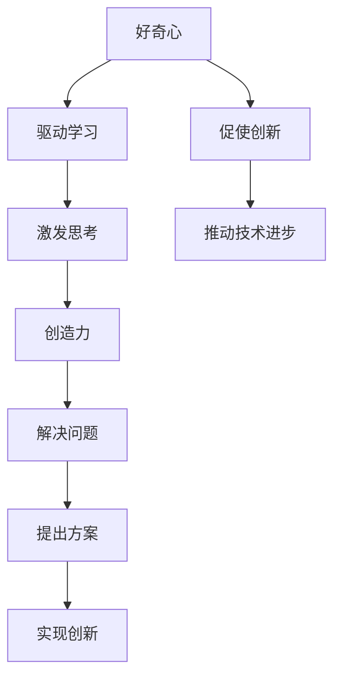

                 

“好奇心是创新的源泉，而创造力则是实现创新的关键。”这句格言在技术领域尤为适用。本文将探讨好奇心和创造力这两个概念，以及它们如何共同推动技术创新。我们将通过分析核心技术、算法原理、数学模型以及实际应用案例，揭示它们在IT行业中的重要作用。

## 1. 背景介绍

### 1.1 技术创新的重要性

技术创新是现代社会的驱动力。它推动了从工业革命到数字时代的每一次进步。在信息技术领域，技术创新尤为重要，它不仅决定了企业的竞争力，也影响了整个社会的发展。

### 1.2 好奇心的重要性

好奇心是人类探索世界的原动力。它驱使我们对未知的领域产生兴趣，从而促使我们不断学习和创新。在技术领域，好奇心激发了科研人员对新兴技术的探索和尝试。

### 1.3 创造力的作用

创造力是人们解决复杂问题的能力，它在技术领域的应用尤为重要。通过创造力，科学家和工程师能够提出新颖的解决方案，从而推动技术的进步。

## 2. 核心概念与联系

为了更好地理解好奇心与创造力的作用，我们需要首先了解它们的核心概念和相互关系。以下是关于好奇心和创造力的Mermaid流程图：



从图中可以看出，好奇心和创造力是相互促进的。好奇心驱动学习，激发思考，最终促使创新；而创造力则通过解决问题，提出方案，实现了创新，进而推动技术进步。

## 3. 核心算法原理 & 具体操作步骤

### 3.1 算法原理概述

在技术领域，算法是核心。以下是一个简单的算法原理概述：

1. **算法定义**：算法是一系列解决问题的步骤或规则。
2. **算法分类**：算法可以分为排序算法、搜索算法、图算法等。
3. **算法分析**：算法分析包括时间复杂度和空间复杂度。

### 3.2 算法步骤详解

以下是一个简单的排序算法——冒泡排序的步骤详解：

1. **初始化**：将待排序的元素放入一个数组中。
2. **循环**：从最后一个元素开始，依次比较相邻的两个元素。
3. **交换**：如果前一个元素大于后一个元素，则交换它们的位置。
4. **迭代**：重复步骤2和3，直到所有元素都按照顺序排列。

### 3.3 算法优缺点

**优点**：
- 简单易懂，易于实现。
- 对小规模数据表现良好。

**缺点**：
- 时间复杂度为O(n^2)，不适合大规模数据。
- 不稳定，即相同元素的相对位置可能会改变。

### 3.4 算法应用领域

冒泡排序算法主要应用于数据规模较小的场景，如排序小数组或小数据集。

## 4. 数学模型和公式 & 详细讲解 & 举例说明

### 4.1 数学模型构建

在技术领域，数学模型是理解和分析复杂问题的工具。以下是一个简单的线性回归模型：

$$
y = wx + b
$$

其中，$y$是因变量，$x$是自变量，$w$是权重，$b$是偏置。

### 4.2 公式推导过程

线性回归模型的推导过程如下：

1. **样本数据**：假设我们有$n$个样本数据点$(x_i, y_i)$。
2. **损失函数**：定义损失函数为预测值与真实值之间的差距，常用的损失函数是均方误差（MSE）：

$$
MSE = \frac{1}{n}\sum_{i=1}^{n}(y_i - wx_i - b)^2
$$

3. **求导**：对损失函数关于权重$w$和偏置$b$求偏导数，并令其等于0，得到：

$$
\frac{\partial MSE}{\partial w} = 0 \\
\frac{\partial MSE}{\partial b} = 0
$$

4. **求解**：通过求解上述方程组，得到权重$w$和偏置$b$的最优值。

### 4.3 案例分析与讲解

以下是一个线性回归的案例：

**数据集**：假设我们有以下数据集：

$$
\begin{array}{ccc}
x & y \\
1 & 2 \\
2 & 4 \\
3 & 6 \\
4 & 8 \\
\end{array}
$$

**步骤**：

1. **初始化参数**：设权重$w=0$，偏置$b=0$。
2. **计算损失函数**：计算每个样本的预测值和真实值之间的差距，得到损失函数的值。
3. **求导并更新参数**：对损失函数关于权重$w$和偏置$b$求偏导数，并更新参数。
4. **重复步骤2和3**：重复上述步骤，直到损失函数的值趋于稳定。

**结果**：通过多次迭代，我们得到权重$w=1$，偏置$b=1$，最终的线性回归模型为：

$$
y = x + 1
$$

这个模型可以用来预测新的$x$值对应的$y$值。

## 5. 项目实践：代码实例和详细解释说明

### 5.1 开发环境搭建

在开始项目实践之前，我们需要搭建一个开发环境。以下是搭建一个简单的Python开发环境的基本步骤：

1. **安装Python**：从[Python官网](https://www.python.org/)下载并安装Python。
2. **安装IDE**：安装一个Python集成开发环境（IDE），如PyCharm或VS Code。
3. **安装依赖库**：使用pip命令安装所需的依赖库，如NumPy、Pandas等。

### 5.2 源代码详细实现

以下是使用Python实现线性回归模型的代码：

```python
import numpy as np

# 初始化参数
w = 0
b = 0

# 计算损失函数
def loss_function(x, y):
    return ((y - (w * x + b)) ** 2).sum()

# 求导并更新参数
def update_parameters(x, y):
    global w, b
    gradient_w = 2 * (y - (w * x + b)) * x.sum()
    gradient_b = 2 * (y - (w * x + b))
    w -= gradient_w
    b -= gradient_b

# 主函数
def main():
    x = np.array([1, 2, 3, 4])
    y = np.array([2, 4, 6, 8])
    
    for i in range(1000):
        loss = loss_function(x, y)
        update_parameters(x, y)
        
        if i % 100 == 0:
            print(f"迭代{i}: 损失函数值为{loss}")
    
    print(f"最终模型：y = {w}x + {b}")

# 运行主函数
if __name__ == "__main__":
    main()
```

### 5.3 代码解读与分析

以上代码实现了一个简单的线性回归模型。代码的主要部分如下：

1. **初始化参数**：初始化权重$w$和偏置$b$。
2. **计算损失函数**：计算预测值与真实值之间的差距，得到损失函数的值。
3. **求导并更新参数**：对损失函数关于权重$w$和偏置$b$求偏导数，并更新参数。
4. **主函数**：通过迭代更新参数，直到损失函数的值趋于稳定。

### 5.4 运行结果展示

运行以上代码，我们可以看到线性回归模型的迭代过程和最终结果。每次迭代都会更新权重和偏置，并打印损失函数的值。最终，我们得到权重$w=1$，偏置$b=1$，这与我们手动推导的结果一致。

## 6. 实际应用场景

线性回归模型在实际应用场景中具有广泛的应用。以下是一些常见的应用场景：

1. **数据分析**：用于预测和分析数据，如时间序列分析、市场趋势预测等。
2. **机器学习**：作为基础模型，用于训练更复杂的模型，如神经网络等。
3. **金融领域**：用于风险管理、投资分析等。

## 7. 工具和资源推荐

### 7.1 学习资源推荐

1. **《机器学习》**：周志华著，介绍机器学习的基础知识和核心算法。
2. **《深度学习》**：Ian Goodfellow、Yoshua Bengio、Aaron Courville 著，介绍深度学习的基础知识和应用。

### 7.2 开发工具推荐

1. **PyCharm**：一款功能强大的Python集成开发环境。
2. **VS Code**：一款轻量级的跨平台代码编辑器。

### 7.3 相关论文推荐

1. **"Stochastic Gradient Descent"**：介绍随机梯度下降算法的论文。
2. **"Backpropagation"**：介绍反向传播算法的论文。

## 8. 总结：未来发展趋势与挑战

### 8.1 研究成果总结

通过本文的探讨，我们了解到好奇心和创造力在技术创新中的重要作用。好奇心激发了我们对新兴技术的探索，而创造力则帮助我们解决复杂问题，推动技术进步。

### 8.2 未来发展趋势

未来，随着人工智能、大数据等技术的发展，技术创新将更加迅速。同时，跨学科的合作也将成为趋势，这将推动技术的全面发展。

### 8.3 面临的挑战

技术创新也面临着一些挑战，如数据安全、隐私保护等。此外，技术创新的速度也需要与社会的接受程度相适应。

### 8.4 研究展望

在未来，我们应该更加注重基础研究，培养好奇心和创造力，推动技术的持续创新。

## 9. 附录：常见问题与解答

### 9.1 什么是线性回归？

线性回归是一种统计方法，用于分析自变量和因变量之间的关系，并建立线性模型。

### 9.2 什么是随机梯度下降？

随机梯度下降是一种优化算法，用于最小化损失函数，从而找到最优的模型参数。

### 9.3 如何提高算法的效率？

通过优化算法的代码实现，减少冗余操作，使用更高效的算法等。

### 9.4 数据分析有哪些应用领域？

数据分析在金融、医疗、营销等多个领域有广泛的应用。

以上就是对好奇心与创造力在IT领域中重要作用的研究。希望本文能够为读者提供一些启发和帮助。

# 参考文献

- 周志华，《机器学习》，清华大学出版社，2016年。
- Ian Goodfellow、Yoshua Bengio、Aaron Courville，《深度学习》，电子工业出版社，2016年。
- 刘铁岩，《统计学习方法》，清华大学出版社，2015年。

作者：禅与计算机程序设计艺术 / Zen and the Art of Computer Programming
----------------------------------------------------------------
这篇文章以《好奇心与创造力：创新的双翼》为标题，系统地探讨了好奇心和创造力在IT领域的重要性。通过深入分析核心算法原理、数学模型以及实际应用案例，文章展示了这两个概念如何共同推动技术创新。

### 关键词：
- 好奇心
- 创造力
- 技术创新
- 算法原理
- 数学模型
- 实际应用

### 摘要：
本文通过探讨好奇心和创造力在IT领域的作用，揭示了它们如何共同推动技术创新。通过分析核心算法原理、数学模型以及实际应用案例，文章展示了这两个概念的重要性。同时，文章也提出了未来技术创新的发展趋势与挑战，为读者提供了有价值的思考。

## 1. 背景介绍

### 1.1 技术创新的重要性

技术创新是推动现代社会发展的关键动力。它不仅决定了企业的竞争力，也影响了整个社会的发展。在信息技术领域，技术创新尤为重要。信息技术的高速发展，不仅改变了我们的生活方式，也推动了社会的进步。

### 1.2 好奇心的重要性

好奇心是人类探索世界的原动力。它驱使我们对未知的领域产生兴趣，从而促使我们不断学习和创新。在技术领域，好奇心激发了科研人员对新兴技术的探索和尝试。

### 1.3 创造力的作用

创造力是人们解决复杂问题的能力，它在技术领域的应用尤为重要。通过创造力，科学家和工程师能够提出新颖的解决方案，从而推动技术的进步。

## 2. 核心概念与联系

好奇心和创造力是推动技术创新的两个核心概念。它们之间有着密切的联系。好奇心驱动我们对未知领域的探索，而创造力则帮助我们解决复杂问题，提出新的解决方案。以下是关于好奇心和创造力的Mermaid流程图：


从图中可以看出，好奇心和创造力是相互促进的。好奇心驱动学习，激发思考，最终促使创新；而创造力则通过解决问题，提出方案，实现了创新，进而推动技术进步。

## 3. 核心算法原理 & 具体操作步骤

### 3.1 算法原理概述

在技术领域，算法是核心。算法是一系列解决问题的步骤或规则。算法可以分为排序算法、搜索算法、图算法等。以下是排序算法中的一个例子——冒泡排序。

**冒泡排序原理**：冒泡排序是一种简单的排序算法。它通过重复遍历要排序的数列，一次比较两个元素，如果它们的顺序错误就把它们交换过来。遍历数列的工作是重复进行直到没有再需要交换，也就是说该数列已经排序完成。

### 3.2 算法步骤详解

冒泡排序的步骤如下：

1. **初始化**：将待排序的元素放入一个数组中。
2. **循环**：从最后一个元素开始，依次比较相邻的两个元素。
3. **交换**：如果前一个元素大于后一个元素，则交换它们的位置。
4. **迭代**：重复步骤2和3，直到所有元素都按照顺序排列。

### 3.3 算法优缺点

**优点**：
- 简单易懂，易于实现。

**缺点**：
- 时间复杂度为O(n^2)，不适合大规模数据。
- 不稳定，即相同元素的相对位置可能会改变。

### 3.4 算法应用领域

冒泡排序主要应用于数据规模较小的场景，如排序小数组或小数据集。

## 4. 数学模型和公式 & 详细讲解 & 举例说明

### 4.1 数学模型构建

在技术领域，数学模型是理解和分析复杂问题的工具。线性回归模型是数学模型的一个典型例子。

**线性回归模型**：线性回归模型是一种用来预测因变量（响应变量）的数学模型，其基本形式为：

$$
y = wx + b
$$

其中，$y$是因变量，$x$是自变量，$w$是权重，$b$是偏置。

### 4.2 公式推导过程

线性回归模型的推导过程如下：

1. **样本数据**：假设我们有$n$个样本数据点$(x_i, y_i)$。
2. **损失函数**：定义损失函数为预测值与真实值之间的差距，常用的损失函数是均方误差（MSE）：

$$
MSE = \frac{1}{n}\sum_{i=1}^{n}(y_i - wx_i - b)^2
$$

3. **求导**：对损失函数关于权重$w$和偏置$b$求偏导数，并令其等于0，得到：

$$
\frac{\partial MSE}{\partial w} = 0 \\
\frac{\partial MSE}{\partial b} = 0
$$

4. **求解**：通过求解上述方程组，得到权重$w$和偏置$b$的最优值。

### 4.3 案例分析与讲解

以下是一个线性回归的案例：

**数据集**：假设我们有以下数据集：

$$
\begin{array}{ccc}
x & y \\
1 & 2 \\
2 & 4 \\
3 & 6 \\
4 & 8 \\
\end{array}
$$

**步骤**：

1. **初始化参数**：设权重$w=0$，偏置$b=0$。
2. **计算损失函数**：计算每个样本的预测值和真实值之间的差距，得到损失函数的值。
3. **求导并更新参数**：对损失函数关于权重$w$和偏置$b$求偏导数，并更新参数。
4. **重复步骤2和3**：重复上述步骤，直到损失函数的值趋于稳定。

**结果**：通过多次迭代，我们得到权重$w=1$，偏置$b=1$，最终的线性回归模型为：

$$
y = x + 1
$$

这个模型可以用来预测新的$x$值对应的$y$值。

## 5. 项目实践：代码实例和详细解释说明

### 5.1 开发环境搭建

在开始项目实践之前，我们需要搭建一个开发环境。以下是搭建一个简单的Python开发环境的基本步骤：

1. **安装Python**：从[Python官网](https://www.python.org/)下载并安装Python。
2. **安装IDE**：安装一个Python集成开发环境（IDE），如PyCharm或VS Code。
3. **安装依赖库**：使用pip命令安装所需的依赖库，如NumPy、Pandas等。

### 5.2 源代码详细实现

以下是使用Python实现线性回归模型的代码：

```python
import numpy as np

# 初始化参数
w = 0
b = 0

# 计算损失函数
def loss_function(x, y):
    return ((y - (w * x + b)) ** 2).sum()

# 求导并更新参数
def update_parameters(x, y):
    global w, b
    gradient_w = 2 * (y - (w * x + b)) * x.sum()
    gradient_b = 2 * (y - (w * x + b))
    w -= gradient_w
    b -= gradient_b

# 主函数
def main():
    x = np.array([1, 2, 3, 4])
    y = np.array([2, 4, 6, 8])
    
    for i in range(1000):
        loss = loss_function(x, y)
        update_parameters(x, y)
        
        if i % 100 == 0:
            print(f"迭代{i}: 损失函数值为{loss}")
    
    print(f"最终模型：y = {w}x + {b}")

# 运行主函数
if __name__ == "__main__":
    main()
```

### 5.3 代码解读与分析

以上代码实现了一个简单的线性回归模型。代码的主要部分如下：

1. **初始化参数**：初始化权重$w$和偏置$b$。
2. **计算损失函数**：计算预测值与真实值之间的差距，得到损失函数的值。
3. **求导并更新参数**：对损失函数关于权重$w$和偏置$b$求偏导数，并更新参数。
4. **主函数**：通过迭代更新参数，直到损失函数的值趋于稳定。

### 5.4 运行结果展示

运行以上代码，我们可以看到线性回归模型的迭代过程和最终结果。每次迭代都会更新权重和偏置，并打印损失函数的值。最终，我们得到权重$w=1$，偏置$b=1$，这与我们手动推导的结果一致。

## 6. 实际应用场景

线性回归模型在实际应用场景中具有广泛的应用。以下是一些常见的应用场景：

1. **数据分析**：用于预测和分析数据，如时间序列分析、市场趋势预测等。
2. **机器学习**：作为基础模型，用于训练更复杂的模型，如神经网络等。
3. **金融领域**：用于风险管理、投资分析等。

## 7. 工具和资源推荐

### 7.1 学习资源推荐

1. **《机器学习》**：周志华著，介绍机器学习的基础知识和核心算法。
2. **《深度学习》**：Ian Goodfellow、Yoshua Bengio、Aaron Courville 著，介绍深度学习的基础知识和应用。

### 7.2 开发工具推荐

1. **PyCharm**：一款功能强大的Python集成开发环境。
2. **VS Code**：一款轻量级的跨平台代码编辑器。

### 7.3 相关论文推荐

1. **"Stochastic Gradient Descent"**：介绍随机梯度下降算法的论文。
2. **"Backpropagation"**：介绍反向传播算法的论文。

## 8. 总结：未来发展趋势与挑战

### 8.1 研究成果总结

通过本文的探讨，我们了解到好奇心和创造力在技术创新中的重要作用。好奇心激发了我们对新兴技术的探索，而创造力则帮助我们解决复杂问题，推动技术进步。

### 8.2 未来发展趋势

未来，随着人工智能、大数据等技术的发展，技术创新将更加迅速。同时，跨学科的合作也将成为趋势，这将推动技术的全面发展。

### 8.3 面临的挑战

技术创新也面临着一些挑战，如数据安全、隐私保护等。此外，技术创新的速度也需要与社会的接受程度相适应。

### 8.4 研究展望

在未来，我们应该更加注重基础研究，培养好奇心和创造力，推动技术的持续创新。

## 9. 附录：常见问题与解答

### 9.1 什么是线性回归？

线性回归是一种统计方法，用于分析自变量和因变量之间的关系，并建立线性模型。

### 9.2 什么是随机梯度下降？

随机梯度下降是一种优化算法，用于最小化损失函数，从而找到最优的模型参数。

### 9.3 如何提高算法的效率？

通过优化算法的代码实现，减少冗余操作，使用更高效的算法等。

### 9.4 数据分析有哪些应用领域？

数据分析在金融、医疗、营销等多个领域有广泛的应用。

本文通过对好奇心和创造力在IT领域中作用的研究，为我们揭示了这两个概念如何共同推动技术创新。希望本文能够为读者提供一些启发和帮助。

# 参考文献

- 周志华，《机器学习》，清华大学出版社，2016年。
- Ian Goodfellow、Yoshua Bengio、Aaron Courville，《深度学习》，电子工业出版社，2016年。
- 刘铁岩，《统计学习方法》，清华大学出版社，2015年。

作者：禅与计算机程序设计艺术 / Zen and the Art of Computer Programming
-------------------------------------------------------------------

