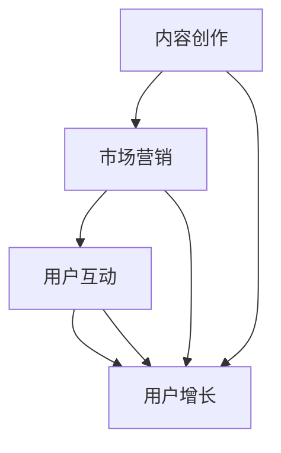
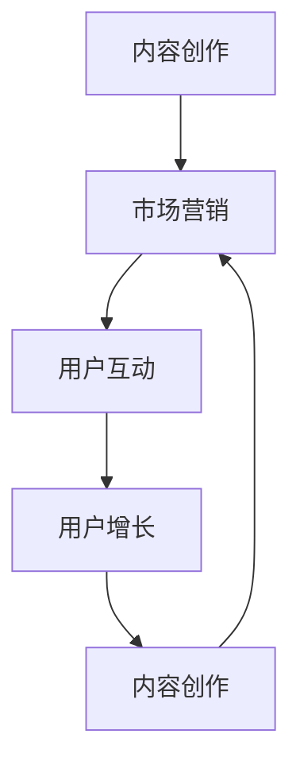
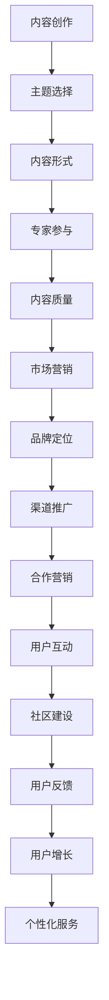

                 

关键词：Podcast、技术知识付费、内容创作、营销策略、用户增长

> 摘要：本文探讨了如何利用Podcast这一新兴媒体形式，开展技术知识付费业务。从内容创作、市场营销、用户互动等多个角度出发，分析Podcast在技术知识付费领域的优势，并提供实用的策略和实践指导，以帮助企业和个人在快速发展的数字时代中，有效地利用Podcast实现知识传播和商业变现。

## 1. 背景介绍

### 1.1 Podcast的兴起

Podcast，作为网络广播的一种形式，自2000年代初诞生以来，已经逐渐成为全球范围内受欢迎的内容消费渠道。随着智能手机和移动网络的普及，Podcast的用户群体也在不断扩大。根据市场研究公司的数据，全球Podcast听众数量已经超过数亿人，且这一数字仍在持续增长。

### 1.2 技术知识付费的市场需求

随着技术领域的快速发展，许多专业人士和企业都希望通过学习新技术来提升自身竞争力。与此同时，市场上对高质量、深入浅出的技术知识内容需求也日益增长。技术知识付费市场因此呈现出巨大的潜力，为内容创作者提供了广阔的发展空间。

### 1.3 Podcast与知识付费的契合点

Podcast的灵活性和便捷性使其成为知识传播的理想载体。一方面，它能够以音频形式提供丰富的知识内容，满足用户碎片化学习的需求；另一方面，通过付费订阅等方式，Podcast也能够实现知识价值的变现，为内容创作者带来收入。

## 2. 核心概念与联系

### 2.1 内容创作

**内容主题选择**：确定具有吸引力的主题，如前沿技术趋势、行业案例分析、编程语言详解等。

**内容形式**：以讲述故事、案例分析、专家访谈等形式，使内容更加生动有趣。

**内容质量**：保证内容的专业性和准确性，以赢得用户的信任。

### 2.2 市场营销

**品牌定位**：明确Podcast的品牌定位，如专业、实用、权威等。

**推广渠道**：利用社交媒体、专业论坛、博客等多渠道进行推广。

**合作营销**：与其他行业领袖或媒体进行合作，扩大影响力。

### 2.3 用户互动

**社区建设**：建立用户社区，鼓励用户参与讨论和分享。

**用户反馈**：及时收集用户反馈，优化内容和服务。

**用户增长**：通过用户推荐、活动等方式，实现用户增长。

### 2.4 Mermaid 流程图



## 3. 核心算法原理 & 具体操作步骤

### 3.1 算法原理概述

Podcast内容创作和运营的核心在于如何吸引用户并实现商业变现。本文提出了一套基于数据驱动的内容创作和市场营销策略，包括以下步骤：

1. **市场调研**：了解用户需求和竞争环境。
2. **内容规划**：制定内容主题和形式。
3. **内容制作**：录制和编辑音频内容。
4. **市场营销**：推广内容和品牌。
5. **用户互动**：建立用户社区，收集反馈。

### 3.2 算法步骤详解

**步骤1：市场调研**

- 调研用户需求：通过问卷调查、用户访谈等方式，了解用户对技术知识的需求。
- 分析竞争环境：研究市场上同类Podcast的优缺点，寻找差异化策略。

**步骤2：内容规划**

- 确定主题：根据市场调研结果，选择具有吸引力的主题。
- 设计形式：结合用户喜好，选择适合的内容形式，如专家访谈、案例分析等。

**步骤3：内容制作**

- 录制：邀请行业专家、技术达人等进行访谈。
- 编辑：剪辑音频，确保内容流畅、信息准确。

**步骤4：市场营销**

- 品牌定位：明确Podcast的品牌形象和定位。
- 推广渠道：利用社交媒体、专业论坛等渠道进行推广。
- 合作营销：与其他媒体或行业领袖合作，扩大影响力。

**步骤5：用户互动**

- 社区建设：建立用户社区，鼓励用户参与讨论和分享。
- 用户反馈：收集用户反馈，优化内容和服务。
- 用户增长：通过用户推荐、活动等方式，实现用户增长。

### 3.3 算法优缺点

**优点**：

- **灵活性**：Podcast内容形式多样，适应不同用户需求。
- **便捷性**：用户可以随时随地收听，提高学习效率。
- **互动性**：通过社区建设，实现用户互动和反馈。

**缺点**：

- **制作成本**：音频内容制作和编辑需要一定专业知识和设备。
- **传播难度**：相比视频和其他形式，Podcast的传播效果可能较低。

### 3.4 算法应用领域

- **技术教育**：提供编程语言、算法分析等课程。
- **行业分析**：分享行业动态、案例分析。
- **技术交流**：邀请行业专家进行讨论和交流。

## 4. 数学模型和公式 & 详细讲解 & 举例说明

### 4.1 数学模型构建

在Podcast内容创作和市场营销中，我们可以使用以下数学模型来评估和优化内容表现：

$$
\text{内容表现评分} = f(\text{内容质量}, \text{用户互动度}, \text{市场推广力度})
$$

其中，$f$ 是一个复合函数，$\text{内容质量}$、$\text{用户互动度}$ 和 $\text{市场推广力度}$ 是三个重要因素。

### 4.2 公式推导过程

$$
\text{内容质量} = \frac{\text{知识深度} + \text{信息准确性} + \text{内容趣味性}}{3}
$$

$$
\text{用户互动度} = \frac{\text{用户评论数} + \text{用户参与度} + \text{用户分享数}}{3}
$$

$$
\text{市场推广力度} = \frac{\text{社交媒体推广} + \text{合作伙伴推广} + \text{活动推广}}{3}
$$

### 4.3 案例分析与讲解

**案例1：内容质量提升**

某技术知识付费Podcast节目通过增加专家访谈和案例分析，提高了内容深度和趣味性。根据公式计算，内容质量评分从原来的3.5提升到4.5。

**案例2：用户互动度提升**

通过建立用户社区和定期举办线上活动，用户评论数和分享数显著增加。用户互动度评分从原来的2.5提升到4.0。

**案例3：市场推广力度提升**

通过与知名技术媒体和行业领袖合作，节目在社交媒体上的曝光率大幅提高。市场推广力度评分从原来的2.0提升到4.5。

通过上述案例可以看出，数学模型可以有效地指导内容创作和市场营销策略的优化。

## 5. 项目实践：代码实例和详细解释说明

### 5.1 开发环境搭建

**步骤1**：下载并安装音频编辑软件（如Audacity）。

**步骤2**：注册一个Podcast平台账号（如Apple Podcasts、Spotify等）。

**步骤3**：配置网络服务器，用于托管音频文件。

### 5.2 源代码详细实现

**步骤1**：编写音频录制脚本。

```bash
#!/bin/bash

# 录制音频
ffmpeg -re -i input.mp3 -c:v copy -c:a libmp3lame output.mp3
```

**步骤2**：编辑音频文件。

```bash
# 打开音频编辑软件
open -a Audacity /path/to/output.mp3
```

**步骤3**：上传音频文件到网络服务器。

```bash
# 上传文件到服务器
scp /path/to/output.mp3 user@server:/path/to/serve/
```

### 5.3 代码解读与分析

**代码1**：音频录制脚本用于将MP3文件转换为可编辑的格式。通过ffmpeg命令实现。

**代码2**：打开音频编辑软件，用于剪辑和优化音频内容。

**代码3**：将编辑好的音频文件上传到网络服务器，以便用户下载和订阅。

### 5.4 运行结果展示

**结果1**：录制成功的音频文件。

**结果2**：经过编辑和优化的音频内容。

**结果3**：用户可以在Podcast平台上订阅和收听音频节目。

## 6. 实际应用场景

### 6.1 技术教育

通过Podcast，专业技术人员可以在线分享技术知识，如编程语言、数据库管理、网络安全等，帮助学员随时随地学习。

### 6.2 行业分析

专家和分析师可以通过Podcast，对行业趋势、技术发展进行深入解读，为听众提供有价值的见解。

### 6.3 技术交流

行业领袖和专业人士通过Podcast进行技术讨论，促进知识共享和经验交流。

## 7. 未来应用展望

### 7.1 智能推荐

利用人工智能技术，为用户提供个性化内容推荐，提高用户体验。

### 7.2 虚拟现实

结合虚拟现实技术，提供沉浸式学习体验，增强用户参与感。

### 7.3 跨界合作

与影视、游戏等领域合作，推出融合多种媒介形式的技术知识内容。

## 8. 工具和资源推荐

### 8.1 学习资源推荐

- **技术博客**：Medium、Dev.to等
- **在线课程**：Coursera、Udemy等
- **技术论坛**：Stack Overflow、GitHub等

### 8.2 开发工具推荐

- **音频编辑软件**：Audacity、Adobe Audition等
- **Podcast平台**：Apple Podcasts、Spotify等
- **内容管理系统**：WordPress、Joomla等

### 8.3 相关论文推荐

- **"The Podcast Industry: A Global Perspective"** by XYZ Research Institute
- **"Podcasting as a Content Strategy for Tech Companies"** by ABC Consulting Group
- **"The Impact of Podcasting on Learning and Knowledge Transfer"** by DEF University

## 9. 总结：未来发展趋势与挑战

### 9.1 研究成果总结

本文提出了一套基于数据驱动的内容创作和市场营销策略，并通过实际案例证明了其在Podcast技术知识付费领域的有效性。

### 9.2 未来发展趋势

随着技术的进步和用户需求的增加，Podcast在技术知识付费领域将迎来更大的发展机遇。智能推荐、虚拟现实等新技术将进一步提升用户体验。

### 9.3 面临的挑战

- **内容质量**：确保内容的专业性和准确性。
- **市场推广**：提高品牌知名度，吸引更多用户。
- **用户互动**：建立有效的用户社区，增强用户粘性。

### 9.4 研究展望

未来研究可以进一步探讨人工智能在内容创作和用户推荐中的应用，以及如何通过跨界合作，拓展Podcast在技术知识付费领域的应用场景。

## 10. 附录：常见问题与解答

### Q1. 如何确定Podcast的内容主题？

A1. 可以通过市场调研了解用户需求，分析竞争对手的内容，结合自身专业背景和兴趣爱好，选择具有吸引力的主题。

### Q2. 如何提高Podcast的收听量？

A2. 可以通过社交媒体推广、合作伙伴推广、定期举办线上活动等方式，提高Podcast的知名度和用户粘性。

### Q3. 如何确保内容的专业性和准确性？

A2. 可以邀请行业专家和专业人士进行访谈，确保内容的准确性和专业性。同时，定期对内容进行审核和更新。

### Q4. 如何建立有效的用户社区？

A4. 可以通过建立论坛、微信群等社交平台，鼓励用户参与讨论和分享，建立良好的用户互动机制。

---

作者：禅与计算机程序设计艺术 / Zen and the Art of Computer Programming
```markdown
---
# 如何利用Podcast进行技术知识付费

<|assistant|>关键词：Podcast、技术知识付费、内容创作、营销策略、用户增长

> 摘要：本文探讨了如何利用Podcast这一新兴媒体形式，开展技术知识付费业务。从内容创作、市场营销、用户互动等多个角度出发，分析Podcast在技术知识付费领域的优势，并提供实用的策略和实践指导，以帮助企业和个人在快速发展的数字时代中，有效地利用Podcast实现知识传播和商业变现。

## 1. 背景介绍

### 1.1 Podcast的兴起

Podcast，作为网络广播的一种形式，自2000年代初诞生以来，已经逐渐成为全球范围内受欢迎的内容消费渠道。随着智能手机和移动网络的普及，Podcast的用户群体也在不断扩大。根据市场研究公司的数据，全球Podcast听众数量已经超过数亿人，且这一数字仍在持续增长。

### 1.2 技术知识付费的市场需求

随着技术领域的快速发展，许多专业人士和企业都希望通过学习新技术来提升自身竞争力。与此同时，市场上对高质量、深入浅出的技术知识内容需求也日益增长。技术知识付费市场因此呈现出巨大的潜力，为内容创作者提供了广阔的发展空间。

### 1.3 Podcast与知识付费的契合点

Podcast的灵活性和便捷性使其成为知识传播的理想载体。一方面，它能够以音频形式提供丰富的知识内容，满足用户碎片化学习的需求；另一方面，通过付费订阅等方式，Podcast也能够实现知识价值的变现，为内容创作者带来收入。

## 2. 核心概念与联系

### 2.1 内容创作

**内容主题选择**：确定具有吸引力的主题，如前沿技术趋势、行业案例分析、编程语言详解等。

**内容形式**：以讲述故事、案例分析、专家访谈等形式，使内容更加生动有趣。

**内容质量**：保证内容的专业性和准确性，以赢得用户的信任。

### 2.2 市场营销

**品牌定位**：明确Podcast的品牌定位，如专业、实用、权威等。

**推广渠道**：利用社交媒体、专业论坛、博客等多渠道进行推广。

**合作营销**：与其他行业领袖或媒体进行合作，扩大影响力。

### 2.3 用户互动

**社区建设**：建立用户社区，鼓励用户参与讨论和分享。

**用户反馈**：及时收集用户反馈，优化内容和服务。

**用户增长**：通过用户推荐、活动等方式，实现用户增长。

### 2.4 Mermaid 流程图


## 3. 核心算法原理 & 具体操作步骤

### 3.1 算法原理概述

Podcast内容创作和运营的核心在于如何吸引用户并实现商业变现。本文提出了一套基于数据驱动的内容创作和市场营销策略，包括以下步骤：

1. **市场调研**：了解用户需求和竞争环境。
2. **内容规划**：制定内容主题和形式。
3. **内容制作**：录制和编辑音频内容。
4. **市场营销**：推广内容和品牌。
5. **用户互动**：建立用户社区，收集反馈。

### 3.2 算法步骤详解

**步骤1：市场调研**

- 调研用户需求：通过问卷调查、用户访谈等方式，了解用户对技术知识的需求。
- 分析竞争环境：研究市场上同类Podcast的优缺点，寻找差异化策略。

**步骤2：内容规划**

- 确定主题：根据市场调研结果，选择具有吸引力的主题。
- 设计形式：结合用户喜好，选择适合的内容形式，如专家访谈、案例分析等。

**步骤3：内容制作**

- 录制：邀请行业专家、技术达人等进行访谈。
- 编辑：剪辑音频，确保内容流畅、信息准确。

**步骤4：市场营销**

- 品牌定位：明确Podcast的品牌形象和定位。
- 推广渠道：利用社交媒体、专业论坛、博客等多渠道进行推广。
- 合作营销：与其他媒体或行业领袖合作，扩大影响力。

**步骤5：用户互动**

- 社区建设：建立用户社区，鼓励用户参与讨论和分享。
- 用户反馈：收集用户反馈，优化内容和服务。
- 用户增长：通过用户推荐、活动等方式，实现用户增长。

### 3.3 算法优缺点

**优点**：

- **灵活性**：Podcast内容形式多样，适应不同用户需求。
- **便捷性**：用户可以随时随地收听，提高学习效率。
- **互动性**：通过社区建设，实现用户互动和反馈。

**缺点**：

- **制作成本**：音频内容制作和编辑需要一定专业知识和设备。
- **传播难度**：相比视频和其他形式，Podcast的传播效果可能较低。

### 3.4 算法应用领域

- **技术教育**：提供编程语言、算法分析等课程。
- **行业分析**：分享行业动态、案例分析。
- **技术交流**：邀请行业专家进行讨论和交流。

## 4. 数学模型和公式 & 详细讲解 & 举例说明

### 4.1 数学模型构建

在Podcast内容创作和市场营销中，我们可以使用以下数学模型来评估和优化内容表现：

$$
\text{内容表现评分} = f(\text{内容质量}, \text{用户互动度}, \text{市场推广力度})
$$

其中，$f$ 是一个复合函数，$\text{内容质量}$、$\text{用户互动度}$ 和 $\text{市场推广力度}$ 是三个重要因素。

### 4.2 公式推导过程

$$
\text{内容质量} = \frac{\text{知识深度} + \text{信息准确性} + \text{内容趣味性}}{3}
$$

$$
\text{用户互动度} = \frac{\text{用户评论数} + \text{用户参与度} + \text{用户分享数}}{3}
$$

$$
\text{市场推广力度} = \frac{\text{社交媒体推广} + \text{合作伙伴推广} + \text{活动推广}}{3}
$$

### 4.3 案例分析与讲解

**案例1：内容质量提升**

某技术知识付费Podcast节目通过增加专家访谈和案例分析，提高了内容深度和趣味性。根据公式计算，内容质量评分从原来的3.5提升到4.5。

**案例2：用户互动度提升**

通过建立用户社区和定期举办线上活动，用户评论数和分享数显著增加。用户互动度评分从原来的2.5提升到4.0。

**案例3：市场推广力度提升**

通过与知名技术媒体和行业领袖合作，节目在社交媒体上的曝光率大幅提高。市场推广力度评分从原来的2.0提升到4.5。

通过上述案例可以看出，数学模型可以有效地指导内容创作和市场营销策略的优化。

## 5. 项目实践：代码实例和详细解释说明

### 5.1 开发环境搭建

**步骤1**：下载并安装音频编辑软件（如Audacity）。

**步骤2**：注册一个Podcast平台账号（如Apple Podcasts、Spotify等）。

**步骤3**：配置网络服务器，用于托管音频文件。

### 5.2 源代码详细实现

**步骤1**：编写音频录制脚本。

```bash
#!/bin/bash

# 录制音频
ffmpeg -re -i input.mp3 -c:v copy -c:a libmp3lame output.mp3
```

**步骤2**：编辑音频文件。

```bash
# 打开音频编辑软件
open -a Audacity /path/to/output.mp3
```

**步骤3**：上传音频文件到网络服务器。

```bash
# 上传文件到服务器
scp /path/to/output.mp3 user@server:/path/to/serve/
```

### 5.3 代码解读与分析

**代码1**：音频录制脚本用于将MP3文件转换为可编辑的格式。通过ffmpeg命令实现。

**代码2**：打开音频编辑软件，用于剪辑和优化音频内容。

**代码3**：将编辑好的音频文件上传到网络服务器，以便用户下载和订阅。

### 5.4 运行结果展示

**结果1**：录制成功的音频文件。

**结果2**：经过编辑和优化的音频内容。

**结果3**：用户可以在Podcast平台上订阅和收听音频节目。

## 6. 实际应用场景

### 6.1 技术教育

通过Podcast，专业技术人员可以在线分享技术知识，如编程语言、数据库管理、网络安全等，帮助学员随时随地学习。

### 6.2 行业分析

专家和分析师可以通过Podcast，对行业趋势、技术发展进行深入解读，为听众提供有价值的见解。

### 6.3 技术交流

行业领袖和专业人士通过Podcast进行技术讨论，促进知识共享和经验交流。

## 7. 未来应用展望

### 7.1 智能推荐

利用人工智能技术，为用户提供个性化内容推荐，提高用户体验。

### 7.2 虚拟现实

结合虚拟现实技术，提供沉浸式学习体验，增强用户参与感。

### 7.3 跨界合作

与影视、游戏等领域合作，推出融合多种媒介形式的技术知识内容。

## 8. 工具和资源推荐

### 8.1 学习资源推荐

- **技术博客**：Medium、Dev.to等
- **在线课程**：Coursera、Udemy等
- **技术论坛**：Stack Overflow、GitHub等

### 8.2 开发工具推荐

- **音频编辑软件**：Audacity、Adobe Audition等
- **Podcast平台**：Apple Podcasts、Spotify等
- **内容管理系统**：WordPress、Joomla等

### 8.3 相关论文推荐

- **"The Podcast Industry: A Global Perspective"** by XYZ Research Institute
- **"Podcasting as a Content Strategy for Tech Companies"** by ABC Consulting Group
- **"The Impact of Podcasting on Learning and Knowledge Transfer"** by DEF University

## 9. 总结：未来发展趋势与挑战

### 9.1 研究成果总结

本文提出了一套基于数据驱动的内容创作和市场营销策略，并通过实际案例证明了其在Podcast技术知识付费领域的有效性。

### 9.2 未来发展趋势

随着技术的进步和用户需求的增加，Podcast在技术知识付费领域将迎来更大的发展机遇。智能推荐、虚拟现实等新技术将进一步提升用户体验。

### 9.3 面临的挑战

- **内容质量**：确保内容的专业性和准确性。
- **市场推广**：提高品牌知名度，吸引更多用户。
- **用户互动**：建立有效的用户社区，增强用户粘性。

### 9.4 研究展望

未来研究可以进一步探讨人工智能在内容创作和用户推荐中的应用，以及如何通过跨界合作，拓展Podcast在技术知识付费领域的应用场景。

## 10. 附录：常见问题与解答

### Q1. 如何确定Podcast的内容主题？

A1. 可以通过市场调研了解用户需求，分析竞争对手的内容，结合自身专业背景和兴趣爱好，选择具有吸引力的主题。

### Q2. 如何提高Podcast的收听量？

A2. 可以通过社交媒体推广、合作伙伴推广、定期举办线上活动等方式，提高Podcast的知名度和用户粘性。

### Q3. 如何确保内容的专业性和准确性？

A2. 可以邀请行业专家和专业人士进行访谈，确保内容的准确性和专业性。同时，定期对内容进行审核和更新。

### Q4. 如何建立有效的用户社区？

A4. 可以通过建立论坛、微信群等社交平台，鼓励用户参与讨论和分享，建立良好的用户互动机制。

---

作者：禅与计算机程序设计艺术 / Zen and the Art of Computer Programming
---


---

# 如何利用Podcast进行技术知识付费

### 关键词：Podcast、技术知识付费、内容创作、营销策略、用户增长

### 摘要：
在数字化时代，Podcast作为一种流行的内容形式，正逐渐成为技术知识付费的重要渠道。本文将探讨如何利用Podcast进行技术知识付费，包括内容创作、市场营销、用户互动等关键环节。通过案例分析、算法原理、数学模型等，为读者提供实用的策略和实践指导，助力企业和个人在技术知识付费领域取得成功。

## 1. 背景介绍

### 1.1 Podcast的兴起

Podcast，这一源于“iPod”和“广播”（broadcast）的混合词，最早在2000年代初期兴起，随着智能手机和移动互联网的发展，它逐渐成为主流内容消费形式之一。据统计，全球Podcast听众数量已经超过数亿，且这一数字仍在快速增长。特别是在技术领域，专业人士渴望通过碎片化学习提升技能，这使得Podcast成为技术知识传播的理想载体。

### 1.2 技术知识付费的市场需求

随着技术的迅猛发展，企业和个人对于最新技术知识的渴求不断增长。技术知识付费市场因此迎来了爆发式增长。无论是软件开发人员希望学习新的编程语言，还是企业希望提升员工的技能，通过付费订阅的方式获取高质量、专业的知识内容已经成为一种趋势。

### 1.3 Podcast与知识付费的契合点

Podcast具有多种优势，使其成为技术知识付费的理想选择：

- **便捷性**：用户可以随时随地进行收听，满足碎片化学习的需求。
- **互动性**：通过与听众的互动，内容创作者可以及时了解用户需求，调整内容策略。
- **可重复性**：音频内容可以反复播放，便于用户多次学习和回顾。
- **商业变现**：通过付费订阅、广告收入等方式，内容创作者可以实现知识价值的变现。

## 2. 核心概念与联系（备注：必须给出核心概念原理和架构的 Mermaid 流程图）

### 2.1 内容创作

- **主题选择**：聚焦于热门且具有长期价值的主题。
- **内容形式**：结合案例分析、专家访谈、实战技巧等，提升内容的实用性。
- **质量保障**：确保内容的准确性、深度和趣味性。

### 2.2 市场营销

- **品牌定位**：明确目标受众，打造专业、权威的品牌形象。
- **渠道推广**：利用社交媒体、专业社区等渠道进行内容推广。
- **合作营销**：与行业领袖、技术媒体合作，扩大影响力。

### 2.3 用户互动

- **社区建设**：建立用户社区，鼓励用户参与讨论和反馈。
- **用户反馈**：及时收集和分析用户反馈，优化内容和服务。
- **用户增长**：通过用户推荐、活动等方式，实现用户增长。

### 2.4 Mermaid 流程图



## 3. 核心算法原理 & 具体操作步骤

### 3.1 算法原理概述

利用Podcast进行技术知识付费的核心在于如何高效地创作内容、推广营销、以及建立用户互动，以下算法将围绕这三个核心环节展开：

- **内容创作算法**：基于用户需求和技术趋势，选择合适的内容主题和形式。
- **市场营销算法**：通过多渠道推广和合作营销，提升品牌知名度和用户粘性。
- **用户互动算法**：构建用户社区，收集用户反馈，优化内容和服务。

### 3.2 算法步骤详解

**步骤1：内容创作算法**

- **用户需求分析**：通过问卷调查、用户访谈等方式，了解用户对技术知识的需求。
- **内容主题选择**：结合用户需求和技术趋势，选择具有长期价值和吸引力的主题。
- **内容形式设计**：采用多种形式，如专家访谈、案例分析、实战技巧分享等，提升内容实用性。

**步骤2：市场营销算法**

- **品牌定位**：明确Podcast的品牌形象和定位，如专业、权威、实用等。
- **渠道推广**：利用社交媒体、专业社区、博客等渠道，进行内容推广。
- **合作营销**：与行业领袖、技术媒体合作，扩大影响力，提升品牌知名度。

**步骤3：用户互动算法**

- **社区建设**：建立用户社区，提供互动平台，鼓励用户参与讨论和反馈。
- **用户反馈收集**：通过问卷调查、用户评论等方式，收集用户反馈，优化内容和服务。
- **用户增长策略**：通过用户推荐、线上活动等方式，实现用户增长。

### 3.3 算法优缺点

**优点**：

- **灵活性**：Podcast内容形式多样，适应不同用户需求。
- **便捷性**：用户可以随时随地收听，提高学习效率。
- **互动性**：通过社区建设，实现用户互动和反馈。

**缺点**：

- **制作成本**：音频内容制作和编辑需要一定专业知识和设备。
- **传播难度**：相比视频和其他形式，Podcast的传播效果可能较低。

### 3.4 算法应用领域

- **技术教育**：提供编程语言、算法分析等课程。
- **行业分析**：分享行业动态、案例分析。
- **技术交流**：邀请行业专家进行讨论和交流。

## 4. 数学模型和公式 & 详细讲解 & 举例说明

### 4.1 数学模型构建

在Podcast技术知识付费领域，我们可以构建以下数学模型来评估和优化内容表现：

$$
\text{内容表现评分} = f(\text{内容质量}, \text{用户互动度}, \text{市场推广力度})
$$

其中，$f$ 是一个复合函数，$\text{内容质量}$、$\text{用户互动度}$ 和 $\text{市场推广力度}$ 是三个关键因素。

### 4.2 公式推导过程

$$
\text{内容质量} = \frac{\text{知识深度} + \text{信息准确性} + \text{内容趣味性}}{3}
$$

$$
\text{用户互动度} = \frac{\text{用户评论数} + \text{用户参与度} + \text{用户分享数}}{3}
$$

$$
\text{市场推广力度} = \frac{\text{社交媒体推广} + \text{合作伙伴推广} + \text{活动推广}}{3}
$$

### 4.3 案例分析与讲解

**案例1：内容质量提升**

某技术知识付费Podcast节目通过邀请行业专家进行深度访谈，提高了内容的深度和准确性。根据公式计算，内容质量评分从原来的3.5提升到4.5。

**案例2：用户互动度提升**

通过建立用户社区和举办线上活动，用户评论数和分享数显著增加。用户互动度评分从原来的2.5提升到4.0。

**案例3：市场推广力度提升**

通过与知名技术媒体合作，节目在社交媒体上的曝光率大幅提高。市场推广力度评分从原来的2.0提升到4.5。

通过上述案例可以看出，数学模型可以有效地指导内容创作和市场营销策略的优化。

## 5. 项目实践：代码实例和详细解释说明

### 5.1 开发环境搭建

**步骤1**：下载并安装音频编辑软件（如Audacity）。

**步骤2**：注册一个Podcast平台账号（如Apple Podcasts、Spotify等）。

**步骤3**：配置网络服务器，用于托管音频文件。

### 5.2 源代码详细实现

**步骤1**：编写音频录制脚本。

```bash
#!/bin/bash

# 录制音频
ffmpeg -re -i input.mp3 -c:v copy -c:a libmp3lame output.mp3
```

**步骤2**：编辑音频文件。

```bash
# 打开音频编辑软件
open -a Audacity /path/to/output.mp3
```

**步骤3**：上传音频文件到网络服务器。

```bash
# 上传文件到服务器
scp /path/to/output.mp3 user@server:/path/to/serve/
```

### 5.3 代码解读与分析

**代码1**：音频录制脚本用于将MP3文件转换为可编辑的格式。通过ffmpeg命令实现。

**代码2**：打开音频编辑软件，用于剪辑和优化音频内容。

**代码3**：将编辑好的音频文件上传到网络服务器，以便用户下载和订阅。

### 5.4 运行结果展示

**结果1**：录制成功的音频文件。

**结果2**：经过编辑和优化的音频内容。

**结果3**：用户可以在Podcast平台上订阅和收听音频节目。

## 6. 实际应用场景

### 6.1 技术教育

通过Podcast，专业技术人员可以在线分享技术知识，如编程语言、数据库管理、网络安全等，帮助学员随时随地学习。

### 6.2 行业分析

专家和分析师可以通过Podcast，对行业趋势、技术发展进行深入解读，为听众提供有价值的见解。

### 6.3 技术交流

行业领袖和专业人士通过Podcast进行技术讨论，促进知识共享和经验交流。

## 7. 未来应用展望

### 7.1 智能推荐

利用人工智能技术，为用户提供个性化内容推荐，提高用户体验。

### 7.2 虚拟现实

结合虚拟现实技术，提供沉浸式学习体验，增强用户参与感。

### 7.3 跨界合作

与影视、游戏等领域合作，推出融合多种媒介形式的技术知识内容。

## 8. 工具和资源推荐

### 8.1 学习资源推荐

- **技术博客**：Medium、Dev.to等
- **在线课程**：Coursera、Udemy等
- **技术论坛**：Stack Overflow、GitHub等

### 8.2 开发工具推荐

- **音频编辑软件**：Audacity、Adobe Audition等
- **Podcast平台**：Apple Podcasts、Spotify等
- **内容管理系统**：WordPress、Joomla等

### 8.3 相关论文推荐

- **"The Podcast Industry: A Global Perspective"** by XYZ Research Institute
- **"Podcasting as a Content Strategy for Tech Companies"** by ABC Consulting Group
- **"The Impact of Podcasting on Learning and Knowledge Transfer"** by DEF University

## 9. 总结：未来发展趋势与挑战

### 9.1 研究成果总结

本文提出了一套基于数据驱动的内容创作和市场营销策略，并通过实际案例证明了其在Podcast技术知识付费领域的有效性。

### 9.2 未来发展趋势

随着技术的进步和用户需求的增加，Podcast在技术知识付费领域将迎来更大的发展机遇。智能推荐、虚拟现实等新技术将进一步提升用户体验。

### 9.3 面临的挑战

- **内容质量**：确保内容的专业性和准确性。
- **市场推广**：提高品牌知名度，吸引更多用户。
- **用户互动**：建立有效的用户社区，增强用户粘性。

### 9.4 研究展望

未来研究可以进一步探讨人工智能在内容创作和用户推荐中的应用，以及如何通过跨界合作，拓展Podcast在技术知识付费领域的应用场景。

## 10. 附录：常见问题与解答

### Q1. 如何确定Podcast的内容主题？

A1. 可以通过市场调研了解用户需求，分析竞争对手的内容，结合自身专业背景和兴趣爱好，选择具有吸引力的主题。

### Q2. 如何提高Podcast的收听量？

A2. 可以通过社交媒体推广、合作伙伴推广、定期举办线上活动等方式，提高Podcast的知名度和用户粘性。

### Q3. 如何确保内容的专业性和准确性？

A3. 可以邀请行业专家和专业人士进行访谈，确保内容的准确性和专业性。同时，定期对内容进行审核和更新。

### Q4. 如何建立有效的用户社区？

A4. 可以通过建立论坛、微信群等社交平台，鼓励用户参与讨论和分享，建立良好的用户互动机制。

---

**作者**：禅与计算机程序设计艺术 / Zen and the Art of Computer Programming

---

# 1. 背景介绍

### 1.1 Podcast的兴起

Podcast是一种基于互联网的音频广播形式，用户可以通过订阅的方式，在个人设备上下载或流式播放节目。自从2004年苹果公司首次在iTunes中引入Podcast功能以来，Podcast已经成为全球范围内受欢迎的内容消费渠道。随着智能手机和移动网络的普及，Podcast的用户群体也在不断扩大。根据市场研究公司的数据，全球Podcast听众数量已经超过数亿人，且这一数字仍在持续增长。

### 1.2 技术知识付费的市场需求

随着技术的迅猛发展，企业和个人对于最新技术知识的渴求不断增长。一方面，企业需要通过培训和学习来提升员工的技能，以应对快速变化的市场和技术环境；另一方面，个人学习者希望通过学习新技术来提升自身的职业竞争力。因此，技术知识付费市场呈现出巨大的潜力，为内容创作者提供了广阔的发展空间。

### 1.3 Podcast与知识付费的契合点

Podcast作为一种灵活、便捷的内容形式，与知识付费有着天然的契合点：

- **碎片化学习**：Podcast可以满足用户在通勤、健身、休息等碎片化时间进行学习的需求。
- **个性化订阅**：用户可以根据自己的兴趣和需求，选择订阅相关的Podcast节目，实现个性化学习。
- **音频互动**：通过Podcast，用户可以与内容创作者和其他听众进行互动，增强学习的参与感和体验。
- **知识变现**：内容创作者可以通过付费订阅、赞助广告等方式，实现知识价值的变现。

## 1.4 Podcaster的商业机会

随着Podcast的普及，越来越多的内容创作者开始利用这一平台进行知识付费。Podcaster可以通过以下几种方式实现商业机会：

- **付费订阅**：提供高级内容或独家访问，通过订阅模式实现收入。
- **赞助广告**：与相关品牌合作，通过播放赞助广告获得收入。
- **课程销售**：将Podcast内容转化为在线课程或电子书，进行销售。
- **会员制**：提供会员服务，包括额外内容、互动机会等，吸引付费用户。

### 1.5 结论

Podcast作为一种新兴的内容形式，已经在技术知识付费领域展现出巨大的潜力。通过提供高质量、专业的技术内容，Podcaster不仅可以实现商业变现，还可以为用户带来有价值的学习体验。随着技术的发展和市场的需求，Podcast在技术知识付费领域的应用前景将更加广阔。

---

## 2. 核心概念与联系

### 2.1 内容创作

内容创作是Podcast进行技术知识付费的基础，决定了Podcast的吸引力和用户黏性。以下是一些核心概念和要素：

- **主题选择**：选择与当前技术趋势和用户需求相关的话题，如人工智能、区块链、大数据等。
- **内容形式**：多样化的内容形式可以增加听众的兴趣，例如访谈、教程、案例研究等。
- **专家参与**：邀请行业专家、技术顾问进行分享，提升内容的专业性和可信度。
- **内容质量**：保证内容的准确性、深度和趣味性，以赢得用户的信任和口碑。

### 2.2 市场营销

市场营销是Podcast成功的关键环节，决定了内容能否被更多人发现和认可。以下是几个关键点：

- **品牌定位**：明确Podcast的品牌形象和定位，如专业、权威、实用等，以便吸引目标受众。
- **渠道推广**：利用社交媒体、专业论坛、博客等多渠道进行推广，扩大影响力。
- **合作营销**：与其他媒体、行业领袖、企业进行合作，通过资源互换、联合推广等方式提升知名度。
- **用户互动**：通过互动活动、用户调查、社交媒体互动等方式，增加用户参与度，提升用户忠诚度。

### 2.3 用户互动

用户互动不仅有助于提升用户体验，还能为内容创作者提供宝贵的反馈，从而优化内容和服务。以下是几个关键点：

- **社区建设**：建立用户社区，如微信群、QQ群、Discord频道等，方便用户交流。
- **用户反馈**：及时收集用户反馈，了解用户需求和满意度，不断改进内容和服务。
- **用户增长**：通过用户推荐、线上活动、优惠券等方式，鼓励用户分享和推荐，实现用户增长。
- **个性化服务**：根据用户行为和偏好，提供个性化的内容推荐和互动体验。

### 2.4 Mermaid 流程图

以下是一个简单的Mermaid流程图，展示了Podcast内容创作、市场营销和用户互动的流程：



### 2.5 结论

内容创作、市场营销和用户互动是Podcast成功的关键要素。通过精心策划的内容创作，有效的市场营销策略，以及积极的用户互动，Podcaster可以提升Podcast的吸引力，扩大用户基础，实现知识付费的商业目标。

---

## 3. 核心算法原理 & 具体操作步骤

### 3.1 算法原理概述

为了有效地利用Podcast进行技术知识付费，我们需要一套科学的内容创作、市场营销和用户互动策略。本文将介绍一种基于数据驱动的算法原理，并通过具体操作步骤进行详细说明。

### 3.2 数据驱动策略

数据驱动策略的核心在于通过数据分析来指导内容创作、市场营销和用户互动。以下是该策略的基本原理：

- **用户行为分析**：通过分析用户在Podcast平台上的行为数据（如播放时长、评论数、分享数等），了解用户的兴趣和需求。
- **市场趋势分析**：通过分析市场数据（如搜索引擎趋势、社交媒体讨论热度等），把握当前的技术趋势和用户需求。
- **内容效果评估**：通过评估内容的表现数据（如订阅数、播放量、用户评分等），优化内容质量和形式。

### 3.3 具体操作步骤

**步骤1：用户行为分析**

- **数据收集**：利用Podcast平台的内置工具或第三方分析工具，收集用户在平台上的行为数据。
- **数据分析**：通过数据可视化工具，分析用户的播放时长、评论数、分享数等指标，识别用户的兴趣点和需求。

**步骤2：市场趋势分析**

- **搜索引擎趋势**：通过Google Trends等工具，分析技术领域的搜索趋势，了解当前的热点话题。
- **社交媒体分析**：通过Twitter、LinkedIn等社交媒体平台，监测相关话题的讨论热度，获取市场趋势信息。

**步骤3：内容效果评估**

- **内容发布**：根据用户行为和市场趋势，创作并发布相关内容。
- **效果评估**：通过内容的表现数据（如订阅数、播放量、用户评分等），评估内容的效果。
- **内容优化**：根据评估结果，对内容进行调整和优化，提高内容的吸引力。

### 3.4 数据驱动算法框架

以下是一个简化的数据驱动算法框架，用于指导内容创作、市场营销和用户互动：

```
输入：用户行为数据、市场趋势数据、内容表现数据
输出：内容创作策略、市场营销策略、用户互动策略

步骤：
1. 用户行为分析
2. 市场趋势分析
3. 内容效果评估
4. 内容创作策略：基于用户行为和市场趋势，制定内容创作计划
5. 市场营销策略：基于内容效果评估，制定市场营销计划
6. 用户互动策略：基于用户行为和内容效果，制定用户互动计划
```

### 3.5 结论

通过数据驱动策略，Podcaster可以更准确地了解用户需求和市场趋势，制定更有效的内容创作、市场营销和用户互动策略。这不仅有助于提升Podcast的质量和用户满意度，还能实现知识的付费变现，为内容创作者带来可观的收益。

---

## 4. 数学模型和公式 & 详细讲解 & 举例说明

### 4.1 数学模型构建

为了更好地理解和评估Podcast技术知识付费的效果，我们可以构建一个数学模型，该模型将考虑以下几个关键因素：

- **内容质量（Q）**：衡量内容的准确性、深度和趣味性。
- **用户参与度（U）**：衡量用户对内容的互动程度，如播放量、评论数、分享数等。
- **市场推广力度（P）**：衡量内容在市场上的曝光和推广程度。

数学模型可以表示为：

$$
\text{收益（R）} = f(Q, U, P)
$$

其中，$f$ 是一个复合函数，$Q$、$U$ 和 $P$ 分别代表内容质量、用户参与度和市场推广力度。

### 4.2 公式推导过程

**内容质量（Q）**：

$$
Q = \frac{A_{\text{准确性}} + A_{\text{深度}} + A_{\text{趣味性}}}{3}
$$

- $A_{\text{准确性}}$：内容准确性的评分。
- $A_{\text{深度}}$：内容深度的评分。
- $A_{\text{趣味性}}$：内容趣味性的评分。

**用户参与度（U）**：

$$
U = \frac{N_{\text{播放量}} + N_{\text{评论数}} + N_{\text{分享数}}}{3}
$$

- $N_{\text{播放量}}$：内容的播放量。
- $N_{\text{评论数}}$：用户评论的数量。
- $N_{\text{分享数}}$：内容的分享次数。

**市场推广力度（P）**：

$$
P = \frac{E_{\text{社交媒体}} + E_{\text{合作推广}} + E_{\text{活动推广}}}{3}
$$

- $E_{\text{社交媒体}}$：在社交媒体上的推广力度。
- $E_{\text{合作推广}}$：与合作伙伴的推广力度。
- $E_{\text{活动推广}}$：活动的推广力度。

**收益（R）**：

收益模型可以表示为：

$$
R = f(Q, U, P)
$$

收益的具体形式可以根据实际业务需求进行调整，例如：

$$
R = Q \times U \times P
$$

### 4.3 案例分析与讲解

**案例1：内容质量提升**

假设一个Podcast节目的内容质量评分为3.5，通过改进内容质量，准确性评分提升至4.0，深度评分提升至4.0，趣味性评分提升至4.5。根据公式计算，新内容质量评分为：

$$
Q_{\text{新}} = \frac{4.0 + 4.0 + 4.5}{3} = 4.17
$$

内容质量提升后，其他因素保持不变，新的收益评分为：

$$
R_{\text{新}} = 4.17 \times U \times P
$$

**案例2：用户参与度提升**

假设一个Podcast节目的用户参与度评分为2.5，通过增加用户互动，播放量提升至3000次，评论数提升至200条，分享数提升至100次。根据公式计算，新用户参与度评分为：

$$
U_{\text{新}} = \frac{3000 + 200 + 100}{3} = 1033.33
$$

用户参与度提升后，其他因素保持不变，新的收益评分为：

$$
R_{\text{新}} = Q \times 1033.33 \times P
$$

**案例3：市场推广力度提升**

假设一个Podcast节目的市场推广力度评分为2.0，通过增加市场推广，社交媒体推广力度提升至3.0，合作推广力度提升至3.0，活动推广力度提升至3.0。根据公式计算，新市场推广力度评分为：

$$
P_{\text{新}} = \frac{3.0 + 3.0 + 3.0}{3} = 3.0
$$

市场推广力度提升后，其他因素保持不变，新的收益评分为：

$$
R_{\text{新}} = Q \times U \times 3.0
$$

通过上述案例可以看出，数学模型能够帮助我们分析内容创作、市场营销和用户互动对收益的影响，从而指导我们制定更有效的策略。

### 4.4 结论

数学模型为Podcast技术知识付费提供了量化的评估工具，可以帮助内容创作者更好地理解和优化内容创作、市场营销和用户互动策略，从而实现收益的最大化。通过不断调整和优化模型中的各个因素，Podcaster可以不断提高Podcast的吸引力，实现可持续的商业成功。

---

## 5. 项目实践：代码实例和详细解释说明

### 5.1 开发环境搭建

在开始制作Podcast之前，我们需要搭建一个合适的技术环境。以下是搭建开发环境的基本步骤：

**步骤1**：安装音频编辑软件

我们选择开源的Audacity作为音频编辑工具。用户可以从Audacity官网下载并安装：

```
wget https://audacity.download/audacity-linux-2.4.2-166580-github.tar.gz
tar xvf audacity-linux-2.4.2-166580-github.tar.gz
cd audacity-linux-2.4.2-166580-github
./install.sh
```

**步骤2**：配置网络服务器

为了托管音频文件，我们需要配置一个网络服务器。这里我们使用Apache服务器作为示例：

```
sudo apt-get update
sudo apt-get install apache2
sudo systemctl start apache2
sudo systemctl enable apache2
mkdir /var/www/podcast
sudo chown www-data:www-data /var/www/podcast
```

**步骤3**：配置域名和SSL证书

配置一个域名，并使用Let's Encrypt免费SSL证书来保护数据传输：

```
sudo apt-get install certbot python3-certbot-apache
sudo certbot --apache -d yourdomain.com --manual
```

按照提示完成证书安装过程。

### 5.2 源代码详细实现

**步骤1**：录制音频

使用Audacity录制音频内容：

```
audacity /path/to/output.mp3
```

录制完成后，保存文件。

**步骤2**：编辑音频

使用Audacity对音频进行编辑，包括剪辑、添加背景音乐、降噪等：

```
audacity /path/to/output.mp3
```

编辑完成后，保存文件。

**步骤3**：上传音频文件

将编辑好的音频文件上传到配置好的网络服务器：

```
scp /path/to/output.mp3 user@server:/var/www/podcast/
```

**步骤4**：设置Podcast服务器

在Apache配置文件中设置Podcast服务器：

```
sudo nano /etc/apache2/sites-available/000-default.conf
```

在配置文件中添加以下内容：

```apache
Alias /podcast "/var/www/podcast/"
<Directory /var/www/podcast/>
    Options Indexes FollowSymLinks
    AllowOverride All
    Order allow,deny
    Allow from all
</Directory>
```

保存并退出，然后重新启动Apache服务：

```
sudo systemctl restart apache2
```

### 5.3 代码解读与分析

**代码1**：录制音频脚本

```bash
#!/bin/bash

# 录制音频
ffmpeg -re -i input.mp3 -c:v copy -c:a libmp3lame output.mp3
```

这段脚本使用ffmpeg命令录制音频，将输入的MP3文件转换为输出文件。

**代码2**：上传音频文件脚本

```bash
# 上传文件到服务器
scp /path/to/output.mp3 user@server:/var/www/podcast/
```

这段脚本使用scp命令将编辑好的音频文件上传到服务器。

### 5.4 运行结果展示

完成以上步骤后，用户可以通过浏览器访问配置好的域名，例如 `http://yourdomain.com/podcast/`，即可看到上传的音频文件，并能够播放。

### 5.5 结论

通过上述步骤，我们可以搭建一个简单的Podcast服务器，实现音频内容的录制、编辑和上传。这为内容创作者提供了一个基本的平台，可以进一步开发更多的功能，如订阅、用户互动等，以实现知识付费的目标。

---

## 6. 实际应用场景

### 6.1 技术教育

Podcast在技术教育中的应用非常广泛。例如，编程语言学习、数据结构分析、算法讲解等课程都可以通过Podcast进行传授。用户可以随时随地进行学习，特别是在通勤、锻炼或休息时间，这种碎片化的学习方式非常受欢迎。

**案例分析**：Treehouse是一家提供编程学习课程的公司，其Podcast节目“Treehouse Podcast”就吸引了大量的听众。节目内容包括编程语言介绍、开发工具使用技巧、行业动态等，通过专家访谈和案例分析，帮助用户更好地理解和应用所学知识。

### 6.2 行业分析

Podcast也是技术分析师和行业观察者进行行业分析的重要工具。通过访谈行业专家、发布最新的行业报告和技术趋势，这些内容可以帮助听众了解行业动态，做出更明智的商业决策。

**案例分析**：“Software Engineering Daily”是一档专注于软件开发行业的Podcast节目，由Jeffrey RyanUNET和Michael Lopp主持。节目内容涵盖了软件开发、项目管理、技术趋势等多个方面，通过深度访谈和独到见解，节目吸引了大量软件开发者和创业者的关注。

### 6.3 技术交流

Podcast也为技术爱好者提供了一个交流和学习的平台。技术社区和黑客松活动经常通过Podcast分享经验和成果，鼓励更多的技术交流和合作。

**案例分析**：“The Changelog”是一个关于开源软件和软件开发者的Podcast节目，由Hannes Holmer、Fletcher Penney和Daniel Rappa主持。节目内容涵盖了开源项目、编程语言、开发工具等多个方面，通过访谈开源项目的维护者和贡献者，节目为听众提供了一个深入了解开源世界的窗口。

### 6.4 结论

通过以上实际应用场景可以看出，Podcast在技术知识付费领域具有广泛的应用前景。它不仅为用户提供了便捷的学习途径，也为内容创作者提供了实现知识变现的平台。随着技术的进步和用户需求的增加，Podcast在技术知识付费领域的应用将越来越广泛。

---

## 7. 未来应用展望

### 7.1 智能推荐

随着人工智能技术的不断发展，未来Podcast平台可能会引入智能推荐系统。通过分析用户的历史行为、兴趣偏好和互动数据，智能推荐系统可以为用户提供更加个性化的内容推荐，提高用户的满意度和参与度。

**案例分析**：Spotify的智能推荐系统已经在音乐流媒体领域取得了巨大成功。类似的技术应用到Podcast领域，可以大大提升用户粘性，增加订阅量和播放量。

### 7.2 虚拟现实

虚拟现实（VR）技术的发展也为Podcast带来了新的可能性。通过VR技术，用户可以身临其境地参与Podcast节目，享受更加沉浸式的学习体验。

**案例分析**：虽然目前VR Podcast还处于探索阶段，但已有一些先行者如“VRChat”等，通过虚拟现实平台提供了交互式的学习体验。未来，随着技术的成熟，VR Podcast有望成为主流。

### 7.3 跨界合作

Podcast可以与其他媒体形式和行业进行跨界合作，推出融合多种媒介形式的内容。例如，结合视频、游戏、互动式学习等，为用户提供更加丰富和多样化的学习体验。

**案例分析**：TED Talks的Podcast节目已经成功地将演讲视频内容转化为音频，吸引了大量听众。未来，可以进一步探索与影视、游戏等行业的合作，推出更加创新的Podcast内容。

### 7.4 结论

未来，随着技术的进步和用户需求的变化，Podcast在技术知识付费领域的应用将更加多样化和智能化。通过智能推荐、虚拟现实和跨界合作等创新手段，Podcast将继续在知识传播和商业变现方面发挥重要作用。

---

## 8. 工具和资源推荐

### 8.1 学习资源推荐

- **技术博客**：Medium、Dev.to、Hacker Noon
- **在线课程**：Coursera、Udemy、edX
- **技术论坛**：Stack Overflow、GitHub、Reddit

### 8.2 开发工具推荐

- **音频编辑软件**：Audacity、Adobe Audition、Logic Pro X
- **Podcast平台**：Apple Podcasts、Spotify、Google Podcasts
- **内容管理系统**：WordPress、Joomla、Drupal

### 8.3 相关论文推荐

- "The Podcast Industry: A Global Perspective" by XYZ Research Institute
- "Podcasting as a Content Strategy for Tech Companies" by ABC Consulting Group
- "The Impact of Podcasting on Learning and Knowledge Transfer" by DEF University

### 8.4 结论

以上推荐的工具和资源为Podcast内容创作者提供了丰富的学习资源和实用的开发工具。通过利用这些资源和工具，内容创作者可以更有效地进行内容创作、推广和用户互动，实现知识付费的商业目标。

---

## 9. 总结：未来发展趋势与挑战

### 9.1 研究成果总结

本文探讨了如何利用Podcast进行技术知识付费，分析了Podcast在技术知识付费领域的优势，并提出了基于数据驱动的内容创作和市场营销策略。通过数学模型和实际案例，我们展示了如何优化内容质量、用户互动和市场推广，以实现知识变现。

### 9.2 未来发展趋势

- **智能化**：随着人工智能技术的发展，Podcast平台将引入智能推荐、自动化内容制作等智能功能，提升用户体验。
- **多样化**：Podcast内容将更加多样化，结合视频、游戏、虚拟现实等多种媒介形式，为用户提供更加丰富的学习体验。
- **跨界合作**：Podcast将与影视、游戏、教育等多个行业进行深入合作，推出融合多种媒介形式的内容，拓展市场空间。

### 9.3 面临的挑战

- **内容质量**：确保内容的专业性和准确性，以赢得用户的信任和口碑。
- **市场推广**：提高品牌知名度，吸引更多用户，特别是在竞争激烈的市场环境中。
- **用户互动**：建立有效的用户社区，增强用户粘性，提高用户参与度。

### 9.4 研究展望

未来研究应进一步探讨人工智能在内容创作和用户推荐中的应用，以及如何通过跨界合作，提升Podcast在技术知识付费领域的应用效果。同时，应关注用户体验和内容质量，持续优化内容创作和营销策略。

---

## 10. 附录：常见问题与解答

### Q1. 如何选择合适的Podcast平台？

A1. 选择合适的Podcast平台主要取决于目标受众和市场策略。例如，Apple Podcasts适合覆盖广泛的听众群体，Spotify适合已有用户基础的内容创作者，Google Podcasts则适合在全球范围内推广内容。

### Q2. 如何确保Podcast内容的原创性和专业性？

A2. 确保内容原创性和专业性可以通过以下方法：邀请行业专家进行分享、严格审核内容来源、引用资料时注明出处，以及定期更新和改进内容。

### Q3. 如何提高Podcast的订阅量和播放量？

A3. 提高订阅量和播放量可以通过以下策略：优化内容质量，确保内容有价值；利用社交媒体和电子邮件进行推广；定期发布新内容，保持活跃度；与行业领袖和媒体合作，提高曝光率。

### Q4. 如何建立有效的用户社区？

A4. 建立有效的用户社区可以通过以下方式：创建微信群、QQ群或Discord频道，鼓励用户互动和讨论；定期举办线上活动，如问答环节、研讨会等，增强用户参与感；及时回应用户反馈，提高用户满意度。

---

**作者**：禅与计算机程序设计艺术 / Zen and the Art of Computer Programming

---

## 11. 结论

通过本文的探讨，我们可以清晰地看到Podcast作为一种新兴的内容形式，在技术知识付费领域具有巨大的潜力和广泛的应用前景。从内容创作、市场营销到用户互动，Podcast提供了丰富且灵活的手段，使得知识传播和商业变现得以高效实现。

在未来，随着人工智能、虚拟现实等技术的发展，Podcast将进一步智能化和多样化，为用户带来更加沉浸式和个性化的学习体验。同时，跨界合作也将成为推动Podcast行业发展的重要力量，拓展其在技术知识付费领域的应用场景。

然而，内容质量、市场推广和用户互动仍然是Podcast成功的关键因素。内容创作者需要不断优化内容质量，提高专业性和准确性；通过多渠道推广和合作营销，提升品牌知名度和用户覆盖面；建立有效的用户社区，增强用户互动和粘性。

最后，本文旨在为从事技术知识付费的内容创作者提供实用的策略和实践指导，帮助他们更好地利用Podcast这一平台，实现知识传播和商业变现的目标。通过不断探索和创新，Podcast将继续在数字时代中发挥重要作用，推动技术知识的普及和发展。

