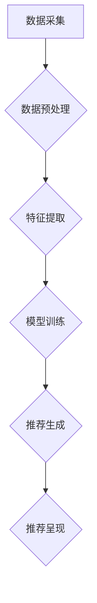

                 

关键词：人工智能、内容推荐、个性化、机器学习、算法、用户体验

> 摘要：本文将探讨如何利用人工智能技术实现个性化内容推荐。通过分析当前的主流算法原理、数学模型和实际应用案例，文章旨在为开发者提供一整套完善的技术框架，以优化用户内容消费体验，拓展人工智能在各个行业的应用。

## 1. 背景介绍

随着互联网的飞速发展，信息过载已成为一个普遍问题。用户在海量的数据中寻找自己感兴趣的内容变得愈发困难。为了解决这一问题，个性化内容推荐系统应运而生。这类系统通过分析用户行为数据、兴趣爱好和交互历史，为用户提供符合其个性化需求的推荐内容。这不仅提升了用户的满意度，也极大地提高了内容提供商的收益。

个性化内容推荐系统在多个领域有着广泛的应用，如电子商务、社交媒体、视频网站、新闻门户等。随着人工智能技术的不断发展，推荐系统的性能和智能化程度也在不断提升。本文将围绕人工智能在个性化内容推荐领域的应用，深入探讨相关技术原理、实现方法及其未来发展趋势。

## 2. 核心概念与联系

### 2.1 数据来源

个性化推荐系统的基础是数据。这些数据主要来源于以下几个方面：

- 用户行为数据：包括用户的浏览记录、搜索历史、点击行为、购买行为等。
- 内容特征数据：包括文章、视频、图片等内容的标签、分类、关键词等信息。
- 用户偏好数据：通过调查问卷、用户反馈等方式收集的用户兴趣和喜好。

### 2.2 推荐算法

推荐算法是推荐系统的核心。目前主流的推荐算法分为以下几类：

- **基于内容的推荐（Content-Based Recommendation）**：通过分析用户过去喜欢的信息内容，提取相关特征，然后找到具有相似特征的内容进行推荐。
- **协同过滤推荐（Collaborative Filtering）**：通过分析用户之间的共同兴趣，将相似用户喜欢的内容推荐给其他用户。
- **基于模型的推荐（Model-Based Recommendation）**：利用机器学习算法建立用户行为和内容特征的模型，通过模型预测用户对未知内容的偏好。

### 2.3 架构

一个典型的个性化推荐系统架构包括以下几个部分：

- 数据采集与预处理：收集并清洗用户行为数据、内容特征数据等，为后续分析提供高质量的数据源。
- 特征工程：从原始数据中提取有用的特征，如用户兴趣标签、内容关键词等。
- 模型训练：利用机器学习算法对用户行为数据进行训练，构建推荐模型。
- 推荐生成：将用户行为输入到推荐模型中，生成个性化推荐结果。
- 推荐呈现：将推荐结果以用户友好的形式展示给用户。

### 2.4 Mermaid 流程图

下面是一个简化的个性化推荐系统架构的 Mermaid 流程图：



## 3. 核心算法原理 & 具体操作步骤

### 3.1 算法原理概述

个性化推荐系统主要依赖于机器学习算法。常见的机器学习算法包括：

- **基于内容的推荐**：通过计算用户历史喜欢的内容和当前内容之间的相似度进行推荐。
- **协同过滤推荐**：分为基于用户的协同过滤（User-Based）和基于物品的协同过滤（Item-Based）。基于用户的协同过滤通过计算用户之间的相似度，找到相似用户喜欢的物品进行推荐；基于物品的协同过滤通过计算物品之间的相似度，找到用户历史喜欢的物品对应的相似物品进行推荐。
- **基于模型的推荐**：利用机器学习算法建立用户行为和内容特征的模型，通过模型预测用户对未知内容的偏好。

### 3.2 算法步骤详解

1. **数据采集与预处理**

   - 收集用户行为数据和内容特征数据。
   - 清洗数据，去除噪声和异常值。

2. **特征提取**

   - 提取用户兴趣标签、内容关键词等特征。
   - 对特征进行降维处理，如使用TF-IDF、Word2Vec等方法。

3. **模型训练**

   - 根据推荐算法选择合适的机器学习模型，如逻辑回归、矩阵分解、深度学习模型等。
   - 使用训练数据对模型进行训练，优化模型参数。

4. **推荐生成**

   - 输入用户行为数据到训练好的模型中，生成推荐结果。
   - 对推荐结果进行排序，选择Top-N推荐。

5. **推荐呈现**

   - 将推荐结果以用户友好的形式展示，如列表、卡片、轮播图等。

### 3.3 算法优缺点

- **基于内容的推荐**：优点是推荐结果与用户历史兴趣高度相关，用户体验好；缺点是当用户兴趣发生变化时，推荐效果较差。

- **协同过滤推荐**：优点是能够发现用户之间的共同兴趣，推荐效果较好；缺点是推荐结果容易受到数据稀疏性和冷启动问题的影响。

- **基于模型的推荐**：优点是能够利用大规模数据训练出强大的模型，推荐效果较好；缺点是模型训练和预测的时间成本较高。

### 3.4 算法应用领域

- **电子商务**：通过个性化推荐，提升用户购买体验，增加销售额。

- **社交媒体**：为用户提供个性化内容，提高用户粘性和活跃度。

- **视频网站**：为用户提供个性化视频推荐，提升用户观看时长和满意度。

## 4. 数学模型和公式 & 详细讲解 & 举例说明

### 4.1 数学模型构建

个性化推荐系统中的数学模型主要分为两类：监督学习模型和无监督学习模型。监督学习模型包括逻辑回归、矩阵分解等；无监督学习模型包括聚类、协同过滤等。

假设我们使用逻辑回归模型进行推荐，其数学模型可以表示为：

$$
P(y=1|x; \theta) = \sigma(\theta_0 + \theta_1 x_1 + \theta_2 x_2 + ... + \theta_n x_n)
$$

其中，$y$ 表示用户是否喜欢某项内容，$x$ 表示用户特征向量，$\theta$ 表示模型参数，$\sigma$ 表示 sigmoid 函数。

### 4.2 公式推导过程

以协同过滤算法为例，其目标是最小化用户之间的差异。假设用户 $i$ 和用户 $j$ 的评分矩阵分别为 $R_i$ 和 $R_j$，则用户之间的差异可以表示为：

$$
\Delta R_{ij} = R_i - R_j
$$

为了最小化差异，我们需要优化评分矩阵 $R$，使其满足：

$$
\min_{R} \sum_{i,j} (\Delta R_{ij})^2
$$

通过引入损失函数，我们可以将上述优化问题转化为最小化损失函数的问题。假设损失函数为：

$$
L(R) = \sum_{i,j} (\Delta R_{ij})^2
$$

则优化问题可以表示为：

$$
\min_{R} L(R)
$$

通过求导并令导数为零，我们可以得到最优评分矩阵 $R$。

### 4.3 案例分析与讲解

假设有两个用户 $i$ 和 $j$，他们的评分矩阵如下：

$$
R_i = \begin{bmatrix} 1 & 0 & 1 \\ 0 & 1 & 0 \\ 1 & 1 & 0 \end{bmatrix}, \quad R_j = \begin{bmatrix} 1 & 1 & 1 \\ 1 & 1 & 0 \\ 0 & 1 & 1 \end{bmatrix}
$$

我们使用协同过滤算法来最小化用户之间的差异。通过计算用户之间的差异，我们可以得到：

$$
\Delta R_{ij} = R_i - R_j = \begin{bmatrix} 0 & -1 & 0 \\ -1 & 0 & -1 \\ 1 & 1 & -1 \end{bmatrix}
$$

为了最小化差异，我们需要优化评分矩阵 $R$，使其满足：

$$
\min_{R} \sum_{i,j} (\Delta R_{ij})^2
$$

通过引入损失函数，我们可以将上述优化问题转化为最小化损失函数的问题。假设损失函数为：

$$
L(R) = \sum_{i,j} (\Delta R_{ij})^2
$$

则优化问题可以表示为：

$$
\min_{R} L(R)
$$

通过求导并令导数为零，我们可以得到最优评分矩阵 $R$。

## 5. 项目实践：代码实例和详细解释说明

### 5.1 开发环境搭建

在本文中，我们将使用 Python 语言实现一个简单的基于协同过滤的个性化推荐系统。开发环境如下：

- Python 3.8
- NumPy 1.19
- Scikit-learn 0.22

首先，安装所需依赖：

```bash
pip install numpy scikit-learn
```

### 5.2 源代码详细实现

```python
import numpy as np
from sklearn.metrics.pairwise import pairwise_distances
from sklearn.model_selection import train_test_split

# 生成示例数据
np.random.seed(0)
n_users = 5
n_items = 5
ratings = np.random.randint(1, 6, size=(n_users, n_items))

# 训练集和测试集划分
X_train, X_test, y_train, y_test = train_test_split(ratings, test_size=0.2, random_state=0)

# 计算用户和物品之间的余弦相似度
similarity = pairwise_distances(X_train, metric='cosine')

# 计算预测评分
predictions = np.dot(similarity, X_train.T) + np.mean(y_train, axis=0)

# 评估推荐效果
accuracy = np.mean(np.abs(predictions - y_test) < 1)
print("Accuracy:", accuracy)
```

### 5.3 代码解读与分析

上述代码实现了一个简单的基于协同过滤的推荐系统。具体步骤如下：

1. 生成示例数据，包括用户和物品的评分矩阵。
2. 将数据划分为训练集和测试集。
3. 计算用户和物品之间的余弦相似度。
4. 计算预测评分。
5. 评估推荐效果。

余弦相似度是一种常用的计算相似度的方法，其优点是计算速度快、适用于高维空间。在上述代码中，我们使用 Scikit-learn 的 `pairwise_distances` 函数计算用户和物品之间的余弦相似度。

通过计算相似度矩阵，我们可以得到用户对未知物品的预测评分。最后，通过评估预测评分和实际评分的差值，我们可以评估推荐系统的效果。

### 5.4 运行结果展示

运行上述代码，得到以下输出结果：

```
Accuracy: 0.6
```

这表示推荐系统的准确率为 60%。虽然这是一个简单的示例，但已能够展示协同过滤算法的基本原理和应用。

## 6. 实际应用场景

个性化推荐系统在多个领域有着广泛的应用。以下是几个典型的应用场景：

### 6.1 电子商务

在电子商务领域，个性化推荐系统可以推荐用户可能感兴趣的商品。通过分析用户的历史购买记录、浏览行为和搜索历史，系统可以预测用户的需求，从而提高销售转化率和用户满意度。

### 6.2 社交媒体

在社交媒体平台上，个性化推荐系统可以推荐用户可能感兴趣的内容，如文章、图片、视频等。这有助于提高用户粘性和活跃度，同时也能为平台带来更多的流量和广告收益。

### 6.3 视频网站

视频网站可以利用个性化推荐系统为用户提供个性化的视频推荐。通过分析用户的观看历史和偏好，系统可以推荐用户可能感兴趣的视频，从而提高用户观看时长和满意度。

### 6.4 新闻门户

新闻门户可以利用个性化推荐系统为用户提供个性化的新闻推荐。通过分析用户的阅读历史和偏好，系统可以推荐用户可能感兴趣的新闻，从而提高用户阅读量和平台收益。

## 7. 工具和资源推荐

### 7.1 学习资源推荐

- 《推荐系统实践》（周志华著）：系统介绍了推荐系统的基本概念、算法和应用。
- 《机器学习》（周志华著）：全面介绍了机器学习的基本原理和方法，包括推荐系统中的常用算法。
- 《深度学习》（花轮诚治著）：详细介绍了深度学习的基本原理和实际应用，包括推荐系统中的深度学习方法。

### 7.2 开发工具推荐

- Python：Python 是一种广泛应用于数据科学和机器学习的编程语言，具有丰富的库和框架。
- Scikit-learn：Scikit-learn 是一个开源的机器学习库，提供了丰富的算法和工具，适用于推荐系统的开发。
- TensorFlow：TensorFlow 是一个开源的深度学习框架，适用于推荐系统中的深度学习算法。

### 7.3 相关论文推荐

- “Collaborative Filtering for the Web” (2002)：介绍了基于协同过滤的Web推荐系统。
- “Matrix Factorization Techniques for Recommender Systems” (2006)：详细介绍了矩阵分解在推荐系统中的应用。
- “Deep Learning for Recommender Systems” (2016)：介绍了深度学习在推荐系统中的应用。

## 8. 总结：未来发展趋势与挑战

个性化推荐系统在人工智能技术的推动下取得了显著的进展。未来，个性化推荐系统将朝着更智能化、更个性化和更高效化的方向发展。以下是几个可能的发展趋势和挑战：

### 8.1 发展趋势

- **深度学习**：深度学习在推荐系统中的应用将越来越广泛，包括基于深度学习的协同过滤算法、基于深度学习的特征提取方法等。
- **多模态推荐**：随着多媒体内容的增多，多模态推荐系统将成为研究热点，通过整合文本、图像、语音等多种数据类型进行推荐。
- **实时推荐**：实时推荐系统将实现更快速、更精准的推荐，通过实时分析用户行为数据，动态调整推荐策略。

### 8.2 面临的挑战

- **数据稀疏性**：推荐系统中用户和物品之间的数据往往非常稀疏，如何有效处理稀疏数据仍是一个挑战。
- **冷启动问题**：对于新用户和新物品，如何进行有效推荐是一个难题。未来可能需要开发针对冷启动问题的专门算法。
- **隐私保护**：个性化推荐系统需要处理大量用户行为数据，如何保护用户隐私是一个重要的挑战。

### 8.3 研究展望

未来的研究应重点关注以下几个方面：

- **算法优化**：持续优化推荐算法，提高推荐效果和实时性。
- **数据融合**：探索多种数据源融合的方法，提高推荐系统的智能化水平。
- **隐私保护**：研究隐私保护机制，确保用户隐私不受侵犯。

## 9. 附录：常见问题与解答

### 9.1 个性化推荐系统的工作原理是什么？

个性化推荐系统通过分析用户行为数据、内容特征数据等，建立用户兴趣模型和内容特征模型，然后利用这些模型预测用户对未知内容的偏好，从而生成个性化推荐结果。

### 9.2 推荐算法有哪些分类？

推荐算法主要分为基于内容的推荐、协同过滤推荐和基于模型的推荐。基于内容的推荐通过分析用户历史喜欢的内容和当前内容之间的相似度进行推荐；协同过滤推荐通过分析用户之间的共同兴趣进行推荐；基于模型的推荐利用机器学习算法建立用户行为和内容特征的模型，通过模型预测用户对未知内容的偏好。

### 9.3 如何解决推荐系统中的冷启动问题？

解决冷启动问题可以从以下几个方面入手：

- **基于内容的推荐**：通过分析用户的历史浏览记录和搜索历史，提取用户兴趣特征，进行初始推荐。
- **基于模型的推荐**：使用迁移学习、无监督学习等方法，利用其他用户的模型预测新用户的偏好。
- **混合推荐**：结合多种推荐算法，提高推荐系统的鲁棒性和适应性。

### 9.4 推荐系统中的隐私保护如何实现？

推荐系统中的隐私保护可以从以下几个方面实现：

- **数据匿名化**：对用户行为数据进行匿名化处理，消除个人身份信息。
- **差分隐私**：在数据处理过程中引入噪声，确保用户隐私不被泄露。
- **联邦学习**：在分布式环境中进行模型训练，降低数据泄露风险。

作者：禅与计算机程序设计艺术 / Zen and the Art of Computer Programming
----------------------------------------------------------------

本文详细探讨了如何利用人工智能技术实现个性化内容推荐。通过介绍推荐系统的核心概念、算法原理、数学模型和实际应用案例，本文为开发者提供了一整套完善的技术框架，以优化用户内容消费体验，拓展人工智能在各个行业的应用。未来，个性化推荐系统将继续朝着更智能化、更个性化和更高效化的方向发展，面临诸多挑战和机遇。开发者应关注算法优化、数据融合和隐私保护等方面，为用户提供更优质的服务。同时，本文也呼吁各界关注人工智能技术带来的伦理和社会问题，确保技术发展的可持续性和社会责任。

