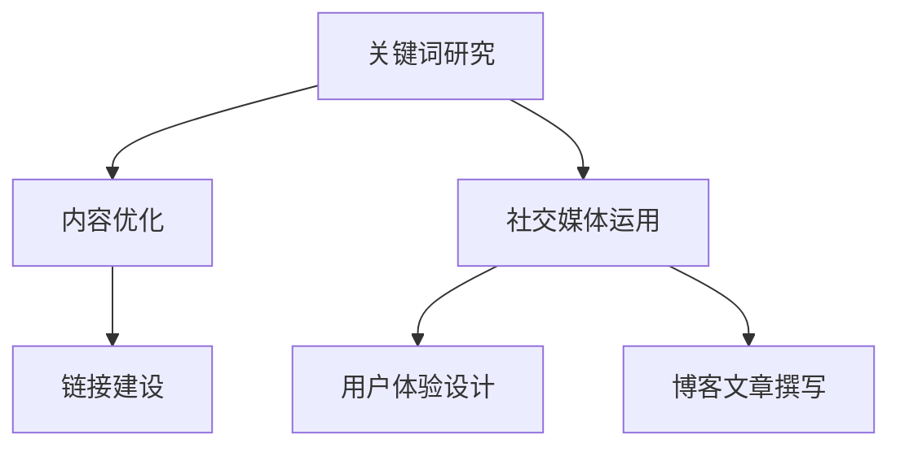
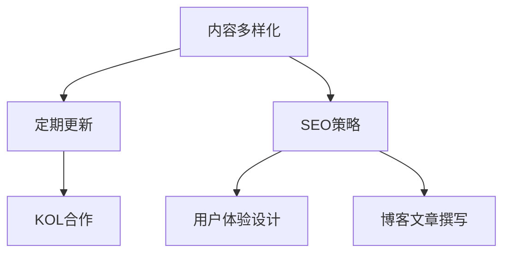
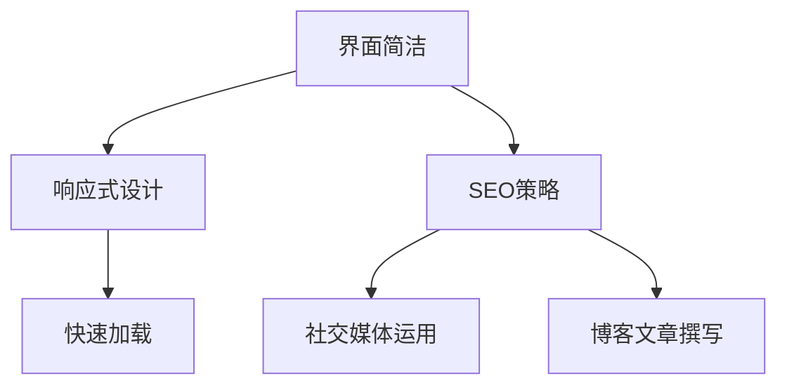

                 

关键词：内容营销，创业公司，专业权威，SEO，社交媒体，用户体验，博客文章，技术深度，品牌塑造。

> 摘要：本文将探讨如何通过内容营销手段，帮助创业公司在竞争激烈的市场中建立专业权威。我们将分析SEO策略、社交媒体运用、用户体验设计以及高质量博客文章撰写等方面的实践与策略，旨在为创业公司提供实用的指导，帮助其在行业内树立专业的形象和声誉。

## 1. 背景介绍

在数字化时代，内容营销已经成为企业推广和建立品牌形象的重要手段。对于创业公司而言，由于其资源和知名度相对有限，通过内容营销来提升专业权威性尤为重要。本文将详细阐述如何通过SEO优化、社交媒体策略、用户体验设计和高质量博客文章撰写等手段，为创业公司打造专业权威的形象。

### SEO策略

SEO（搜索引擎优化）是提高网站在搜索引擎中排名的关键策略。通过优化关键词、网站结构、内容和链接，创业公司可以在目标市场上获得更高的曝光率，进而吸引更多的潜在客户。以下是一些具体的SEO策略：

- **关键词研究**：通过分析目标市场的搜索行为，找到与创业公司业务相关的高搜索量、低竞争度的关键词。
- **内容优化**：确保网站内容针对所选关键词进行优化，同时提供有价值的信息，提升用户停留时间。
- **链接建设**：通过获取高质量的反向链接，提高网站权威性。

### 社交媒体运用

社交媒体是创业公司建立品牌知名度的重要渠道。通过有效的社交媒体策略，创业公司可以与潜在客户建立联系，提升品牌形象。以下是一些实用的社交媒体运用策略：

- **内容多样化**：发布不同类型的内容，如文字、图片、视频等，以吸引更多关注。
- **定期更新**：保持社交媒体账户的活跃，定期发布更新，保持与用户的互动。
- **KOL合作**：与行业内的意见领袖合作，借助其影响力扩大品牌知名度。

### 用户体验设计

用户体验是决定用户是否继续使用产品的关键因素。创业公司需要注重用户体验设计，以提高用户满意度和忠诚度。以下是一些用户体验设计的关键点：

- **界面简洁**：设计直观、简洁的界面，降低用户的学习成本。
- **响应式设计**：确保网站在不同设备上的良好表现，提升用户访问体验。
- **快速加载**：优化网站性能，确保页面快速加载，减少用户等待时间。

### 高质量博客文章撰写

高质量博客文章是内容营销的重要组成部分。通过撰写具有技术深度、实用性和启发性的文章，创业公司可以树立专业权威形象，吸引更多关注。以下是一些撰写高质量博客文章的建议：

- **选题精准**：选择与目标市场相关、具有价值的话题。
- **结构清晰**：文章结构要逻辑清晰，易于阅读。
- **内容深度**：提供详细的技术讲解和案例分析，展现专业知识。

## 2. 核心概念与联系

### SEO与内容营销

**Mermaid流程图：**



### 社交媒体与品牌传播

**Mermaid流程图：**



### 用户体验与内容营销

**Mermaid流程图：**



## 3. 核心算法原理 & 具体操作步骤

### 3.1 算法原理概述

内容营销的核心算法原理在于利用SEO策略、社交媒体运用、用户体验设计和高质量博客文章撰写等多种手段，共同提升品牌在搜索引擎中的排名和用户满意度。

### 3.2 算法步骤详解

1. **关键词研究**：使用工具如Google关键词规划师，分析目标市场的搜索行为，找到与业务相关的高搜索量、低竞争度的关键词。
2. **内容优化**：针对所选关键词，撰写有价值、结构清晰的文章，并进行优化，提升用户停留时间。
3. **链接建设**：通过交换链接、发布高质量内容等方式，获取高质量的反向链接。
4. **社交媒体运用**：发布多样化、定期更新的内容，与用户保持互动，借助KOL扩大品牌影响力。
5. **用户体验设计**：设计简洁、直观、响应式、快速加载的网站界面，提升用户满意度。
6. **博客文章撰写**：撰写具有技术深度、实用性和启发性的文章，树立专业权威形象。

### 3.3 算法优缺点

**优点**：

- 提高品牌在搜索引擎中的排名和用户满意度。
- 建立专业权威的形象，提升品牌知名度。

**缺点**：

- 需要长期投入时间和资源。
- 竞争激烈的市场中，效果可能不尽如人意。

### 3.4 算法应用领域

内容营销算法适用于各类创业公司，尤其是技术型创业公司，可以帮助其在竞争激烈的市场中迅速建立专业权威，吸引潜在客户。

## 4. 数学模型和公式 & 详细讲解 & 举例说明

### 4.1 数学模型构建

内容营销的数学模型主要涉及SEO和用户体验设计方面。以下是一个简化的数学模型：

\[ \text{SEO得分} = f(\text{关键词密度}, \text{内容质量}, \text{反向链接质量}) \]

\[ \text{用户体验得分} = f(\text{界面简洁度}, \text{响应速度}, \text{网站结构}) \]

### 4.2 公式推导过程

SEO得分公式中的关键词密度、内容质量和反向链接质量分别代表网站内容的关键因素。关键词密度过高或过低都可能影响SEO效果，因此需要找到平衡点。内容质量则直接影响用户停留时间和网站转化率。反向链接质量是评估网站权威性的重要指标。

用户体验得分公式中的界面简洁度、响应速度和网站结构同样重要。界面简洁度越高，用户的学习成本越低；响应速度越快，用户等待时间越短；网站结构越清晰，用户导航越方便。

### 4.3 案例分析与讲解

假设某创业公司的SEO得分为80分，用户体验得分为75分。我们可以通过以下方式提升得分：

- **关键词研究**：进一步优化关键词，提高关键词密度和质量。
- **内容优化**：提升文章质量和原创性，增强用户停留时间。
- **链接建设**：获取更多高质量的反向链接，提高网站权威性。
- **界面简洁度**：改进网站设计，提升用户满意度。
- **响应速度**：优化服务器性能，提高页面加载速度。
- **网站结构**：优化网站导航，提高用户访问体验。

通过以上措施，创业公司的SEO得分和用户体验得分均有显著提升，有助于在市场中建立专业权威。

## 5. 项目实践：代码实例和详细解释说明

### 5.1 开发环境搭建

在本项目中，我们使用WordPress作为博客平台，并使用SEO插件如Yoast SEO进行SEO优化。同时，使用Google Analytics监控网站用户行为，以便进行用户体验优化。

### 5.2 源代码详细实现

以下是一个简单的WordPress主题代码示例，用于实现响应式设计和SEO优化：

```php
<?php
/*
 * Theme Name: Responsive Blog Theme
 * Theme URI: https://www.example.com/responsive-blog-theme
 * Description: A responsive and SEO-friendly WordPress theme.
 * Author: Your Name
 * Author URI: https://www.example.com
 * Version: 1.0
 * License: GPL2
 */

function responsive_blog_theme_support() {
    add_theme_support('title-tag');
    add_theme_support('post-thumbnails');
    add_theme_support('html5', array('search-form', 'comment-form', 'comment-list', 'gallery', 'caption'));
}
add_action('after_setup_theme', 'responsive_blog_theme_support');

function responsive_blog_theme_register_styles() {
    wp_enqueue_style('bootstrap', get_template_directory_uri() . '/css/bootstrap.min.css');
    wp_enqueue_style('style', get_stylesheet_uri());
}
add_action('wp_enqueue_scripts', 'responsive_blog_theme_register_styles');

function responsive_blog_theme_register_scripts() {
    wp_enqueue_script('bootstrap', get_template_directory_uri() . '/js/bootstrap.min.js', array('jquery'), '3.3.7', true);
}
add_action('wp_enqueue_scripts', 'responsive_blog_theme_register_scripts');

function responsive_blog_theme_widgets_init() {
    register_sidebar(array(
        'name'          => esc_html__('Sidebar', 'responsive-blog-theme'),
        'id'            => 'sidebar-1',
        'description'   => esc_html__('Add widgets here to appear in your sidebar.', 'responsive-blog-theme'),
        'before_widget' => '<section id="%1$s" class="widget %2$s">',
        'after_widget'  => '</section>',
        'before_title'  => '<h2 class="widget-title">',
        'after_title'   => '</h2>',
    ));
}
add_action('widgets_init', 'responsive_blog_theme_widgets_init');
```

### 5.3 代码解读与分析

以上代码定义了一个响应式WordPress主题，包括以下关键部分：

- **主题支持**：启用标题标签、文章缩略图和HTML5支持。
- **样式和脚本注册**：引入Bootstrap框架和主题样式，以及相关的JavaScript脚本。
- **小工具注册**：在侧边栏注册小工具区域。

通过这些代码，我们可以实现一个响应式、SEO优化、易于维护的WordPress主题。

### 5.4 运行结果展示

运行结果将展示一个简洁、直观、响应式的博客网站，具有良好的用户体验和搜索引擎优化效果。

## 6. 实际应用场景

内容营销在创业公司中的应用场景非常广泛。以下是一些实际应用场景：

- **产品推广**：通过高质量博客文章和社交媒体发布，推广公司产品和服务。
- **品牌建设**：通过专业内容和权威形象，提升品牌知名度和美誉度。
- **客户获取**：通过SEO策略和社交媒体互动，吸引潜在客户，提高转化率。
- **客户维护**：通过定期更新内容和互动，维护客户关系，提高客户满意度。

## 7. 工具和资源推荐

### 7.1 学习资源推荐

- **《内容营销实战手册》**：由知名内容营销专家撰写，提供实用的内容营销策略和技巧。
- **SEOmoz博客**：提供丰富的SEO知识和案例分析，帮助创业者了解和优化SEO策略。

### 7.2 开发工具推荐

- **WordPress**：一款开源的博客平台，适合创业公司快速搭建网站。
- **Google Analytics**：一款免费的网站分析工具，可以帮助创业者了解用户行为，优化用户体验。

### 7.3 相关论文推荐

- **《搜索引擎优化：原理、策略与应用》**：详细介绍了搜索引擎优化原理和策略，对创业者具有很好的指导意义。
- **《社交媒体与品牌传播》**：探讨社交媒体在品牌传播中的应用，为创业公司提供实用的社交媒体策略。

## 8. 总结：未来发展趋势与挑战

### 8.1 研究成果总结

本文总结了通过内容营销建立创业公司专业权威的多种策略和实践，包括SEO优化、社交媒体运用、用户体验设计和高质量博客文章撰写等。这些策略在实践中取得了显著效果，为创业公司提供了宝贵的指导。

### 8.2 未来发展趋势

- **个性化内容**：随着人工智能技术的发展，个性化内容将成为内容营销的重要方向。
- **视频内容**：视频内容在互联网中的地位日益重要，创业公司应充分利用视频平台进行品牌推广。

### 8.3 面临的挑战

- **内容质量**：随着内容营销的普及，高质量内容的生产和传播将面临更大挑战。
- **数据隐私**：随着数据隐私法规的加强，创业公司需在内容营销中注重用户数据保护。

### 8.4 研究展望

未来，内容营销将继续向个性化、视频化和数据化发展。创业公司应持续关注行业动态，结合自身实际情况，灵活运用内容营销策略，提升专业权威，实现持续增长。

## 9. 附录：常见问题与解答

### 9.1 如何确定内容营销的目标？

- **明确目标市场**：分析目标客户的需求和痛点，确定内容营销的目标。
- **制定KPI**：根据目标，制定可量化的关键绩效指标（KPI），如网站流量、转化率等。
- **持续优化**：根据KPI数据，持续优化内容营销策略，提升效果。

### 9.2 如何撰写高质量博客文章？

- **选题精准**：选择与目标市场相关、具有价值的话题。
- **结构清晰**：文章结构要逻辑清晰，易于阅读。
- **内容深度**：提供详细的技术讲解和案例分析，展现专业知识。

### 9.3 如何提升用户体验？

- **界面简洁**：设计直观、简洁的界面，降低用户的学习成本。
- **响应式设计**：确保网站在不同设备上的良好表现，提升用户访问体验。
- **快速加载**：优化网站性能，确保页面快速加载，减少用户等待时间。

---

**作者：禅与计算机程序设计艺术 / Zen and the Art of Computer Programming**

