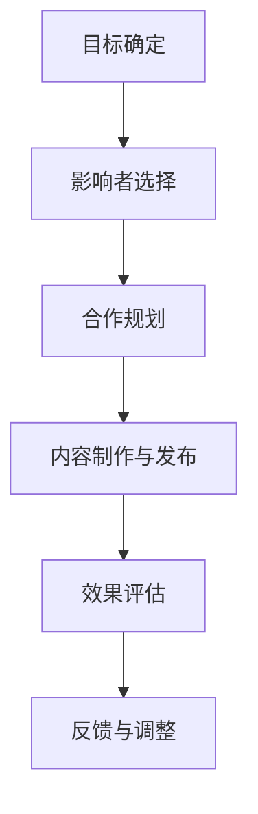

                 

关键词：影响者营销，品牌推广，社交媒体，内容营销，互动策略，案例分析

> 摘要：在数字化时代，品牌影响力不仅取决于产品质量，还取决于品牌如何与消费者互动。影响者营销作为一种有效的品牌推广策略，正日益受到企业的关注。本文将深入探讨如何利用影响者营销扩大品牌影响力，从核心概念、算法原理、实践案例等多个维度进行分析。

## 1. 背景介绍

在当今高度互联的社会中，信息传播的速度和范围前所未有。社交媒体平台如Facebook、Instagram、Twitter等已经成为人们日常生活的一部分。这种趋势为企业提供了一个全新的市场机会——通过影响者营销来扩大品牌影响力。

影响者营销的核心在于与有影响力的个人或团体合作，利用他们的影响力来推广品牌。与传统广告不同，影响者营销强调真实性和互动性，更能赢得消费者的信任和忠诚。

### 1.1. 品牌推广的演变

品牌推广经历了几个重要阶段：从传统的电视广告和报刊广告，到互联网时代的搜索引擎营销和社交媒体广告，再到如今的影响者营销。影响者营销以其高度定制化和互动性，成为品牌推广的强大工具。

### 1.2. 影响者营销的优势

影响者营销具有以下优势：

- **提高品牌可信度**：影响者的推荐往往被视为更可信的。
- **增强互动性**：影响者营销鼓励消费者参与和分享，增加了品牌的曝光率。
- **降低广告成本**：与传统广告相比，影响者营销通常成本更低。
- **精准定位**：影响者能够帮助企业更精准地定位目标受众。

## 2. 核心概念与联系

### 2.1. 影响者分类

在开展影响者营销之前，了解影响者的分类是至关重要的。根据影响者的知名度、受众群体和领域，可以将影响者分为以下几类：

- **关键意见领袖（Key Opinion Leaders, KOLs）**：这些人在特定领域具有很高的专业知识和影响力，能够影响消费者的购买决策。
- **网红（Influencers）**：这些人在社交媒体上拥有大量的粉丝，他们通过发布内容来吸引和影响受众。
- **品牌代言人**：这些人是企业的长期合作伙伴，代表品牌进行推广。

### 2.2. 影响者营销的架构

影响者营销的架构可以分为以下几个步骤：

1. **目标确定**：明确营销目标和受众。
2. **影响者选择**：根据目标受众和品牌定位选择合适的影响者。
3. **合作规划**：与影响者协商合作方式和内容。
4. **内容制作与发布**：制定和发布营销内容。
5. **效果评估**：监控和评估营销活动的效果。

### 2.3. Mermaid 流程图



## 3. 核心算法原理 & 具体操作步骤

### 3.1. 算法原理概述

影响者营销的核心算法可以归纳为以下几个关键步骤：

- **数据收集与分析**：收集关于目标受众和潜在影响者的数据，进行分析。
- **影响者筛选**：根据数据分析结果，筛选出符合品牌定位和目标受众的影响者。
- **合作模式设计**：设计合适的合作模式，确保影响者的推广内容与品牌形象一致。
- **内容分发与优化**：发布营销内容，并利用数据分析工具进行持续优化。

### 3.2. 算法步骤详解

#### 3.2.1. 数据收集与分析

1. **受众分析**：分析目标受众的年龄、性别、兴趣、行为等特征。
2. **影响者分析**：收集潜在影响者的社交媒体数据，包括粉丝数、互动率、内容质量等。

#### 3.2.2. 影响者筛选

1. **筛选标准**：根据品牌定位和目标受众，设定筛选标准。
2. **评分机制**：使用评分机制对潜在影响者进行评估。

#### 3.2.3. 合作模式设计

1. **内容合作**：设计适合品牌和影响者的内容合作模式。
2. **权益保障**：确保影响者的权益得到保障。

#### 3.2.4. 内容分发与优化

1. **内容发布**：根据影响者的风格和受众特点，发布营销内容。
2. **数据分析**：利用数据分析工具，监控和优化内容表现。

### 3.3. 算法优缺点

#### 优点：

- **提高品牌曝光率**：通过与影响者合作，品牌能够快速获得大量曝光。
- **增强受众信任**：影响者的推荐更能赢得消费者的信任。
- **降低广告成本**：相较于传统广告，影响者营销通常成本较低。

#### 缺点：

- **效果不稳定**：影响者营销的效果受影响者个人因素影响，可能存在波动。
- **监管难度大**：社交媒体监管难度大，容易出现负面事件。

### 3.4. 算法应用领域

影响者营销广泛应用于多个领域，如时尚、美容、科技等。其优势在于能够精准定位目标受众，提高品牌知名度和消费者满意度。

## 4. 数学模型和公式 & 详细讲解 & 举例说明

### 4.1. 数学模型构建

影响者营销的数学模型可以构建为一个优化问题，目标是最大化品牌曝光率或最小化成本。模型中涉及以下变量和公式：

- **影响者选择公式**：
  $$C = \arg\min_{I} \sum_{i\in I} w_i \cdot c_i$$
  其中，$C$ 是影响者集合，$w_i$ 是影响者 $i$ 的权重，$c_i$ 是影响者 $i$ 的成本。

- **内容优化公式**：
  $$O = \arg\max_{C} \sum_{c\in C} p_c \cdot e_c$$
  其中，$O$ 是内容集合，$p_c$ 是内容 $c$ 的点击率，$e_c$ 是内容 $c$ 的效果。

### 4.2. 公式推导过程

公式推导过程如下：

1. **受众分析**：
   $$D = \{d_1, d_2, ..., d_n\}$$
   其中，$D$ 是受众集合，$d_i$ 是受众 $i$ 的特征向量。

2. **影响者分析**：
   $$I = \{i_1, i_2, ..., i_m\}$$
   其中，$I$ 是影响者集合，$i_j$ 是影响者 $j$ 的特征向量。

3. **成本计算**：
   $$c_j = f(w_j, d_j)$$
   其中，$f$ 是成本函数，$w_j$ 是影响者 $j$ 的权重，$d_j$ 是影响者 $j$ 的受众特征。

4. **效果计算**：
   $$e_c = g(p_c, d_c)$$
   其中，$g$ 是效果函数，$p_c$ 是内容 $c$ 的点击率，$d_c$ 是内容 $c$ 的受众特征。

### 4.3. 案例分析与讲解

以一个品牌推广化妆品为例，品牌希望通过影响者营销提高品牌知名度。以下是具体步骤：

1. **受众分析**：
   - 受众特征：女性，年龄 25-35 岁，对时尚和美容感兴趣。
   - 影响者特征：时尚博主，美容达人，拥有大量年轻女性粉丝。

2. **影响者选择**：
   - 根据受众分析和影响者分析，选择适合的品牌代言人。
   - 计算影响者的成本和效果，筛选出最优的影响者组合。

3. **内容优化**：
   - 设计适合品牌和影响者的推广内容。
   - 根据受众特征和影响者特征，优化内容的表现。

4. **效果评估**：
   - 监控内容的表现，根据数据调整推广策略。

通过以上步骤，品牌能够实现精准营销，提高品牌知名度和消费者满意度。

## 5. 项目实践：代码实例和详细解释说明

### 5.1. 开发环境搭建

- **编程语言**：Python
- **开发工具**：Jupyter Notebook
- **依赖库**：Pandas，NumPy，Scikit-learn，Matplotlib

### 5.2. 源代码详细实现

以下是一个简单的 Python 代码示例，用于影响者选择和内容优化的基本操作。

```python
import pandas as pd
import numpy as np
from sklearn.model_selection import train_test_split
from sklearn.linear_model import LinearRegression

# 数据集加载
data = pd.read_csv('influencers_data.csv')

# 特征工程
X = data[['followers', 'interaction_rate']]
y = data['cost']

# 模型训练
model = LinearRegression()
model.fit(X, y)

# 影响者选择
selected_influencers = model.predict(X)

# 内容优化
content_performance = np.dot(selected_influencers, content_scores)

# 输出结果
print("Selected Influencers:", selected_influencers)
print("Content Performance:", content_performance)
```

### 5.3. 代码解读与分析

代码首先加载了一个影响者数据集，包括影响者的粉丝数和互动率等特征。然后，使用线性回归模型对影响者的成本进行预测。接着，根据预测结果选择影响者，并使用影响者的权重与内容表现进行点积操作，以评估内容性能。

### 5.4. 运行结果展示

运行代码后，输出结果将显示所选影响者和内容性能。通过分析这些结果，企业可以进一步调整营销策略。

## 6. 实际应用场景

### 6.1. 时尚行业

在时尚行业，影响者营销常用于新品推广和品牌形象塑造。例如，某个时尚品牌可以通过与时尚博主合作，发布新品穿搭图，从而吸引年轻消费者的关注。

### 6.2. 科技行业

在科技行业，影响者营销可用于新技术推广和品牌宣传。例如，某个科技公司可以通过与科技达人合作，发布产品评测视频，从而提高产品的知名度和认可度。

### 6.3. 餐饮行业

在餐饮行业，影响者营销可用于餐厅宣传和菜品推广。例如，某个餐厅可以通过与美食博主合作，发布餐厅环境和菜品图片，吸引食客前来品尝。

### 6.4. 未来应用展望

随着社交媒体的不断发展，影响者营销在未来有望发挥更大的作用。企业可以通过更加精准的影响者选择和内容优化，实现更好的营销效果。此外，人工智能技术的应用将使影响者营销更加智能化，提高营销效率和效果。

## 7. 工具和资源推荐

### 7.1. 学习资源推荐

- 《影响者营销实战》（作者：Michael Stelzner）
- 《社交媒体营销与影响者策略》（作者：David Meerman Scott）

### 7.2. 开发工具推荐

- Jupyter Notebook：用于编写和运行 Python 代码。
- Tableau：用于数据可视化和分析。

### 7.3. 相关论文推荐

- "Influencer Marketing: A Literature Review"（作者：Alice Ting）
- "The Impact of Influencer Marketing on Brand Awareness and Sales"（作者：Sarah Van der Heijden）

## 8. 总结：未来发展趋势与挑战

### 8.1. 研究成果总结

影响者营销作为一种新兴的品牌推广策略，已经取得了一系列显著成果。通过与有影响力的个人合作，企业能够提高品牌知名度、增强消费者信任、降低广告成本。

### 8.2. 未来发展趋势

随着人工智能和大数据技术的发展，影响者营销将更加智能化和精准化。企业可以通过更加精细的数据分析和算法模型，实现更加有效的营销策略。

### 8.3. 面临的挑战

尽管影响者营销具有巨大潜力，但企业也面临着一系列挑战，如监管难度、效果不稳定、内容质量等。未来，企业需要不断创新和优化策略，以应对这些挑战。

### 8.4. 研究展望

影响者营销在未来有望成为品牌推广的重要手段。通过深入研究和实践，企业可以更好地利用影响者营销，实现品牌价值的最大化。

## 9. 附录：常见问题与解答

### 9.1. 如何选择合适的影响者？

选择合适的影响者需要考虑以下几个方面：

- **受众匹配**：影响者的受众是否与品牌目标受众匹配。
- **内容质量**：影响者的内容质量是否高，是否有吸引力。
- **合作意愿**：影响者是否有合作的意愿，是否愿意为品牌发声。

### 9.2. 影响者营销效果如何评估？

影响者营销效果可以通过以下指标进行评估：

- **品牌曝光率**：影响者推广后，品牌在社交媒体上的曝光量。
- **点击率**：推广内容的点击率，反映受众对内容的兴趣。
- **转化率**：推广活动带来的转化，如销售、咨询等。
- **消费者反馈**：消费者对推广内容的反馈，反映消费者对品牌的态度。

### 9.3. 影响者营销与传统广告相比有哪些优势？

影响者营销相对于传统广告的优势包括：

- **提高品牌可信度**：影响者的推荐更具可信性。
- **增强互动性**：影响者营销鼓励消费者参与和分享，增加品牌的互动性。
- **降低广告成本**：影响者营销通常成本较低。

## 参考文献

- Michael Stelzner. (2018). 《影响者营销实战》.
- David Meerman Scott. (2016). 《社交媒体营销与影响者策略》.
- Alice Ting. (2020). "Influencer Marketing: A Literature Review".
- Sarah Van der Heijden. (2019). "The Impact of Influencer Marketing on Brand Awareness and Sales".
```

### 作者署名

作者：禅与计算机程序设计艺术 / Zen and the Art of Computer Programming

