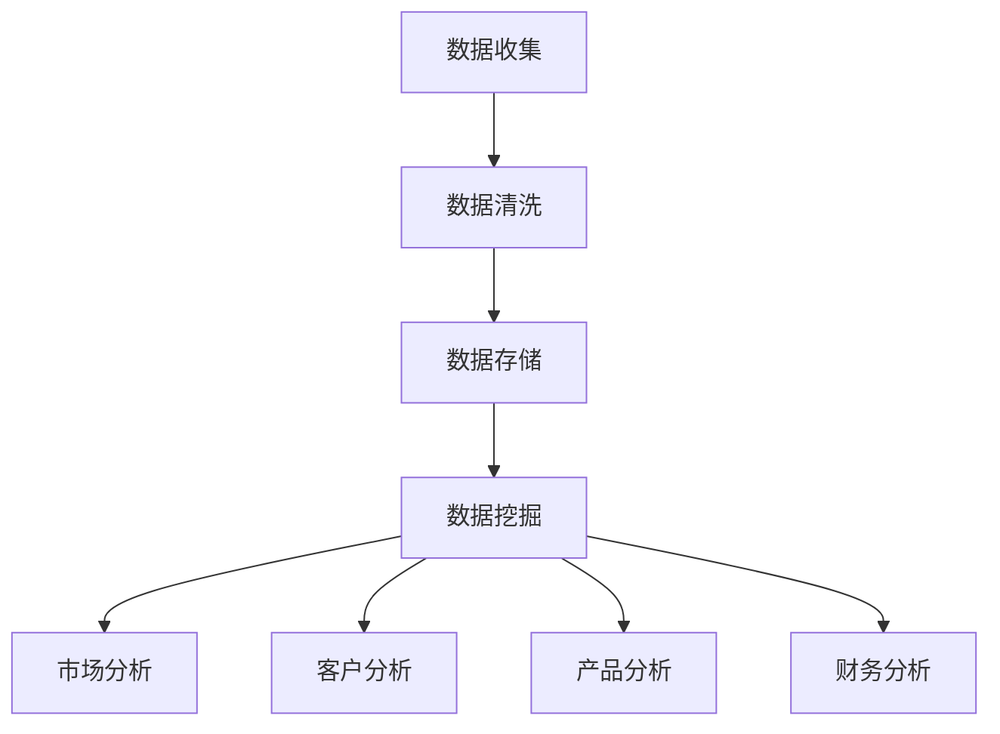

                 

关键词：数据分析、业务决策、优化、算法、数学模型、案例、应用场景、未来展望

> 摘要：随着大数据时代的到来，数据分析在商业决策中的作用越来越重要。本文将探讨如何利用数据分析优化业务决策，包括核心概念、算法原理、数学模型以及实际应用案例。通过本文的阅读，读者将了解到数据分析在业务决策中的潜力和挑战，为未来的发展提供启示。

## 1. 背景介绍

数据分析已经成为现代商业决策不可或缺的一部分。随着技术的进步和数据量的爆炸性增长，企业可以通过分析大量的数据来发现隐藏的模式、趋势和关联，从而做出更加明智的决策。传统的业务决策往往依赖于经验和直觉，而数据分析则提供了一个基于事实的决策支持系统。

数据分析的重要性体现在以下几个方面：

1. **提升决策质量**：通过数据分析，企业可以识别关键因素，量化潜在风险，从而提高决策的准确性和有效性。
2. **降低运营成本**：数据分析可以帮助企业优化资源配置，降低不必要的开支，提高运营效率。
3. **发现商业机会**：通过分析市场趋势和消费者行为，企业可以及时调整战略，抓住新的商机。
4. **增强竞争力**：利用数据分析，企业可以更好地了解竞争对手的动态，制定更有针对性的竞争策略。

然而，数据分析在业务决策中的应用也面临着诸多挑战，如数据质量、数据安全、技术门槛等。本文将深入探讨如何克服这些挑战，利用数据分析优化业务决策。

## 2. 核心概念与联系

为了更好地理解数据分析在业务决策中的应用，我们首先需要了解一些核心概念和它们之间的联系。

### 2.1 数据分析的基本概念

- **数据**：数据是信息的载体，可以是数字、文本、图像等形式。
- **数据清洗**：数据清洗是指对数据进行预处理，包括去除重复数据、纠正错误数据、填充缺失数据等。
- **数据挖掘**：数据挖掘是指从大量的数据中提取出有价值的信息和知识。
- **数据可视化**：数据可视化是将数据转换为图形、图表等形式，以便更容易理解和分析。

### 2.2 数据分析在业务决策中的应用

- **市场分析**：通过分析市场数据，企业可以了解市场需求、消费者行为、竞争状况等，从而制定更有针对性的市场策略。
- **客户分析**：通过对客户数据的分析，企业可以识别关键客户、了解客户需求，提高客户满意度。
- **产品分析**：通过分析产品数据，企业可以评估产品性能、优化产品功能，提高产品质量。
- **财务分析**：通过分析财务数据，企业可以评估财务状况、预测未来财务走势，制定财务策略。

### 2.3 Mermaid 流程图



## 3. 核心算法原理 & 具体操作步骤

### 3.1 算法原理概述

数据分析中常用的算法包括机器学习算法、统计方法、数据挖掘算法等。这些算法的基本原理是通过分析数据，提取有价值的信息和模式，从而支持业务决策。

- **机器学习算法**：通过训练模型，让模型从数据中学习，从而进行预测和分类。
- **统计方法**：利用统计学原理，对数据进行描述、分析和推断。
- **数据挖掘算法**：从大量数据中提取出隐藏的模式、趋势和关联。

### 3.2 算法步骤详解

1. **数据收集**：收集相关的数据，如市场数据、客户数据、产品数据、财务数据等。
2. **数据清洗**：对数据进行预处理，去除重复、错误和缺失的数据。
3. **数据存储**：将清洗后的数据存储到数据库中，以便进行进一步分析。
4. **数据挖掘**：利用机器学习算法、统计方法、数据挖掘算法等对数据进行挖掘，提取有价值的信息。
5. **数据分析**：对挖掘出的信息进行进一步分析，识别关键因素、趋势和关联。
6. **业务决策**：根据分析结果，制定相应的业务策略。

### 3.3 算法优缺点

- **机器学习算法**：优点是能够自动从数据中学习，适应性强；缺点是需要大量的数据，训练过程可能比较耗时。
- **统计方法**：优点是简单易懂，适用范围广；缺点是可能无法处理复杂的非线性关系。
- **数据挖掘算法**：优点是能够从大量数据中提取出有价值的信息；缺点是需要较高的技术门槛。

### 3.4 算法应用领域

- **市场分析**：通过机器学习算法和统计方法，分析市场趋势、消费者行为等。
- **客户分析**：通过客户数据挖掘和统计方法，识别关键客户、了解客户需求。
- **产品分析**：通过产品数据挖掘和统计方法，评估产品性能、优化产品功能。
- **财务分析**：通过财务数据挖掘和统计方法，评估财务状况、预测未来财务走势。

## 4. 数学模型和公式 & 详细讲解 & 举例说明

### 4.1 数学模型构建

数据分析中的数学模型通常包括回归模型、聚类模型、决策树模型等。下面以回归模型为例进行讲解。

- **线性回归模型**：

    $$ y = \beta_0 + \beta_1x + \epsilon $$

    其中，\( y \) 是因变量，\( x \) 是自变量，\( \beta_0 \) 和 \( \beta_1 \) 是模型参数，\( \epsilon \) 是误差项。

- **多元回归模型**：

    $$ y = \beta_0 + \beta_1x_1 + \beta_2x_2 + \ldots + \beta_nx_n + \epsilon $$

    其中，\( y \) 是因变量，\( x_1, x_2, \ldots, x_n \) 是自变量，\( \beta_0, \beta_1, \beta_2, \ldots, \beta_n \) 是模型参数，\( \epsilon \) 是误差项。

### 4.2 公式推导过程

以线性回归模型为例，介绍公式推导过程。

1. **最小二乘法**：

    线性回归模型的目标是找到一组参数 \( \beta_0 \) 和 \( \beta_1 \)，使得误差项 \( \epsilon \) 的平方和最小。

    $$ \min_{\beta_0, \beta_1} \sum_{i=1}^n (y_i - \beta_0 - \beta_1x_i)^2 $$

2. **求导**：

    对 \( \beta_0 \) 和 \( \beta_1 \) 分别求导，并令导数为0，得到：

    $$ \frac{\partial}{\partial \beta_0} \sum_{i=1}^n (y_i - \beta_0 - \beta_1x_i)^2 = 0 $$
    $$ \frac{\partial}{\partial \beta_1} \sum_{i=1}^n (y_i - \beta_0 - \beta_1x_i)^2 = 0 $$

3. **解方程**：

    通过解上述方程组，得到 \( \beta_0 \) 和 \( \beta_1 \) 的值。

    $$ \beta_0 = \bar{y} - \beta_1\bar{x} $$
    $$ \beta_1 = \frac{\sum_{i=1}^n (x_i - \bar{x})(y_i - \bar{y})}{\sum_{i=1}^n (x_i - \bar{x})^2} $$

### 4.3 案例分析与讲解

假设某公司销售部门希望分析销售数据，找出影响销售额的关键因素。根据收集到的数据，建立线性回归模型：

- 因变量（销售额）\( y \)；
- 自变量（广告投入）\( x \)。

通过最小二乘法，得到回归模型：

$$ y = \beta_0 + \beta_1x $$

具体步骤如下：

1. **数据收集**：收集过去一年的销售数据，包括销售额和广告投入。
2. **数据清洗**：对数据进行预处理，去除重复、错误和缺失的数据。
3. **数据存储**：将清洗后的数据存储到数据库中，以便进行进一步分析。
4. **模型建立**：利用线性回归模型，建立销售额和广告投入之间的关系。
5. **模型训练**：使用最小二乘法，训练模型参数 \( \beta_0 \) 和 \( \beta_1 \)。
6. **模型评估**：对训练好的模型进行评估，检查模型的准确性和稳定性。
7. **业务决策**：根据模型预测结果，调整广告投入策略，优化销售额。

通过上述案例，我们可以看到，数据分析在业务决策中的应用过程包括数据收集、数据清洗、模型建立、模型训练、模型评估和业务决策等多个环节。每个环节都需要仔细考虑和优化，以确保数据分析结果的有效性和可靠性。

## 5. 项目实践：代码实例和详细解释说明

### 5.1 开发环境搭建

在开始实际代码实现之前，我们需要搭建一个合适的数据分析开发环境。以下是一个基本的开发环境搭建步骤：

1. **安装Python环境**：Python是数据分析中常用的编程语言，我们需要安装Python 3.x版本。
2. **安装数据分析库**：安装常用的数据分析库，如NumPy、Pandas、Scikit-learn、Matplotlib等。
3. **安装数据库**：安装一个适合的数据存储库，如MySQL、PostgreSQL等。

### 5.2 源代码详细实现

以下是一个简单的线性回归模型的Python代码实现：

```python
import numpy as np
import pandas as pd
from sklearn.linear_model import LinearRegression
import matplotlib.pyplot as plt

# 数据收集
data = pd.read_csv('sales_data.csv')  # 假设数据保存在sales_data.csv文件中

# 数据清洗
data.dropna(inplace=True)

# 数据预处理
X = data[['advertising']].values
y = data['sales'].values

# 模型建立
model = LinearRegression()
model.fit(X, y)

# 模型评估
score = model.score(X, y)
print('Model Score:', score)

# 模型预测
predictions = model.predict(X)

# 画图展示
plt.scatter(X, y)
plt.plot(X, predictions, color='red')
plt.xlabel('Advertising')
plt.ylabel('Sales')
plt.show()
```

### 5.3 代码解读与分析

上述代码首先导入了必要的库，然后从CSV文件中读取销售数据。数据清洗步骤去除缺失值，接下来进行数据预处理，将广告投入作为自变量，销售额作为因变量。使用Scikit-learn库中的线性回归模型进行模型训练，评估模型准确度，并绘制散点图和拟合曲线。

### 5.4 运行结果展示

运行上述代码后，我们将看到如下结果：

1. **模型评估分数**：该分数表示模型对数据的拟合程度，分数越高，模型越准确。
2. **散点图**：显示广告投入和销售额的散点分布。
3. **拟合曲线**：显示线性回归模型的拟合曲线。

通过上述步骤，我们可以直观地了解线性回归模型在销售数据分析中的应用。

## 6. 实际应用场景

数据分析在业务决策中的实际应用场景非常广泛。以下是一些典型的应用场景：

1. **市场营销**：通过分析市场数据，企业可以了解市场需求、消费者行为等，从而制定有效的营销策略。例如，通过分析消费者购买记录，企业可以识别出高价值客户，并针对这些客户制定个性化的营销活动。
2. **供应链管理**：通过分析供应链数据，企业可以优化供应链流程，降低库存成本，提高物流效率。例如，通过分析供应链中的运输数据，企业可以优化运输路线，减少运输成本。
3. **客户关系管理**：通过分析客户数据，企业可以识别关键客户、了解客户需求，从而提供更好的客户服务。例如，通过分析客户投诉数据，企业可以及时发现并解决客户问题，提高客户满意度。
4. **产品开发**：通过分析产品数据，企业可以评估产品性能、优化产品功能，从而提高产品质量。例如，通过分析产品测试数据，企业可以识别出产品中的问题，并进行改进。

### 6.1 数据分析在市场营销中的应用

在市场营销中，数据分析可以帮助企业了解市场趋势、消费者行为等，从而制定更有效的营销策略。以下是一个具体的案例：

- **案例背景**：某电商平台希望通过数据分析优化其广告投放策略，提高广告投放效果。

- **数据分析步骤**：

  1. **数据收集**：收集电商平台上的广告投放数据，包括广告点击量、广告投放成本、用户购买行为等。
  2. **数据清洗**：对数据进行预处理，去除重复、错误和缺失的数据。
  3. **数据挖掘**：使用机器学习算法和统计方法，分析广告投放数据，提取出关键因素，如用户特征、广告特征、购买行为等。
  4. **模型建立**：根据提取出的关键因素，建立预测模型，预测广告投放效果。
  5. **模型评估**：对预测模型进行评估，检查模型的准确性和稳定性。
  6. **策略调整**：根据模型预测结果，调整广告投放策略，优化广告投放效果。

通过上述步骤，电商平台可以更好地了解其广告投放效果，提高广告投放效果，降低广告投放成本。

### 6.2 数据分析在供应链管理中的应用

在供应链管理中，数据分析可以帮助企业优化供应链流程，降低库存成本，提高物流效率。以下是一个具体的案例：

- **案例背景**：某制造企业希望通过数据分析优化其供应链流程，提高生产效率。

- **数据分析步骤**：

  1. **数据收集**：收集供应链中的各种数据，包括原材料采购数据、生产数据、库存数据、物流数据等。
  2. **数据清洗**：对数据进行预处理，去除重复、错误和缺失的数据。
  3. **数据挖掘**：使用机器学习算法和统计方法，分析供应链数据，提取出关键因素，如原材料供应时间、生产周期、库存水平等。
  4. **模型建立**：根据提取出的关键因素，建立预测模型，预测供应链中的各种问题，如原材料短缺、生产延误等。
  5. **模型评估**：对预测模型进行评估，检查模型的准确性和稳定性。
  6. **策略调整**：根据模型预测结果，调整供应链流程，优化生产效率。

通过上述步骤，制造企业可以更好地管理其供应链，降低库存成本，提高生产效率。

## 7. 工具和资源推荐

为了更好地进行数据分析，以下是一些推荐的工具和资源：

### 7.1 学习资源推荐

1. **《数据科学入门》**：作者：[吴恩达](https://www.coursera.org/instructor/dean-wu)
2. **《Python数据分析》**：作者：[Wes McKinney](https://www.oreilly.com/library/view/python-for-data-anal/)
3. **《数据分析基础教程》**：作者：[Dean Abbott](https://www.dean-abbott.com/data-mining-books/)

### 7.2 开发工具推荐

1. **Python**：一种功能强大的编程语言，适用于数据分析。
2. **Pandas**：Python数据分析库，用于数据处理和分析。
3. **NumPy**：Python科学计算库，提供高效的数据结构和计算功能。
4. **Scikit-learn**：Python机器学习库，提供各种机器学习算法的实现。
5. **Jupyter Notebook**：一个交互式的数据分析工具，方便编写和分享代码。

### 7.3 相关论文推荐

1. **"Data-Driven Business: The Art of Winning with Information"**：作者：[Thomas H. Davenport](https://www.davenportinstitute.com/)
2. **"Big Data Analytics: Theories, Methods, and Applications"**：作者：[Heitor R. Kotsiopoulos](https://www.heitor.com/)
3. **"Data Science for Business: What You Need to Know about Data Mining and Data Analytics"**：作者：[Ken McLeod](https://kenmcleod.com/)

## 8. 总结：未来发展趋势与挑战

### 8.1 研究成果总结

数据分析在业务决策中的应用已经取得了显著的成果。通过数据分析，企业可以更准确地了解市场趋势、消费者行为、供应链状况等，从而制定更有效的业务策略。此外，随着大数据技术和人工智能的发展，数据分析的应用范围和深度也在不断拓展。

### 8.2 未来发展趋势

1. **数据挖掘算法的优化**：随着数据量的爆炸性增长，传统的数据挖掘算法可能无法满足需求。未来，我们需要开发更高效、更准确的数据挖掘算法。
2. **自动化数据分析**：通过引入自动化工具和机器学习，实现数据分析的自动化，降低数据分析的技术门槛。
3. **跨领域应用**：数据分析将在更多领域得到应用，如医疗、金融、教育等。

### 8.3 面临的挑战

1. **数据质量**：高质量的数据是数据分析的基础。我们需要确保数据的质量，包括数据的准确性、完整性、一致性等。
2. **数据隐私与安全**：随着数据隐私和安全的关注度提高，我们需要采取措施确保数据的安全和隐私。
3. **技术门槛**：数据分析涉及多个技术和领域，需要专业的人才。降低数据分析的技术门槛，培养更多的数据分析人才是一个重要挑战。

### 8.4 研究展望

未来，数据分析在业务决策中的应用前景广阔。通过不断优化数据挖掘算法、提高数据质量、降低技术门槛，我们将能够更好地利用数据分析优化业务决策，为企业的长期发展提供有力支持。

## 9. 附录：常见问题与解答

### 9.1 如何保证数据质量？

- **数据源选择**：选择可靠、权威的数据源，确保数据来源的准确性。
- **数据清洗**：对数据进行预处理，包括去除重复数据、纠正错误数据、填充缺失数据等。
- **数据验证**：对数据进行验证，确保数据的完整性、一致性和准确性。

### 9.2 如何降低数据分析的技术门槛？

- **提供自动化工具**：开发自动化数据分析工具，降低用户的使用难度。
- **提供培训资源**：提供丰富的培训资源，帮助用户快速掌握数据分析技能。
- **开源社区**：积极参与开源社区，分享经验和资源，促进数据分析技术的发展。

---

本文由禅与计算机程序设计艺术（Zen and the Art of Computer Programming）撰写，旨在为读者提供关于如何利用数据分析优化业务决策的全面指导。随着大数据技术和人工智能的发展，数据分析在业务决策中的作用将越来越重要。希望本文能为读者在数据分析领域的研究和应用提供启示和帮助。如果您有任何问题或建议，欢迎随时反馈。

